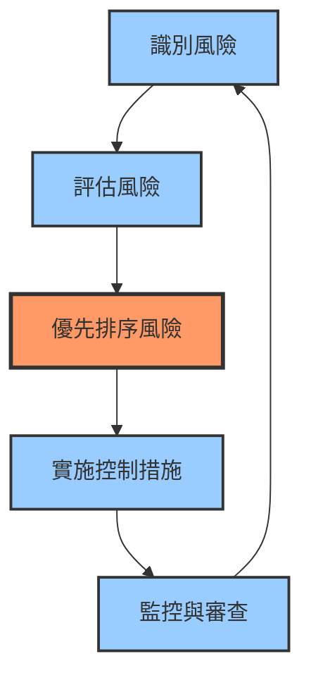

每個組織都依賴技術。電子郵件系統促進溝通。資料庫儲存客戶資訊。應用程式處理交易。網路連接辦公室。這種依賴性帶來風險——技術故障可能中斷營運、洩露資料並損害聲譽。

IT 風險管理系統性地應對這些威脅。組織不是被動應對事件，而是識別潛在風險、評估其影響，並實施控制措施以降低風險暴露。這種主動方法在實現技術創新的同時保護業務價值。

挑戰在於平衡安全性與業務需求。過度的控制會減緩營運並讓使用者感到挫折。控制不足則會讓組織暴露於不可接受的風險中。有效的 IT 風險管理找到正確的平衡點——在實現業務目標的同時保護關鍵資產。

本文探討 IT 風險管理的基礎知識，從識別風險到實施控制措施。理解這些原則有助於組織在保持營運效率的同時保護自己。

## 理解 IT 風險

在管理風險之前，理解什麼構成 IT 風險至關重要。

### 什麼是 IT 風險？

IT 風險代表與技術相關的事件對業務目標產生負面影響的潛在可能性。四個組成要素定義 IT 風險：

!!!anote "⚡ 威脅"
    可能利用弱點的潛在危害來源。

**外部威脅**：源自組織外部。駭客嘗試未經授權的存取、惡意軟體感染系統、勒索軟體加密資料以勒索贖金、自然災害損壞基礎設施。

**內部威脅**：源自組織內部。員工進行配置錯誤、意外刪除資料，或濾用存取權限。系統故障由於軟體錯誤或設計缺陷而發生。

**環境威脅**：基礎設施和設施問題。停電中斷營運、硬體故障導致資料遺失、冷卻系統故障損壞設備、網路連接問題阻止存取。

!!!anote "🔓 弱點"
    可被威脅利用的弱點。

**未修補的軟體**：系統執行具有已知安全缺陷的過時版本。攻擊者在應用修補程式之前利用已公開的弱點。

**弱密碼**：簡單、容易猜測的憑證，如「password123」或「admin」。使暴力破解攻擊和憑證填充攻擊成為可能。

**配置錯誤的系統**：預設設定未更改、不必要的服務啟用、過於寬鬆的存取控制。創造意外的安全空白。

**不足的控制措施**：缺少加密、沒有多因素身份驗證、日誌記錄不足、缺乏網路分段。讓系統暴露。

**缺少安全更新**：未能及時應用修補程式、過時的防病毒定義、不再支援的舊系統。維持可利用的弱點。

!!!anote "💥 影響"
    風險實現時的後果。

**財務損失**：直接成本包括事件回應、鑑證、法律費用、通知費用。停機、客戶流失、合約處罰導致的收入損失。系統恢復和資料復原的復原成本。

**營運中斷**：系統停機阻止業務營運。員工無法工作導致的生產力損失。服務降級影響客戶體驗。整合失敗破壞業務流程。

**聲譽損害**：負面宣傳和媒體報導造成的品牌傷害。客戶信任侵蝕導致業務損失。合作夥伴信心下降影響關係。上市公司的市場價值下降。

**監管處罰**：違反 GDPR、HIPAA、PCI DSS 或其他法規的罰款。包括訴訟和和解的法律後果。強制性稽核和補救要求。嚴重違規可能面臨刑事起訴。

!!!anote "🎲 可能性"
    風險發生的機率。

**歷史頻率**：過去類似事件發生的頻率。經常遇到網路釣魚嘗試的組織面臨更高的成功攻擊可能性。產業趋勢顯示常見的攻擊模式。

**威脅能力**：潛在攻擊者的複雜性和資源。國家級攻擊者具有進階能力。腳本小子使用自動化工具。內部威脅擁有特權存取和知識。

**弱點嚴重性**：弱點被利用的難易程度。具有公開利用程式的關鍵弱點具有高可能性。需要專業知識的複雜弱點具有較低的可能性。

**現有控制措施有效性**：強大的控制措施顯著降低可能性。多因素身份驗證防止 99% 的帳戶洩露。弱或缺少的控制措施讓系統暴露於利用。

當威脅可以利用弱點造成影響時，風險就存在。沒有弱點的威脅不會產生風險。沒有威脅的弱點不會產生立即風險。兩者必須同時存在才能實現風險。

### 風險全景

現代 IT 環境呈現出一個不斷演變的複雜互聯風險網絡。組織不再面對孤立的威脅——單一弱點可能在系統間級聯，同時觸發多個風險類別。勒索軟體攻擊（安全風險）導致系統停機（營運風險），觸發監管報告義務（合規風險），並暴露不足的備份策略（策略風險）。理解這個全景意味著認識到風險不存在於孤島中——它們相互作用、相互放大，需要解決根本原因而非症狀的整體管理方法。

組織面臨多樣化的 IT 風險：

!!!error "🚫 常見 IT 風險"
    **安全風險**
    - 資料外洩和竊取
    - 未經授權的存取
    - 惡意軟體和勒索軟體
    - 內部威脅
    - 社交工程攻擊
    
    **營運風險**
    - 系統故障和停機
    - 資料遺失或損壞
    - 效能下降
    - 整合失敗
    - 容量限制
    
    **合規風險**
    - 違反法規
    - 隱私外洩
    - 稽核失敗
    - 合約不合規
    - 法律責任
    
    **策略風險**
    - 技術過時
    - 供應商依賴
    - 專案失敗
    - 架構決策不當
    - 災難復原不足

每個風險類別需要不同的管理方法。安全風險需要技術控制。營運風險需要流程改進。合規風險需要治理框架。策略風險需要業務對齊。

## 風險管理框架

有效的風險管理遵循結構化方法，將被動救火轉變為主動保護。此框架提供系統化方法，在風險實現前發現它們、評估其潛在損害、決定哪些威脅需要立即關注、部署適當防禦，並持續驗證保護措施保持有效。沒有這種結構，組織會浪費資源處理次要問題，而關鍵弱點卻未被注意。框架確保一致、可重複的流程，可在組織中擴展並隨威脅演變而調整。

有效的風險管理遵循結構化方法：

### 風險識別

第一步是識別潛在風險：

!!!anote "🔍 風險識別方法"
    **基於資產的方法**
    - 識別關鍵資產
    - 確定每個資產的威脅
    - 識別弱點
    - 記錄潛在影響
    
    **基於情境的方法**
    - 腦力激盪威脅情境
    - 「如果...會怎樣」分析
    - 歷史事件審查
    - 產業威脅情報
    
    **基於合規的方法**
    - 審查監管要求
    - 識別合規差距
    - 評估處罰風險
    - 記錄義務
    
    **利害關係人意見**
    - 訪談業務負責人
    - 調查 IT 人員
    - 諮詢安全團隊
    - 審查稽核發現

全面的風險識別需要多重視角。技術人員識別系統弱點。業務負責人識別營運影響。安全團隊識別威脅情境。合規團隊識別監管風險。

### 風險評估

識別後，風險需要評估：

!!!anote "📊 風險評估標準"
    **影響評估**
    - 財務：直接成本和收入損失
    - 營運：停機時間和生產力損失
    - 聲譽：品牌損害和客戶信任
    - 合規：罰款和法律後果
    
    **可能性評估**
    - 歷史頻率
    - 威脅能力
    - 弱點嚴重性
    - 控制措施有效性
    
    **風險評級**
    - 結合影響和可能性
    - 使用一致的量表（1-5 或 低/中/高）
    - 計算風險分數
    - 記錄假設

風險評估量化風險暴露。高影響、高可能性的風險需要立即關注。低影響、低可能性的風險可能是可接受的。評估指導優先排序。

### 風險優先排序

並非所有風險都值得同等關注。組織擁有有限資源——預算、人員時間、管理焦點。風險優先排序確保資源首先處理最關鍵的威脅。

!!!warning "⚠️ 沒有風險優先排序"
    **資源浪費**：團隊花時間處理低影響問題，而關鍵弱點仍未解決。團隊修復表面安全問題，而未修補的伺服器面臨主動利用。
    
    **決策癱瘓**：沒有明確優先順序，每個風險似乎都同樣緊急。管理層無法決定資助哪些專案或升級哪些事件。
    
    **倦怠**：安全團隊追逐每個警報和弱點，導致警報疲勞。重要警告在噪音中丟失。
    
    **業務摩擦**：為次要風險實施控制措施讓使用者感到挫折並減緩營運，卻沒有有意義的安全改進。

**優先排序矩陣**：在影響與可能性網格上繪製風險。高影響、高可能性的風險獲得立即關注。低影響、低可能性的風險可能被接受。中等風險需要基於業務背景的判斷。

**風險偏好**：定義與業務目標一致的可接受風險水平。金融機構的風險偏好低於新創公司。風險偏好指導哪些風險要降低、轉移或接受。

### 關鍵指標

衡量風險管理有效性需要推動行動的有意義指標，而非在報告中看起來不錯的虛榮數字。

!!!warning "⚠️ 沒有關鍵指標"
    **進度不可見**：無法證明安全投資是否降低風險。管理層在沒有價值證據的情況下質疑安全支出。
    
    **努力錯位**：團隊為錯誤結果優化。衡量「發現的弱點」激勵發現瑣碎問題而非修復關鍵問題。
    
    **延遲偵測**：沒有追蹤控制有效性的指標，降級在事件發生前未被注意。
    
    **預算證明失敗**：無法證明安全計畫的投資報酬率。預算削減首先針對安全，因為價值未被量化。

**有效指標**：
- 平均偵測時間（MTTD）：威脅被識別的速度
- 平均回應時間（MTTR）：事件被控制的速度
- 弱點補救時間：從發現到修補的天數
- 控制覆蓋率：具有所需保護的資產百分比
- 風險降低：風險暴露隨時間的變化

### 持續改進

威脅環境每天都在演變。昨天足夠的控制成為今天的弱點。持續改進確保風險管理適應不斷變化的威脅、技術和業務需求。

!!!warning "⚠️ 沒有持續改進"
    **安全衰退**：隨著威脅演變，控制變得過時。五年前的防火牆規則無法應對現代攻擊技術。
    
    **重複失敗**：相同事件反覆發生，因為根本原因未被解決。組織修補個別弱點而不修復底層流程。
    
    **競爭劣勢**：競爭對手採用新安全技術，而您的組織依賴舊方法。
    
    **合規漂移**：法規更新但控制不更新。組織在稽核期間發現不合規，而非主動維持合規。

**改進循環**：每次事件後，進行事後檢討識別經驗教訓。更新程序、增強控制並培訓員工。每季審查指標以識別趨勢並調整策略。

### 風險報告

風險報告將技術發現轉化為業務語言，使所有組織層級能夠做出明智決策。

!!!warning "⚠️ 沒有風險報告"
    **高層盲目**：領導層在不了解風險暴露的情況下做出策略決策。批准具有不可接受安全影響的專案。
    
    **問責差距**：風險負責人不知道他們對特定風險負責。當事件發生時，沒有人擁有回應。
    
    **資源錯配**：預算決策忽略風險優先順序。關鍵安全專案被取消資助，而低價值計畫繼續進行。
    
    **稽核失敗**：無法向監管機構、稽核員或客戶證明盡職調查。增加責任和監管處罰。

**報告層級**：
- **高層儀表板**：高階風險趨勢、首要風險、重大事件、合規狀態
- **管理層報告**：詳細風險評估、控制有效性、補救進度、資源需求
- **技術報告**：弱點詳情、威脅情報、事件分析、控制配置

### 安全意識

當使用者繞過技術控制時，技術控制就會失敗。安全意識將使用者從最弱環節轉變為主動防禦層。

!!!warning "⚠️ 沒有安全意識"
    **人為弱點**：使用者點擊網路釣魚連結、分享密碼、停用安全控制，並落入社交工程陷阱。技術控制變得無關緊要。
    
    **內部威脅**：員工在不知情的情況下違反政策、錯誤處理敏感資料，或因無知而非惡意創造安全空白。
    
    **事件放大**：使用者不及時識別或報告安全事件。小型外洩變成重大洩露，因為沒有人注意到警告信號。
    
    **文化抵抗**：安全被視為 IT 的問題，而非每個人的責任。使用者將安全控制視為障礙而非保護。

**有效意識計畫**：定期培訓當前威脅、模擬網路釣魚演練、清晰的平實語言政策、簡易報告機制，以及對安全意識行為的正面強化。

### 治理與問責

治理確立誰做風險決策、誰實施控制，以及當事情出錯時誰承擔責任。沒有明確治理，風險管理變成沒有人的工作。

!!!warning "⚠️ 沒有治理與問責"
    **責任分散**：每個人都假設其他人在處理安全。關鍵風險從組織裂縫中掉落。
    
    **決策不一致**：不同部門應用不同安全標準。一個團隊實施強大控制，而另一個忽略基本保護。
    
    **回應緩慢**：事件回應在團隊辯論誰應該行動時停滯。在關鍵回應窗口期間過去數小時或數天。
    
    **無後果**：不良安全實踐繼續，因為沒有人面臨問責。風險負責人忽略補救期限而不受影響。

**治理框架**：定義角色（CISO、風險負責人、控制實施者）、建立決策權限、創建升級路徑、設定問責措施，並在政策中記錄責任。

## 關鍵風險領域

某些風險領域因其潛在災難性影響而需要特別關注。

### 變更管理

每個系統變更都引入風險。新程式碼包含錯誤。配置變更破壞整合。更新引入不相容性。變更管理透過結構化流程控制這些風險。

!!!error "❌ 沒有變更管理"
    **生產中斷**：未經測試的變更部署到生產環境，在營業時間導致系統故障。資料庫架構變更在購物旺季破壞電子商務平台。
    
    **安全倒退**：變更無意中停用安全控制或引入弱點。配置更新意外向網際網路開放防火牆埠。
    
    **合規違規**：變更違反監管要求，因為沒有人審查合規影響。稽核軌跡在系統維護期間被停用。
    
    **回滾失敗**：當變更造成問題時，團隊無法快速還原，因為不存在回滾計畫。中斷延長數小時或數天。
    
    **知識流失**：沒有文件的變更使系統處於未知狀態。未來變更有破壞未記錄依賴關係的風險。

**變更管理流程**：記錄提議的變更、評估風險和影響、獲得批准、在非生產環境中測試、在維護窗口期間安排、準備回滾程序，並記錄結果。

### 第三方風險

組織依賴供應商提供雲端服務、軟體、基礎設施和業務流程。第三方失敗成為您的失敗。他們的安全外洩暴露您的資料。

!!!error "❌ 沒有第三方風險管理"
    **供應鏈攻擊**：受損供應商將惡意軟體注入軟體更新。SolarWinds 外洩透過受信任的供應商存取影響數千個組織。
    
    **資料外洩**：有權存取您資料的供應商遭受外洩，暴露客戶資訊。您的組織因供應商失敗而面臨監管處罰和訴訟。
    
    **服務中斷**：關鍵供應商中斷停止您的營運。雲端提供商故障使您的應用程式停機而沒有替代方案。
    
    **合規失敗**：供應商在處理您的資料時違反法規。儘管外包功能，您的組織仍然承擔責任。
    
    **供應商鎖定**：對單一供應商的依賴創造策略風險。無法在沒有大規模中斷和成本的情況下切換提供商。

**第三方風險管理**：在參與前評估供應商安全、要求合約安全義務、監控供應商合規、維護供應商清單、規劃供應商失敗，並定期審查供應商風險。

### 業務持續性與災難復原

災難會發生——自然災害、網路攻擊、設備故障、人為錯誤。業務持續性確保營運在中斷時繼續。災難復原在災難性故障後恢復系統。

!!!error "❌ 沒有業務持續性與災難復原"
    **延長中斷**：災難導致長時間停機，因為不存在復原計畫。組織爭相從頭重建系統，需要數週或數月。
    
    **資料遺失**：關鍵業務資料永久遺失，因為備份不存在、已損壞或無法恢復。多年的客戶記錄、財務資料或智慧財產消失。
    
    **業務失敗**：延長的中斷將客戶推向競爭對手。停機期間的收入損失超過復原成本數個數量級。有些組織永遠無法復原。
    
    **監管處罰**：未能維護所需資料或滿足服務義務觸發罰款和法律行動。
    
    **聲譽毀滅**：在危機期間無法為客戶服務永久損害品牌信任和市場地位。

**BC/DR 規劃**：識別關鍵業務功能、定義復原時間目標（RTO）和復原點目標（RPO）、實施冗餘系統、維護經過測試的備份、記錄復原程序，並進行定期災難復原演練。

### 資料安全與隱私

資料代表組織價值和客戶信任。外洩暴露敏感資訊、違反隱私法規並摧毀聲譽。資料安全保護機密性、完整性和可用性。

!!!error "❌ 沒有資料安全與隱私"
    **大規模外洩**：未受保護的資料被大量竊取。數百萬客戶記錄、信用卡、健康資訊或個人資料暴露給犯罪分子。
    
    **監管災難**：GDPR 罰款達到全球收入的 4%。HIPAA 違規觸發數百萬處罰。隱私違規導致集體訴訟。
    
    **身份盜竊**：暴露的個人資訊使針對客戶的詐欺成為可能。您的外洩對信任您資料的個人造成直接傷害。
    
    **競爭損害**：被竊的智慧財產、商業秘密或策略計畫使競爭對手受益。多年的研發投資一夜之間損失。
    
    **信任毀滅**：客戶在外洩後放棄服務。合作夥伴終止關係。隨著投資者逃離，市場價值暴跌。

**資料保護**：按敏感性分類資料、加密靜態和傳輸中的資料、基於最小權限實施存取控制、監控資料存取、維護資料清單、遵守隱私法規，並建立資料保留政策。

!!!tip "🎯 風險優先排序矩陣"
    **關鍵風險（高影響 + 高可能性）**
    - 需要立即行動
    - 需要高層關注
    - 分配大量資源
    - 每週狀態更新
    - 每日監控
    
    **高風險（高影響或高可能性）**
    - 計劃性降低
    - 充足資源
    - 雙週狀態更新
    - 每月審查
    - 管理層監督
    
    **中等風險**
    - 標準控制措施
    - 每月狀態更新
    - 季度評估
    - 記錄接受
    
    **低風險**
    - 接受或監控
    - 最少資源
    - 季度狀態更新
    - 年度審查
    - 記錄決策

優先排序確保資源集中在最重要的風險上。組織無法消除所有風險——他們必須專注於最重要的風險。高優先級風險需要更頻繁的狀態更新和監控，以確保及時偵測風險狀況的變化。

| 影響 / 可能性 | 低 | 中 | 高 |
|--------------|-----|-----|-----|
| **高** | 中等風險 | 高風險 | 關鍵風險 |
| **中** | 低風險 | 中等風險 | 高風險 |
| **低** | 低風險 | 低風險 | 中等風險 |

## 風險處理策略

風險優先排序後，組織選擇處理策略：

### 四個 T

風險處理遵循四個基本策略：

!!!anote "💸 轉移：轉移負擔"
    將財務後果轉移給另一方，同時保留營運責任。就像購買保險——您支付保費以將外洩的財務風險轉移給保險公司。

**常見方法**：涵蓋外洩成本的網路保險政策、外包給託管服務提供商、雲端提供商承擔基礎設施風險、與供應商的合約責任條款。

**範例**：購買涵蓋外洩通知成本、法律費用和監管罰款的網路保險。如果發生外洩，保險公司支付這些成本，而您處理事件回應。

**何時使用**：風險影響超過內部能力、需要專業知識、與自保相比具成本效益，或存在監管/合約要求。

!!!anote "🤝 容忍：接受風險"
    承認風險存在並有意識地決定除了監控外不採取行動。修復它的成本超過潛在損害。

**理由**：降低成本超過潛在影響、風險在可接受容忍度內、沒有具成本效益的控制措施，或業務利益超過風險。

**範例**：接受低流量內部部落格遭輕微網站竄改的風險。進階 DDoS 防護的成本超過最小的業務影響。

**要求**：正式記錄接受、重大風險需高層核准、定期審查風險狀態，以及監控風險狀況變化。

!!!anote "🛠️ 處理：降低風險"
    實施控制措施以降低風險實現的可能性或影響。最常見的方法——新增安全措施以將風險降低到可接受的水平。

**方法**：技術控制（防火牆、加密）、流程改進（變更管理）、培訓和意識計畫、冗餘和備份系統。

**範例**：實施多因素身份驗證降低未經授權存取的可能性，即使密碼被洩露。新增加密降低資料被竊取時的影響。

**有效性**：重大風險最常見的策略、允許持續業務營運、需要持續維護，且成本必須與風險成比例。

!!!anote "🚫 終止（迴避）：消除風險"
    透過停止產生風險的活動來完全移除風險。完全停止做風險的事情。

**行動**：停用脆弱的舊系統、退出高風險業務線、停止使用風險技術，或改變流程以避免風險。

**範例**：關閉無法保護的過時 Web 應用程式，而不是繼續修補弱點。業務價值不足以證明安全風險的合理性。

**考量**：最有效但通常不切實際、可能影響業務營運、不可接受風險的最後手段，且需要業務利害關係人認同。

選擇取決於風險等級、控制成本和業務目標。高風險通常需要處理或轉移。低風險可能被容忍。不可接受的風險可能需要終止。

### 控制措施實施

處理風險需要實施控制措施。每種控制類型都有特定目的，結合使用可創造深度防禦：

!!!anote "🛡️ 預防性控制"
    透過主動阻擋威脅來降低安全事件的可能性。

**範例**：多因素身份驗證防止未經授權的存取、防火牆阻擋惡意網路流量、輸入驗證防止注入攻擊、網路分段限制橫向移動、安全意識培訓減少人為錯誤。

**有效性**：正確實施時可降低 60-80% 的風險。最具成本效益的控制類型，因為它們完全防止事件發生。

**限制**：無法阻止所有攻擊。有決心的攻擊者可能找到繞過預防性控制的方法。

!!!anote "🔍 偵測性控制"
    快速偵測安全事件以實現快速回應並最小化損害。

**範例**：入侵偵測系統對可疑活動發出警報、SIEM 關聯日誌以識別攻擊模式、檔案完整性監控偵測未經授權的變更、異常偵測識別異常行為、定期安全稽核發現控制差距。

**有效性**：透過實現更快回應降低 40-60% 的風險。將平均偵測時間從數月縮短到數小時或數天。

**限制**：只有在監控和採取行動時才有效。產生需要調查的誤報。

!!!anote "🔧 矯正性控制"
    透過實現快速復原和防止再次發生來最小化事件發生後的影響。

**範例**：事件回應程序指導協調回應、自動備份實現資料復原、修補管理關閉弱點、業務持續計畫維持營運、災難復原系統恢復服務。

**有效性**：透過縮短復原時間降低 30-50% 的影響。將停機時間從數天縮短到數小時。

**限制**：事件已經發生。重點是損害控制而非預防。

!!!anote "⚖️ 補償性控制"
    當主要控制因成本、相容性或營運限制而不可行時提供替代保護。

**範例**：當無法加密時增強監控、當自動化控制失敗時的人工核准工作流程、當無法限制系統存取時的職責分離、當無法即時偵測時的額外日誌記錄。

**有效性**：降低 20-40% 的風險。不如主要控制有效，但優於沒有控制。

**使用案例**：舊系統、合規要求、轉換期間的臨時解決方案。

!!!success "✅ 分層防禦：結合控制措施"
    **深度防禦策略**
    - 多種控制類型協同工作
    - 如果一個控制失敗，其他控制提供備份
    - 預防性 + 偵測性 + 矯正性 = 降低 85-95% 的風險
    
    **範例：保護客戶資料**
    - 預防性：加密、存取控制、防火牆
    - 偵測性：日誌監控、入侵偵測、稽核
    - 矯正性：事件回應、備份、外洩通知
    - 補償性：舊系統的增強監控
    
    **結果**：分層方法提供全面保護。單一控制失敗不會導致完全洩露。

有效的風險管理使用多種控制類型。預防性控制降低可能性。偵測性控制實現快速回應。矯正性控制最小化影響。補償性控制填補空白。結合使用，它們創造出顯著降低整體風險的彈性安全態勢。

## 關鍵風險領域

某些風險領域需要特別關注：

### 資料安全與隱私

資料外洩造成嚴重後果：

!!!error "🚨 資料安全風險"
    **威脅**
    - 外部駭客
    - 內部威脅
    - 遺失或被竊的裝置
    - 配置錯誤的系統
    - 第三方外洩
    
    **影響**
    - 監管罰款（GDPR、HIPAA 等）
    - 訴訟成本
    - 通知費用
    - 聲譽損害
    - 客戶流失
    
    **控制措施**
    - 靜態和傳輸中的加密
    - 存取控制和身份驗證
    - 資料分類
    - DLP（資料外洩防護）
    - 定期安全評估

資料安全需要分層防禦。加密在系統被入侵時保護資料。存取控制限制暴露。DLP 防止未經授權的傳輸。定期評估識別弱點。

### 業務持續性與災難復原

系統故障中斷營運：

!!!warning "⚠️ 持續性風險"
    **威脅**
    - 硬體故障
    - 自然災害
    - 網路攻擊
    - 人為錯誤
    - 停電
    
    **影響**
    - 停機期間的收入損失
    - 生產力損失
    - 客戶不滿
    - 合約處罰
    - 競爭劣勢
    
    **控制措施**
    - 定期備份
    - 冗餘系統
    - 災難復原計畫
    - 業務持續程序
    - 定期測試

業務持續計畫確保營運在中斷時仍能繼續。備份實現資料復原。冗餘系統防止單點故障。記錄的程序指導回應。定期測試驗證計畫。

### 第三方風險

供應商和合作夥伴引入風險：

!!!warning "⚠️ 第三方風險"
    **關注點**
    - 供應商安全實踐
    - 資料存取和處理
    - 服務可用性
    - 法規合規
    - 供應商財務穩定性
    
    **影響**
    - 繼承的安全外洩
    - 服務中斷
    - 合規違規
    - 合約糾紛
    - 聲譽損害
    
    **控制措施**
    - 供應商安全評估
    - 合約安全要求
    - 定期稽核和審查
    - 事件通知條款
    - 退出策略

第三方關係擴展您的風險面。有權存取您資料或系統的供應商可能危及您的安全。徹底的供應商評估、強有力的合約和持續監控可降低這些風險。

### 變更管理

不受控制的變更產生弱點：

!!!warning "⚠️ 變更管理風險"
    **問題**
    - 未經授權的變更
    - 測試不足
    - 文件不良
    - 衝突的變更
    - 回滾失敗
    
    **影響**
    - 系統中斷
    - 安全弱點
    - 資料損壞
    - 合規違規
    - 生產力損失
    
    **控制措施**
    - 正式變更核准流程
    - 測試要求
    - 回滾程序
    - 變更文件
    - 職責分離

變更管理平衡敏捷性與控制。正式流程防止未經授權的變更。測試要求減少失敗。文件實現故障排除。回滾程序實現復原。

## 風險監控與報告

風險管理是持續的，而非一次性的：

### 持續監控

風險隨著威脅和環境變化而演變：

!!!anote "📈 監控活動"
    **技術監控**
    - 弱點掃描
    - 日誌分析
    - 效能監控
    - 安全事件關聯
    - 威脅情報來源
    
    **流程監控**
    - 控制有效性審查
    - 事件趨勢分析
    - 稽核發現追蹤
    - 合規評估
    - 政策合規檢查
    
    **環境監控**
    - 威脅環境變化
    - 監管更新
    - 技術變化
    - 業務變化
    - 供應商變化

持續監控偵測新興風險並驗證控制有效性。自動化工具提供即時可見性。定期審查確保控制保持適當。

### 風險報告

有效的報告讓利害關係人保持知情：

!!!tip "📊 風險報告最佳實踐"
    **高層報告**
    - 高階風險儀表板
    - 關鍵風險和趨勢
    - 控制有效性
    - 資源需求
    - 策略建議
    
    **管理層報告**
    - 詳細風險登記簿
    - 控制狀態
    - 事件摘要
    - 補救進度
    - 合規狀態
    
    **技術報告**
    - 弱點詳情
    - 事件分析
    - 控制配置
    - 技術指標
    - 補救計畫

不同受眾需要不同資訊。高層需要策略背景。管理者需要營運細節。技術團隊需要實施細節。根據受眾需求調整報告。

## 建立風險意識文化

單靠技術無法管理風險——人才能：

### 安全意識

使用者既是最弱的環節也是最強的防禦：

!!!success "✅ 有效的安全意識"
    **培訓主題**
    - 密碼安全
    - 網路釣魚識別
    - 資料處理程序
    - 事件報告
    - 社交工程策略
    
    **傳遞方法**
    - 定期培訓課程
    - 模擬網路釣魚演練
    - 安全通訊
    - 海報和提醒
    - 遊戲化
    
    **衡量有效性**
    - 培訓完成率
    - 網路釣魚模擬結果
    - 事件報告率
    - 安全調查回應
    - 行為變化

安全意識將使用者從弱點轉變為資產。定期培訓建立知識。模擬攻擊建立技能。正面強化建立文化。

### 治理與問責

明確的治理建立問責制：

!!!anote "🏛️ 風險治理結構"
    **董事會/高層**
    - 風險偏好定義
    - 策略風險監督
    - 資源分配
    - 政策核准
    
    **風險委員會**
    - 風險策略發展
    - 風險評估審查
    - 控制有效性監督
    - 例外核准
    
    **業務單位**
    - 風險識別
    - 控制實施
    - 事件回應
    - 合規遵守
    
    **IT/安全團隊**
    - 技術控制
    - 監控和偵測
    - 弱點管理
    - 事件調查

治理明確角色和責任。高層設定風險偏好。委員會提供監督。業務單位擁有風險。技術團隊實施控制。

## 實際應用

看到風險管理的實踐可以澄清概念：

### 金融服務：監管合規

銀行管理合規風險：

!!!anote "🏦 銀行風險管理"
    **背景**
    - 嚴格的監管要求
    - 客戶財務資料
    - 交易處理系統
    - 多個合規框架
    - 高外洩後果
    
    **方法**
    - 全面風險評估
    - 分層安全控制
    - 定期合規稽核
    - 事件回應程序
    - 第三方風險管理
    
    **控制措施**
    - 加密和代幣化
    - 多因素身份驗證
    - 網路分段
    - 持續監控
    - 定期滲透測試
    
    **結果**
    - 維持監管合規
    - 零資料外洩
    - 最小化稽核發現
    - 保持客戶信任
    - 維持營運效率

金融機構面臨嚴格的監管審查。全面的風險管理不是可選的——是必需的。分層控制、持續監控和定期評估確保合規同時保護客戶資料。

### 醫療保健：患者資料保護

醫院保護患者資訊：

!!!anote "🏥 醫療保健風險管理"
    **背景**
    - HIPAA 合規要求
    - 電子健康記錄
    - 醫療裝置安全
    - 多個存取點
    - 生命關鍵系統
    
    **方法**
    - 所有系統的風險評估
    - 基於角色的存取控制
    - 患者資料加密
    - 業務持續計畫
    - 供應商安全評估
    
    **控制措施**
    - 存取日誌和監控
    - 資料加密
    - 網路分段
    - 備份和復原系統
    - 安全意識培訓
    
    **結果**
    - 達成 HIPAA 合規
    - 保護患者隱私
    - 維持系統可用性
    - 處理稽核發現
    - 提升員工安全意識

醫療保健組織平衡安全性與可存取性。臨床醫生在緊急情況下需要快速存取患者資料。安全控制必須在不妨礙照護的情況下保護隱私。風險管理找到這種平衡。

### 電子商務：交易安全

線上零售商保護交易安全：

!!!anote "🛒 電子商務風險管理"
    **背景**
    - 信用卡處理
    - 客戶個人資料
    - 高交易量
    - PCI DSS 合規
    - 競爭壓力
    
    **方法**
    - PCI DSS 合規計畫
    - 安全支付處理
    - 詐欺偵測系統
    - DDoS 防護
    - 定期安全測試
    
    **控制措施**
    - 支付代幣化
    - SSL/TLS 加密
    - 詐欺偵測演算法
    - 速率限制
    - Web 應用程式防火牆
    
    **結果**
    - 維持 PCI DSS 合規
    - 最小化詐欺率
    - 建立客戶信任
    - 確保系統可用性
    - 實現業務成長

電子商務依賴客戶信任。支付安全是不可妥協的。PCI DSS 合規提供框架。額外控制處理詐欺和可用性。風險管理實現業務成長。

## 常見陷阱

組織犯可預測的錯誤：

!!!error "🚫 風險管理反模式"
    **勾選合規**
    - 專注於合規而非安全
    - 在不理解風險的情況下實施控制
    - 忽略業務背景
    - 結果：合規但不安全
    
    **風險評估作秀**
    - 進行評估但忽略結果
    - 記錄風險但沒有處理計畫
    - 沒有後續或監控
    - 結果：浪費精力，風險未變
    
    **僅技術方法**
    - 僅依賴技術控制
    - 忽略人員和流程
    - 沒有安全意識
    - 結果：使用者規避控制
    
    **分析癱瘓**
    - 無止境的風險評估
    - 完美的文件
    - 沒有實際風險處理
    - 結果：已知風險仍未處理
    
    **孤立的風險管理**
    - IT 孤立管理 IT 風險
    - 沒有業務參與
    - 與業務目標脫節
    - 結果：優先順序錯位

最常見的錯誤是將風險管理視為合規練習而非業務保護。勾選合規創造虛假安全。有效的風險管理與業務目標對齊並實際降低風險。

## 衡量成功

如何知道風險管理是否有效？

### 關鍵指標

追蹤這些指標：

!!!tip "📊 風險管理指標"
    **領先指標**
    - 弱點補救時間
    - 安全意識培訓完成率
    - 控制實施進度
    - 風險評估覆蓋率
    - 修補合規率
    
    **落後指標**
    - 安全事件
    - 稽核發現
    - 合規違規
    - 系統停機時間
    - 資料外洩成本
    
    **效率指標**
    - 每個控制的成本
    - 風險評估週期時間
    - 事件回應時間
    - 控制自動化百分比
    - 資源利用率

領先指標預測未來表現。落後指標衡量實際結果。效率指標確保成本效益。追蹤所有三者以獲得全面可見性。

### 持續改進

風險管理不斷演進：

!!!success "✅ 改進實踐"
    **定期審查**
    - 季度風險評估
    - 年度控制有效性審查
    - 事件後經驗教訓
    - 新興威脅分析
    
    **回饋循環**
    - 事件資料通知風險評估
    - 稽核發現推動改進
    - 使用者回饋塑造意識計畫
    - 指標指導資源分配
    
    **適應**
    - 針對業務變化更新風險評估
    - 針對新威脅調整控制
    - 基於經驗改進流程
    - 適當採用新技術

有效的風險管理持續改進。事件提供學習機會。指標揭示差距。定期審查確保相關性。適應維持有效性。

## 結論

IT 風險管理透過系統性地識別、評估和降低與技術相關的威脅來保護業務價值。組織不是被動應對事件，而是透過結構化框架和適當控制主動管理風險。

風險管理流程遵循持續循環：識別風險、評估其影響和可能性、基於業務背景優先排序、實施適當控制，並監控有效性。隨著威脅演變和業務需求變化，此循環不斷重複。

風險處理遵循四種策略：透過保險或外包轉移風險、容忍可接受的風險、用控制措施處理重大風險，或透過消除活動終止不可接受的風險。選擇取決於風險等級、控制成本和業務目標。

關鍵風險領域包括資料安全與隱私、業務持續性與災難復原、第三方關係和變更管理。每個領域需要特定的控制和監控方法。分層防禦提供深度——預防性控制降低可能性、偵測性控制實現快速回應、矯正性控制最小化影響。

有效的風險管理需要的不僅是技術。安全意識將使用者從弱點轉變為資產。明確的治理建立問責制。風險意識文化使安全成為每個人的責任。人員、流程和技術共同運作。

常見陷阱包括勾選合規而沒有實際安全、沒有處理的風險評估、忽略人員的僅技術方法、延遲行動的分析癱瘓，以及與業務目標脫節的孤立風險管理。避免這些錯誤需要業務對齊和實際行動。

成功指標包括領先指標（弱點補救時間、培訓完成率）和落後指標（事件、稽核發現）。透過定期審查、回饋循環和適應的持續改進確保風險管理在威脅和業務需求演變時保持有效。

實際範例展示風險管理的實踐。金融機構使用全面控制以實現監管合規。醫療保健組織平衡安全性與可存取性。電子商務公司在實現業務成長的同時保護交易安全。每個背景需要量身定制的方法。

目標不是消除所有風險——那是不可能的，並且會阻止業務營運。目標是將風險管理到可接受的水平，同時實現業務目標。有效的風險管理保護關鍵資產、確保合規、維持營運並保護聲譽。

在實施風險管理之前，了解您的業務背景。您的關鍵資產是什麼？您面臨什麼威脅？適用什麼法規？有什麼資源可用？答案比通用最佳實踐更能指導您的方法。

風險管理不是有結束日期的專案。它是一個持續的流程，適應不斷變化的威脅、技術和業務需求。擁抱這種持續方法的組織在保持創新和成長的敏捷性的同時保護自己。

無論您是開始風險管理計畫還是改進現有計畫，請記住：目標是保護業務價值，而非完美安全。專注於結果——減少事件、維持合規、營運韌性、利害關係人信心。如果您的風險管理達成這些結果，您就成功了。這就是有效 IT 風險管理的真正意義。
