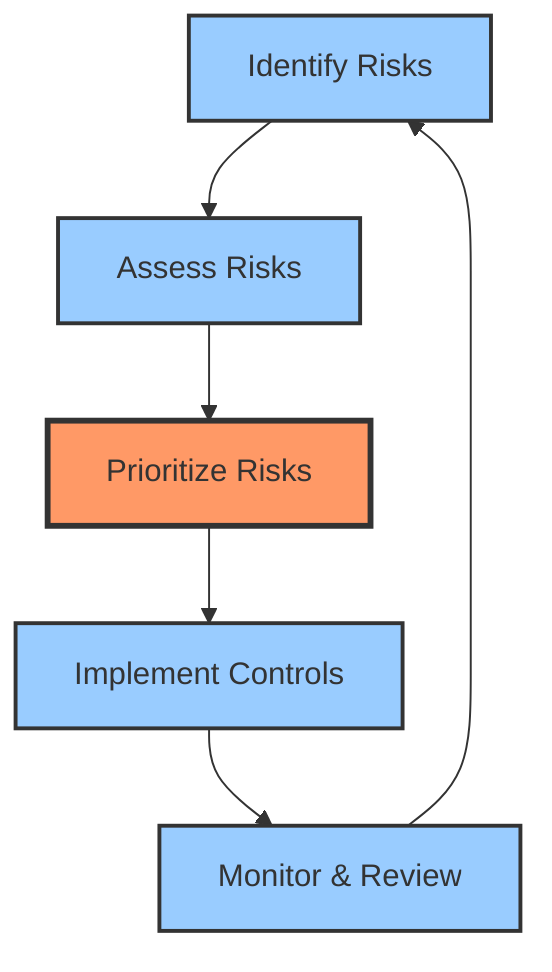

Every organization depends on technology. Email systems enable communication. Databases store customer information. Applications process transactions. Networks connect offices. This dependency creates risk—technology failures can disrupt operations, compromise data, and damage reputation.

IT risk management addresses these threats systematically. Rather than reacting to incidents, organizations identify potential risks, assess their impact, and implement controls to reduce exposure. This proactive approach protects business value while enabling technology innovation.

The challenge lies in balancing security with business needs. Excessive controls slow operations and frustrate users. Insufficient controls expose the organization to unacceptable risks. Effective IT risk management finds the right balance—protecting critical assets while enabling business objectives.

This exploration examines IT risk management fundamentals, from identifying risks to implementing controls. Understanding these principles helps organizations protect themselves while maintaining operational efficiency.

## Understanding IT Risk

Before managing risks, understanding what constitutes IT risk is essential.

### What is IT Risk?

IT risk represents the potential for technology-related events to negatively impact business objectives. Four components define IT risk:

!!!anote "⚡ Threat"
    Source of potential harm that could exploit vulnerabilities.

**External Threats**: Originate outside the organization. Hackers attempt unauthorized access, malware infects systems, ransomware encrypts data for ransom, natural disasters damage infrastructure.

**Internal Threats**: Originate within the organization. Employees make configuration errors, accidentally delete data, or misuse access privileges. System failures occur due to software bugs or design flaws.

**Environmental Threats**: Infrastructure and facility issues. Power outages disrupt operations, hardware failures cause data loss, cooling system failures damage equipment, network connectivity issues prevent access.

!!!anote "🔓 Vulnerability"
    Weakness that can be exploited by threats.

**Unpatched Software**: Systems running outdated versions with known security flaws. Attackers exploit published vulnerabilities before patches are applied.

**Weak Passwords**: Simple, easily guessed credentials like "password123" or "admin". Enable brute force attacks and credential stuffing.

**Misconfigured Systems**: Default settings left unchanged, unnecessary services enabled, overly permissive access controls. Create unintended security gaps.

**Inadequate Controls**: Missing encryption, no multi-factor authentication, insufficient logging, lack of network segmentation. Leave systems exposed.

**Missing Security Updates**: Failure to apply patches promptly, outdated antivirus definitions, unsupported legacy systems. Maintain exploitable weaknesses.

!!!anote "💥 Impact"
    Consequences if the risk materializes.

**Financial Loss**: Direct costs include incident response, forensics, legal fees, notification expenses. Lost revenue from downtime, customer churn, contract penalties. Recovery costs for system restoration and data recovery.

**Operational Disruption**: System downtime prevents business operations. Productivity loss as employees cannot work. Service degradation affects customer experience. Integration failures break business processes.

**Reputation Damage**: Brand harm from negative publicity and media coverage. Customer trust erosion leading to business loss. Partner confidence decline affecting relationships. Market value reduction for public companies.

**Regulatory Penalties**: Fines for non-compliance with GDPR, HIPAA, PCI DSS, or other regulations. Legal consequences including lawsuits and settlements. Mandatory audits and remediation requirements. Potential criminal charges for severe violations.

!!!anote "🎲 Likelihood"
    Probability of the risk occurring.

**Historical Frequency**: How often similar incidents occurred in the past. Organizations with frequent phishing attempts face higher likelihood of successful attacks. Industry trends indicate common attack patterns.

**Threat Capability**: Sophistication and resources of potential attackers. Nation-state actors have advanced capabilities. Script kiddies use automated tools. Insider threats have privileged access and knowledge.

**Vulnerability Severity**: How easily the weakness can be exploited. Critical vulnerabilities with public exploits have high likelihood. Complex vulnerabilities requiring specialized knowledge have lower likelihood.

**Existing Control Effectiveness**: Strong controls reduce likelihood significantly. Multi-factor authentication prevents 99% of account compromises. Weak or missing controls leave systems exposed to exploitation.

Risk exists when threats can exploit vulnerabilities to cause impact. A threat without vulnerability creates no risk. A vulnerability without threat creates no immediate risk. Both must exist for risk to materialize.

### The Risk Landscape

The modern IT environment presents a complex web of interconnected risks that evolve constantly. Organizations no longer face isolated threats—a single vulnerability can cascade across systems, triggering multiple risk categories simultaneously. A ransomware attack (security risk) causes system downtime (operational risk), triggers regulatory reporting obligations (compliance risk), and exposes inadequate backup strategies (strategic risk). Understanding this landscape means recognizing that risks don't exist in silos—they interact, amplify each other, and require holistic management approaches that address root causes rather than symptoms.

Organizations face diverse IT risks:

!!!error "🚫 Common IT Risks"
    **Security Risks**
    - Data breaches and theft
    - Unauthorized access
    - Malware and ransomware
    - Insider threats
    - Social engineering attacks
    
    **Operational Risks**
    - System failures and downtime
    - Data loss or corruption
    - Performance degradation
    - Integration failures
    - Capacity constraints
    
    **Compliance Risks**
    - Regulatory violations
    - Privacy breaches
    - Audit failures
    - Contractual non-compliance
    - Legal liability
    
    **Strategic Risks**
    - Technology obsolescence
    - Vendor dependency
    - Project failures
    - Poor architecture decisions
    - Inadequate disaster recovery

Each risk category requires different management approaches. Security risks need technical controls. Operational risks need process improvements. Compliance risks need governance frameworks. Strategic risks need business alignment.

## The Risk Management Framework

Effective risk management follows a structured approach that transforms reactive firefighting into proactive protection. This framework provides a systematic method for discovering risks before they materialize, evaluating their potential damage, deciding which threats deserve immediate attention, deploying appropriate defenses, and continuously validating that protections remain effective. Without this structure, organizations waste resources addressing minor issues while critical vulnerabilities go unnoticed. The framework ensures consistent, repeatable processes that scale across the organization and adapt as threats evolve.

Effective risk management follows a structured approach:

### Risk Identification

The first step is identifying potential risks:

!!!anote "🔍 Risk Identification Methods"
    **Asset-Based Approach**
    - Identify critical assets
    - Determine threats to each asset
    - Identify vulnerabilities
    - Document potential impacts
    
    **Scenario-Based Approach**
    - Brainstorm threat scenarios
    - "What if" analysis
    - Historical incident review
    - Industry threat intelligence
    
    **Compliance-Based Approach**
    - Review regulatory requirements
    - Identify compliance gaps
    - Assess penalty exposure
    - Document obligations
    
    **Stakeholder Input**
    - Interview business owners
    - Survey IT staff
    - Consult security team
    - Review audit findings

Comprehensive risk identification requires multiple perspectives. Technical staff identify system vulnerabilities. Business owners identify operational impacts. Security teams identify threat scenarios. Compliance teams identify regulatory risks.

### Risk Assessment

Once identified, risks need assessment:

!!!anote "📊 Risk Assessment Criteria"
    **Impact Assessment**
    - Financial: Direct costs and lost revenue
    - Operational: Downtime and productivity loss
    - Reputational: Brand damage and customer trust
    - Compliance: Fines and legal consequences
    
    **Likelihood Assessment**
    - Historical frequency
    - Threat capability
    - Vulnerability severity
    - Control effectiveness
    
    **Risk Rating**
    - Combine impact and likelihood
    - Use consistent scale (1-5 or Low/Medium/High)
    - Calculate risk score
    - Document assumptions

Risk assessment quantifies exposure. A high-impact, high-likelihood risk demands immediate attention. A low-impact, low-likelihood risk may be acceptable. The assessment guides prioritization.

### Risk Prioritization

Not all risks deserve equal attention. Organizations have limited resources—budget, staff time, management focus. Risk prioritization ensures resources address the most critical threats first.

!!!warning "⚠️ Without Risk Prioritization"
    **Resource Waste**: Teams spend time on low-impact issues while critical vulnerabilities remain unaddressed. A team fixing cosmetic security issues while unpatched servers face active exploitation.
    
    **Decision Paralysis**: Without clear priorities, every risk seems equally urgent. Management cannot decide which projects to fund or which incidents to escalate.
    
    **Burnout**: Security teams chase every alert and vulnerability, leading to alert fatigue. Important warnings get lost in noise.
    
    **Business Friction**: Implementing controls for minor risks frustrates users and slows operations without meaningful security improvement.

**Prioritization Matrix**: Plot risks on impact vs. likelihood grid. High-impact, high-likelihood risks get immediate attention. Low-impact, low-likelihood risks may be accepted. Medium risks require judgment based on business context.

**Risk Appetite**: Define acceptable risk levels aligned with business objectives. A financial institution has lower risk appetite than a startup. Risk appetite guides which risks to mitigate, transfer, or accept.

### Key Metrics

Measuring risk management effectiveness requires meaningful metrics that drive action, not vanity numbers that look good in reports.

!!!warning "⚠️ Without Key Metrics"
    **Invisible Progress**: Cannot demonstrate whether security investments reduce risk. Management questions security spending without evidence of value.
    
    **Misaligned Efforts**: Teams optimize for wrong outcomes. Measuring "vulnerabilities found" incentivizes finding trivial issues rather than fixing critical ones.
    
    **Delayed Detection**: Without metrics tracking control effectiveness, degradation goes unnoticed until incidents occur.
    
    **Budget Justification Failure**: Cannot prove ROI for security initiatives. Budget cuts target security first because value isn't quantified.

**Effective Metrics**:
- Mean Time to Detect (MTTD): How quickly threats are identified
- Mean Time to Respond (MTTR): How quickly incidents are contained
- Vulnerability Remediation Time: Days from discovery to patch
- Control Coverage: Percentage of assets with required protections
- Risk Reduction: Change in risk exposure over time

### Continuous Improvement

The threat landscape evolves daily. Yesterday's adequate controls become today's vulnerabilities. Continuous improvement ensures risk management adapts to changing threats, technologies, and business needs.

!!!warning "⚠️ Without Continuous Improvement"
    **Security Decay**: Controls become outdated as threats evolve. Firewall rules from five years ago don't address modern attack techniques.
    
    **Repeated Failures**: Same incidents recur because root causes aren't addressed. Organizations patch individual vulnerabilities without fixing underlying processes.
    
    **Competitive Disadvantage**: Competitors adopt new security technologies while your organization relies on legacy approaches.
    
    **Compliance Drift**: Regulations update but controls don't. Organizations discover non-compliance during audits rather than proactively maintaining compliance.

**Improvement Cycle**: After each incident, conduct post-mortems identifying lessons learned. Update procedures, enhance controls, and train staff. Review metrics quarterly to identify trends and adjust strategies.

### Risk Reporting

Risk reporting translates technical findings into business language that enables informed decision-making at all organizational levels.

!!!warning "⚠️ Without Risk Reporting"
    **Executive Blindness**: Leadership makes strategic decisions without understanding risk exposure. Approves projects with unacceptable security implications.
    
    **Accountability Gaps**: Risk owners don't know they're responsible for specific risks. When incidents occur, nobody owns the response.
    
    **Resource Misallocation**: Budget decisions ignore risk priorities. Critical security projects get defunded while low-value initiatives proceed.
    
    **Audit Failures**: Cannot demonstrate due diligence to regulators, auditors, or customers. Increases liability and regulatory penalties.

**Reporting Levels**:
- **Executive Dashboard**: High-level risk trends, top risks, major incidents, compliance status
- **Management Reports**: Detailed risk assessments, control effectiveness, remediation progress, resource needs
- **Technical Reports**: Vulnerability details, threat intelligence, incident analysis, control configurations

### Security Awareness

Technology controls fail when users bypass them. Security awareness transforms users from the weakest link into an active defense layer.

!!!warning "⚠️ Without Security Awareness"
    **Human Vulnerabilities**: Users click phishing links, share passwords, disable security controls, and fall for social engineering. Technical controls become irrelevant.
    
    **Insider Threats**: Employees unknowingly violate policies, mishandle sensitive data, or create security gaps through ignorance rather than malice.
    
    **Incident Amplification**: Users don't recognize or report security incidents promptly. Small breaches become major compromises because nobody noticed the warning signs.
    
    **Culture Resistance**: Security is seen as IT's problem, not everyone's responsibility. Users view security controls as obstacles rather than protections.

**Effective Awareness Programs**: Regular training on current threats, simulated phishing exercises, clear policies in plain language, easy reporting mechanisms, and positive reinforcement for security-conscious behavior.

### Governance and Accountability

Governance establishes who makes risk decisions, who implements controls, and who bears responsibility when things go wrong. Without clear governance, risk management becomes nobody's job.

!!!warning "⚠️ Without Governance and Accountability"
    **Diffused Responsibility**: Everyone assumes someone else is handling security. Critical risks fall through organizational cracks.
    
    **Inconsistent Decisions**: Different departments apply different security standards. One team implements strong controls while another ignores basic protections.
    
    **Slow Response**: Incident response stalls while teams debate who should act. Hours or days pass during critical response windows.
    
    **No Consequences**: Poor security practices continue because nobody faces accountability. Risk owners ignore remediation deadlines without repercussions.

**Governance Framework**: Define roles (CISO, risk owners, control implementers), establish decision-making authority, create escalation paths, set accountability measures, and document responsibilities in policy.

## Key Risk Areas

Certain risk areas demand special attention due to their potential for catastrophic impact.

### Change Management

Every system change introduces risk. New code contains bugs. Configuration changes break integrations. Updates introduce incompatibilities. Change management controls these risks through structured processes.

!!!error "❌ Without Change Management"
    **Production Outages**: Untested changes deployed to production cause system failures during business hours. A database schema change breaks the e-commerce platform during peak shopping season.
    
    **Security Regressions**: Changes inadvertently disable security controls or introduce vulnerabilities. A configuration update accidentally opens firewall ports to the internet.
    
    **Compliance Violations**: Changes violate regulatory requirements because nobody reviewed compliance implications. Audit trails get disabled during system maintenance.
    
    **Rollback Failures**: When changes cause problems, teams cannot quickly revert because no rollback plan exists. Outages extend for hours or days.
    
    **Knowledge Loss**: Changes made without documentation leave systems in unknown states. Future changes risk breaking undocumented dependencies.

**Change Management Process**: Document proposed changes, assess risk and impact, obtain approvals, test in non-production environments, schedule during maintenance windows, prepare rollback procedures, and document results.

### Third-Party Risk

Organizations depend on vendors for cloud services, software, infrastructure, and business processes. Third-party failures become your failures. Their security breaches expose your data.

!!!error "❌ Without Third-Party Risk Management"
    **Supply Chain Attacks**: Compromised vendors inject malware into software updates. SolarWinds breach affected thousands of organizations through trusted vendor access.
    
    **Data Breaches**: Vendors with access to your data suffer breaches, exposing customer information. Your organization faces regulatory penalties and lawsuits for vendor failures.
    
    **Service Disruptions**: Critical vendor outages halt your operations. Cloud provider failures take down your applications with no alternative.
    
    **Compliance Failures**: Vendors violate regulations while processing your data. Your organization remains liable despite outsourcing the function.
    
    **Vendor Lock-In**: Dependency on single vendors creates strategic risk. Cannot switch providers without massive disruption and cost.

**Third-Party Risk Management**: Assess vendor security before engagement, require contractual security obligations, monitor vendor compliance, maintain vendor inventory, plan for vendor failures, and regularly review vendor risk.

### Business Continuity and Disaster Recovery

Disasters happen—natural disasters, cyberattacks, equipment failures, human errors. Business continuity ensures operations continue despite disruptions. Disaster recovery restores systems after catastrophic failures.

!!!error "❌ Without Business Continuity and Disaster Recovery"
    **Extended Outages**: Disasters cause prolonged downtime because no recovery plan exists. Organizations scramble to rebuild systems from scratch, taking weeks or months.
    
    **Data Loss**: Critical business data is permanently lost because backups don't exist, are corrupted, or cannot be restored. Years of customer records, financial data, or intellectual property vanish.
    
    **Business Failure**: Extended outages drive customers to competitors. Revenue loss during downtime exceeds recovery costs by orders of magnitude. Some organizations never recover.
    
    **Regulatory Penalties**: Failure to maintain required data or meet service obligations triggers fines and legal action.
    
    **Reputation Destruction**: Inability to serve customers during crises permanently damages brand trust and market position.

**BC/DR Planning**: Identify critical business functions, define recovery time objectives (RTO) and recovery point objectives (RPO), implement redundant systems, maintain tested backups, document recovery procedures, and conduct regular disaster recovery drills.

### Data Security and Privacy

Data represents organizational value and customer trust. Breaches expose sensitive information, violate privacy regulations, and destroy reputation. Data security protects confidentiality, integrity, and availability.

!!!error "❌ Without Data Security and Privacy"
    **Massive Breaches**: Unprotected data gets stolen in bulk. Millions of customer records, credit cards, health information, or personal data exposed to criminals.
    
    **Regulatory Catastrophe**: GDPR fines reach 4% of global revenue. HIPAA violations trigger millions in penalties. Privacy violations result in class-action lawsuits.
    
    **Identity Theft**: Exposed personal information enables fraud against customers. Your breach causes direct harm to individuals who trusted you with their data.
    
    **Competitive Damage**: Stolen intellectual property, trade secrets, or strategic plans benefit competitors. Years of R&D investment lost overnight.
    
    **Trust Destruction**: Customers abandon services after breaches. Partners terminate relationships. Market value plummets as investors flee.

**Data Protection**: Classify data by sensitivity, encrypt data at rest and in transit, implement access controls based on least privilege, monitor data access, maintain data inventories, comply with privacy regulations, and establish data retention policies.

## Risk Treatment Strategies

Once risks are prioritized, organizations choose treatment strategies:

### The Four T's

Risk treatment follows four basic strategies:

!!!anote "💸 Transfer: Shift the Burden"
    Move financial consequences to another party while retaining operational responsibility. Like buying insurance—you pay premiums to transfer the financial risk of a breach to the insurer.

**Common Methods**: Cyber insurance policies covering breach costs, outsourcing to managed service providers, cloud providers assuming infrastructure risks, contractual liability clauses with vendors.

**Example**: Purchasing cyber insurance that covers breach notification costs, legal fees, and regulatory fines. If a breach occurs, the insurer pays these costs while you handle the incident response.

**When to Use**: Risk impact exceeds internal capacity, specialized expertise needed, cost-effective compared to self-insurance, or regulatory/contractual requirements exist.

!!!anote "🤝 Tolerate: Accept the Risk"
    Acknowledge the risk exists and consciously decide not to take action beyond monitoring. The cost of fixing it exceeds the potential damage.

**Justification**: Mitigation cost exceeds potential impact, risk falls within acceptable tolerance, no cost-effective controls available, or business benefit outweighs risk.

**Example**: Accepting the risk of minor website defacement on a low-traffic internal blog. The cost of advanced DDoS protection exceeds the minimal business impact.

**Requirements**: Formal documentation of acceptance, executive approval for significant risks, regular review of risk status, and monitoring for changes in risk profile.

!!!anote "🛠️ Treat: Reduce the Risk"
    Implement controls to reduce either likelihood or impact of the risk materializing. Most common approach—add security measures to lower the risk to acceptable levels.

**Approaches**: Technical controls (firewalls, encryption), process improvements (change management), training and awareness programs, redundancy and backup systems.

**Example**: Implementing multi-factor authentication reduces the likelihood of unauthorized access even if passwords are compromised. Adding encryption reduces impact if data is stolen.

**Effectiveness**: Most common strategy for significant risks, allows continued business operations, requires ongoing maintenance, and cost must be proportional to risk.

!!!anote "🚫 Terminate (Avoid): Eliminate the Risk"
    Remove the risk entirely by discontinuing the activity that creates it. Stop doing the risky thing altogether.

**Actions**: Decommission vulnerable legacy systems, exit high-risk business lines, stop using risky technologies, or change processes to avoid risk.

**Example**: Shutting down an outdated web application that can't be secured rather than continuing to patch vulnerabilities. The business value doesn't justify the security risk.

**Considerations**: Most effective but often impractical, may impact business operations, last resort for unacceptable risks, and requires business stakeholder buy-in.

The choice depends on risk level, cost of controls, and business objectives. High risks typically require treatment or transfer. Low risks may be tolerated. Unacceptable risks may require termination.

!!!tip "🎯 Risk Prioritization Matrix"
    **Critical Risks (High Impact + High Likelihood)**
    - Immediate action required
    - Executive attention needed
    - Significant resources allocated
    - Weekly status updates
    - Daily monitoring
    
    **High Risks (High Impact OR High Likelihood)**
    - Planned mitigation
    - Adequate resources
    - Bi-weekly status updates
    - Monthly review
    - Management oversight
    
    **Medium Risks**
    - Standard controls
    - Monthly status updates
    - Quarterly assessment
    - Documented acceptance
    
    **Low Risks**
    - Accept or monitor
    - Minimal resources
    - Quarterly status updates
    - Annual review
    - Document decision

Prioritization ensures resources focus on the most significant risks. Organizations can't eliminate all risks—they must focus on those that matter most. Higher-priority risks require more frequent status updates and monitoring to ensure timely detection of changes in risk profile.

| Impact / Likelihood | Low | Medium | High |
|---------------------|-----|--------|------|
| **High** | Medium Risk | High Risk | Critical Risk |
| **Medium** | Low Risk | Medium Risk | High Risk |
| **Low** | Low Risk | Low Risk | Medium Risk |

### Control Implementation

Treating risks requires implementing controls. Each control type serves a specific purpose, and combining them creates defense in depth:

!!!anote "🛡️ Preventive Controls"
    Reduce the likelihood of security incidents by blocking threats proactively.

**Examples**: Multi-factor authentication prevents unauthorized access, firewalls block malicious network traffic, input validation prevents injection attacks, network segmentation limits lateral movement, security awareness training reduces human errors.

**Effectiveness**: 60-80% risk reduction when properly implemented. Most cost-effective control type as they prevent incidents entirely.

**Limitations**: Cannot stop all attacks. Determined attackers may find ways around preventive controls.

!!!anote "🔍 Detective Controls"
    Detect security incidents quickly to enable rapid response and minimize damage.

**Examples**: Intrusion detection systems alert on suspicious activity, SIEM correlates logs to identify attack patterns, file integrity monitoring detects unauthorized changes, anomaly detection identifies unusual behavior, regular security audits find control gaps.

**Effectiveness**: 40-60% risk reduction by enabling faster response. Reduces average detection time from months to hours or days.

**Limitations**: Only effective if monitored and acted upon. Generates false positives requiring investigation.

!!!anote "🔧 Corrective Controls"
    Minimize impact after an incident occurs by enabling quick recovery and preventing recurrence.

**Examples**: Incident response procedures guide coordinated response, automated backups enable data recovery, patch management closes vulnerabilities, business continuity plans maintain operations, disaster recovery systems restore services.

**Effectiveness**: 30-50% impact reduction by shortening recovery time. Reduces downtime from days to hours.

**Limitations**: Incident has already occurred. Focus is on damage control rather than prevention.

!!!anote "⚖️ Compensating Controls"
    Provide alternative protection when primary controls aren't feasible due to cost, compatibility, or operational constraints.

**Examples**: Enhanced monitoring when encryption isn't possible, manual approval workflows when automated controls fail, segregation of duties when system access can't be restricted, additional logging when real-time detection unavailable.

**Effectiveness**: 20-40% risk reduction. Less effective than primary controls but better than no control.

**Use Cases**: Legacy systems, compliance requirements, temporary solutions during transitions.

!!!success "✅ Layered Defense: Combining Controls"
    **Defense in Depth Strategy**
    - Multiple control types work together
    - If one control fails, others provide backup
    - Preventive + Detective + Corrective = 85-95% risk reduction
    
    **Example: Protecting Customer Data**
    - Preventive: Encryption, access controls, firewalls
    - Detective: Log monitoring, intrusion detection, audits
    - Corrective: Incident response, backups, breach notification
    - Compensating: Enhanced monitoring for legacy systems
    
    **Result**: Layered approach provides comprehensive protection. Single control failure doesn't result in complete compromise.

Effective risk management uses multiple control types. Preventive controls reduce likelihood. Detective controls enable rapid response. Corrective controls minimize impact. Compensating controls fill gaps. Combined, they create resilient security posture that significantly reduces overall risk.

## Risk Monitoring and Reporting

Risk management is continuous, not one-time:

### Continuous Monitoring

Risks evolve as threats and environments change:

!!!anote "📈 Monitoring Activities"
    **Technical Monitoring**
    - Vulnerability scanning
    - Log analysis
    - Performance monitoring
    - Security event correlation
    - Threat intelligence feeds
    
    **Process Monitoring**
    - Control effectiveness reviews
    - Incident trend analysis
    - Audit findings tracking
    - Compliance assessments
    - Policy compliance checks
    
    **Environmental Monitoring**
    - Threat landscape changes
    - Regulatory updates
    - Technology changes
    - Business changes
    - Vendor changes

Continuous monitoring detects emerging risks and validates control effectiveness. Automated tools provide real-time visibility. Regular reviews ensure controls remain appropriate.

### Risk Reporting

Effective reporting keeps stakeholders informed:

!!!tip "📊 Risk Reporting Best Practices"
    **Executive Reporting**
    - High-level risk dashboard
    - Critical risks and trends
    - Control effectiveness
    - Resource requirements
    - Strategic recommendations
    
    **Management Reporting**
    - Detailed risk registers
    - Control status
    - Incident summaries
    - Remediation progress
    - Compliance status
    
    **Technical Reporting**
    - Vulnerability details
    - Incident analysis
    - Control configurations
    - Technical metrics
    - Remediation plans

Different audiences need different information. Executives need strategic context. Managers need operational details. Technical teams need implementation specifics. Tailor reports to audience needs.

## Building a Risk-Aware Culture

Technology alone doesn't manage risk—people do:

### Security Awareness

Users are both the weakest link and strongest defense:

!!!success "✅ Effective Security Awareness"
    **Training Topics**
    - Password security
    - Phishing recognition
    - Data handling procedures
    - Incident reporting
    - Social engineering tactics
    
    **Delivery Methods**
    - Regular training sessions
    - Simulated phishing exercises
    - Security newsletters
    - Posters and reminders
    - Gamification
    
    **Measuring Effectiveness**
    - Training completion rates
    - Phishing simulation results
    - Incident reporting rates
    - Security survey responses
    - Behavioral changes

Security awareness transforms users from vulnerabilities into assets. Regular training builds knowledge. Simulated attacks build skills. Positive reinforcement builds culture.

### Governance and Accountability

Clear governance establishes accountability:

!!!anote "🏛️ Risk Governance Structure"
    **Board/Executive Level**
    - Risk appetite definition
    - Strategic risk oversight
    - Resource allocation
    - Policy approval
    
    **Risk Committee**
    - Risk strategy development
    - Risk assessment review
    - Control effectiveness oversight
    - Exception approval
    
    **Business Units**
    - Risk identification
    - Control implementation
    - Incident response
    - Compliance adherence
    
    **IT/Security Teams**
    - Technical controls
    - Monitoring and detection
    - Vulnerability management
    - Incident investigation

Governance clarifies roles and responsibilities. Executives set risk appetite. Committees provide oversight. Business units own risks. Technical teams implement controls.

## Real-World Applications

Seeing risk management in practice clarifies concepts:

### Financial Services: Regulatory Compliance

A bank manages compliance risks:

!!!anote "🏦 Banking Risk Management"
    **Context**
    - Strict regulatory requirements
    - Customer financial data
    - Transaction processing systems
    - Multiple compliance frameworks
    - High breach consequences
    
    **Approach**
    - Comprehensive risk assessments
    - Layered security controls
    - Regular compliance audits
    - Incident response procedures
    - Third-party risk management
    
    **Controls**
    - Encryption and tokenization
    - Multi-factor authentication
    - Network segmentation
    - Continuous monitoring
    - Regular penetration testing
    
    **Results**
    - Regulatory compliance maintained
    - Zero data breaches
    - Audit findings minimized
    - Customer trust preserved
    - Operational efficiency maintained

Financial institutions face intense regulatory scrutiny. Comprehensive risk management isn't optional—it's required. Layered controls, continuous monitoring, and regular assessments ensure compliance while protecting customer data.

### Healthcare: Patient Data Protection

A hospital protects patient information:

!!!anote "🏥 Healthcare Risk Management"
    **Context**
    - HIPAA compliance requirements
    - Electronic health records
    - Medical device security
    - Multiple access points
    - Life-critical systems
    
    **Approach**
    - Risk assessments for all systems
    - Role-based access controls
    - Encryption of patient data
    - Business continuity planning
    - Vendor security assessments
    
    **Controls**
    - Access logging and monitoring
    - Data encryption
    - Network segmentation
    - Backup and recovery systems
    - Security awareness training
    
    **Results**
    - HIPAA compliance achieved
    - Patient privacy protected
    - System availability maintained
    - Audit findings addressed
    - Staff security awareness improved

Healthcare organizations balance security with accessibility. Clinicians need rapid access to patient data in emergencies. Security controls must protect privacy without impeding care. Risk management finds this balance.

### E-Commerce: Transaction Security

An online retailer secures transactions:

!!!anote "🛒 E-Commerce Risk Management"
    **Context**
    - Credit card processing
    - Customer personal data
    - High transaction volumes
    - PCI DSS compliance
    - Competitive pressure
    
    **Approach**
    - PCI DSS compliance program
    - Secure payment processing
    - Fraud detection systems
    - DDoS protection
    - Regular security testing
    
    **Controls**
    - Payment tokenization
    - SSL/TLS encryption
    - Fraud detection algorithms
    - Rate limiting
    - Web application firewall
    
    **Results**
    - PCI DSS compliance maintained
    - Fraud rates minimized
    - Customer trust established
    - System availability ensured
    - Business growth enabled

E-commerce depends on customer trust. Payment security is non-negotiable. PCI DSS compliance provides a framework. Additional controls address fraud and availability. Risk management enables business growth.

## Common Pitfalls

Organizations make predictable mistakes:

!!!error "🚫 Risk Management Anti-Patterns"
    **Checkbox Compliance**
    - Focus on compliance over security
    - Implement controls without understanding risks
    - Ignore business context
    - Result: Compliant but insecure
    
    **Risk Assessment Theater**
    - Conduct assessments but ignore results
    - Document risks without treatment plans
    - No follow-up or monitoring
    - Result: Wasted effort, unchanged risk
    
    **Technology-Only Approach**
    - Rely solely on technical controls
    - Ignore people and processes
    - No security awareness
    - Result: Users circumvent controls
    
    **Analysis Paralysis**
    - Endless risk assessments
    - Perfect documentation
    - No actual risk treatment
    - Result: Known risks remain unaddressed
    
    **Siloed Risk Management**
    - IT manages IT risks in isolation
    - No business involvement
    - Disconnect from business objectives
    - Result: Misaligned priorities

The most common mistake is treating risk management as a compliance exercise rather than business protection. Checkbox compliance creates false security. Effective risk management aligns with business objectives and actually reduces risk.

## Measuring Success

How do you know if risk management is working?

### Key Metrics

Track these indicators:

!!!tip "📊 Risk Management Metrics"
    **Leading Indicators**
    - Vulnerability remediation time
    - Security awareness training completion
    - Control implementation progress
    - Risk assessment coverage
    - Patch compliance rates
    
    **Lagging Indicators**
    - Security incidents
    - Audit findings
    - Compliance violations
    - System downtime
    - Data breach costs
    
    **Efficiency Metrics**
    - Cost per control
    - Risk assessment cycle time
    - Incident response time
    - Control automation percentage
    - Resource utilization

Leading indicators predict future performance. Lagging indicators measure actual outcomes. Efficiency metrics ensure cost-effectiveness. Track all three for comprehensive visibility.

### Continuous Improvement

Risk management evolves:

!!!success "✅ Improvement Practices"
    **Regular Reviews**
    - Quarterly risk assessments
    - Annual control effectiveness reviews
    - Post-incident lessons learned
    - Emerging threat analysis
    
    **Feedback Loops**
    - Incident data informs risk assessments
    - Audit findings drive improvements
    - User feedback shapes awareness programs
    - Metrics guide resource allocation
    
    **Adaptation**
    - Update risk assessments for business changes
    - Adjust controls for new threats
    - Refine processes based on experience
    - Adopt new technologies appropriately

Effective risk management improves continuously. Incidents provide learning opportunities. Metrics reveal gaps. Regular reviews ensure relevance. Adaptation maintains effectiveness.

## Conclusion

IT risk management protects business value by systematically identifying, assessing, and mitigating technology-related threats. Rather than reacting to incidents, organizations proactively manage risks through structured frameworks and appropriate controls.

The risk management process follows a continuous cycle: identify risks, assess their impact and likelihood, prioritize based on business context, implement appropriate controls, and monitor effectiveness. This cycle repeats as threats evolve and business needs change.

Risk treatment follows four strategies: transfer risk through insurance or outsourcing, tolerate acceptable risks, treat significant risks with controls, or terminate unacceptable risks by eliminating activities. The choice depends on risk level, control costs, and business objectives.

Key risk areas include data security and privacy, business continuity and disaster recovery, third-party relationships, and change management. Each area requires specific controls and monitoring approaches. Layered defenses provide depth—preventive controls reduce likelihood, detective controls enable rapid response, and corrective controls minimize impact.

Effective risk management requires more than technology. Security awareness transforms users from vulnerabilities into assets. Clear governance establishes accountability. Risk-aware culture makes security everyone's responsibility. People, processes, and technology work together.

Common pitfalls include checkbox compliance without actual security, risk assessments without treatment, technology-only approaches that ignore people, analysis paralysis that delays action, and siloed risk management disconnected from business objectives. Avoiding these mistakes requires business alignment and practical action.

Success metrics include both leading indicators (vulnerability remediation time, training completion) and lagging indicators (incidents, audit findings). Continuous improvement through regular reviews, feedback loops, and adaptation ensures risk management remains effective as threats and business needs evolve.

Real-world examples demonstrate risk management in practice. Financial institutions use comprehensive controls for regulatory compliance. Healthcare organizations balance security with accessibility. E-commerce companies secure transactions while enabling business growth. Each context requires tailored approaches.

The goal isn't eliminating all risk—that's impossible and would prevent business operations. The goal is managing risk to acceptable levels while enabling business objectives. Effective risk management protects critical assets, ensures compliance, maintains operations, and preserves reputation.

Before implementing risk management, understand your business context. What are your critical assets? What threats do you face? What regulations apply? What resources are available? The answers guide your approach more than generic best practices.

Risk management is not a project with an end date. It's an ongoing process that adapts to changing threats, technologies, and business needs. Organizations that embrace this continuous approach protect themselves while maintaining the agility to innovate and grow.

Whether you're starting a risk management program or improving an existing one, remember: the goal is protecting business value, not perfect security. Focus on outcomes—reduced incidents, maintained compliance, operational resilience, stakeholder confidence. If your risk management achieves these outcomes, you're succeeding. That's what effective IT risk management actually means.
