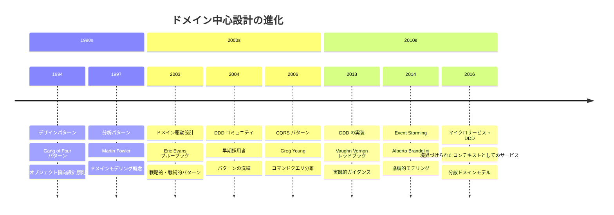
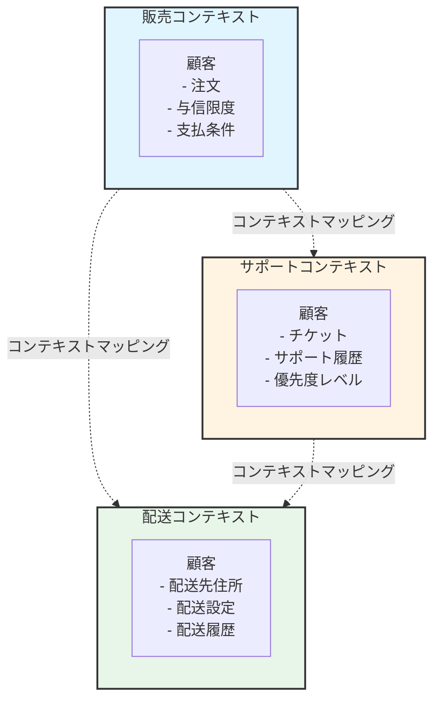
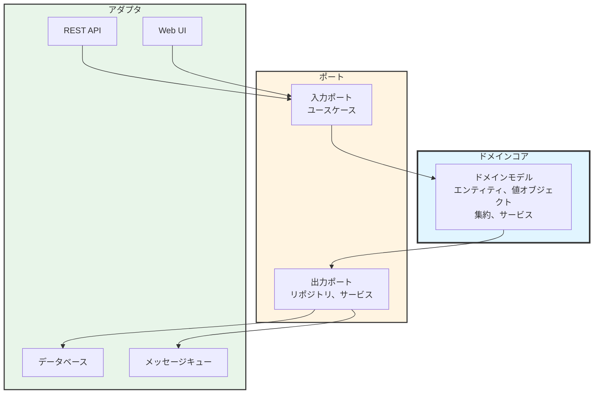

ソフトウェアプロジェクトが失敗するのは、悪いコードのためではなく、誤解された要件のためだ。開発者はビジネスが必要だと思うものを構築する。ビジネス関係者は技術的に実現可能だと信じるものを説明する。ビジネス言語と技術実装の間のギャップは、摩擦、遅延、そして間違った問題を解決するシステムを生み出す。

従来のソフトウェア開発は、データベースを宇宙の中心として扱う。設計はテーブルとリレーションシップから始まる。ビジネスロジックはストアドプロシージャ、サービス層、UIコードに散在する。ドメイン——コアビジネス問題——は後付けとなり、技術的な関心事の下に埋もれる。

ドメイン駆動設計（DDD）はこのアプローチを逆転させる。ドメインモデルを中心に置き、ビジネスロジックをシステムの最も重要な部分として扱う。技術的な関心事——データベース、フレームワーク、UI——はドメインに奉仕する実装の詳細となる。ビジネスチームと開発チームは、コードに直接現れる共有言語を使って協力する。

この転換はシンプルに聞こえるが、チームがソフトウェアについて考える方法の根本的な変化を必要とする。DDDは複雑なビジネスロジックをモデリングするためのパターン、大規模システムを管理するための戦略、そしてコードをビジネスニーズと整合させ続けるための実践を導入する。DDDがいつ価値を追加するか——そしていつより単純なアプローチで十分か——を理解することが、それが強力なツールになるか過剰エンジニアリングの負担になるかを決定する。

本稿は、データベース中心からドメイン中心設計への進化をたどり、DDDのコアパターンと実践を探求し、実世界のアプリケーションを検証し、このアプローチをいつ採用すべきかのガイダンスを提供する。

### ドメイン駆動設計のタイムライン



## データベース中心の問題

DDD以前、ほとんどのエンタープライズアプリケーションは、根本的な問題を生み出すデータベース中心のアプローチに従っていた。

### 従来のデータベースファースト設計

典型的な開発プロセスはデータベースから始まった：

!!!error "🚫 データベース中心の問題"
    **設計プロセス**
    - データベーススキーマから始める
    - テーブルとリレーションシップを作成
    - データアクセスコードを生成
    - その上にビジネスロジックを追加
    
    **問題**
    - データベース構造が設計を駆動
    - ビジネスロジックがあちこちに散在
    - 貧血ドメインモデル（getter/setterのみ）
    - 技術的関心事が支配的
    
    **結果**
    - コードがビジネス概念を反映しない
    - 変更にはデータベースマイグレーションが必要
    - ビジネスルールが複数の層に隠れる
    - 理解と保守が困難

このアプローチでは、開発者はまず正規化されたデータベーステーブルを設計する。オブジェクトリレーショナルマッピング（ORM）ツールがテーブルからクラスを生成する。ビジネスロジックは便利な場所——ストアドプロシージャ、サービス層、コントローラ、またはUIコード——に追加される。結果として得られるシステムには、ビジネス概念の明確な表現がない。

典型的なeコマースシステムには、Order、OrderItem、Customerテーブルがあるかもしれない。Orderクラスはgetterとsetterを持つデータコンテナになる。「100ドル以上の注文は送料無料」のようなビジネスルールはコードベース全体に散在する。ビジネスルールがどこに実装されているかを見つけるには、複数のファイルを検索する必要がある。

### 貧血ドメインモデルアンチパターン

データベース中心設計は貧血ドメインモデルを生み出す：

!!!error "🚫 貧血ドメインモデル"
    **特徴**
    - プロパティのみを持つクラス
    - ドメインオブジェクトにビジネスロジックがない
    - サービスがすべての振る舞いを含む
    - オブジェクトは単なるデータコンテナ
    
    **例**
    ```java
    public class Order {
        private Long id;
        private List<OrderItem> items;
        private BigDecimal total;
        
        // getter と setter のみ
        public Long getId() { return id; }
        public void setId(Long id) { this.id = id; }
        // ... さらに getter/setter
    }
    ```
    
    **なぜ問題なのか**
    - オブジェクト指向原則に違反
    - ビジネスロジックがデータから分離
    - 不変条件の維持が困難
    - カプセル化がない

貧血モデルは、オブジェクトを振る舞いのあるエンティティではなくデータ構造として扱う。すべてのビジネスロジックは、これらのデータコンテナを操作するサービスクラスに存在する。オブジェクト指向コードを装ったこの手続き型アプローチは、システムを理解し保守することを困難にする。

#### なぜ貧血モデルはスケール時に失敗するか

ほとんどの開発者にとって正常に見えるものが、アプリケーションが成長するにつれて問題になる：

!!!error "🚫 オブジェクト指向原則に違反"
    **問題**
    
    オブジェクト指向プログラミングはカプセル化を約束する——データと振る舞いを一緒に。貧血モデルはそれらを分離することでこの基本原則を破る。
    
    **貧血アプローチ：**
    
    Orderはデータを持ち、OrderServiceは振る舞いを持つ。これはオブジェクトを構造体として使う手続き型プログラミングである。
    
    **システムが成長するにつれて：**
    - 複数のサービスが同じデータを操作
    - OrderService、ShippingService、BillingServiceがすべてOrderを変更
    - Order振る舞いの単一の真実の源がない
    - サービス間で重複したロジック
    - 一貫性のない状態変更
    
    **実際の影響：**
    
    開発者AがOrderServiceに割引ロジックを追加。開発者BがBillingServiceに類似のロジックを追加。6ヶ月後、それらは分岐する。バグレポートが来る：「チェックアウトと請求書で割引計算が異なる。」Orderを操作するすべての場所を見つけるには、コードベース全体を検索する必要がある。

!!!error "🚫 ビジネスロジックがデータから分離"
    **問題**
    
    ビジネスルールが複数のサービスクラスに散在し、見つけて保守することが困難になる。
    
    **例のシナリオ：**
    
    ビジネスルール：「100ドル以上の注文は送料無料だが、標準配送のみで、米国本土のみ。」
    
    **貧血実装：**
    - ShippingServiceでの送料計算
    - OrderServiceでの注文合計計算
    - AddressServiceでの住所検証
    - PromotionServiceでの資格チェック
    
    **システムが成長するにつれて：**
    - ルール変更には4つの異なるファイルの更新が必要
    - 1つの場所を見逃しやすい
    - テストが複数のテストファイルに散在
    - 新しい開発者が尋ねる：「送料無料ロジックはどこ？」答え：「複雑です...」
    
    **実際の影響：**
    
    ビジネスがルールを「100ドル以上またはプレミアム会員は送料無料」に変更。開発者はShippingServiceを更新するがPromotionServiceを忘れる。プレミアム会員が送料無料を得られない。顧客からの苦情。緊急ホットフィックス。事後検証で誰も知らなかったロジックの重複が明らかになる。

!!!error "🚫 不変条件の維持が困難"
    **問題**
    
    不変条件は常に真でなければならないルールである。貧血モデルはそれらを強制できない。なぜなら、どのコードでもオブジェクトを変更できるから。
    
    **例の不変条件：**
    
    「注文の合計は、その明細項目の合計と等しくなければならない。」
    
    **貧血モデル：**
    
    OrderにはsetTotal()とsetItems()がある。何も防げない：
    
    order.setTotal(100.00);
    order.setItems(itemsWorthFiftyDollars);
    
    今、注文は無効な状態にある。合計が項目と一致しない。
    
    **システムが成長するにつれて：**
    - より多くのコードパスが注文を変更
    - それぞれが合計を再計算することを覚えている必要がある
    - 1つの忘れられた更新が不変条件を破る
    - 無効な状態がシステムを通じて伝播
    - データベースに一貫性のないデータが含まれる
    
    **実際の影響：**
    
    バッチジョブが注文項目を更新するが合計の再計算を忘れる。数千の注文が今や間違った合計を持つ。財務レポートが一致しない。会計が月末締めで不一致を発見。エンジニアリングチームが破損したデータを修正するためにデータ移行スクリプトを書くのに数日を費やす。根本原因：不変条件の強制がない。

!!!error "🚫 カプセル化がない"
    **問題**
    
    公開getterとsetterが内部状態を公開し、どのコードでも任意の方法でオブジェクトを変更できる。
    
    **貧血モデル：**
    
    すべてのフィールドにgetterとsetterがある。内部状態は公開されている。
    
    **システムが成長するにつれて：**
    - 50の異なる場所がorder.setStatus()を呼び出す
    - 状態遷移の検証がない
    - OrderがSHIPPEDからPENDINGに戻る
    - 誰が何を変更したか追跡不可能
    - 既存のコードを壊さずに検証を追加できない
    
    **実際の影響：**
    
    ビジネスルール：「出荷済み注文はキャンセルできない。」setterがどこにでもある状態で、これを強制するには：
    1. setStatus()を呼び出す50の場所すべてを見つける
    2. それぞれに検証を追加
    3. 誰も検証なしで51番目の場所を追加しないことを願う
    
    代替案：setterに検証を追加。しかし今、出荷後にorder.setStatus(CANCELLED)を実行する既存のコードが壊れる。回帰バグが現れる。テストが失敗。ロールバックが必要。
    
    適切なカプセル化があれば、1つのメソッドがある：order.cancel()。それがルールを強制する。すべてのコードがそれを使う。バイパスする方法はない。

### コミュニケーションギャップ

データベース中心設計は、ビジネスと開発の間のギャップを広げる：

!!!error "🚫 言語の断絶"
    **ビジネスの視点**
    - 「顧客が注文を行う」
    - 「注文は出荷前にキャンセルできる」
    - 「プレミアム顧客は優先処理を受ける」
    
    **コードの現実**
    - OrderService.createOrder()
    - OrderRepository.updateStatus()
    - CustomerTable.premiumFlag
    
    **結果**
    - ビジネス概念がコードに見えない
    - 開発者が言語間で翻訳
    - 誤解が蓄積
    - 時間とともに知識が失われる

ビジネス関係者はビジネス用語を使ってドメインを説明する。開発者は技術用語を使って実装する。これらの言語間の翻訳はエラーを導入し、コードベースを非開発者にとって理解不能にする。

#### 実世界のコミュニケーション失敗

言語ギャップは具体的な問題を生み出す：

!!!error "🚫 翻訳で失われるもの"
    **シナリオ：保険契約更新**
    
    **ビジネスが言う：**
    「契約が期限切れになったとき、顧客が自動更新の資格があるかチェックする必要がある。資格のある顧客は期限の30日前に更新オファーを受け取る。応答がない場合、契約は失効するが、再引受なしで復活できる60日間の猶予期間がある。」
    
    **開発者が聞く：**
    「期限日に契約ステータスを期限切れに更新。30日前にメールを送信。応答がない場合、ステータスを失効に設定。60日以内にステータスを有効に変更できるようにする。」
    
    **コードの現実：**
    
    PolicyService.updateStatus(policyId, "EXPIRED");
    EmailService.sendRenewalEmail(customerId, 30);
    if (noResponse) {
        PolicyService.updateStatus(policyId, "LAPSED");
    }
    
    **失われたもの：**
    - 「更新資格」には特定のビジネスルールがある（昨年請求なし、良好な支払履歴）
    - 「更新オファー」は単なるメールではなく、独特のビジネス概念
    - 「猶予期間」には法的意味があり、単なるステータス変更ではない
    - 「再引受なしで復活」は複雑なプロセスをスキップすることを意味する
    
    **6ヶ月後：**
    
    ビジネス：「なぜ最近請求があった顧客に更新オファーを送っているのか？」
    開発者：「コードは期限の30日前に全員にメールを送る。」
    ビジネス：「でも彼らは資格がない！」
    開発者：「'資格がある'とは何？それは要件にない。」
    ビジネス：「キックオフミーティングで議論した！」
    開発者：「それは6ヶ月前で、コードにはない。」

!!!error "🚫 隠された ビジネス概念"
    **シナリオ：eコマースプロモーション**
    
    **ビジネスが言う：**
    「フラッシュセールを実施している。プレミアム会員は早期アクセスを得る。通常会員は2時間後に買い物できる。セールは在庫がなくなるか24時間経過したときに終了する、どちらか先に来た方。」
    
    **コードの現実：**
    
    if (user.isPremium() || currentTime > saleStart + 2.hours) {
        if (currentTime < saleStart + 24.hours && inventory > 0) {
            // 購入を許可
        }
    }
    
    **欠けている概念：**
    - 「フラッシュセール」は単なる時間窓ではなく、ファーストクラスのビジネス概念
    - 「早期アクセス」は単なる時間チェックではなく、特典
    - 「セール終了」には明示的であるべき複数の条件がある
    
    **3ヶ月後：**
    
    ビジネス：「フラッシュセールを48時間に延長できるか？」
    開発者：「'24'を検索してみる...15の異なるファイルで見つかった。」
    ビジネス：「なぜ15ファイル？」
    開発者：「フラッシュセールはチェックアウト、在庫、価格設定、レポート、分析で使われている...」
    ビジネス：「1箇所だけ変更できないのか？」
    開発者：「できない。'フラッシュセール'はコードに存在しない。散在した時間チェックだけだ。」

!!!error "🚫 曖昧な技術用語"
    **シナリオ：注文処理**
    
    **ビジネスが尋ねる：**
    「注文が提出されたとき何が起こるか？」
    
    **開発者が答える：**
    「OrderControllerがOrderService.createOrder()を呼び出し、それがリクエストを検証し、OrderRepository.save()を呼び出し、メッセージキューにOrderCreatedEventを発行し、クライアントにOrderDTOを返す。」
    
    **ビジネスの反応：**
    「それは何も理解できない。顧客のカードに請求するのか？在庫を予約するのか？配送ラベルを作成するのか？」
    
    **問題：**
    
    開発者は技術実装を説明した。ビジネスはビジネス成果を知りたかった。どちらも相手を理解しなかった。
    
    **ユビキタス言語を使って：**
    
    ビジネス：「注文が提出されたとき何が起こるか？」
    開発者：「システムは注文を配置し、支払いを承認し、在庫を予約し、フルフィルメントをスケジュールする。」
    ビジネス：「完璧。支払いが失敗したら？」
    開発者：「注文配置が失敗し、在庫が解放され、顧客は支払いエラーを見る。」
    
    同じ概念、同じ言葉。翻訳不要。

## ドメイン駆動設計の基礎

Eric Evansの2003年の著書「ドメイン駆動設計」は、複雑性に取り組むための包括的なアプローチを導入した。

### コア哲学

DDDの基盤はいくつかの重要な原則に基づいている：

!!!anote "🎯 DDD コア原則"
    **ドメインファースト**
    - ビジネスロジックが最も重要な部分
    - 技術的関心事はドメインに奉仕
    - モデルはビジネスの現実を反映
    - コードはビジネス言語を話す
    
    **ユビキタス言語**
    - ビジネスと開発者間の共有語彙
    - 会話とコードで同じ用語
    - 翻訳エラーを削減
    - 理解とともに進化
    
    **反復的モデリング**
    - モデルは協力を通じて改善
    - より深い洞察に向けてリファクタリング
    - 継続的な学習
    - コードとモデルが整合し続ける

DDDはドメインモデルをシステムの心臓として扱う。他のすべて——データベース、UI、外部サービス——はドメインをサポートするために存在する。この優先順位の逆転は、チームが設計にアプローチする方法を変える。

### ユビキタス言語

最も基本的なDDD実践は共有言語の作成である：

!!!success "✅ ユビキタス言語の利点"
    **それは何か**
    - ドメインの共通語彙
    - チームの全員が使用
    - コードに直接現れる
    - モデルに文書化
    
    **どのように機能するか**
    - ビジネス：「顧客が注文を行う」
    - コード：`customer.placeOrder()`
    - 翻訳不要
    - 即座の理解
    
    **影響**
    - 誤解を削減
    - コードを自己文書化
    - ビジネスがコード構造を読めるようにする
    - モデリング問題を明らかにする

ビジネス関係者が「注文を行う」と言うとき、コードにはplaceOrder()メソッドがある。彼らが「配送ポリシー」について議論するとき、コードにはShippingPolicyクラスがある。会議での言語がコードでの言語と一致する。

この整合性は深い影響を持つ。開発者はビジネス用語と技術用語の間で翻訳することをやめる。ビジネス関係者はクラス図をレビューしてシステム構造を理解できる。ビジネス理解とコード実装の間の不一致が即座に見えるようになる。

### リッチドメインモデル

DDDは振る舞いを持つリッチドメインモデルを提唱する：

!!!success "✅ リッチドメインモデル"
    **特徴**
    - オブジェクトはデータと振る舞いの両方を含む
    - ビジネスルールはドメインオブジェクトに存在
    - カプセル化が不変条件を保護
    - 表現力豊かで意図を明らかにするメソッド
    
    **例**
    ```java
    public class Order {
        private OrderId id;
        private List<OrderLine> lines;
        private OrderStatus status;
        
        public void addLine(Product product, int quantity) {
            if (status != OrderStatus.DRAFT) {
                throw new IllegalStateException(
                    "提出済み注文は変更できません");
            }
            lines.add(new OrderLine(product, quantity));
        }
        
        public Money calculateTotal() {
            return lines.stream()
                .map(OrderLine::getSubtotal)
                .reduce(Money.ZERO, Money::add);
        }
    }
    ```
    
    **利点**
    - ビジネスロジックが集中
    - 不変条件が強制される
    - 自己文書化コード
    - テストと保守が容易

リッチモデルはビジネスルールをドメインオブジェクト内にカプセル化する。Orderクラスは項目の追加、合計の計算、ビジネス制約の強制方法を知っている。ビジネスロジックはサービス層に散在しない——それはあるべき場所に存在する。

#### リッチモデルが実際の問題を解決する方法

!!!success "✅ ビジネスロジックが集中"
    **利点**
    
    エンティティに関連するすべての振る舞いがそのエンティティに存在する。サービスクラスを探す必要がない。
    
    **例：注文割引**
    
    **リッチモデル：**
    
    Orderは自身の状態に基づいて自身の割引を計算する方法を知っている。
    
    **影響：**
    - 割引ロジックを変更する必要がある？Orderクラスを編集。
    - 割引をテストする必要がある？Orderクラスをテスト。
    - 割引を理解する必要がある？Orderクラスを読む。
    - 1つの場所、1つの真実の源。
    
    **実際のシナリオ：**
    
    ビジネス：「'3つ買うと1つ無料'プロモーションを追加する必要がある。」
    
    開発者はOrder.applyPromotions()メソッドを見る。パーセンテージ割引と固定金額割引の既存のロジックを見る。新しいプロモーションタイプを追加。テストを更新。完了。
    
    時間：2時間。
    
    **貧血代替案：**
    
    開発者はコードベースで「割引」を検索。見つかる：
    - DiscountService.calculateDiscount()
    - PricingService.applyPromotions()
    - OrderService.computeTotal()
    - CheckoutController.validateDiscounts()
    
    どれがプロモーションを処理する？すべて？一部？開発者は各ファイルを読む。ロジックが分割されていることを発見。3つのファイルを更新。1つを見逃す。本番でバグ。
    
    時間：2日 + 1ホットフィックス。

!!!success "✅ 不変条件が強制される"
    **利点**
    
    常に真でなければならないビジネスルールがオブジェクト自身によって強制される。
    
    **例：注文状態遷移**
    
    **リッチモデル：**
    
    Orderは自身の状態遷移を制御する。無効な遷移は不可能。
    
    **影響：**
    - 出荷済み注文をキャンセルできない
    - キャンセル済み注文を出荷できない
    - 完了済み注文を変更できない
    - 有効な状態が保証される
    
    **実際のシナリオ：**
    
    カスタマーサービス担当者が既に出荷された注文をキャンセルしようとする。システムが応答：「出荷済み注文はキャンセルできません。」担当者はすぐにエラーを見る。顧客に電話して説明。顧客は理解する。
    
    **貧血代替案：**
    
    担当者がorder.setStatus("CANCELLED")を呼び出す。検証なし。注文は今データベースでキャンセルされているが、パッケージは既に輸送中。顧客がパッケージを受け取る。請求システムはキャンセルされた注文を見て、請求しない。会社は製品を無料で出荷。損失：500ドル。
    
    月に100の類似事件を掛ける。年間損失：60万ドル。

!!!success "✅ 自己文書化コード"
    **利点**
    
    メソッド名と構造がビジネスロジックを明らかにする。コードがビジネス要件のように読める。
    
    **例：配送資格**
    
    **リッチモデル：**
    
    if (order.isEligibleForFreeShipping()) {
        shipping = ShippingCost.FREE;
    }
    
    **貧血代替案：**
    
    if (order.getTotal().compareTo(new BigDecimal("100")) >= 0 
        && order.getShippingAddress().getCountry().equals("US")
        && !order.getShippingAddress().getState().equals("AK")
        && !order.getShippingAddress().getState().equals("HI")
        && order.getShippingMethod().equals("STANDARD")) {
        shipping = new BigDecimal("0.00");
    }
    
    **影響：**
    
    リッチモデル：ビジネス関係者がコードを読み、すぐに理解する。
    貧血モデル：ビジネス関係者が技術詳細を見て、諦める。
    
    **実際のシナリオ：**
    
    ビジネスが送料無料ロジックをレビューしたい。リッチモデルで、開発者が示す：
    
    public boolean isEligibleForFreeShipping() {
        return meetsMinimumAmount() 
            && isInContinentalUS() 
            && usesStandardShipping();
    }
    
    ビジネス：「完璧、それがまさに我々のルールだ。」
    
    貧血モデルで、開発者が20行の条件ロジックを示す。ビジネス：「正しくやったと信じる。」

!!!success "✅ テストと保守が容易"
    **利点**
    
    ビジネスロジックのテストはドメインオブジェクトのテストを意味する。複雑なサービス依存関係をモックする必要がない。
    
    **例：注文検証**
    
    **リッチモデルテスト：**
    
    @Test
    void cannotAddItemsToSubmittedOrder() {
        Order order = new Order();
        order.addItem(product, 1);
        order.submit();
        
        assertThrows(IllegalStateException.class, 
            () -> order.addItem(anotherProduct, 1));
    }
    
    シンプル。直接的。モックなし。ビジネスルールをテスト。
    
    **貧血モデルテスト：**
    
    @Test
    void cannotAddItemsToSubmittedOrder() {
        Order order = new Order();
        order.setStatus(OrderStatus.SUBMITTED);
        
        OrderService service = new OrderService(
            mockRepository, 
            mockValidator, 
            mockEventPublisher,
            mockInventoryService,
            mockPricingService);
        
        when(mockRepository.findById(orderId))
            .thenReturn(order);
        when(mockValidator.validate(any()))
            .thenReturn(validationResult);
        // ... 20行以上のモックセットアップ
        
        assertThrows(BusinessException.class,
            () -> service.addItemToOrder(orderId, productId, 1));
    }
    
    複雑。脆弱。ビジネスロジックよりインフラストラクチャをテスト。
    
    **影響：**
    
    リッチモデル：100テスト、5分で実行、保守が容易。
    貧血モデル：100テスト、30分で実行、インフラストラクチャ変更時に壊れる。
    
    **実際のシナリオ：**
    
    チームがMySQLからPostgreSQLに切り替え。リッチモデルテスト：すべて合格。貧血モデルテスト：30が失敗、変更されたリポジトリ内部をモックしていたため。

## 戦略的設計パターン

DDDは大規模システムの複雑性を管理するための戦略的パターンを提供する。これらのパターンは大きなドメインを管理可能な部分に整理するのに役立つ。

!!!anote "📚 関連パターン"
    **戦略的パターン：**
    - [境界づけられたコンテキスト](#境界づけられたコンテキスト) - モデルの明示的な境界
    - [コンテキストマッピング](#コンテキストマッピング) - コンテキスト間の関係
    - [集約](#集約) - 一貫性境界
    - [ユビキタス言語](#ユビキタス言語) - 共有語彙
    
    **アーキテクチャパターン：**
    - [ヘキサゴナルアーキテクチャ](#ヘキサゴナルアーキテクチャ) - ポートとアダプタ
    - [マイクロサービス](#マイクロサービスと境界づけられたコンテキスト) - サービス境界
    - [イベントソーシング](#イベントソーシングとcqrs) - イベントベースの永続化
    - [CQRS](#イベントソーシングとcqrs) - 読取/書込モデルの分離
    
    **戦術的パターン：**
    - [エンティティ](#エンティティ-vs-値オブジェクト) - 識別を持つオブジェクト
    - [値オブジェクト](#エンティティ-vs-値オブジェクト) - 不変値
    - [ドメインイベント](#ドメインイベント) - ビジネスの発生
    - [リポジトリ](#構成要素) - 永続化の抽象化

DDDは大規模システムの複雑性を管理するための戦略的パターンを提供する。

### 境界づけられたコンテキスト

最も重要な戦略的パターンは境界づけられたコンテキストである：

!!!anote "🎯 境界づけられたコンテキストの概念"
    **定義**
    - モデルの明示的な境界
    - 境界内では用語が正確な意味を持つ
    - 異なるコンテキストは異なるモデルを持てる
    - 分離を通じて複雑性を削減
    
    **なぜ重要か**
    - 「顧客」は異なるコンテキストで異なる意味を持つ
    - 販売コンテキスト：顧客は注文、与信限度を持つ
    - サポートコンテキスト：顧客はチケット、履歴を持つ
    - 配送コンテキスト：顧客は配送先住所を持つ
    
    **利点**
    - 各コンテキストが焦点を保つ
    - チームが独立して作業できる
    - モデルが一貫性を保つ
    - 「すべてを統治する一つのモデル」を防ぐ

大規模システムは単一の統一モデルを持つことができない。「顧客」という用語は、販売、サポート、配送チームにとって異なる意味を持つ。すべてのコンテキストを満たす一つのCustomerクラスを作成しようとすると、肥大化した一貫性のないモデルが生まれる。

境界づけられたコンテキストは、モデルを明示的に分離することでこれを解決する。各コンテキストは、そのニーズに最適化された独自のモデルを持つ。販売コンテキストには注文履歴を持つCustomerがある。サポートコンテキストにはサポートチケットを持つCustomerがある。これらは異なるモデルであり、それで問題ない。



### コンテキストマッピング

境界づけられたコンテキストは統合する必要があり、コンテキストマッピングが必要となる：

!!!anote "🗺️ コンテキストマッピングパターン"
    **パートナーシップ**
    - 二つのコンテキストが密接に協力
    - チームが変更を調整
    - 成功基準を共有
    
    **顧客-供給者**
    - 上流コンテキストがデータを供給
    - 下流コンテキストが消費
    - 正式なインターフェース契約
    
    **順応者**
    - 下流が上流モデルに順応
    - 上流が変更しない場合に使用
    - 彼らのモデルを受け入れる
    
    **腐敗防止層**
    - コンテキスト間で翻訳
    - ドメインモデルを外部影響から保護
    - レガシーシステムを隔離
    
    **共有カーネル**
    - コンテキスト間の小さな共有モデル
    - 調整が必要
    - 慎重に使用

コンテキストマッピングは境界づけられたコンテキストがどのように関連するかを定義する。腐敗防止層はドメインモデルを外部システムから保護する。顧客-供給者関係は明確な責任を確立する。これらのパターンは統合を明示的で管理可能にする。

### 集約

集約は一貫性境界を定義する：

!!!anote "📦 集約パターン"
    **定義**
    - 単位として扱われるオブジェクトのクラスタ
    - 一つのエンティティが集約ルート
    - 外部参照はルートのみ
    - 境界内で一貫性を強制
    
    **ルール**
    - ルートエンティティはグローバル識別を持つ
    - 内部エンティティはローカル識別を持つ
    - 外部オブジェクトは内部への参照を保持できない
    - 変更はルートを通じて行う
    
    **例**
    - Orderが集約ルート
    - OrderLineが内部エンティティ
    - 外部コードはOrder参照、OrderLineは参照しない
    - Orderがすべての行の一貫性を保証

集約は「大きな泥団子」を防ぐ——すべてがすべてを参照する状態。明確な境界とアクセスルールを定義することで、集約はシステムをより保守しやすくし、分散トランザクションを可能にする。

## 戦術的設計パターン

DDDはドメインモデルを実装するための戦術的パターンを提供する。

### 構成要素

戦術的パターンはドメインモデルの語彙を形成する：

!!!anote "🧱 DDD 構成要素"
    **エンティティ**
    - 識別を持つオブジェクト
    - 識別は時間を超えて持続
    - 可変状態
    - 例：Customer、Order
    
    **値オブジェクト**
    - 属性で定義されるオブジェクト
    - 識別なし
    - 不変
    - 例：Money、Address、DateRange
    
    **サービス**
    - エンティティに属さない操作
    - ステートレス
    - ドメイン操作
    - 例：PricingService、ShippingCalculator
    
    **リポジトリ**
    - 永続化の抽象化
    - コレクションのようなインターフェース
    - データベース詳細を隠す
    - 例：OrderRepository
    
    **ファクトリ**
    - 複雑なオブジェクト生成
    - 構築ロジックをカプセル化
    - 有効なオブジェクトを保証
    - 例：OrderFactory

これらのパターンはドメインロジックを整理する構造化された方法を提供する。エンティティは識別とライフサイクルを持つ。値オブジェクトは識別のない概念を表す。サービスは複数のオブジェクトにまたがる操作を処理する。リポジトリは永続化を抽象化する。ファクトリは複雑な生成を処理する。

### エンティティ vs 値オブジェクト

区別を理解することが重要である：

!!!anote "🔍 エンティティ vs 値オブジェクト"
    **エンティティの例：Customer**
    ```java
    public class Customer {
        private CustomerId id;  // 識別
        private String name;
        private Email email;
        
        // 識別ベースの等価性
        public boolean equals(Object o) {
            if (!(o instanceof Customer)) return false;
            Customer other = (Customer) o;
            return id.equals(other.id);
        }
    }
    ```
    
    **値オブジェクトの例：Money**
    ```java
    public class Money {
        private final BigDecimal amount;
        private final Currency currency;
        
        // 不変
        public Money add(Money other) {
            if (!currency.equals(other.currency)) {
                throw new IllegalArgumentException(
                    "異なる通貨は加算できません");
            }
            return new Money(
                amount.add(other.amount), 
                currency);
        }
        
        // 値ベースの等価性
        public boolean equals(Object o) {
            if (!(o instanceof Money)) return false;
            Money other = (Money) o;
            return amount.equals(other.amount) 
                && currency.equals(other.currency);
        }
    }
    ```

エンティティは識別で比較される——同じ名前を持つ二人の顧客でも、異なるIDを持てば異なる。値オブジェクトは値で比較される——同じ金額と通貨を持つ二つのMoneyオブジェクトは同一である。

### ドメインイベント

ドメインイベントは重要なビジネスの発生を捕捉する：

!!!anote "📢 ドメインイベント"
    **目的**
    - 起こったことを表現
    - 過去形の命名
    - 不変
    - 疎結合を実現
    
    **例**
    ```java
    public class OrderPlaced {
        private final OrderId orderId;
        private final CustomerId customerId;
        private final Instant occurredAt;
        
        public OrderPlaced(OrderId orderId, 
                          CustomerId customerId) {
            this.orderId = orderId;
            this.customerId = customerId;
            this.occurredAt = Instant.now();
        }
    }
    ```
    
    **利点**
    - 明示的なビジネスイベント
    - 疎結合なコンポーネント
    - 監査証跡
    - イベントソーシングを可能にする

ドメインイベントは暗黙的な概念を明示的にする。状態を静かに更新する代わりに、システムはOrderPlacedイベントを発行する。システムの他の部分が反応できる——確認メールを送信、在庫を更新、配送をトリガー。イベントは疎結合を実現し、自然な監査証跡を提供する。

## 実世界のアプリケーション

DDDは特定のコンテキストで輝くが、常に正しい選択ではない。

### DDDが価値を追加する場合

DDDは複雑なドメインに最適である：

!!!success "✅ 良いDDD候補"
    **複雑なビジネスロジック**
    - 多くのビジネスルール
    - ルールが複雑に相互作用
    - ドメインエキスパートが必要
    - 例：保険引受、取引システム
    
    **協調的モデリング**
    - ビジネスエキスパートが利用可能
    - 反復的な洗練が可能
    - 共有理解が価値ある
    - 例：カスタムエンタープライズアプリケーション
    
    **長期システム**
    - システムが何年も進化する
    - 保守性が重要
    - 知識の保存が重要
    - 例：コアビジネスシステム
    
    **戦略的差別化**
    - ドメインが競争優位
    - カスタムロジック、汎用CRUDではない
    - ビジネスルールでのイノベーション
    - 例：推薦エンジン、価格設定アルゴリズム

ドメインの複雑性がそれを正当化する場合、DDDのオーバーヘッドは価値がある。複雑なビジネスルール、複数の関係者、長いライフサイクルを持つシステムは、DDDのモデリングの厳密性から恩恵を受ける。

### より単純なアプローチで十分な場合

すべてのシステムがDDDを必要とするわけではない：

!!!warning "⚠️ DDDは過剰かもしれない"
    **単純なCRUDアプリケーション**
    - 基本的な作成、読取、更新、削除
    - 最小限のビジネスロジック
    - データ管理に焦点
    - より良いアプローチ：シンプルな階層アーキテクチャ
    
    **技術的問題**
    - アルゴリズム重視のシステム
    - インフラストラクチャツール
    - 複雑なドメインがない
    - より良いアプローチ：技術的設計パターン
    
    **プロトタイプとMVP**
    - 構造より速度
    - 不確実な要件
    - 破棄される可能性
    - より良いアプローチ：迅速開発フレームワーク
    
    **ドメインエキスパートのいない小規模チーム**
    - 協力する相手がいない
    - 限られたドメイン知識
    - ユビキタス言語を確立できない
    - より良いアプローチ：よりシンプルなパターン

基本的なCRUD操作を持つコンテンツ管理システムはDDDを必要としない。市場適合性をテストするプロトタイプは、精巧なドメインモデリングに投資すべきではない。DDDの利点にはコストが伴う——複雑性、学習曲線、開発時間。

### eコマースプラットフォームの例

eコマースプラットフォームの注文管理を考える：

!!!anote "🛒 eコマースドメインモデル"
    **境界づけられたコンテキスト**
    - カタログ：製品、カテゴリ、検索
    - ショッピング：カート、チェックアウト、支払い
    - 注文管理：注文、フルフィルメント、追跡
    - 顧客：アカウント、設定、履歴
    
    **主要な集約**
    - Order（ルート：Order、含む：OrderLine）
    - ShoppingCart（ルート：Cart、含む：CartItem）
    - Product（ルート：Product、含む：Variant）
    
    **ドメインイベント**
    - OrderPlaced
    - PaymentProcessed
    - OrderShipped
    - OrderCancelled
    
    **値オブジェクト**
    - Money（金額 + 通貨）
    - Address（通り、都市、郵便番号）
    - ProductSku（識別子）

この構造はビジネス概念を明示的にする。Order集約は一貫性を保証する——注文なしに注文行を持つことはできない。ドメインイベントは統合を可能にする——OrderPlacedが発火すると、在庫が更新されメールが送信される。ユビキタス言語が全体に現れる——ビジネス関係者と開発者が同じ用語を使う。

### 金融サービスの例

取引システムはDDDの力を示す：

!!!anote "💰 取引システムドメイン"
    **複雑なビジネスルール**
    - トレーダーごとのポジション制限
    - リスク計算
    - 規制コンプライアンス
    - 市場時間と休日
    
    **リッチドメインモデル**
    ```java
    public class Trade {
        public void execute() {
            if (!market.isOpen()) {
                throw new MarketClosedException();
            }
            if (exceedsPositionLimit()) {
                throw new PositionLimitException();
            }
            if (!passesRiskCheck()) {
                throw new RiskLimitException();
            }
            // 取引を実行
        }
    }
    ```
    
    **利点**
    - ビジネスルールが集中
    - コンプライアンスがコードで強制
    - ドメインエキスパートがロジックをレビュー可能
    - 変更がビジネスニーズに追跡される

金融システムは複雑で進化するルールを持つ。DDDのドメインモデルへの焦点は、この複雑性を管理可能に保つ。規制が変わると、ドメインモデルが変わる。コードは現在のビジネス理解を反映する。


## 実装戦略

DDDの採用には実用的な戦略が必要である。

### DDDを始める

戦略的パターンから始める：

!!!tip "💡 DDD採用パス"
    **フェーズ1：戦略的設計**
    1. 境界づけられたコンテキストを識別
    2. コンテキストマップを作成
    3. ユビキタス言語を確立
    4. コアドメインを定義
    
    **フェーズ2：戦術的パターン**
    1. 主要な集約をモデル化
    2. エンティティと値オブジェクトを識別
    3. ドメインイベントを定義
    4. リポジトリを実装
    
    **フェーズ3：洗練**
    1. より深い洞察に向けてリファクタリング
    2. ユビキタス言語を進化させる
    3. 境界を調整
    4. モデルを改善

全体像を理解するために戦略的設計から始める。戦術的パターンに飛び込む前に境界づけられたコンテキストを識別する。これは時期尚早な最適化を防ぎ、努力がコアドメインに集中することを保証する。

### Event Storming

Event Stormingは協調的モデリングを促進する：

!!!anote "🎨 Event Stormingプロセス"
    **それは何か**
    - ワークショップベースのモデリング技法
    - 壁に付箋を使用
    - 協調的で視覚的
    - 迅速なドメイン探索
    
    **ステップ**
    1. ドメインイベントを識別（オレンジの付箋）
    2. イベントをトリガーするコマンドを追加（青の付箋）
    3. 集約を識別（黄色の付箋）
    4. 境界づけられたコンテキストを見つける（境界）
    5. 問題と機会を発見（赤の付箋）
    
    **利点**
    - チーム全体を巻き込む
    - 隠れた複雑性を明らかにする
    - 共有理解を構築
    - 迅速で効果的

Event Stormingはビジネスエキスパートと開発者を集めてドメインを探索する。視覚的で協調的な性質は、仮定と意見の相違を迅速に表面化させる。数時間のEvent Stormingは、従来の要件収集で数週間かかる洞察を明らかにできる。

### よくある落とし穴を避ける

DDDにはよく知られたアンチパターンがある：

!!!warning "⚠️ DDDアンチパターン"
    **貧血ドメインモデル**
    - 問題：振る舞いのないオブジェクト
    - 解決策：ロジックをドメインオブジェクトに移動
    
    **神集約**
    - 問題：集約が大きすぎる
    - 解決策：より小さな集約に分割
    
    **境界づけられたコンテキストの欠如**
    - 問題：すべてに一つのモデル
    - 解決策：コンテキストを識別して分離
    
    **ユビキタス言語の無視**
    - 問題：コードが技術用語を使用
    - 解決策：ビジネス言語に合わせてリファクタリング
    
    **単純なドメインの過剰エンジニアリング**
    - 問題：CRUDアプリにDDDを使用
    - 解決策：よりシンプルなアプローチを使用

最も一般的な間違いは、その目的を理解せずにDDDパターンを適用することである。集約が肥大化する。ユビキタス言語が無視される。ドメインモデルが貧血になる。成功には規律と、より深い洞察に向けた継続的なリファクタリングが必要である。

## DDDと現代アーキテクチャ

DDDは現代のアーキテクチャパターンに影響を与える。

### マイクロサービスと境界づけられたコンテキスト

境界づけられたコンテキストはマイクロサービスに自然にマッピングされる：

!!!anote "🔗 DDD + マイクロサービス"
    **整合性**
    - 各マイクロサービスは境界づけられたコンテキスト
    - 明確な境界と責任
    - 独立したデプロイ
    - チームの所有権
    
    **利点**
    - DDDがサービス境界を提供
    - 分散モノリスを防ぐ
    - 自律的なチームを実現
    - 自然なサービス分解
    
    **課題**
    - 分散トランザクション
    - データ一貫性
    - 統合の複雑性
    - 運用オーバーヘッド

境界づけられたコンテキストのないマイクロサービスはしばしば失敗する——サービスが不明確な境界と密結合を持つ。DDDの戦略的パターンは原則に基づいたサービス分解を提供する。各境界づけられたコンテキストは、明確なドメイン焦点を持つマイクロサービスになる。

### イベントソーシングとCQRS

DDDはイベントソーシングとCQRSとよく組み合わさる：

!!!anote "📊 イベントソーシング + CQRS"
    **イベントソーシング**
    - 現在の状態ではなくドメインイベントを保存
    - イベントを再生して状態を再構築
    - 完全な監査証跡
    - タイムトラベルデバッグ
    
    **CQRS（コマンドクエリ責任分離）**
    - 読取と書込モデルを分離
    - それぞれを独立に最適化
    - 読取/書込に異なるデータベース
    - 結果整合性
    
    **DDDとの統合**
    - ドメインイベントがファーストクラス
    - 集約がイベントを生成
    - 読取モデルがクエリを提供
    - 書込モデルが不変条件を強制

イベントソーシングはドメインイベントを真実の源にする。CQRSはコマンド処理（書込）とクエリ（読取）を分離する。DDDと共に、これらはビジネスイベントが明示的で監査可能で、アーキテクチャ全体を駆動するシステムを作成する。

### ヘキサゴナルアーキテクチャ

DDDはヘキサゴナル（ポートとアダプタ）アーキテクチャと自然に適合する：



!!!anote "🏛️ ヘキサゴナルアーキテクチャ + DDD"
    **構造**
    - ドメインモデルが中心
    - ポートがインターフェースを定義
    - アダプタが技術詳細を実装
    - 依存関係が内向き
    
    **利点**
    - ドメインがインフラストラクチャから隔離
    - ドメインロジックのテストが容易
    - 実装を交換可能
    - 技術非依存のコア

ヘキサゴナルアーキテクチャはドメインモデルを技術的関心事から独立させる。データベース、フレームワーク、外部サービスは実装の詳細になる。ドメインは純粋に保たれ、ビジネスロジックに焦点を当てる。

## 成功の測定

DDDの価値は特定の成果に現れる：

!!!success "✅ DDD成功指標"
    **コミュニケーション**
    - ビジネスと開発者が同じ用語を使用
    - 誤解が少ない
    - 要件の明確化が速い
    - コードレビューにビジネス関係者が参加
    
    **保守性**
    - ビジネスロジックが見つけやすい
    - 変更が集約に局所化
    - リファクタリングがすべてを壊さない
    - 新しい開発者が迅速に理解
    
    **柔軟性**
    - ビジネスルールの変更が簡単
    - 新機能が自然に適合
    - 技術変更がドメインに影響しない
    - システムがビジネスと共に進化
    
    **品質**
    - ビジネスロジックのバグが少ない
    - 不変条件が強制される
    - エッジケースが処理される
    - ドメインテストが読みやすい

成功はパターンの採用ではなく、ビジネス成果で測定される。ビジネス関係者はコード構造を理解できるか？変更にかかる時間が減ったか？システムはより信頼性が高いか？これらの指標がDDDが価値を提供しているかを明らかにする。

## 結論

ドメイン駆動設計は、データベース中心からドメイン中心のソフトウェア開発への根本的な転換を表す。ドメインモデルを中心に置き、ユビキタス言語を確立し、戦略的・戦術的パターンを適用することで、DDDはビジネスニーズと整合し、時間とともに保守可能なシステムを作成する。

従来のアプローチからDDDへの旅は重要な教訓を明らかにする：

**複雑性には構造が必要**：単純なCRUDアプリケーションはDDDを必要としない。複雑なビジネスルールを持つ複雑なドメインは、DDDのモデリングの厳密性から恩恵を受ける。鍵はアプローチを問題の複雑性に合わせることである。

**言語が重要**：ユビキタス言語は単なる付加価値ではない——それは基礎である。ビジネスと開発者が語彙を共有すると、誤解が減り、コードが自己文書化される。この共有言語を維持する規律は継続的な配当をもたらす。

**境界がスケールを可能にする**：境界づけられたコンテキストは「すべてを統治する一つのモデル」の罠を防ぐ。関心事を明示的に分離することで、システムは理解可能なままであり、チームは独立して作業できる。これはシステムが成長するにつれて重要になる。

**パターンは目的に奉仕する**：DDDのパターン——集約、エンティティ、値オブジェクト、ドメインイベント——は貨物崇拝の実践ではない。それぞれが特定の問題を解決する。それらが対処する問題を理解することで誤用を防ぐ。

**協力が品質を駆動する**：ビジネスエキスパートと開発者が継続的に協力するとき、DDDは最もよく機能する。Event Stormingや他の協調的モデリング技法は、従来の要件文書よりも速く仮定を表面化し、共有理解を構築する。

DDDを採用する決定は慎重であるべきだ。複雑なビジネスロジック、長いライフサイクル、利用可能なドメインエキスパートを持つシステムにとって、DDDは何年にもわたって報われる構造を提供する。よりシンプルなシステム、プロトタイプ、または技術的問題には、より軽量なアプローチで十分である。

現代のアーキテクチャパターン——マイクロサービス、イベントソーシング、CQRS、ヘキサゴナルアーキテクチャ——はDDDの原則と自然に整合する。境界づけられたコンテキストはサービス境界を提供する。ドメインイベントはイベントソーシングを可能にする。ドメインモデルは技術的関心事から独立したままである。

DDDは銀の弾丸ではない。投資、規律、そしてより深い洞察に向けた継続的なリファクタリングが必要である。しかし、正しい問題に対しては、ソフトウェア開発をビジネス言語と技術言語の間の翻訳から、ビジネスの言語を直接話すシステムの構築へと変革する。

成功の最終的な尺度は、ソフトウェアが実際のビジネス問題を効果的に解決し、それらの問題が変化するにつれて進化できるかどうかである。DDDはこれを達成するためのツールと実践を提供するが、その複雑性が正当化されるドメインに思慮深く適用された場合にのみ有効である。
