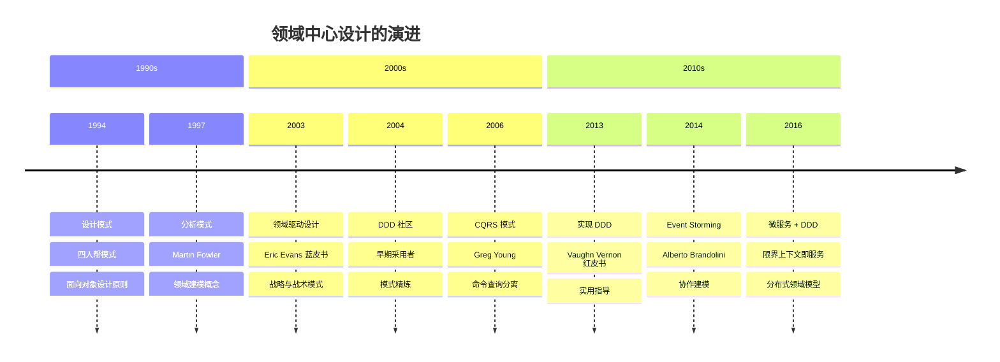
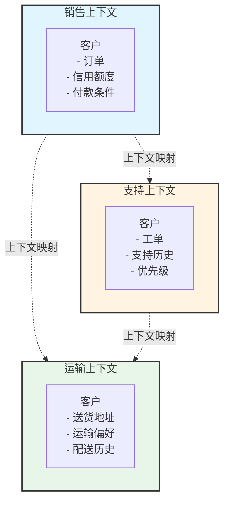
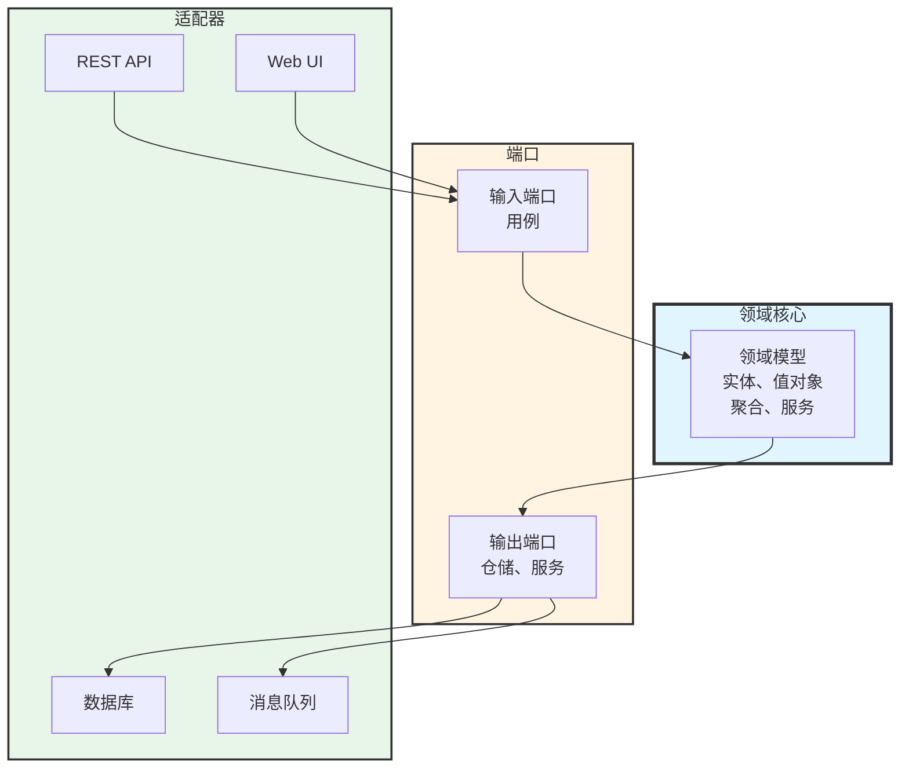

软件项目失败不是因为糟糕的代码，而是因为误解的需求。开发者构建他们认为业务需要的东西。业务利益相关者描述他们认为技术上可行的东西。业务语言与技术实现之间的鸿沟造成摩擦、延迟，以及解决错误问题的系统。

传统软件开发将数据库视为宇宙的中心。设计从数据表和关联开始。业务逻辑散落在存储过程、服务层和 UI 代码中。领域——核心业务问题——成为事后想法，埋藏在技术关注点之下。

领域驱动设计（DDD）颠覆了这种方法。它将领域模型置于中心，将业务逻辑视为系统最重要的部分。技术关注点——数据库、框架、UI——成为服务领域的实现细节。业务和开发团队使用直接出现在代码中的共享语言进行协作。

这种转变听起来简单，但需要团队对软件思考方式的根本改变。DDD 引入了建模复杂业务逻辑的模式、管理大型系统的策略，以及保持代码与业务需求一致的实践。理解 DDD 何时增加价值——以及何时更简单的方法就足够——决定了它是成为强大的工具还是过度工程的负担。

本文追溯从数据库中心到领域中心设计的演进，探索 DDD 的核心模式和实践，检视真实世界的应用，并提供何时采用这种方法的指导。

### 领域驱动设计时间轴



## 数据库中心的问题

在 DDD 之前，大多数企业应用程序遵循数据库中心的方法，造成了根本性的问题。

### 传统数据库优先设计

典型的开发流程从数据库开始：

!!!error "🚫 数据库中心的问题"
    **设计流程**
    - 从数据库架构开始
    - 创建数据表和关联
    - 生成数据访问代码
    - 在上面添加业务逻辑
    
    **问题**
    - 数据库结构驱动设计
    - 业务逻辑散落各处
    - 贫血领域模型（只有 getter/setter）
    - 技术关注点主导
    
    **后果**
    - 代码不反映业务概念
    - 变更需要数据库迁移
    - 业务规则隐藏在多个层次中
    - 难以理解和维护

在这种方法中，开发者首先设计规范化的数据库数据表。对象关系映射（ORM）工具从数据表生成类。业务逻辑被添加到任何方便的地方——存储过程、服务层、控制器或 UI 代码。结果系统没有清晰的业务概念表示。

典型的电子商务系统可能有 Order、OrderItem 和 Customer 数据表。Order 类成为具有 getter 和 setter 的数据容器。像"订单超过 $100 免运费"这样的业务规则散落在代码库中。找到业务规则的实现位置需要搜索多个文件。

### 贫血领域模型反模式

数据库中心设计产生贫血领域模型：

!!!error "🚫 贫血领域模型"
    **特征**
    - 只有属性的类
    - 领域对象中没有业务逻辑
    - 服务包含所有行为
    - 对象只是数据容器
    
    **示例**
    ```java
    public class Order {
        private Long id;
        private List<OrderItem> items;
        private BigDecimal total;
        
        // 只有 getter 和 setter
        public Long getId() { return id; }
        public void setId(Long id) { this.id = id; }
        // ... 更多 getter/setter
    }
    ```
    
    **为什么有问题**
    - 违反面向对象原则
    - 业务逻辑与数据分离
    - 难以维护不变性
    - 没有封装

贫血模型将对象视为数据结构而非行为实体。所有业务逻辑都存在于操作这些数据容器的服务类中。这种伪装成面向对象代码的过程式方法使系统更难理解和维护。

#### 为什么贫血模型在规模扩大时失败

对大多数开发者来说看起来正常的东西，随着应用程序成长会变得有问题：

!!!error "🚫 违反面向对象原则"
    **问题**
    
    面向对象程序设计承诺封装——数据和行为在一起。贫血模型通过分离它们来打破这个基本原则。
    
    **贫血方法：**
    
    Order 有数据，OrderService 有行为。这是将对象作为结构的过程式程序设计。
    
    **随着系统成长：**
    - 多个服务操作相同数据
    - OrderService、ShippingService、BillingService 都修改 Order
    - Order 行为没有单一真相来源
    - 服务间的重复逻辑
    - 不一致的状态变更
    
    **实际影响：**
    
    开发者 A 在 OrderService 中添加折扣逻辑。开发者 B 在 BillingService 中添加类似逻辑。六个月后，它们分歧了。错误报告进来：“结账和发票中的折扣计算不同。”找到所有操作 Order 的地方需要搜索整个代码库。

!!!error "🚫 业务逻辑与数据分离"
    **问题**
    
    业务规则散落在多个服务类中，使它们难以找到和维护。
    
    **示例场景：**
    
    业务规则：“订单超过 $100 免运费，但仅适用于标准配送且仅限美国本土。”
    
    **贫血实现：**
    - ShippingService 中的运费计算
    - OrderService 中的订单总额计算
    - AddressService 中的地址验证
    - PromotionService 中的资格检查
    
    **随着系统成长：**
    - 规则变更需要更新 4 个不同文件
    - 容易遗漏一个位置
    - 测试散落在多个测试文件中
    - 新开发者问：“免运费逻辑在哪里？”答案：“这很复杂...”
    
    **实际影响：**
    
    业务将规则改为“订单超过 $100 或优质会员免运费。”开发者更新 ShippingService 但忘记 PromotionService。优质会员没有获得免运费。客户投诉。紧急修补。事后检讨揭示没人知道的逻辑重复。

!!!error "🚫 难以维护不变性"
    **问题**
    
    不变性是必须始终为真的规则。贫血模型无法强制执行它们，因为任何代码都可以修改对象。
    
    **示例不变性：**
    
    “订单的总额必须等于其项目的总和。”
    
    **贫血模型：**
    
    Order 有 setTotal() 和 setItems()。没有什么能阻止：
    
    order.setTotal(100.00);
    order.setItems(itemsWorthFiftyDollars);
    
    现在订单处于无效状态。总额与项目不符。
    
    **随着系统成长：**
    - 更多代码路径修改订单
    - 每个都必须记得重新计算总额
    - 一个被遗忘的更新破坏不变性
    - 无效状态在系统中传播
    - 数据库包含不一致的数据
    
    **实际影响：**
    
    批次作业更新订单项目但忘记重新计算总额。数千个订单现在有错误的总额。财务报告不符。会计在月底结算时发现差异。工程团队花费数天编写数据迁移脚本来修复损坏的数据。根本原因：没有强制执行不变性。

!!!error "🚫 没有封装"
    **问题**
    
    公开的 getter 和 setter 暴露内部状态，允许任何代码以任意方式修改对象。
    
    **贫血模型：**
    
    每个字段都有 getter 和 setter。内部状态是公开的。
    
    **随着系统成长：**
    - 50 个不同的地方调用 order.setStatus()
    - 没有状态转换验证
    - Order 从 SHIPPED 回到 PENDING
    - 无法追踪谁改变了什么
    - 无法在不破坏现有代码的情况下添加验证
    
    **实际影响：**
    
    业务规则：“已发货的订单无法取消。”在到处都是 setter 的情况下，强制执行这个需要：
    1. 找到所有 50 个调用 setStatus() 的地方
    2. 为每个添加验证
    3. 希望没有人在没有验证的情况下添加第 51 个地方
    
    替代方案：在 setter 中添加验证。但现在在发货后执行 order.setStatus(CANCELLED) 的现有代码会中断。出现回归错误。测试失败。需要回滚。
    
    使用适当的封装，会有一个方法：order.cancel()。它强制执行规则。所有代码都使用它。无法绕过。

### 沟通鸿沟

数据库中心设计扩大了业务与开发之间的鸿沟：

!!!error "🚫 语言断层"
    **业务视角**
    - "客户下订单"
    - "订单可以在发货前取消"
    - "优质客户获得优先处理"
    
    **代码现实**
    - OrderService.createOrder()
    - OrderRepository.updateStatus()
    - CustomerTable.premiumFlag
    
    **结果**
    - 业务概念在代码中不可见
    - 开发者在语言之间翻译
    - 误解累积
    - 知识随时间流失

业务利益相关者使用业务术语描述领域。开发者使用技术术语实现。这些语言之间的翻译引入错误，并使代码库对非开发者来说难以理解。

#### 真实世界的沟通失败

语言鸿沟造成具体问题：

!!!error "🚫 翻译中的遗失"
    **场景：保险保单续约**
    
    **业务说：**
    "当保单到期时，我们需要检查客户是否有资格自动续约。符合资格的客户在到期前 30 天收到续约优惠。如果他们没有回应，保单失效，但他们有 60 天的宽限期可以在不重新核保的情况下恢复。"
    
    **开发者听到：**
    "在到期日将保单状态更新为已到期。在 30 天前发送电子邮件。如果没有回应，将状态设为失效。允许在 60 天内将状态更改为有效。"
    
    **代码现实：**
    
    PolicyService.updateStatus(policyId, "EXPIRED");
    EmailService.sendRenewalEmail(customerId, 30);
    if (noResponse) {
        PolicyService.updateStatus(policyId, "LAPSED");
    }
    
    **遗失的内容：**
    - "有资格续约"有特定的业务规则（去年没有索赔、良好的付款记录）
    - "续约优惠"是一个独特的业务概念，不仅仅是电子邮件
    - "宽限期"有法律含义，不仅仅是状态变更
    - "在不重新核保的情况下恢复"意味着跳过复杂的流程
    
    **六个月后：**
    
    业务："为什么我们向最近有索赔的客户发送续约优惠？"
    开发者："代码在到期前 30 天向所有人发送电子邮件。"
    业务："但他们不符合资格！"
    开发者："什么是'符合资格'？这不在需求中。"
    业务："我们在启动会议上讨论过这个！"
    开发者："那是六个月前，而且不在代码中。"

!!!error "🚫 隐藏的业务概念"
    **场景：电子商务促销**
    
    **业务说：**
    "我们正在进行限时抢购。优质会员获得提前访问权。普通会员可以在 2 小时后购物。销售在库存耗尽或 24 小时过去时结束，以先到者为准。"
    
    **代码现实：**
    
    if (user.isPremium() || currentTime > saleStart + 2.hours) {
        if (currentTime < saleStart + 24.hours && inventory > 0) {
            // 允许购买
        }
    }
    
    **缺少的概念：**
    - "限时抢购"是一个一流的业务概念，不仅仅是时间窗口
    - "提前访问"是一种福利，不仅仅是时间检查
    - "销售结束"有多个应该明确的条件
    
    **三个月后：**
    
    业务："我们可以将限时抢购延长到 48 小时吗？"
    开发者："让我搜索 '24'... 在 15 个不同文件中找到。"
    业务："为什么是 15 个文件？"
    开发者："限时抢购用于结账、库存、定价、报告、分析..."
    业务："你不能只改一个地方吗？"
    开发者："不能，因为'限时抢购'在代码中不存在。它只是散落的时间检查。"

!!!error "🚫 模糊的技术术语"
    **场景：订单处理**
    
    **业务问：**
    "提交订单时会发生什么？"
    
    **开发者回答：**
    "OrderController 调用 OrderService.createOrder()，它验证请求，调用 OrderRepository.save()，向消息队列发布 OrderCreatedEvent，并向客户端返回 OrderDTO。"
    
    **业务回应：**
    "我不理解任何这些。它会向客户的卡收费吗？它会保留库存吗？它会创建运输标签吗？"
    
    **问题：**
    
    开发者描述了技术实现。业务想知道业务结果。双方都不理解对方。
    
    **使用通用语言：**
    
    业务："提交订单时会发生什么？"
    开发者："系统下订单，授权付款，保留库存，并安排履行。"
    业务："完美。如果付款失败呢？"
    开发者："订单下单失败，库存被释放，客户看到付款错误。"
    
    相同的概念，相同的词语。不需要翻译。

## 领域驱动设计基础

Eric Evans 2003 年的书《领域驱动设计》引入了一种处理复杂性的综合方法。

### 核心哲学

DDD 的基础建立在几个关键原则上：

!!!anote "🎯 DDD 核心原则"
    **领域优先**
    - 业务逻辑是最重要的部分
    - 技术关注点服务领域
    - 模型反映业务现实
    - 代码说业务语言
    
    **通用语言**
    - 业务与开发者之间的共享词汇
    - 对话和代码中使用相同术语
    - 减少翻译错误
    - 随理解演进
    
    **迭代建模**
    - 模型通过协作改进
    - 重构以获得更深入的洞察
    - 持续学习
    - 代码和模型保持一致

DDD 将领域模型视为系统的核心。其他一切——数据库、UI、外部服务——都是为了支持领域而存在。这种优先级的颠倒改变了团队处理设计的方式。

### 通用语言

最基本的 DDD 实践是创建共享语言：

!!!success "✅ 通用语言的好处"
    **它是什么**
    - 领域的共同词汇
    - 团队中每个人都使用
    - 直接出现在代码中
    - 在模型中记录
    
    **如何运作**
    - 业务："客户下订单"
    - 代码：`customer.placeOrder()`
    - 不需要翻译
    - 立即理解
    
    **影响**
    - 减少误解
    - 使代码自我记录
    - 使业务能够阅读代码结构
    - 揭示建模问题

当业务利益相关者说"下订单"时，代码有一个 placeOrder() 方法。当他们讨论"运输政策"时，代码有一个 ShippingPolicy 类。会议中的语言与代码中的语言相符。

这种一致性具有深远的影响。开发者停止在业务和技术术语之间翻译。业务利益相关者可以审查类图并理解系统结构。业务理解与代码实现之间的不匹配立即变得可见。

### 丰富领域模型

DDD 提倡具有行为的丰富领域模型：

!!!success "✅ 丰富领域模型"
    **特征**
    - 对象包含数据和行为
    - 业务规则存在于领域对象中
    - 封装保护不变性
    - 表达性、揭示意图的方法
    
    **示例**
    ```java
    public class Order {
        private OrderId id;
        private List<OrderLine> lines;
        private OrderStatus status;
        
        public void addLine(Product product, int quantity) {
            if (status != OrderStatus.DRAFT) {
                throw new IllegalStateException(
                    "无法修改已提交的订单");
            }
            lines.add(new OrderLine(product, quantity));
        }
        
        public Money calculateTotal() {
            return lines.stream()
                .map(OrderLine::getSubtotal)
                .reduce(Money.ZERO, Money::add);
        }
    }
    ```
    
    **好处**
    - 业务逻辑集中
    - 不变性得到强制执行
    - 自我记录的代码
    - 更容易测试和维护

丰富模型将业务规则封装在领域对象中。Order 类知道如何添加项目、计算总额和强制执行业务约束。业务逻辑不会散落在服务层中——它存在于应该存在的地方。

#### 丰富模型如何解决实际问题

!!!success "✅ 业务逻辑集中"
    **好处**
    
    与实体相关的所有行为都存在于该实体中。无需在服务类中搜索。
    
    **示例：订单折扣**
    
    **丰富模型：**
    
    Order 知道如何根据其状态计算自己的折扣。
    
    **影响：**
    - 需要更改折扣逻辑？编辑 Order 类。
    - 需要测试折扣？测试 Order 类。
    - 需要理解折扣？阅读 Order 类。
    - 一个地方，一个真相来源。
    
    **实际场景：**
    
    业务："我们需要添加'买 3 送 1'促销。"
    
    开发者查看 Order.applyPromotions() 方法。看到百分比折扣和固定金额折扣的现有逻辑。添加新的促销类型。更新测试。完成。
    
    时间：2 小时。
    
    **贫血替代方案：**
    
    开发者搜索代码库中的"折扣"。找到：
    - DiscountService.calculateDiscount()
    - PricingService.applyPromotions()
    - OrderService.computeTotal()
    - CheckoutController.validateDiscounts()
    
    哪一个处理促销？全部？部分？开发者阅读每个文件。发现逻辑被分割。更新三个文件。遗漏一个。生产中的错误。
    
    时间：2 天 + 1 个紧急修补。

!!!success "✅ 不变性得到强制执行"
    **好处**
    
    必须始终为真的业务规则由对象本身强制执行。
    
    **示例：订单状态转换**
    
    **丰富模型：**
    
    Order 控制自己的状态转换。无效的转换是不可能的。
    
    **影响：**
    - 无法取消已发货的订单
    - 无法发货已取消的订单
    - 无法修改已完成的订单
    - 保证有效状态
    
    **实际场景：**
    
    客服代表尝试取消已发货的订单。系统回应："无法取消已发货的订单。"代表立即看到错误。致电客户解释。客户理解。
    
    **贫血替代方案：**
    
    代表调用 order.setStatus("CANCELLED")。没有验证。订单现在在数据库中被取消，但包裹已在运输中。客户收到包裹。计费系统看到已取消的订单，不收费。公司免费运送产品。损失：$500。
    
    每月乘以 100 个类似事件。年度损失：$600,000。

!!!success "✅ 自我记录的代码"
    **好处**
    
    方法名称和结构揭示业务逻辑。代码读起来像业务需求。
    
    **示例：运输资格**
    
    **丰富模型：**
    
    if (order.isEligibleForFreeShipping()) {
        shipping = ShippingCost.FREE;
    }
    
    **贫血替代方案：**
    
    if (order.getTotal().compareTo(new BigDecimal("100")) >= 0 
        && order.getShippingAddress().getCountry().equals("US")
        && !order.getShippingAddress().getState().equals("AK")
        && !order.getShippingAddress().getState().equals("HI")
        && order.getShippingMethod().equals("STANDARD")) {
        shipping = new BigDecimal("0.00");
    }
    
    **影响：**
    
    丰富模型：业务利益相关者阅读代码，立即理解。
    贫血模型：业务利益相关者看到技术细节，放弃。
    
    **实际场景：**
    
    业务想审查免运费逻辑。使用丰富模型，开发者展示：
    
    public boolean isEligibleForFreeShipping() {
        return meetsMinimumAmount() 
            && isInContinentalUS() 
            && usesStandardShipping();
    }
    
    业务："完美，这正是我们的规则。"
    
    使用贫血模型，开发者展示 20 行条件逻辑。业务："我相信你做对了。"

!!!success "✅ 更容易测试和维护"
    **好处**
    
    测试业务逻辑意味着测试领域对象。无需模拟复杂的服务依赖。
    
    **示例：订单验证**
    
    **丰富模型测试：**
    
    @Test
    void cannotAddItemsToSubmittedOrder() {
        Order order = new Order();
        order.addItem(product, 1);
        order.submit();
        
        assertThrows(IllegalStateException.class, 
            () -> order.addItem(anotherProduct, 1));
    }
    
    简单。直接。没有模拟。测试业务规则。
    
    **贫血模型测试：**
    
    @Test
    void cannotAddItemsToSubmittedOrder() {
        Order order = new Order();
        order.setStatus(OrderStatus.SUBMITTED);
        
        OrderService service = new OrderService(
            mockRepository, 
            mockValidator, 
            mockEventPublisher,
            mockInventoryService,
            mockPricingService);
        
        when(mockRepository.findById(orderId))
            .thenReturn(order);
        when(mockValidator.validate(any()))
            .thenReturn(validationResult);
        // ... 20 行更多的模拟设置
        
        assertThrows(BusinessException.class,
            () -> service.addItemToOrder(orderId, productId, 1));
    }
    
    复杂。脆弱。测试基础设施多于业务逻辑。
    
    **影响：**
    
    丰富模型：100 个测试，5 分钟执行，易于维护。
    贫血模型：100 个测试，30 分钟执行，基础设施变更时中断。
    
    **实际场景：**
    
    团队从 MySQL 切换到 PostgreSQL。丰富模型测试：全部通过。贫血模型测试：30 个失败，因为它们模拟了已变更的仓储内部。

## 战略设计模式

DDD 提供战略模式来管理大型系统中的复杂性。这些模式帮助将大型领域组织成可管理的部分。

!!!anote "📚 相关模式"
    **战略模式：**
    - [限界上下文](#限界上下文) - 模型的明确边界
    - [上下文映射](#上下文映射) - 上下文之间的关系
    - [聚合](#聚合) - 一致性边界
    - [通用语言](#通用语言) - 共享词汇
    
    **架构模式：**
    - [六边形架构](#六边形架构) - 端口与适配器
    - [微服务](#微服务与限界上下文) - 服务边界
    - [事件溯源](#事件溯源与-cqrs) - 基于事件的持久化
    - [CQRS](#事件溯源与-cqrs) - 分离读取/写入模型
    
    **战术模式：**
    - [实体](#实体-vs-值对象) - 具有标识的对象
    - [值对象](#实体-vs-值对象) - 不可变值
    - [领域事件](#领域事件) - 业务发生
    - [仓储](#构建块) - 持久化抽象

DDD 提供战略模式来管理大型系统中的复杂性。

### 限界上下文

最重要的战略模式是限界上下文：

!!!anote "🎯 限界上下文概念"
    **定义**
    - 模型的明确边界
    - 在边界内，术语具有精确含义
    - 不同上下文可以有不同模型
    - 通过分离减少复杂性
    
    **为什么重要**
    - "客户"在不同上下文中意味着不同的事情
    - 销售上下文：客户有订单、信用额度
    - 支持上下文：客户有工单、历史记录
    - 运输上下文：客户有送货地址
    
    **好处**
    - 每个上下文保持专注
    - 团队可以独立工作
    - 模型保持连贯
    - 防止"一个模型统治一切"

大型系统无法拥有单一统一模型。"客户"一词对销售、支持和运输团队意味着不同的事情。试图创建一个满足所有上下文的 Customer 类会产生臃肿、不连贯的模型。

限界上下文通过明确分离模型来解决这个问题。每个上下文都有自己针对其需求优化的模型。销售上下文有一个具有订单历史的 Customer。支持上下文有一个具有支持工单的 Customer。这些是不同的模型，这没问题。



### 上下文映射

限界上下文必须集成，需要上下文映射：

!!!anote "🗺️ 上下文映射模式"
    **合作伙伴**
    - 两个上下文紧密协作
    - 团队协调变更
    - 共享成功标准
    
    **客户-供应商**
    - 上游上下文提供数据
    - 下游上下文消费
    - 正式接口协议
    
    **顺从者**
    - 下游顺从上游模型
    - 当上游不会改变时使用
    - 接受他们的模型
    
    **防腐层**
    - 在上下文之间翻译
    - 保护领域模型免受外部影响
    - 隔离遗留系统
    
    **共享核心**
    - 上下文之间的小型共享模型
    - 需要协调
    - 谨慎使用

上下文映射定义限界上下文如何关联。防腐层保护你的领域模型免受外部系统影响。客户-供应商关系建立明确的责任。这些模式使集成明确且可管理。

### 聚合

聚合定义一致性边界：

!!!anote "📦 聚合模式"
    **定义**
    - 作为单元处理的对象集群
    - 一个实体是聚合根
    - 外部引用仅指向根
    - 在边界内强制执行一致性
    
    **规则**
    - 根实体具有全局标识
    - 内部实体具有本地标识
    - 外部对象不能持有对内部的引用
    - 变更通过根进行
    
    **示例**
    - Order 是聚合根
    - OrderLine 是内部实体
    - 外部代码引用 Order，而非 OrderLine
    - Order 确保所有行的一致性

聚合防止"大泥球"，即所有东西都引用所有东西。通过定义明确的边界和访问规则，聚合使系统更易于维护并支持分布式事务。

## 战术设计模式

DDD 提供战术模式来实现领域模型。

### 构建块

战术模式形成领域模型的词汇：

!!!anote "🧱 DDD 构建块"
    **实体**
    - 具有标识的对象
    - 标识随时间持续
    - 可变状态
    - 示例：Customer、Order
    
    **值对象**
    - 由属性定义的对象
    - 没有标识
    - 不可变
    - 示例：Money、Address、DateRange
    
    **服务**
    - 不属于实体的操作
    - 无状态
    - 领域操作
    - 示例：PricingService、ShippingCalculator
    
    **仓储**
    - 持久化的抽象
    - 类似集合的接口
    - 隐藏数据库细节
    - 示例：OrderRepository
    
    **工厂**
    - 复杂对象创建
    - 封装构造逻辑
    - 确保有效对象
    - 示例：OrderFactory

这些模式提供了组织领域逻辑的结构化方式。实体具有标识和生命周期。值对象表示没有标识的概念。服务处理跨越多个对象的操作。仓储抽象持久化。工厂处理复杂的创建。

### 实体 vs 值对象

理解区别至关重要：

!!!anote "🔍 实体 vs 值对象"
    **实体示例：Customer**
    ```java
    public class Customer {
        private CustomerId id;  // 标识
        private String name;
        private Email email;
        
        // 基于标识的相等性
        public boolean equals(Object o) {
            if (!(o instanceof Customer)) return false;
            Customer other = (Customer) o;
            return id.equals(other.id);
        }
    }
    ```
    
    **值对象示例：Money**
    ```java
    public class Money {
        private final BigDecimal amount;
        private final Currency currency;
        
        // 不可变
        public Money add(Money other) {
            if (!currency.equals(other.currency)) {
                throw new IllegalArgumentException(
                    "无法加总不同货币");
            }
            return new Money(
                amount.add(other.amount), 
                currency);
        }
        
        // 基于值的相等性
        public boolean equals(Object o) {
            if (!(o instanceof Money)) return false;
            Money other = (Money) o;
            return amount.equals(other.amount) 
                && currency.equals(other.currency);
        }
    }
    ```

实体通过标识进行比较——两个具有相同名称的客户如果有不同的 ID 就是不同的。值对象通过值进行比较——两个具有相同金额和货币的 Money 对象是相同的。

### 领域事件

领域事件捕获重要的业务发生：

!!!anote "📢 领域事件"
    **目的**
    - 表示发生的事情
    - 过去式命名
    - 不可变
    - 实现松耦合
    
    **示例**
    ```java
    public class OrderPlaced {
        private final OrderId orderId;
        private final CustomerId customerId;
        private final Instant occurredAt;
        
        public OrderPlaced(OrderId orderId, 
                          CustomerId customerId) {
            this.orderId = orderId;
            this.customerId = customerId;
            this.occurredAt = Instant.now();
        }
    }
    ```
    
    **好处**
    - 明确的业务事件
    - 解耦的组件
    - 审计轨迹
    - 支持事件溯源

领域事件使隐含概念变得明确。系统不是默默更新状态，而是发布 OrderPlaced 事件。系统的其他部分可以反应——发送确认电子邮件、更新库存、触发运输。事件实现松耦合并提供自然的审计轨迹。

## 真实世界应用

DDD 在特定情境中表现出色，但并非总是正确的选择。

### 何时 DDD 增加价值

DDD 最适合复杂领域：

!!!success "✅ 良好的 DDD 候选者"
    **复杂业务逻辑**
    - 许多业务规则
    - 规则以复杂方式交互
    - 需要领域专家
    - 示例：保险承保、交易系统
    
    **协作建模**
    - 业务专家可用
    - 可能进行迭代精炼
    - 共享理解有价值
    - 示例：定制化企业应用程序
    
    **长期系统**
    - 系统将演进多年
    - 可维护性至关重要
    - 知识保存重要
    - 示例：核心业务系统
    
    **战略差异化**
    - 领域是竞争优势
    - 定制化逻辑，而非通用 CRUD
    - 业务规则中的创新
    - 示例：推荐引擎、定价算法

当领域复杂性证明其合理性时，DDD 的开销是值得的。具有复杂业务规则、多个利益相关者和长生命周期的系统受益于 DDD 的建模严谨性。

### 何时更简单的方法就足够

并非每个系统都需要 DDD：

!!!warning "⚠️ DDD 可能过度"
    **简单 CRUD 应用程序**
    - 基本的创建、读取、更新、删除
    - 最少的业务逻辑
    - 数据管理焦点
    - 更好的方法：简单分层架构
    
    **技术问题**
    - 算法密集型系统
    - 基础设施工具
    - 没有复杂领域
    - 更好的方法：技术设计模式
    
    **原型和 MVP**
    - 速度优于结构
    - 不确定的需求
    - 可能被丢弃
    - 更好的方法：快速开发框架
    
    **没有领域专家的小团队**
    - 没有人可以协作
    - 有限的领域知识
    - 无法建立通用语言
    - 更好的方法：更简单的模式

具有基本 CRUD 操作的内容管理系统不需要 DDD。测试市场适应性的原型不应投资于精细的领域建模。DDD 的好处伴随着成本——复杂性、学习曲线和开发时间。

### 电子商务平台示例

考虑电子商务平台的订单管理：

!!!anote "🛒 电子商务领域模型"
    **限界上下文**
    - 目录：产品、类别、搜索
    - 购物：购物车、结账、付款
    - 订单管理：订单、履行、跟踪
    - 客户：账户、偏好、历史
    
    **关键聚合**
    - Order（根：Order，包含：OrderLine）
    - ShoppingCart（根：Cart，包含：CartItem）
    - Product（根：Product，包含：Variant）
    
    **领域事件**
    - OrderPlaced
    - PaymentProcessed
    - OrderShipped
    - OrderCancelled
    
    **值对象**
    - Money（金额 + 货币）
    - Address（街道、城市、邮政编码）
    - ProductSku（标识符）

这种结构使业务概念明确。Order 聚合确保一致性——你不能有没有订单的订单行。领域事件实现集成——当 OrderPlaced 触发时，库存更新并发送电子邮件。通用语言贯穿始终——业务利益相关者和开发者使用相同的术语。

### 金融服务示例

交易系统展示了 DDD 的力量：

!!!anote "💰 交易系统领域"
    **复杂业务规则**
    - 每个交易员的头寸限制
    - 风险计算
    - 法规遵从
    - 市场时间和假日
    
    **丰富领域模型**
    ```java
    public class Trade {
        public void execute() {
            if (!market.isOpen()) {
                throw new MarketClosedException();
            }
            if (exceedsPositionLimit()) {
                throw new PositionLimitException();
            }
            if (!passesRiskCheck()) {
                throw new RiskLimitException();
            }
            // 执行交易
        }
    }
    ```
    
    **好处**
    - 业务规则集中
    - 在代码中强制执行合规性
    - 领域专家可以审查逻辑
    - 变更追溯到业务需求

金融系统具有复杂、不断演进的规则。DDD 对领域模型的关注使这种复杂性保持可管理。当法规改变时，领域模型改变。代码反映当前的业务理解。


## 实现策略

采用 DDD 需要实用的策略。

### 开始使用 DDD

从战略模式开始：

!!!tip "💡 DDD 采用路径"
    **阶段 1：战略设计**
    1. 识别限界上下文
    2. 创建上下文映射
    3. 建立通用语言
    4. 定义核心领域
    
    **阶段 2：战术模式**
    1. 建模关键聚合
    2. 识别实体和值对象
    3. 定义领域事件
    4. 实现仓储
    
    **阶段 3：精炼**
    1. 重构以获得更深入的洞察
    2. 演进通用语言
    3. 调整边界
    4. 改进模型

从战略设计开始以理解大局。在深入战术模式之前识别限界上下文。这可以防止过早优化并确保努力集中在核心领域。

### Event Storming

Event Storming 促进协作建模：

!!!anote "🎨 Event Storming 流程"
    **它是什么**
    - 基于工作坊的建模技术
    - 在墙上使用便利贴
    - 协作和可视化
    - 快速领域探索
    
    **步骤**
    1. 识别领域事件（橙色便利贴）
    2. 添加触发事件的命令（蓝色便利贴）
    3. 识别聚合（黄色便利贴）
    4. 找到限界上下文（边界）
    5. 发现问题和机会（红色便利贴）
    
    **好处**
    - 吸引整个团队
    - 揭示隐藏的复杂性
    - 建立共享理解
    - 快速且有效

Event Storming 将业务专家和开发者聚集在一起探索领域。可视化、协作的性质快速浮现假设和分歧。几个小时的 Event Storming 可以揭示通过传统需求收集需要数周才能发现的洞察。

### 避免常见陷阱

DDD 有众所周知的反模式：

!!!warning "⚠️ DDD 反模式"
    **贫血领域模型**
    - 问题：没有行为的对象
    - 解决方案：将逻辑移入领域对象
    
    **上帝聚合**
    - 问题：聚合太大
    - 解决方案：拆分成更小的聚合
    
    **缺少限界上下文**
    - 问题：一个模型适用于所有事物
    - 解决方案：识别并分离上下文
    
    **忽略通用语言**
    - 问题：代码使用技术术语
    - 解决方案：重构以匹配业务语言
    
    **过度工程简单领域**
    - 问题：对 CRUD 应用程序使用 DDD
    - 解决方案：使用更简单的方法

最常见的错误是在不理解其目的的情况下应用 DDD 模式。聚合变得臃肿。通用语言被忽略。领域模型变得贫血。成功需要纪律和持续重构以获得更深入的洞察。

## DDD 与现代架构

DDD 影响当代架构模式。

### 微服务与限界上下文

限界上下文自然映射到微服务：

!!!anote "🔗 DDD + 微服务"
    **对齐**
    - 每个微服务是一个限界上下文
    - 明确的边界和责任
    - 独立部署
    - 团队所有权
    
    **好处**
    - DDD 提供服务边界
    - 防止分布式单体
    - 实现自主团队
    - 自然的服务分解
    
    **挑战**
    - 分布式事务
    - 数据一致性
    - 集成复杂性
    - 运营开销

没有限界上下文的微服务经常失败——服务有不明确的边界和紧密耦合。DDD 的战略模式提供有原则的服务分解。每个限界上下文成为具有明确领域焦点的微服务。

### 事件溯源与 CQRS

DDD 与事件溯源和 CQRS 配合良好：

!!!anote "📊 事件溯源 + CQRS"
    **事件溯源**
    - 存储领域事件，而非当前状态
    - 通过重放事件重建状态
    - 完整的审计轨迹
    - 时间旅行调试
    
    **CQRS（命令查询责任分离）**
    - 分离读取和写入模型
    - 独立优化每个
    - 读取/写入使用不同数据库
    - 最终一致性
    
    **与 DDD 集成**
    - 领域事件是一等公民
    - 聚合产生事件
    - 读取模型服务查询
    - 写入模型强制执行不变性

事件溯源使领域事件成为真相来源。CQRS 分离命令处理（写入）和查询（读取）。与 DDD 一起，它们创建业务事件明确、可审计并驱动整个架构的系统。

### 六边形架构

DDD 自然适合六边形（端口与适配器）架构：



!!!anote "🏛️ 六边形架构 + DDD"
    **结构**
    - 领域模型在中心
    - 端口定义接口
    - 适配器实现技术细节
    - 依赖指向内部
    
    **好处**
    - 领域与基础设施隔离
    - 易于测试领域逻辑
    - 交换实现
    - 技术无关的核心

六边形架构使领域模型独立于技术关注点。数据库、框架和外部服务成为实现细节。领域保持纯粹，专注于业务逻辑。

## 衡量成功

DDD 的价值出现在特定结果中：

!!!success "✅ DDD 成功指标"
    **沟通**
    - 业务和开发者使用相同术语
    - 更少的误解
    - 更快的需求澄清
    - 代码审查包括业务利益相关者
    
    **可维护性**
    - 业务逻辑易于找到
    - 变更局限于聚合
    - 重构不会破坏一切
    - 新开发者快速理解
    
    **灵活性**
    - 业务规则变更简单明了
    - 新功能自然契合
    - 技术变更不影响领域
    - 系统随业务演进
    
    **质量**
    - 业务逻辑中的错误更少
    - 不变性得到强制执行
    - 边缘案例得到处理
    - 领域测试可读

成功不是通过模式采用来衡量，而是通过业务结果。业务利益相关者能理解代码结构吗？变更需要更少时间吗？系统更可靠吗？这些指标揭示 DDD 是否提供价值。

## 结论

领域驱动设计代表从数据库中心到领域中心软件开发的根本转变。通过将领域模型置于中心、建立通用语言，以及应用战略和战术模式，DDD 创建与业务需求一致且随时间保持可维护的系统。

从传统方法到 DDD 的旅程揭示了重要的教训：

**复杂性需要结构**：简单的 CRUD 应用程序不需要 DDD。具有复杂业务规则的复杂领域受益于 DDD 的建模严谨性。关键是将方法与问题复杂性相匹配。

**语言很重要**：通用语言不仅仅是锦上添花——它是基础。当业务和开发者共享词汇时，误解减少，代码变得自我记录。维护这种共享语言的纪律持续带来回报。

**边界实现规模**：限界上下文防止"一个模型统治一切"的陷阱。通过明确分离关注点，系统保持可理解，团队可以独立工作。随着系统成长，这变得至关重要。

**模式服务目的**：DDD 的模式——聚合、实体、值对象、领域事件——不是货物崇拜实践。每个都解决特定问题。理解它们解决的问题可以防止误用。

**协作驱动质量**：当业务专家和开发者持续协作时，DDD 效果最好。Event Storming 和其他协作建模技术比传统需求文档更快地浮现假设并建立共享理解。

采用 DDD 的决定应该是深思熟虑的。对于具有复杂业务逻辑、长生命周期和可用领域专家的系统，DDD 提供多年来回报的结构。对于更简单的系统、原型或技术问题，更轻量的方法就足够了。

现代架构模式——微服务、事件溯源、CQRS、六边形架构——自然与 DDD 原则一致。限界上下文提供服务边界。领域事件实现事件溯源。领域模型保持独立于技术关注点。

DDD 不是银弹。它需要投资、纪律和持续重构以获得更深入的洞察。但对于正确的问题，它将软件开发从在业务和技术语言之间翻译转变为构建直接说业务语言的系统。

成功的最终衡量标准是软件是否有效解决真实业务问题，并能随着这些问题的变化而演进。DDD 提供工具和实践来实现这一目标，但只有在深思熟虑地应用于其复杂性合理的领域时才有效。
