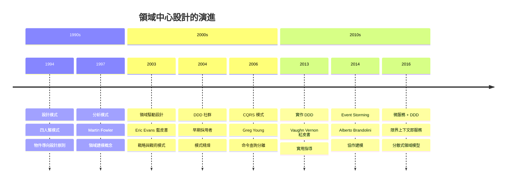
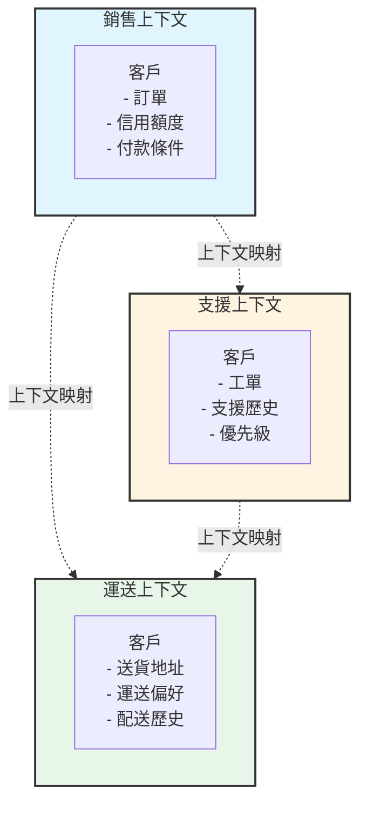
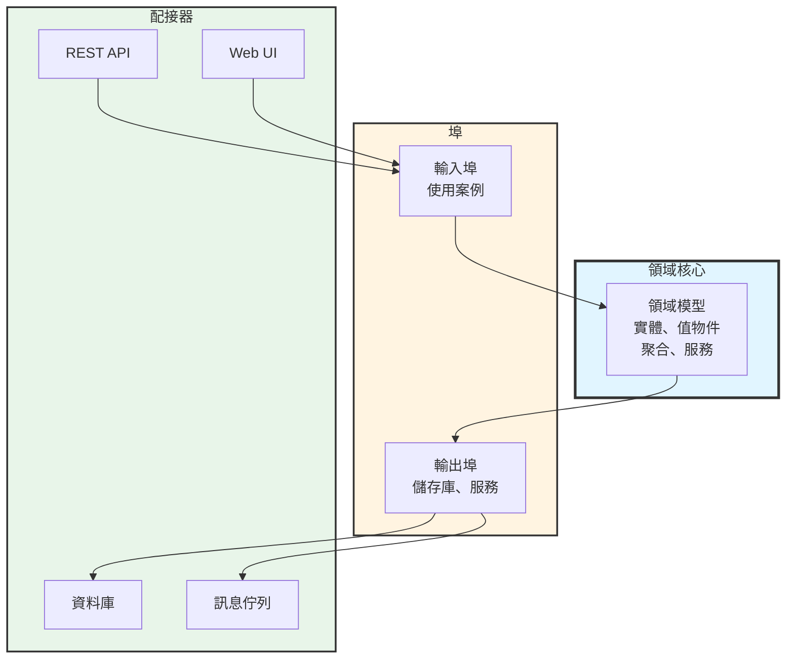

軟體專案失敗不是因為糟糕的程式碼，而是因為誤解的需求。開發者建構他們認為業務需要的東西。業務利害關係人描述他們認為技術上可行的東西。業務語言與技術實作之間的鴻溝造成摩擦、延遲，以及解決錯誤問題的系統。

傳統軟體開發將資料庫視為宇宙的中心。設計從資料表和關聯開始。業務邏輯散落在預存程序、服務層和 UI 程式碼中。領域——核心業務問題——成為事後想法，埋藏在技術關注點之下。

領域驅動設計（DDD）顛覆了這種方法。它將領域模型置於中心，將業務邏輯視為系統最重要的部分。技術關注點——資料庫、框架、UI——成為服務領域的實作細節。業務和開發團隊使用直接出現在程式碼中的共享語言進行協作。

這種轉變聽起來簡單，但需要團隊對軟體思考方式的根本改變。DDD 引入了建模複雜業務邏輯的模式、管理大型系統的策略，以及保持程式碼與業務需求一致的實踐。理解 DDD 何時增加價值——以及何時更簡單的方法就足夠——決定了它是成為強大的工具還是過度工程的負擔。

本文追溯從資料庫中心到領域中心設計的演進，探索 DDD 的核心模式和實踐，檢視真實世界的應用，並提供何時採用這種方法的指導。

### 領域驅動設計時間軸



## 資料庫中心的問題

在 DDD 之前，大多數企業應用程式遵循資料庫中心的方法，造成了根本性的問題。

### 傳統資料庫優先設計

典型的開發流程從資料庫開始：

!!!error "🚫 資料庫中心的問題"
    **設計流程**
    - 從資料庫架構開始
    - 建立資料表和關聯
    - 產生資料存取程式碼
    - 在上面添加業務邏輯
    
    **問題**
    - 資料庫結構驅動設計
    - 業務邏輯散落各處
    - 貧血領域模型（只有 getter/setter）
    - 技術關注點主導
    
    **後果**
    - 程式碼不反映業務概念
    - 變更需要資料庫遷移
    - 業務規則隱藏在多個層次中
    - 難以理解和維護

在這種方法中，開發者首先設計正規化的資料庫資料表。物件關聯映射（ORM）工具從資料表產生類別。業務邏輯被添加到任何方便的地方——預存程序、服務層、控制器或 UI 程式碼。結果系統沒有清晰的業務概念表示。

典型的電子商務系統可能有 Order、OrderItem 和 Customer 資料表。Order 類別成為具有 getter 和 setter 的資料容器。像「訂單超過 $100 免運費」這樣的業務規則散落在程式碼庫中。找到業務規則的實作位置需要搜尋多個檔案。

### 貧血領域模型反模式

資料庫中心設計產生貧血領域模型：

!!!error "🚫 貧血領域模型"
    **特徵**
    - 只有屬性的類別
    - 領域物件中沒有業務邏輯
    - 服務包含所有行為
    - 物件只是資料容器
    
    **範例**
    ```java
    public class Order {
        private Long id;
        private List<OrderItem> items;
        private BigDecimal total;
        
        // 只有 getter 和 setter
        public Long getId() { return id; }
        public void setId(Long id) { this.id = id; }
        // ... 更多 getter/setter
    }
    ```
    
    **為什麼有問題**
    - 違反物件導向原則
    - 業務邏輯與資料分離
    - 難以維護不變性
    - 沒有封裝

貧血模型將物件視為資料結構而非行為實體。所有業務邏輯都存在於操作這些資料容器的服務類別中。這種偽裝成物件導向程式碼的程序式方法使系統更難理解和維護。

#### 為什麼貧血模型在規模擴大時失敗

對大多數開發者來說看起來正常的東西，隨著應用程式成長會變得有問題：

!!!error "🚫 違反物件導向原則"
    **問題**
    
    物件導向程式設計承諾封裝——資料和行為在一起。貧血模型透過分離它們來打破這個基本原則。
    
    **貧血方法：**
    
    Order 有資料，OrderService 有行為。這是將物件作為結構的程序式程式設計。
    
    **隨著系統成長：**
    - 多個服務操作相同資料
    - OrderService、ShippingService、BillingService 都修改 Order
    - Order 行為沒有單一真相來源
    - 服務間的重複邏輯
    - 不一致的狀態變更
    
    **實際影響：**
    
    開發者 A 在 OrderService 中添加折扣邏輯。開發者 B 在 BillingService 中添加類似邏輯。六個月後，它們分歧了。錯誤報告進來：「結帳和發票中的折扣計算不同。」找到所有操作 Order 的地方需要搜尋整個程式碼庫。

!!!error "🚫 業務邏輯與資料分離"
    **問題**
    
    業務規則散落在多個服務類別中，使它們難以找到和維護。
    
    **範例場景：**
    
    業務規則：「訂單超過 $100 免運費，但僅適用於標準配送且僅限美國本土。」
    
    **貧血實作：**
    - ShippingService 中的運費計算
    - OrderService 中的訂單總額計算
    - AddressService 中的地址驗證
    - PromotionService 中的資格檢查
    
    **隨著系統成長：**
    - 規則變更需要更新 4 個不同檔案
    - 容易遺漏一個位置
    - 測試散落在多個測試檔案中
    - 新開發者問：「免運費邏輯在哪裡？」答案：「這很複雜...」
    
    **實際影響：**
    
    業務將規則改為「訂單超過 $100 或優質會員免運費。」開發者更新 ShippingService 但忘記 PromotionService。優質會員沒有獲得免運費。客戶投訴。緊急修補。事後檢討揭示沒人知道的邏輯重複。

!!!error "🚫 難以維護不變性"
    **問題**
    
    不變性是必須始終為真的規則。貧血模型無法強制執行它們，因為任何程式碼都可以修改物件。
    
    **範例不變性：**
    
    「訂單的總額必須等於其項目的總和。」
    
    **貧血模型：**
    
    Order 有 setTotal() 和 setItems()。沒有什麼能阻止：
    
    order.setTotal(100.00);
    order.setItems(itemsWorthFiftyDollars);
    
    現在訂單處於無效狀態。總額與項目不符。
    
    **隨著系統成長：**
    - 更多程式碼路徑修改訂單
    - 每個都必須記得重新計算總額
    - 一個被遺忘的更新破壞不變性
    - 無效狀態在系統中傳播
    - 資料庫包含不一致的資料
    
    **實際影響：**
    
    批次作業更新訂單項目但忘記重新計算總額。數千個訂單現在有錯誤的總額。財務報告不符。會計在月底結算時發現差異。工程團隊花費數天編寫資料遷移腳本來修復損壞的資料。根本原因：沒有強制執行不變性。

!!!error "🚫 沒有封裝"
    **問題**
    
    公開的 getter 和 setter 暴露內部狀態，允許任何程式碼以任意方式修改物件。
    
    **貧血模型：**
    
    每個欄位都有 getter 和 setter。內部狀態是公開的。
    
    **隨著系統成長：**
    - 50 個不同的地方呼叫 order.setStatus()
    - 沒有狀態轉換驗證
    - Order 從 SHIPPED 回到 PENDING
    - 無法追蹤誰改變了什麼
    - 無法在不破壞現有程式碼的情況下添加驗證
    
    **實際影響：**
    
    業務規則：「已出貨的訂單無法取消。」在到處都是 setter 的情況下，強制執行這個需要：
    1. 找到所有 50 個呼叫 setStatus() 的地方
    2. 為每個添加驗證
    3. 希望沒有人在沒有驗證的情況下添加第 51 個地方
    
    替代方案：在 setter 中添加驗證。但現在在出貨後執行 order.setStatus(CANCELLED) 的現有程式碼會中斷。出現回歸錯誤。測試失敗。需要回滾。
    
    使用適當的封裝，會有一個方法：order.cancel()。它強制執行規則。所有程式碼都使用它。無法繞過。

### 溝通鴻溝

資料庫中心設計擴大了業務與開發之間的鴻溝：

!!!error "🚫 語言斷層"
    **業務觀點**
    - 「客戶下訂單」
    - 「訂單可以在出貨前取消」
    - 「優質客戶獲得優先處理」
    
    **程式碼現實**
    - OrderService.createOrder()
    - OrderRepository.updateStatus()
    - CustomerTable.premiumFlag
    
    **結果**
    - 業務概念在程式碼中不可見
    - 開發者在語言之間翻譯
    - 誤解累積
    - 知識隨時間流失

業務利害關係人使用業務術語描述領域。開發者使用技術術語實作。這些語言之間的翻譯引入錯誤，並使程式碼庫對非開發者來說難以理解。

#### 真實世界的溝通失敗

語言鴻溝造成具體問題：

!!!error "🚫 翻譯中的遺失"
    **場景：保險保單續約**
    
    **業務說：**
    「當保單到期時，我們需要檢查客戶是否有資格自動續約。符合資格的客戶在到期前 30 天收到續約優惠。如果他們沒有回應，保單失效，但他們有 60 天的寬限期可以在不重新核保的情況下恢復。」
    
    **開發者聽到：**
    「在到期日將保單狀態更新為已到期。在 30 天前發送電子郵件。如果沒有回應，將狀態設為失效。允許在 60 天內將狀態更改為有效。」
    
    **程式碼現實：**
    
    PolicyService.updateStatus(policyId, "EXPIRED");
    EmailService.sendRenewalEmail(customerId, 30);
    if (noResponse) {
        PolicyService.updateStatus(policyId, "LAPSED");
    }
    
    **遺失的內容：**
    - 「有資格續約」有特定的業務規則（去年沒有索賠、良好的付款記錄）
    - 「續約優惠」是一個獨特的業務概念，不僅僅是電子郵件
    - 「寬限期」有法律含義，不僅僅是狀態變更
    - 「在不重新核保的情況下恢復」意味著跳過複雜的流程
    
    **六個月後：**
    
    業務：「為什麼我們向最近有索賠的客戶發送續約優惠？」
    開發者：「程式碼在到期前 30 天向所有人發送電子郵件。」
    業務：「但他們不符合資格！」
    開發者：「什麼是『符合資格』？這不在需求中。」
    業務：「我們在啟動會議上討論過這個！」
    開發者：「那是六個月前，而且不在程式碼中。」

!!!error "🚫 隱藏的業務概念"
    **場景：電子商務促銷**
    
    **業務說：**
    「我們正在進行限時搶購。優質會員獲得提前訪問權。普通會員可以在 2 小時後購物。銷售在庫存耗盡或 24 小時過去時結束，以先到者為準。」
    
    **程式碼現實：**
    
    if (user.isPremium() || currentTime > saleStart + 2.hours) {
        if (currentTime < saleStart + 24.hours && inventory > 0) {
            // 允許購買
        }
    }
    
    **缺少的概念：**
    - 「限時搶購」是一個一流的業務概念，不僅僅是時間視窗
    - 「提前訪問」是一種福利，不僅僅是時間檢查
    - 「銷售結束」有多個應該明確的條件
    
    **三個月後：**
    
    業務：「我們可以將限時搶購延長到 48 小時嗎？」
    開發者：「讓我搜尋 '24'... 在 15 個不同檔案中找到。」
    業務：「為什麼是 15 個檔案？」
    開發者：「限時搶購用於結帳、庫存、定價、報告、分析...」
    業務：「你不能只改一個地方嗎？」
    開發者：「不能，因為『限時搶購』在程式碼中不存在。它只是散落的時間檢查。」

!!!error "🚫 模糊的技術術語"
    **場景：訂單處理**
    
    **業務問：**
    「提交訂單時會發生什麼？」
    
    **開發者回答：**
    「OrderController 呼叫 OrderService.createOrder()，它驗證請求，呼叫 OrderRepository.save()，向訊息佇列發布 OrderCreatedEvent，並向客戶端返回 OrderDTO。」
    
    **業務回應：**
    「我不理解任何這些。它會向客戶的卡收費嗎？它會保留庫存嗎？它會建立運送標籤嗎？」
    
    **問題：**
    
    開發者描述了技術實作。業務想知道業務結果。雙方都不理解對方。
    
    **使用通用語言：**
    
    業務：「提交訂單時會發生什麼？」
    開發者：「系統下訂單，授權付款，保留庫存，並安排履行。」
    業務：「完美。如果付款失敗呢？」
    開發者：「訂單下單失敗，庫存被釋放，客戶看到付款錯誤。」
    
    相同的概念，相同的詞語。不需要翻譯。

## 領域驅動設計基礎

Eric Evans 2003 年的書《領域驅動設計》引入了一種處理複雜性的綜合方法。

### 核心哲學

DDD 的基礎建立在幾個關鍵原則上：

!!!anote "🎯 DDD 核心原則"
    **領域優先**
    - 業務邏輯是最重要的部分
    - 技術關注點服務領域
    - 模型反映業務現實
    - 程式碼說業務語言
    
    **通用語言**
    - 業務與開發者之間的共享詞彙
    - 對話和程式碼中使用相同術語
    - 減少翻譯錯誤
    - 隨理解演進
    
    **迭代建模**
    - 模型透過協作改進
    - 重構以獲得更深入的洞察
    - 持續學習
    - 程式碼和模型保持一致

DDD 將領域模型視為系統的核心。其他一切——資料庫、UI、外部服務——都是為了支援領域而存在。這種優先順序的顛倒改變了團隊處理設計的方式。

### 通用語言

最基本的 DDD 實踐是建立共享語言：

!!!success "✅ 通用語言的好處"
    **它是什麼**
    - 領域的共同詞彙
    - 團隊中每個人都使用
    - 直接出現在程式碼中
    - 在模型中記錄
    
    **如何運作**
    - 業務：「客戶下訂單」
    - 程式碼：`customer.placeOrder()`
    - 不需要翻譯
    - 立即理解
    
    **影響**
    - 減少誤解
    - 使程式碼自我記錄
    - 使業務能夠閱讀程式碼結構
    - 揭示建模問題

當業務利害關係人說「下訂單」時，程式碼有一個 placeOrder() 方法。當他們討論「運送政策」時，程式碼有一個 ShippingPolicy 類別。會議中的語言與程式碼中的語言相符。

這種一致性具有深遠的影響。開發者停止在業務和技術術語之間翻譯。業務利害關係人可以審查類別圖並理解系統結構。業務理解與程式碼實作之間的不匹配立即變得可見。

### 豐富領域模型

DDD 提倡具有行為的豐富領域模型：

!!!success "✅ 豐富領域模型"
    **特徵**
    - 物件包含資料和行為
    - 業務規則存在於領域物件中
    - 封裝保護不變性
    - 表達性、揭示意圖的方法
    
    **範例**
    ```java
    public class Order {
        private OrderId id;
        private List<OrderLine> lines;
        private OrderStatus status;
        
        public void addLine(Product product, int quantity) {
            if (status != OrderStatus.DRAFT) {
                throw new IllegalStateException(
                    "無法修改已提交的訂單");
            }
            lines.add(new OrderLine(product, quantity));
        }
        
        public Money calculateTotal() {
            return lines.stream()
                .map(OrderLine::getSubtotal)
                .reduce(Money.ZERO, Money::add);
        }
    }
    ```
    
    **好處**
    - 業務邏輯集中
    - 不變性得到強制執行
    - 自我記錄的程式碼
    - 更容易測試和維護

豐富模型將業務規則封裝在領域物件中。Order 類別知道如何添加項目、計算總額和強制執行業務約束。業務邏輯不會散落在服務層中——它存在於應該存在的地方。

#### 豐富模型如何解決實際問題

!!!success "✅ 業務邏輯集中"
    **好處**
    
    與實體相關的所有行為都存在於該實體中。無需在服務類別中搜尋。
    
    **範例：訂單折扣**
    
    **豐富模型：**
    
    Order 知道如何根據其狀態計算自己的折扣。
    
    **影響：**
    - 需要更改折扣邏輯？編輯 Order 類別。
    - 需要測試折扣？測試 Order 類別。
    - 需要理解折扣？閱讀 Order 類別。
    - 一個地方，一個真相來源。
    
    **實際場景：**
    
    業務：「我們需要添加『買 3 送 1』促銷。」
    
    開發者查看 Order.applyPromotions() 方法。看到百分比折扣和固定金額折扣的現有邏輯。添加新的促銷類型。更新測試。完成。
    
    時間：2 小時。
    
    **貧血替代方案：**
    
    開發者搜尋程式碼庫中的「折扣」。找到：
    - DiscountService.calculateDiscount()
    - PricingService.applyPromotions()
    - OrderService.computeTotal()
    - CheckoutController.validateDiscounts()
    
    哪一個處理促銷？全部？部分？開發者閱讀每個檔案。發現邏輯被分割。更新三個檔案。遺漏一個。生產中的錯誤。
    
    時間：2 天 + 1 個緊急修補。

!!!success "✅ 不變性得到強制執行"
    **好處**
    
    必須始終為真的業務規則由物件本身強制執行。
    
    **範例：訂單狀態轉換**
    
    **豐富模型：**
    
    Order 控制自己的狀態轉換。無效的轉換是不可能的。
    
    **影響：**
    - 無法取消已出貨的訂單
    - 無法出貨已取消的訂單
    - 無法修改已完成的訂單
    - 保證有效狀態
    
    **實際場景：**
    
    客服代表嘗試取消已出貨的訂單。系統回應：「無法取消已出貨的訂單。」代表立即看到錯誤。致電客戶解釋。客戶理解。
    
    **貧血替代方案：**
    
    代表呼叫 order.setStatus("CANCELLED")。沒有驗證。訂單現在在資料庫中被取消，但包裹已在運輸中。客戶收到包裹。計費系統看到已取消的訂單，不收費。公司免費運送產品。損失：$500。
    
    每月乘以 100 個類似事件。年度損失：$600,000。

!!!success "✅ 自我記錄的程式碼"
    **好處**
    
    方法名稱和結構揭示業務邏輯。程式碼讀起來像業務需求。
    
    **範例：運送資格**
    
    **豐富模型：**
    
    if (order.isEligibleForFreeShipping()) {
        shipping = ShippingCost.FREE;
    }
    
    **貧血替代方案：**
    
    if (order.getTotal().compareTo(new BigDecimal("100")) >= 0 
        && order.getShippingAddress().getCountry().equals("US")
        && !order.getShippingAddress().getState().equals("AK")
        && !order.getShippingAddress().getState().equals("HI")
        && order.getShippingMethod().equals("STANDARD")) {
        shipping = new BigDecimal("0.00");
    }
    
    **影響：**
    
    豐富模型：業務利害關係人閱讀程式碼，立即理解。
    貧血模型：業務利害關係人看到技術細節，放棄。
    
    **實際場景：**
    
    業務想審查免運費邏輯。使用豐富模型，開發者展示：
    
    public boolean isEligibleForFreeShipping() {
        return meetsMinimumAmount() 
            && isInContinentalUS() 
            && usesStandardShipping();
    }
    
    業務：「完美，這正是我們的規則。」
    
    使用貧血模型，開發者展示 20 行條件邏輯。業務：「我相信你做對了。」

!!!success "✅ 更容易測試和維護"
    **好處**
    
    測試業務邏輯意味著測試領域物件。無需模擬複雜的服務依賴。
    
    **範例：訂單驗證**
    
    **豐富模型測試：**
    
    @Test
    void cannotAddItemsToSubmittedOrder() {
        Order order = new Order();
        order.addItem(product, 1);
        order.submit();
        
        assertThrows(IllegalStateException.class, 
            () -> order.addItem(anotherProduct, 1));
    }
    
    簡單。直接。沒有模擬。測試業務規則。
    
    **貧血模型測試：**
    
    @Test
    void cannotAddItemsToSubmittedOrder() {
        Order order = new Order();
        order.setStatus(OrderStatus.SUBMITTED);
        
        OrderService service = new OrderService(
            mockRepository, 
            mockValidator, 
            mockEventPublisher,
            mockInventoryService,
            mockPricingService);
        
        when(mockRepository.findById(orderId))
            .thenReturn(order);
        when(mockValidator.validate(any()))
            .thenReturn(validationResult);
        // ... 20 行更多的模擬設定
        
        assertThrows(BusinessException.class,
            () -> service.addItemToOrder(orderId, productId, 1));
    }
    
    複雜。脆弱。測試基礎設施多於業務邏輯。
    
    **影響：**
    
    豐富模型：100 個測試，5 分鐘執行，易於維護。
    貧血模型：100 個測試，30 分鐘執行，基礎設施變更時中斷。
    
    **實際場景：**
    
    團隊從 MySQL 切換到 PostgreSQL。豐富模型測試：全部通過。貧血模型測試：30 個失敗，因為它們模擬了已變更的儲存庫內部。

## 戰略設計模式

DDD 提供戰略模式來管理大型系統中的複雜性。這些模式幫助將大型領域組織成可管理的部分。

!!!anote "📚 相關模式"
    **戰略模式：**
    - [限界上下文](#限界上下文) - 模型的明確邊界
    - [上下文映射](#上下文映射) - 上下文之間的關係
    - [聚合](#聚合) - 一致性邊界
    - [通用語言](#通用語言) - 共享詞彙
    
    **架構模式：**
    - [六角架構](#六角架構) - 埠與配接器
    - [微服務](#微服務與限界上下文) - 服務邊界
    - [事件溯源](#事件溯源與-cqrs) - 基於事件的持久化
    - [CQRS](#事件溯源與-cqrs) - 分離讀取/寫入模型
    
    **戰術模式：**
    - [實體](#實體-vs-值物件) - 具有識別的物件
    - [值物件](#實體-vs-值物件) - 不可變值
    - [領域事件](#領域事件) - 業務發生
    - [儲存庫](#建構區塊) - 持久化抽象

DDD 提供戰略模式來管理大型系統中的複雜性。

### 限界上下文

最重要的戰略模式是限界上下文：

!!!anote "🎯 限界上下文概念"
    **定義**
    - 模型的明確邊界
    - 在邊界內，術語具有精確含義
    - 不同上下文可以有不同模型
    - 透過分離減少複雜性
    
    **為什麼重要**
    - 「客戶」在不同上下文中意味著不同的事情
    - 銷售上下文：客戶有訂單、信用額度
    - 支援上下文：客戶有工單、歷史記錄
    - 運送上下文：客戶有送貨地址
    
    **好處**
    - 每個上下文保持專注
    - 團隊可以獨立工作
    - 模型保持連貫
    - 防止「一個模型統治一切」

大型系統無法擁有單一統一模型。「客戶」一詞對銷售、支援和運送團隊意味著不同的事情。試圖建立一個滿足所有上下文的 Customer 類別會產生臃腫、不連貫的模型。

限界上下文透過明確分離模型來解決這個問題。每個上下文都有自己針對其需求優化的模型。銷售上下文有一個具有訂單歷史的 Customer。支援上下文有一個具有支援工單的 Customer。這些是不同的模型，這沒問題。



### 上下文映射

限界上下文必須整合，需要上下文映射：

!!!anote "🗺️ 上下文映射模式"
    **合作夥伴**
    - 兩個上下文緊密協作
    - 團隊協調變更
    - 共享成功標準
    
    **客戶-供應商**
    - 上游上下文提供資料
    - 下游上下文消費
    - 正式介面協議
    
    **順從者**
    - 下游順從上游模型
    - 當上游不會改變時使用
    - 接受他們的模型
    
    **防腐層**
    - 在上下文之間翻譯
    - 保護領域模型免受外部影響
    - 隔離遺留系統
    
    **共享核心**
    - 上下文之間的小型共享模型
    - 需要協調
    - 謹慎使用

上下文映射定義限界上下文如何關聯。防腐層保護你的領域模型免受外部系統影響。客戶-供應商關係建立明確的責任。這些模式使整合明確且可管理。

### 聚合

聚合定義一致性邊界：

!!!anote "📦 聚合模式"
    **定義**
    - 作為單元處理的物件集群
    - 一個實體是聚合根
    - 外部引用僅指向根
    - 在邊界內強制執行一致性
    
    **規則**
    - 根實體具有全域識別
    - 內部實體具有本地識別
    - 外部物件不能持有對內部的引用
    - 變更透過根進行
    
    **範例**
    - Order 是聚合根
    - OrderLine 是內部實體
    - 外部程式碼引用 Order，而非 OrderLine
    - Order 確保所有行的一致性

聚合防止「大泥球」，即所有東西都引用所有東西。透過定義明確的邊界和存取規則，聚合使系統更易於維護並支援分散式交易。

## 戰術設計模式

DDD 提供戰術模式來實作領域模型。

### 建構區塊

戰術模式形成領域模型的詞彙：

!!!anote "🧱 DDD 建構區塊"
    **實體**
    - 具有識別的物件
    - 識別隨時間持續
    - 可變狀態
    - 範例：Customer、Order
    
    **值物件**
    - 由屬性定義的物件
    - 沒有識別
    - 不可變
    - 範例：Money、Address、DateRange
    
    **服務**
    - 不屬於實體的操作
    - 無狀態
    - 領域操作
    - 範例：PricingService、ShippingCalculator
    
    **儲存庫**
    - 持久化的抽象
    - 類似集合的介面
    - 隱藏資料庫細節
    - 範例：OrderRepository
    
    **工廠**
    - 複雜物件建立
    - 封裝建構邏輯
    - 確保有效物件
    - 範例：OrderFactory

這些模式提供了組織領域邏輯的結構化方式。實體具有識別和生命週期。值物件表示沒有識別的概念。服務處理跨越多個物件的操作。儲存庫抽象持久化。工廠處理複雜的建立。

### 實體 vs 值物件

理解區別至關重要：

!!!anote "🔍 實體 vs 值物件"
    **實體範例：Customer**
    ```java
    public class Customer {
        private CustomerId id;  // 識別
        private String name;
        private Email email;
        
        // 基於識別的相等性
        public boolean equals(Object o) {
            if (!(o instanceof Customer)) return false;
            Customer other = (Customer) o;
            return id.equals(other.id);
        }
    }
    ```
    
    **值物件範例：Money**
    ```java
    public class Money {
        private final BigDecimal amount;
        private final Currency currency;
        
        // 不可變
        public Money add(Money other) {
            if (!currency.equals(other.currency)) {
                throw new IllegalArgumentException(
                    "無法加總不同貨幣");
            }
            return new Money(
                amount.add(other.amount), 
                currency);
        }
        
        // 基於值的相等性
        public boolean equals(Object o) {
            if (!(o instanceof Money)) return false;
            Money other = (Money) o;
            return amount.equals(other.amount) 
                && currency.equals(other.currency);
        }
    }
    ```

實體透過識別進行比較——兩個具有相同名稱的客戶如果有不同的 ID 就是不同的。值物件透過值進行比較——兩個具有相同金額和貨幣的 Money 物件是相同的。

### 領域事件

領域事件捕捉重要的業務發生：

!!!anote "📢 領域事件"
    **目的**
    - 表示發生的事情
    - 過去式命名
    - 不可變
    - 實現鬆耦合
    
    **範例**
    ```java
    public class OrderPlaced {
        private final OrderId orderId;
        private final CustomerId customerId;
        private final Instant occurredAt;
        
        public OrderPlaced(OrderId orderId, 
                          CustomerId customerId) {
            this.orderId = orderId;
            this.customerId = customerId;
            this.occurredAt = Instant.now();
        }
    }
    ```
    
    **好處**
    - 明確的業務事件
    - 解耦的元件
    - 稽核軌跡
    - 支援事件溯源

領域事件使隱含概念變得明確。系統不是默默更新狀態，而是發布 OrderPlaced 事件。系統的其他部分可以反應——發送確認電子郵件、更新庫存、觸發運送。事件實現鬆耦合並提供自然的稽核軌跡。

## 真實世界應用

DDD 在特定情境中表現出色，但並非總是正確的選擇。

### 何時 DDD 增加價值

DDD 最適合複雜領域：

!!!success "✅ 良好的 DDD 候選者"
    **複雜業務邏輯**
    - 許多業務規則
    - 規則以複雜方式互動
    - 需要領域專家
    - 範例：保險承保、交易系統
    
    **協作建模**
    - 業務專家可用
    - 可能進行迭代精煉
    - 共享理解有價值
    - 範例：客製化企業應用程式
    
    **長期系統**
    - 系統將演進多年
    - 可維護性至關重要
    - 知識保存重要
    - 範例：核心業務系統
    
    **戰略差異化**
    - 領域是競爭優勢
    - 客製化邏輯，而非通用 CRUD
    - 業務規則中的創新
    - 範例：推薦引擎、定價演算法

當領域複雜性證明其合理性時，DDD 的開銷是值得的。具有複雜業務規則、多個利害關係人和長生命週期的系統受益於 DDD 的建模嚴謹性。

### 何時更簡單的方法就足夠

並非每個系統都需要 DDD：

!!!warning "⚠️ DDD 可能過度"
    **簡單 CRUD 應用程式**
    - 基本的建立、讀取、更新、刪除
    - 最少的業務邏輯
    - 資料管理焦點
    - 更好的方法：簡單分層架構
    
    **技術問題**
    - 演算法密集型系統
    - 基礎設施工具
    - 沒有複雜領域
    - 更好的方法：技術設計模式
    
    **原型和 MVP**
    - 速度優於結構
    - 不確定的需求
    - 可能被丟棄
    - 更好的方法：快速開發框架
    
    **沒有領域專家的小團隊**
    - 沒有人可以協作
    - 有限的領域知識
    - 無法建立通用語言
    - 更好的方法：更簡單的模式

具有基本 CRUD 操作的內容管理系統不需要 DDD。測試市場適應性的原型不應投資於精細的領域建模。DDD 的好處伴隨著成本——複雜性、學習曲線和開發時間。

### 電子商務平台範例

考慮電子商務平台的訂單管理：

!!!anote "🛒 電子商務領域模型"
    **限界上下文**
    - 目錄：產品、類別、搜尋
    - 購物：購物車、結帳、付款
    - 訂單管理：訂單、履行、追蹤
    - 客戶：帳戶、偏好、歷史
    
    **關鍵聚合**
    - Order（根：Order，包含：OrderLine）
    - ShoppingCart（根：Cart，包含：CartItem）
    - Product（根：Product，包含：Variant）
    
    **領域事件**
    - OrderPlaced
    - PaymentProcessed
    - OrderShipped
    - OrderCancelled
    
    **值物件**
    - Money（金額 + 貨幣）
    - Address（街道、城市、郵遞區號）
    - ProductSku（識別碼）

這種結構使業務概念明確。Order 聚合確保一致性——你不能有沒有訂單的訂單行。領域事件實現整合——當 OrderPlaced 觸發時，庫存更新並發送電子郵件。通用語言貫穿始終——業務利害關係人和開發者使用相同的術語。

### 金融服務範例

交易系統展示了 DDD 的力量：

!!!anote "💰 交易系統領域"
    **複雜業務規則**
    - 每個交易員的部位限制
    - 風險計算
    - 法規遵循
    - 市場時間和假日
    
    **豐富領域模型**
    ```java
    public class Trade {
        public void execute() {
            if (!market.isOpen()) {
                throw new MarketClosedException();
            }
            if (exceedsPositionLimit()) {
                throw new PositionLimitException();
            }
            if (!passesRiskCheck()) {
                throw new RiskLimitException();
            }
            // 執行交易
        }
    }
    ```
    
    **好處**
    - 業務規則集中
    - 在程式碼中強制執行合規性
    - 領域專家可以審查邏輯
    - 變更追溯到業務需求

金融系統具有複雜、不斷演進的規則。DDD 對領域模型的關注使這種複雜性保持可管理。當法規改變時，領域模型改變。程式碼反映當前的業務理解。


## 實作策略

採用 DDD 需要實用的策略。

### 開始使用 DDD

從戰略模式開始：

!!!tip "💡 DDD 採用路徑"
    **階段 1：戰略設計**
    1. 識別限界上下文
    2. 建立上下文映射
    3. 建立通用語言
    4. 定義核心領域
    
    **階段 2：戰術模式**
    1. 建模關鍵聚合
    2. 識別實體和值物件
    3. 定義領域事件
    4. 實作儲存庫
    
    **階段 3：精煉**
    1. 重構以獲得更深入的洞察
    2. 演進通用語言
    3. 調整邊界
    4. 改進模型

從戰略設計開始以理解大局。在深入戰術模式之前識別限界上下文。這可以防止過早優化並確保努力集中在核心領域。

### Event Storming

Event Storming 促進協作建模：

!!!anote "🎨 Event Storming 流程"
    **它是什麼**
    - 基於工作坊的建模技術
    - 在牆上使用便利貼
    - 協作和視覺化
    - 快速領域探索
    
    **步驟**
    1. 識別領域事件（橙色便利貼）
    2. 添加觸發事件的命令（藍色便利貼）
    3. 識別聚合（黃色便利貼）
    4. 找到限界上下文（邊界）
    5. 發現問題和機會（紅色便利貼）
    
    **好處**
    - 吸引整個團隊
    - 揭示隱藏的複雜性
    - 建立共享理解
    - 快速且有效

Event Storming 將業務專家和開發者聚集在一起探索領域。視覺化、協作的性質快速浮現假設和分歧。幾個小時的 Event Storming 可以揭示透過傳統需求收集需要數週才能發現的洞察。

### 避免常見陷阱

DDD 有眾所周知的反模式：

!!!warning "⚠️ DDD 反模式"
    **貧血領域模型**
    - 問題：沒有行為的物件
    - 解決方案：將邏輯移入領域物件
    
    **上帝聚合**
    - 問題：聚合太大
    - 解決方案：拆分成更小的聚合
    
    **缺少限界上下文**
    - 問題：一個模型適用於所有事物
    - 解決方案：識別並分離上下文
    
    **忽略通用語言**
    - 問題：程式碼使用技術術語
    - 解決方案：重構以匹配業務語言
    
    **過度工程簡單領域**
    - 問題：對 CRUD 應用程式使用 DDD
    - 解決方案：使用更簡單的方法

最常見的錯誤是在不理解其目的的情況下應用 DDD 模式。聚合變得臃腫。通用語言被忽略。領域模型變得貧血。成功需要紀律和持續重構以獲得更深入的洞察。

## DDD 與現代架構

DDD 影響當代架構模式。

### 微服務與限界上下文

限界上下文自然映射到微服務：

!!!anote "🔗 DDD + 微服務"
    **對齊**
    - 每個微服務是一個限界上下文
    - 明確的邊界和責任
    - 獨立部署
    - 團隊所有權
    
    **好處**
    - DDD 提供服務邊界
    - 防止分散式單體
    - 實現自主團隊
    - 自然的服務分解
    
    **挑戰**
    - 分散式交易
    - 資料一致性
    - 整合複雜性
    - 營運開銷

沒有限界上下文的微服務經常失敗——服務有不明確的邊界和緊密耦合。DDD 的戰略模式提供有原則的服務分解。每個限界上下文成為具有明確領域焦點的微服務。

### 事件溯源與 CQRS

DDD 與事件溯源和 CQRS 配合良好：

!!!anote "📊 事件溯源 + CQRS"
    **事件溯源**
    - 儲存領域事件，而非當前狀態
    - 透過重播事件重建狀態
    - 完整的稽核軌跡
    - 時間旅行除錯
    
    **CQRS（命令查詢責任分離）**
    - 分離讀取和寫入模型
    - 獨立優化每個
    - 讀取/寫入使用不同資料庫
    - 最終一致性
    
    **與 DDD 整合**
    - 領域事件是一等公民
    - 聚合產生事件
    - 讀取模型服務查詢
    - 寫入模型強制執行不變性

事件溯源使領域事件成為真相來源。CQRS 分離命令處理（寫入）和查詢（讀取）。與 DDD 一起，它們建立業務事件明確、可稽核並驅動整個架構的系統。

### 六角架構

DDD 自然適合六角（埠與配接器）架構：



!!!anote "🏛️ 六角架構 + DDD"
    **結構**
    - 領域模型在中心
    - 埠定義介面
    - 配接器實作技術細節
    - 依賴指向內部
    
    **好處**
    - 領域與基礎設施隔離
    - 易於測試領域邏輯
    - 交換實作
    - 技術無關的核心

六角架構使領域模型獨立於技術關注點。資料庫、框架和外部服務成為實作細節。領域保持純粹，專注於業務邏輯。

## 衡量成功

DDD 的價值出現在特定結果中：

!!!success "✅ DDD 成功指標"
    **溝通**
    - 業務和開發者使用相同術語
    - 更少的誤解
    - 更快的需求澄清
    - 程式碼審查包括業務利害關係人
    
    **可維護性**
    - 業務邏輯易於找到
    - 變更局限於聚合
    - 重構不會破壞一切
    - 新開發者快速理解
    
    **靈活性**
    - 業務規則變更簡單明瞭
    - 新功能自然契合
    - 技術變更不影響領域
    - 系統隨業務演進
    
    **品質**
    - 業務邏輯中的錯誤更少
    - 不變性得到強制執行
    - 邊緣案例得到處理
    - 領域測試可讀

成功不是透過模式採用來衡量，而是透過業務結果。業務利害關係人能理解程式碼結構嗎？變更需要更少時間嗎？系統更可靠嗎？這些指標揭示 DDD 是否提供價值。

## 結論

領域驅動設計代表從資料庫中心到領域中心軟體開發的根本轉變。透過將領域模型置於中心、建立通用語言，以及應用戰略和戰術模式，DDD 建立與業務需求一致且隨時間保持可維護的系統。

從傳統方法到 DDD 的旅程揭示了重要的教訓：

**複雜性需要結構**：簡單的 CRUD 應用程式不需要 DDD。具有複雜業務規則的複雜領域受益於 DDD 的建模嚴謹性。關鍵是將方法與問題複雜性相匹配。

**語言很重要**：通用語言不僅僅是錦上添花——它是基礎。當業務和開發者共享詞彙時，誤解減少，程式碼變得自我記錄。維護這種共享語言的紀律持續帶來回報。

**邊界實現規模**：限界上下文防止「一個模型統治一切」的陷阱。透過明確分離關注點，系統保持可理解，團隊可以獨立工作。隨著系統成長，這變得至關重要。

**模式服務目的**：DDD 的模式——聚合、實體、值物件、領域事件——不是貨物崇拜實踐。每個都解決特定問題。理解它們解決的問題可以防止誤用。

**協作驅動品質**：當業務專家和開發者持續協作時，DDD 效果最好。Event Storming 和其他協作建模技術比傳統需求文件更快地浮現假設並建立共享理解。

採用 DDD 的決定應該是深思熟慮的。對於具有複雜業務邏輯、長生命週期和可用領域專家的系統，DDD 提供多年來回報的結構。對於更簡單的系統、原型或技術問題，更輕量的方法就足夠了。

現代架構模式——微服務、事件溯源、CQRS、六角架構——自然與 DDD 原則一致。限界上下文提供服務邊界。領域事件實現事件溯源。領域模型保持獨立於技術關注點。

DDD 不是銀彈。它需要投資、紀律和持續重構以獲得更深入的洞察。但對於正確的問題，它將軟體開發從在業務和技術語言之間翻譯轉變為建立直接說業務語言的系統。

成功的最終衡量標準是軟體是否有效解決真實業務問題，並能隨著這些問題的變化而演進。DDD 提供工具和實踐來實現這一目標，但只有在深思熟慮地應用於其複雜性合理的領域時才有效。
