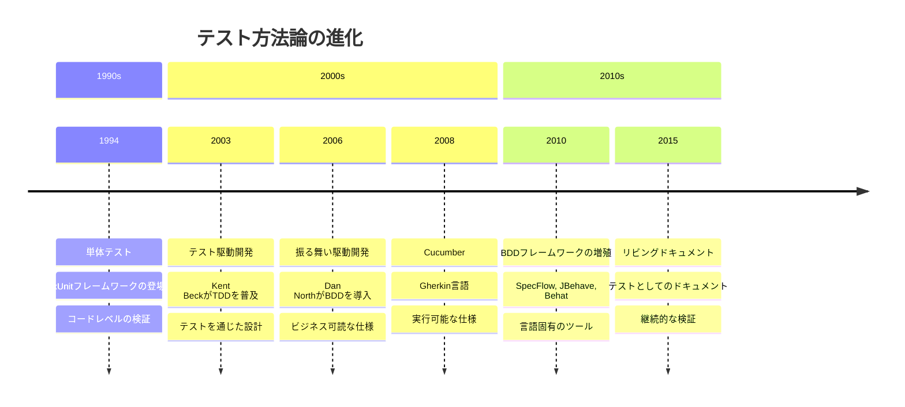
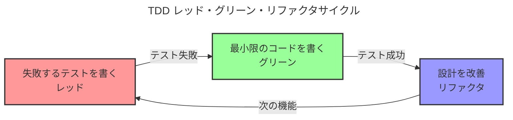
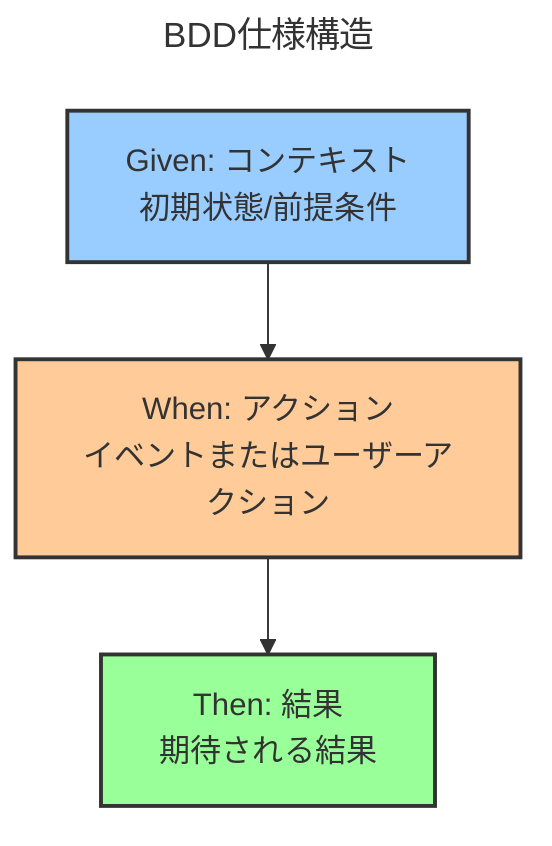
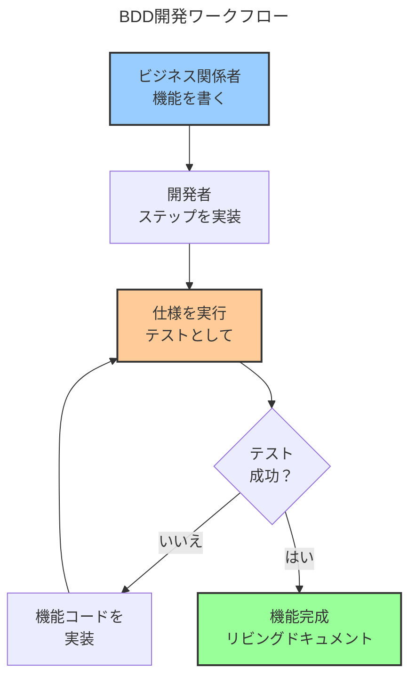

開発者はテストを書く。ビジネス関係者は要件を書く。これら2つの活動は並行して行われ、異なる言語を使用し、異なる成果物を生み出す。開発者はコードが動作することを検証する。ビジネス関係者は機能がニーズを満たすことを検証する。技術的なテストとビジネス要件の間のギャップは、誤解、手戻り、期待のずれを生み出す。

振る舞い駆動開発（BDD）は、このギャップを埋めるために登場した。その約束は：ビジネスチームと技術チームの両方が理解できる平易な言語で仕様を書き、それらの仕様を自動化テストとして実行する。要件がテストになる。テストがドキュメントになる。全員が同じ言語を話す。

現実はより複雑だ。BDDはテスト駆動開発（TDD）から進化し、抽象化と協力のレイヤーを追加した。単体テストはコードの正確性に焦点を当てた。TDDはテストを通じた設計に焦点を当てた。BDDは振る舞いとビジネス価値に焦点を当てる。各アプローチは異なる文脈で異なる問題を解決する。

本稿は、単体テストから実行可能な仕様へのテストの進化をたどる。この歴史を理解することで、なぜ複数のテストアプローチがあるのか、BDDがいつ価値を追加するのか、そして読みやすい仕様を保守不可能なテストコードに変えることを避ける方法が明らかになる。

### テスト進化のタイムライン



## テストの問題

BDDを検討する前に、それが解決する問題を理解することが不可欠だ。従来のテストは、ビジネスの意図と技術的な実装の間にギャップを生み出す。

### なぜ従来のテストは不十分なのか

テストは当初、単純明快に見えた：

!!!error "🚫 従来のテストの問題"
    **コミュニケーションのギャップ**
    - ビジネスはドキュメントで要件を書く
    - 開発者はコードでテストを書く
    - 異なる言語、異なる成果物
    - 要件と実装の乖離
    
    **ドキュメントの腐敗**
    - 要件ドキュメントが古くなる
    - テストがビジネスの意図を反映しない
    - 単一の真実の源がない
    - 手動検証が必要
    
    **協力の摩擦**
    - ビジネスは技術的なテストを読めない
    - 開発者は要件を誤解する
    - フィードバックループが遅い
    - 手戻りが一般的

典型的なプロジェクトでは、ビジネスアナリストがWordドキュメントで要件を書き、開発者がコードで単体テストを書き、QAチームがスプレッドシートでテストケースを書く。これらの成果物は独立して存在する。要件が変更されると、ドキュメントは更新されるがテストは遅れる。バグが現れると、要件、実装、テストのどれが間違っているのか不明確だ。

### BDDのビジョン

振る舞い駆動開発はこれらの問題に対処する：

!!!success "✅ BDDの利点"
    **共通理解**
    - ビジネス可読な仕様
    - 技術的に実行可能なテスト
    - 単一の真実の源
    - 誤解の削減
    
    **リビングドキュメント**
    - 仕様が最新に保たれる
    - テストが振る舞いを検証
    - ドキュメントが決して古くならない
    - 継続的な検証
    
    **協力の改善**
    - ビジネスと開発者が同じ言語を話す
    - より速いフィードバックループ
    - より早い欠陥検出
    - 手戻りの削減

ビジョンは説得力がある：ビジネス関係者は期待される振る舞いを記述する平易な言語で仕様を書く。開発者はそれらの仕様を満たす機能を実装する。仕様は自動化テストとして実行され、振る舞いを継続的に検証する。ドキュメントは実行可能であるため最新に保たれる。仕様が読みやすいため、全員がシステムが何をするかを理解する。

## 基礎：単体テスト

テストの旅は1990年代の単体テストから始まる。

### 単体テストの基礎

単体テストは個々のコードコンポーネントが正しく動作することを検証する：

!!!anote "🧪 単体テストの核心概念"
    **目的**
    - コードの正確性を検証
    - 個々の関数/メソッドをテスト
    - 高速実行
    - 開発者中心
    
    **特性**
    - 小さく、焦点を絞ったテスト
    - 一度に一つのことをテスト
    - 依存関係から隔離
    - 自動化された実行
    
    **利点**
    - バグを早期に捕捉
    - リファクタリングを可能にする
    - コードの振る舞いを文書化
    - リグレッション防止

単体テストは、個々の関数が与えられた入力に対して期待される出力を生成することを検証する。計算機の加算関数の単体テストは、add(2, 3)が5を返すことを検証する。これらのテストは高速に実行され、迅速なフィードバックを提供し、開発者が開発中にバグを捕捉するのを助ける。

xUnitファミリーのフレームワーク（JUnit、NUnit、PyTest）が単体テストを標準化した。開発者は期待される振る舞いをアサートするテストメソッドを書く：

```java
@Test
public void testAddition() {
    Calculator calc = new Calculator();
    assertEquals(5, calc.add(2, 3));
}
```

### 単体テストの限界

広く採用されているにもかかわらず、単体テストには限界がある：

!!!error "🚫 単体テストの課題"
    **技術的焦点**
    - テストはコードで書かれる
    - ビジネス関係者は読めない
    - 実装の詳細に焦点
    - ビジネスの意図を見逃す
    
    **カバレッジ vs 価値**
    - 高いカバレッジは正しい振る舞いを意味しない
    - テストはコードが動作することを検証するが、有用かどうかは検証しない
    - 間違ったものを徹底的にテストできる
    - 誤った安心感
    
    **保守負担**
    - テストが実装に結合
    - リファクタリングがテストを壊す
    - テストコードがレガシーコードになる
    - 収穫逓減

単体テストはコードが動作することを検証するが、ビジネス問題を解決することは検証しない。100%のコードカバレッジを持ちながら、間違った機能を構築することができる。テストは技術的な正確性に焦点を当てる—この関数は正しい値を返すか—ビジネス価値ではない—この機能はユーザーが目標を達成するのを助けるか。

## 進化：テスト駆動開発

テスト駆動開発（TDD）は2000年代初頭に登場し、開発者がテストに取り組む方法を変えた。

### TDDの基礎

TDDはテストプロセスを反転させる：

!!!anote "🔄 TDDの核心概念"
    **レッド・グリーン・リファクタサイクル**
    1. 失敗するテストを書く（レッド）
    2. 通過する最小限のコードを書く（グリーン）
    3. 設計を改善するためにリファクタリング（リファクタ）
    4. 繰り返す
    
    **主要原則**
    - コードの前にテストを書く
    - テストが設計を駆動する
    - 小さな増分ステップ
    - 継続的なリファクタリング
    
    **利点**
    - テスト可能性を通じた設計の改善
    - 包括的なテストカバレッジ
    - リファクタリングの自信
    - 意図のドキュメント

TDDはテストを検証ツールではなく設計ツールとして扱う。コードを書いてからテストするのではなく、最初にテストを書く。テストはコードに何をしてほしいかを記述する。次に、テストを通過させる最もシンプルなコードを書く。最後に、テストをグリーンに保ちながら設計を改善するためにリファクタリングする。



### TDDの実践

TDDはアジャイル開発で人気を博した：

!!!success "✅ TDDの強み"
    **設計の利点**
    - テスト可能な設計を強制
    - 疎結合を促進
    - シンプルなソリューションを促進
    - 過剰エンジニアリングを防ぐ
    
    **開発の利点**
    - 常に明確な次のステップ
    - 即座のフィードバック
    - コード変更の自信
    - リグレッションセーフティネット

TDDを実践する開発者は、より良い設計、より少ないバグ、より多くの自信を報告する。最初にテストを書く規律は、実装の前にインターフェースについて考えることを強制する。テストはコードがどのように振る舞うべきかの実行可能な仕様になる。

### TDDの限界

TDDは開発を改善したが、すべての問題を解決したわけではない：

!!!error "🚫 TDDの課題"
    **依然として技術的**
    - テストはコードで書かれる
    - ビジネスは参加できない
    - ユニットに焦点、機能ではない
    - 全体像を見逃す
    
    **テスト命名の問題**
    - testAddition()は理由を説明しない
    - 技術的な名前が意図を隠す
    - テストの目的を理解しにくい
    - ドキュメント価値が限定的
    
    **振る舞い vs 実装**
    - テストが実装に結合されることが多い
    - 何をではなく、どのようにに焦点
    - 脆弱なテストがリファクタリングで壊れる
    - ビジネスの振る舞いを見逃す

TDDテストは依然として技術的だ。ビジネス関係者は読めない。testCalculateDiscount()のようなテスト名はビジネスルールを説明しない。テストはビジネスの振る舞いではなく実装の詳細を検証する。ビジネス要件と技術的なテストの間のギャップは持続する。

## BDD革命

Dan Northは2006年にTDDの限界に対処するために振る舞い駆動開発を導入した。

### BDDの核心的革新

BDDは焦点をテストから振る舞いに移した：

!!!anote "🎯 BDDの主要な洞察"
    **命名が重要**
    - 「test」を「should」に置き換える
    - testAddition()がshouldAddTwoNumbers()になる
    - 実装ではなく振る舞いに焦点
    - 意図を明確にする
    
    **ビジネス言語**
    - ドメイン言語で仕様を書く
    - ビジネス用語を使用
    - コードではなく振る舞いを記述
    - 協力を可能にする
    
    **アウトサイドイン開発**
    - ビジネス価値から始める
    - 機能からコードへ
    - ユーザーのニーズに焦点
    - 不要なコードを避ける

BDDの最初の洞察はシンプルだった：テスト名を技術的な記述から振る舞いの仕様に変更する。testLogin()ではなく、shouldAllowAccessWithValidCredentials()と書く。この小さな変更は、コードの検証から振る舞いの指定へと思考を移す。

### Given-When-Thenパターン

BDDは仕様のための構造化されたフォーマットを導入した：

!!!anote "📝 Given-When-Then構造"
    **フォーマット**
    - Given：初期コンテキスト/前提条件
    - When：アクション/イベント発生
    - Then：期待される結果/事後条件
    
    **例**
    - Given 有効な資格情報を持つユーザー
    - When ログインを試みる
    - Then ダッシュボードにアクセスできる
    
    **利点**
    - 明確な構造
    - ビジネス可読
    - テスト可能なフォーマット
    - 一貫したスタイル

Given-When-Thenは振る舞いを記述するためのテンプレートを提供する。Givenはコンテキストを確立する。Whenはアクションを記述する。Thenは期待される結果を指定する。この構造はビジネス仕様と技術的なテストの両方に機能する。



### BDDフレームワークの登場

BDDをサポートするツールが登場した：

!!!anote "🛠️ BDDフレームワークの進化"
    **RSpec (2005)**
    - Ruby BDDフレームワーク
    - Describe/it構文
    - 読みやすい仕様
    - 開発者中心
    
    **Cucumber (2008)**
    - Gherkin言語
    - プレーンテキスト仕様
    - ビジネス可読
    - 言語非依存
    
    **その他のフレームワーク**
    - SpecFlow (.NET)
    - JBehave (Java)
    - Behat (PHP)
    - Behave (Python)

RSpecは読みやすい構文でBDDをRubyにもたらした：

```ruby
describe Calculator do
  it "should add two numbers" do
    calc = Calculator.new
    expect(calc.add(2, 3)).to eq(5)
  end
end
```

Cucumberは仕様のためのプレーンテキスト言語であるGherkinでBDDをさらに進めた：

```gherkin
Feature: Calculator Addition
  Scenario: Add two positive numbers
    Given a calculator
    When I add 2 and 3
    Then the result should be 5
```

ビジネス関係者はGherkinを読み書きできる。開発者は仕様を実行するステップ定義を実装する。ビジネスチームと技術チームの間のギャップが狭まる。

## BDDの実践：GherkinとCucumber

CucumberとGherkinは最も人気のあるBDDツールになった。

### Gherkin言語

Gherkinは仕様のための構造化されたプレーンテキストを提供する：

!!!anote "📄 Gherkin構文"
    **キーワード**
    - Feature：高レベルの記述
    - Scenario：特定の例
    - Given：前提条件
    - When：アクション
    - Then：期待される結果
    - And/But：追加のステップ
    
    **例の構造**
    
    Feature: ユーザー認証
      Scenario: ログイン成功
        Given 登録済みユーザー
        When 有効な資格情報を入力
        Then アカウントにアクセスできる

Gherkin仕様は誰でも読める。ビジネスアナリストは期待される振る舞いを記述する機能を書く。開発者はそれらの機能をテストとして実行するステップ定義を実装する。

### ステップ定義

ステップ定義はGherkinをコードに接続する：

!!!anote "🔗 ステップ定義の実装"
    **Gherkinステップ**
    
    Given 登録済みユーザー
    
    **ステップ定義 (Java)**
    
    @Given("登録済みユーザー")
    public void aRegisteredUser() {
        user = new User("john@example.com", "password");
        userRepository.save(user);
    }
    
    **目的**
    - プレーンテキストをコードにマッピング
    - テストロジックを実装
    - シナリオ間で再利用可能
    - 技術的な詳細を隠す

ステップ定義は読みやすい仕様の背後にある技術的な詳細を実装する。ビジネス関係者はGherkinを書く。開発者はステップ定義を書く。Cucumberはそれらを接続し、仕様を自動化テストとして実行する。

### BDDワークフロー

BDDは開発ワークフローを変える：



ワークフローはビジネス関係者がGherkinで期待される振る舞いを記述することから始まる。開発者はステップ定義と機能コードを実装する。仕様はテストとして実行され、振る舞いを検証する。テストが成功すると、機能は完成し、仕様はリビングドキュメントになる。

## BDDの利点と課題

BDDは大きな利点を提供するが、新しい課題も導入する。

### BDDがいつ価値を追加するか

BDDは特定の文脈で優れている：

!!!success "✅ BDDのスイートスポット"
    **理想的なシナリオ**
    - 複雑なビジネスルール
    - 複数の関係者
    - 規制要件
    - ドメイン駆動設計
    - 長期システム
    
    **チームの特性**
    - ビジネス関係者が関与
    - 開発者が協力を受け入れる
    - QAが開発と統合
    - 品質の共同所有
    
    **プロジェクトの特性**
    - ビジネスロジックの複雑さ
    - アルゴリズムより振る舞いが重要
    - リビングドキュメントの必要性
    - コンプライアンス要件

BDDはビジネスロジックが複雑で関係者の協力が高い場合に最も効果的だ。複雑なルールを持つ金融システムは実行可能な仕様から恩恵を受ける。規制産業は最新のドキュメントが必要だ。ドメイン駆動プロジェクトはユビキタス言語から恩恵を受ける。

### よくあるBDDの落とし穴

チームはBDDで予測可能な間違いを犯す：

!!!error "🚫 BDDアンチパターン"
    **技術的なGherkin**
    - シナリオに実装の詳細を書く
    - 技術用語を使用
    - 振る舞いではなくUI操作を記述
    - 可読性の目的を損なう
    
    **例 - 悪い：**
    
    Given ログインボタンをクリック
    When 「ユーザー名」フィールドに "john@example.com" を入力
    Then id が「ダッシュボード」の要素が表示される
    
    **例 - 良い：**
    
    Given 登録済みユーザー
    When 有効な資格情報でログイン
    Then ダッシュボードにアクセスできる
    
    **過剰な仕様化**
    - シナリオが多すぎる
    - Gherkinですべてのエッジケースをテスト
    - 仕様がテストスクリプトになる
    - 保守負担が増加
    
    **実装不足**
    - アサーションのないステップ定義
    - 常に成功するテスト
    - 誤った自信
    - 無駄な努力
    
    **ツールへの執着**
    - 協力ではなくCucumberに焦点
    - BDDが「Cucumberを使うこと」になる
    - 共通理解のポイントを見逃す
    - 技術的な演習、ビジネス価値ではない

最も一般的な間違いは技術的なGherkinを書くことだ。チームはUI操作を記述する—このボタンをクリック、このテキストを入力—ビジネスの振る舞いではなく。これはBDDの目的を損なう。仕様はシステムが何をするかを記述すべきで、ユーザーがどのように操作するかではない。

### BDD vs TDD

!!!tip "🎯 BDD vs TDD の決定"
    **TDDを使用する場合：**
    - アルゴリズムの構築
    - 技術的なコンポーネント
    - ライブラリとフレームワーク
    - 開発者中心のコード
    - 実装の詳細が重要
    
    **BDDを使用する場合：**
    - 複雑なビジネスルール
    - 関係者の協力が必要
    - リビングドキュメントが価値ある
    - 実装より振る舞いが重要
    - ドメイン駆動設計
    
    **現実：**
    - 両方を一緒に使用
    - 機能/振る舞いにはBDD
    - 実装/ユニットにはTDD
    - 異なるレベル、異なるツール

BDDとTDDは相互排他的ではない。ビジネス関係者が読む機能レベルの仕様にはBDDを使用する。実装を検証するユニットレベルのテストにはTDDを使用する。BDDはシステムが何をすべきかを記述する。TDDはそれがどのように行うかを検証する。

## 実世界の例

チームが実際にBDDをどのように実装しているかを見ることで、いつ価値を追加するかが明確になる。

### Eコマースチェックアウト：BDDの成功

EコマースプラットフォームはチェックアウトロジックにBDDを使用する：

!!!anote "🛒 Eコマースチェックアウト"
    **コンテキスト**
    - 複雑な価格設定ルール
    - 複数の支払い方法
    - 割引計算
    - 税務規制
    - 配送ロジック
    
    **BDD実装**
    
    Feature: 割引計算
      Scenario: 注文に割引率を適用
        Given 10%割引コードを持つ顧客
        And カートに合計$100の商品
        When 割引コードを適用
        Then 注文合計は$90になる
        And 割引が請求書に表示される
    
    **なぜ機能するか**
    - ビジネスルールが複雑
    - 関係者がロジックを検証する必要がある
    - 規制がドキュメントを要求
    - ルールが頻繁に変更
    - リビングドキュメントが最新に保たれる

ビジネスアナリストは価格設定ルールを記述するシナリオを書く。開発者はステップ定義と機能コードを実装する。価格設定ルールが変更されると、アナリストはシナリオを更新する。テストは新しい振る舞いを検証する。ドキュメントは実行可能であるため最新に保たれる。

### アルゴリズム開発：TDDがより適している

検索アルゴリズムを構築するチームはTDDを使用する：

!!!anote "🔍 検索アルゴリズム"
    **コンテキスト**
    - 複雑なランキングアルゴリズム
    - パフォーマンスが重要
    - 数学的計算
    - エッジケースが重要
    - 技術的実装の焦点
    
    **TDD実装**
    
    @Test
    public void shouldRankExactMatchesHighest() {
        SearchEngine engine = new SearchEngine();
        List<Result> results = engine.search("java");
        assertEquals("Java Programming", results.get(0).getTitle());
    }
    
    **なぜTDDがより良いか**
    - アルゴリズムの詳細が重要
    - ビジネスは実装を指定できない
    - パフォーマンステストが必要
    - 技術的問題、技術的ソリューション
    - ビジネス可読な仕様は不要

アルゴリズムの振る舞いは、その正確性とパフォーマンスほど重要ではない。ビジネス関係者はランキングアルゴリズムの指定に有意義に参加できない。TDDはBDDのオーバーヘッドなしに迅速なフィードバックと包括的なカバレッジを提供する。

### ハイブリッドアプローチ：両方の長所

SaaSプラットフォームはBDDとTDDの両方を使用する：

!!!anote "☁️ SaaSプラットフォーム"
    **機能にはBDD**
    - ユーザー登録
    - サブスクリプション管理
    - 請求ロジック
    - アクセス制御
    - ビジネスワークフロー
    
    **実装にはTDD**
    - データ検証
    - APIエンドポイント
    - データベースクエリ
    - ユーティリティ関数
    - 技術的コンポーネント
    
    **なぜハイブリッドが機能するか**
    - 各レベルに適切なツール
    - ビジネスが機能仕様を読む
    - 開発者が実装を検証
    - 包括的なカバレッジ
    - 保守可能なテストスイート

機能レベルの振る舞いはGherkin仕様を使用したBDDを使用する。ビジネス関係者はシナリオの作成に参加する。実装レベルのコードは単体テストを使用したTDDを使用する。開発者は技術的な正確性を検証する。各アプローチは適切なレベルで動作する。

## リビングドキュメント

BDDの究極の約束はリビングドキュメント—最新に保たれる仕様だ。

### 決して嘘をつかないドキュメント

従来のドキュメントは古くなる：

!!!error "🚫 従来のドキュメントの問題"
    **ドキュメントのドリフト**
    - 一度書かれ、めったに更新されない
    - コードが変更され、ドキュメントは変更されない
    - 検証メカニズムがない
    - 時間とともに信頼が侵食される
    
    **保守負担**
    - 手動更新が必要
    - 時間のかかるプロセス
    - プレッシャー下でスキップされることが多い
    - 技術的負債になる

BDD仕様は実行可能だ。コードが変更されると、仕様は成功する（ドキュメントは最新）か失敗する（ドキュメントは更新が必要）。ドキュメントは継続的に検証されるため、現実から乖離できない。

### リビングドキュメントの利点

!!!success "✅ リビングドキュメントの価値"
    **常に最新**
    - 仕様がテストとして実行される
    - 失敗は古いドキュメントを示す
    - 継続的な検証
    - 信頼が維持される
    
    **単一の真実の源**
    - 要件とテストが統一される
    - 重複する成果物がない
    - 保守の削減
    - 明確な所有権
    
    **オンボーディングツール**
    - 新しいチームメンバーが仕様を読む
    - システムの振る舞いを理解
    - 機能の例を見る
    - ドメイン言語を学ぶ

リビングドキュメントは複数の目的に役立つ。ビジネス関係者は機能が仕様通りに動作することを検証する。開発者は要件を理解する。新しいチームメンバーはシステムを学ぶ。コンプライアンスチームは振る舞いを監査する。すべて同じ実行可能な仕様から。

### ドキュメントを有用にする

リビングドキュメントには規律が必要だ：

!!!tip "💡 リビングドキュメントのベストプラクティス"
    **読者のために書く**
    - ビジネス言語を使用
    - 技術的な詳細を避ける
    - 振る舞いに焦点
    - コンテキストを提供
    
    **論理的に整理**
    - 関連するシナリオをグループ化
    - 意味のある機能名を使用
    - ビジネス能力で構造化
    - ナビゲーションを可能にする
    
    **最新に保つ**
    - コード変更とともに仕様を更新
    - 古いシナリオを削除
    - 明確さのためにリファクタリング
    - 本番コードとして扱う
    
    **レポートを生成**
    - 仕様からHTMLドキュメントを生成
    - 機能カバレッジを表示
    - 失敗を強調
    - 関係者と共有

仕様はテストスクリプトではなくドキュメントのように読めるべきだ。技術的な構造ではなくビジネス能力で整理する。関係者が閲覧できるHTMLレポートを生成する。仕様を本番コードと同じくらい重要に扱う。

## BDD実装戦略

BDDを成功裏に採用するには、ツールだけでなく戦略が必要だ。

### BDDを始める

!!!tip "🚀 BDD採用戦略"
    **小さく始める**
    - 1つの機能を選ぶ
    - ビジネス関係者を巻き込む
    - 一緒にシナリオを書く
    - 実装して反復する
    
    **協力を構築**
    - 三銃士ミーティング
    - ビジネス、開発、QAが一緒に
    - コーディング前にシナリオを議論
    - まず共通理解
    
    **価値に焦点**
    - すべてのテストをBDDに変換しない
    - 協力が役立つ場所で使用
    - 単体テストは単体テストのまま
    - ビジネスクリティカルな機能にBDD
    
    **ステップ定義に投資**
    - 再利用可能で保守可能なステップ
    - 技術的な詳細を抽象化
    - ドメイン中心の言語
    - 定期的にリファクタリング

複雑なビジネスルールと関与する関係者を持つ単一の機能から始める。「三銃士」ミーティングでシナリオを協力して書く—ビジネスアナリスト、開発者、テスターが一緒に。ツールの使用ではなく、共通理解に焦点を当てる。

### 三銃士ミーティング

三銃士の実践がBDDの成功を駆動する：

!!!anote "👥 三銃士の実践"
    **参加者**
    - ビジネスアナリスト：ビジネスニーズを代表
    - 開発者：技術的制約を理解
    - テスター：エッジケースを考える
    
    **プロセス**
    1. ユーザーストーリーをレビュー
    2. 振る舞いの例を議論
    3. 一緒にシナリオを書く
    4. 質問と仮定を特定
    5. 受け入れ基準に同意
    
    **成果**
    - 共通理解
    - より良いシナリオ
    - より少ない欠陥
    - 手戻りの削減

三銃士ミーティングは開発が始まる前に行われる。チームは機能が何をすべきかを議論し、一緒にシナリオを書き、理解のギャップを特定する。この協力は手戻りを引き起こす誤解を防ぐ。

### BDDの成功を測定

!!!tip "📊 BDD成功指標"
    **協力指標**
    - 関係者の参加率
    - 協力して書かれたシナリオ
    - 仕様フェーズで発見された欠陥
    - 手戻りの削減
    
    **品質指標**
    - 欠陥エスケープ率
    - 仕様カバレッジ
    - シナリオ成功率
    - ドキュメントの最新性
    
    **効率指標**
    - 機能実装時間
    - 新しいチームメンバーのオンボーディング時間
    - ドキュメント保守作業
    - 関係者の満足度

成功はシナリオの数やコードカバレッジで測定されない。成功は協力の質、欠陥の削減、関係者の満足度で測定される。ビジネス関係者が仕様を読まない場合、BDDは機能していない。

## 結論

振る舞い駆動開発は、ビジネス要件と技術的実装の間のギャップに対処するために、単体テストとTDDから進化した。単体テストはコードの正確性を検証した。TDDはテストを通じて設計を改善した。BDDはビジネス可読な仕様を通じて協力を可能にする。

BDDの核心的革新は、仕様を実行可能なテストとして扱うことだ。ビジネス関係者は平易な言語でシナリオを書く。開発者はそれらのシナリオを実行するステップ定義を実装する。仕様は振る舞いを継続的に検証し、決して古くならないリビングドキュメントになる。

Given-When-Thenパターンは仕様に構造を提供する。Givenはコンテキストを確立する。Whenはアクションを記述する。Thenは結果を指定する。このフォーマットはビジネスコミュニケーションと技術的なテストの両方に機能する。

CucumberやGherkinのようなツールは、プレーンテキスト仕様をコードに接続することでBDDを可能にする。ビジネス関係者は機能を書く。開発者はステップ定義を実装する。ビジネスチームと技術チームの間のギャップが狭まる。

よくある間違いには、ビジネスの振る舞いではなくUI操作を記述する技術的なGherkinを書くこと、シナリオが多すぎる過剰な仕様化、協力ではなくツールに焦点を当てることが含まれる。チームがCucumberを使うだけでなく共通理解に焦点を当てるとき、BDDは成功する。

BDDとTDDは相互排他的ではない。ビジネス関係者が読む機能レベルの仕様にはBDDを使用する。実装を検証するユニットレベルのテストにはTDDを使用する。異なるレベルには異なるアプローチが必要だ。

実世界の例は、複雑なビジネスルールと関与する関係者でBDDが成功し、アルゴリズムと技術的コンポーネントにはTDDがより効果的で、ハイブリッドアプローチが適切なレベルで両方を使用することを示している。

リビングドキュメントはBDDの究極の約束だ—実行可能であるため最新に保たれる仕様。従来のドキュメントは現実から乖離する。BDD仕様は継続的に検証されるため乖離できない。

成功するBDD採用には戦略が必要だ。1つの機能から小さく始める。三銃士ミーティングを通じて協力を構築する。すべてのテストをBDDに変換するのではなく、価値に焦点を当てる。保守可能なステップ定義に投資する。

BDDを使用する決定は文脈に依存する。複雑なビジネスルールは実行可能な仕様から恩恵を受ける。関与する関係者は協力を価値あるものにする。長期システムはリビングドキュメントから恩恵を受ける。技術的コンポーネントは従来のTDDでより効果的なことが多い。

BDDを採用する前に、ニーズを理解する。複雑なビジネスルールがあるか？関係者は参加する意思があるか？リビングドキュメントは価値があるか？協力に投資する時間があるか？答えは、どのテストアプローチがより良いかについての意見よりも重要だ。

目標は完璧なBDD採用ではない。目標は共通理解を持って正しい機能を正しく構築することだ。BDDを目的そのものではなく、協力のためのツールとして使用する。文脈に基づいて選択し、協力の実践に投資し、ビジネス価値に焦点を当てる。

単体テスト、TDD、BDD、または組み合わせを選択するかどうかにかかわらず、覚えておく：テストは高品質なソフトウェアを構築するためのツールであり、目標ではない。結果に焦点を当てる—正しい振る舞い、満足した関係者、保守可能なコード。アプローチがこれらの結果を達成するのに役立つなら、それを使用する。そうでなければ、別のものを選択する。それが良いソフトウェア開発の真の意味だ。
