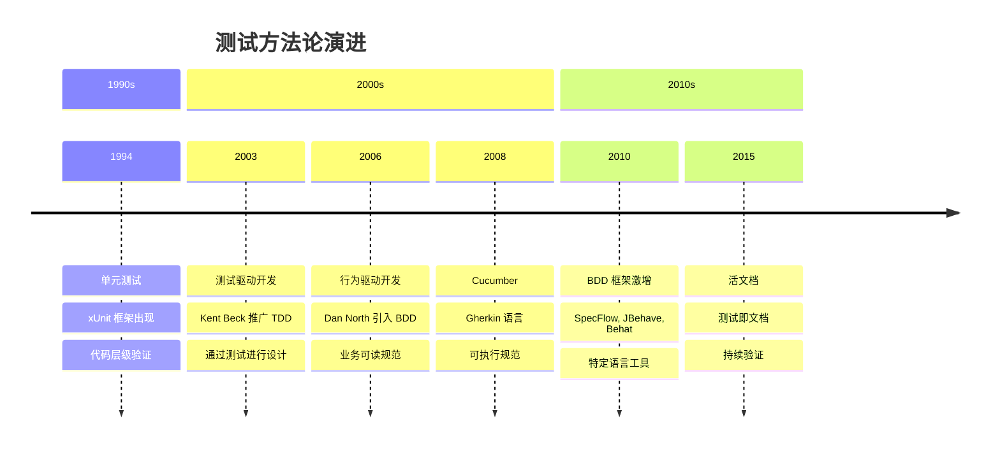
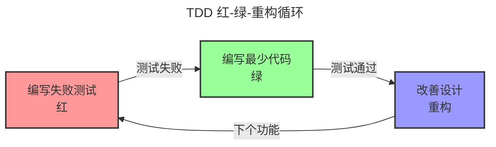
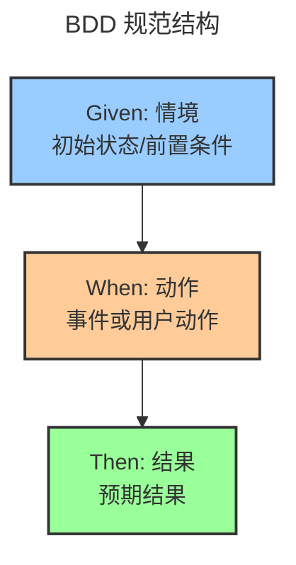
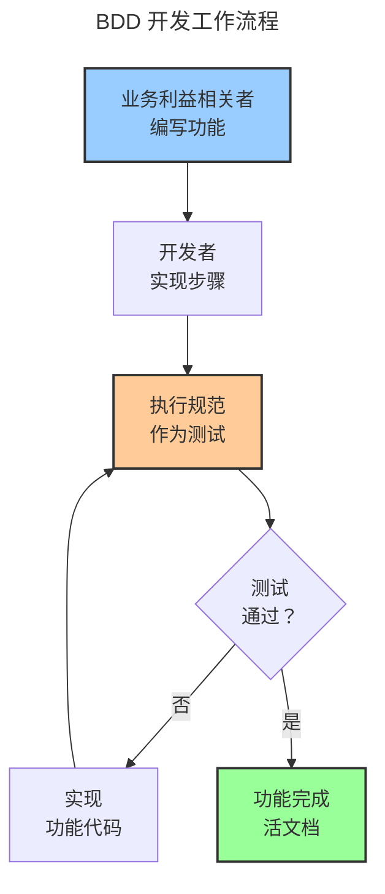

开发者编写测试。业务利益相关者编写需求。这两项活动并行进行，使用不同的语言，产生不同的产出物。开发者验证代码运作。业务利益相关者验证功能符合需求。技术测试与业务需求之间的鸿沟造成误解、返工和期望落差。

行为驱动开发（BDD）的出现就是为了弥合这道鸿沟。其承诺是：用业务和技术团队都能理解的简单语言编写规范，然后将这些规范作为自动化测试执行。需求变成测试。测试变成文档。每个人都说同一种语言。

现实更为复杂。BDD 从测试驱动开发（TDD）演进而来，增加了抽象和协作的层次。单元测试专注于代码正确性。TDD 专注于通过测试进行设计。BDD 专注于行为和业务价值。每种方法在不同情境下解决不同的问题。

本文追溯测试从单元测试到可执行规范的演进。理解这段历史能揭示为何我们有多种测试方法、BDD 何时能增加价值，以及如何避免将可读的规范变成难以维护的测试代码。

### 测试演进时间轴



## 测试问题

在检视 BDD 之前，理解它所解决的问题至关重要。传统测试在业务意图和技术实现之间造成鸿沟。

### 为何传统测试不足

测试最初看似简单直接：

!!!error "🚫 传统测试问题"
    **沟通鸿沟**
    - 业务在文档中编写需求
    - 开发者在代码中编写测试
    - 不同语言、不同产出物
    - 需求与实现脱节
    
    **文档腐化**
    - 需求文档变得过时
    - 测试不反映业务意图
    - 没有单一真相来源
    - 需要人工验证
    
    **协作摩擦**
    - 业务无法阅读技术测试
    - 开发者误解需求
    - 反馈循环缓慢
    - 返工常见

典型项目中，业务分析师在 Word 文档中编写需求，开发者在代码中编写单元测试，QA 团队在电子表格中编写测试用例。这些产出物各自独立存在。当需求变更时，文档更新但测试落后。当错误出现时，不清楚是需求、实现还是测试有问题。

### BDD 愿景

行为驱动开发解决这些问题：

!!!success "✅ BDD 优势"
    **共同理解**
    - 业务可读规范
    - 技术可执行测试
    - 单一真相来源
    - 减少误解
    
    **活文档**
    - 规范保持最新
    - 测试验证行为
    - 文档永不过时
    - 持续验证
    
    **协作改善**
    - 业务和开发者说同一种语言
    - 更快的反馈循环
    - 更早发现缺陷
    - 减少返工

愿景令人信服：业务利益相关者用简单语言编写描述预期行为的规范。开发者实现功能以满足这些规范。规范作为自动化测试执行，持续验证行为。文档保持最新因为它是可执行的。每个人都理解系统做什么因为规范是可读的。

## 基础：单元测试

测试之旅始于 1990 年代的单元测试。

### 单元测试基础

单元测试验证个别代码组件正确运作：

!!!anote "🧪 单元测试核心概念"
    **目的**
    - 验证代码正确性
    - 测试个别函数/方法
    - 快速执行
    - 以开发者为中心
    
    **特性**
    - 小型、专注的测试
    - 一次测试一件事
    - 与依赖隔离
    - 自动化执行
    
    **优势**
    - 及早捕获错误
    - 启用重构
    - 记录代码行为
    - 防止回归

单元测试验证个别函数对给定输入产生预期输出。计算器加法函数的单元测试验证 add(2, 3) 返回 5。这些测试执行快速，提供快速反馈，帮助开发者在开发期间捕获错误。

xUnit 框架家族（JUnit、NUnit、PyTest）标准化了单元测试。开发者编写断言预期行为的测试方法：

```java
@Test
public void testAddition() {
    Calculator calc = new Calculator();
    assertEquals(5, calc.add(2, 3));
}
```

### 单元测试限制

尽管广泛采用，单元测试仍有限制：

!!!error "🚫 单元测试挑战"
    **技术焦点**
    - 测试用代码编写
    - 业务利益相关者无法阅读
    - 专注于实现细节
    - 错过业务意图
    
    **覆盖率 vs 价值**
    - 高覆盖率不代表正确行为
    - 测试验证代码运作，而非有用
    - 可能彻底测试错误的东西
    - 虚假的安全感
    
    **维护负担**
    - 测试与实现耦合
    - 重构破坏测试
    - 测试代码变成遗留代码
    - 报酬递减

单元测试验证代码运作，但不验证它解决业务问题。你可以有 100% 代码覆盖率，同时构建错误的功能。测试专注于技术正确性——这个函数返回正确的值吗——而非业务价值——这个功能帮助用户达成目标吗。

## 演进：测试驱动开发

测试驱动开发（TDD）在 2000 年代初期出现，改变了开发者处理测试的方式。

### TDD 基础

TDD 反转测试流程：

!!!anote "🔄 TDD 核心概念"
    **红-绿-重构循环**
    1. 编写失败测试（红）
    2. 编写最少代码通过（绿）
    3. 重构改善设计（重构）
    4. 重复
    
    **关键原则**
    - 先写测试再写代码
    - 测试驱动设计
    - 小增量步骤
    - 持续重构
    
    **优势**
    - 通过可测试性改善设计
    - 全面的测试覆盖率
    - 重构的信心
    - 意图的文档

TDD 将测试视为设计工具，而非验证工具。不是先写代码再测试，而是先写测试。测试描述你希望代码做什么。然后你编写最简单的代码让测试通过。最后，你重构以改善设计，同时保持测试绿灯。



### TDD 实务

TDD 在敏捷开发中变得流行：

!!!success "✅ TDD 优势"
    **设计优势**
    - 强制可测试设计
    - 鼓励松耦合
    - 促进简单解决方案
    - 防止过度工程
    
    **开发优势**
    - 总是有清楚的下一步
    - 即时反馈
    - 变更代码的信心
    - 回归安全网

实践 TDD 的开发者报告更好的设计、更少的错误和更多信心。先写测试的纪律迫使你在实现之前思考接口。测试成为代码应如何行为的可执行规范。

### TDD 限制

TDD 改善了开发但没有解决所有问题：

!!!error "🚫 TDD 挑战"
    **仍然技术性**
    - 测试用代码编写
    - 业务无法参与
    - 专注于单元，而非功能
    - 错过大局
    
    **测试命名问题**
    - testAddition() 不解释为什么
    - 技术名称掩盖意图
    - 难以理解测试目的
    - 文档价值有限
    
    **行为 vs 实现**
    - 测试常与实现耦合
    - 专注于如何，而非什么
    - 脆弱的测试在重构时破坏
    - 错过业务行为

TDD 测试仍然是技术性的。业务利益相关者无法阅读它们。像 testCalculateDiscount() 这样的测试名称不解释业务规则。测试验证实现细节而非业务行为。业务需求和技术测试之间的鸿沟持续存在。

## BDD 革命

Dan North 在 2006 年引入行为驱动开发以解决 TDD 的限制。

### BDD 核心创新

BDD 将焦点从测试转移到行为：

!!!anote "🎯 BDD 关键洞察"
    **命名很重要**
    - 用「should」取代「test」
    - testAddition() 变成 shouldAddTwoNumbers()
    - 专注于行为，而非实现
    - 厘清意图
    
    **业务语言**
    - 用领域语言编写规范
    - 使用业务术语
    - 描述行为，而非代码
    - 启用协作
    
    **由外而内开发**
    - 从业务价值开始
    - 从功能到代码
    - 专注于用户需求
    - 避免不必要的代码

BDD 的第一个洞察很简单：将测试名称从技术描述改为行为规范。不是 testLogin()，而是写 shouldAllowAccessWithValidCredentials()。这个小改变将思维从验证代码转移到指定行为。

### Given-When-Then 模式

BDD 引入了规范的结构化格式：

!!!anote "📝 Given-When-Then 结构"
    **格式**
    - Given：初始情境/前置条件
    - When：动作/事件发生
    - Then：预期结果/后置条件
    
    **范例**
    - Given 一个有效凭证的用户
    - When 他们尝试登录
    - Then 他们应该访问仪表板
    
    **优势**
    - 清楚的结构
    - 业务可读
    - 可测试格式
    - 一致的风格

Given-When-Then 提供描述行为的模板。Given 建立情境。When 描述动作。Then 指定预期结果。这个结构适用于业务规范和技术测试。



### BDD 框架出现

支持 BDD 的工具出现：

!!!anote "🛠️ BDD 框架演进"
    **RSpec (2005)**
    - Ruby BDD 框架
    - Describe/it 语法
    - 可读规范
    - 以开发者为中心
    
    **Cucumber (2008)**
    - Gherkin 语言
    - 纯文本规范
    - 业务可读
    - 语言无关
    
    **其他框架**
    - SpecFlow (.NET)
    - JBehave (Java)
    - Behat (PHP)
    - Behave (Python)

RSpec 以可读语法将 BDD 带到 Ruby：

```ruby
describe Calculator do
  it "should add two numbers" do
    calc = Calculator.new
    expect(calc.add(2, 3)).to eq(5)
  end
end
```

Cucumber 以 Gherkin——一种规范的纯文本语言——将 BDD 推进一步：

```gherkin
Feature: Calculator Addition
  Scenario: Add two positive numbers
    Given a calculator
    When I add 2 and 3
    Then the result should be 5
```

业务利益相关者可以阅读和编写 Gherkin。开发者实现执行规范的步骤定义。业务和技术团队之间的鸿沟缩小。

## BDD 实务：Gherkin 和 Cucumber

Cucumber 和 Gherkin 成为最流行的 BDD 工具。

### Gherkin 语言

Gherkin 为规范提供结构化纯文本：

!!!anote "📄 Gherkin 语法"
    **关键字**
    - Feature：高阶描述
    - Scenario：特定范例
    - Given：前置条件
    - When：动作
    - Then：预期结果
    - And/But：额外步骤
    
    **范例结构**
    
    Feature: 用户认证
      Scenario: 成功登录
        Given 一个注册用户
        When 他们输入有效凭证
        Then 他们应该访问账户

Gherkin 规范任何人都能阅读。业务分析师编写描述期望行为的功能。开发者实现将这些功能作为测试执行的步骤定义。

### 步骤定义

步骤定义将 Gherkin 连接到代码：

!!!anote "🔗 步骤定义实现"
    **Gherkin 步骤**
    
    Given 一个注册用户
    
    **步骤定义 (Java)**
    
    @Given("一个注册用户")
    public void aRegisteredUser() {
        user = new User("john@example.com", "password");
        userRepository.save(user);
    }
    
    **目的**
    - 将纯文本映射到代码
    - 实现测试逻辑
    - 跨情境可重用
    - 隐藏技术细节

步骤定义实现可读规范背后的技术细节。业务利益相关者编写 Gherkin。开发者编写步骤定义。Cucumber 连接它们，将规范作为自动化测试执行。

### BDD 工作流程

BDD 改变开发工作流程：



工作流程从业务利益相关者用 Gherkin 描述期望行为开始。开发者实现步骤定义和功能代码。规范作为测试执行，验证行为。当测试通过时，功能完成，规范成为活文档。

## BDD 优势与挑战

BDD 提供显著优势但也引入新挑战。

### BDD 何时增加价值

BDD 在特定情境中表现出色：

!!!success "✅ BDD 最佳适用场景"
    **理想情境**
    - 复杂业务规则
    - 多个利益相关者
    - 法规要求
    - 领域驱动设计
    - 长期系统
    
    **团队特性**
    - 业务利益相关者投入
    - 开发者拥抱协作
    - QA 与开发整合
    - 质量共同拥有
    
    **项目特性**
    - 业务逻辑复杂性
    - 行为比算法重要
    - 需要活文档
    - 合规要求

当业务逻辑复杂且利益相关者协作度高时，BDD 效果最好。具有复杂规则的金融系统受益于可执行规范。受监管行业需要保持最新的文档。领域驱动项目受益于通用语言。

### 常见 BDD 陷阱

团队在 BDD 上犯可预测的错误：

!!!error "🚫 BDD 反模式"
    **技术性 Gherkin**
    - 在情境中编写实现细节
    - 使用技术术语
    - 描述 UI 交互而非行为
    - 破坏可读性目的
    
    **范例 - 不好：**
    
    Given 我点击登录按钮
    When 我在「用户名」字段输入 "john@example.com"
    Then 我应该看到 id 为「仪表板」的元素
    
    **范例 - 好：**
    
    Given 我是注册用户
    When 我用有效凭证登录
    Then 我应该访问仪表板
    
    **过度规范化**
    - 太多情境
    - 在 Gherkin 中测试每个边界用例
    - 规范变成测试脚本
    - 维护负担增加
    
    **实现不足**
    - 没有断言的步骤定义
    - 总是通过的测试
    - 虚假信心
    - 浪费精力
    
    **工具迷恋**
    - 专注于 Cucumber 而非协作
    - BDD 变成「使用 Cucumber」
    - 错过共同理解的重点
    - 技术练习，而非业务价值

最常见的错误是编写技术性 Gherkin。团队描述 UI 交互——点击这个按钮、输入这个文本——而非业务行为。这破坏了 BDD 的目的。规范应该描述系统做什么，而非用户如何与它交互。

### BDD vs TDD

!!!tip "🎯 BDD vs TDD 决策"
    **使用 TDD 当：**
    - 构建算法
    - 技术组件
    - 库和框架
    - 以开发者为中心的代码
    - 实现细节重要
    
    **使用 BDD 当：**
    - 复杂业务规则
    - 需要利益相关者协作
    - 活文档有价值
    - 行为比实现重要
    - 领域驱动设计
    
    **现实：**
    - 一起使用两者
    - BDD 用于功能/行为
    - TDD 用于实现/单元
    - 不同层级，不同工具

BDD 和 TDD 不互斥。对业务利益相关者阅读的功能层级规范使用 BDD。对验证实现的单元层级测试使用 TDD。BDD 描述系统应该做什么。TDD 验证它如何做。

## 真实世界范例

看团队实际如何实现 BDD 能厘清何时它能增加价值。

### 电子商务结账：BDD 成功

电子商务平台对结账逻辑使用 BDD：

!!!anote "🛒 电子商务结账"
    **情境**
    - 复杂定价规则
    - 多种付款方式
    - 折扣计算
    - 税务法规
    - 运送逻辑
    
    **BDD 实现**
    
    Feature: 折扣计算
      Scenario: 对订单应用百分比折扣
        Given 有 10% 折扣码的顾客
        And 购物车中总计 $100 的商品
        When 他们应用折扣码
        Then 订单总额应为 $90
        And 折扣应出现在发票上
    
    **为何有效**
    - 业务规则复杂
    - 利益相关者需要验证逻辑
    - 法规要求文档
    - 规则经常变更
    - 活文档保持最新

业务分析师编写描述定价规则的情境。开发者实现步骤定义和功能代码。当定价规则变更时，分析师更新情境。测试验证新行为。文档保持最新因为它是可执行的。

### 算法开发：TDD 更适合

构建搜索算法的团队使用 TDD：

!!!anote "🔍 搜索算法"
    **情境**
    - 复杂排名算法
    - 性能关键
    - 数学计算
    - 边界用例重要
    - 技术实现焦点
    
    **TDD 实现**
    
    @Test
    public void shouldRankExactMatchesHighest() {
        SearchEngine engine = new SearchEngine();
        List<Result> results = engine.search("java");
        assertEquals("Java Programming", results.get(0).getTitle());
    }
    
    **为何 TDD 更好**
    - 算法细节重要
    - 业务无法指定实现
    - 需要性能测试
    - 技术问题，技术解决方案
    - 不需要业务可读规范

算法的行为不如其正确性和性能重要。业务利益相关者无法有意义地参与指定排名算法。TDD 提供快速反馈和全面覆盖，没有 BDD 的开销。

### 混合方法：两者兼得

SaaS 平台同时使用 BDD 和 TDD：

!!!anote "☁️ SaaS 平台"
    **BDD 用于功能**
    - 用户注册
    - 订阅管理
    - 计费逻辑
    - 访问控制
    - 业务工作流程
    
    **TDD 用于实现**
    - 数据验证
    - API 端点
    - 数据库查询
    - 工具函数
    - 技术组件
    
    **为何混合有效**
    - 每个层级使用正确工具
    - 业务阅读功能规范
    - 开发者验证实现
    - 全面覆盖
    - 可维护测试套件

功能层级行为使用 BDD 与 Gherkin 规范。业务利益相关者参与编写情境。实现层级代码使用 TDD 与单元测试。开发者验证技术正确性。每种方法在其适当层级运作。

## 活文档

BDD 的终极承诺是活文档——保持最新的规范。

### 永不说谎的文档

传统文档变得过时：

!!!error "🚫 传统文档问题"
    **文档漂移**
    - 编写一次，很少更新
    - 代码变更，文档不变
    - 没有验证机制
    - 信任随时间侵蚀
    
    **维护负担**
    - 需要人工更新
    - 耗时过程
    - 在压力下常被跳过
    - 变成技术债

BDD 规范是可执行的。当代码变更时，规范要么通过（文档是最新的）要么失败（文档需要更新）。文档无法与现实脱节，因为它持续被验证。

### 活文档优势

!!!success "✅ 活文档价值"
    **总是最新**
    - 规范作为测试执行
    - 失败表示文档过时
    - 持续验证
    - 维持信任
    
    **单一真相来源**
    - 需求和测试统一
    - 没有重复产出物
    - 减少维护
    - 清楚的拥有权
    
    **入职工具**
    - 新团队成员阅读规范
    - 理解系统行为
    - 看到功能范例
    - 学习领域语言

活文档服务多种目的。业务利益相关者验证功能如规范运作。开发者理解需求。新团队成员学习系统。合规团队审计行为。全部来自相同的可执行规范。

### 让文档有用

活文档需要纪律：

!!!tip "💡 活文档最佳实践"
    **为读者编写**
    - 使用业务语言
    - 避免技术细节
    - 专注于行为
    - 提供情境
    
    **逻辑组织**
    - 分组相关情境
    - 使用有意义的功能名称
    - 按业务能力结构化
    - 启用导航
    
    **保持最新**
    - 随代码变更更新规范
    - 移除过时情境
    - 为清晰重构
    - 视为生产代码
    
    **生成报告**
    - 从规范生成 HTML 文档
    - 显示功能覆盖率
    - 突显失败
    - 与利益相关者分享

规范应该读起来像文档，而非测试脚本。按业务能力组织，而非技术结构。生成利益相关者可以浏览的 HTML 报告。将规范视为与生产代码一样重要。

## BDD 实现策略

成功采用 BDD 需要策略，而非只是工具。

### 开始使用 BDD

!!!tip "🚀 BDD 采用策略"
    **从小开始**
    - 挑选一个功能
    - 让业务利益相关者参与
    - 一起编写情境
    - 实现并迭代
    
    **建立协作**
    - 三剑客会议
    - 业务、开发、QA 一起
    - 编码前讨论情境
    - 先共同理解
    
    **专注于价值**
    - 不要将所有测试转换为 BDD
    - 在协作有帮助的地方使用
    - 保持单元测试为单元测试
    - BDD 用于业务关键功能
    
    **投资步骤定义**
    - 可重用、可维护的步骤
    - 抽象技术细节
    - 以领域为中心的语言
    - 定期重构

从具有复杂业务规则和投入的利益相关者的单一功能开始。在「三剑客」会议中协作编写情境——业务分析师、开发者和测试人员一起。专注于共同理解，而非工具使用。

### 三剑客会议

三剑客实践驱动 BDD 成功：

!!!anote "👥 三剑客实践"
    **参与者**
    - 业务分析师：代表业务需求
    - 开发者：理解技术限制
    - 测试人员：思考边界用例
    
    **流程**
    1. 审查用户故事
    2. 讨论行为范例
    3. 一起编写情境
    4. 识别问题和假设
    5. 同意验收标准
    
    **结果**
    - 共同理解
    - 更好的情境
    - 更少缺陷
    - 减少返工

三剑客会议在开发开始前进行。团队讨论功能应该做什么，一起编写情境，识别理解上的差距。这种协作防止造成返工的误解。

### 衡量 BDD 成功

!!!tip "📊 BDD 成功指标"
    **协作指标**
    - 利益相关者参与率
    - 协作编写的情境
    - 规范阶段发现的缺陷
    - 返工减少
    
    **质量指标**
    - 缺陷逃逸率
    - 规范覆盖率
    - 情境通过率
    - 文档时效性
    
    **效率指标**
    - 实现功能的时间
    - 新团队成员入职时间
    - 文档维护工作
    - 利益相关者满意度

成功不是用情境数量或代码覆盖率衡量。成功是用协作质量、缺陷减少和利益相关者满意度衡量。如果业务利益相关者不阅读规范，BDD 就没有运作。

## 结论

行为驱动开发从单元测试和 TDD 演进而来，以解决业务需求和技术实现之间的鸿沟。单元测试验证代码正确性。TDD 通过测试改善设计。BDD 通过业务可读规范启用协作。

BDD 的核心创新是将规范视为可执行测试。业务利益相关者用简单语言编写情境。开发者实现执行这些情境的步骤定义。规范持续验证行为，成为永不过时的活文档。

Given-When-Then 模式为规范提供结构。Given 建立情境。When 描述动作。Then 指定结果。这种格式适用于业务沟通和技术测试。

像 Cucumber 和 Gherkin 这样的工具通过将纯文本规范连接到代码来启用 BDD。业务利益相关者编写功能。开发者实现步骤定义。业务和技术团队之间的鸿沟缩小。

常见错误包括编写描述 UI 交互而非业务行为的技术性 Gherkin、用太多情境过度规范化，以及专注于工具而非协作。当团队专注于共同理解而非只是使用 Cucumber 时，BDD 才会成功。

BDD 和 TDD 不互斥。对业务利益相关者阅读的功能层级规范使用 BDD。对验证实现的单元层级测试使用 TDD。不同层级需要不同方法。

真实世界范例显示 BDD 在复杂业务规则和投入的利益相关者下成功，TDD 对算法和技术组件效果更好，混合方法在适当层级使用两者。

活文档是 BDD 的终极承诺——因为可执行而保持最新的规范。传统文档与现实脱节。BDD 规范无法脱节因为它们持续被验证。

成功的 BDD 采用需要策略。从一个功能开始小规模。通过三剑客会议建立协作。专注于价值，而非将所有测试转换为 BDD。投资可维护的步骤定义。

使用 BDD 的决策取决于情境。复杂业务规则受益于可执行规范。投入的利益相关者使协作有价值。长期系统受益于活文档。技术组件通常用传统 TDD 效果更好。

在采用 BDD 之前，理解你的需求。你有复杂业务规则吗？利益相关者愿意参与吗？活文档有价值吗？你有时间投资协作吗？答案比关于哪种测试方法更好的意见更重要。

目标不是完美的 BDD 采用。目标是通过共同理解正确构建正确的功能。将 BDD 作为协作工具使用，而非目的本身。根据你的情境选择，投资协作实践，专注于业务价值。

无论你选择单元测试、TDD、BDD 或组合，记住：测试是构建高质量软件的工具，而非目标。专注于结果——正确行为、满意的利益相关者、可维护的代码。如果方法帮助达成这些结果，就使用它。如果没有，就选择不同的。这才是良好软件开发的真正意义。
