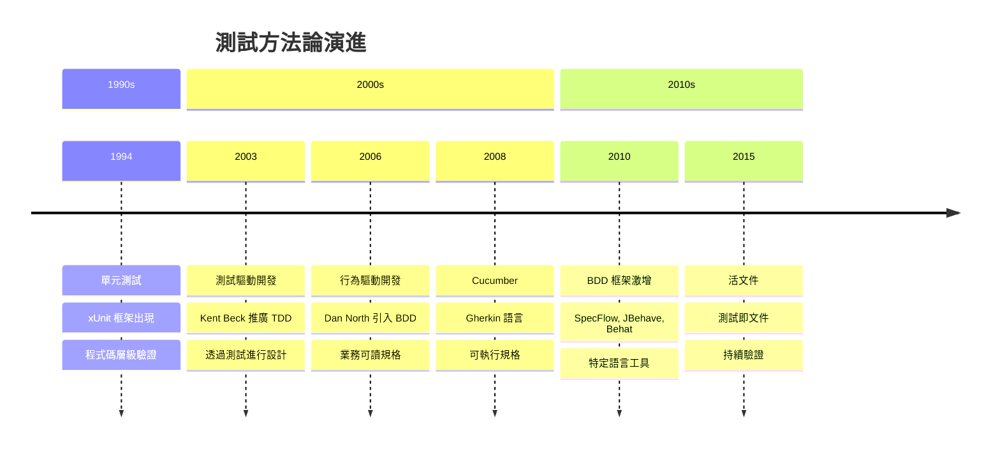
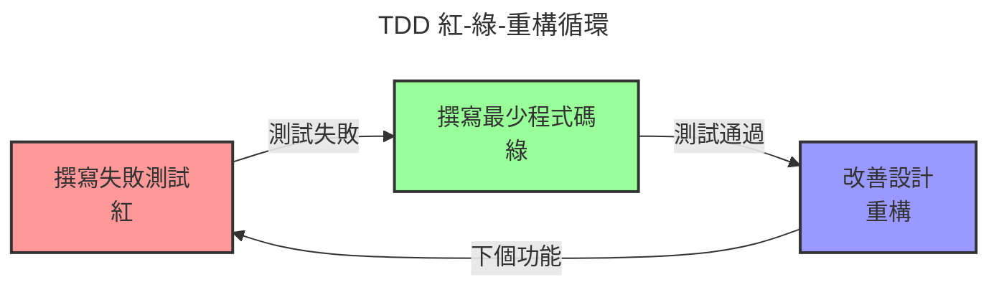
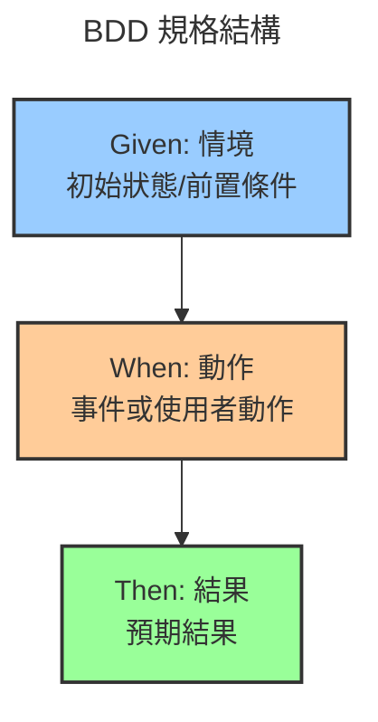
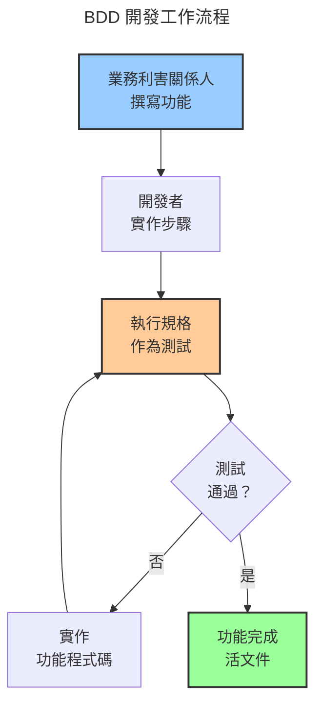

開發者撰寫測試。業務利害關係人撰寫需求。這兩項活動平行進行，使用不同的語言，產生不同的產出物。開發者驗證程式碼運作。業務利害關係人驗證功能符合需求。技術測試與業務需求之間的鴻溝造成誤解、重工和期望落差。

行為驅動開發（BDD）的出現就是為了彌合這道鴻溝。其承諾是：用業務和技術團隊都能理解的簡單語言撰寫規格，然後將這些規格作為自動化測試執行。需求變成測試。測試變成文件。每個人都說同一種語言。

現實更為複雜。BDD 從測試驅動開發（TDD）演進而來，增加了抽象和協作的層次。單元測試專注於程式碼正確性。TDD 專注於透過測試進行設計。BDD 專注於行為和業務價值。每種方法在不同情境下解決不同的問題。

本文追溯測試從單元測試到可執行規格的演進。理解這段歷史能揭示為何我們有多種測試方法、BDD 何時能增加價值，以及如何避免將可讀的規格變成難以維護的測試程式碼。

### 測試演進時間軸



## 測試問題

在檢視 BDD 之前，理解它所解決的問題至關重要。傳統測試在業務意圖和技術實作之間造成鴻溝。

### 為何傳統測試不足

測試最初看似簡單直接：

!!!error "🚫 傳統測試問題"
    **溝通鴻溝**
    - 業務在文件中撰寫需求
    - 開發者在程式碼中撰寫測試
    - 不同語言、不同產出物
    - 需求與實作脫節
    
    **文件腐化**
    - 需求文件變得過時
    - 測試不反映業務意圖
    - 沒有單一真相來源
    - 需要人工驗證
    
    **協作摩擦**
    - 業務無法閱讀技術測試
    - 開發者誤解需求
    - 回饋循環緩慢
    - 重工常見

典型專案中，業務分析師在 Word 文件中撰寫需求，開發者在程式碼中撰寫單元測試，QA 團隊在試算表中撰寫測試案例。這些產出物各自獨立存在。當需求變更時，文件更新但測試落後。當錯誤出現時，不清楚是需求、實作還是測試有問題。

### BDD 願景

行為驅動開發解決這些問題：

!!!success "✅ BDD 優勢"
    **共同理解**
    - 業務可讀規格
    - 技術可執行測試
    - 單一真相來源
    - 減少誤解
    
    **活文件**
    - 規格保持最新
    - 測試驗證行為
    - 文件永不過時
    - 持續驗證
    
    **協作改善**
    - 業務和開發者說同一種語言
    - 更快的回饋循環
    - 更早發現缺陷
    - 減少重工

願景令人信服：業務利害關係人用簡單語言撰寫描述預期行為的規格。開發者實作功能以滿足這些規格。規格作為自動化測試執行，持續驗證行為。文件保持最新因為它是可執行的。每個人都理解系統做什麼因為規格是可讀的。

## 基礎：單元測試

測試之旅始於 1990 年代的單元測試。

### 單元測試基礎

單元測試驗證個別程式碼元件正確運作：

!!!anote "🧪 單元測試核心概念"
    **目的**
    - 驗證程式碼正確性
    - 測試個別函式/方法
    - 快速執行
    - 以開發者為中心
    
    **特性**
    - 小型、專注的測試
    - 一次測試一件事
    - 與相依性隔離
    - 自動化執行
    
    **優勢**
    - 及早捕捉錯誤
    - 啟用重構
    - 記錄程式碼行為
    - 防止回歸

單元測試驗證個別函式對給定輸入產生預期輸出。計算機加法函式的單元測試驗證 add(2, 3) 回傳 5。這些測試執行快速，提供快速回饋，幫助開發者在開發期間捕捉錯誤。

xUnit 框架家族（JUnit、NUnit、PyTest）標準化了單元測試。開發者撰寫斷言預期行為的測試方法：

```java
@Test
public void testAddition() {
    Calculator calc = new Calculator();
    assertEquals(5, calc.add(2, 3));
}
```

### 單元測試限制

儘管廣泛採用，單元測試仍有限制：

!!!error "🚫 單元測試挑戰"
    **技術焦點**
    - 測試用程式碼撰寫
    - 業務利害關係人無法閱讀
    - 專注於實作細節
    - 錯過業務意圖
    
    **覆蓋率 vs 價值**
    - 高覆蓋率不代表正確行為
    - 測試驗證程式碼運作，而非有用
    - 可能徹底測試錯誤的東西
    - 虛假的安全感
    
    **維護負擔**
    - 測試與實作耦合
    - 重構破壞測試
    - 測試程式碼變成遺留程式碼
    - 報酬遞減

單元測試驗證程式碼運作，但不驗證它解決業務問題。你可以有 100% 程式碼覆蓋率，同時建構錯誤的功能。測試專注於技術正確性——這個函式回傳正確的值嗎——而非業務價值——這個功能幫助使用者達成目標嗎。

## 演進：測試驅動開發

測試驅動開發（TDD）在 2000 年代初期出現，改變了開發者處理測試的方式。

### TDD 基礎

TDD 反轉測試流程：

!!!anote "🔄 TDD 核心概念"
    **紅-綠-重構循環**
    1. 撰寫失敗測試（紅）
    2. 撰寫最少程式碼通過（綠）
    3. 重構改善設計（重構）
    4. 重複
    
    **關鍵原則**
    - 先寫測試再寫程式碼
    - 測試驅動設計
    - 小增量步驟
    - 持續重構
    
    **優勢**
    - 透過可測試性改善設計
    - 全面的測試覆蓋率
    - 重構的信心
    - 意圖的文件

TDD 將測試視為設計工具，而非驗證工具。不是先寫程式碼再測試，而是先寫測試。測試描述你希望程式碼做什麼。然後你撰寫最簡單的程式碼讓測試通過。最後，你重構以改善設計，同時保持測試綠燈。



### TDD 實務

TDD 在敏捷開發中變得流行：

!!!success "✅ TDD 優勢"
    **設計優勢**
    - 強制可測試設計
    - 鼓勵鬆耦合
    - 促進簡單解決方案
    - 防止過度工程
    
    **開發優勢**
    - 總是有清楚的下一步
    - 即時回饋
    - 變更程式碼的信心
    - 回歸安全網

實踐 TDD 的開發者回報更好的設計、更少的錯誤和更多信心。先寫測試的紀律迫使你在實作之前思考介面。測試成為程式碼應如何行為的可執行規格。

### TDD 限制

TDD 改善了開發但沒有解決所有問題：

!!!error "🚫 TDD 挑戰"
    **仍然技術性**
    - 測試用程式碼撰寫
    - 業務無法參與
    - 專注於單元，而非功能
    - 錯過大局
    
    **測試命名問題**
    - testAddition() 不解釋為什麼
    - 技術名稱掩蓋意圖
    - 難以理解測試目的
    - 文件價值有限
    
    **行為 vs 實作**
    - 測試常與實作耦合
    - 專注於如何，而非什麼
    - 脆弱的測試在重構時破壞
    - 錯過業務行為

TDD 測試仍然是技術性的。業務利害關係人無法閱讀它們。像 testCalculateDiscount() 這樣的測試名稱不解釋業務規則。測試驗證實作細節而非業務行為。業務需求和技術測試之間的鴻溝持續存在。

## BDD 革命

Dan North 在 2006 年引入行為驅動開發以解決 TDD 的限制。

### BDD 核心創新

BDD 將焦點從測試轉移到行為：

!!!anote "🎯 BDD 關鍵洞察"
    **命名很重要**
    - 用「should」取代「test」
    - testAddition() 變成 shouldAddTwoNumbers()
    - 專注於行為，而非實作
    - 釐清意圖
    
    **業務語言**
    - 用領域語言撰寫規格
    - 使用業務術語
    - 描述行為，而非程式碼
    - 啟用協作
    
    **由外而內開發**
    - 從業務價值開始
    - 從功能到程式碼
    - 專注於使用者需求
    - 避免不必要的程式碼

BDD 的第一個洞察很簡單：將測試名稱從技術描述改為行為規格。不是 testLogin()，而是寫 shouldAllowAccessWithValidCredentials()。這個小改變將思維從驗證程式碼轉移到指定行為。

### Given-When-Then 模式

BDD 引入了規格的結構化格式：

!!!anote "📝 Given-When-Then 結構"
    **格式**
    - Given：初始情境/前置條件
    - When：動作/事件發生
    - Then：預期結果/後置條件
    
    **範例**
    - Given 一個有效憑證的使用者
    - When 他們嘗試登入
    - Then 他們應該存取儀表板
    
    **優勢**
    - 清楚的結構
    - 業務可讀
    - 可測試格式
    - 一致的風格

Given-When-Then 提供描述行為的範本。Given 建立情境。When 描述動作。Then 指定預期結果。這個結構適用於業務規格和技術測試。



### BDD 框架出現

支援 BDD 的工具出現：

!!!anote "🛠️ BDD 框架演進"
    **RSpec (2005)**
    - Ruby BDD 框架
    - Describe/it 語法
    - 可讀規格
    - 以開發者為中心
    
    **Cucumber (2008)**
    - Gherkin 語言
    - 純文字規格
    - 業務可讀
    - 語言無關
    
    **其他框架**
    - SpecFlow (.NET)
    - JBehave (Java)
    - Behat (PHP)
    - Behave (Python)

RSpec 以可讀語法將 BDD 帶到 Ruby：

```ruby
describe Calculator do
  it "should add two numbers" do
    calc = Calculator.new
    expect(calc.add(2, 3)).to eq(5)
  end
end
```

Cucumber 以 Gherkin——一種規格的純文字語言——將 BDD 推進一步：

```gherkin
Feature: Calculator Addition
  Scenario: Add two positive numbers
    Given a calculator
    When I add 2 and 3
    Then the result should be 5
```

業務利害關係人可以閱讀和撰寫 Gherkin。開發者實作執行規格的步驟定義。業務和技術團隊之間的鴻溝縮小。

## BDD 實務：Gherkin 和 Cucumber

Cucumber 和 Gherkin 成為最流行的 BDD 工具。

### Gherkin 語言

Gherkin 為規格提供結構化純文字：

!!!anote "📄 Gherkin 語法"
    **關鍵字**
    - Feature：高階描述
    - Scenario：特定範例
    - Given：前置條件
    - When：動作
    - Then：預期結果
    - And/But：額外步驟
    
    **範例結構**
    
    Feature: 使用者認證
      Scenario: 成功登入
        Given 一個註冊使用者
        When 他們輸入有效憑證
        Then 他們應該存取帳戶

Gherkin 規格任何人都能閱讀。業務分析師撰寫描述期望行為的功能。開發者實作將這些功能作為測試執行的步驟定義。

### 步驟定義

步驟定義將 Gherkin 連接到程式碼：

!!!anote "🔗 步驟定義實作"
    **Gherkin 步驟**
    
    Given 一個註冊使用者
    
    **步驟定義 (Java)**
    
    @Given("一個註冊使用者")
    public void aRegisteredUser() {
        user = new User("john@example.com", "password");
        userRepository.save(user);
    }
    
    **目的**
    - 將純文字對應到程式碼
    - 實作測試邏輯
    - 跨情境可重用
    - 隱藏技術細節

步驟定義實作可讀規格背後的技術細節。業務利害關係人撰寫 Gherkin。開發者撰寫步驟定義。Cucumber 連接它們，將規格作為自動化測試執行。

### BDD 工作流程

BDD 改變開發工作流程：



工作流程從業務利害關係人用 Gherkin 描述期望行為開始。開發者實作步驟定義和功能程式碼。規格作為測試執行，驗證行為。當測試通過時，功能完成，規格成為活文件。

## BDD 優勢與挑戰

BDD 提供顯著優勢但也引入新挑戰。

### BDD 何時增加價值

BDD 在特定情境中表現出色：

!!!success "✅ BDD 最佳適用場景"
    **理想情境**
    - 複雜業務規則
    - 多個利害關係人
    - 法規要求
    - 領域驅動設計
    - 長期系統
    
    **團隊特性**
    - 業務利害關係人投入
    - 開發者擁抱協作
    - QA 與開發整合
    - 品質共同擁有
    
    **專案特性**
    - 業務邏輯複雜性
    - 行為比演算法重要
    - 需要活文件
    - 合規要求

當業務邏輯複雜且利害關係人協作度高時，BDD 效果最好。具有複雜規則的金融系統受益於可執行規格。受監管產業需要保持最新的文件。領域驅動專案受益於通用語言。

### 常見 BDD 陷阱

團隊在 BDD 上犯可預測的錯誤：

!!!error "🚫 BDD 反模式"
    **技術性 Gherkin**
    - 在情境中撰寫實作細節
    - 使用技術術語
    - 描述 UI 互動而非行為
    - 破壞可讀性目的
    
    **範例 - 不好：**
    
    Given 我點擊登入按鈕
    When 我在「使用者名稱」欄位輸入 "john@example.com"
    Then 我應該看到 id 為「儀表板」的元素
    
    **範例 - 好：**
    
    Given 我是註冊使用者
    When 我用有效憑證登入
    Then 我應該存取儀表板
    
    **過度規格化**
    - 太多情境
    - 在 Gherkin 中測試每個邊界案例
    - 規格變成測試腳本
    - 維護負擔增加
    
    **實作不足**
    - 沒有斷言的步驟定義
    - 總是通過的測試
    - 虛假信心
    - 浪費精力
    
    **工具迷戀**
    - 專注於 Cucumber 而非協作
    - BDD 變成「使用 Cucumber」
    - 錯過共同理解的重點
    - 技術練習，而非業務價值

最常見的錯誤是撰寫技術性 Gherkin。團隊描述 UI 互動——點擊這個按鈕、輸入這個文字——而非業務行為。這破壞了 BDD 的目的。規格應該描述系統做什麼，而非使用者如何與它互動。

### BDD vs TDD

!!!tip "🎯 BDD vs TDD 決策"
    **使用 TDD 當：**
    - 建構演算法
    - 技術元件
    - 函式庫和框架
    - 以開發者為中心的程式碼
    - 實作細節重要
    
    **使用 BDD 當：**
    - 複雜業務規則
    - 需要利害關係人協作
    - 活文件有價值
    - 行為比實作重要
    - 領域驅動設計
    
    **現實：**
    - 一起使用兩者
    - BDD 用於功能/行為
    - TDD 用於實作/單元
    - 不同層級，不同工具

BDD 和 TDD 不互斥。對業務利害關係人閱讀的功能層級規格使用 BDD。對驗證實作的單元層級測試使用 TDD。BDD 描述系統應該做什麼。TDD 驗證它如何做。

## 真實世界範例

看團隊實際如何實作 BDD 能釐清何時它能增加價值。

### 電子商務結帳：BDD 成功

電子商務平台對結帳邏輯使用 BDD：

!!!anote "🛒 電子商務結帳"
    **情境**
    - 複雜定價規則
    - 多種付款方式
    - 折扣計算
    - 稅務法規
    - 運送邏輯
    
    **BDD 實作**
    
    Feature: 折扣計算
      Scenario: 對訂單套用百分比折扣
        Given 有 10% 折扣碼的顧客
        And 購物車中總計 $100 的商品
        When 他們套用折扣碼
        Then 訂單總額應為 $90
        And 折扣應出現在發票上
    
    **為何有效**
    - 業務規則複雜
    - 利害關係人需要驗證邏輯
    - 法規要求文件
    - 規則經常變更
    - 活文件保持最新

業務分析師撰寫描述定價規則的情境。開發者實作步驟定義和功能程式碼。當定價規則變更時，分析師更新情境。測試驗證新行為。文件保持最新因為它是可執行的。

### 演算法開發：TDD 更適合

建構搜尋演算法的團隊使用 TDD：

!!!anote "🔍 搜尋演算法"
    **情境**
    - 複雜排名演算法
    - 效能關鍵
    - 數學計算
    - 邊界案例重要
    - 技術實作焦點
    
    **TDD 實作**
    
    @Test
    public void shouldRankExactMatchesHighest() {
        SearchEngine engine = new SearchEngine();
        List<Result> results = engine.search("java");
        assertEquals("Java Programming", results.get(0).getTitle());
    }
    
    **為何 TDD 更好**
    - 演算法細節重要
    - 業務無法指定實作
    - 需要效能測試
    - 技術問題，技術解決方案
    - 不需要業務可讀規格

演算法的行為不如其正確性和效能重要。業務利害關係人無法有意義地參與指定排名演算法。TDD 提供快速回饋和全面覆蓋，沒有 BDD 的開銷。

### 混合方法：兩者兼得

SaaS 平台同時使用 BDD 和 TDD：

!!!anote "☁️ SaaS 平台"
    **BDD 用於功能**
    - 使用者註冊
    - 訂閱管理
    - 計費邏輯
    - 存取控制
    - 業務工作流程
    
    **TDD 用於實作**
    - 資料驗證
    - API 端點
    - 資料庫查詢
    - 工具函式
    - 技術元件
    
    **為何混合有效**
    - 每個層級使用正確工具
    - 業務閱讀功能規格
    - 開發者驗證實作
    - 全面覆蓋
    - 可維護測試套件

功能層級行為使用 BDD 與 Gherkin 規格。業務利害關係人參與撰寫情境。實作層級程式碼使用 TDD 與單元測試。開發者驗證技術正確性。每種方法在其適當層級運作。

## 活文件

BDD 的終極承諾是活文件——保持最新的規格。

### 永不說謊的文件

傳統文件變得過時：

!!!error "🚫 傳統文件問題"
    **文件漂移**
    - 撰寫一次，很少更新
    - 程式碼變更，文件不變
    - 沒有驗證機制
    - 信任隨時間侵蝕
    
    **維護負擔**
    - 需要人工更新
    - 耗時過程
    - 在壓力下常被跳過
    - 變成技術債

BDD 規格是可執行的。當程式碼變更時，規格要麼通過（文件是最新的）要麼失敗（文件需要更新）。文件無法與現實脫節，因為它持續被驗證。

### 活文件優勢

!!!success "✅ 活文件價值"
    **總是最新**
    - 規格作為測試執行
    - 失敗表示文件過時
    - 持續驗證
    - 維持信任
    
    **單一真相來源**
    - 需求和測試統一
    - 沒有重複產出物
    - 減少維護
    - 清楚的擁有權
    
    **入職工具**
    - 新團隊成員閱讀規格
    - 理解系統行為
    - 看到功能範例
    - 學習領域語言

活文件服務多種目的。業務利害關係人驗證功能如規格運作。開發者理解需求。新團隊成員學習系統。合規團隊稽核行為。全部來自相同的可執行規格。

### 讓文件有用

活文件需要紀律：

!!!tip "💡 活文件最佳實務"
    **為讀者撰寫**
    - 使用業務語言
    - 避免技術細節
    - 專注於行為
    - 提供情境
    
    **邏輯組織**
    - 群組相關情境
    - 使用有意義的功能名稱
    - 按業務能力結構化
    - 啟用導航
    
    **保持最新**
    - 隨程式碼變更更新規格
    - 移除過時情境
    - 為清晰重構
    - 視為正式程式碼
    
    **產生報告**
    - 從規格產生 HTML 文件
    - 顯示功能覆蓋率
    - 突顯失敗
    - 與利害關係人分享

規格應該讀起來像文件，而非測試腳本。按業務能力組織，而非技術結構。產生利害關係人可以瀏覽的 HTML 報告。將規格視為與正式程式碼一樣重要。

## BDD 實作策略

成功採用 BDD 需要策略，而非只是工具。

### 開始使用 BDD

!!!tip "🚀 BDD 採用策略"
    **從小開始**
    - 挑選一個功能
    - 讓業務利害關係人參與
    - 一起撰寫情境
    - 實作並迭代
    
    **建立協作**
    - 三劍客會議
    - 業務、開發、QA 一起
    - 編碼前討論情境
    - 先共同理解
    
    **專注於價值**
    - 不要將所有測試轉換為 BDD
    - 在協作有幫助的地方使用
    - 保持單元測試為單元測試
    - BDD 用於業務關鍵功能
    
    **投資步驟定義**
    - 可重用、可維護的步驟
    - 抽象技術細節
    - 以領域為中心的語言
    - 定期重構

從具有複雜業務規則和投入的利害關係人的單一功能開始。在「三劍客」會議中協作撰寫情境——業務分析師、開發者和測試人員一起。專注於共同理解，而非工具使用。

### 三劍客會議

三劍客實務驅動 BDD 成功：

!!!anote "👥 三劍客實務"
    **參與者**
    - 業務分析師：代表業務需求
    - 開發者：理解技術限制
    - 測試人員：思考邊界案例
    
    **流程**
    1. 審查使用者故事
    2. 討論行為範例
    3. 一起撰寫情境
    4. 識別問題和假設
    5. 同意驗收標準
    
    **結果**
    - 共同理解
    - 更好的情境
    - 更少缺陷
    - 減少重工

三劍客會議在開發開始前進行。團隊討論功能應該做什麼，一起撰寫情境，識別理解上的差距。這種協作防止造成重工的誤解。

### 衡量 BDD 成功

!!!tip "📊 BDD 成功指標"
    **協作指標**
    - 利害關係人參與率
    - 協作撰寫的情境
    - 規格階段發現的缺陷
    - 重工減少
    
    **品質指標**
    - 缺陷逃逸率
    - 規格覆蓋率
    - 情境通過率
    - 文件時效性
    
    **效率指標**
    - 實作功能的時間
    - 新團隊成員入職時間
    - 文件維護工作
    - 利害關係人滿意度

成功不是用情境數量或程式碼覆蓋率衡量。成功是用協作品質、缺陷減少和利害關係人滿意度衡量。如果業務利害關係人不閱讀規格，BDD 就沒有運作。

## 結論

行為驅動開發從單元測試和 TDD 演進而來，以解決業務需求和技術實作之間的鴻溝。單元測試驗證程式碼正確性。TDD 透過測試改善設計。BDD 透過業務可讀規格啟用協作。

BDD 的核心創新是將規格視為可執行測試。業務利害關係人用簡單語言撰寫情境。開發者實作執行這些情境的步驟定義。規格持續驗證行為，成為永不過時的活文件。

Given-When-Then 模式為規格提供結構。Given 建立情境。When 描述動作。Then 指定結果。這種格式適用於業務溝通和技術測試。

像 Cucumber 和 Gherkin 這樣的工具透過將純文字規格連接到程式碼來啟用 BDD。業務利害關係人撰寫功能。開發者實作步驟定義。業務和技術團隊之間的鴻溝縮小。

常見錯誤包括撰寫描述 UI 互動而非業務行為的技術性 Gherkin、用太多情境過度規格化，以及專注於工具而非協作。當團隊專注於共同理解而非只是使用 Cucumber 時，BDD 才會成功。

BDD 和 TDD 不互斥。對業務利害關係人閱讀的功能層級規格使用 BDD。對驗證實作的單元層級測試使用 TDD。不同層級需要不同方法。

真實世界範例顯示 BDD 在複雜業務規則和投入的利害關係人下成功，TDD 對演算法和技術元件效果更好，混合方法在適當層級使用兩者。

活文件是 BDD 的終極承諾——因為可執行而保持最新的規格。傳統文件與現實脫節。BDD 規格無法脫節因為它們持續被驗證。

成功的 BDD 採用需要策略。從一個功能開始小規模。透過三劍客會議建立協作。專注於價值，而非將所有測試轉換為 BDD。投資可維護的步驟定義。

使用 BDD 的決策取決於情境。複雜業務規則受益於可執行規格。投入的利害關係人使協作有價值。長期系統受益於活文件。技術元件通常用傳統 TDD 效果更好。

在採用 BDD 之前，理解你的需求。你有複雜業務規則嗎？利害關係人願意參與嗎？活文件有價值嗎？你有時間投資協作嗎？答案比關於哪種測試方法更好的意見更重要。

目標不是完美的 BDD 採用。目標是透過共同理解正確建構正確的功能。將 BDD 作為協作工具使用，而非目的本身。根據你的情境選擇，投資協作實務，專注於業務價值。

無論你選擇單元測試、TDD、BDD 或組合，記住：測試是建構高品質軟體的工具，而非目標。專注於結果——正確行為、滿意的利害關係人、可維護的程式碼。如果方法幫助達成這些結果，就使用它。如果沒有，就選擇不同的。這才是良好軟體開發的真正意義。
