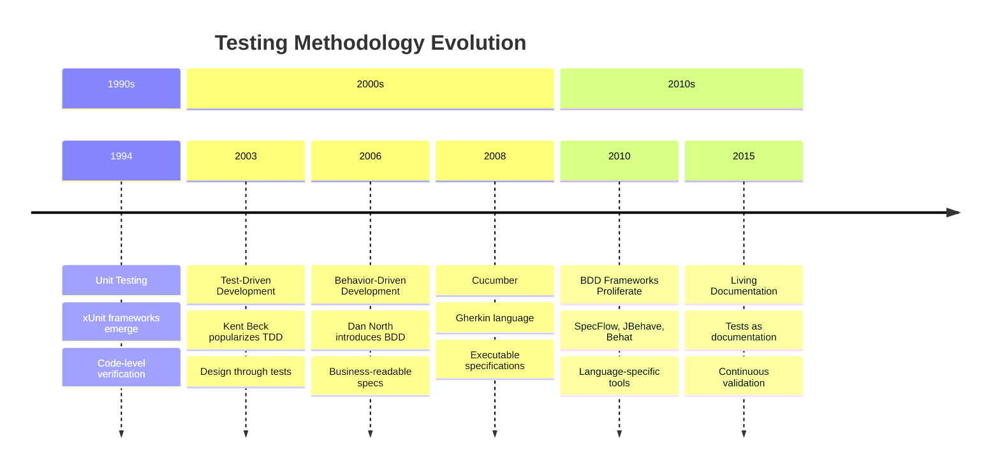
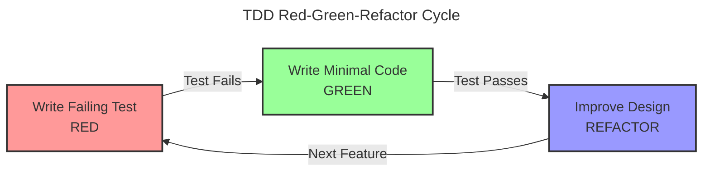
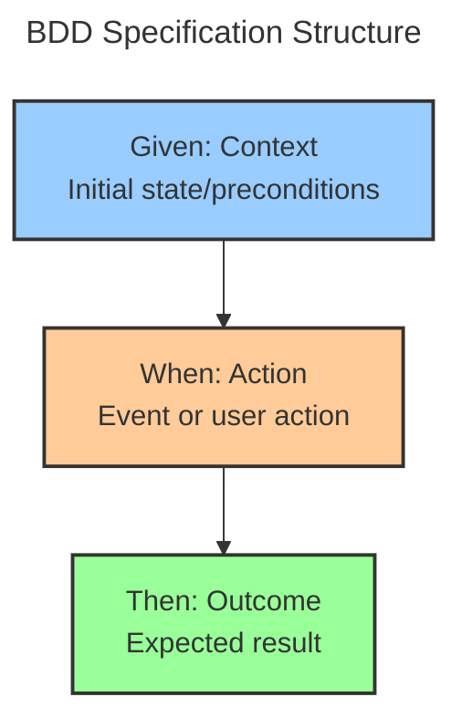
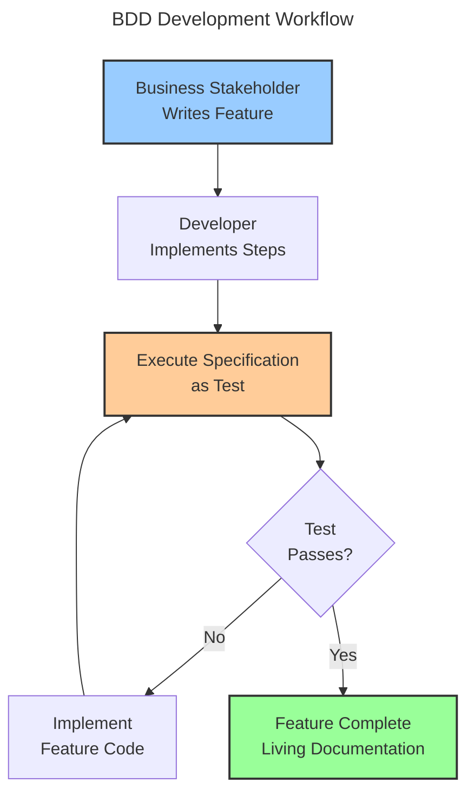

Developers write tests. Business stakeholders write requirements. These two activities happen in parallel, using different languages, creating different artifacts. Developers verify code works. Business stakeholders verify features meet needs. The gap between technical tests and business requirements creates misunderstandings, rework, and missed expectations.

Behavior-Driven Development (BDD) emerged to bridge this gap. The promise: write specifications in plain language that both business and technical teams understand, then execute those specifications as automated tests. Requirements become tests. Tests become documentation. Everyone speaks the same language.

The reality is more nuanced. BDD evolved from Test-Driven Development (TDD), adding layers of abstraction and collaboration. Unit testing focused on code correctness. TDD focused on design through tests. BDD focuses on behavior and business value. Each approach solves different problems in different contexts.

This exploration traces testing's evolution from unit tests to executable specifications. Understanding this history reveals why we have multiple testing approaches, when BDD adds value, and how to avoid turning readable specifications into unmaintainable test code.

### Testing Evolution Timeline



## The Testing Problem

Before examining BDD, understanding the problems it solves is essential. Traditional testing creates gaps between business intent and technical implementation.

### Why Traditional Testing Falls Short

Testing seemed straightforward initially:

!!!error "🚫 Traditional Testing Problems"
    **Communication Gaps**
    - Business writes requirements in documents
    - Developers write tests in code
    - Different languages, different artifacts
    - Requirements drift from implementation
    
    **Documentation Decay**
    - Requirements documents become outdated
    - Tests don't reflect business intent
    - No single source of truth
    - Manual verification needed
    
    **Collaboration Friction**
    - Business can't read technical tests
    - Developers misinterpret requirements
    - Feedback loops are slow
    - Rework is common

A typical project has business analysts writing requirements in Word documents, developers writing unit tests in code, and QA teams writing test cases in spreadsheets. These artifacts exist independently. When requirements change, documents update but tests lag. When bugs appear, it's unclear whether requirements, implementation, or tests are wrong.

### The BDD Vision

Behavior-Driven Development addresses these problems:

!!!success "✅ BDD Benefits"
    **Shared Understanding**
    - Business-readable specifications
    - Technical executable tests
    - Single source of truth
    - Reduced misunderstandings
    
    **Living Documentation**
    - Specifications stay current
    - Tests validate behavior
    - Documentation never outdated
    - Continuous validation
    
    **Collaboration Improvements**
    - Business and developers speak same language
    - Faster feedback loops
    - Earlier defect detection
    - Reduced rework

The vision is compelling: business stakeholders write specifications in plain language describing expected behavior. Developers implement features to satisfy those specifications. The specifications execute as automated tests, validating behavior continuously. Documentation stays current because it's executable. Everyone understands what the system does because specifications are readable.

## Foundation: Unit Testing

The testing journey begins with unit testing in the 1990s.

### Unit Testing Fundamentals

Unit testing verifies individual code components work correctly:

!!!anote "🧪 Unit Testing Core Concepts"
    **Purpose**
    - Verify code correctness
    - Test individual functions/methods
    - Fast execution
    - Developer-focused
    
    **Characteristics**
    - Small, focused tests
    - Test one thing at a time
    - Isolated from dependencies
    - Automated execution
    
    **Benefits**
    - Catch bugs early
    - Enable refactoring
    - Document code behavior
    - Regression prevention

Unit tests verify that individual functions produce expected outputs for given inputs. A unit test for a calculator's add function verifies that add(2, 3) returns 5. These tests run fast, provide quick feedback, and help developers catch bugs during development.

The xUnit family of frameworks (JUnit, NUnit, PyTest) standardized unit testing. Developers write test methods that assert expected behavior:

```java
@Test
public void testAddition() {
    Calculator calc = new Calculator();
    assertEquals(5, calc.add(2, 3));
}
```

### Unit Testing Limitations

Despite widespread adoption, unit testing has limitations:

!!!error "🚫 Unit Testing Challenges"
    **Technical Focus**
    - Tests written in code
    - Business stakeholders can't read them
    - Focus on implementation details
    - Miss business intent
    
    **Coverage vs Value**
    - High coverage doesn't mean correct behavior
    - Tests verify code works, not that it's useful
    - Can test wrong things thoroughly
    - False sense of security
    
    **Maintenance Burden**
    - Tests coupled to implementation
    - Refactoring breaks tests
    - Test code becomes legacy code
    - Diminishing returns

Unit tests verify code works but don't verify it solves business problems. You can have 100% code coverage while building the wrong feature. Tests focus on technical correctness—does this function return the right value—not business value—does this feature help users accomplish their goals.

## Evolution: Test-Driven Development

Test-Driven Development (TDD) emerged in the early 2000s, changing how developers approach testing.

### TDD Fundamentals

TDD inverts the testing process:

!!!anote "🔄 TDD Core Concepts"
    **The Red-Green-Refactor Cycle**
    1. Write a failing test (Red)
    2. Write minimal code to pass (Green)
    3. Refactor to improve design (Refactor)
    4. Repeat
    
    **Key Principles**
    - Write tests before code
    - Tests drive design
    - Small incremental steps
    - Continuous refactoring
    
    **Benefits**
    - Better design through testability
    - Comprehensive test coverage
    - Confidence to refactor
    - Documentation of intent

TDD treats tests as design tools, not verification tools. Instead of writing code then testing it, you write tests first. The test describes what you want the code to do. Then you write the simplest code to make the test pass. Finally, you refactor to improve design while keeping tests green.



### TDD in Practice

TDD became popular in agile development:

!!!success "✅ TDD Strengths"
    **Design Benefits**
    - Forces testable design
    - Encourages loose coupling
    - Promotes simple solutions
    - Prevents over-engineering
    
    **Development Benefits**
    - Clear next step always
    - Immediate feedback
    - Confidence to change code
    - Regression safety net

Developers practicing TDD report better design, fewer bugs, and more confidence. The discipline of writing tests first forces you to think about interfaces before implementation. Tests become executable specifications of how code should behave.

### TDD Limitations

TDD improved development but didn't solve all problems:

!!!error "🚫 TDD Challenges"
    **Still Technical**
    - Tests written in code
    - Business can't participate
    - Focus on units, not features
    - Miss big picture
    
    **Test Naming Problems**
    - testAddition() doesn't explain why
    - Technical names obscure intent
    - Hard to understand test purpose
    - Documentation value limited
    
    **Behavior vs Implementation**
    - Tests often coupled to implementation
    - Focus on how, not what
    - Brittle tests break on refactoring
    - Miss business behavior

TDD tests remain technical. Business stakeholders can't read them. Test names like testCalculateDiscount() don't explain business rules. Tests verify implementation details rather than business behavior. The gap between business requirements and technical tests persists.

## The BDD Revolution

Dan North introduced Behavior-Driven Development in 2006 to address TDD's limitations.

### BDD Core Innovation

BDD shifted focus from testing to behavior:

!!!anote "🎯 BDD Key Insights"
    **Naming Matters**
    - Replace "test" with "should"
    - testAddition() becomes shouldAddTwoNumbers()
    - Focus on behavior, not implementation
    - Clarify intent
    
    **Business Language**
    - Write specifications in domain language
    - Use business terminology
    - Describe behavior, not code
    - Enable collaboration
    
    **Outside-In Development**
    - Start with business value
    - Work from features to code
    - Focus on user needs
    - Avoid unnecessary code

BDD's first insight was simple: change test names from technical descriptions to behavioral specifications. Instead of testLogin(), write shouldAllowAccessWithValidCredentials(). This small change shifts thinking from verifying code to specifying behavior.

### The Given-When-Then Pattern

BDD introduced a structured format for specifications:

!!!anote "📝 Given-When-Then Structure"
    **Format**
    - Given: Initial context/preconditions
    - When: Action/event occurs
    - Then: Expected outcome/postconditions
    
    **Example**
    - Given a user with valid credentials
    - When they attempt to log in
    - Then they should access their dashboard
    
    **Benefits**
    - Clear structure
    - Business-readable
    - Testable format
    - Consistent style

Given-When-Then provides a template for describing behavior. Given establishes context. When describes the action. Then specifies the expected result. This structure works for both business specifications and technical tests.



### BDD Frameworks Emerge

Tools emerged to support BDD:

!!!anote "🛠️ BDD Framework Evolution"
    **RSpec (2005)**
    - Ruby BDD framework
    - Describe/it syntax
    - Readable specifications
    - Developer-focused
    
    **Cucumber (2008)**
    - Gherkin language
    - Plain text specifications
    - Business-readable
    - Language-agnostic
    
    **Other Frameworks**
    - SpecFlow (.NET)
    - JBehave (Java)
    - Behat (PHP)
    - Behave (Python)

RSpec brought BDD to Ruby with readable syntax:

```ruby
describe Calculator do
  it "should add two numbers" do
    calc = Calculator.new
    expect(calc.add(2, 3)).to eq(5)
  end
end
```

Cucumber took BDD further with Gherkin—a plain text language for specifications:

```gherkin
Feature: Calculator Addition
  Scenario: Add two positive numbers
    Given a calculator
    When I add 2 and 3
    Then the result should be 5
```

Business stakeholders can read and write Gherkin. Developers implement step definitions that execute the specifications. The gap between business and technical teams narrows.

## BDD in Practice: Gherkin and Cucumber

Cucumber and Gherkin became the most popular BDD tools.

### Gherkin Language

Gherkin provides structured plain text for specifications:

!!!anote "📄 Gherkin Syntax"
    **Keywords**
    - Feature: High-level description
    - Scenario: Specific example
    - Given: Preconditions
    - When: Actions
    - Then: Expected outcomes
    - And/But: Additional steps
    
    **Example Structure**
    
    Feature: User Authentication
      Scenario: Successful login
        Given a registered user
        When they enter valid credentials
        Then they should access their account

Gherkin specifications are readable by anyone. Business analysts write features describing desired behavior. Developers implement step definitions that execute those features as tests.

### Step Definitions

Step definitions connect Gherkin to code:

!!!anote "🔗 Step Definition Implementation"
    **Gherkin Step**
    
    Given a registered user
    
    **Step Definition (Java)**
    
    @Given("a registered user")
    public void aRegisteredUser() {
        user = new User("john@example.com", "password");
        userRepository.save(user);
    }
    
    **Purpose**
    - Map plain text to code
    - Implement test logic
    - Reusable across scenarios
    - Hide technical details

Step definitions implement the technical details behind readable specifications. Business stakeholders write Gherkin. Developers write step definitions. Cucumber connects them, executing specifications as automated tests.

### BDD Workflow

BDD changes the development workflow:



The workflow starts with business stakeholders describing desired behavior in Gherkin. Developers implement step definitions and feature code. Specifications execute as tests, validating behavior. When tests pass, features are complete and specifications become living documentation.

## BDD Benefits and Challenges

BDD provides significant benefits but introduces new challenges.

### When BDD Adds Value

BDD excels in specific contexts:

!!!success "✅ BDD Sweet Spot"
    **Ideal Scenarios**
    - Complex business rules
    - Multiple stakeholders
    - Regulatory requirements
    - Domain-driven design
    - Long-lived systems
    
    **Team Characteristics**
    - Business stakeholders engaged
    - Developers embrace collaboration
    - QA integrated with development
    - Shared ownership of quality
    
    **Project Characteristics**
    - Business logic complexity
    - Behavior more important than algorithms
    - Need for living documentation
    - Compliance requirements

BDD works best when business logic is complex and stakeholder collaboration is high. Financial systems with intricate rules benefit from executable specifications. Regulated industries need documentation that stays current. Domain-driven projects benefit from ubiquitous language.

### Common BDD Pitfalls

Teams make predictable mistakes with BDD:

!!!error "🚫 BDD Anti-Patterns"
    **Technical Gherkin**
    - Writing implementation details in scenarios
    - Using technical terminology
    - Describing UI interactions instead of behavior
    - Defeats readability purpose
    
    **Example - Bad:**
    
    Given I click the login button
    When I enter "john@example.com" in field "username"
    Then I should see element with id "dashboard"
    
    **Example - Good:**
    
    Given I am a registered user
    When I log in with valid credentials
    Then I should access my dashboard
    
    **Over-Specification**
    - Too many scenarios
    - Testing every edge case in Gherkin
    - Specifications become test scripts
    - Maintenance burden increases
    
    **Under-Implementation**
    - Step definitions with no assertions
    - Tests that always pass
    - False confidence
    - Wasted effort
    
    **Tool Obsession**
    - Focus on Cucumber instead of collaboration
    - BDD becomes "using Cucumber"
    - Miss the point of shared understanding
    - Technical exercise, not business value

The most common mistake is writing technical Gherkin. Teams describe UI interactions—click this button, enter this text—instead of business behavior. This defeats BDD's purpose. Specifications should describe what the system does, not how users interact with it.

### BDD vs TDD

!!!tip "🎯 BDD vs TDD Decision"
    **Use TDD When:**
    - Building algorithms
    - Technical components
    - Libraries and frameworks
    - Developer-focused code
    - Implementation details matter
    
    **Use BDD When:**
    - Complex business rules
    - Stakeholder collaboration needed
    - Living documentation valuable
    - Behavior more important than implementation
    - Domain-driven design
    
    **Reality:**
    - Use both together
    - BDD for features/behavior
    - TDD for implementation/units
    - Different levels, different tools

BDD and TDD aren't mutually exclusive. Use BDD for feature-level specifications that business stakeholders read. Use TDD for unit-level tests that verify implementation. BDD describes what the system should do. TDD verifies how it does it.

## Real-World Examples

Seeing how teams actually implement BDD clarifies when it adds value.

### E-Commerce Checkout: BDD Success

An e-commerce platform uses BDD for checkout logic:

!!!anote "🛒 E-Commerce Checkout"
    **Context**
    - Complex pricing rules
    - Multiple payment methods
    - Discount calculations
    - Tax regulations
    - Shipping logic
    
    **BDD Implementation**
    
    Feature: Discount Calculation
      Scenario: Apply percentage discount to order
        Given a customer with a 10% discount code
        And items totaling $100 in their cart
        When they apply the discount code
        Then the order total should be $90
        And the discount should appear on the invoice
    
    **Why It Works**
    - Business rules are complex
    - Stakeholders need to verify logic
    - Regulations require documentation
    - Rules change frequently
    - Living documentation stays current

Business analysts write scenarios describing pricing rules. Developers implement step definitions and feature code. When pricing rules change, analysts update scenarios. Tests validate new behavior. Documentation stays current because it's executable.

### Algorithm Development: TDD Better Fit

A team building a search algorithm uses TDD:

!!!anote "🔍 Search Algorithm"
    **Context**
    - Complex ranking algorithm
    - Performance critical
    - Mathematical calculations
    - Edge cases matter
    - Technical implementation focus
    
    **TDD Implementation**
    
    @Test
    public void shouldRankExactMatchesHighest() {
        SearchEngine engine = new SearchEngine();
        List<Result> results = engine.search("java");
        assertEquals("Java Programming", results.get(0).getTitle());
    }
    
    **Why TDD Works Better**
    - Algorithm details matter
    - Business can't specify implementation
    - Performance testing needed
    - Technical problem, technical solution
    - No need for business-readable specs

The algorithm's behavior matters less than its correctness and performance. Business stakeholders can't meaningfully participate in specifying ranking algorithms. TDD provides fast feedback and comprehensive coverage without BDD's overhead.

### Hybrid Approach: Best of Both

A SaaS platform uses both BDD and TDD:

!!!anote "☁️ SaaS Platform"
    **BDD for Features**
    - User registration
    - Subscription management
    - Billing logic
    - Access control
    - Business workflows
    
    **TDD for Implementation**
    - Data validation
    - API endpoints
    - Database queries
    - Utility functions
    - Technical components
    
    **Why Hybrid Works**
    - Right tool for each level
    - Business reads feature specs
    - Developers verify implementation
    - Comprehensive coverage
    - Maintainable test suite

Feature-level behavior uses BDD with Gherkin specifications. Business stakeholders participate in writing scenarios. Implementation-level code uses TDD with unit tests. Developers verify technical correctness. Each approach operates at its appropriate level.

## Living Documentation

BDD's ultimate promise is living documentation—specifications that stay current.

### Documentation That Never Lies

Traditional documentation becomes outdated:

!!!error "🚫 Traditional Documentation Problems"
    **Documentation Drift**
    - Written once, rarely updated
    - Code changes, docs don't
    - No validation mechanism
    - Trust erodes over time
    
    **Maintenance Burden**
    - Manual updates required
    - Time-consuming process
    - Often skipped under pressure
    - Becomes technical debt

BDD specifications are executable. When code changes, specifications either pass (documentation is current) or fail (documentation needs updating). Documentation can't drift from reality because it's continuously validated.

### Living Documentation Benefits

!!!success "✅ Living Documentation Value"
    **Always Current**
    - Specifications execute as tests
    - Failures indicate outdated docs
    - Continuous validation
    - Trust maintained
    
    **Single Source of Truth**
    - Requirements and tests unified
    - No duplicate artifacts
    - Reduced maintenance
    - Clear ownership
    
    **Onboarding Tool**
    - New team members read specs
    - Understand system behavior
    - See examples of features
    - Learn domain language

Living documentation serves multiple purposes. Business stakeholders verify features work as specified. Developers understand requirements. New team members learn the system. Compliance teams audit behavior. All from the same executable specifications.

### Making Documentation Useful

Living documentation requires discipline:

!!!tip "💡 Living Documentation Best Practices"
    **Write for Readers**
    - Use business language
    - Avoid technical details
    - Focus on behavior
    - Provide context
    
    **Organize Logically**
    - Group related scenarios
    - Use meaningful feature names
    - Structure by business capability
    - Enable navigation
    
    **Keep Current**
    - Update specs with code changes
    - Remove obsolete scenarios
    - Refactor for clarity
    - Treat as production code
    
    **Generate Reports**
    - HTML documentation from specs
    - Show feature coverage
    - Highlight failures
    - Share with stakeholders

Specifications should read like documentation, not test scripts. Organize by business capability, not technical structure. Generate HTML reports that stakeholders can browse. Treat specifications as important as production code.

## BDD Implementation Strategy

Successfully adopting BDD requires strategy, not just tools.

### Starting with BDD

!!!tip "🚀 BDD Adoption Strategy"
    **Start Small**
    - Pick one feature
    - Involve business stakeholder
    - Write scenarios together
    - Implement and iterate
    
    **Build Collaboration**
    - Three Amigos meetings
    - Business, Dev, QA together
    - Discuss scenarios before coding
    - Shared understanding first
    
    **Focus on Value**
    - Don't convert all tests to BDD
    - Use where collaboration helps
    - Keep unit tests as unit tests
    - BDD for business-critical features
    
    **Invest in Step Definitions**
    - Reusable, maintainable steps
    - Abstract technical details
    - Domain-focused language
    - Refactor regularly

Start with a single feature that has complex business rules and engaged stakeholders. Write scenarios collaboratively in "Three Amigos" meetings—business analyst, developer, and tester together. Focus on shared understanding, not tool usage.

### Three Amigos Meetings

The Three Amigos practice drives BDD success:

!!!anote "👥 Three Amigos Practice"
    **Participants**
    - Business Analyst: Represents business needs
    - Developer: Understands technical constraints
    - Tester: Thinks about edge cases
    
    **Process**
    1. Review user story
    2. Discuss examples of behavior
    3. Write scenarios together
    4. Identify questions and assumptions
    5. Agree on acceptance criteria
    
    **Outcomes**
    - Shared understanding
    - Better scenarios
    - Fewer defects
    - Reduced rework

Three Amigos meetings happen before development starts. The team discusses what the feature should do, writes scenarios together, and identifies gaps in understanding. This collaboration prevents misunderstandings that cause rework.

### Measuring BDD Success

!!!tip "📊 BDD Success Metrics"
    **Collaboration Metrics**
    - Stakeholder participation rate
    - Scenarios written collaboratively
    - Defects found in specification phase
    - Rework reduction
    
    **Quality Metrics**
    - Defect escape rate
    - Specification coverage
    - Scenario pass rate
    - Documentation currency
    
    **Efficiency Metrics**
    - Time to implement features
    - Onboarding time for new team members
    - Documentation maintenance effort
    - Stakeholder satisfaction

Success isn't measured by number of scenarios or code coverage. Success is measured by collaboration quality, defect reduction, and stakeholder satisfaction. If business stakeholders don't read specifications, BDD isn't working.

## Conclusion

Behavior-Driven Development evolved from unit testing and TDD to address the gap between business requirements and technical implementation. Unit testing verified code correctness. TDD improved design through tests. BDD enables collaboration through business-readable specifications.

BDD's core innovation is treating specifications as executable tests. Business stakeholders write scenarios in plain language. Developers implement step definitions that execute those scenarios. Specifications validate behavior continuously, becoming living documentation that never becomes outdated.

The Given-When-Then pattern provides structure for specifications. Given establishes context. When describes actions. Then specifies outcomes. This format works for both business communication and technical testing.

Tools like Cucumber and Gherkin enable BDD by connecting plain text specifications to code. Business stakeholders write features. Developers implement step definitions. The gap between business and technical teams narrows.

Common mistakes include writing technical Gherkin that describes UI interactions instead of business behavior, over-specifying with too many scenarios, and focusing on tools instead of collaboration. BDD succeeds when teams focus on shared understanding, not just using Cucumber.

BDD and TDD aren't mutually exclusive. Use BDD for feature-level specifications that business stakeholders read. Use TDD for unit-level tests that verify implementation. Different levels need different approaches.

Real-world examples show BDD succeeding with complex business rules and engaged stakeholders, TDD working better for algorithms and technical components, and hybrid approaches using both at appropriate levels.

Living documentation is BDD's ultimate promise—specifications that stay current because they're executable. Traditional documentation drifts from reality. BDD specifications can't drift because they're continuously validated.

Successful BDD adoption requires strategy. Start small with one feature. Build collaboration through Three Amigos meetings. Focus on value, not converting all tests to BDD. Invest in maintainable step definitions.

The decision to use BDD depends on context. Complex business rules benefit from executable specifications. Engaged stakeholders make collaboration valuable. Long-lived systems benefit from living documentation. Technical components often work better with traditional TDD.

Before adopting BDD, understand your needs. Do you have complex business rules? Are stakeholders willing to participate? Is living documentation valuable? Do you have time to invest in collaboration? The answers matter more than opinions about which testing approach is better.

The goal isn't perfect BDD adoption. The goal is building the right features correctly with shared understanding. Use BDD as a tool for collaboration, not an end in itself. Choose based on your context, invest in collaboration practices, and focus on business value.

Whether you choose unit testing, TDD, BDD, or a combination, remember: testing is a tool for building quality software, not a goal. Focus on outcomes—correct behavior, satisfied stakeholders, maintainable code. If the approach helps achieve these outcomes, use it. If it doesn't, choose differently. That's what good software development actually means.
