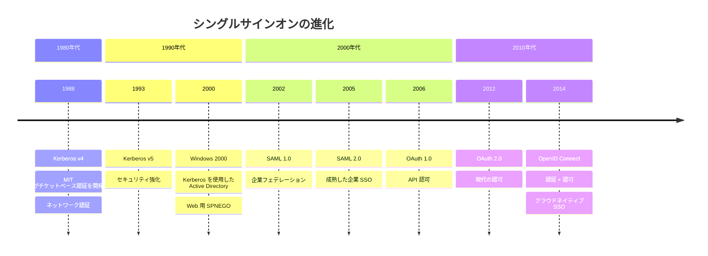
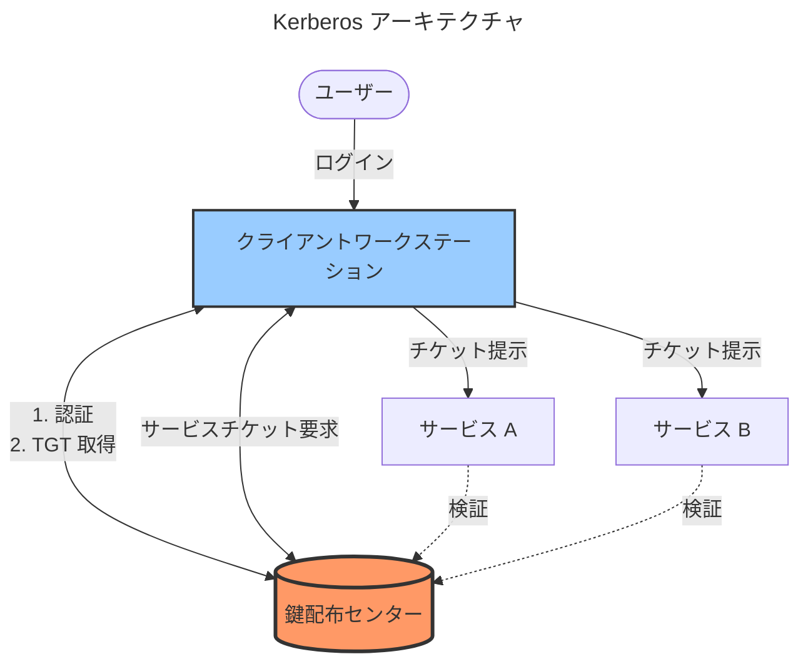
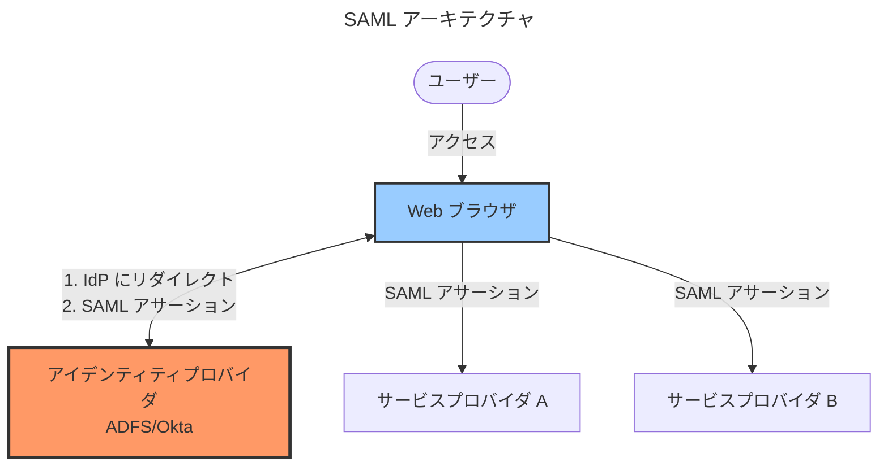
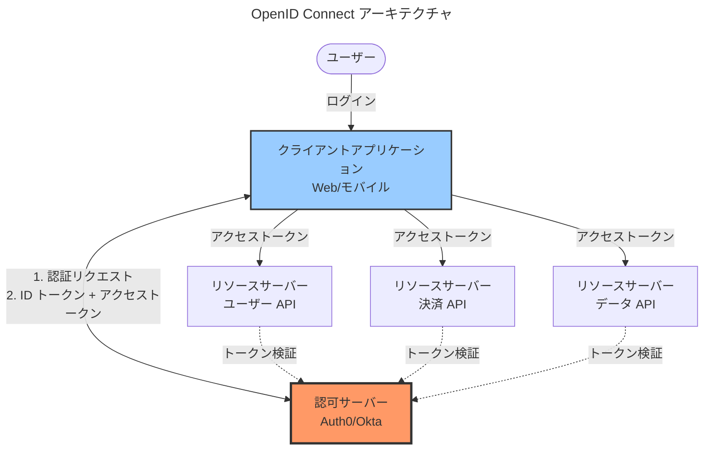

ユーザーはパスワードが嫌いです。忘れたり、使い回したり、付箋に書いたり、新しいパスワードの作成を強制されると文句を言います。組織もパスワードが嫌いです。ヘルプデスクのチケットを生み出し、セキュリティの脆弱性を作り、ユーザーをイライラさせます。シングルサインオン（SSO）は解決策として登場しました：一度認証すれば、すべてにアクセスできます。

この約束はシンプルに聞こえますが、現実は複雑です。数十年にわたり、複数の SSO 技術が登場し、それぞれが異なる文脈で異なる問題を解決しています。Windows 統合認証（WIA）は企業ネットワーク内で機能しました。Kerberos は分散システムに安全な認証を提供しました。SPNEGO は Windows と Web アプリケーションを橋渡ししました。SAML は企業フェデレーションを可能にしました。OAuth は API 認可に革命をもたらしました。OpenID Connect（OIDC）は最終的に現代のアプリケーションの認証と認可を統合しました。

この探求は、1980年代のネットワーク認証から今日のクラウドネイティブプロトコルまでの SSO の進化をたどります。この歴史を理解することで、なぜこれほど多くの SSO 標準があるのか、それぞれをいつ使用するか、そしてセキュリティを危険にさらす一般的な認証の間違いを避ける方法が明らかになります。

### SSO 進化のタイムライン

## パスワードの問題

SSO ソリューションを検討する前に、それらが解決する問題を理解することが不可欠です。パスワードはすべてのシステムで摩擦とリスクを生み出します。

### パスワードが失敗する理由

パスワードは当初良いアイデアのように思えました：

!!!error "🚫 パスワードの問題"
    **ユーザーの負担**
    - 数十のパスワードを覚える
    - 異なる複雑さの要件
    - 頻繁な有効期限ポリシー
    - パスワードリセットの摩擦
    
    **セキュリティリスク**
    - システム間でのパスワードの再利用
    - 記憶しやすい弱いパスワード
    - フィッシング攻撃による認証情報の窃取
    - クレデンシャルスタッフィング攻撃
    
    **運用コスト**
    - ヘルプデスクのパスワードリセットチケット
    - アカウントロックアウトの問題
    - プロビジョニングの複雑さ
    - 監査証跡のギャップ

典型的な企業の従業員は、電子メール、ファイル共有、データベース、Web アプリケーション、VPN、無数の SaaS ツールのパスワードを管理する必要があります。各システムには異なる要件があります—最小長、特殊文字、有効期限。ユーザーの反応は予測可能です：パスワードを再利用したり、書き留めたり、「Password1」、「Password2」、「Password3」のような単純なパターンを使用したりします。

### SSO のビジョン

シングルサインオンはこれらの問題を解決します：

!!!success "✅ SSO の利点"
    **ユーザーエクスペリエンス**
    - セッションごとに一度だけ認証
    - すべての認可されたシステムにアクセス
    - パスワード疲労の軽減
    - より速いアプリケーションアクセス
    
    **セキュリティの改善**
    - 集中認証
    - より強力な認証方法
    - 一貫したセキュリティポリシー
    - より良い監査証跡
    
    **運用効率**
    - ヘルプデスクチケットの削減
    - プロビジョニングの簡素化
    - 集中アクセス制御
    - 管理オーバーヘッドの削減

このビジョンは魅力的です：ユーザーは朝に一度認証すれば、追加のログインなしで電子メール、ファイル共有、データベース、Web アプリケーションにシームレスにアクセスできます。認証が強力な制御を持つ一箇所で行われるため、セキュリティが向上します。アクセス管理が集中化されるため、運用が簡素化されます。

## 初期の SSO：Kerberos と Windows

最初の実用的な SSO 実装は、企業ネットワーク向けに設計された1980年代と1990年代に登場しました。

### Kerberos：ネットワーク認証プロトコル

Kerberos は1980年代に MIT で開発され、分散システムに安全な認証を提供しました：

!!!anote "🎫 Kerberos の基礎"
    **コアコンセプト**
    - チケットベースの認証
    - 信頼できる第三者（KDC）
    - ネットワーク経由でパスワードを送信しない
    - 相互認証
    
    **動作原理**
    1. ユーザーが KDC に認証
    2. KDC がチケット付与チケット（TGT）を発行
    3. ユーザーが TGT を使用してサービスチケットを要求
    4. ユーザーがアプリケーションにサービスチケットを提示
    5. アプリケーションが KDC でチケットを検証

Kerberos は重要な問題を解決しました：パスワードを送信せずにネットワーク経由でユーザーを認証する方法。このプロトコルは対称鍵暗号と信頼できる鍵配布センター（KDC）を使用します。「Kerberos」という名前はギリシャ神話に由来します—冥界を守る三つ頭の犬で、クライアント、サーバー、KDC を表し、すべてが協力して認証を保護します。

!!!tip "📖 詳細：Kerberos"
    Kerberos アーキテクチャ、認証フロー、チケット構造、セキュリティ考慮事項、実装ガイダンスの詳細については、[Kerberos を理解する：ネットワーク認証詳解](/ja/2010/03/Understanding-Kerberos-Network-Authentication-Explained/)を参照してください。

### Windows 統合認証

Microsoft は Kerberos を基に Windows ドメイン認証を構築しました：

!!!anote "🪟 Windows 認証の進化"
    **NTLM（NT LAN Manager）**
    - チャレンジ-レスポンスプロトコル
    - 信頼できる第三者なし
    - リレー攻撃に脆弱
    - レガシープロトコル、まだサポート
    
    **Active Directory の Kerberos**
    - Windows 2000 以降デフォルト
    - Active Directory が KDC として機能
    - シームレスなデスクトップ SSO
    - Windows アプリケーションで動作

Windows 統合認証（WIA）は企業ネットワーク内で透過的な SSO を提供します。ドメイン資格情報で Windows ワークステーションにログインすると、Kerberos を使用して Active Directory に認証されます。ワークステーションはチケットをキャッシュします。ファイル共有、イントラネット Web サイト、その他の Windows 統合アプリケーションにアクセスすると、ワークステーションは自動的に適切なチケットを提示します。別のログインプロンプトは表示されません—ただ動作します。

このシームレスな体験は SSO のユーザー期待を設定しました。従業員は、デスクトップアプリケーションが追加の認証なしで動作するのに、なぜ Web アプリケーションには別のログインが必要なのか疑問に思いました。

### SPNEGO：Windows と Web の橋渡し

SPNEGO（Simple and Protected GSSAPI Negotiation Mechanism）は Windows 認証を Web ブラウザに拡張しました：

!!!anote "🌐 Web SSO 用 SPNEGO"
    **目的**
    - Kerberos を HTTP に拡張
    - ブラウザが認証をネゴシエート
    - ユーザーに透過的
    - イントラネット SSO
    
    **動作原理**
    1. ブラウザが保護されたリソースを要求
    2. サーバーが WWW-Authenticate: Negotiate で応答
    3. ブラウザが Kerberos チケットを要求
    4. ブラウザが Authorization ヘッダーでチケットを送信
    5. サーバーがチケットを検証してアクセスを許可
    
    **要件**
    - ドメイン参加ワークステーション
    - Kerberos 対応ブラウザ
    - 信頼ゾーン内のサーバー
    - 適切な DNS/SPN 設定

SPNEGO はイントラネット Web アプリケーションが Windows 認証を使用できるようにしました。従業員が会社のポータルにアクセスしてもログインページは表示されません—ブラウザは Windows 資格情報を使用して自動的に認証します。これは企業ネットワーク内では美しく機能しましたが、ネットワーク外では失敗しました。リモート従業員、モバイルデバイス、外部パートナーは Windows 認証を使用できず、後のプロトコルが埋めるギャップを作りました。

## 企業フェデレーション：SAML

組織が Web アプリケーションとクラウドサービスを採用するにつれて、企業ネットワークを超えた SSO が必要になりました。SAML が企業フェデレーション標準として登場しました。

### SAML 概要

Security Assertion Markup Language（SAML）は組織の境界を越えた SSO を可能にします：

!!!anote "🔐 SAML のコアコンセプト"
    **エンティティ**
    - アイデンティティプロバイダー（IdP）：ユーザーを認証
    - サービスプロバイダー（SP）：アプリケーションを提供
    - ユーザー：アプリケーションにアクセス
    
    **主要機能**
    - デジタル署名された XML アサーション
    - ブラウザベースのリダイレクトフロー
    - 組織の境界を越えて動作
    - 成熟した企業標準

SAML は認証とアプリケーションアクセスを分離します。アイデンティティプロバイダー（IdP）が認証を処理します—あなたが誰であるかを確認します。サービスプロバイダー（SP）は IdP のあなたの ID に関するアサーションを信頼します。SAML 対応アプリケーションにアクセスすると、組織の IdP にリダイレクトされます。IdP で一度認証すると、IdP は SAML アサーション—あなたが誰で、どのような属性を持っているかを示すデジタル署名された XML ドキュメント—を発行します。

### SAML の実践

SAML は企業 SSO の標準になりました：

!!!success "✅ SAML の強み"
    **企業での採用**
    - 主要な SaaS ベンダーがサポート
    - 組織の境界を越えて動作
    - 成熟した、よく理解されたプロトコル
    - 強力なセキュリティプロパティ
    
    **ユースケース**
    - 従業員の SaaS アプリケーションへのアクセス
    - パートナーフェデレーション
    - 顧客フェデレーション（B2B）
    - 学術フェデレーション（Shibboleth）

組織は SAML を展開して、従業員に数十の SaaS アプリケーションへのシームレスなアクセスを提供します。従業員は企業 IdP（多くの場合 Active Directory Federation Services または Okta）に一度認証すれば、追加のログインなしで Salesforce、Workday、ServiceNow、その他のアプリケーションにアクセスできます。

### SAML の制限

広く採用されているにもかかわらず、SAML には制限があります：

!!!error "🚫 SAML の課題"
    **技術的複雑さ**
    - XML ベース、冗長
    - 複雑な設定
    - 証明書管理のオーバーヘッド
    - デバッグが困難
    
    **モバイルと API の制限**
    - ブラウザベースのフロー向けに設計
    - モバイルアプリのサポートが不十分
    - API 認可向けに設計されていない
    - ブラウザリダイレクトが必要

SAML はブラウザベースの企業アプリケーションには適していますが、現代のユースケースでは苦労します。モバイルアプリはブラウザリダイレクトを簡単に処理できません。API はユーザーの操作なしに認可が必要です。シングルページアプリケーションは XML ではなく JSON を求めます。これらの制限が新しいプロトコルのスペースを作りました。

!!!tip "📖 詳細：SAML"
    SAML アーキテクチャ、認証フロー、セキュリティベストプラクティス、実装ガイダンスの詳細については、[SAML を理解する：エンタープライズフェデレーション詳解](/ja/2010/02/Understanding-SAML-Enterprise-Federation-Explained/)を参照してください。

## API 革命：OAuth

Web アプリケーションが API 駆動のアーキテクチャに進化するにつれて、新しい問題が浮上しました：パスワードを共有せずにサードパーティアプリケーションにユーザーリソースへの制限付きアクセスを許可する方法。

### 委任の問題

OAuth 以前、アプリケーションはパスワード共有を使用していました：

!!!error "🚫 パスワードアンチパターン"
    **問題**
    - ユーザーがサードパーティアプリにパスワードを提供
    - アプリがアカウントへの完全なアクセス権を持つ
    - パスワードを変更せずにアクセスを取り消す方法がない
    - パスワードが複数の当事者に公開される
    
    **例**
    - 写真印刷サービスが写真へのアクセスが必要
    - ユーザーがメールパスワードを提供
    - サービスがすべてのメールをダウンロード
    - サービスがパスワードを保存
    - ユーザーが選択的にアクセスを取り消せない

このパターンは一般的でしたが危険でした。ユーザーは複数のサービスとパスワードを共有し、それぞれが完全なアカウントアクセスを取得します。1つのサービスが侵害されると、すべてのサービスがリスクにさらされます。ユーザーはパスワードを変更してすべてのサービスを更新せずに、1つのサービスへのアクセスを取り消すことができませんでした。

### OAuth 2.0 ソリューション

OAuth 2.0 は委任の問題を解決しました：

!!!anote "🔑 OAuth のコアコンセプト"
    **エンティティ**
    - リソースオーナー：データを所有するユーザー
    - クライアント：アクセスを要求するアプリケーション
    - 認可サーバー：トークンを発行
    - リソースサーバー：保護されたリソースをホスト
    
    **トークン**
    - アクセストークン：API アクセスを許可
    - リフレッシュトークン：新しいアクセストークンを取得
    - スコープ：権限を制限
    - 有効期限：期限付きアクセス
    
    **主要原則**
    - パスワードを共有しない
    - 制限付きアクセスを許可
    - 取り消し可能な権限
    - 期限付きトークン

OAuth はパスワード共有なしで委任を可能にします。写真印刷サービスがあなたの写真へのアクセスが必要な場合、写真サービスの認可サーバーにリダイレクトします。認証して特定の権限を承認します—「写真の読み取りアクセスを許可」。認可サーバーは印刷サービスにアクセストークンを発行します。このトークンは制限付きアクセス（写真のみ、メールは含まない）を期限付きで許可します。パスワードを変更せずにいつでもトークンを取り消すことができます。

### OAuth フロー

OAuth は異なるシナリオに対して複数のフローを定義します：

!!!anote "🔄 OAuth 付与タイプ"
    **認可コードフロー**
    - バックエンドを持つ Web アプリケーション用
    - 最も安全なフロー
    - クライアントシークレットを使用
    - 機密クライアントに推奨
    
    **インプリシットフロー**
    - ブラウザベースアプリ用（非推奨）
    - クライアントシークレットなし
    - URL フラグメント内のトークン
    - セキュリティ上の懸念により非推奨
    
    **クライアント資格情報フロー**
    - マシン間通信用
    - ユーザー操作なし
    - サービスアカウント認証
    - バックエンドサービス
    
    **リソースオーナーパスワードフロー**
    - ユーザーがクライアントに資格情報を提供
    - レガシー移行パス
    - 非推奨
    - OAuth の目的に反する

認可コードフローがゴールドスタンダードです。クライアントはユーザーを認可サーバーにリダイレクトし、認可コードを受け取り、そのコードをクライアントシークレットを使用してアクセストークンと交換します。このフローはトークンをブラウザから遠ざけ、強力なセキュリティを提供します。

### OAuth の実践

OAuth は遍在するようになりました：

!!!success "✅ OAuth の採用"
    **コンシューマーアプリケーション**
    - 「Google でサインイン」
    - 「Facebook に接続」
    - 「Twitter アクセスを認可」
    - サードパーティ統合
    
    **API 認可**
    - マイクロサービス認証
    - モバイルアプリバックエンドアクセス
    - パートナー API アクセス
    - IoT デバイス認可

OAuth は Web 全体の「Google でサインイン」ボタンを支えています。Spotify が Facebook に投稿したり、フィットネスアプリがヘルスプラットフォームと同期したり、サービス間の無数の統合を可能にします。OAuth の成功は、実用的なソリューションで実際の問題—安全な委任—を解決したことから来ています。

### OAuth の制限

OAuth は認可を解決しましたが、認証について混乱を生み出しました：

!!!error "🚫 OAuth 認証の混乱"
    **OAuth は認証ではない**
    - OAuth はリソースへのアクセスを許可
    - ユーザー ID を検証しない
    - アクセストークンはユーザーを識別しない
    - OAuth を認証に使用するのは危険
    
    **問題**
    - 開発者が OAuth をログインに誤用
    - セキュリティ脆弱性が発生
    - 標準的なユーザー情報エンドポイントがない
    - 実装が一貫していない

開発者は OAuth の成功を見て、認証に使用しようとしました。アクセストークンを取得してユーザーを識別すると仮定しました。これはセキュリティ問題を引き起こしました—アクセストークンは ID を証明するように設計されていません。異なるプロバイダーがユーザー情報エンドポイントを異なる方法で実装しました。エコシステムには OAuth の上に標準的な認証レイヤーが必要でした。

## 現代の SSO：OpenID Connect

OpenID Connect（OIDC）は OAuth 2.0 の上に構築され、標準化された認証を提供します。

### OIDC 概要

OpenID Connect は OAuth が設計されていなかった認証問題を解決しました：

!!!anote "🆔 OIDC のコアイノベーション"
    **問題**
    - 開発者が OAuth を認証に誤用
    - アクセストークンは ID 証明ではない
    - ユーザー情報実装の不一致
    - セキュリティ脆弱性
    
    **OIDC ソリューション**
    - OAuth に ID トークン（JWT）を追加
    - ID トークンがユーザー ID を証明
    - ユーザー情報を標準化
    - 認証 + 認可を組み合わせ
    
    **主要な利点**
    - XML ではなく JSON
    - モバイルと API フレンドリー
    - シンプルな開発者エクスペリエンス
    - 現代のアーキテクチャサポート

OIDC は ID トークン—ID クレームを含む JWT—を追加することで OAuth を拡張します。OIDC で認証すると、ID トークン（あなたが誰であるかを証明）とアクセストークン（API アクセスを許可）の両方を受け取ります。この明確な分離により混乱がなくなり、安全な認証が提供されます。

### OIDC の実践

OIDC は現代の SSO 標準になりました：

!!!success "✅ OIDC の採用"
    **ユースケース**
    - Web アプリケーションログイン
    - モバイルアプリ認証
    - API 認可
    - マイクロサービスセキュリティ
    
    **プロバイダー**
    - Auth0、Okta、Azure AD
    - Google Identity Platform
    - AWS Cognito
    - セルフホスト：Keycloak、ORY Hydra

OIDC は Web アプリ、モバイルアプリ、API 全体で現代の認証を支えています。開発者は標準ライブラリを使用して統合し、カスタム認証コードを避けます。

### OIDC vs SAML

!!!tip "🎯 OIDC vs SAML の決定"
    **SAML を選択する場合：**
    - レガシー企業アプリ統合
    - ベンダーが SAML のみサポート
    - 既存の SAML インフラストラクチャ
    
    **OIDC を選択する場合：**
    - 新しいアプリケーションの構築
    - モバイルアプリ認証
    - API 認可が必要
    - 現代のアーキテクチャ
    
    **現実：**
    - 多くの IdP が両方をサポート
    - 新しいプロジェクトには OIDC を使用
    - レガシー統合には SAML を維持

SAML は消えませんが、新しいプロジェクトは OIDC を使用すべきです。よりシンプルで、より柔軟で、現代のアーキテクチャに適しています。

!!!tip "📖 詳細：OpenID Connect"
    OIDC アーキテクチャ、認証フロー、ID トークン、セキュリティベストプラクティス、実装ガイダンスの詳細については、[OpenID Connect：現代の認証詳解](/ja/2014/11/OpenID-Connect-Modern-Authentication-Explained/)を参照してください。

## 適切な SSO 技術の選択

複数の SSO 技術が利用可能な場合、どのように選択しますか？

### 決定フレームワーク

このフレームワークを使用して選択をガイドします：

!!!tip "🎯 SSO 技術の選択"
    **Kerberos/WIA の場合：**
    - Windows のみの環境
    - 企業ネットワークアクセス
    - デスクトップアプリケーション
    - イントラネット Web サイト
    - 外部アクセス不要
    
    **SPNEGO の場合：**
    - Kerberos を Web に拡張
    - イントラネットアプリケーション
    - Windows 統合認証
    - ドメイン参加デバイス
    
    **SAML の場合：**
    - 企業 SaaS 統合
    - ベンダーが SAML を要求
    - B2B フェデレーション
    - レガシーアプリケーションサポート
    - ブラウザベースのフローのみ
    
    **OAuth の場合：**
    - API 認可
    - サードパーティ統合
    - 委任アクセス
    - 認証不要
    
    **OIDC の場合：**
    - 現代の Web アプリケーション
    - モバイルアプリケーション
    - API 認可 + 認証
    - マイクロサービス
    - 新規開発

決定はあなたのコンテキストに依存します。企業イントラネットは Kerberos を使用するかもしれません。企業 SaaS 統合は SAML を使用します。現代の Web アプリケーションは OIDC を使用します。API 統合は OAuth を使用します。

### よくある間違い

チームは SSO で予測可能な間違いを犯します：

!!!error "🚫 SSO アンチパターン"
    **OAuth を認証に使用**
    - OAuth は認可用
    - ID を証明するように設計されていない
    - セキュリティ脆弱性
    - 代わりに OIDC を使用
    
    **カスタム SSO の実装**
    - 「自分たちで構築する」
    - セキュリティ脆弱性
    - メンテナンス負担
    - 標準プロトコルを使用
    
    **トークンセキュリティの無視**
    - localStorage にトークンを保存
    - 長期トークン
    - トークンローテーションなし
    - 不十分な検証
    
    **不適切なセッション管理**
    - ログアウト機能なし
    - セッション固定脆弱性
    - 一貫性のないセッション有効期限
    - シングルログアウトなし

最も一般的な間違いは、OIDC の代わりに OAuth を認証に使用することです。開発者は OAuth の人気を見て、アクセストークンでユーザーを認証しようとします。これはセキュリティ問題を引き起こします。認証には OIDC を使用してください—それはその目的のために設計されています。

## 実世界の例

組織が実際に SSO を実装する方法を見ることで、違いが明確になります：

### 企業イントラネット：Kerberos

大企業のイントラネットは Kerberos を使用します：

!!!anote "🏢 企業イントラネット"
    **コンテキスト**
    - 10,000人の従業員
    - Windows ドメイン環境
    - イントラネットアプリケーション
    - ファイル共有とデータベース
    - デスクトップアプリケーション
    
    **実装**
    - Active Directory が KDC として機能
    - Windows 統合認証
    - Web アプリケーション用 SPNEGO
    - シームレスなデスクトップ SSO
    - 追加のログイン不要
    
    **なぜ機能するか**
    - 均質な Windows 環境
    - 企業ネットワークアクセス
    - デスクトップ中心のワークフロー
    - 既存の AD インフラストラクチャ
    - ユーザーに透過的

従業員はワークステーションに一度ログインします。追加の認証なしでファイル共有、イントラネットサイト、デスクトップアプリケーションにアクセスします。Kerberos がすべてを透過的に処理します。これが機能するのは、環境が制御されているためです—Windows デバイス、企業ネットワーク、信頼されたアプリケーション。

### SaaS 統合：SAML

SaaS アプリケーションを統合する企業は SAML を使用します：

!!!anote "☁️ SaaS 統合"
    **コンテキスト**
    - 5,000人の従業員
    - 50以上の SaaS アプリケーション
    - Salesforce、Workday、ServiceNow など
    - 集中アクセス制御が必要
    - コンプライアンス要件
    
    **実装**
    - Okta が SAML IdP として機能
    - 各 SaaS アプリとの SAML フェデレーション
    - アプリアクセス用の従業員ポータル
    - 集中プロビジョニング
    - 監査ログ
    
    **なぜ機能するか**
    - SaaS ベンダーが SAML をサポート
    - ブラウザベースのアプリケーション
    - 集中認証
    - アクセス管理の簡素化
    - コンプライアンス要件を満たす

従業員は Okta に一度認証すれば、追加のログインなしですべての SaaS アプリケーションにアクセスできます。IT は中央でアクセスを管理します—新しい従業員をプロビジョニングし、退職する従業員をデプロビジョニングし、セキュリティポリシーを実施します。SAML は組織の境界を越えたこのフェデレーションを可能にします。

### 現代の Web アプリ：OIDC

Web アプリケーションを構築するスタートアップは OIDC を使用します：

!!!anote "🚀 現代の Web アプリケーション"
    **コンテキスト**
    - 企業向け SaaS 製品
    - Web とモバイルアプリケーション
    - RESTful API バックエンド
    - マイクロサービスアーキテクチャ
    - 認証と API 認可が必要
    
    **実装**
    - Auth0 が OIDC プロバイダーとして機能
    - PKCE 付き認可コードフロー
    - API 用 JWT アクセストークン
    - リフレッシュトークンローテーション
    - 標準 OIDC ライブラリ
    
    **なぜ機能するか**
    - 現代のアーキテクチャ
    - モバイルと Web のサポート
    - API 認可が組み込み
    - 開発者フレンドリー
    - セキュリティベストプラクティス

ユーザーは OIDC で認証し、ID トークンとアクセストークンを受け取ります。Web アプリは認証のために ID トークンを検証します。モバイルアプリは API 呼び出しにアクセストークンを使用します。マイクロサービスは JWT トークンを検証します。OIDC は1つのプロトコルで認証と認可を提供し、現代のアーキテクチャに完璧に適合します。

## セキュリティの考慮事項

SSO はセキュリティを向上させますが、新しいリスクも導入します：

### トークンセキュリティ

トークンは慎重な取り扱いが必要です：

!!!warning "⚠️ トークンセキュリティのベストプラクティス"
    **保存**
    - localStorage にトークンを保存しない
    - 可能な限り httpOnly クッキーを使用
    - 保存時にトークンを暗号化
    - ログアウト時にトークンをクリア
    
    **送信**
    - 常に HTTPS を使用
    - TLS 証明書を検証
    - URL にトークンを含めない
    - セキュアヘッダーを使用
    
    **検証**
    - トークン署名を検証
    - 有効期限をチェック
    - 発行者を検証
    - オーディエンスを検証
    
    **ローテーション**
    - 短期アクセストークン
    - リフレッシュトークンローテーション
    - 取り消しメカニズム
    - 悪用を監視

トークンはベアラー資格情報です—トークンを持っている人は誰でも使用できます。localStorage にトークンを保存すると XSS 攻撃にさらされます。長期トークンは侵害された場合のリスクを増加させます。常にトークンを適切に検証してください—署名、有効期限、発行者、オーディエンスをチェックします。

### 単一障害点

SSO は単一障害点を作成します：

!!!warning "⚠️ SSO 可用性リスク"
    **問題**
    - IdP の停止がすべてのアクセスをブロック
    - フォールバック認証なし
    - 事業継続性リスク
    - 外部サービスへの依存
    
    **緩和策**
    - 高可用性 IdP デプロイメント
    - 災害復旧計画
    - 緊急アクセス手順
    - SLA 監視
    - マルチ IdP セットアップを検討

IdP がダウンすると、ユーザーは何にもアクセスできません。これにより IdP の可用性が重要になります。高可用性で IdP を展開し、災害を計画し、緊急アクセス手順を確立します。一部の組織は冗長性のために複数の IdP を展開します。

### セッション管理

SSO はセッション管理を複雑にします：

!!!warning "⚠️ セッション管理の課題"
    **複数のセッション**
    - IdP セッション
    - アプリケーションセッション
    - 異なる有効期限
    - ログアウトの複雑さ
    
    **シングルログアウト**
    - 1つのアプリからログアウト
    - すべてのアプリからログアウトすべき
    - 調整が必要
    - 多くの場合不完全
    
    **ベストプラクティス**
    - シングルログアウトを実装
    - 一貫したセッション有効期限
    - ブラウザを閉じたらセッションをクリア
    - アクティブセッションを監視

ユーザーは1つのアプリケーションからログアウトすると、すべてからログアウトすることを期待します。これを実装するには IdP とすべてのアプリケーション間の調整が必要です。多くの SSO 実装はログインはうまく処理しますが、ログアウトは不十分で、ユーザーがログアウトしたと思った後もセッションがアクティブのままになります。

## 結論

シングルサインオンは30年間で企業ネットワーク認証からクラウドネイティブプロトコルへと進化しました。Kerberos は1980年代に安全なネットワーク認証を提供しました。Windows 統合認証はこれをデスクトップ環境に拡張しました。SPNEGO は Windows 認証を Web ブラウザに橋渡ししました。SAML は組織の境界を越えた企業フェデレーションを可能にしました。OAuth は API 認可と委任を解決しました。OpenID Connect は現代のアプリケーションの認証と認可を統合しました。

各技術は特定のコンテキストで特定の問題を解決するために登場しました。Kerberos は Windows インフラストラクチャを持つ企業ネットワークに適しています。SAML はブラウザベースのフローを持つ企業 SaaS 統合に適しています。OAuth は API 認可とサードパーティ統合に適しています。OIDC は認証と認可の両方が必要な現代の Web およびモバイルアプリケーションに適しています。

よくある間違いには、OIDC の代わりに OAuth を認証に使用すること、標準プロトコルの代わりにカスタム SSO を実装すること、不適切なトークンセキュリティプラクティス、不十分なセッション管理が含まれます。これらの間違いはセキュリティを危険にさらし、メンテナンス負担を生み出します。

SSO 技術間の決定はあなたのコンテキストに依存します。企業イントラネットは Kerberos を使用します。企業 SaaS 統合は SAML を使用します。現代の Web アプリケーションは OIDC を使用します。API 統合は OAuth を使用します。多くの組織は複数のプロトコルを使用します—レガシーアプリケーションには SAML、新しい開発には OIDC。

セキュリティの考慮事項には、トークンセキュリティ、単一障害点リスク、セッション管理の複雑さが含まれます。トークンは慎重な保存、送信、検証、ローテーションが必要です。SSO は緩和が必要な可用性依存関係を作成します。複数のアプリケーション間のセッション管理には調整が必要です。

実世界の例は、企業イントラネットでの Kerberos の成功、企業 SaaS 統合での SAML の成功、現代の Web アプリケーションでの OIDC の成功を示しています。各技術は適切なコンテキストで優れています。

SSO 技術を選択する前に、要件を理解してください。どのような種類のアプリケーションがありますか？ユーザーはどこでアクセスしますか？どのようなセキュリティ要件が存在しますか？どのようなインフラストラクチャがすでに存在しますか？これらの質問への答えは、どのプロトコルが優れているかについての意見よりも重要です。

目標は1つのプロトコルへの完璧な準拠ではありません。目標はビジネス目標を可能にする安全で使いやすい認証です。プロトコルをツールとして使用し、目標としないでください。コンテキストに基づいて選択し、セキュリティベストプラクティスを実装し、ユーザーエクスペリエンスに焦点を当ててください。

Kerberos、SAML、OAuth、OIDC のいずれを選択しても、覚えておいてください：SSO は認証問題を解決するためのツールであり、それ自体が目的ではありません。結果に焦点を当ててください—安全なアクセス、良好なユーザーエクスペリエンス、運用効率。プロトコルがこれらの結果を達成するのに役立つなら、それを使用してください。そうでなければ、別のものを選択してください。それが良いセキュリティアーキテクチャの真の意味です。
