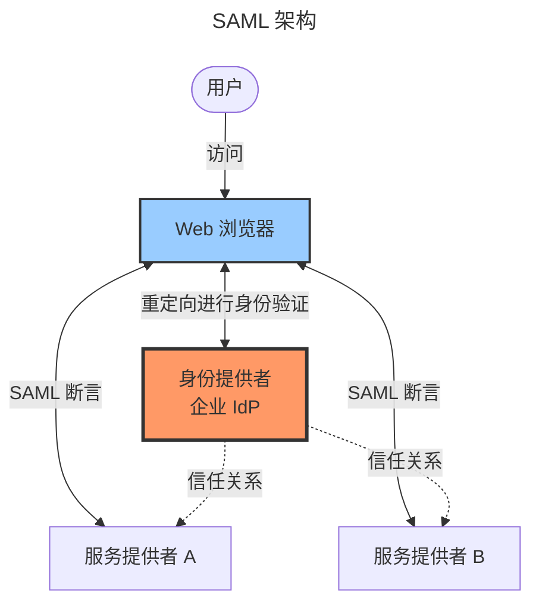
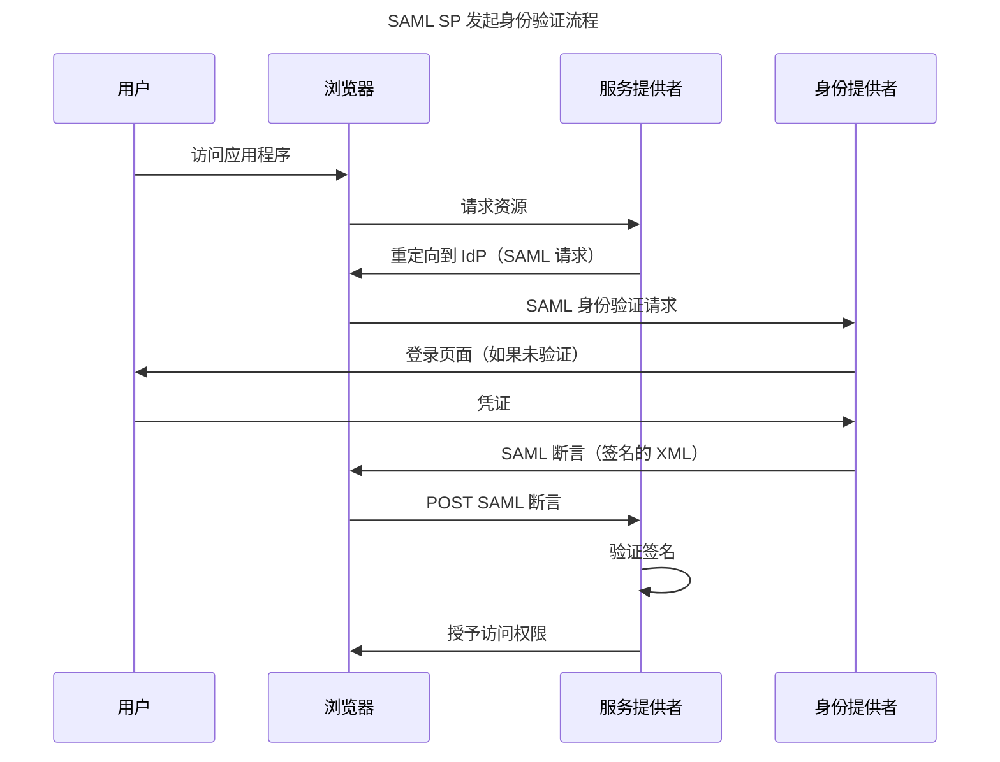

2000 年代，组织快速采用 Web 应用程序和云服务，带来了新的身份验证挑战。员工需要访问数十个 SaaS 应用程序——Salesforce、Workday、ServiceNow 等等。每个应用程序都有自己的登录。用户需要管理多个密码。IT 部门在配置方面遇到困难。安全团队担心凭证泛滥。

Kerberos 和 Windows 集成身份验证在企业网络内运行良好，但在跨组织边界时失效。远程员工无法使用 Windows 身份验证。SaaS 供应商没有与 Active Directory 集成。移动设备不支持 SPNEGO。企业需要一个新的 SSO 标准，能够跨互联网、跨组织、跨平台工作。

安全断言标记语言（SAML）应运而生。由 OASIS 开发并于 2002 年发布，SAML 实现了联合身份验证——组织可以相互信任对方的身份验证，而无需共享用户数据库或凭证。员工可以向其企业身份提供者（IdP）进行一次身份验证，然后访问数十个外部服务提供者（SP），无需额外登录。

本文深入探讨 SAML 的架构、流程、优势和局限性。理解 SAML 揭示了为什么它主导企业 SSO 十多年，以及为什么现代替代方案正在出现。

## SAML 基础

SAML 通过身份提供者和服务提供者之间的信任关系，将身份验证与应用程序访问分离。

### 核心实体

SAML 定义了三个主要实体：

!!!anote "🔐 SAML 实体"
    **身份提供者（IdP）**
    - 验证用户身份
    - 颁发 SAML 断言
    - 管理用户身份
    - 示例：Okta、Azure AD、ADFS
    
    **服务提供者（SP）**
    - 提供应用程序
    - 使用 SAML 断言
    - 信任 IdP 身份验证
    - 示例：Salesforce、Workday、ServiceNow
    
    **用户（主体）**
    - 访问应用程序
    - 在 IdP 处进行身份验证
    - 将断言传递给 SP
    - 浏览器充当中介

身份提供者处理身份验证——验证你是谁。服务提供者信任 IdP 关于你身份的断言。这种分离实现了联合身份验证：SP 永远看不到你的密码，永远不管理你的账户，也永远不需要与你的企业目录集成。IdP 处理所有这些。

### SAML 断言

SAML 断言是包含用户声明的数字签名 XML 文档：

!!!anote "📜 SAML 断言类型"
    **身份验证断言**
    - 确认用户身份
    - 使用的身份验证方法
    - 身份验证时间戳
    - 会话过期时间
    
    **属性断言**
    - 用户属性（电子邮件、姓名、角色）
    - 组成员资格
    - 自定义属性
    - 授权数据
    
    **授权决策断言**
    - 访问权限
    - 特定资源授权
    - 较少使用
    - 通常由应用程序处理

身份验证断言声明："此用户在此时间使用此方法进行了身份验证。"属性断言声明："此用户具有这些属性。"服务提供者使用这些断言做出访问决策——授予访问权限、分配角色、个性化体验。

断言由 IdP 使用 XML 签名进行数字签名。服务提供者使用 IdP 的公钥验证签名，确保断言未被篡改并确实来自受信任的 IdP。

### SAML 绑定

SAML 绑定定义了 SAML 消息的传输方式：

!!!anote "🔗 SAML 绑定"
    **HTTP 重定向绑定**
    - SAML 消息在 URL 参数中
    - 浏览器重定向
    - 消息大小受限
    - 最常用于请求
    
    **HTTP POST 绑定**
    - SAML 消息在表单字段中
    - 浏览器表单提交
    - 支持更大消息
    - 最常用于响应
    
    **SOAP 绑定**
    - 直接服务器到服务器
    - 无浏览器参与
    - 同步通信
    - 实践中较少使用
    
    **工件绑定**
    - 引用而非完整断言
    - 后端检索
    - 减少浏览器暴露
    - 实现更复杂

HTTP 重定向和 HTTP POST 绑定在实践中占主导地位。IdP 将浏览器重定向到带有 SAML 请求的 SP。SP 将浏览器重定向到 IdP 进行身份验证。IdP 将 SAML 断言发回 SP。浏览器充当中介，在 IdP 和 SP 之间传递消息，而不理解其内容。

## SAML 架构

SAML 的架构实现了跨组织边界的联合身份验证：

浏览器充当中介。IdP 和 SP 在身份验证期间从不直接通信——所有消息都通过浏览器流动。这种设计跨越防火墙和组织边界。SP 不需要网络访问 IdP。IdP 不需要提前知道所有 SP。

信任关系通过元数据交换建立。IdP 发布包含其公钥和端点的元数据。SP 导入此元数据，建立信任。SP 发布包含其端点和要求的元数据。IdP 导入此元数据，实现联合身份验证。

## SAML 身份验证流程

SAML 支持两种主要身份验证流程：SP 发起和 IdP 发起。

### SP 发起流程

SP 发起流程从应用程序开始：

详细流程：

!!!anote "🔄 SP 发起流程步骤"
    **1. 用户访问应用程序**
    - 用户点击链接或输入 URL
    - 浏览器请求受保护资源
    - SP 检测到未验证用户
    
    **2. SP 生成 SAML 请求**
    - 创建 AuthnRequest XML
    - 包含 SP 标识符
    - 指定所需属性
    - 签名请求（可选）
    
    **3. 浏览器重定向到 IdP**
    - SP 将浏览器重定向到 IdP
    - SAML 请求在 URL 或表单中
    - 包含 RelayState（返回 URL）
    
    **4. 用户在 IdP 处进行身份验证**
    - IdP 检查现有会话
    - 如果需要，显示登录页面
    - 用户提供凭证
    - IdP 验证凭证
    
    **5. IdP 生成 SAML 断言**
    - 创建断言 XML
    - 包含用户身份
    - 添加属性声明
    - 使用私钥签名断言
    
    **6. 浏览器将断言发送到 SP**
    - IdP 将浏览器重定向到 SP
    - 断言在表单字段中
    - 包含 RelayState
    
    **7. SP 验证断言**
    - 使用 IdP 公钥验证签名
    - 检查过期时间
    - 验证受众限制
    - 提取用户身份和属性
    
    **8. SP 授予访问权限**
    - 创建本地会话
    - 重定向到原始资源
    - 用户访问应用程序

SP 发起流程提供最佳用户体验。用户直接为应用程序 URL 添加书签。他们从电子邮件中点击链接。他们从想要使用的应用程序开始。应用程序在需要时处理重定向以进行身份验证。

### IdP 发起流程

IdP 发起流程从门户开始：

!!!anote "🔄 IdP 发起流程步骤"
    **1. 用户在 IdP 门户进行身份验证**
    - 用户访问 IdP 门户
    - 进行一次身份验证
    - 查看可用应用程序列表
    
    **2. 用户点击应用程序链接**
    - 从门户选择应用程序
    - IdP 知道 SP 端点
    
    **3. IdP 生成 SAML 断言**
    - 为选定的 SP 创建断言
    - 包含用户身份和属性
    - 签名断言
    
    **4. 浏览器将断言发送到 SP**
    - IdP 将浏览器重定向到 SP
    - 断言在表单字段中
    
    **5. SP 验证断言**
    - 验证签名
    - 检查过期时间
    - 验证受众
    
    **6. SP 授予访问权限**
    - 创建本地会话
    - 用户访问应用程序

IdP 发起流程适用于基于门户的访问。用户在门户进行一次身份验证，然后点击链接访问多个应用程序，无需额外登录。此流程更简单——没有 SAML 请求，没有 RelayState 管理。但是，它不太灵活。用户无法直接为应用程序 URL 添加书签。他们必须始终从门户开始。

### 流程比较

!!!tip "🎯 选择 SAML 流程"
    **使用 SP 发起流程当：**
    - 用户为应用程序 URL 添加书签
    - 需要深度链接
    - 更好的用户体验
    - 标准 SAML 流程
    
    **使用 IdP 发起流程当：**
    - 基于门户的访问模型
    - 实现更简单
    - 受控应用程序列表
    - 旧版 SP 要求
    
    **最佳实践：**
    - 支持两种流程
    - 默认使用 SP 发起
    - 提供门户以方便使用
    - 让用户选择

大多数现代实现支持两种流程。SP 发起提供更好的用户体验。IdP 发起提供更简单的实现。支持两者为用户提供灵活性。

## SAML 实践

SAML 通过广泛采用成为主导的企业 SSO 标准。

### 企业采用

组织部署 SAML 为员工提供对 SaaS 应用程序的无缝访问：

!!!success "✅ SAML 企业用例"
    **员工访问 SaaS**
    - 单一身份验证点
    - 访问数十个应用程序
    - 集中配置
    - 简化访问管理
    
    **合作伙伴联合身份验证**
    - 授予合作伙伴有限访问权限
    - 无共享凭证
    - 受控权限
    - 审计跟踪
    
    **客户联合身份验证（B2B）**
    - 客户组织验证用户
    - 服务提供者信任客户 IdP
    - 无密码管理
    - 可扩展的多租户访问
    
    **学术联合身份验证**
    - Shibboleth 实现
    - 研究协作
    - 图书馆资源访问
    - 跨机构 SSO

典型的企业部署如下：IT 部署 IdP（Okta、Azure AD 或 ADFS）。他们为每个 SaaS 应用程序配置 SAML 联合身份验证。员工向 IdP 进行一次身份验证，然后访问所有应用程序，无需额外登录。IT 集中管理访问——配置新员工、取消离职员工、执行安全策略。

### 真实案例

考虑一家拥有 5,000 名员工使用 50 个 SaaS 应用程序的公司：

!!!anote "🏢 企业 SAML 部署"
    **SAML 之前**
    - 每位员工 50 个密码
    - 总共 250,000 个凭证
    - 帮助台被重置请求淹没
    - 访问控制不一致
    - 审计跟踪缺口
    - 安全漏洞
    
    **SAML 之后**
    - 每个会话一次身份验证
    - 集中访问控制
    - 自动配置
    - 完整审计跟踪
    - 减少帮助台工单
    - 改善安全态势
    
    **实施**
    - Okta 作为 SAML IdP
    - 与每个 SaaS 应用程序的 SAML 联合身份验证
    - 员工门户用于应用程序访问
    - 通过 SCIM 自动配置
    - IdP 处的 MFA
    - 执行会话策略

转变是巨大的。员工进行一次身份验证即可访问所有内容。IT 在一个地方配置访问。安全性得到改善，因为身份验证通过强控制集中化。帮助台工单减少，因为密码重置在一个地方进行。审计跟踪得到改善，因为所有身份验证都通过 IdP。

### 供应商支持

SAML 的成功来自广泛的供应商支持：

!!!success "✅ SAML 生态系统"
    **身份提供者**
    - Okta
    - Azure Active Directory
    - ADFS（Active Directory 联合服务）
    - Ping Identity
    - OneLogin
    
    **服务提供者**
    - Salesforce
    - Workday
    - ServiceNow
    - Box
    - Slack
    - 数千个 SaaS 应用程序
    
    **开源**
    - Shibboleth
    - SimpleSAMLphp
    - OpenSAML
    - 所有语言的 SAML 库

几乎每个企业 SaaS 应用程序都支持 SAML。这种无处不在的支持使 SAML 成为企业 SSO 的默认选择。组织可以部署一个 IdP 并与所有应用程序联合。

## SAML 优势

SAML 成功是因为它解决了实际问题：

!!!success "✅ SAML 优势"
    **企业就绪**
    - 成熟、广为理解的协议
    - 广泛的供应商支持
    - 大规模验证
    - 强大的安全属性
    
    **联合身份验证能力**
    - 跨组织边界工作
    - 无共享凭证
    - 去中心化架构
    - 信任关系
    
    **安全功能**
    - 数字签名
    - 加密支持
    - 断言过期
    - 受众限制
    - 重放保护
    
    **灵活性**
    - 多种绑定
    - 属性交换
    - 自定义属性
    - 可扩展框架

SAML 的数字签名提供强大的安全性。SP 验证断言确实来自受信任的 IdP 且未被篡改。加密保护敏感属性。过期防止重放攻击。受众限制确保断言仅由预期接收者使用。

协议的灵活性支持多样化的用例。组织可以交换自定义属性。他们可以为不同场景实现不同的绑定。他们可以根据特定需求扩展协议。

## SAML 局限性

尽管广泛采用，SAML 仍有显著局限性：

### 技术复杂性

SAML 基于 XML 的设计带来复杂性：

!!!error "🚫 SAML 技术挑战"
    **XML 冗长**
    - 冗长的消息格式
    - 需要复杂的解析
    - 消息大小大
    - 难以调试
    
    **配置复杂性**
    - 需要元数据交换
    - 证书管理
    - 端点配置
    - 绑定选择
    
    **调试困难**
    - XML 解析错误
    - 签名验证失败
    - 证书问题
    - 错误消息不清晰
    
    **开发者体验**
    - 学习曲线陡峭
    - 复杂的库
    - 工具有限
    - 集成耗时

典型的 SAML 断言有数百行 XML。调试需要理解 XML 命名空间、XML 签名和 SAML 特定元素。证书管理容易出错——过期的证书会悄无声息地破坏联合身份验证。配置需要交换元数据、配置端点和测试多个流程。

开发人员经常在 SAML 集成方面遇到困难。协议复杂。错误消息晦涩。调试工具有限。本应是简单的 SSO 集成变成了多周项目。

### 移动和 API 局限性

SAML 是为基于浏览器的流程设计的：

!!!error "🚫 SAML 移动/API 挑战"
    **浏览器依赖**
    - 需要浏览器重定向
    - 移动应用体验差
    - 需要嵌入式浏览器
    - 会话管理问题
    
    **API 授权**
    - 不是为 API 设计的
    - 无基于令牌的访问
    - 断言不适合 API 调用
    - 需要会话 cookie
    
    **移动应用问题**
    - 重定向流程破坏应用体验
    - 嵌入式浏览器安全问题
    - 会话持久性问题
    - 平台特定挑战

移动应用在 SAML 方面遇到困难。重定向流程需要打开浏览器、进行身份验证，然后返回应用程序。这破坏了用户体验。嵌入式浏览器（WebView）带来安全问题——应用程序可以拦截凭证。跨应用程序和浏览器的会话管理很复杂。

API 无法有效使用 SAML。SAML 断言是为基于浏览器的身份验证设计的，而不是 API 授权。API 需要可以包含在 HTTP 标头中的令牌。SAML 提供建立浏览器会话的断言。这种不匹配是根本性的。

### 用户体验问题

SAML 的重定向密集流程带来用户体验问题：

!!!error "🚫 SAML 用户体验挑战"
    **重定向开销**
    - 每次身份验证多次重定向
    - 身份验证流程缓慢
    - 用户可见
    - 对非技术用户造成困惑
    
    **注销复杂性**
    - 单点注销难以实现
    - 注销行为不一致
    - 注销后会话持续存在
    - 安全影响
    
    **会话管理**
    - 多个会话（IdP + SP）
    - 不同的会话生命周期
    - 会话同步问题
    - 超时不一致
    
    **错误处理**
    - 错误消息不清晰
    - 用户看到 XML 错误
    - 难以排查
    - 支持负担

用户在身份验证期间看到多次重定向。浏览器在 SP 和 IdP 之间跳转。这令人困惑且缓慢。注销更糟——从一个应用程序注销不会从其他应用程序注销。用户认为他们已注销，但会话仍然存在。这带来安全风险。

## SAML 与现代替代方案

SAML 主导企业 SSO 十多年，但现代替代方案出现了：

### SAML 与 OpenID Connect

OpenID Connect（OIDC）解决了许多 SAML 局限性：

!!!tip "🎯 SAML 与 OIDC 比较"
    **SAML 优势**
    - 成熟、经过验证的协议
    - 广泛的企业支持
    - 现有基础设施
    - 监管接受度
    
    **OIDC 优势**
    - JSON 而非 XML
    - RESTful API
    - 移动友好
    - 内置 API 授权
    - 更好的开发者体验
    - 现代架构
    
    **决策因素**
    - 旧版应用支持 → SAML
    - 新开发 → OIDC
    - 移动应用 → OIDC
    - API 授权 → OIDC
    - 供应商要求 → 可能决定选择

OIDC 使用 JSON 而非 XML，使其更简单、更开发者友好。OIDC 与移动应用和 API 配合良好。OIDC 在一个协议中结合了身份验证和授权。对于新开发，OIDC 通常是更好的选择。

然而，SAML 不会消失。太多企业应用程序依赖它。许多组织同时运行两种协议——SAML 用于旧版应用程序，OIDC 用于新开发。大多数现代 IdP 支持两种协议，实现逐步迁移。

### 何时选择 SAML

SAML 在特定场景中仍然是正确的选择：

!!!tip "🎯 选择 SAML 当"
    **旧版集成**
    - 应用程序仅支持 SAML
    - 现有 SAML 基础设施
    - 迁移成本过高
    - 监管要求
    
    **企业要求**
    - 供应商强制要求 SAML
    - 合规标准指定 SAML
    - 现有联合身份验证协议
    - 仅浏览器访问
    
    **特定用例**
    - 学术联合身份验证（Shibboleth）
    - 政府系统
    - 医疗保健（HIPAA 要求）
    - 金融服务

如果你的 SaaS 供应商仅支持 SAML，你就使用 SAML。如果你的合规要求强制要求 SAML，你就使用 SAML。如果你有运行良好的现有 SAML 基础设施，你就继续使用 SAML。该协议有效——只是不适合现代用例。

## 安全最佳实践

安全地实施 SAML 需要注意细节：

### 断言验证

正确的断言验证至关重要：

!!!warning "⚠️ SAML 断言验证"
    **必需检查**
    - 验证数字签名
    - 检查断言过期
    - 验证颁发者
    - 验证受众限制
    - 检查接收者
    - 验证 NotBefore/NotOnOrAfter
    
    **常见错误**
    - 跳过签名验证
    - 忽略过期
    - 不检查受众
    - 接受任何颁发者
    - 不验证就信任断言内容

每个断言都必须验证。使用 IdP 的公钥验证数字签名。检查断言是否未过期。验证颁发者是否与你信任的 IdP 匹配。检查受众限制是否与你的 SP 标识符匹配。跳过任何这些检查都会带来安全漏洞。

### 证书管理

SAML 依赖证书进行签名：

!!!warning "⚠️ SAML 证书管理"
    **最佳实践**
    - 监控证书过期
    - 自动化续订流程
    - 支持多个证书
    - 测试证书轮换
    - 记录证书位置
    
    **常见问题**
    - 过期的证书破坏联合身份验证
    - 手动续订流程容易出错
    - 无监控警报
    - 未测试轮换
    - 丢失私钥

证书过期是最常见的 SAML 故障。证书过期，联合身份验证中断，用户无法访问应用程序。实施监控以在过期前发出警报。尽可能自动化续订。支持多个证书以实现平滑轮换。在生产中需要之前测试轮换流程。

### 会话安全

SAML 会话需要仔细管理：

!!!warning "⚠️ SAML 会话安全"
    **会话生命周期**
    - 合理的会话持续时间
    - 空闲超时执行
    - 绝对超时限制
    - 敏感操作需要重新身份验证
    
    **注销实施**
    - 实施单点注销
    - 清除所有会话
    - 使断言无效
    - 重定向到安全页面
    
    **会话固定**
    - 身份验证后生成新会话 ID
    - 不接受来自 URL 的会话 ID
    - 使用安全会话 cookie
    - 实施 CSRF 保护

会话应具有合理的生命周期——足够长以保证可用性，足够短以保证安全性。实施空闲超时。敏感操作需要重新身份验证。正确实施单点注销——清除 IdP 会话和所有 SP 会话。通过在身份验证后生成新会话 ID 来防止会话固定。

## 结论

SAML 实现了跨组织边界的企业 SSO，解决了基于浏览器的应用程序的密码泛滥问题。该协议通过数字签名断言将身份验证（IdP）和应用程序访问（SP）分离，提供了强大的安全性并实现了大规模联合身份验证。

SAML 成功是因为它解决了实际问题。组织需要为数十个 SaaS 应用程序提供集中身份验证。员工需要无缝访问，无需密码疲劳。IT 需要简化配置和访问管理。SAML 提供了这些好处，成为主导的企业 SSO 标准。

然而，SAML 基于 XML 的设计、以浏览器为中心的流程和配置复杂性揭示了其年代。移动应用在重定向流程方面遇到困难。API 无法有效使用 SAML 断言。开发人员发现集成困难。OpenID Connect 等现代替代方案通过 JSON、RESTful API 和更好的移动支持解决了这些局限性。

SAML 不会消失——太多企业应用程序依赖它。但新开发应考虑 OIDC，以获得更好的开发者体验、移动支持和 API 授权。许多组织同时运行两种协议，SAML 用于旧版集成，OIDC 用于新开发。

实施 SAML 时，专注于安全基础：正确验证断言、仔细管理证书、实施安全会话处理。这些实践可防止常见漏洞并确保可靠的联合身份验证。

SAML 和现代替代方案之间的选择取决于你的环境。旧版应用程序集成需要 SAML。新开发受益于 OIDC。移动应用需要 OIDC。基于浏览器的企业应用程序与两者都配合良好。根据你的要求选择，而不是协议偏好。

SAML 代表了身份验证的关键演变——从基于网络的协议到互联网规模的联合身份验证。理解 SAML 的优势和局限性有助于你就身份验证架构做出明智决策。无论你选择 SAML 还是现代替代方案，目标都是相同的：实现业务目标的安全、可用的身份验证。
