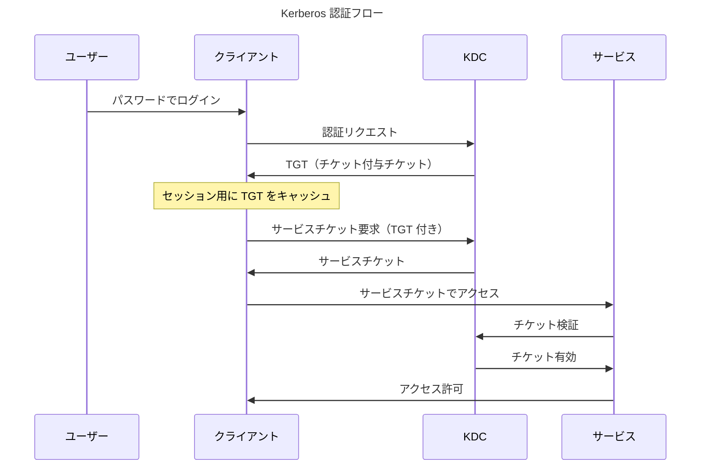

Kerberos は分散コンピューティングにおける基本的な問題を解決しました：パスワードを送信せずにネットワーク経由でユーザーを認証する方法。Project Athena の一部として MIT が 1980 年代に開発したこのプロトコルは、チケットベースの認証を導入し、今日でも企業ネットワークセキュリティの基盤となっています。

プロトコルの名前はギリシャ神話に由来します——Kerberos（Cerberus）、冥界を守る三つ頭の犬。三つの頭はクライアント、サーバー、鍵配布センター（KDC）を表し、すべてが協力して認証を保護します。この比喩はプロトコルの本質を捉えています：複数の当事者がアクセスを保護するために協力します。

## Kerberos が解決した問題

Kerberos 以前、ネットワーク認証は重要な課題に直面していました：

!!!error "🚫 Kerberos 以前の認証問題"
    **パスワード送信**
    - パスワードがネットワーク経由で送信される
    - 盗聴攻撃に脆弱
    - ネットワークスニッフィングが認証情報を暴露
    - リプレイ攻撃に対する保護なし
    
    **スケーラビリティの問題**
    - 各サービスがパスワード検証を必要とする
    - ユーザーが繰り返し認証する
    - すべてのサーバーにパスワードデータベース
    - 同期の悪夢
    
    **セキュリティの弱点**
    - 相互認証なし
    - サーバーがクライアントを検証できない
    - クライアントがサーバーを検証できない
    - 中間者攻撃が可能

初期のネットワークは単純なパスワード認証を使用していました。ファイルサーバーにアクセスすると、ネットワーク経由でパスワードを送信しました。ネットワークトラフィックを監視している人は誰でもパスワードをキャプチャできました。各サービスは独自のパスワードデータベースを維持し、同期の問題を引き起こしました。ユーザーは各サービスに個別に認証し、摩擦とセキュリティギャップを生み出しました。

## Kerberos のコアコンセプト

Kerberos はネットワーク認証を変革した革命的なコンセプトを導入しました：

### チケットベースの認証

!!!anote "🎫 Kerberos チケット"
    **チケット付与チケット（TGT）**
    - 初期認証後に発行
    - KDC にユーザー ID を証明
    - セッション期間中有効（通常 10 時間）
    - サービスチケットの要求に使用
    
    **サービスチケット**
    - 特定のサービスへのアクセスを許可
    - ユーザー ID と権限を含む
    - 時間制限（通常 5 分）
    - サービスの鍵で暗号化
    
    **主な利点**
    - ネットワーク経由でパスワードを送信しない
    - セッションごとに一度だけ認証
    - 時間制限付きアクセス
    - 暗号的に安全

チケットはパスワードを暴露せずに ID を証明する暗号化された認証情報です。認証すると TGT を受け取ります。このチケットはセッション中に KDC に対してあなたの ID を証明します。サービスにアクセスする必要がある場合、TGT を KDC に提示し、KDC がサービスチケットを発行します。サービスチケットをサービスに提示し、サービスがそれを検証してアクセスを許可します。

### 鍵配布センター（KDC）

KDC は Kerberos を機能させる信頼できる第三者です：

!!!anote "🔑 KDC コンポーネント"
    **認証サーバー（AS）**
    - 初期認証を処理
    - ユーザー認証情報を検証
    - チケット付与チケットを発行
    - ユーザーの最初の接点
    
    **チケット付与サーバー（TGS）**
    - サービスチケットを発行
    - TGT を検証
    - チケットのライフサイクルを管理
    - チケットの更新を処理
    
    **データベース**
    - ユーザー認証情報を保存
    - サービス鍵を維持
    - チケットの状態を追跡
    - セキュリティポリシーを実施

KDC はすべてのユーザーとサービスの秘密鍵を維持します。認証すると、AS が認証情報を検証して TGT を発行します。サービスアクセスが必要な場合、TGS が TGT を検証してサービスチケットを発行します。サービスは KDC と共有する秘密鍵を使用してチケットを検証します。

### 対称鍵暗号

Kerberos は効率のために対称鍵暗号を使用します：

!!!anote "🔐 Kerberos 暗号化"
    **共有秘密**
    - 各ユーザーは秘密鍵を持つ（パスワードから派生）
    - 各サービスは秘密鍵を持つ
    - KDC はすべての秘密鍵を知っている
    - 鍵は送信されない
    
    **暗号化**
    - TGT はユーザーの鍵で暗号化
    - サービスチケットはサービスの鍵で暗号化
    - 認証子が所有を証明
    - タイムスタンプがリプレイを防止
    
    **セキュリティプロパティ**
    - 相互認証
    - メッセージの完全性
    - リプレイ保護
    - 前方秘匿性（適切な設定で）

対称鍵暗号は公開鍵暗号よりも高速で、Kerberos を大量の認証に対して効率的にします。KDC は適切な鍵でチケットを暗号化します。意図された受信者のみがそれらを復号化できます。タイムスタンプとノンスがリプレイ攻撃を防ぎます。

## Kerberos 認証フロー

認証フローを理解することで、Kerberos がどのように安全で効率的な認証を実現するかが明らかになります：

### ステップバイステップ認証

!!!anote "📋 Kerberos 認証ステップ"
    **1. 初期認証（AS 交換）**
    - ユーザーがパスワードを入力
    - クライアントがパスワードから暗号化鍵を導出
    - クライアントが AS に認証リクエストを送信
    - AS が認証情報を検証
    - AS がユーザーの鍵で暗号化された TGT を発行
    - クライアントが TGT を復号化（パスワード知識を証明）
    
    **2. サービスチケット要求（TGS 交換）**
    - クライアントがサービスにアクセスする必要がある
    - クライアントが TGS に TGT を送信
    - TGS が TGT を検証
    - TGS がサービスチケットを発行
    - サービスチケットはサービスの鍵で暗号化
    
    **3. サービスアクセス（AP 交換）**
    - クライアントがサービスにサービスチケットを送信
    - サービスがその鍵でチケットを復号化
    - サービスがチケットの内容を検証
    - サービスがアクセスを許可
    - オプション：サービスがクライアントに認証（相互認証）

このフローの美しさは、パスワードがネットワーク経由で送信されないことです。ユーザーのパスワードは TGT を復号化するためにローカルでのみ使用されます。すべての後続の認証はチケットを使用します。ユーザーはセッションごとに一度だけ認証し、その後複数のサービスにシームレスにアクセスします。

### チケットの内容

チケットには安全な認証を可能にする特定の情報が含まれています：

!!!anote "📄 チケット構造"
    **TGT の内容**
    - ユーザープリンシパル名
    - TGS セッション鍵
    - チケットの有効期間
    - 認可データ
    - KDC の鍵で暗号化
    
    **サービスチケットの内容**
    - ユーザープリンシパル名
    - サービスプリンシパル名
    - サービスのセッション鍵
    - チケットの有効期間
    - 認可データ
    - サービスの鍵で暗号化
    
    **認証子**
    - ユーザープリンシパル名
    - タイムスタンプ
    - セッション鍵で暗号化
    - チケットの所有を証明
    - リプレイ攻撃を防止

チケットはクライアントに対して不透明です——内容を読むことができません。意図された受信者（KDC またはサービス）のみがチケットを復号化できます。認証子はクライアントがセッション鍵を所有していることを証明し、チケットの盗難を防ぎます。

## Windows での Kerberos

Microsoft は Windows 2000 以降のデフォルト認証プロトコルとして Kerberos を採用しました：

### Active Directory 統合

!!!anote "🪟 Active Directory での Kerberos"
    **実装**
    - Active Directory が KDC として機能
    - ドメインコントローラーが KDC サービスを実行
    - ユーザーアカウントが AD に保存
    - サービスのサービスプリンシパル名（SPN）
    - Kerberos 設定のグループポリシー
    
    **拡張機能**
    - チケット内の認可データ（PAC）
    - 制約付き委任
    - プロトコル遷移
    - クレームベースの認証
    - 複合認証
    
    **互換性**
    - レガシーシステムの NTLM フォールバック
    - フォレストのクロスレルム信頼
    - MIT Kerberos 相互運用性
    - Unix/Linux 統合

Active Directory は Microsoft 固有の拡張機能を使用して Kerberos を実装します。特権属性証明書（PAC）には認可データ——グループメンバーシップと特権——が含まれています。これにより、追加のディレクトリルックアップなしで効率的な認可が可能になります。

### Windows 認証エクスペリエンス

Windows 統合認証はシームレスな SSO を提供します：

!!!success "✅ Windows SSO エクスペリエンス"
    **デスクトップログイン**
    - ユーザーが Windows ワークステーションにログイン
    - ドメインコントローラーへの Kerberos 認証
    - TGT がメモリにキャッシュ
    - 10 時間有効（デフォルト）
    
    **シームレスアクセス**
    - ファイル共有へのアクセス——追加のログイン不要
    - イントラネット Web サイトへのアクセス——自動認証
    - デスクトップアプリケーションへのアクセス——透過的な SSO
    - データベースへのアクセス——統合セキュリティ
    
    **ユーザーエクスペリエンス**
    - 1 日に 1 回のパスワード入力
    - 追加のプロンプトなし
    - ユーザーに透過的
    - ドメイン全体で機能

このシームレスなエクスペリエンスは SSO のユーザー期待を設定しました。従業員は朝に一度認証すれば、追加のログインなしですべての企業リソースにアクセスできます。これが機能するのは、環境が制御されているためです——ドメイン参加デバイス、企業ネットワーク、信頼されたサービス。

## SPNEGO：Web 用 Kerberos

SPNEGO（Simple and Protected GSSAPI Negotiation Mechanism）は Kerberos を Web ブラウザに拡張します：

### SPNEGO の動作

!!!anote "🌐 SPNEGO プロトコル"
    **ネゴシエーション**
    - ブラウザが保護されたリソースを要求
    - サーバーが応答：WWW-Authenticate: Negotiate
    - ブラウザが Negotiate ヘッダーを認識
    - ブラウザが SPNEGO を開始
    
    **Kerberos 交換**
    - ブラウザが KDC からサービスチケットを要求
    - ブラウザが Authorization ヘッダーでチケットを送信
    - サーバーがチケットを検証
    - サーバーがアクセスを許可
    
    **要件**
    - ドメイン参加ワークステーション
    - Kerberos 対応ブラウザ（IE、Chrome、Firefox）
    - イントラネットゾーン内のサーバー（IE）または信頼されたサイト
    - サーバー上の適切な SPN 設定

SPNEGO はイントラネット Web アプリケーションが Windows 認証を使用できるようにします。従業員が会社のポータルにアクセスしてもログインページは表示されません——ブラウザは Windows 認証情報を使用して自動的に認証します。

### SPNEGO 設定

適切な設定は SPNEGO にとって重要です：

!!!warning "⚠️ SPNEGO 設定要件"
    **サーバー設定**
    - サービスプリンシパル名（SPN）を登録
    - IIS で Windows 認証を有効化
    - 匿名認証を無効化
    - 必要に応じて Kerberos 委任を設定
    
    **クライアント設定**
    - イントラネットゾーンにサイトを追加（IE）
    - 統合 Windows 認証を有効化
    - Chrome/Firefox の信頼されたサイトを設定
    - DNS 解決が機能することを確認
    
    **一般的な問題**
    - SPN の欠落または重複
    - DNS 設定の誤り
    - ブラウザが設定されていない
    - Kerberos 委任が有効になっていない

SPN 登録は重要です。SPN はサービス URL をサービスアカウントにマップします。適切な SPN 登録がないと、Kerberos 認証は失敗し、NTLM にフォールバックします。

## Kerberos セキュリティ

Kerberos は強力なセキュリティを提供しますが、適切な実装が必要です：

### セキュリティプロパティ

!!!success "✅ Kerberos セキュリティの利点"
    **認証**
    - 相互認証（オプション）
    - 強力な暗号化
    - ネットワーク上にパスワードなし
    - リプレイ保護
    
    **認可**
    - チケットに認可データを含む
    - PAC 内のグループメンバーシップ
    - 効率的な認可チェック
    - 集中ポリシー実施
    
    **完全性**
    - チケットが暗号的に署名
    - 改ざんが検出される
    - メッセージ完全性のためのセッション鍵
    - タイムスタンプがリプレイを防止

Kerberos は相互認証を提供します——クライアントがサーバーを検証でき、中間者攻撃を防ぎます。チケットには認可データが含まれ、効率的なアクセス制御が可能になります。暗号署名が完全性を保証します。

### セキュリティの考慮事項

Kerberos は完璧ではありません——適切な実装が重要です：

!!!warning "⚠️ Kerberos セキュリティの考慮事項"
    **チケット盗難**
    - チケットがメモリに保存される
    - パスザチケット攻撃が可能
    - Mimikatz がチケットを抽出できる
    - 緩和策：Credential Guard、短い有効期間
    
    **KDC の侵害**
    - KDC がすべての秘密を知っている
    - 単一障害点
    - 侵害された場合のゴールデンチケット攻撃
    - 緩和策：KDC を保護、アクセスを監視
    
    **時刻同期**
    - Kerberos は同期された時計を必要とする
    - デフォルト許容範囲：5 分
    - 時計のずれが認証を破壊
    - 緩和策：NTP、時刻のドリフトを監視
    
    **暗号化の弱点**
    - レガシー暗号化タイプ（DES、RC4）は弱い
    - AES を推奨
    - ダウングレード攻撃が可能
    - 緩和策：弱い暗号化を無効化

パスザチケット攻撃はチケット盗難を悪用します。攻撃者はメモリからチケットを抽出して再利用します。Windows 10+ の Credential Guard はこれを防ぎます。ゴールデンチケット攻撃は KDC の侵害を悪用します——攻撃者は任意の特権を持つチケットを偽造します。

## Kerberos の制限

その強みにもかかわらず、Kerberos には制限があります：

!!!error "🚫 Kerberos の制限"
    **ネットワーク要件**
    - KDC へのネットワーク接続が必要
    - KDC に到達できない場合は失敗
    - インターネット向けアプリには不適切
    - 信頼されたネットワーク向けに設計
    
    **時刻同期**
    - 厳格な時刻要件
    - 時計のずれが認証を破壊
    - NTP インフラストラクチャが必要
    - トラブルシューティングの複雑さ
    
    **複雑さ**
    - 複雑なプロトコル
    - トラブルシューティングが困難
    - SPN 設定エラーが一般的
    - 委任設定が難しい
    
    **モバイルとクラウド**
    - 企業ネットワーク向けに設計
    - モバイルデバイスのサポートが不十分
    - クラウド統合の課題
    - リモートアクセスには VPN が必要

Kerberos は企業ネットワーク内では美しく機能しますが、ネットワーク外では苦労します。リモート従業員は VPN アクセスが必要です。モバイルデバイスのサポートは限られています。クラウドアプリケーションはオンプレミス KDC と簡単に統合できません。

## Kerberos を使用する場合

Kerberos は特定のコンテキストで優れています：

!!!tip "🎯 Kerberos のユースケース"
    **理想的な用途：**
    - 企業イントラネット
    - Windows ドメイン環境
    - デスクトップアプリケーション
    - ファイル共有とデータベース
    - 大量の認証
    - 信頼されたネットワーク環境
    
    **理想的でない用途：**
    - インターネット向けアプリケーション
    - モバイルアプリケーション
    - クラウドネイティブアーキテクチャ
    - 組織間アクセス
    - 信頼されていないネットワーク
    - 異種環境

Windows ワークステーション上でファイル共有、イントラネットサイト、デスクトップアプリケーションにアクセスする 10,000 人の従業員を持つ大企業——Kerberos に最適です。クラウドネイティブ SaaS アプリケーションを構築するスタートアップ——代わりに OIDC を使用してください。

## 結論

Kerberos はパスワード送信問題を解決することでネットワーク認証に革命をもたらしました。チケットベースの認証は企業ネットワーク内で安全で効率的な SSO を実現します。プロトコルの設計——信頼された KDC、対称鍵暗号、時間制限付きチケット——は強力なセキュリティプロパティを提供します。

Microsoft が Active Directory で Kerberos を採用したことで、企業認証の事実上の標準となりました。Windows 統合認証はユーザー期待を設定するシームレスな SSO を提供します。SPNEGO は Kerberos を Web アプリケーションに拡張し、イントラネット SSO を実現しました。

その強みにもかかわらず、Kerberos には制限があります。KDC へのネットワーク接続、厳格な時刻同期、複雑な設定が必要です。企業ネットワーク内では美しく機能しますが、モバイルデバイス、クラウドアプリケーション、インターネット向けサービスでは苦労します。

SAML や OIDC のような現代の認証プロトコルは、Web およびクラウドアプリケーションに対する Kerberos の制限に対処します。しかし、企業ネットワーク内では、Kerberos は依然としてゴールドスタンダードです。Kerberos を理解することで、すべての SSO プロトコルに適用される認証の基礎についての洞察が得られます。

三つ頭の犬は依然として企業を守っています——そして今後何年もそうし続けるでしょう。
