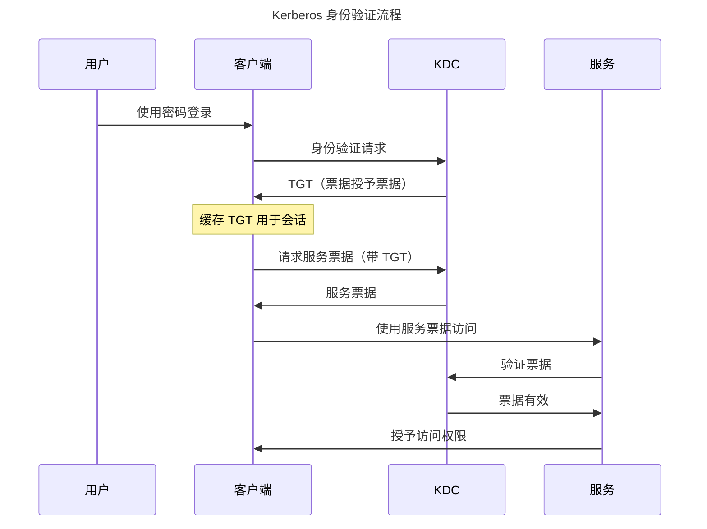

Kerberos 解决了分布式计算中的一个基本问题：如何在不发送密码的情况下跨网络验证用户身份。作为 Project Athena 的一部分，该协议由 MIT 在 1980 年代开发，引入了基于票据的身份验证，至今仍是企业网络安全的基础。

该协议的名字来自希腊神话——Kerberos（Cerberus），守卫冥界的三头犬。三个头代表客户端、服务器和密钥分发中心（KDC），它们共同保护身份验证的安全。这个隐喻抓住了协议的本质：多方合作保护访问。

## Kerberos 解决的问题

在 Kerberos 之前，网络身份验证面临关键挑战：

!!!error "🚫 Kerberos 之前的身份验证问题"
    **密码传输**
    - 密码通过网络发送
    - 易受窃听攻击
    - 网络嗅探暴露凭据
    - 无法防止重放攻击
    
    **可扩展性问题**
    - 每个服务都需要密码验证
    - 用户重复进行身份验证
    - 每个服务器上都有密码数据库
    - 同步噩梦
    
    **安全弱点**
    - 没有相互身份验证
    - 服务器无法验证客户端
    - 客户端无法验证服务器
    - 可能发生中间人攻击

早期网络使用简单的密码身份验证。当你访问文件服务器时，你通过网络发送密码。任何监控网络流量的人都可以捕获密码。每个服务维护自己的密码数据库，造成同步问题。用户分别向每个服务进行身份验证，造成摩擦和安全缺口。

## Kerberos 核心概念

Kerberos 引入了革命性的概念，改变了网络身份验证：

### 基于票据的身份验证

!!!anote "🎫 Kerberos 票据"
    **票据授予票据（TGT）**
    - 初始身份验证后颁发
    - 向 KDC 证明用户身份
    - 在会话期间有效（通常 10 小时）
    - 用于请求服务票据
    
    **服务票据**
    - 授予对特定服务的访问权限
    - 包含用户身份和权限
    - 时间限制（通常 5 分钟）
    - 使用服务的密钥加密
    
    **主要优势**
    - 不通过网络发送密码
    - 每个会话只需一次身份验证
    - 时间限制的访问
    - 加密安全

票据是加密的凭据，可以在不暴露密码的情况下证明身份。当你进行身份验证时，你会收到 TGT。这张票据在会话期间向 KDC 证明你的身份。当你需要访问服务时，你向 KDC 出示 TGT，KDC 会颁发服务票据。你向服务出示服务票据，服务验证它并授予访问权限。

### 密钥分发中心（KDC）

KDC 是使 Kerberos 工作的可信第三方：

!!!anote "🔑 KDC 组件"
    **身份验证服务器（AS）**
    - 处理初始身份验证
    - 验证用户凭据
    - 颁发票据授予票据
    - 用户的第一个接触点
    
    **票据授予服务器（TGS）**
    - 颁发服务票据
    - 验证 TGT
    - 管理票据生命周期
    - 处理票据续订
    
    **数据库**
    - 存储用户凭据
    - 维护服务密钥
    - 跟踪票据状态
    - 执行安全策略

KDC 维护所有用户和服务的密钥。当你进行身份验证时，AS 验证你的凭据并颁发 TGT。当你需要服务访问时，TGS 验证你的 TGT 并颁发服务票据。服务使用与 KDC 共享的密钥验证票据。

### 对称密钥加密

Kerberos 使用对称密钥加密以提高效率：

!!!anote "🔐 Kerberos 加密"
    **共享密钥**
    - 每个用户都有密钥（从密码派生）
    - 每个服务都有密钥
    - KDC 知道所有密钥
    - 密钥从不传输
    
    **加密**
    - TGT 使用用户的密钥加密
    - 服务票据使用服务的密钥加密
    - 认证器证明拥有权
    - 时间戳防止重放
    
    **安全属性**
    - 相互身份验证
    - 消息完整性
    - 重放保护
    - 前向保密（适当配置）

对称密钥加密比公钥加密更快，使 Kerberos 对大量身份验证高效。KDC 使用适当的密钥加密票据。只有预期的接收者才能解密它们。时间戳和随机数防止重放攻击。

## Kerberos 身份验证流程

理解身份验证流程揭示了 Kerberos 如何实现安全、高效的身份验证：

### 分步身份验证

!!!anote "📋 Kerberos 身份验证步骤"
    **1. 初始身份验证（AS 交换）**
    - 用户输入密码
    - 客户端从密码派生加密密钥
    - 客户端向 AS 发送身份验证请求
    - AS 验证凭据
    - AS 颁发使用用户密钥加密的 TGT
    - 客户端解密 TGT（证明密码知识）
    
    **2. 服务票据请求（TGS 交换）**
    - 客户端需要访问服务
    - 客户端向 TGS 发送 TGT
    - TGS 验证 TGT
    - TGS 颁发服务票据
    - 服务票据使用服务的密钥加密
    
    **3. 服务访问（AP 交换）**
    - 客户端向服务发送服务票据
    - 服务使用其密钥解密票据
    - 服务验证票据内容
    - 服务授予访问权限
    - 可选：服务向客户端进行身份验证（相互认证）

这个流程的美妙之处在于密码从不通过网络传输。用户的密码仅在本地用于解密 TGT。所有后续身份验证都使用票据。用户每个会话只需验证一次，然后无缝访问多个服务。

### 票据内容

票据包含启用安全身份验证的特定信息：

!!!anote "📄 票据结构"
    **TGT 内容**
    - 用户主体名称
    - TGS 会话密钥
    - 票据生命周期
    - 授权数据
    - 使用 KDC 的密钥加密
    
    **服务票据内容**
    - 用户主体名称
    - 服务主体名称
    - 服务的会话密钥
    - 票据生命周期
    - 授权数据
    - 使用服务的密钥加密
    
    **认证器**
    - 用户主体名称
    - 时间戳
    - 使用会话密钥加密
    - 证明票据拥有权
    - 防止重放攻击

票据对客户端是不透明的——它们无法读取内容。只有预期的接收者（KDC 或服务）才能解密票据。认证器证明客户端拥有会话密钥，防止票据被盗。

## Windows 中的 Kerberos

Microsoft 采用 Kerberos 作为 Windows 2000 及更高版本的默认身份验证协议：

### Active Directory 集成

!!!anote "🪟 Active Directory 中的 Kerberos"
    **实现**
    - Active Directory 作为 KDC
    - 域控制器运行 KDC 服务
    - 用户账户存储在 AD 中
    - 服务的服务主体名称（SPN）
    - Kerberos 设置的组策略
    
    **增强功能**
    - 票据中的授权数据（PAC）
    - 约束委派
    - 协议转换
    - 基于声明的身份验证
    - 复合身份验证
    
    **兼容性**
    - 遗留系统的 NTLM 回退
    - 林的跨域信任
    - MIT Kerberos 互操作性
    - Unix/Linux 集成

Active Directory 使用 Microsoft 特定的扩展实现 Kerberos。特权属性证书（PAC）包含授权数据——组成员身份和特权。这使得无需额外的目录查找即可进行高效授权。

### Windows 身份验证体验

Windows 集成身份验证提供无缝 SSO：

!!!success "✅ Windows SSO 体验"
    **桌面登录**
    - 用户登录 Windows 工作站
    - Kerberos 身份验证到域控制器
    - TGT 缓存在内存中
    - 有效期 10 小时（默认）
    
    **无缝访问**
    - 访问文件共享——无需额外登录
    - 访问内网网站——自动身份验证
    - 访问桌面应用程序——透明 SSO
    - 访问数据库——集成安全
    
    **用户体验**
    - 每天只需输入一次密码
    - 无额外提示
    - 对用户透明
    - 跨域工作

这种无缝体验为 SSO 设定了用户期望。员工早上进行一次身份验证，然后访问所有企业资源，无需额外登录。这之所以有效，是因为环境受控——加入域的设备、企业网络、受信任的服务。

## SPNEGO：Web 的 Kerberos

SPNEGO（简单和受保护的 GSSAPI 协商机制）将 Kerberos 扩展到 Web 浏览器：

### SPNEGO 工作原理

!!!anote "🌐 SPNEGO 协议"
    **协商**
    - 浏览器请求受保护的资源
    - 服务器响应：WWW-Authenticate: Negotiate
    - 浏览器识别 Negotiate 头
    - 浏览器启动 SPNEGO
    
    **Kerberos 交换**
    - 浏览器从 KDC 请求服务票据
    - 浏览器在 Authorization 头中发送票据
    - 服务器验证票据
    - 服务器授予访问权限
    
    **要求**
    - 加入域的工作站
    - 启用 Kerberos 的浏览器（IE、Chrome、Firefox）
    - 内网区域中的服务器（IE）或受信任的站点
    - 服务器上的正确 SPN 配置

SPNEGO 使内网 Web 应用程序能够使用 Windows 身份验证。员工访问公司门户时不会看到登录页面——浏览器使用他们的 Windows 凭据自动进行身份验证。

### SPNEGO 配置

正确的配置对 SPNEGO 至关重要：

!!!warning "⚠️ SPNEGO 配置要求"
    **服务器配置**
    - 注册服务主体名称（SPN）
    - 在 IIS 中启用 Windows 身份验证
    - 禁用匿名身份验证
    - 如果需要，配置 Kerberos 委派
    
    **客户端配置**
    - 将站点添加到内网区域（IE）
    - 启用集成 Windows 身份验证
    - 为 Chrome/Firefox 配置受信任的站点
    - 确保 DNS 解析工作
    
    **常见问题**
    - 缺少或重复的 SPN
    - DNS 配置不正确
    - 浏览器未配置
    - Kerberos 委派未启用

SPN 注册至关重要。SPN 将服务 URL 映射到服务账户。没有正确的 SPN 注册，Kerberos 身份验证失败并回退到 NTLM。

## Kerberos 安全性

Kerberos 提供强大的安全性，但需要正确实现：

### 安全属性

!!!success "✅ Kerberos 安全优势"
    **身份验证**
    - 相互身份验证（可选）
    - 强加密
    - 网络上没有密码
    - 重放保护
    
    **授权**
    - 票据包含授权数据
    - PAC 中的组成员身份
    - 高效的授权检查
    - 集中策略执行
    
    **完整性**
    - 票据加密签名
    - 检测到篡改
    - 消息完整性的会话密钥
    - 时间戳防止重放

Kerberos 提供相互身份验证——客户端可以验证服务器，防止中间人攻击。票据包含授权数据，实现高效的访问控制。加密签名确保完整性。

### 安全考虑

Kerberos 并不完美——正确的实现至关重要：

!!!warning "⚠️ Kerberos 安全考虑"
    **票据被盗**
    - 票据存储在内存中
    - 可能发生传递票据攻击
    - Mimikatz 可以提取票据
    - 缓解：Credential Guard、短生命周期
    
    **KDC 被攻破**
    - KDC 知道所有密钥
    - 单点故障
    - 如果被攻破，黄金票据攻击
    - 缓解：保护 KDC、监控访问
    
    **时间同步**
    - Kerberos 需要同步的时钟
    - 默认容差：5 分钟
    - 时钟偏差破坏身份验证
    - 缓解：NTP、监控时间漂移
    
    **加密弱点**
    - 遗留加密类型（DES、RC4）弱
    - 推荐 AES
    - 可能发生降级攻击
    - 缓解：禁用弱加密

传递票据攻击利用票据被盗。攻击者从内存中提取票据并重用它们。Windows 10+ 中的 Credential Guard 可以防止这种情况。黄金票据攻击利用 KDC 被攻破——攻击者伪造具有任意特权的票据。

## Kerberos 局限性

尽管有其优势，Kerberos 仍有局限性：

!!!error "🚫 Kerberos 局限性"
    **网络要求**
    - 需要与 KDC 的网络连接
    - 如果 KDC 不可达则失败
    - 不适合面向互联网的应用
    - 专为受信任的网络设计
    
    **时间同步**
    - 严格的时间要求
    - 时钟偏差破坏身份验证
    - 需要 NTP 基础设施
    - 故障排除复杂性
    
    **复杂性**
    - 复杂的协议
    - 难以故障排除
    - SPN 配置错误常见
    - 委派配置棘手
    
    **移动和云**
    - 专为企业网络设计
    - 移动设备支持差
    - 云集成挑战
    - 远程访问需要 VPN

Kerberos 在企业网络内运行良好，但在网络外遇到困难。远程员工需要 VPN 访问。移动设备支持有限。云应用程序无法轻松与本地 KDC 集成。

## 何时使用 Kerberos

Kerberos 在特定环境中表现出色：

!!!tip "🎯 Kerberos 用例"
    **理想用于：**
    - 企业内网
    - Windows 域环境
    - 桌面应用程序
    - 文件共享和数据库
    - 大量身份验证
    - 受信任的网络环境
    
    **不理想用于：**
    - 面向互联网的应用程序
    - 移动应用程序
    - 云原生架构
    - 跨组织访问
    - 不受信任的网络
    - 异构环境

一家拥有 10,000 名员工的大型公司，员工在 Windows 工作站上访问文件共享、内网站点和桌面应用程序——非常适合 Kerberos。一家构建云原生 SaaS 应用程序的初创公司——改用 OIDC。

## 结论

Kerberos 通过解决密码传输问题革新了网络身份验证。基于票据的身份验证在企业网络内实现了安全、高效的 SSO。该协议的设计——可信的 KDC、对称密钥加密、时间限制的票据——提供了强大的安全属性。

Microsoft 在 Active Directory 中采用 Kerberos 使其成为企业身份验证的事实标准。Windows 集成身份验证提供了设定用户期望的无缝 SSO。SPNEGO 将 Kerberos 扩展到 Web 应用程序，实现了内网 SSO。

尽管有其优势，Kerberos 仍有局限性。它需要与 KDC 的网络连接、严格的时间同步和复杂的配置。它在企业网络内运行良好，但在移动设备、云应用程序和面向互联网的服务方面遇到困难。

像 SAML 和 OIDC 这样的现代身份验证协议解决了 Kerberos 在 Web 和云应用程序方面的局限性。但在企业网络内，Kerberos 仍然是黄金标准。理解 Kerberos 提供了对适用于所有 SSO 协议的身份验证基础的洞察。

三头犬仍然守卫着企业——并将在未来几年继续如此。
