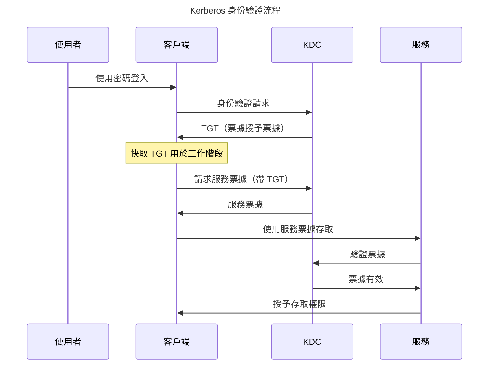

Kerberos 解決了分散式運算中的一個基本問題：如何在不傳送密碼的情況下跨網路驗證使用者身分。作為 Project Athena 的一部分，該協定由 MIT 在 1980 年代開發，引入了基於票據的身份驗證，至今仍是企業網路安全的基礎。

該協定的名字來自希臘神話——Kerberos（Cerberus），守衛冥界的三頭犬。三個頭代表客戶端、伺服器和金鑰分發中心（KDC），它們共同保護身份驗證的安全。這個隱喻抓住了協定的本質：多方合作保護存取。

## Kerberos 解決的問題

在 Kerberos 之前，網路身份驗證面臨關鍵挑戰：

!!!error "🚫 Kerberos 之前的身份驗證問題"
    **密碼傳輸**
    - 密碼透過網路傳送
    - 易受竊聽攻擊
    - 網路嗅探暴露憑證
    - 無法防止重放攻擊
    
    **可擴展性問題**
    - 每個服務都需要密碼驗證
    - 使用者重複進行身份驗證
    - 每個伺服器上都有密碼資料庫
    - 同步噩夢
    
    **安全弱點**
    - 沒有相互身份驗證
    - 伺服器無法驗證客戶端
    - 客戶端無法驗證伺服器
    - 可能發生中間人攻擊

早期網路使用簡單的密碼身份驗證。當你存取檔案伺服器時，你透過網路傳送密碼。任何監控網路流量的人都可以捕獲密碼。每個服務維護自己的密碼資料庫，造成同步問題。使用者分別向每個服務進行身份驗證，造成摩擦和安全缺口。

## Kerberos 核心概念

Kerberos 引入了革命性的概念，改變了網路身份驗證：

### 基於票據的身份驗證

!!!anote "🎫 Kerberos 票據"
    **票據授予票據（TGT）**
    - 初始身份驗證後頒發
    - 向 KDC 證明使用者身分
    - 在工作階段期間有效（通常 10 小時）
    - 用於請求服務票據
    
    **服務票據**
    - 授予對特定服務的存取權限
    - 包含使用者身分和權限
    - 時間限制（通常 5 分鐘）
    - 使用服務的金鑰加密
    
    **主要優勢**
    - 不透過網路傳送密碼
    - 每個工作階段只需一次身份驗證
    - 時間限制的存取
    - 加密安全

票據是加密的憑證，可以在不暴露密碼的情況下證明身分。當你進行身份驗證時，你會收到 TGT。這張票據在工作階段期間向 KDC 證明你的身分。當你需要存取服務時，你向 KDC 出示 TGT，KDC 會頒發服務票據。你向服務出示服務票據，服務驗證它並授予存取權限。

### 金鑰分發中心（KDC）

KDC 是使 Kerberos 運作的可信第三方：

!!!anote "🔑 KDC 元件"
    **身份驗證伺服器（AS）**
    - 處理初始身份驗證
    - 驗證使用者憑證
    - 頒發票據授予票據
    - 使用者的第一個接觸點
    
    **票據授予伺服器（TGS）**
    - 頒發服務票據
    - 驗證 TGT
    - 管理票據生命週期
    - 處理票據續訂
    
    **資料庫**
    - 儲存使用者憑證
    - 維護服務金鑰
    - 追蹤票據狀態
    - 執行安全政策

KDC 維護所有使用者和服務的金鑰。當你進行身份驗證時，AS 驗證你的憑證並頒發 TGT。當你需要服務存取時，TGS 驗證你的 TGT 並頒發服務票據。服務使用與 KDC 共享的金鑰驗證票據。

### 對稱金鑰加密

Kerberos 使用對稱金鑰加密以提高效率：

!!!anote "🔐 Kerberos 加密"
    **共享金鑰**
    - 每個使用者都有金鑰（從密碼派生）
    - 每個服務都有金鑰
    - KDC 知道所有金鑰
    - 金鑰從不傳輸
    
    **加密**
    - TGT 使用使用者的金鑰加密
    - 服務票據使用服務的金鑰加密
    - 認證器證明擁有權
    - 時間戳防止重放
    
    **安全屬性**
    - 相互身份驗證
    - 訊息完整性
    - 重放保護
    - 前向保密（適當設定）

對稱金鑰加密比公開金鑰加密更快，使 Kerberos 對大量身份驗證高效。KDC 使用適當的金鑰加密票據。只有預期的接收者才能解密它們。時間戳和隨機數防止重放攻擊。

## Kerberos 身份驗證流程

理解身份驗證流程揭示了 Kerberos 如何實現安全、高效的身份驗證：

### 分步身份驗證

!!!anote "📋 Kerberos 身份驗證步驟"
    **1. 初始身份驗證（AS 交換）**
    - 使用者輸入密碼
    - 客戶端從密碼派生加密金鑰
    - 客戶端向 AS 傳送身份驗證請求
    - AS 驗證憑證
    - AS 頒發使用使用者金鑰加密的 TGT
    - 客戶端解密 TGT（證明密碼知識）
    
    **2. 服務票據請求（TGS 交換）**
    - 客戶端需要存取服務
    - 客戶端向 TGS 傳送 TGT
    - TGS 驗證 TGT
    - TGS 頒發服務票據
    - 服務票據使用服務的金鑰加密
    
    **3. 服務存取（AP 交換）**
    - 客戶端向服務傳送服務票據
    - 服務使用其金鑰解密票據
    - 服務驗證票據內容
    - 服務授予存取權限
    - 可選：服務向客戶端進行身份驗證（相互認證）

這個流程的美妙之處在於密碼從不透過網路傳輸。使用者的密碼僅在本機用於解密 TGT。所有後續身份驗證都使用票據。使用者每個工作階段只需驗證一次，然後無縫存取多個服務。

### 票據內容

票據包含啟用安全身份驗證的特定資訊：

!!!anote "📄 票據結構"
    **TGT 內容**
    - 使用者主體名稱
    - TGS 工作階段金鑰
    - 票據生命週期
    - 授權資料
    - 使用 KDC 的金鑰加密
    
    **服務票據內容**
    - 使用者主體名稱
    - 服務主體名稱
    - 服務的工作階段金鑰
    - 票據生命週期
    - 授權資料
    - 使用服務的金鑰加密
    
    **認證器**
    - 使用者主體名稱
    - 時間戳
    - 使用工作階段金鑰加密
    - 證明票據擁有權
    - 防止重放攻擊

票據對客戶端是不透明的——它們無法讀取內容。只有預期的接收者（KDC 或服務）才能解密票據。認證器證明客戶端擁有工作階段金鑰，防止票據被盜。

## Windows 中的 Kerberos

Microsoft 採用 Kerberos 作為 Windows 2000 及更高版本的預設身份驗證協定：

### Active Directory 整合

!!!anote "🪟 Active Directory 中的 Kerberos"
    **實作**
    - Active Directory 作為 KDC
    - 網域控制器執行 KDC 服務
    - 使用者帳戶儲存在 AD 中
    - 服務的服務主體名稱（SPN）
    - Kerberos 設定的群組原則
    
    **增強功能**
    - 票據中的授權資料（PAC）
    - 約束委派
    - 協定轉換
    - 基於宣告的身份驗證
    - 複合身份驗證
    
    **相容性**
    - 舊版系統的 NTLM 回退
    - 樹系的跨網域信任
    - MIT Kerberos 互通性
    - Unix/Linux 整合

Active Directory 使用 Microsoft 特定的擴充實作 Kerberos。特權屬性憑證（PAC）包含授權資料——群組成員身分和特權。這使得無需額外的目錄查詢即可進行高效授權。

### Windows 身份驗證體驗

Windows 整合身份驗證提供無縫 SSO：

!!!success "✅ Windows SSO 體驗"
    **桌面登入**
    - 使用者登入 Windows 工作站
    - Kerberos 身份驗證到網域控制器
    - TGT 快取在記憶體中
    - 有效期 10 小時（預設）
    
    **無縫存取**
    - 存取檔案共享——無需額外登入
    - 存取內網網站——自動身份驗證
    - 存取桌面應用程式——透明 SSO
    - 存取資料庫——整合安全
    
    **使用者體驗**
    - 每天只需輸入一次密碼
    - 無額外提示
    - 對使用者透明
    - 跨網域運作

這種無縫體驗為 SSO 設定了使用者期望。員工早上進行一次身份驗證，然後存取所有企業資源，無需額外登入。這之所以有效，是因為環境受控——加入網域的裝置、企業網路、受信任的服務。

## SPNEGO：Web 的 Kerberos

SPNEGO（簡單和受保護的 GSSAPI 協商機制）將 Kerberos 擴展到 Web 瀏覽器：

### SPNEGO 運作原理

!!!anote "🌐 SPNEGO 協定"
    **協商**
    - 瀏覽器請求受保護的資源
    - 伺服器回應：WWW-Authenticate: Negotiate
    - 瀏覽器識別 Negotiate 標頭
    - 瀏覽器啟動 SPNEGO
    
    **Kerberos 交換**
    - 瀏覽器從 KDC 請求服務票據
    - 瀏覽器在 Authorization 標頭中傳送票據
    - 伺服器驗證票據
    - 伺服器授予存取權限
    
    **要求**
    - 加入網域的工作站
    - 啟用 Kerberos 的瀏覽器（IE、Chrome、Firefox）
    - 內網區域中的伺服器（IE）或受信任的站點
    - 伺服器上的正確 SPN 設定

SPNEGO 使內網 Web 應用程式能夠使用 Windows 身份驗證。員工存取公司入口網站時不會看到登入頁面——瀏覽器使用他們的 Windows 憑證自動進行身份驗證。

### SPNEGO 設定

正確的設定對 SPNEGO 至關重要：

!!!warning "⚠️ SPNEGO 設定要求"
    **伺服器設定**
    - 註冊服務主體名稱（SPN）
    - 在 IIS 中啟用 Windows 身份驗證
    - 停用匿名身份驗證
    - 如果需要，設定 Kerberos 委派
    
    **客戶端設定**
    - 將站點新增到內網區域（IE）
    - 啟用整合 Windows 身份驗證
    - 為 Chrome/Firefox 設定受信任的站點
    - 確保 DNS 解析運作
    
    **常見問題**
    - 缺少或重複的 SPN
    - DNS 設定不正確
    - 瀏覽器未設定
    - Kerberos 委派未啟用

SPN 註冊至關重要。SPN 將服務 URL 對應到服務帳戶。沒有正確的 SPN 註冊，Kerberos 身份驗證失敗並回退到 NTLM。

## Kerberos 安全性

Kerberos 提供強大的安全性，但需要正確實作：

### 安全屬性

!!!success "✅ Kerberos 安全優勢"
    **身份驗證**
    - 相互身份驗證（可選）
    - 強加密
    - 網路上沒有密碼
    - 重放保護
    
    **授權**
    - 票據包含授權資料
    - PAC 中的群組成員身分
    - 高效的授權檢查
    - 集中政策執行
    
    **完整性**
    - 票據加密簽章
    - 偵測到竄改
    - 訊息完整性的工作階段金鑰
    - 時間戳防止重放

Kerberos 提供相互身份驗證——客戶端可以驗證伺服器，防止中間人攻擊。票據包含授權資料，實現高效的存取控制。加密簽章確保完整性。

### 安全考量

Kerberos 並不完美——正確的實作至關重要：

!!!warning "⚠️ Kerberos 安全考量"
    **票據被盜**
    - 票據儲存在記憶體中
    - 可能發生傳遞票據攻擊
    - Mimikatz 可以提取票據
    - 緩解：Credential Guard、短生命週期
    
    **KDC 被攻破**
    - KDC 知道所有金鑰
    - 單點故障
    - 如果被攻破，黃金票據攻擊
    - 緩解：保護 KDC、監控存取
    
    **時間同步**
    - Kerberos 需要同步的時鐘
    - 預設容差：5 分鐘
    - 時鐘偏差破壞身份驗證
    - 緩解：NTP、監控時間漂移
    
    **加密弱點**
    - 舊版加密類型（DES、RC4）弱
    - 建議 AES
    - 可能發生降級攻擊
    - 緩解：停用弱加密

傳遞票據攻擊利用票據被盜。攻擊者從記憶體中提取票據並重用它們。Windows 10+ 中的 Credential Guard 可以防止這種情況。黃金票據攻擊利用 KDC 被攻破——攻擊者偽造具有任意特權的票據。

## Kerberos 限制

儘管有其優勢，Kerberos 仍有限制：

!!!error "🚫 Kerberos 限制"
    **網路要求**
    - 需要與 KDC 的網路連線
    - 如果 KDC 不可達則失敗
    - 不適合面向網際網路的應用
    - 專為受信任的網路設計
    
    **時間同步**
    - 嚴格的時間要求
    - 時鐘偏差破壞身份驗證
    - 需要 NTP 基礎設施
    - 故障排除複雜性
    
    **複雜性**
    - 複雜的協定
    - 難以故障排除
    - SPN 設定錯誤常見
    - 委派設定棘手
    
    **行動裝置和雲端**
    - 專為企業網路設計
    - 行動裝置支援差
    - 雲端整合挑戰
    - 遠端存取需要 VPN

Kerberos 在企業網路內運作良好，但在網路外遇到困難。遠端員工需要 VPN 存取。行動裝置支援有限。雲端應用程式無法輕鬆與本機 KDC 整合。

## 何時使用 Kerberos

Kerberos 在特定環境中表現出色：

!!!tip "🎯 Kerberos 使用案例"
    **理想用於：**
    - 企業內網
    - Windows 網域環境
    - 桌面應用程式
    - 檔案共享和資料庫
    - 大量身份驗證
    - 受信任的網路環境
    
    **不理想用於：**
    - 面向網際網路的應用程式
    - 行動應用程式
    - 雲原生架構
    - 跨組織存取
    - 不受信任的網路
    - 異質環境

一家擁有 10,000 名員工的大型公司，員工在 Windows 工作站上存取檔案共享、內網站點和桌面應用程式——非常適合 Kerberos。一家建構雲原生 SaaS 應用程式的新創公司——改用 OIDC。

## 結論

Kerberos 透過解決密碼傳輸問題革新了網路身份驗證。基於票據的身份驗證在企業網路內實現了安全、高效的 SSO。該協定的設計——可信的 KDC、對稱金鑰加密、時間限制的票據——提供了強大的安全屬性。

Microsoft 在 Active Directory 中採用 Kerberos 使其成為企業身份驗證的事實標準。Windows 整合身份驗證提供了設定使用者期望的無縫 SSO。SPNEGO 將 Kerberos 擴展到 Web 應用程式，實現了內網 SSO。

儘管有其優勢，Kerberos 仍有限制。它需要與 KDC 的網路連線、嚴格的時間同步和複雜的設定。它在企業網路內運作良好，但在行動裝置、雲端應用程式和面向網際網路的服務方面遇到困難。

像 SAML 和 OIDC 這樣的現代身份驗證協定解決了 Kerberos 在 Web 和雲端應用程式方面的限制。但在企業網路內，Kerberos 仍然是黃金標準。理解 Kerberos 提供了對適用於所有 SSO 協定的身份驗證基礎的洞察。

三頭犬仍然守衛著企業——並將在未來幾年繼續如此。
