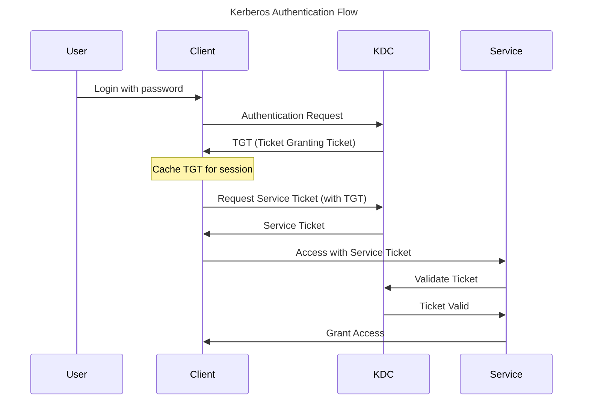

Kerberos solved a fundamental problem in distributed computing: how to authenticate users across a network without sending passwords. Developed at MIT in the 1980s as part of Project Athena, this protocol introduced ticket-based authentication that remains the foundation of enterprise network security today.

The protocol's name comes from Greek mythology—Kerberos (Cerberus), the three-headed dog guarding the underworld. The three heads represent the client, the server, and the Key Distribution Center (KDC), all working together to secure authentication. This metaphor captures the protocol's essence: multiple parties cooperating to protect access.

## The Problem Kerberos Solved

Before Kerberos, network authentication faced critical challenges:

!!!error "🚫 Pre-Kerberos Authentication Problems"
    **Password Transmission**
    - Passwords sent over network
    - Vulnerable to eavesdropping
    - Network sniffing exposes credentials
    - No protection against replay attacks
    
    **Scalability Issues**
    - Each service needs password verification
    - Users authenticate repeatedly
    - Password databases on every server
    - Synchronization nightmares
    
    **Security Weaknesses**
    - No mutual authentication
    - Servers can't verify clients
    - Clients can't verify servers
    - Man-in-the-middle attacks possible

Early networks used simple password authentication. When you accessed a file server, you sent your password over the network. Anyone monitoring network traffic could capture passwords. Each service maintained its own password database, creating synchronization problems. Users authenticated separately to each service, creating friction and security gaps.

## Kerberos Core Concepts

Kerberos introduced revolutionary concepts that transformed network authentication:

### Ticket-Based Authentication

!!!anote "🎫 Kerberos Tickets"
    **Ticket Granting Ticket (TGT)**
    - Issued after initial authentication
    - Proves user identity to KDC
    - Valid for session duration (typically 10 hours)
    - Used to request service tickets
    
    **Service Ticket**
    - Grants access to specific service
    - Contains user identity and permissions
    - Time-limited (typically 5 minutes)
    - Encrypted with service's secret key
    
    **Key Benefits**
    - No passwords sent over network
    - Single authentication per session
    - Time-limited access
    - Cryptographically secure

Tickets are encrypted credentials that prove identity without exposing passwords. When you authenticate, you receive a TGT. This ticket proves your identity to the KDC for the session. When you need to access a service, you present your TGT to the KDC, which issues a service ticket. You present the service ticket to the service, which validates it and grants access.

### Key Distribution Center (KDC)

The KDC is the trusted third party that makes Kerberos work:

!!!anote "🔑 KDC Components"
    **Authentication Server (AS)**
    - Handles initial authentication
    - Verifies user credentials
    - Issues Ticket Granting Tickets
    - First contact point for users
    
    **Ticket Granting Server (TGS)**
    - Issues service tickets
    - Validates TGTs
    - Manages ticket lifecycle
    - Handles ticket renewal
    
    **Database**
    - Stores user credentials
    - Maintains service keys
    - Tracks ticket status
    - Enforces security policies

The KDC maintains secret keys for all users and services. When you authenticate, the AS verifies your credentials and issues a TGT. When you need service access, the TGS validates your TGT and issues a service ticket. The service validates the ticket using its secret key shared with the KDC.

### Symmetric Key Cryptography

Kerberos uses symmetric key cryptography for efficiency:

!!!anote "🔐 Kerberos Cryptography"
    **Shared Secrets**
    - Each user has secret key (derived from password)
    - Each service has secret key
    - KDC knows all secret keys
    - Keys never transmitted
    
    **Encryption**
    - TGT encrypted with user's key
    - Service ticket encrypted with service's key
    - Authenticators prove possession
    - Timestamps prevent replay
    
    **Security Properties**
    - Mutual authentication
    - Message integrity
    - Replay protection
    - Forward secrecy (with proper configuration)

Symmetric key cryptography is faster than public key cryptography, making Kerberos efficient for high-volume authentication. The KDC encrypts tickets with the appropriate keys. Only the intended recipient can decrypt them. Timestamps and nonces prevent replay attacks.

## Kerberos Authentication Flow

Understanding the authentication flow reveals how Kerberos achieves secure, efficient authentication:

### Step-by-Step Authentication

!!!anote "📋 Kerberos Authentication Steps"
    **1. Initial Authentication (AS Exchange)**
    - User enters password
    - Client derives encryption key from password
    - Client sends authentication request to AS
    - AS verifies credentials
    - AS issues TGT encrypted with user's key
    - Client decrypts TGT (proves password knowledge)
    
    **2. Service Ticket Request (TGS Exchange)**
    - Client needs to access service
    - Client sends TGT to TGS
    - TGS validates TGT
    - TGS issues service ticket
    - Service ticket encrypted with service's key
    
    **3. Service Access (AP Exchange)**
    - Client sends service ticket to service
    - Service decrypts ticket with its key
    - Service validates ticket contents
    - Service grants access
    - Optional: Service authenticates to client (mutual auth)

The beauty of this flow is that passwords never travel over the network. The user's password is only used locally to decrypt the TGT. All subsequent authentication uses tickets. The user authenticates once per session, then seamlessly accesses multiple services.

### Ticket Contents

Tickets contain specific information that enables secure authentication:

!!!anote "📄 Ticket Structure"
    **TGT Contents**
    - User principal name
    - TGS session key
    - Ticket lifetime
    - Authorization data
    - Encrypted with KDC's key
    
    **Service Ticket Contents**
    - User principal name
    - Service principal name
    - Session key for service
    - Ticket lifetime
    - Authorization data
    - Encrypted with service's key
    
    **Authenticator**
    - User principal name
    - Timestamp
    - Encrypted with session key
    - Proves ticket possession
    - Prevents replay attacks

Tickets are opaque to clients—they can't read the contents. Only the intended recipient (KDC or service) can decrypt tickets. Authenticators prove that the client possesses the session key, preventing ticket theft.

## Kerberos in Windows

Microsoft adopted Kerberos as the default authentication protocol for Windows 2000 and later:

### Active Directory Integration

!!!anote "🪟 Kerberos in Active Directory"
    **Implementation**
    - Active Directory as KDC
    - Domain controllers run KDC service
    - User accounts stored in AD
    - Service Principal Names (SPNs) for services
    - Group Policy for Kerberos settings
    
    **Enhancements**
    - Authorization data in tickets (PAC)
    - Constrained delegation
    - Protocol transition
    - Claims-based authentication
    - Compound authentication
    
    **Compatibility**
    - NTLM fallback for legacy systems
    - Cross-realm trust for forests
    - MIT Kerberos interoperability
    - Unix/Linux integration

Active Directory implements Kerberos with Microsoft-specific extensions. The Privilege Attribute Certificate (PAC) contains authorization data—group memberships and privileges. This enables efficient authorization without additional directory lookups.

### Windows Authentication Experience

Windows Integrated Authentication provides seamless SSO:

!!!success "✅ Windows SSO Experience"
    **Desktop Login**
    - User logs into Windows workstation
    - Kerberos authentication to domain controller
    - TGT cached in memory
    - Valid for 10 hours (default)
    
    **Seamless Access**
    - Access file shares—no additional login
    - Access intranet websites—automatic authentication
    - Access desktop applications—transparent SSO
    - Access databases—integrated security
    
    **User Experience**
    - Single password entry per day
    - No additional prompts
    - Transparent to users
    - Works across domain

This seamless experience set user expectations for SSO. Employees authenticate once in the morning, then access all corporate resources without additional logins. This works because the environment is controlled—domain-joined devices, corporate network, trusted services.

## SPNEGO: Kerberos for Web

SPNEGO (Simple and Protected GSSAPI Negotiation Mechanism) extends Kerberos to web browsers:

### How SPNEGO Works

!!!anote "🌐 SPNEGO Protocol"
    **Negotiation**
    - Browser requests protected resource
    - Server responds: WWW-Authenticate: Negotiate
    - Browser recognizes Negotiate header
    - Browser initiates SPNEGO
    
    **Kerberos Exchange**
    - Browser requests service ticket from KDC
    - Browser sends ticket in Authorization header
    - Server validates ticket
    - Server grants access
    
    **Requirements**
    - Domain-joined workstation
    - Kerberos-enabled browser (IE, Chrome, Firefox)
    - Server in Intranet zone (IE) or trusted sites
    - Proper SPN configuration on server

SPNEGO enables intranet web applications to use Windows authentication. An employee accessing the company portal doesn't see a login page—the browser automatically authenticates using their Windows credentials.

### SPNEGO Configuration

Proper configuration is critical for SPNEGO:

!!!warning "⚠️ SPNEGO Configuration Requirements"
    **Server Configuration**
    - Register Service Principal Name (SPN)
    - Enable Windows Authentication in IIS
    - Disable anonymous authentication
    - Configure Kerberos delegation if needed
    
    **Client Configuration**
    - Add site to Intranet zone (IE)
    - Enable Integrated Windows Authentication
    - Configure trusted sites for Chrome/Firefox
    - Ensure DNS resolution works
    
    **Common Issues**
    - Missing or duplicate SPNs
    - Incorrect DNS configuration
    - Browser not configured
    - Kerberos delegation not enabled

SPN registration is critical. The SPN maps the service URL to the service account. Without proper SPN registration, Kerberos authentication fails and falls back to NTLM.

## Kerberos Security

Kerberos provides strong security but requires proper implementation:

### Security Properties

!!!success "✅ Kerberos Security Benefits"
    **Authentication**
    - Mutual authentication (optional)
    - Strong cryptography
    - No passwords on network
    - Replay protection
    
    **Authorization**
    - Ticket contains authorization data
    - Group memberships in PAC
    - Efficient authorization checks
    - Centralized policy enforcement
    
    **Integrity**
    - Tickets cryptographically signed
    - Tampering detected
    - Session keys for message integrity
    - Timestamps prevent replay

Kerberos provides mutual authentication—clients can verify servers, preventing man-in-the-middle attacks. Tickets contain authorization data, enabling efficient access control. Cryptographic signatures ensure integrity.

### Security Considerations

Kerberos isn't perfect—proper implementation is critical:

!!!warning "⚠️ Kerberos Security Considerations"
    **Ticket Theft**
    - Tickets stored in memory
    - Pass-the-ticket attacks possible
    - Mimikatz can extract tickets
    - Mitigation: Credential Guard, short lifetimes
    
    **KDC Compromise**
    - KDC knows all secrets
    - Single point of failure
    - Golden ticket attacks if compromised
    - Mitigation: Secure KDC, monitor access
    
    **Time Synchronization**
    - Kerberos requires synchronized clocks
    - Default tolerance: 5 minutes
    - Clock skew breaks authentication
    - Mitigation: NTP, monitor time drift
    
    **Encryption Weaknesses**
    - Legacy encryption types (DES, RC4) weak
    - AES recommended
    - Downgrade attacks possible
    - Mitigation: Disable weak encryption

Pass-the-ticket attacks exploit ticket theft. Attackers extract tickets from memory and reuse them. Credential Guard in Windows 10+ protects against this. Golden ticket attacks exploit KDC compromise—attackers forge tickets with arbitrary privileges.

## Kerberos Limitations

Despite its strengths, Kerberos has limitations:

!!!error "🚫 Kerberos Limitations"
    **Network Requirements**
    - Requires network connectivity to KDC
    - Fails if KDC unreachable
    - Not suitable for internet-facing apps
    - Designed for trusted networks
    
    **Time Synchronization**
    - Strict time requirements
    - Clock skew breaks authentication
    - Requires NTP infrastructure
    - Troubleshooting complexity
    
    **Complexity**
    - Complex protocol
    - Difficult to troubleshoot
    - SPN configuration errors common
    - Delegation configuration tricky
    
    **Mobile and Cloud**
    - Designed for corporate networks
    - Poor mobile device support
    - Cloud integration challenges
    - VPN required for remote access

Kerberos works beautifully within corporate networks but struggles outside them. Remote employees need VPN access. Mobile devices have limited support. Cloud applications can't easily integrate with on-premises KDC.

## When to Use Kerberos

Kerberos excels in specific contexts:

!!!tip "🎯 Kerberos Use Cases"
    **Ideal For:**
    - Corporate intranets
    - Windows domain environments
    - Desktop applications
    - File shares and databases
    - High-volume authentication
    - Trusted network environments
    
    **Not Ideal For:**
    - Internet-facing applications
    - Mobile applications
    - Cloud-native architectures
    - Cross-organizational access
    - Untrusted networks
    - Heterogeneous environments

A large corporation with 10,000 employees on Windows workstations accessing file shares, intranet sites, and desktop applications—perfect for Kerberos. A startup building a cloud-native SaaS application—use OIDC instead.

## Conclusion

Kerberos revolutionized network authentication by solving the password transmission problem. Ticket-based authentication enables secure, efficient SSO within corporate networks. The protocol's design—trusted KDC, symmetric key cryptography, time-limited tickets—provides strong security properties.

Microsoft's adoption of Kerberos in Active Directory made it the de facto standard for enterprise authentication. Windows Integrated Authentication provides seamless SSO that set user expectations. SPNEGO extended Kerberos to web applications, enabling intranet SSO.

Despite its strengths, Kerberos has limitations. It requires network connectivity to the KDC, strict time synchronization, and complex configuration. It works beautifully within corporate networks but struggles with mobile devices, cloud applications, and internet-facing services.

Modern authentication protocols like SAML and OIDC address Kerberos's limitations for web and cloud applications. But within corporate networks, Kerberos remains the gold standard. Understanding Kerberos provides insight into authentication fundamentals that apply to all SSO protocols.

The three-headed dog still guards the enterprise—and will for years to come.
