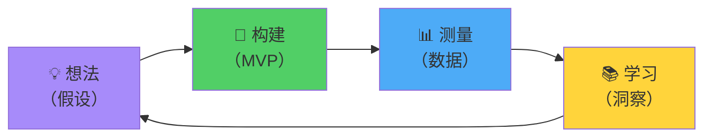

敏捷软件开发已成为现代软件工程的主流方法论。各地的团队都声称自己在"实践敏捷"，但许多团队的实施方式让人感觉更像是官僚主义而非敏捷性。每日站会变成了状态汇报，冲刺变成了小型瀑布，回顾会议没有产生任何有意义的改变。更快交付、更好协作和适应性规划的承诺往往让位于挫败感和幻灭感。

本文将深入探讨超越仪式和流行语的敏捷。我们将剖析使敏捷发挥作用的核心原则，识别常见的实施失败，并理解真正具有适应性的团队与那些仅仅走过场的团队之间的区别。通过借鉴初创公司和企业的实际经验，我们揭示敏捷成功或失败的原因——以及如何打造真正体现敏捷性的团队。

## 理解敏捷原则

在深入实践和陷阱之前，理解基础原则至关重要。敏捷不是一套仪式——它是关于软件开发如何最有效运作的思维方式。

### 敏捷宣言：不仅仅是文字

敏捷宣言写于2001年，确立了四个至今仍然相关的核心价值观：

!!!anote "📜 敏捷宣言价值观"
    **个体和互动 高于 流程和工具**
    - 人解决问题，而非流程
    - 沟通比文档更重要
    - 协作胜过僵化的程序
    - 赋能团队做出决策
    
    **工作的软件 高于 详尽的文档**
    - 尽早且频繁地交付价值
    - 能运行的代码胜过不能运行的规范
    - 文档支持开发，而非取代开发
    - 通过工作的软件验证假设
    
    **客户合作 高于 合同谈判**
    - 伙伴关系，而非对抗关系
    - 对目标的共同理解
    - 灵活适应不断变化的需求
    - 持续的反馈循环
    
    **响应变化 高于 遵循计划**
    - 计划是假设，而非承诺
    - 基于学习进行调整
    - 拥抱不确定性
    - 交付的价值比遵守计划更重要

这些价值观并不是拒绝流程、文档、合同或计划——它们确立了优先级。当被迫做出选择时，敏捷团队优先考虑左侧的项目。

### 十二条原则：实践指导

宣言的十二条原则为实施提供了具体指导：

!!!tip "🎯 关键敏捷原则"
    **持续交付价值**
    - 通过尽早和持续交付来满足客户
    - 频繁交付工作的软件（以周计，而非月）
    - 工作的软件是进度的首要度量标准
    
    **拥抱变化**
    - 欢迎需求变化，即使在开发后期
    - 敏捷流程利用变化获得竞争优势
    - 基于反馈和学习调整计划
    
    **每日协作**
    - 业务人员和开发人员每天一起工作
    - 面对面交流最有效
    - 围绕有动力的个人构建项目
    
    **保持可持续的节奏**
    - 无限期地保持可持续的开发节奏
    - 避免倦怠和技术债务
    - 质量和工艺很重要
    
    **反思和适应**
    - 定期反思有效性
    - 相应地调整和调整行为
    - 持续改进的心态

当特定实践发生冲突或上下文需要调整时，这些原则指导决策。

## 敏捷框架：Scrum、看板及其他

敏捷是一种哲学，而非处方。各种框架以不同方式实现敏捷原则：

### Scrum：时间盒迭代

Scrum将工作组织成固定长度的冲刺，并定义了相应的仪式：

!!!anote "🔄 Scrum框架"
    **角色**
    - 产品负责人：定义要构建什么，优先排序工作
    - Scrum Master：促进流程，移除障碍
    - 开发团队：自组织、跨职能
    
    **仪式**
    - 冲刺计划：定义冲刺目标并选择工作
    - 每日站会：同步团队，识别阻碍
    - 冲刺评审：向利益相关者演示完成的工作
    - 冲刺回顾：反思流程，识别改进点
    
    **工件**
    - 产品待办列表：功能和工作的优先级列表
    - 冲刺待办列表：当前冲刺承诺的工作
    - 增量：冲刺结束时可能发布的产品
    
    **特征**
    - 固定的冲刺长度（通常为2周）
    - 对冲刺范围的承诺
    - 跨职能团队
    - 强调可预测性

Scrum适用于需要结构和可预测性的团队，具有稳定的团队组成和明确的产品所有权。

### 看板：持续流动

看板专注于可视化工作和限制在制品：

!!!anote "📊 看板框架"
    **核心实践**
    - 在看板上可视化工作流
    - 限制每个阶段的在制品（WIP）
    - 管理流动，而非迭代
    - 明确流程策略
    - 实施反馈循环
    - 协作改进，实验性演进
    
    **特征**
    - 没有固定迭代
    - 拉动式系统
    - 持续交付
    - 关注周期时间和吞吐量
    - 灵活的范围和优先级
    
    **最适用场景**
    - 支持和维护工作
    - 不可预测的传入请求
    - 需要灵活性的团队
    - 持续部署环境

当工作不可预测地到来或固定迭代造成人为约束时，看板表现出色。

### 混合方法：Scrumban及其他

许多团队结合多个框架的元素：

!!!tip "🔀 混合方法"
    **Scrumban**
    - Scrum的仪式与看板的流动
    - 用于计划的冲刺，用于执行的持续交付
    - 冲刺上下文中的WIP限制
    
    **Shape Up（Basecamp）**
    - 6周周期加2周冷却期
    - 基于意愿的计划（时间预算，而非估算）
    - 拥有完全自主权的小团队
    - 没有每日站会或冲刺仪式
    
    **持续交付**
    - 没有冲刺或迭代
    - 每天多次部署到生产环境
    - 未完成工作的功能开关
    - 指标驱动的开发

最佳框架取决于团队上下文、产品特征和组织文化。教条式地坚持任何单一框架往往会产生更多问题而非解决问题。

## 最小可行产品：从小开始，快速学习

最小可行产品（MVP）是一个核心敏捷概念，但经常被误解和误用：

### MVP的真正含义

MVP是能够交付价值并实现学习的产品的最小版本：

!!!anote "🎯 MVP定义"
    **不仅仅是最少功能**
    - 解决真实问题的最小方案
    - 向真实用户交付实际价值
    - 实现经过验证的学习
    - 测试核心假设
    
    **三个组成部分**
    - 最小：尽可能小的范围
    - 可行：实际工作并交付价值
    - 产品：用户可以实际使用的东西
    
    **目的**
    - 验证产品市场契合度
    - 从真实用户行为中学习
    - 最小化在错误假设上的浪费
    - 基于反馈进行迭代

MVP不是快速构建一个糟糕的产品——而是在大量投资之前学习要构建什么。

### MVP的起源：精益创业与敏捷的结合

理解MVP的来源可以阐明它与敏捷和Scrum的关系：

!!!anote "🔗 方法论家族树"
    **精益制造（丰田，1950年代）**
    - 消除浪费
    - 持续改进（改善）
    - 准时制生产
    - 尊重人
    - 所有现代方法论的基础
    
    **敏捷软件开发（2001）**
    - 将精益原则应用于软件
    - 迭代开发
    - 客户协作
    - 响应变化
    - 哲学，而非具体实践
    
    **Scrum（1990年代，2000年代正式化）**
    - 敏捷的具体实现
    - 定义角色、仪式、工件
    - 时间盒冲刺
    - 执行敏捷原则的框架
    
    **精益创业（2008-2011）**
    - 将精益应用于创业
    - 构建-测量-学习循环
    - 经过验证的学习
    - MVP作为核心工具
    - 关注产品市场契合度

### 它们如何协同工作

这些方法论相互补充：

!!!tip "🎯 关系"
    **精益提供"为什么"**
    - 消除浪费（构建错误的东西）
    - 在投资前验证假设
    - 持续改进心态
    - 数据驱动决策
    
    **敏捷提供"如何"（哲学）**
    - 迭代开发
    - 拥抱变化
    - 持续交付价值
    - 与客户协作
    
    **Scrum提供"如何"（框架）**
    - 用于时间盒的冲刺
    - 用于协调的仪式
    - 用于问责的角色
    - 用于透明度的工件
    
    **MVP提供"什么"**
    - 最小可测试产品
    - 关注学习
    - 在扩展前验证
    - 告知接下来要构建什么

### MVP在Scrum中：实践整合

MVP思维自然地与Scrum整合：

!!!success "✅ MVP + Scrum实践"
    **冲刺0：定义MVP**
    - 识别风险最高的假设
    - 定义最小可行范围
    - 建立成功指标
    - 计划学习实验
    
    **冲刺1-N：增量构建MVP**
    - 每个冲刺交付工作的软件
    - 可能发布的增量 = 迷你MVP
    - 冲刺评审收集反馈
    - 回顾改进流程
    
    **MVP后：基于学习迭代**
    - 测量实际用户行为
    - 验证或否定假设
    - 转向或坚持决策
    - 待办列表按学习优先级排序
    
    **协同效应**
    - Scrum的迭代实现快速MVP交付
    - MVP思维使冲刺专注于学习
    - 冲刺评审验证假设
    - 回顾改进产品和流程

### 构建-测量-学习循环

精益创业的核心循环在敏捷框架内运作：

!!!anote "🔄 如何映射到敏捷"
    **想法 → 产品待办列表**
    - 假设变成用户故事
    - 按风险和价值优先排序
    - 通过待办列表梳理进行细化
    
    **构建 → 冲刺执行**
    - 跨职能团队构建MVP
    - 每日站会协调工作
    - 可能发布的增量
    
    **测量 → 冲刺评审 + 分析**
    - 向利益相关者演示
    - 部署给真实用户
    - 收集使用数据和反馈
    
    **学习 → 冲刺回顾 + 计划**
    - 分析什么有效
    - 调整产品方向
    - 重新排序待办列表
    - 改进流程

### 常见混淆：MVP vs 冲刺目标

团队经常混淆MVP与冲刺交付物：

!!!warning "⚠️ 重要区别"
    **MVP（产品层面）**
    - 整个产品的最小版本
    - 测试产品市场契合度
    - 可能需要多个冲刺
    - 关于构建什么的战略决策
    
    **冲刺目标（迭代层面）**
    - 单个冲刺的目标
    - 交付工作的增量
    - 更大产品愿景的一部分
    - 关于如何构建的战术决策
    
    **关系**
    - MVP定义目的地
    - 冲刺目标是迈向它的步骤
    - 每个冲刺增量可以是一个迷你MVP
    - 两者都专注于交付价值和学习

将MVP视为产品战略，将Scrum视为执行框架。MVP告诉你要构建什么；Scrum告诉你如何迭代地构建它。

### 常见的MVP误解

许多团队误解了MVP的含义：

!!!error "🚫 MVP反模式"
    **MVP作为"勉强能用"**
    - 发布有缺陷、不完整的功能
    - 糟糕的用户体验被合理化为"MVP"
    - 技术债务被合理化为"快速行动"
    - 用户感到沮丧，不再回来
    
    **MVP作为"第一阶段"**
    - 将MVP视为预定计划的第一阶段
    - 实际上没有测试假设
    - 构建你已经决定要构建的东西
    - 错过学习机会
    
    **MVP作为"廉价版本"**
    - 在质量上偷工减料
    - 跳过基本功能
    - 产生技术债务
    - 更快地构建没人想要的东西

这些误解导致产品既不能交付价值也不能实现学习。

### 构建有效的MVP

成功的MVP平衡范围、质量和学习：

!!!success "✅ MVP最佳实践"
    **识别核心价值**
    - 你在解决什么问题？
    - 最小的有效解决方案是什么？
    - 你必须验证哪些假设？
    - 不构建就能学到什么？
    
    **质量优于范围**
    - 更少的功能，做得更好
    - 针对狭窄用例的愉悦体验
    - 技术质量实现迭代
    - 用户评判质量，而非功能数量
    
    **测量和学习**
    - 在构建前定义成功指标
    - 为学习而设计
    - 直接与用户交谈
    - 愿意转向或坚持
    
    **快速迭代**
    - 快速发布给真实用户
    - 持续收集反馈
    - 基于数据改进
    - 添加用户实际需要的功能

目标是经过验证的学习，而不仅仅是发布某些东西。

### MVP实践：Dropbox的故事

Dropbox的MVP完美地展示了这个概念。创始人Drew Houston没有先构建整个文件同步系统，而是创建了一个3分钟的视频，演示产品将如何工作。该视频在Hacker News上走红，测试版注册从5,000跃升至75,000。

!!!tip "💡 Dropbox的教训"
    **他们学到了什么**
    - 人们想要这个解决方案
    - 愿意在产品存在之前注册
    - 在不构建的情况下验证了核心假设
    - 节省了数月在错误方向上的开发
    
    **MVP是**
    - 一个视频，而非软件
    - 展示了价值主张
    - 测试了市场需求
    - 创建成本几乎为零
    
    **为什么有效**
    - 专注于学习，而非构建
    - 首先测试风险最高的假设
    - 收集了真实的用户兴趣
    - 告知接下来要构建什么

这就是MVP思维：在全面开发之前，以最小投资验证假设。

## 常见的敏捷反模式

许多团队在不理解基本原则的情况下实施敏捷实践，产生了功能失调的模式：

### 货物崇拜敏捷：没有意义的仪式

团队在不理解目的的情况下执行敏捷仪式：

!!!error "🚫 货物崇拜症状"
    **每日站会作为状态报告**
    - 每个人向Scrum Master或经理汇报
    - 没有团队协作或问题解决
    - 变成一项苦差事，而非同步工具
    - 人们等待轮到自己而不是倾听
    
    **冲刺计划作为任务分配**
    - 经理将任务分配给个人
    - 没有团队讨论或估算
    - 承诺是强加的，而非自愿的
    - 计划变成行政开销
    
    **没有行动的回顾**
    - 每个冲刺都提出相同的问题
    - 没有对改进的跟进
    - 变成抱怨会议
    - 团队对流程失去信心
    
    **故事点作为生产力指标**
    - 管理层将速度作为绩效衡量标准
    - 团队夸大估算以达到目标
    - 玩弄系统取代诚实估算
    - 速度变得毫无意义

当组织在不接受敏捷价值观的情况下采用敏捷实践时，就会出现这些模式。仪式变成了表演，而非协作工具。

### 迷你瀑布：冲刺作为阶段

团队将冲刺组织为顺序阶段而非迭代开发：

!!!warning "⚠️ 迷你瀑布模式"
    **冲刺1：需求和设计**
    - 整个冲刺都花在规范上
    - 没有交付工作的软件
    - 产生详细的设计文档
    - "我们下个冲刺开始编码"
    
    **冲刺2：实现**
    - 开发人员按规范编码
    - 还没有客户反馈
    - 假设未经验证
    - "我们下个冲刺测试"
    
    **冲刺3：测试和修复缺陷**
    - QA发现需求问题
    - 需要返工
    - 没有时间进行适当的修复
    - "我们下个冲刺部署"
    
    **问题**
    - 直到冲刺3或更晚才有工作的软件
    - 反馈延迟，变更成本高
    - 阶段更短的瀑布
    - 错过了迭代开发的要点

真正的敏捷在每个冲刺中交付工作的软件，所有活动（设计、编码、测试）都在每次迭代中进行。

### Scrum Master作为项目经理

组织将项目经理重新命名为Scrum Master，但不改变行为：

!!!error "🚫 Scrum Master反模式"
    **命令和控制**
    - 向团队成员分配任务
    - 跟踪个人生产力
    - 做出技术决策
    - 管理团队而非促进
    
    **Scrum Master应该做什么**
    - 移除阻碍团队的障碍
    - 促进仪式，而非运行它们
    - 指导团队敏捷实践
    - 保护团队免受外部干扰
    - 帮助团队自组织
    
    **区别**
    - 项目经理：管理人员和任务
    - Scrum Master：促进流程并移除障碍
    - 项目经理：做出决策
    - Scrum Master：帮助团队做出决策

Scrum Master角色需要从命令和控制到仆人式领导的根本转变。

## 现实世界的敏捷：一次创业之旅

我在一家快速成长的创业公司期间体验到了真正敏捷的力量。我们并没有完全按照Scrum手册来——我们根据自己的情况调整了实践——但我们以使我们非常高效的方式体现了敏捷原则。

### 背景：小团队，大抱负

我们的团队由五名开发人员、一名产品经理和一名设计师组成。我们在竞争激烈的市场中构建SaaS平台，在保持质量的同时竞相交付功能。传统的项目管理会让我们淹没在开销中。

!!!anote "🚀 我们的敏捷方法"
    **我们做了什么**
    - 两周冲刺，目标明确
    - 每日15分钟站会（真的是15分钟）
    - 冲刺计划：半天，协作式
    - 冲刺评审：向整个公司演示
    - 回顾：诚实、行动导向
    - 持续部署到预发布环境
    - 每周生产发布
    
    **是什么让它有效**
    - 产品经理与开发团队坐在一起
    - 设计师参与冲刺计划
    - 每个人都可以部署到生产环境
    - 没有单独的QA团队——开发人员拥有质量
    - 每天审查客户反馈
    - 每个冲刺都处理技术债务

这不是教科书式的Scrum，但它是真正的敏捷。我们根据自己的情况调整实践，同时尊重原则。

### 转折点：敏捷拯救了我们

开发六个月后，一个主要竞争对手推出了我们计划在下个季度推出的功能。我们的路线图突然看起来过时了。在传统的瀑布环境中，这会引发恐慌、重新规划和数月的延迟。

相反，我们召开了紧急冲刺计划会议。产品经理介绍了竞争威胁，并提议将下一个冲刺转向交付该功能的差异化版本。团队讨论了技术方法，识别了风险，并承诺在两周内交付。

!!!success "✅ 对危机的敏捷响应"
    **第1周**
    - 简化设计，专注于核心价值
    - 构建最小可行实现
    - 每天向产品经理和设计师演示
    - 根据反馈调整方法
    - 周末前部署到预发布环境
    
    **第2周**
    - 与精选客户进行测试版测试
    - 快速整合反馈
    - 完善UI和边缘情况
    - 按计划部署到生产环境
    - 向市场宣布功能
    
    **结果**
    - 两周内交付竞争功能
    - 我们的实现比竞争对手有更好的用户体验
    - 客户称赞我们的响应能力
    - 团队感到有能力和有能力
    - 验证了我们的敏捷方法

这次经历展示了敏捷的核心价值：响应变化而非遵循计划。我们有路线图，但我们不是它的奴隶。当市场发生变化时，我们进行了调整。

### 是什么让我们的敏捷有效

回顾那次经历，几个因素促成了我们的成功：

!!!tip "🎯 成功因素"
    **真正的协作**
    - 产品经理嵌入团队
    - 每天对话，而非正式会议
    - 对目标的共同理解
    - 信任和相互尊重
    
    **技术卓越**
    - 自动化测试带来信心
    - 持续部署降低风险
    - 代码审查保持质量
    - 主动处理技术债务
    
    **赋能团队**
    - 开发人员做出技术决策
    - 合理的变更不需要批准
    - 每个人都可以部署到生产环境
    - 所有权和问责制一致
    
    **客户关注**
    - 直接的客户反馈渠道
    - 每天审查使用指标
    - 产品决策由数据驱动
    - 愿意根据学习转向

这些因素创造了一个敏捷原则可以蓬勃发展的环境。仪式是工具，而非目标。框架服务于团队，而非相反。

## 扩展敏捷：复杂之处

敏捷对于小型、同地办公的团队效果很好。扩展到多个团队、分布式位置和大型组织会带来重大挑战：

### 协调问题

在同一产品上工作的多个团队需要协调：

!!!warning "⚠️ 扩展挑战"
    **技术依赖**
    - 团队A需要团队B的API
    - 共享代码库产生合并冲突
    - 跨团队集成测试
    - 架构决策影响多个团队
    
    **产品协调**
    - 功能跨越多个团队
    - 优先级冲突
    - 用户体验不一致
    - 跨团队重复工作
    
    **流程开销**
    - Scrum of Scrums会议
    - 跨团队计划会议
    - 依赖管理
    - 同步仪式

SAFe（规模化敏捷框架）、LeSS（大规模Scrum）和Spotify模型等扩展框架试图以不同程度的成功解决这些挑战。

### SAFe陷阱：敏捷官僚主义

SAFe是最广泛采用的扩展框架，但它经常重新引入敏捷旨在消除的官僚主义：

!!!error "🚫 SAFe反模式"
    **仪式过载**
    - PI（项目增量）计划：每10周一次的2天活动
    - Scrum of Scrums、ART同步、系统演示
    - 多层计划和协调
    - 在会议中的时间多于编码
    
    **角色激增**
    - 发布火车工程师、解决方案架构师、产品管理
    - 业务负责人、史诗负责人、系统团队
    - 通过角色重新引入层级
    - 审批减慢决策
    
    **失去敏捷性**
    - 10周的项目增量感觉像迷你瀑布
    - 难以在PI中期响应变化
    - 协调开销降低适应性
    - 流程变得比结果更重要

SAFe可以在需要结构的大型企业中工作，但它经常为了可预测性而牺牲敏捷性。

### 替代扩展方法

其他方法优先考虑自主权而非协调：

!!!tip "🔀 扩展替代方案"
    **团队自主权（Spotify模型）**
    - 小型、自主的小队
    - 通过共同使命和原则保持一致
    - 最小的跨团队依赖
    - 用于知识共享的公会
    - 用于松散协调的部落
    
    **微服务架构**
    - 技术独立性实现团队自主权
    - 每个团队拥有完整的服务
    - API合约定义交互
    - 减少协调开销
    
    **平台团队**
    - 共享基础设施和工具
    - 产品团队在平台上构建
    - 自助服务减少依赖
    - 平台团队赋能其他团队

这些方法认识到协调是昂贵的。最好是最小化依赖而非管理它们。

## 敏捷估算：争议

敏捷中的估算引发了无休止的辩论。故事点、计划扑克、无估算——每种方法都有热情的倡导者和批评者：

### 故事点：相对规模

故事点试图估算复杂性而非时间：

!!!anote "📊 故事点方法"
    **理论**
    - 估算相对复杂性，而非小时数
    - 使用斐波那契数列（1、2、3、5、8、13）
    - 计划扑克达成团队共识
    - 速度随时间出现
    - 可预测性随数据改善
    
    **现实**
    - 团队在心理上将点转换为小时
    - 管理层将速度视为生产力指标
    - 玩弄系统变得普遍
    - 估算会议消耗大量时间
    - 准确性随时间改善不多

当用于团队计划而非管理报告时，故事点有效。一旦速度成为绩效指标，系统就会崩溃。

### 无估算：激进简化

一些团队完全放弃估算：

!!!tip "🚫 无估算运动"
    **方法**
    - 将工作分解为小的、大小相似的部分
    - 计数项目，而非点数
    - 测量周期时间，而非速度
    - 关注吞吐量
    - 消除估算开销
    
    **何时有效**
    - 工作规模一致的成熟团队
    - 持续交付环境
    - 工作规模真正相似
    - 基于信任的文化
    
    **何时无效**
    - 工作复杂性高度可变
    - 需要长期规划
    - 利益相关者需要承诺
    - 团队刚开始分解工作

当有效时，无估算是解放性的，但需要在分解工作和组织信任方面的纪律。

### 务实的估算：适当规模的努力

最佳方法取决于上下文：

!!!success "✅ 估算最佳实践"
    **对于小团队**
    - 轻量级估算（T恤尺寸）
    - 专注于分解工作
    - 使用历史数据进行规划
    - 不要过度投资于精确性
    
    **对于大型组织**
    - 跨团队一致的估算方法
    - 用于容量规划的速度
    - 避免使用估算进行绩效评估
    - 接受不确定性，为其规划
    
    **通用原则**
    - 估算是猜测，而非承诺
    - 较小的工作项提高准确性
    - 做工作的团队应该估算
    - 随着学习更多而重新估算

估算的目标是更好的规划，而非虚假的精确性。投入与信息价值成比例的努力。

## 技术实践：缺失的部分

许多敏捷实施专注于流程和仪式，而忽视了技术实践。这造成了一个危险的差距：

### 为什么技术实践很重要

敏捷快速迭代的承诺需要技术卓越：

!!!error "🚫 没有技术实践的敏捷"
    **死亡螺旋**
    - 没有质量实践的快速迭代
    - 技术债务快速积累
    - 代码库变得脆弱
    - 变更需要更长时间，破坏更多
    - 尽管有敏捷流程，团队还是放慢了速度
    - 速度随时间下降
    
    **症状**
    - 害怕更改代码
    - 漫长的缺陷修复周期
    - 回归问题
    - 部署焦虑
    - "我们需要放慢速度并修复技术债务"

没有技术实践的敏捷是不可持续的。你无法在脆弱的代码库上快速迭代。

### 基本技术实践

这些实践实现可持续的敏捷开发：

!!!success "✅ 技术卓越"
    **测试驱动开发（TDD）**
    - 在代码之前编写测试
    - 确保可测试性
    - 活文档
    - 重构的信心
    
    **持续集成**
    - 每天多次集成代码
    - 自动化构建和测试
    - 对中断的快速反馈
    - 减少集成痛苦
    
    **结对编程**
    - 两个开发人员，一个工作站
    - 知识共享
    - 实时代码审查
    - 更高质量的代码
    
    **重构**
    - 持续代码改进
    - 增量处理技术债务
    - 保持代码库可维护
    - 实现未来变更
    
    **持续部署**
    - 频繁部署到生产环境
    - 小的、低风险的变更
    - 来自用户的快速反馈
    - 减少部署恐惧

这些实践不是可选的额外内容——它们对于可持续的敏捷开发至关重要。

## 衡量敏捷成功

你如何知道你的敏捷实施是否有效？传统指标经常误导：

### 虚荣指标：不应该衡量什么

这些指标看起来不错，但不能表明成功：

!!!warning "⚠️ 误导性指标"
    **速度**
    - 通过夸大估算容易被操纵
    - 跨团队毫无意义
    - 不衡量交付的价值
    - 产生不良激励
    
    **完成的故事点**
    - 与速度相同的问题
    - 鼓励数量而非质量
    - 忽略客户价值
    
    **冲刺承诺达成**
    - 团队保守承诺
    - 不鼓励雄心勃勃的目标
    - 不衡量结果

这些指标衡量活动，而非价值。它们很容易被操纵，并产生错误的激励。

### 有意义的指标：真正重要的是什么

关注结果和流动：

!!!success "✅ 有价值的指标"
    **周期时间**
    - 从开始到生产的时间
    - 表明流程效率
    - 越低通常越好
    - 跟踪随时间的改进
    
    **部署频率**
    - 你多久发布到生产环境一次
    - 表明交付价值的能力
    - 更高的频率降低风险
    
    **变更前置时间**
    - 从提交到生产的时间
    - 衡量部署管道效率
    - 实现快速反馈
    
    **变更失败率**
    - 导致问题的部署百分比
    - 表明质量和测试有效性
    - 与部署频率平衡
    
    **客户满意度**
    - NPS、CSAT或类似措施
    - 交付的实际价值
    - 最终成功指标

这些指标专注于高效可靠地向客户交付价值。

## 结论

当团队接受基本原则而不仅仅是仪式时，敏捷软件开发就会成功。敏捷宣言的价值观——个体高于流程、工作的软件高于文档、协作高于合同、响应变化高于遵循计划——为复杂情况下的决策提供指导。

框架——Scrum、看板或混合方法——是工具，而非目标。根据你的上下文选择和调整实践。小型同地办公团队需要的方法与大型分布式组织不同。初创公司的约束与企业不同。最适合你团队的敏捷实施取决于你的具体情况。

当组织在不理解原则的情况下采用敏捷实践时，就会出现常见的反模式。货物崇拜敏捷执行没有目的的仪式。迷你瀑布将冲刺组织为顺序阶段。Scrum Master变成项目经理。故事点变成生产力指标。这些模式产生官僚主义而没有敏捷性。

真正的敏捷需要技术卓越。测试驱动开发、持续集成、结对编程、重构和持续部署不是可选的——它们实现可持续的快速迭代。没有这些实践，敏捷流程会产生技术债务，最终使团队放慢到爬行。

扩展敏捷带来协调挑战。像SAFe这样的大型框架提供结构，但经常为了可预测性而牺牲敏捷性。优先考虑团队自主权和最小化依赖的替代方法通常效果更好。最佳扩展方法取决于你组织的文化和约束。

衡量敏捷成功需要关注结果，而非活动。速度和故事点是容易被操纵的虚荣指标。周期时间、部署频率、前置时间、变更失败率和客户满意度提供了关于你的敏捷实施是否交付价值的有意义的洞察。

创业经历说明了敏捷的力量：当竞争威胁出现时，我们在两周内转向并交付了差异化功能。这种响应能力来自真正的协作、技术卓越、赋能团队和客户关注——而不是完全按照Scrum手册来。

在实施敏捷之前，问问自己：我们是在接受原则还是只是采用仪式？我们是否有技术实践来维持快速迭代？我们是在衡量结果还是活动？我们是否信任我们的团队自组织？这些问题的答案决定了你的敏捷实施是成功还是成为另一个挫折来源。

敏捷不是银弹。它不会修复功能失调的团队、糟糕的技术实践或缺乏产品愿景。但是，当在理解的基础上实施并适应上下文时，敏捷使团队能够更快地交付价值、有效地响应变化并构建更好的软件。关键是理解实践为什么有效，而不仅仅是盲目地遵循它们。
