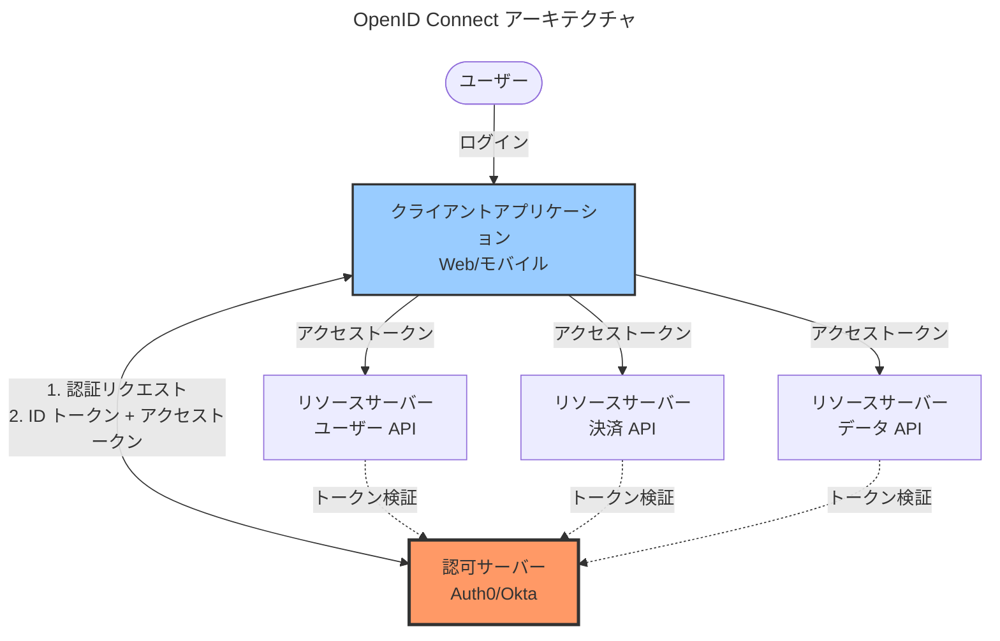
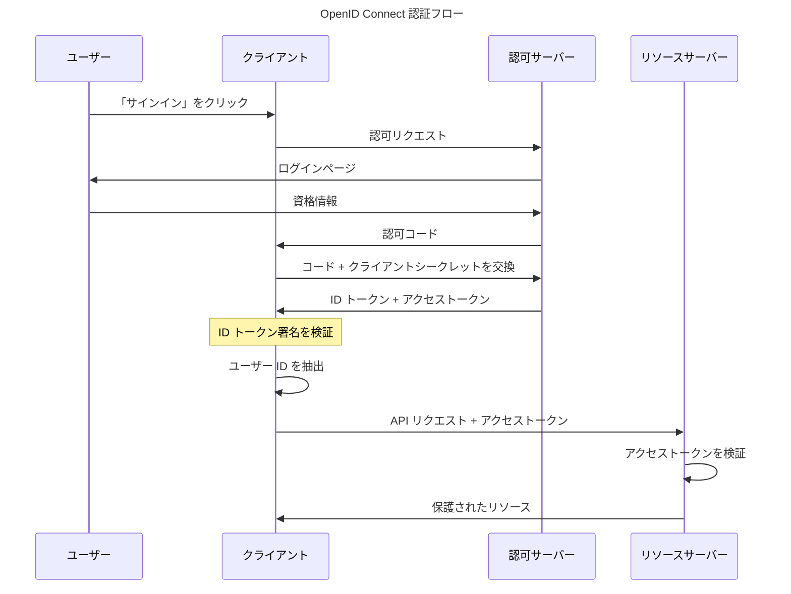

OAuth 2.0 は API 認可に革命をもたらしましたが、開発者はそれを認証に誤用し、セキュリティ脆弱性を生み出しました。OpenID Connect（OIDC）は 2014 年に登場し、OAuth 2.0 の上に標準化された ID レイヤーを追加することでこの問題を解決しました。OIDC は開発者が実際に必要としていたものを提供します：認証（あなたが誰であるか）と認可（何にアクセスできるか）の両方を統一されたフローで処理する現代的なプロトコルです。

この混乱は理解できます。開発者は「Google でサインイン」での OAuth の成功を見て、OAuth が認証プロトコルだと仮定しました。彼らはアクセストークンを取得し、それを ID の証明として扱いました。これはセキュリティ問題を引き起こしました—アクセストークンは ID を証明するように設計されておらず、リソースへのアクセスを許可します。異なるプロバイダーがユーザー情報エンドポイントを異なる方法で実装し、一貫性のない安全でない実装につながりました。

OIDC は ID トークンを導入することでこれを修正しました—ユーザー ID を証明するために特別に設計された JWT です。OIDC で認証すると、ID トークン（あなたが誰であるかを証明）とアクセストークン（API アクセスを許可）の両方を受け取ります。この明確な分離により混乱がなくなり、標準化されたユーザー情報で安全な認証が提供されます。

この探求は、OIDC の基礎、アーキテクチャ、認証フロー、実践的な実装、セキュリティの考慮事項、そして SAML などの代替案に対していつ OIDC を選択するかをカバーします。

## OIDC の基礎

OpenID Connect は ID レイヤーで OAuth 2.0 を拡張し、標準化された認証を提供します。

### コアコンセプト

OIDC は OAuth 2.0 の基盤の上に構築されています：

!!!anote "🆔 OIDC のコアコンセプト"
    **OAuth 2.0 ベース**
    - OAuth フローを使用
    - ID トークンを追加
    - ユーザー情報を標準化
    - 認証と認可を組み合わせ
    
    **ID トークン**
    - JWT（JSON Web Token）
    - ユーザー ID クレームを含む
    - デジタル署名済み
    - クライアントで検証可能
    
    **標準エンドポイント**
    - 認可エンドポイント
    - トークンエンドポイント
    - ユーザー情報エンドポイント
    - ディスカバリーエンドポイント

ID トークンは OIDC の重要なイノベーションです。これはユーザー ID、メール、名前などの ID クレームを含む JWT です。トークンは認可サーバーによってデジタル署名されており、クライアントはサーバーにコールバックすることなくその真正性を検証できます。これにより、安全で効率的な認証が提供されます。

### OIDC vs OAuth

OIDC と OAuth の違いを理解することは重要です：

!!!tip "🎯 OIDC vs OAuth"
    **OAuth 2.0**
    - 認可プロトコル
    - リソースへのアクセスを許可
    - API のアクセストークン
    - ID を証明しない
    
    **OpenID Connect**
    - 認証プロトコル
    - ユーザー ID を証明
    - 認証用の ID トークン
    - OAuth 2.0 ベース
    
    **主な違い**
    - OAuth：「何にアクセスできますか？」
    - OIDC：「あなたは誰ですか？」 + 「何にアクセスできますか？」

OAuth は「何にアクセスできますか？」に答えます。OIDC は「あなたは誰ですか？」と「何にアクセスできますか？」に答えます。認証が必要な場合は OIDC を使用します。ユーザー ID なしで API 認可のみが必要な場合は OAuth を使用します。

## OIDC アーキテクチャ

OIDC はエンティティとその相互作用を定義します：

### エンティティ

OIDC には 4 つの主要なエンティティが関与します：

!!!anote "🏗️ OIDC エンティティ"
    **エンドユーザー**
    - 認証する人
    - リソースを所有
    - 権限を付与
    
    **リライングパーティ（RP）**
    - クライアントアプリケーション
    - 認証を要求
    - ID トークンを消費
    - Web アプリ、モバイルアプリ、または SPA
    
    **OpenID プロバイダー（OP）**
    - 認可サーバー
    - ユーザーを認証
    - ID トークンとアクセストークンを発行
    - 例：Auth0、Okta、Azure AD
    
    **リソースサーバー**
    - 保護された API をホスト
    - アクセストークンを検証
    - 保護されたリソースを返す

リライングパーティ（RP）は認証を要求するアプリケーションです—あなたの Web アプリ、モバイルアプリ、またはシングルページアプリケーション。OpenID プロバイダー（OP）はユーザーを認証してトークンを発行する認可サーバーです。リソースサーバーはアクセストークンを受け入れる API をホストします。

### アーキテクチャ図

クライアントは認可サーバーを通じてユーザーを認証し、ID トークンとアクセストークンを受け取ります。クライアントは ID トークンを使用してユーザー ID を確立します。リソースサーバーはアクセストークンを検証して API リクエストを認可します。

## 認証フロー

OIDC は異なるシナリオに対して複数の認証フローをサポートします。

### 認可コードフロー

認可コードフローは最も安全で推奨されるフローです：

!!!anote "🔄 認可コードフロー"
    **ユースケース**
    - バックエンドを持つ Web アプリケーション
    - モバイルアプリケーション
    - 最も安全なオプション
    - すべての機密クライアントに推奨
    
    **フローステップ**
    1. ユーザーが「サインイン」をクリック
    2. クライアントが認可エンドポイントにリダイレクト
    3. ユーザーが OP で認証
    4. OP が認可コードでリダイレクトバック
    5. クライアントがコードをトークンと交換（バックエンド）
    6. クライアントが ID トークンとアクセストークンを受信
    7. クライアントが ID トークンを検証
    8. クライアントがユーザー ID を抽出
    9. クライアントがアクセストークンで API 呼び出し
    
    **セキュリティ機能**
    - トークンはブラウザに公開されない
    - クライアントシークレットがトークン交換を保護
    - 認可コードは使い捨て
    - 短命コード

このフローは、バックエンドでクライアントシークレットを使用して認可コードをトークンと交換することでトークンを安全に保ちます。認可コードはブラウザを通過しますが、トークンは通過せず、ブラウザベースの攻撃から保護されます。

### PKCE 付き認可コードフロー

PKCE（Proof Key for Code Exchange）はパブリッククライアントにセキュリティを追加します：

!!!anote "🔐 PKCE 拡張"
    **目的**
    - パブリッククライアントを保護
    - モバイルアプリ
    - シングルページアプリケーション
    - クライアントシークレットなし
    
    **動作原理**
    1. クライアントがコード検証器を生成（ランダム文字列）
    2. クライアントがコードチャレンジを作成（検証器のハッシュ）
    3. クライアントが認証リクエストでコードチャレンジを送信
    4. OP がコードチャレンジを保存
    5. クライアントがコード + コード検証器をトークンと交換
    6. OP が検証器がチャレンジと一致することを検証
    
    **セキュリティ上の利点**
    - 認可コード傍受を防止
    - クライアントシークレットなしで動作
    - モバイルと SPA に必須

PKCE は認可コード傍受攻撃から保護します。攻撃者が認可コードを傍受しても、クライアントを離れることのないコード検証器なしではトークンと交換できません。

### インプリシットフロー（非推奨）

インプリシットフローはブラウザベースのアプリ用に設計されましたが、現在は非推奨です：

!!!error "🚫 インプリシットフロー - 非推奨"
    **なぜ存在したか**
    - ブラウザベースのアプリ
    - バックエンドサーバーなし
    - URL フラグメント内のトークン
    
    **なぜ非推奨か**
    - トークンがブラウザに公開
    - URL フラグメント漏洩リスク
    - リフレッシュトークンなし
    - セキュリティ脆弱性
    
    **代わりに使用**
    - PKCE 付き認可コードフロー
    - より良いセキュリティを提供
    - SPA でも動作

新しいアプリケーションでインプリシットフローを使用しないでください。シングルページアプリケーションでも、PKCE 付き認可コードフローを使用してください。現代のブラウザとライブラリはこれを安全にサポートしています。

### クライアント資格情報フロー

マシン間認証用：

!!!anote "🤖 クライアント資格情報フロー"
    **ユースケース**
    - バックエンドサービス
    - マイクロサービス
    - スケジュールされたジョブ
    - ユーザー操作なし
    
    **フロー**
    1. サービスがクライアント ID とシークレットで認証
    2. OP がアクセストークンを発行
    3. サービスがトークンで API 呼び出し
    
    **特徴**
    - ユーザーが関与しない
    - サービスアカウント認証
    - ID トークンなし（ユーザー ID なし）
    - アクセストークンのみ

このフローはユーザーが関与しないサービス間認証用です。バックエンドサービスはその資格情報で認証し、API を呼び出すためのアクセストークンを受け取ります。

## ID トークン詳細

ID トークンは OIDC のコアイノベーションです。

### ID トークン構造

ID トークンは 3 つの部分を持つ JWT です：

!!!anote "🎫 ID トークン構造"
    **ヘッダー**
    - トークンタイプ（JWT）
    - 署名アルゴリズム（RS256 など）
    - 検証用のキー ID
    
    **ペイロード（クレーム）**
    - iss：発行者（OP URL）
    - sub：サブジェクト（ユーザー ID）
    - aud：オーディエンス（クライアント ID）
    - exp：有効期限
    - iat：発行時刻
    - nonce：リプレイ保護
    - email、name など：ユーザー属性
    
    **署名**
    - デジタル署名
    - トークンの真正性を検証
    - 改ざんを防止

ID トークンペイロードの例：

    {
      "iss": "https://auth.example.com",
      "sub": "user123",
      "aud": "client_abc",
      "exp": 1699999999,
      "iat": 1699996399,
      "nonce": "random_nonce",
      "email": "user@example.com",
      "name": "John Doe",
      "email_verified": true
    }

### ID トークン検証

クライアントは ID トークンを適切に検証する必要があります：

!!!warning "⚠️ ID トークン検証要件"
    **必須チェック**
    1. OP の公開鍵を使用して署名を検証
    2. 発行者（iss）が期待される OP と一致することを確認
    3. オーディエンス（aud）がクライアント ID と一致することを確認
    4. 有効期限（exp）が過ぎていないことを確認
    5. nonce がリクエストと一致することを検証
    6. 発行時刻（iat）が妥当であることを確認
    
    **セキュリティへの影響**
    - 検証をスキップすると脆弱性が生じる
    - 攻撃者がトークンを偽造できる
    - トークン置換攻撃
    - 常に完全に検証

ID トークン検証を決してスキップしないでください。各チェックは特定の攻撃を防ぎます。署名検証は偽造を防ぎます。オーディエンスチェックはトークン置換を防ぎます。有効期限チェックはリプレイ攻撃を防ぎます。

### 標準クレーム

OIDC はユーザー情報の標準クレームを定義します：

!!!anote "📋 標準クレーム"
    **プロファイルクレーム**
    - name：フルネーム
    - given_name：名
    - family_name：姓
    - middle_name：ミドルネーム
    - nickname：ニックネーム
    - picture：プロフィール写真 URL
    - website：ウェブページ URL
    
    **連絡先クレーム**
    - email：メールアドレス
    - email_verified：メール検証ステータス
    - phone_number：電話番号
    - phone_number_verified：電話検証ステータス
    
    **住所クレーム**
    - address：構造化された住所オブジェクト
    
    **その他のクレーム**
    - birthdate：生年月日
    - gender：性別
    - locale：ロケール/言語
    - zoneinfo：タイムゾーン

クライアントはスコープを使用して特定のクレームを要求します。openid スコープは必須です。profile、email、phone などの追加スコープは追加のクレームを要求します。

## ユーザー情報エンドポイント

ユーザー情報エンドポイントは追加のユーザー情報を提供します。

### 目的と使用法

!!!anote "ℹ️ ユーザー情報エンドポイント"
    **目的**
    - 追加のユーザー属性を取得
    - ID トークンクレームを補完
    - 標準化されたエンドポイント
    
    **使用法**
    1. クライアントがアクセストークンを取得
    2. クライアントがトークンでユーザー情報エンドポイントを呼び出し
    3. OP がユーザークレームを JSON で返す
    
    **いつ使用するか**
    - ID トークンに含まれるよりも多くのクレームが必要
    - ID トークンサイズの制約
    - 動的なユーザー情報

ユーザー情報エンドポイントはユーザークレームを JSON 形式で返します。アクセストークンで呼び出され、トークンのスコープに基づいてクレームを返します。

ユーザー情報レスポンスの例：

    {
      "sub": "user123",
      "email": "user@example.com",
      "name": "John Doe",
      "picture": "https://example.com/photo.jpg",
      "email_verified": true
    }

## ディスカバリーとメタデータ

OIDC は自動設定ディスカバリーを提供します。

### ディスカバリーエンドポイント

ディスカバリーエンドポイントは OP 設定を返します：

!!!anote "🔍 OIDC ディスカバリー"
    **エンドポイント**
    - `/.well-known/openid-configuration`
    - JSON メタデータを返す
    - 自動設定
    
    **メタデータに含まれるもの**
    - 認可エンドポイント URL
    - トークンエンドポイント URL
    - ユーザー情報エンドポイント URL
    - サポートされるスコープ
    - サポートされるレスポンスタイプ
    - 署名アルゴリズム
    - JWKS URI（公開鍵）

ディスカバリー URL の例：`https://auth.example.com/.well-known/openid-configuration`

これによりクライアントの自動設定が可能になります。クライアントはディスカバリードキュメントを取得し、手動でエンドポイントを設定することなく自己設定します。

## OIDC の実践

実際の OIDC 実装の考慮事項。

### プロバイダー選択

OIDC プロバイダーの選択：

!!!tip "🎯 OIDC プロバイダー選択"
    **マネージドプロバイダー**
    - Auth0：開発者フレンドリー、豊富な機能
    - Okta：エンタープライズ重視、強力なサポート
    - Azure AD：Microsoft エコシステム統合
    - Google Identity：コンシューマーとエンタープライズ
    - AWS Cognito：AWS エコシステム統合
    
    **セルフホスト**
    - Keycloak：オープンソース、機能豊富
    - ORY Hydra：クラウドネイティブ、軽量
    - Authelia：セルフホスト、プライバシー重視
    
    **考慮事項**
    - コンプライアンス要件
    - スケーラビリティニーズ
    - コスト構造
    - 開発者エクスペリエンス
    - サポート要件

マネージドプロバイダーはより簡単なセットアップとメンテナンスを提供します。セルフホストオプションはより多くの制御とデータプライバシーを提供します。要件、チームの能力、予算に基づいて選択してください。

### 統合ライブラリ

OIDC 統合には標準ライブラリを使用：

!!!success "✅ OIDC ライブラリ"
    **JavaScript/Node.js**
    - oidc-client-ts：ブラウザと Node.js
    - passport-openidconnect：Node.js ミドルウェア
    - next-auth：Next.js 統合
    
    **Python**
    - authlib：包括的な OAuth/OIDC
    - python-jose：JWT 処理
    - flask-oidc：Flask 統合
    
    **Java**
    - Spring Security OAuth：Spring 統合
    - pac4j：マルチプロトコルサポート
    
    **C#/.NET**
    - IdentityModel：OIDC クライアントライブラリ
    - Microsoft.Identity.Web：ASP.NET Core
    
    **モバイル**
    - AppAuth：iOS と Android
    - React Native AppAuth：React Native

OIDC をゼロから実装しないでください。プロトコルの詳細、トークン検証、セキュリティベストプラクティスを処理する、よくメンテナンスされたライブラリを使用してください。

### 実装例

基本的な OIDC フローの実装：

    // 1. 認可エンドポイントにリダイレクト
    const authUrl = `${issuer}/authorize?` +
      `response_type=code&` +
      `client_id=${clientId}&` +
      `redirect_uri=${redirectUri}&` +
      `scope=openid profile email&` +
      `state=${state}&` +
      `nonce=${nonce}`;
    
    window.location.href = authUrl;
    
    // 2. コールバックを処理（バックエンド）
    const tokenResponse = await fetch(`${issuer}/token`, {
      method: 'POST',
      headers: { 'Content-Type': 'application/x-www-form-urlencoded' },
      body: new URLSearchParams({
        grant_type: 'authorization_code',
        code: authCode,
        redirect_uri: redirectUri,
        client_id: clientId,
        client_secret: clientSecret
      })
    });
    
    const { id_token, access_token } = await tokenResponse.json();
    
    // 3. ID トークンを検証
    const decoded = jwt.verify(id_token, publicKey, {
      issuer: issuer,
      audience: clientId
    });
    
    // 4. ユーザー ID を抽出
    const userId = decoded.sub;
    const email = decoded.email;

これは基本的なフローを示しています：認可エンドポイントにリダイレクト、コードをトークンと交換、ID トークンを検証、ユーザー ID を抽出。

## セキュリティの考慮事項

OIDC セキュリティベストプラクティス。

### トークンセキュリティ

トークンを慎重に保護：

!!!warning "⚠️ トークンセキュリティベストプラクティス"
    **保存**
    - localStorage にトークンを保存しない
    - 可能な限り httpOnly クッキーを使用
    - 保存時にトークンを暗号化
    - ログアウト時にトークンをクリア
    
    **送信**
    - 常に HTTPS を使用
    - TLS 証明書を検証
    - URL にトークンを含めない
    - セキュアヘッダーを使用
    
    **検証**
    - トークン署名を検証
    - 有効期限をチェック
    - 発行者を検証
    - オーディエンスを検証
    - nonce をチェック
    
    **ローテーション**
    - 短命アクセストークン（15 分）
    - リフレッシュトークンローテーション
    - 取り消しメカニズム
    - 悪用を監視

トークンはベアラー資格情報です—トークンを持っている人は誰でも使用できます。localStorage にトークンを保存すると XSS 攻撃にさらされます。トークンを信頼する前に常に完全に検証してください。

### パブリッククライアントの PKCE

パブリッククライアントには常に PKCE を使用：

!!!tip "🔐 PKCE ベストプラクティス"
    **いつ使用するか**
    - モバイルアプリケーション
    - シングルページアプリケーション
    - すべてのパブリッククライアント
    - 機密クライアントでも（多層防御）
    
    **実装**
    - 暗号学的にランダムな検証器を生成
    - S256 チャレンジメソッドを使用（SHA-256）
    - 検証器を再利用しない
    - サーバー側で検証

PKCE は現在、パブリッククライアントだけでなく、すべての OAuth/OIDC フローに推奨されています。認可コード傍受に対する多層防御を提供します。

### State と Nonce

state と nonce パラメータを使用：

!!!warning "⚠️ State と Nonce パラメータ"
    **State パラメータ**
    - CSRF 攻撃を防止
    - ランダムで予測不可能な値
    - コールバック時に検証
    - セキュリティに必須
    
    **Nonce パラメータ**
    - リプレイ攻撃を防止
    - ID トークンに含まれる
    - クライアントによって検証
    - トークンをセッションにバインド

両方のパラメータはセキュリティに不可欠です。State は CSRF 攻撃を防ぎます。攻撃者がユーザーを騙して攻撃者が制御するアカウントで認証させる攻撃です。Nonce はトークンリプレイ攻撃を防ぎます。

## OIDC vs SAML

OIDC と SAML の選択。

### 比較

!!!tip "🎯 OIDC vs SAML の決定"
    **SAML を選択する場合：**
    - レガシーエンタープライズアプリとの統合
    - ベンダーが SAML のみサポート
    - 既存の SAML インフラストラクチャ
    - 規制要件が SAML を指定
    
    **OIDC を選択する場合：**
    - 新しいアプリケーションの構築
    - モバイルアプリ認証
    - API 認可が必要
    - 現代のアーキテクチャ
    - 開発者エクスペリエンスが重要
    
    **技術的な違い**
    - SAML：XML ベース、ブラウザリダイレクト
    - OIDC：JSON ベース、RESTful API
    - SAML：ブラウザのみのフロー
    - OIDC：モバイル、Web、API サポート

SAML は消えません—あまりにも多くのエンタープライズアプリケーションがそれに依存しています。しかし、新しいプロジェクトは OIDC を使用すべきです。よりシンプルで、より柔軟で、現代のアーキテクチャに適しています。

### 移行パス

多くの組織は両方のプロトコルを実行しています：

!!!anote "🔄 SAML から OIDC への移行"
    **ハイブリッドアプローチ**
    - レガシーアプリには SAML を維持
    - 新しい開発には OIDC を使用
    - IdP が両方のプロトコルをサポート
    - 段階的な移行
    
    **移行ステップ**
    1. OIDC 対応 IdP を展開
    2. 既存アプリには SAML を維持
    3. OIDC で新しいアプリを構築
    4. 実行可能な場合にアプリを移行
    5. 最終的に SAML を非推奨に

ほとんどのエンタープライズ IdP は SAML と OIDC の両方をサポートしています。これにより、既存の統合を中断することなく段階的な移行が可能になります。

## よくある間違い

これらの OIDC の落とし穴を避けてください：

!!!error "🚫 OIDC アンチパターン"
    **不完全なトークン検証**
    - 署名検証をスキップ
    - 有効期限をチェックしない
    - オーディエンスクレームを無視
    - nonce 検証がない
    
    **安全でないトークン保存**
    - localStorage に保存
    - 長命トークン
    - トークンローテーションなし
    - ログでトークンを公開
    
    **インプリシットフローの使用**
    - 非推奨で安全でない
    - 認可コード + PKCE を使用
    - SPA でも
    
    **ゼロから実装**
    - 複雑なプロトコルの詳細
    - セキュリティ脆弱性
    - 標準ライブラリを使用
    
    **OAuth と OIDC の混同**
    - OAuth は認可
    - OIDC は認証
    - ログインには OIDC を使用

最も一般的な間違いは不完全なトークン検証です。すべての検証ステップは特定の攻撃を防ぎます。いずれかのステップをスキップすると脆弱性が生じます。

## 結論

OpenID Connect は OAuth 2.0 が設計されていなかった認証問題を解決しました。ID トークンを追加し、ユーザー情報エンドポイントを標準化することで、OIDC は Web アプリケーション、モバイルアプリ、API に対応する安全で現代的な認証を提供します。

OIDC の成功は、OAuth 2.0 の実証済みの基盤の上に構築しながら、欠けていた認証レイヤーを追加したことから来ています。このプロトコルは SAML よりシンプルで、カスタム実装より安全で、レガシープロトコルより現代のアーキテクチャに適しています。

重要なポイント：

- OIDC は認証用、OAuth は認可用
- すべてのクライアントに PKCE 付き認可コードフローを使用
- 常に ID トークンを完全に検証
- 標準ライブラリを使用し、ゼロから実装しない
- 新しいプロジェクトには OIDC を選択し、レガシー統合には SAML を維持
- トークンを慎重に保護—それらはベアラー資格情報
- セキュリティのために state と nonce パラメータを使用

現代のアプリケーションを構築する際、OIDC は認証のデフォルトの選択肢であるべきです。今日の Web、モバイル、API 駆動のアーキテクチャに必要なセキュリティ、柔軟性、開発者エクスペリエンスを提供します。このプロトコルは複雑なセキュリティの詳細を処理し、認証インフラストラクチャではなく機能の構築に集中できるようにします。

Auth0 や Okta などのマネージドプロバイダーを使用するか、Keycloak でセルフホストするかにかかわらず、OIDC はプラットフォームとユースケース全体で機能する標準化された認証を提供します。この標準化が OIDC の最大の強みです—どこでも機能し、一貫して実装され、強力なセキュリティプロパティを持つ単一のプロトコルです。
