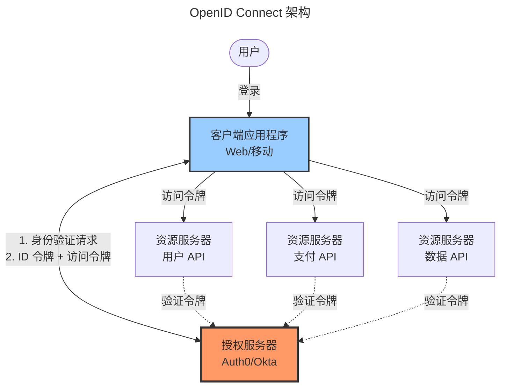
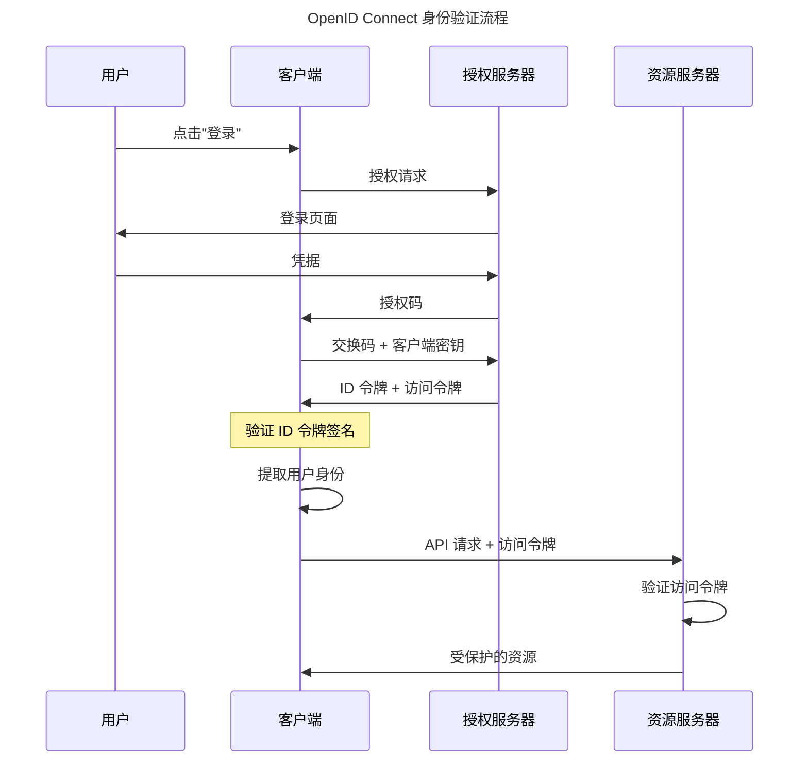

OAuth 2.0 革新了 API 授权，但开发人员误用它进行身份验证，造成了安全漏洞。OpenID Connect（OIDC）于 2014 年出现，通过在 OAuth 2.0 之上添加标准化的身份层来解决这个问题。OIDC 提供了开发人员真正需要的：一个在统一流程中处理身份验证（你是谁）和授权（你可以访问什么）的现代协议。

这种混淆是可以理解的。开发人员看到 OAuth 在"使用 Google 登录"中的成功，并假设 OAuth 是一个身份验证协议。他们会获取访问令牌并将其视为身份证明。这造成了安全问题——访问令牌不是为证明身份而设计的，它们授予对资源的访问权限。不同的提供者以不同的方式实现用户信息端点，导致实现不一致且不安全。

OIDC 通过引入 ID 令牌解决了这个问题——一个专门设计用于证明用户身份的 JWT。当你使用 OIDC 进行身份验证时，你会同时收到 ID 令牌（证明你是谁）和访问令牌（授予 API 访问权限）。这种明确的分离消除了混淆并提供了安全的身份验证和标准化的用户信息。

本文涵盖 OIDC 基础、架构、身份验证流程、实际实施、安全考虑，以及何时选择 OIDC 而不是 SAML 等替代方案。

## OIDC 基础

OpenID Connect 通过身份层扩展 OAuth 2.0，提供标准化的身份验证。

### 核心概念

OIDC 建立在 OAuth 2.0 的基础之上：

!!!anote "🆔 OIDC 核心概念"
    **基于 OAuth 2.0**
    - 使用 OAuth 流程
    - 添加 ID 令牌
    - 标准化用户信息
    - 结合身份验证和授权
    
    **ID 令牌**
    - JWT（JSON Web Token）
    - 包含用户身份声明
    - 数字签名
    - 可由客户端验证
    
    **标准端点**
    - 授权端点
    - 令牌端点
    - 用户信息端点
    - 发现端点

ID 令牌是 OIDC 的关键创新。它是一个包含用户 ID、电子邮件和姓名等身份声明的 JWT。令牌由授权服务器数字签名，允许客户端验证其真实性而无需回调服务器。这提供了安全、高效的身份验证。

### OIDC vs OAuth

理解 OIDC 和 OAuth 之间的区别至关重要：

!!!tip "🎯 OIDC vs OAuth"
    **OAuth 2.0**
    - 授权协议
    - 授予对资源的访问权限
    - API 的访问令牌
    - 不证明身份
    
    **OpenID Connect**
    - 身份验证协议
    - 证明用户身份
    - 身份验证的 ID 令牌
    - 基于 OAuth 2.0
    
    **关键区别**
    - OAuth："你可以访问什么？"
    - OIDC："你是谁？" + "你可以访问什么？"

OAuth 回答"你可以访问什么？"OIDC 回答"你是谁？"和"你可以访问什么？"如果你需要身份验证，使用 OIDC。如果你只需要 API 授权而不需要用户身份，使用 OAuth。

## OIDC 架构

OIDC 定义了实体及其交互：

### 实体

OIDC 涉及四个主要实体：

!!!anote "🏗️ OIDC 实体"
    **最终用户**
    - 进行身份验证的人
    - 拥有资源
    - 授予权限
    
    **依赖方（RP）**
    - 客户端应用程序
    - 请求身份验证
    - 使用 ID 令牌
    - Web 应用、移动应用或 SPA
    
    **OpenID 提供者（OP）**
    - 授权服务器
    - 验证用户身份
    - 颁发 ID 令牌和访问令牌
    - 示例：Auth0、Okta、Azure AD
    
    **资源服务器**
    - 托管受保护的 API
    - 验证访问令牌
    - 返回受保护的资源

依赖方（RP）是请求身份验证的应用程序——你的 Web 应用、移动应用或单页应用程序。OpenID 提供者（OP）是验证用户身份并颁发令牌的授权服务器。资源服务器托管接受访问令牌的 API。

### 架构图

客户端通过授权服务器验证用户身份，接收 ID 令牌和访问令牌。客户端使用 ID 令牌建立用户身份。资源服务器验证访问令牌以授权 API 请求。

## 身份验证流程

OIDC 支持多种身份验证流程以适应不同场景。

### 授权码流程

授权码流程是最安全且推荐的流程：

!!!anote "🔄 授权码流程"
    **用例**
    - 带后端的 Web 应用程序
    - 移动应用程序
    - 最安全的选项
    - 推荐用于所有机密客户端
    
    **流程步骤**
    1. 用户点击"登录"
    2. 客户端重定向到授权端点
    3. 用户在 OP 进行身份验证
    4. OP 重定向回授权码
    5. 客户端交换码以获取令牌（后端）
    6. 客户端接收 ID 令牌和访问令牌
    7. 客户端验证 ID 令牌
    8. 客户端提取用户身份
    9. 客户端使用访问令牌进行 API 调用
    
    **安全特性**
    - 令牌永不暴露给浏览器
    - 客户端密钥保护令牌交换
    - 授权码是一次性的
    - 短期码

此流程通过在后端使用客户端密钥将授权码交换为令牌来保持令牌安全。授权码通过浏览器传递，但令牌不会，从而保护它们免受基于浏览器的攻击。

### 带 PKCE 的授权码流程

PKCE（代码交换证明密钥）为公共客户端增加了安全性：

!!!anote "🔐 PKCE 扩展"
    **目的**
    - 保护公共客户端
    - 移动应用
    - 单页应用程序
    - 无客户端密钥
    
    **工作原理**
    1. 客户端生成代码验证器（随机字符串）
    2. 客户端创建代码挑战（验证器的哈希）
    3. 客户端在身份验证请求中发送代码挑战
    4. OP 存储代码挑战
    5. 客户端交换码 + 代码验证器以获取令牌
    6. OP 验证验证器与挑战匹配
    
    **安全优势**
    - 防止授权码拦截
    - 无需客户端密钥即可工作
    - 移动和 SPA 必需

PKCE 防止授权码拦截攻击。即使攻击者拦截了授权码，他们也无法在没有代码验证器的情况下将其交换为令牌，而代码验证器永远不会离开客户端。

### 隐式流程（已弃用）

隐式流程是为基于浏览器的应用设计的，但现在已弃用：

!!!error "🚫 隐式流程 - 已弃用"
    **为何存在**
    - 基于浏览器的应用
    - 无后端服务器
    - URL 片段中的令牌
    
    **为何弃用**
    - 令牌在浏览器中暴露
    - URL 片段泄漏风险
    - 无刷新令牌
    - 安全漏洞
    
    **改用**
    - 带 PKCE 的授权码流程
    - 提供更好的安全性
    - 适用于 SPA

不要在新应用程序中使用隐式流程。即使对于单页应用程序，也使用带 PKCE 的授权码流程。现代浏览器和库安全地支持这一点。

### 客户端凭据流程

用于机器对机器身份验证：

!!!anote "🤖 客户端凭据流程"
    **用例**
    - 后端服务
    - 微服务
    - 计划作业
    - 无用户交互
    
    **流程**
    1. 服务使用客户端 ID 和密钥进行身份验证
    2. OP 颁发访问令牌
    3. 服务使用令牌进行 API 调用
    
    **特征**
    - 不涉及用户
    - 服务账户身份验证
    - 无 ID 令牌（无用户身份）
    - 仅访问令牌

此流程用于不涉及用户的服务对服务身份验证。后端服务使用其凭据进行身份验证并接收访问令牌以调用 API。

## ID 令牌深入探讨

ID 令牌是 OIDC 的核心创新。

### ID 令牌结构

ID 令牌是具有三个部分的 JWT：

!!!anote "🎫 ID 令牌结构"
    **头部**
    - 令牌类型（JWT）
    - 签名算法（RS256 等）
    - 验证的密钥 ID
    
    **载荷（声明）**
    - iss：颁发者（OP URL）
    - sub：主题（用户 ID）
    - aud：受众（客户端 ID）
    - exp：过期时间
    - iat：颁发时间
    - nonce：重放保护
    - email、name 等：用户属性
    
    **签名**
    - 数字签名
    - 验证令牌真实性
    - 防止篡改

示例 ID 令牌载荷：

    {
      "iss": "https://auth.example.com",
      "sub": "user123",
      "aud": "client_abc",
      "exp": 1699999999,
      "iat": 1699996399,
      "nonce": "random_nonce",
      "email": "user@example.com",
      "name": "John Doe",
      "email_verified": true
    }

### ID 令牌验证

客户端必须正确验证 ID 令牌：

!!!warning "⚠️ ID 令牌验证要求"
    **必需检查**
    1. 使用 OP 的公钥验证签名
    2. 检查颁发者（iss）与预期 OP 匹配
    3. 检查受众（aud）与客户端 ID 匹配
    4. 检查过期时间（exp）未过期
    5. 验证 nonce 与请求匹配
    6. 检查颁发时间（iat）合理
    
    **安全影响**
    - 跳过验证会造成漏洞
    - 攻击者可以伪造令牌
    - 令牌替换攻击
    - 始终完全验证

永远不要跳过 ID 令牌验证。每个检查都防止特定的攻击。签名验证防止伪造。受众检查防止令牌替换。过期检查防止重放攻击。

### 标准声明

OIDC 为用户信息定义了标准声明：

!!!anote "📋 标准声明"
    **个人资料声明**
    - name：全名
    - given_name：名字
    - family_name：姓氏
    - middle_name：中间名
    - nickname：昵称
    - picture：个人资料照片 URL
    - website：网页 URL
    
    **联系声明**
    - email：电子邮件地址
    - email_verified：电子邮件验证状态
    - phone_number：电话号码
    - phone_number_verified：电话验证状态
    
    **地址声明**
    - address：结构化地址对象
    
    **其他声明**
    - birthdate：出生日期
    - gender：性别
    - locale：区域设置/语言
    - zoneinfo：时区

客户端使用范围请求特定声明。openid 范围是必需的。profile、email 和 phone 等附加范围请求附加声明。

## 用户信息端点

用户信息端点提供额外的用户信息。

### 目的和用法

!!!anote "ℹ️ 用户信息端点"
    **目的**
    - 检索额外的用户属性
    - 补充 ID 令牌声明
    - 标准化端点
    
    **用法**
    1. 客户端获取访问令牌
    2. 客户端使用令牌调用用户信息端点
    3. OP 以 JSON 形式返回用户声明
    
    **何时使用**
    - 需要比 ID 令牌包含的更多声明
    - ID 令牌大小限制
    - 动态用户信息

用户信息端点以 JSON 格式返回用户声明。它使用访问令牌调用，并根据令牌的范围返回声明。

示例用户信息响应：

    {
      "sub": "user123",
      "email": "user@example.com",
      "name": "John Doe",
      "picture": "https://example.com/photo.jpg",
      "email_verified": true
    }

## 发现和元数据

OIDC 提供自动配置发现。

### 发现端点

发现端点返回 OP 配置：

!!!anote "🔍 OIDC 发现"
    **端点**
    - `/.well-known/openid-configuration`
    - 返回 JSON 元数据
    - 自动配置
    
    **元数据包括**
    - 授权端点 URL
    - 令牌端点 URL
    - 用户信息端点 URL
    - 支持的范围
    - 支持的响应类型
    - 签名算法
    - JWKS URI（公钥）

示例发现 URL：`https://auth.example.com/.well-known/openid-configuration`

这使得客户端可以自动配置。客户端获取发现文档并自行配置，无需手动端点配置。

## OIDC 实践

实际 OIDC 实施考虑。

### 提供者选择

选择 OIDC 提供者：

!!!tip "🎯 OIDC 提供者选择"
    **托管提供者**
    - Auth0：开发者友好，功能广泛
    - Okta：企业重点，强大支持
    - Azure AD：Microsoft 生态系统集成
    - Google Identity：消费者和企业
    - AWS Cognito：AWS 生态系统集成
    
    **自托管**
    - Keycloak：开源，功能丰富
    - ORY Hydra：云原生，轻量级
    - Authelia：自托管，注重隐私
    
    **考虑因素**
    - 合规要求
    - 可扩展性需求
    - 成本结构
    - 开发者体验
    - 支持要求

托管提供者提供更简单的设置和维护。自托管选项提供更多控制和数据隐私。根据你的要求、团队能力和预算进行选择。

### 集成库

使用标准库进行 OIDC 集成：

!!!success "✅ OIDC 库"
    **JavaScript/Node.js**
    - oidc-client-ts：浏览器和 Node.js
    - passport-openidconnect：Node.js 中间件
    - next-auth：Next.js 集成
    
    **Python**
    - authlib：全面的 OAuth/OIDC
    - python-jose：JWT 处理
    - flask-oidc：Flask 集成
    
    **Java**
    - Spring Security OAuth：Spring 集成
    - pac4j：多协议支持
    
    **C#/.NET**
    - IdentityModel：OIDC 客户端库
    - Microsoft.Identity.Web：ASP.NET Core
    
    **移动**
    - AppAuth：iOS 和 Android
    - React Native AppAuth：React Native

不要从头实现 OIDC。使用维护良好的库来处理协议细节、令牌验证和安全最佳实践。

### 实施示例

基本 OIDC 流程实施：

    // 1. 重定向到授权端点
    const authUrl = `${issuer}/authorize?` +
      `response_type=code&` +
      `client_id=${clientId}&` +
      `redirect_uri=${redirectUri}&` +
      `scope=openid profile email&` +
      `state=${state}&` +
      `nonce=${nonce}`;
    
    window.location.href = authUrl;
    
    // 2. 处理回调（后端）
    const tokenResponse = await fetch(`${issuer}/token`, {
      method: 'POST',
      headers: { 'Content-Type': 'application/x-www-form-urlencoded' },
      body: new URLSearchParams({
        grant_type: 'authorization_code',
        code: authCode,
        redirect_uri: redirectUri,
        client_id: clientId,
        client_secret: clientSecret
      })
    });
    
    const { id_token, access_token } = await tokenResponse.json();
    
    // 3. 验证 ID 令牌
    const decoded = jwt.verify(id_token, publicKey, {
      issuer: issuer,
      audience: clientId
    });
    
    // 4. 提取用户身份
    const userId = decoded.sub;
    const email = decoded.email;

这显示了基本流程：重定向到授权端点，交换码以获取令牌，验证 ID 令牌，提取用户身份。

## 安全考虑

OIDC 安全最佳实践。

### 令牌安全

小心保护令牌：

!!!warning "⚠️ 令牌安全最佳实践"
    **存储**
    - 永不在 localStorage 中存储令牌
    - 尽可能使用 httpOnly cookie
    - 静态加密令牌
    - 注销时清除令牌
    
    **传输**
    - 始终使用 HTTPS
    - 验证 TLS 证书
    - 避免在 URL 中使用令牌
    - 使用安全头
    
    **验证**
    - 验证令牌签名
    - 检查过期时间
    - 验证颁发者
    - 验证受众
    - 检查 nonce
    
    **轮换**
    - 短期访问令牌（15 分钟）
    - 刷新令牌轮换
    - 撤销机制
    - 监控滥用

令牌是持有者凭据——任何拥有令牌的人都可以使用它。在 localStorage 中存储令牌会使其暴露于 XSS 攻击。在信任令牌之前，始终完全验证令牌。

### 公共客户端的 PKCE

始终对公共客户端使用 PKCE：

!!!tip "🔐 PKCE 最佳实践"
    **何时使用**
    - 移动应用程序
    - 单页应用程序
    - 任何公共客户端
    - 即使对机密客户端（纵深防御）
    
    **实施**
    - 生成加密随机验证器
    - 使用 S256 挑战方法（SHA-256）
    - 永不重用验证器
    - 在服务器端验证

PKCE 现在推荐用于所有 OAuth/OIDC 流程，不仅仅是公共客户端。它提供了针对授权码拦截的纵深防御。

### State 和 Nonce

使用 state 和 nonce 参数：

!!!warning "⚠️ State 和 Nonce 参数"
    **State 参数**
    - 防止 CSRF 攻击
    - 随机、不可预测的值
    - 在回调时验证
    - 安全必需
    
    **Nonce 参数**
    - 防止重放攻击
    - 包含在 ID 令牌中
    - 由客户端验证
    - 将令牌绑定到会话

这两个参数对安全至关重要。State 防止 CSRF 攻击，攻击者诱骗用户使用攻击者控制的账户进行身份验证。Nonce 防止令牌重放攻击。

## OIDC vs SAML

在 OIDC 和 SAML 之间选择。

### 比较

!!!tip "🎯 OIDC vs SAML 决策"
    **选择 SAML 当：**
    - 与遗留企业应用集成
    - 供应商仅支持 SAML
    - 现有 SAML 基础设施
    - 法规要求指定 SAML
    
    **选择 OIDC 当：**
    - 构建新应用程序
    - 移动应用身份验证
    - 需要 API 授权
    - 现代架构
    - 开发者体验重要
    
    **技术差异**
    - SAML：基于 XML，浏览器重定向
    - OIDC：基于 JSON，RESTful API
    - SAML：仅浏览器流程
    - OIDC：移动、Web、API 支持

SAML 不会消失——太多企业应用程序依赖它。但新项目应该使用 OIDC。它更简单、更灵活，更适合现代架构。

### 迁移路径

许多组织同时运行两种协议：

!!!anote "🔄 SAML 到 OIDC 迁移"
    **混合方法**
    - 保留 SAML 用于遗留应用
    - 新开发使用 OIDC
    - IdP 支持两种协议
    - 逐步迁移
    
    **迁移步骤**
    1. 部署支持 OIDC 的 IdP
    2. 为现有应用维护 SAML
    3. 使用 OIDC 构建新应用
    4. 在可行时迁移应用
    5. 最终弃用 SAML

大多数企业 IdP 同时支持 SAML 和 OIDC。这允许逐步迁移而不会中断现有集成。

## 常见错误

避免这些 OIDC 陷阱：

!!!error "🚫 OIDC 反模式"
    **不完整的令牌验证**
    - 跳过签名验证
    - 不检查过期时间
    - 忽略受众声明
    - 缺少 nonce 验证
    
    **不安全的令牌存储**
    - 存储在 localStorage 中
    - 长期令牌
    - 无令牌轮换
    - 在日志中暴露令牌
    
    **使用隐式流程**
    - 已弃用且不安全
    - 使用授权码 + PKCE
    - 即使对 SPA
    
    **从头实现**
    - 复杂的协议细节
    - 安全漏洞
    - 使用标准库
    
    **混淆 OAuth 和 OIDC**
    - OAuth 是授权
    - OIDC 是身份验证
    - 使用 OIDC 进行登录

最常见的错误是不完整的令牌验证。每个验证步骤都防止特定的攻击。跳过任何步骤都会造成漏洞。

## 结论

OpenID Connect 解决了 OAuth 2.0 未设计解决的身份验证问题。通过添加 ID 令牌和标准化用户信息端点，OIDC 提供了适用于 Web 应用程序、移动应用和 API 的安全、现代身份验证。

OIDC 的成功来自于在 OAuth 2.0 经过验证的基础上构建，同时添加了缺失的身份验证层。该协议比 SAML 更简单，比自定义实现更安全，比遗留协议更适合现代架构。

关键要点：

- OIDC 用于身份验证，OAuth 用于授权
- 对所有客户端使用带 PKCE 的授权码流程
- 始终完全验证 ID 令牌
- 使用标准库，不要从头实现
- 新项目选择 OIDC，保留 SAML 用于遗留集成
- 小心保护令牌——它们是持有者凭据
- 使用 state 和 nonce 参数以确保安全

在构建现代应用程序时，OIDC 应该是你身份验证的默认选择。它提供了当今 Web、移动和 API 驱动架构所需的安全性、灵活性和开发者体验。该协议处理复杂的安全细节，让你专注于构建功能而不是身份验证基础设施。

无论你使用 Auth0 或 Okta 等托管提供者，还是使用 Keycloak 自托管，OIDC 都提供了跨平台和用例工作的标准化身份验证。这种标准化是 OIDC 最大的优势——一个在任何地方都能工作的协议，实施一致，具有强大的安全属性。
