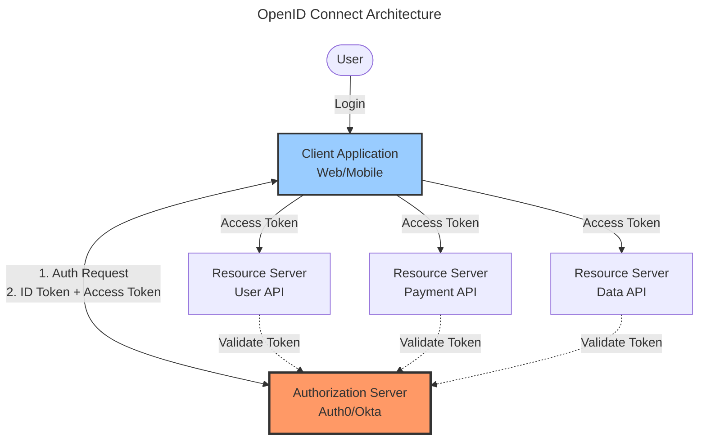
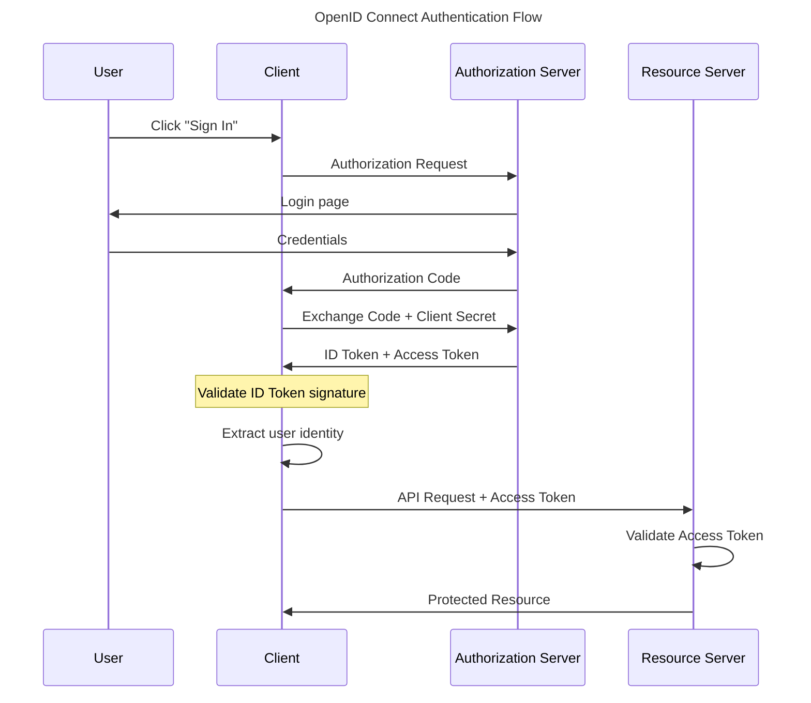

OAuth 2.0 revolutionized API authorization, but developers misused it for authentication, creating security vulnerabilities. OpenID Connect (OIDC) emerged in 2014 to solve this problem by adding a standardized identity layer on top of OAuth 2.0. OIDC provides what developers actually needed: a modern protocol that handles both authentication (who you are) and authorization (what you can access) in one unified flow.

The confusion was understandable. Developers saw OAuth's success with "Sign in with Google" and assumed OAuth was an authentication protocol. They'd obtain an access token and treat it as proof of identity. This created security problems—access tokens aren't designed to prove identity, they grant access to resources. Different providers implemented user info endpoints differently, leading to inconsistent and insecure implementations.

OIDC fixed this by introducing the ID Token—a JWT specifically designed to prove user identity. When you authenticate with OIDC, you receive both an ID Token (proving who you are) and an access token (granting API access). This clear separation eliminates the confusion and provides secure authentication with standardized user information.

This exploration covers OIDC fundamentals, architecture, authentication flows, practical implementation, security considerations, and when to choose OIDC over alternatives like SAML.

## OIDC Fundamentals

OpenID Connect extends OAuth 2.0 with an identity layer, providing standardized authentication.

### Core Concepts

OIDC builds on OAuth 2.0's foundation:

!!!anote "🆔 OIDC Core Concepts"
    **Built on OAuth 2.0**
    - Uses OAuth flows
    - Adds ID Token
    - Standardizes user info
    - Combines authentication and authorization
    
    **ID Token**
    - JWT (JSON Web Token)
    - Contains user identity claims
    - Digitally signed
    - Can be verified by client
    
    **Standard Endpoints**
    - Authorization endpoint
    - Token endpoint
    - UserInfo endpoint
    - Discovery endpoint

The ID Token is OIDC's key innovation. It's a JWT containing identity claims like user ID, email, and name. The token is digitally signed by the authorization server, allowing clients to verify its authenticity without calling back to the server. This provides secure, efficient authentication.

### OIDC vs OAuth

Understanding the difference between OIDC and OAuth is critical:

!!!tip "🎯 OIDC vs OAuth"
    **OAuth 2.0**
    - Authorization protocol
    - Grants access to resources
    - Access tokens for APIs
    - Doesn't prove identity
    
    **OpenID Connect**
    - Authentication protocol
    - Proves user identity
    - ID tokens for authentication
    - Built on OAuth 2.0
    
    **Key Difference**
    - OAuth: "What can you access?"
    - OIDC: "Who are you?" + "What can you access?"

OAuth answers "what can you access?" OIDC answers "who are you?" and "what can you access?" If you need authentication, use OIDC. If you only need API authorization without user identity, use OAuth.

## OIDC Architecture

OIDC defines entities and their interactions:

### Entities

OIDC involves four main entities:

!!!anote "🏗️ OIDC Entities"
    **End User**
    - Person authenticating
    - Owns resources
    - Grants permissions
    
    **Relying Party (RP)**
    - Client application
    - Requests authentication
    - Consumes ID tokens
    - Web app, mobile app, or SPA
    
    **OpenID Provider (OP)**
    - Authorization server
    - Authenticates users
    - Issues ID tokens and access tokens
    - Examples: Auth0, Okta, Azure AD
    
    **Resource Server**
    - Hosts protected APIs
    - Validates access tokens
    - Returns protected resources

The Relying Party (RP) is the application requesting authentication—your web app, mobile app, or single-page application. The OpenID Provider (OP) is the authorization server that authenticates users and issues tokens. Resource servers host APIs that accept access tokens.

### Architecture Diagram

The client authenticates users through the authorization server, receiving both ID tokens and access tokens. The client uses ID tokens to establish user identity. Resource servers validate access tokens to authorize API requests.

## Authentication Flows

OIDC supports multiple authentication flows for different scenarios.

### Authorization Code Flow

The Authorization Code Flow is the most secure and recommended flow:

!!!anote "🔄 Authorization Code Flow"
    **Use Cases**
    - Web applications with backend
    - Mobile applications
    - Most secure option
    - Recommended for all confidential clients
    
    **Flow Steps**
    1. User clicks "Sign In"
    2. Client redirects to authorization endpoint
    3. User authenticates at OP
    4. OP redirects back with authorization code
    5. Client exchanges code for tokens (backend)
    6. Client receives ID Token and access token
    7. Client validates ID Token
    8. Client extracts user identity
    9. Client uses access token for API calls
    
    **Security Features**
    - Tokens never exposed to browser
    - Client secret protects token exchange
    - Authorization code is single-use
    - Short-lived codes

This flow keeps tokens secure by exchanging the authorization code for tokens on the backend using a client secret. The authorization code passes through the browser, but tokens don't, protecting them from browser-based attacks.

### Authorization Code Flow with PKCE

PKCE (Proof Key for Code Exchange) adds security for public clients:

!!!anote "🔐 PKCE Extension"
    **Purpose**
    - Protect public clients
    - Mobile apps
    - Single-page applications
    - No client secret
    
    **How It Works**
    1. Client generates code verifier (random string)
    2. Client creates code challenge (hash of verifier)
    3. Client sends code challenge with auth request
    4. OP stores code challenge
    5. Client exchanges code + code verifier for tokens
    6. OP validates verifier matches challenge
    
    **Security Benefit**
    - Prevents authorization code interception
    - Works without client secret
    - Required for mobile and SPAs

PKCE protects against authorization code interception attacks. Even if an attacker intercepts the authorization code, they can't exchange it for tokens without the code verifier, which never leaves the client.

### Implicit Flow (Deprecated)

The Implicit Flow was designed for browser-based apps but is now deprecated:

!!!error "🚫 Implicit Flow - Deprecated"
    **Why It Existed**
    - Browser-based apps
    - No backend server
    - Tokens in URL fragment
    
    **Why It's Deprecated**
    - Tokens exposed in browser
    - URL fragment leakage risks
    - No refresh tokens
    - Security vulnerabilities
    
    **Use Instead**
    - Authorization Code Flow with PKCE
    - Provides better security
    - Works for SPAs

Don't use Implicit Flow for new applications. Use Authorization Code Flow with PKCE instead, even for single-page applications. Modern browsers and libraries support this securely.

### Client Credentials Flow

For machine-to-machine authentication:

!!!anote "🤖 Client Credentials Flow"
    **Use Cases**
    - Backend services
    - Microservices
    - Scheduled jobs
    - No user interaction
    
    **Flow**
    1. Service authenticates with client ID and secret
    2. OP issues access token
    3. Service uses token for API calls
    
    **Characteristics**
    - No user involved
    - Service account authentication
    - No ID token (no user identity)
    - Only access token

This flow is for service-to-service authentication where no user is involved. A backend service authenticates with its credentials and receives an access token to call APIs.

## ID Token Deep Dive

The ID Token is OIDC's core innovation.

### ID Token Structure

ID tokens are JWTs with three parts:

!!!anote "🎫 ID Token Structure"
    **Header**
    - Token type (JWT)
    - Signing algorithm (RS256, etc.)
    - Key ID for verification
    
    **Payload (Claims)**
    - iss: Issuer (OP URL)
    - sub: Subject (user ID)
    - aud: Audience (client ID)
    - exp: Expiration time
    - iat: Issued at time
    - nonce: Replay protection
    - email, name, etc.: User attributes
    
    **Signature**
    - Digital signature
    - Verifies token authenticity
    - Prevents tampering

Example ID Token payload:

    {
      "iss": "https://auth.example.com",
      "sub": "user123",
      "aud": "client_abc",
      "exp": 1699999999,
      "iat": 1699996399,
      "nonce": "random_nonce",
      "email": "user@example.com",
      "name": "John Doe",
      "email_verified": true
    }

### ID Token Validation

Clients must validate ID tokens properly:

!!!warning "⚠️ ID Token Validation Requirements"
    **Required Checks**
    1. Verify signature using OP's public key
    2. Check issuer (iss) matches expected OP
    3. Check audience (aud) matches client ID
    4. Check expiration (exp) hasn't passed
    5. Verify nonce matches request
    6. Check issued at (iat) is reasonable
    
    **Security Impact**
    - Skipping validation creates vulnerabilities
    - Attackers can forge tokens
    - Token substitution attacks
    - Always validate completely

Never skip ID token validation. Each check prevents specific attacks. Signature verification prevents forgery. Audience checking prevents token substitution. Expiration checking prevents replay attacks.

### Standard Claims

OIDC defines standard claims for user information:

!!!anote "📋 Standard Claims"
    **Profile Claims**
    - name: Full name
    - given_name: First name
    - family_name: Last name
    - middle_name: Middle name
    - nickname: Casual name
    - picture: Profile photo URL
    - website: Web page URL
    
    **Contact Claims**
    - email: Email address
    - email_verified: Email verification status
    - phone_number: Phone number
    - phone_number_verified: Phone verification status
    
    **Address Claims**
    - address: Structured address object
    
    **Other Claims**
    - birthdate: Date of birth
    - gender: Gender
    - locale: Locale/language
    - zoneinfo: Time zone

Clients request specific claims using scopes. The openid scope is required. Additional scopes like profile, email, and phone request additional claims.

## UserInfo Endpoint

The UserInfo endpoint provides additional user information.

### Purpose and Usage

!!!anote "ℹ️ UserInfo Endpoint"
    **Purpose**
    - Retrieve additional user attributes
    - Supplement ID token claims
    - Standardized endpoint
    
    **Usage**
    1. Client obtains access token
    2. Client calls UserInfo endpoint with token
    3. OP returns user claims as JSON
    
    **When to Use**
    - Need more claims than ID token contains
    - ID token size constraints
    - Dynamic user information

The UserInfo endpoint returns user claims in JSON format. It's called with an access token and returns claims based on the token's scope.

Example UserInfo response:

    {
      "sub": "user123",
      "email": "user@example.com",
      "name": "John Doe",
      "picture": "https://example.com/photo.jpg",
      "email_verified": true
    }

## Discovery and Metadata

OIDC provides automatic configuration discovery.

### Discovery Endpoint

The discovery endpoint returns OP configuration:

!!!anote "🔍 OIDC Discovery"
    **Endpoint**
    - `/.well-known/openid-configuration`
    - Returns JSON metadata
    - Automatic configuration
    
    **Metadata Includes**
    - Authorization endpoint URL
    - Token endpoint URL
    - UserInfo endpoint URL
    - Supported scopes
    - Supported response types
    - Signing algorithms
    - JWKS URI (public keys)

Example discovery URL: `https://auth.example.com/.well-known/openid-configuration`

This enables automatic client configuration. Clients fetch the discovery document and configure themselves without manual endpoint configuration.

## OIDC in Practice

Real-world OIDC implementation considerations.

### Provider Selection

Choosing an OIDC provider:

!!!tip "🎯 OIDC Provider Selection"
    **Managed Providers**
    - Auth0: Developer-friendly, extensive features
    - Okta: Enterprise focus, strong support
    - Azure AD: Microsoft ecosystem integration
    - Google Identity: Consumer and enterprise
    - AWS Cognito: AWS ecosystem integration
    
    **Self-Hosted**
    - Keycloak: Open source, feature-rich
    - ORY Hydra: Cloud-native, lightweight
    - Authelia: Self-hosted, privacy-focused
    
    **Considerations**
    - Compliance requirements
    - Scalability needs
    - Cost structure
    - Developer experience
    - Support requirements

Managed providers offer easier setup and maintenance. Self-hosted options provide more control and data privacy. Choose based on your requirements, team capabilities, and budget.

### Integration Libraries

Use standard libraries for OIDC integration:

!!!success "✅ OIDC Libraries"
    **JavaScript/Node.js**
    - oidc-client-ts: Browser and Node.js
    - passport-openidconnect: Node.js middleware
    - next-auth: Next.js integration
    
    **Python**
    - authlib: Comprehensive OAuth/OIDC
    - python-jose: JWT handling
    - flask-oidc: Flask integration
    
    **Java**
    - Spring Security OAuth: Spring integration
    - pac4j: Multi-protocol support
    
    **C#/.NET**
    - IdentityModel: OIDC client library
    - Microsoft.Identity.Web: ASP.NET Core
    
    **Mobile**
    - AppAuth: iOS and Android
    - React Native AppAuth: React Native

Don't implement OIDC from scratch. Use well-maintained libraries that handle protocol details, token validation, and security best practices.

### Implementation Example

Basic OIDC flow implementation:

    // 1. Redirect to authorization endpoint
    const authUrl = `${issuer}/authorize?` +
      `response_type=code&` +
      `client_id=${clientId}&` +
      `redirect_uri=${redirectUri}&` +
      `scope=openid profile email&` +
      `state=${state}&` +
      `nonce=${nonce}`;
    
    window.location.href = authUrl;
    
    // 2. Handle callback (backend)
    const tokenResponse = await fetch(`${issuer}/token`, {
      method: 'POST',
      headers: { 'Content-Type': 'application/x-www-form-urlencoded' },
      body: new URLSearchParams({
        grant_type: 'authorization_code',
        code: authCode,
        redirect_uri: redirectUri,
        client_id: clientId,
        client_secret: clientSecret
      })
    });
    
    const { id_token, access_token } = await tokenResponse.json();
    
    // 3. Validate ID token
    const decoded = jwt.verify(id_token, publicKey, {
      issuer: issuer,
      audience: clientId
    });
    
    // 4. Extract user identity
    const userId = decoded.sub;
    const email = decoded.email;

This shows the basic flow: redirect to authorization endpoint, exchange code for tokens, validate ID token, extract user identity.

## Security Considerations

OIDC security best practices.

### Token Security

Protect tokens carefully:

!!!warning "⚠️ Token Security Best Practices"
    **Storage**
    - Never store tokens in localStorage
    - Use httpOnly cookies when possible
    - Encrypt tokens at rest
    - Clear tokens on logout
    
    **Transmission**
    - Always use HTTPS
    - Validate TLS certificates
    - Avoid tokens in URLs
    - Use secure headers
    
    **Validation**
    - Verify token signatures
    - Check expiration
    - Validate issuer
    - Verify audience
    - Check nonce
    
    **Rotation**
    - Short-lived access tokens (15 minutes)
    - Refresh token rotation
    - Revocation mechanisms
    - Monitor for abuse

Tokens are bearer credentials—anyone with the token can use it. Storing tokens in localStorage exposes them to XSS attacks. Always validate tokens completely before trusting them.

### PKCE for Public Clients

Always use PKCE for public clients:

!!!tip "🔐 PKCE Best Practices"
    **When to Use**
    - Mobile applications
    - Single-page applications
    - Any public client
    - Even with confidential clients (defense in depth)
    
    **Implementation**
    - Generate cryptographically random verifier
    - Use S256 challenge method (SHA-256)
    - Never reuse verifiers
    - Validate on server side

PKCE is now recommended for all OAuth/OIDC flows, not just public clients. It provides defense in depth against authorization code interception.

### State and Nonce

Use state and nonce parameters:

!!!warning "⚠️ State and Nonce Parameters"
    **State Parameter**
    - Prevents CSRF attacks
    - Random, unpredictable value
    - Validated on callback
    - Required for security
    
    **Nonce Parameter**
    - Prevents replay attacks
    - Included in ID token
    - Validated by client
    - Binds token to session

Both parameters are critical for security. State prevents CSRF attacks where attackers trick users into authenticating with attacker-controlled accounts. Nonce prevents token replay attacks.

## OIDC vs SAML

Choosing between OIDC and SAML.

### Comparison

!!!tip "🎯 OIDC vs SAML Decision"
    **Choose SAML When:**
    - Integrating with legacy enterprise apps
    - Vendor only supports SAML
    - Existing SAML infrastructure
    - Regulatory requirements specify SAML
    
    **Choose OIDC When:**
    - Building new applications
    - Mobile app authentication
    - API authorization needed
    - Modern architecture
    - Developer experience matters
    
    **Technical Differences**
    - SAML: XML-based, browser redirects
    - OIDC: JSON-based, RESTful APIs
    - SAML: Browser-only flows
    - OIDC: Mobile, web, API support

SAML isn't going away—too many enterprise applications depend on it. But new projects should use OIDC. It's simpler, more flexible, and better suited to modern architectures.

### Migration Path

Many organizations run both protocols:

!!!anote "🔄 SAML to OIDC Migration"
    **Hybrid Approach**
    - Keep SAML for legacy apps
    - Use OIDC for new development
    - IdP supports both protocols
    - Gradual migration
    
    **Migration Steps**
    1. Deploy OIDC-capable IdP
    2. Maintain SAML for existing apps
    3. Build new apps with OIDC
    4. Migrate apps when feasible
    5. Eventually deprecate SAML

Most enterprise IdPs support both SAML and OIDC. This allows gradual migration without disrupting existing integrations.

## Common Mistakes

Avoid these OIDC pitfalls:

!!!error "🚫 OIDC Anti-Patterns"
    **Incomplete Token Validation**
    - Skipping signature verification
    - Not checking expiration
    - Ignoring audience claim
    - Missing nonce validation
    
    **Insecure Token Storage**
    - Storing in localStorage
    - Long-lived tokens
    - No token rotation
    - Exposing tokens in logs
    
    **Using Implicit Flow**
    - Deprecated and insecure
    - Use Authorization Code + PKCE
    - Even for SPAs
    
    **Implementing from Scratch**
    - Complex protocol details
    - Security vulnerabilities
    - Use standard libraries
    
    **Confusing OAuth and OIDC**
    - OAuth is authorization
    - OIDC is authentication
    - Use OIDC for login

The most common mistake is incomplete token validation. Every validation step prevents specific attacks. Skipping any step creates vulnerabilities.

## Conclusion

OpenID Connect solved the authentication problem that OAuth 2.0 wasn't designed to solve. By adding an ID Token and standardizing user information endpoints, OIDC provides secure, modern authentication that works for web applications, mobile apps, and APIs.

OIDC's success comes from building on OAuth 2.0's proven foundation while adding the missing authentication layer. The protocol is simpler than SAML, more secure than custom implementations, and better suited to modern architectures than legacy protocols.

Key takeaways:

- OIDC is for authentication, OAuth is for authorization
- Use Authorization Code Flow with PKCE for all clients
- Always validate ID tokens completely
- Use standard libraries, don't implement from scratch
- Choose OIDC for new projects, keep SAML for legacy integrations
- Protect tokens carefully—they're bearer credentials
- Use state and nonce parameters for security

When building modern applications, OIDC should be your default choice for authentication. It provides the security, flexibility, and developer experience needed for today's web, mobile, and API-driven architectures. The protocol handles the complex security details, allowing you to focus on building features instead of authentication infrastructure.

Whether you use a managed provider like Auth0 or Okta, or self-host with Keycloak, OIDC provides standardized authentication that works across platforms and use cases. That standardization is OIDC's greatest strength—one protocol that works everywhere, implemented consistently, with strong security properties.
