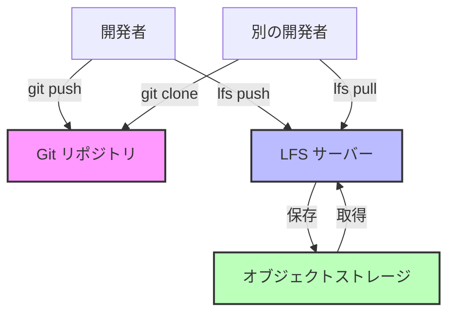

バージョン管理システムはテキストファイルの追跡に優れています。開発者はコードをコミットし、差分をレビューし、変更をシームレスにマージします。しかし、大容量のバイナリファイル——機械学習モデルの重み、ビデオアセット、コンパイル済みバイナリ——を導入すると、Git は停止してしまいます。リポジトリは数 GB に膨れ上がります。クローンには数時間かかります。単純な操作がタイムアウトします。

従来の Git は、リポジトリ履歴にすべてのファイルのすべてのバージョンを保存します。100MB のファイルを 10 回変更すると、1GB のリポジトリスペースを消費します。リポジトリをクローンするすべての開発者は、最新バージョンのみが必要な場合でも、すべてのバージョンをダウンロードします。コードに対して Git を強力にする分散型の性質が、大容量ファイルに対しては負担になります。

Git Large File Storage (LFS) は、リポジトリ内の大容量ファイルを小さなポインタファイルに置き換えることで、この問題に対処します。実際のファイルコンテンツは別のサーバーに保存されます。開発者は必要なバージョンのみをダウンロードします。リポジトリは小さく高速なままです。

このアプローチは理想的に聞こえますが、Git LFS は複雑性、インフラストラクチャ要件、新しい障害モードを導入します。LFS がいつ価値を追加するか——そしていつより簡単なアプローチで十分か——を理解することで、問題を解決するか作成するかが決まります。

この記事では、Git における大容量ファイルの技術的課題を探り、Git LFS の動作を検証し、いつ採用するかのガイダンスを提供し、さまざまなシナリオの代替案を提供します。

## 大容量ファイルの問題

Git のアーキテクチャは、大容量バイナリファイルに対して根本的な問題を引き起こします。

### Git がファイルを保存する方法

Git のストレージモデルはテキスト用に最適化されています：

!!!anote "📦 Git ストレージアーキテクチャ"
    **オブジェクトストレージ**
    - すべてのファイルバージョンは blob オブジェクト
    - `.git/objects/` ディレクトリに保存
    - 圧縮されているが完全なコピー
    - 類似ファイルの差分圧縮
    
    **リポジトリの成長**
    - 各コミットが新しい blob を追加
    - 履歴にはすべてのバージョンが含まれる
    - クローンは履歴全体をダウンロード
    - 部分的な履歴の取得は不可能
    
    **テキスト vs バイナリ**
    - テキスト：差分圧縮が効果的
    - バイナリ：圧縮は通常無効
    - 小さなテキスト変更：小さな差分
    - 小さなバイナリ変更：完全な新しいコピー

10KB のソースファイルをコミットすると、Git は効率的に保存します。1 行を変更すると、Git は差分のみを保存します。しかし、バイナリファイルは効果的に圧縮されることはほとんどありません。わずかに変更された 500MB の機械学習モデルでも、さらに 500MB を保存する必要があります。

### 実際の影響

大容量ファイルは具体的な問題を引き起こします：

!!!error "🚫 リポジトリの肥大化"
    **シナリオ：機械学習モデルのトレーニング**
    
    データサイエンスチームが各トレーニング実行後にモデルの重みをコミット：
    - 初期モデル：500MB
    - 20 回のトレーニング反復後：20 バージョン
    - リポジトリサイズ：10GB
    - 高速接続でのクローン時間：45 分
    
    **影響：**
    - 新しいチームメンバーは作業を開始するまで数時間待つ
    - CI/CD パイプラインがタイムアウト
    - Git 操作が遅くなる
    - 開発者が更新のプルを避ける
    
    **コスト：**
    - 生産性の損失：開発者 1 人あたり週 2 時間
    - インフラストラクチャ：より大きなストレージ、より多くの帯域幅
    - フラストレーション：「Git が壊れている」

!!!error "🚫 ネットワークボトルネック"
    **シナリオ：ゲームアセット開発**
    
    ゲームスタジオが Git で 3D モデルとテクスチャを追跡：
    - 100 個の高解像度テクスチャ：各 50MB
    - 50 個の 3D モデル：各 20MB
    - 6 ヶ月の履歴
    - リポジトリサイズ：15GB
    
    **影響：**
    - 低速接続のリモート開発者が作業できない
    - プッシュ/プル操作に 30 分以上かかる
    - バイナリファイルのマージ競合が解決不可能
    - チームが Git の放棄を検討
    
    **コスト：**
    - リモートワークが不可能になる
    - コラボレーションが中断
    - バージョン管理の利点が失われる

!!!error "🚫 ストレージコスト"
    **シナリオ：ビデオ制作**
    
    ビデオチームがバージョン管理のために生素材をコミット：
    - 4K ビデオクリップ：1 分あたり 1GB
    - プロジェクトライフサイクル中に 100 クリップ
    - クリップごとに複数のバージョン
    - リポジトリサイズ：500GB
    
    **影響：**
    - GitHub/GitLab のストレージ制限を超過
    - セルフホストサーバーに高価なストレージが必要
    - バックアップが高価で遅くなる
    - リポジトリが維持不可能になる
    
    **コスト：**
    - ストレージ：クラウドホスティング月額 $500
    - バックアップ：月額 $200
    - 開発者の時間：問題管理に月 10 時間
    - 合計：1 つのリポジトリで月額 $1,200

## Git LFS アーキテクチャ

Git LFS は大容量ファイルをポインタに置き換え、実際のコンテンツを別に保存します。

### LFS の動作

コアメカニズムはポインタの置換です：

!!!anote "🔍 LFS ポインタシステム"
    **ポインタファイル**
    
    version https://git-lfs.github.com/spec/v1
    oid sha256:4d7a214614ab2935c943f9e0ff69d22eadbb8f32b1258daaa5e2ca24d17e2393
    size 133742
    
    **何が起こるか**
    1. 開発者が大容量ファイルをコミット
    2. LFS がファイルを LFS サーバーにアップロード
    3. Git が小さなポインタファイル（130 バイト）を保存
    4. リポジトリが小さいまま
    
    **チェックアウト時**
    1. Git がポインタファイルをチェックアウト
    2. LFS がポインタを検出
    3. LFS がサーバーから実際のファイルをダウンロード
    4. ポインタを実際のファイルに置き換え
    
    **利点**
    - リポジトリにはポインタのみが含まれる
    - クローンは現在のバージョンのみをダウンロード
    - 履歴が軽量のまま
    - 大容量ファイルが効率的に保存される

ポインタファイルは非常に小さく——実際のファイルサイズに関係なく約 130 バイトです。5GB のモデルの重みは、Git 履歴では 130 バイトのポインタになります。リポジトリは高速なままです。

### LFS サーバーアーキテクチャ

LFS には追加のインフラストラクチャが必要です：

!!!anote "🏗️ LFS インフラストラクチャ"
    **コンポーネント**
    - Git リポジトリ：ポインタを保存
    - LFS サーバー：大容量ファイルを管理
    - オブジェクトストレージ：実際のコンテンツを保存
    - 認証：アクセスを制御
    
    **ホスティングオプション**
    - GitHub：無料 1GB、有料プランあり
    - GitLab：リポジトリあたり無料 10GB
    - Bitbucket：無料 1GB、有料プランあり
    - セルフホスト：完全な制御、より複雑
    
    **要件**
    - Git とは別のストレージ
    - アップロード/ダウンロード用のネットワーク帯域幅
    - 認証統合
    - バックアップ戦略

完全に分散された通常の Git とは異なり、LFS は集中型コンポーネントを導入します。LFS サーバーは重要な依存関係になります。ダウンしている場合、開発者は大容量ファイルにアクセスできません。

## Git LFS をいつ使用するか

LFS は特定の問題を解決しますが、常に正しい選択とは限りません。

### LFS に適した候補

LFS は特定のファイルタイプに適しています：

!!!success "✅ 積極的に開発中のバイナリアセット"
    ゲームスタジオやデザインチームは、開発中に頻繁に変更されるバイナリアセットを扱います。3D キャラクターモデルは、アーティストが比率、テクスチャ、アニメーションを調整するため、数十回の反復を経る可能性があります。マーケティング資料のデザインファイルは、利害関係者がフィードバックを提供するにつれて進化します。オーディオクリップは、タイミングとミキシングのために調整されます。
    
    これらのファイルは通常の Git には大きすぎます——高解像度テクスチャは 50MB、キャラクターモデルは 30MB、Photoshop コンポジションは 100MB かもしれません。LFS がなければ、リポジトリは数週間の開発後に数 GB に膨れ上がります。しかし、これらのアセットにはバージョン管理が必要です。アーティストは変更をロールバックし、バージョンを比較し、お互いの作業を上書きせずに協力する必要があります。
    
    LFS はこれを完璧に解決します。リポジトリは小さいまま——数百のアセットがあっても 100MB 未満です。アーティストはリポジトリサイズを心配せずに直接コミットできます。バージョン履歴が保持されます。競合が発生した場合、Git ワークフローで表示されます。チームはパフォーマンスペナルティなしでバージョン管理のすべての利点を得ます。
    
**例：ゲーム開発**
- キャラクターモデル：各 50MB
- テクスチャファイル：各 20MB
- オーディオクリップ：各 10MB
- 合計：500 ファイル、15GB のアセット
- LFS を使用したリポジトリサイズ：80MB

!!!success "✅ 機械学習モデルのチェックポイント"
    データサイエンティストがモデルをトレーニングするには、実験を追跡する必要があります。異なるハイパーパラメータでトレーニングされたモデルは、異なる重みを生成します。これらのバージョンを比較するには、複数のチェックポイントを保持する必要があります。バージョン管理がなければ、チームは手動の命名スキーム——model_v1.bin、model_v2_final.bin、model_v2_final_actually_final.bin——に頼り、すぐに維持不可能になります。
    
    モデルの重みは通常 100MB から 4GB の範囲です。これらのファイルは通常の Git には大きすぎますが、LFS には最適です。主な利点は、コードをモデルにリンクすることです。特定のコミットをチェックアウトすると、トレーニングコードとそれが生成したモデルの重みの両方が得られます。これにより真の再現性が実現されます——特定のモデルが特定のコードとハイパーパラメータから来たことを検証できます。
    
    LFS は最大約 4GB のモデルに適しています——このサイズ制限は、ほとんどのファイルシステムに適合するように選択されました。それを超えると、DVC や Weights & Biases のような専門ツールがより良いワークフローを提供します。しかし、小型から中型のモデルの場合、LFS はバージョン管理への最も簡単なパスを提供します。
    
**例：ディープラーニングプロジェクト**
- モデルチェックポイント：各 200MB - 4GB
- 10 実験、各 5 チェックポイント
- 合計：50 ファイル、10GB
- LFS を使用したリポジトリサイズ：120MB
- 利点：コードとモデルが同期を保つ

!!!success "✅ ドキュメントアセット"
    技術ドキュメントには、バイナリアセット——ビデオチュートリアル、独自形式のアーキテクチャ図、PDF エクスポート——が含まれることがよくあります。これらのアセットは、それらが文書化するコードと一緒にバージョン管理されるべきです。コードが変更されると、ドキュメントが更新されます。それらを同期させることで、古いドキュメントの一般的な問題を防ぎます。
    
    ドキュメントアセットはコードよりも変更頻度が低く、LFS に理想的です。ビデオチュートリアルは一度録画され、四半期ごとに更新される可能性があります。アーキテクチャ図はメジャーリリースとともに進化します。適度なファイルサイズ——通常 10MB から 200MB——と頻繁でない更新は、LFS ストレージコストが低いままであることを意味します。
    
    代替案はドキュメントを別々に保存することですが、これはコードとドキュメント間の接続を壊します。LFS を使用すると、リリースタグをチェックアウトすると、コードとそれを説明するドキュメントの両方が得られます。ライターはリポジトリに直接コミットできます。チームは単一の真実のソースを維持します。
    
**例：製品ドキュメント**
- ビデオチュートリアル：各 100MB
- 図のソース（Visio、Sketch）：各 10MB
- PDF エクスポート：各 5MB
- 合計：50 ファイル、2GB
- LFS を使用したリポジトリサイズ：90MB

### LFS が適さない場合

多くのシナリオは LFS に適していません：

!!!warning "⚠️ 本当に大容量のファイル（> 4GB）"
    LFS は部分的なファイルダウンロードをサポートしていません。ファイルをチェックアウトすると、全体をダウンロードします。これにより、LFS は約 4GB を超えるファイルには実用的ではありません——このサイズ制限は、FAT32 を含むほとんどのファイルシステムに適合するように選択されました。
    
    50GB の生ビデオファイルは、一般的な接続で数時間かかります。100GB のデータセットは LFS ワークフローには大きすぎます。ネットワークが処理できても、LFS サーバーのストレージコストが法外になります。50GB ファイルの 10 バージョンは 500GB の LFS ストレージを消費します。
    
    これらのファイルには、参照を含む外部ストレージの方が適しています。ファイルを S3 または類似のオブジェクトストレージに保存します。ストレージの場所とチェックサムを含む小さなメタデータファイルを Git にコミットします。必要なときにのみ大容量ファイルをダウンロードします。このアプローチは任意のファイルサイズをサポートし、部分ダウンロードを有効にし、スケールでコストが低くなります。
    
**例：ビデオ制作**
- 4K 生素材：ファイルあたり 50GB
- プロジェクトライフサイクル中に 20 クリップ
- 合計：1TB
- LFS コスト：法外
- より良い方法：Git のマニフェストを含む S3

!!!warning "⚠️ ビルド成果物"
    コンパイルされたバイナリ、パッケージ化されたアプリケーション、その他のビルド出力は、バージョン管理にまったく含めるべきではありません。これらは生成されたファイル——ビルドプロセスの出力であり、ソース入力ではありません。バージョン管理はソース用です。
    
    ビルド成果物をコミットすると問題が発生します。リポジトリはビルドごとに成長します。開発者は必要のない成果物をダウンロードします。履歴がノイズで満たされます。特定のビルドが必要な場合、どのソースコードがそれを生成したかわかりません。
    
    Artifactory や Nexus のような成果物リポジトリは、これを適切に解決します。それらはビルド出力を、ソースコミットにリンクするメタデータとともに保存します。任意のビルドを取得し、正確なソースコードまで追跡できます。ストレージはバイナリ用に最適化されています。古い成果物は自動的にクリーンアップできます。これは仕事に適したツールです。
    
**例：アプリケーションリリース**
- コンパイルされたバイナリ：200MB
- 毎日のビルド：年間 365 回
- 合計：年間 73GB
- 間違い：LFS または Git
- 正しい：Git タグを含む Artifactory

!!!warning "⚠️ 頻繁に変更される大容量ファイル"
    LFS ストレージはバージョンごとに成長します。毎日変更される 1GB のファイルは、年間 365GB の LFS ストレージを作成します。データベースダンプ、ログファイル、頻繁に変更されるキャッシュファイルは、保存するのに高価で、ほとんど価値を提供しません。
    
    これらのファイルはバージョン管理の恩恵を受けません。昨日のデータベースダンプと今日のものを比較する必要はほとんどありません。ログファイルはログ管理ツールで分析する方が良いです。キャッシュファイルは本質的に一時的です。それらの履歴を追跡することはストレージを無駄にし、利益を提供しません。
    
    解決策は簡単です：これらのファイルをバージョン管理しないでください。`.gitignore` に追加します。ローカルまたは適切なシステムに保存します——データ用のデータベース、ログ用のログアグリゲーター、キャッシュ用の一時ストレージ。バージョン管理は履歴が重要なファイル用です。
    
    **例：開発データベース**
    - データベースダンプ：2GB
    - 開発中に毎日更新
    - 30 日：60GB の LFS ストレージ
    - 価値：最小（最新のみが必要）
    - より良い方法：ローカルファイル、必要に応じて再生成

!!!warning "⚠️ LFS サーバーが利用できない"
    LFS には Git を超えるインフラストラクチャが必要です。一部の企業ネットワークは LFS エンドポイントをブロックします。一部の Git ホスティングプロバイダーは LFS をサポートしていません。セルフホスティングには LFS サーバーとオブジェクトストレージの維持が必要です。
    
    LFS インフラストラクチャがなければ、大容量ファイルをプッシュまたはプルできません。それらのファイルを必要とするチームメンバーにとって、リポジトリは使用不可能になります。このインフラストラクチャ依存性は実際の制限です——完全に分散された通常の Git とは異なり、LFS は利用可能でなければならない集中型コンポーネントを導入します。
    
    LFS インフラストラクチャが利用できないか信頼できない場合は、代替アプローチを使用してください。参照を含む外部ストレージは特別なインフラストラクチャなしで機能します。DVC のような専門ツールは、任意の S3 互換ストレージを使用できます。時には最も簡単な解決策は、大容量ファイルをバージョン管理から完全に除外することです。

## 実際の実装

LFS を効果的に使用するには、そのワークフローと制限を理解する必要があります。

### Git LFS のセットアップ

基本的なセットアップは簡単です：

!!!anote "🔧 LFS セットアップ手順"
    **インストール**
    
    LFS をインストール：
    git lfs install
    
    ファイルタイプを追跡：
    git lfs track "*.psd"
    git lfs track "*.bin"
    git lfs track "models/*.h5"
    
    追跡設定をコミット：
    git add .gitattributes
    git commit -m "Configure LFS tracking"
    
    **作成されるもの**
    
    .gitattributes ファイル：
    
    *.psd filter=lfs diff=lfs merge=lfs -text
    *.bin filter=lfs diff=lfs merge=lfs -text
    models/*.h5 filter=lfs diff=lfs merge=lfs -text
    
    **LFS の使用**
    
    通常通り追加してコミット：
    git add model.bin
    git commit -m "Add trained model"
    
    プッシュは Git と LFS の両方に送信：
    git push origin main
    
    クローンは自動的に LFS ファイルを取得：
    git clone https://github.com/user/repo.git

`.gitattributes` ファイルは、どのファイルを LFS で処理するかを Git に伝えます。設定されると、LFS はほとんどの操作で透過的に機能します。

### 一般的なワークフロー

異なるシナリオには異なるアプローチが必要です：

!!!anote "📋 LFS ワークフロー"
    **選択的チェックアウト**
    
    LFS ファイルをダウンロードせずにクローン：
    GIT_LFS_SKIP_SMUDGE=1 git clone repo.git
    
    後で特定のファイルをダウンロード：
    git lfs pull --include="models/production/*"
    
    **古いバージョンの削除**
    
    ローカルキャッシュから古い LFS ファイルを削除：
    git lfs prune
    
    最近のバージョンのみを保持：
    git lfs prune --verify-remote --recent
    
    **既存ファイルの移行**
    
    既存ファイルを LFS に変換：
    git lfs migrate import --include="*.psd"
    
    履歴を書き換え（注意！）：
    git lfs migrate import --include="*.bin" --everything
    
    **LFS ステータスの確認**
    
    追跡されているファイルを確認：
    git lfs ls-files
    
    LFS ストレージ使用量を確認：
    git lfs env

### 一般的な問題のトラブルシューティング

LFS は新しい障害モードを導入します：

!!!warning "⚠️ 一般的な LFS 問題"
    **「This exceeds GitHub's file size limit」**
    - 原因：LFS 追跡なしでファイルがコミットされた
    - 解決策：コミット前に `.gitattributes` を設定
    - 予防：早期に LFS 追跡を設定
    
    **「Error downloading object」**
    - 原因：LFS サーバーに到達できないかファイルが見つからない
    - 解決策：ネットワークを確認、LFS サーバーステータスを検証
    - 回避策：一時的に LFS ファイルをスキップ
    
    **「Encountered X file(s) that should have been pointers」**
    - 原因：LFS が設定される前にファイルがコミットされた
    - 解決策：`git lfs migrate` を使用して履歴を修正
    - 予防：最初のコミット前に LFS を設定
    
    **クローン/プルが遅い**
    - 原因：多くの大容量 LFS ファイルをダウンロード
    - 解決策：選択的ダウンロードに `GIT_LFS_SKIP_SMUDGE=1` を使用
    - 代替案：必要なファイルのみを取得

## Git LFS の代替案

多くのシナリオには LFS よりも良い解決策があります。

### 参照を含む外部ストレージ

本当に大容量のファイルには、代わりに参照を保存します：

!!!tip "💡 参照ベースのアプローチ"
    **アーキテクチャ**
    - ファイルを S3、GCS、または類似のサービスに保存
    - Git にメタデータと参照をコミット
    - 必要に応じてファイルをダウンロード
    - オブジェクトストレージを通じてバージョン管理
    
**例の構造**

repo/
├── models/
│   ├── config.yaml          # Git 内
│   └── download.sh          # Git 内
└── data/
    ├── manifest.json        # Git 内
    └── fetch_data.py        # Git 内

**利点**
- LFS インフラストラクチャが不要
- 任意のファイルサイズをサポート
- 柔軟なストレージオプション
- スケールでコストが低い
- 部分ダウンロードが可能

このアプローチは、データセット、大型モデル、ビデオファイルに適しています。リポジトリは小さく高速なままです。ストレージコストが低くなります。チームはより柔軟性があります。

### 専門ツール

異なるドメインには専用のソリューションがあります：

!!!anote "🛠️ ドメイン固有ツール"
    **機械学習**
    - DVC (Data Version Control)：データ/モデル用の Git ライク
    - Weights & Biases：実験追跡
    - MLflow：モデルレジストリ
    - Hugging Face：モデルホスティング
    
    **ゲーム開発**
    - Perforce：大容量バイナリファイル用に設計
    - Plastic SCM：大容量アセットをうまく処理
    - Unity Collaborate：Unity プロジェクト用に構築
    
    **メディア制作**
    - Frame.io：ビデオコラボレーション
    - Dropbox：シンプルなファイル同期
    - Resilio Sync：P2P ファイル同期
    
    **ビルド成果物**
    - Artifactory：ユニバーサル成果物リポジトリ
    - Nexus：Maven/npm/Docker レジストリ
    - Docker Hub：コンテナイメージ

これらのツールは、汎用バージョン管理よりも特定の問題をよりよく解決します。それらはドメイン要件を理解し、それに応じて最適化します。

## 結論

Git LFS は、バージョン管理が必要なバイナリアセットを扱うチームの実際の問題を解決します。それは、そうでなければ Git を肥大化させるファイルの履歴を保持しながら、リポジトリを高速に保ちます。

しかし、LFS は万能のソリューションではありません。インフラストラクチャが必要で、複雑性を追加し、サイズ制限があります。4GB を超えるファイルの場合、メタデータ参照を含む専門ストレージの方が適しています。ビルド成果物の場合、専用の成果物リポジトリがより適切です。大規模なデータセットの場合、DVC のようなツールがより良いワークフローを提供します。

鍵は、ツールを問題に合わせることです。積極的に開発中のバイナリアセット——3D モデル、デザインファイル、小型 ML モデル——に LFS を使用します。大型の静的ファイルには外部ストレージを使用します。ドメイン固有のニーズには専門ツールを使用します。バージョン管理が必要ないファイルには何も使用しません。

Git LFS は正しく適用されると強力です。その強みと制限を理解することで、問題を作成するのではなく解決することが保証されます。

!!!tip "💡 意思決定フレームワーク"
    **Git LFS を使用する場合：**
    - バイナリファイルにバージョン履歴が必要
    - ファイルサイズが 10MB - 2GB
    - チームがアセットで協力
    - LFS インフラストラクチャが利用可能
    
    **外部ストレージを使用する場合：**
    - ファイルが 4GB を超える
    - 詳細な履歴が不要
    - 部分ダウンロードが必要
    - 非常に頻繁な更新
    
    **専門ツールを使用する場合：**
    - ドメイン固有の要件
    - 高度な機能が必要
    - チームがすでに使用している
    - より良いワークフローの適合
    
    **何も使用しない場合：**
    - ファイルが生成された成果物
    - 一時またはキャッシュファイル
    - 簡単に再作成できる
    - コラボレーションが不要
