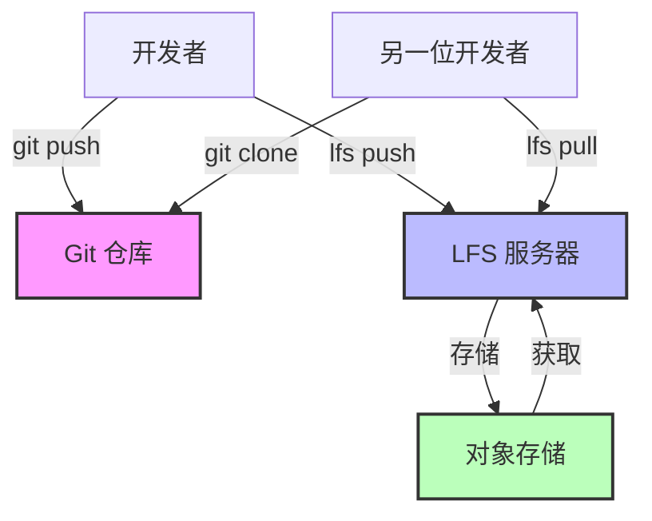

版本控制系统擅长跟踪文本文件。开发者提交代码、审查差异、无缝合并变更。但当引入大型二进制文件——机器学习模型权重、视频素材、编译后的二进制文件——Git 就会陷入停滞。仓库膨胀到数 GB。克隆需要数小时。简单的操作就会超时。

传统的 Git 会在仓库历史中存储每个文件的每个版本。一个 100MB 的文件修改十次会消耗 1GB 的仓库空间。每个克隆仓库的开发者都会下载所有版本，即使他们只需要最新版本。让 Git 在代码管理上如此强大的分布式特性，在处理大型文件时反而成为负担。

Git Large File Storage (LFS) 通过将大型文件替换为仓库中的小型指针文件来解决这个问题。实际的文件内容存放在独立的服务器上。开发者只下载他们需要的版本。仓库保持小巧且快速。

这种方法听起来很理想，但 Git LFS 引入了复杂性、基础设施需求和新的故障模式。了解 LFS 何时能增加价值——以及何时更简单的方法就足够——决定了它是解决问题还是制造问题。

本文探讨 Git 中大型文件的技术挑战，检视 Git LFS 的运作方式，提供何时采用它的指引，并针对不同情境提供替代方案。

## 大型文件问题

Git 的架构在处理大型二进制文件时会产生根本性的问题。

### Git 如何存储文件

Git 的存储模型针对文本进行优化：

!!!anote "📦 Git 存储架构"
    **对象存储**
    - 每个文件版本都是一个 blob 对象
    - 存储在 `.git/objects/` 目录中
    - 压缩但完整的副本
    - 对相似文件进行差异压缩
    
    **仓库增长**
    - 每次提交都会添加新的 blob
    - 历史包含所有版本
    - 克隆会下载整个历史
    - 无法只获取部分历史
    
    **文本 vs 二进制**
    - 文本：差异压缩效果良好
    - 二进制：压缩通常无效
    - 小型文本变更：小型差异
    - 小型二进制变更：完整的新副本

当你提交一个 10KB 的源文件时，Git 会高效地存储它。修改一行，Git 只存储差异。但二进制文件很少能有效压缩。一个稍微修改的 500MB 机器学习模型仍然需要存储另外 500MB。

### 实际影响

大型文件会产生具体的问题：

!!!error "🚫 仓库膨胀"
    **场景：机器学习模型训练**
    
    数据科学团队在每次训练执行后提交模型权重：
    - 初始模型：500MB
    - 20 次训练迭代后：20 个版本
    - 仓库大小：10GB
    - 在快速连接上的克隆时间：45 分钟
    
    **影响：**
    - 新团队成员需要等待数小时才能开始工作
    - CI/CD 流水线超时
    - Git 操作变慢
    - 开发者避免拉取更新
    
    **成本：**
    - 生产力损失：每位开发者每周 2 小时
    - 基础设施：更大的存储空间、更多带宽
    - 挫折感：「Git 坏掉了」

!!!error "🚫 网络瓶颈"
    **场景：游戏素材开发**
    
    游戏工作室在 Git 中跟踪 3D 模型和纹理：
    - 100 个高分辨率纹理：每个 50MB
    - 50 个 3D 模型：每个 20MB
    - 6 个月的历史
    - 仓库大小：15GB
    
    **影响：**
    - 连接速度慢的远程开发者无法工作
    - 推送/拉取操作需要 30 分钟以上
    - 二进制文件的合并冲突无法解决
    - 团队考虑放弃 Git
    
    **成本：**
    - 远程工作变得不可能
    - 协作中断
    - 失去版本控制的好处

!!!error "🚫 存储成本"
    **场景：视频制作**
    
    视频团队提交原始素材以进行版本控制：
    - 4K 视频片段：每分钟 1GB
    - 项目生命周期中有 100 个片段
    - 每个片段有多个版本
    - 仓库大小：500GB
    
    **影响：**
    - 超过 GitHub/GitLab 存储限制
    - 自建服务器需要昂贵的存储空间
    - 备份变得昂贵且缓慢
    - 仓库变得无法维护
    
    **成本：**
    - 存储：云端托管每月 $500
    - 备份：每月 $200
    - 开发者时间：每月 10 小时管理问题
    - 总计：一个仓库每月 $1,200

## Git LFS 架构

Git LFS 用指针替换大型文件，同时将实际内容分开存储。

### LFS 如何运作

核心机制是指针替换：

!!!anote "🔍 LFS 指针系统"
    **指针文件**
    
    version https://git-lfs.github.com/spec/v1
    oid sha256:4d7a214614ab2935c943f9e0ff69d22eadbb8f32b1258daaa5e2ca24d17e2393
    size 133742
    
    **发生的事情**
    1. 开发者提交大型文件
    2. LFS 将文件上传到 LFS 服务器
    3. Git 存储小型指针文件（130 字节）
    4. 仓库保持小巧
    
    **检出时**
    1. Git 检出指针文件
    2. LFS 检测到指针
    3. LFS 从服务器下载实际文件
    4. 用真实文件替换指针
    
    **好处**
    - 仓库只包含指针
    - 克隆只下载当前版本
    - 历史保持轻量
    - 大型文件高效存储

指针文件非常小——无论实际文件大小如何，大约 130 字节。一个 5GB 的模型权重在 Git 历史中变成 130 字节的指针。仓库保持快速。

### LFS 服务器架构

LFS 需要额外的基础设施：

!!!anote "🏗️ LFS 基础设施"
    **组件**
    - Git 仓库：存储指针
    - LFS 服务器：管理大型文件
    - 对象存储：存储实际内容
    - 身份验证：控制访问
    
    **托管选项**
    - GitHub：免费 1GB，提供付费方案
    - GitLab：每个仓库免费 10GB
    - Bitbucket：免费 1GB，提供付费方案
    - 自建：完全控制，更复杂
    
    **需求**
    - 与 Git 分开的存储空间
    - 上传/下载的网络带宽
    - 身份验证集成
    - 备份策略

与完全分布式的普通 Git 不同，LFS 引入了集中式组件。LFS 服务器成为关键依赖项。如果它停机，开发者就无法访问大型文件。

## 何时使用 Git LFS

LFS 解决特定问题，但并非总是正确的选择。

### 适合 LFS 的候选文件

LFS 适用于某些文件类型：

!!!success "✅ 积极开发中的二进制素材"
    游戏工作室和设计团队处理在开发过程中频繁变更的二进制素材。一个 3D 角色模型可能会经历数十次迭代，因为艺术家会调整比例、纹理和动画。营销材料的设计文件会随着利益相关者提供反馈而演变。音频片段会针对时间和混音进行调整。
    
    这些文件对于普通 Git 来说太大了——高分辨率纹理可能是 50MB，角色模型 30MB，Photoshop 合成文件 100MB。没有 LFS，仓库在几周的开发后就会膨胀到数 GB。但这些素材需要版本控制。艺术家需要回滚变更、比较版本，并在不覆盖彼此工作的情况下协作。
    
    LFS 完美地解决了这个问题。仓库保持小巧——即使有数百个素材也低于 100MB。艺术家可以直接提交而不用担心仓库大小。版本历史得以保留。当发生冲突时，它们在 Git 工作流程中是可见的。团队获得版本控制的所有好处，而没有性能损失。
    
**示例：游戏开发**
- 角色模型：每个 50MB
- 纹理文件：每个 20MB
- 音频片段：每个 10MB
- 总计：500 个文件，15GB 的素材
- 使用 LFS 的仓库大小：80MB

!!!success "✅ 机器学习模型检查点"
    数据科学家训练模型需要跟踪实验。使用不同超参数训练的模型会产生不同的权重。比较这些版本需要保留多个检查点。没有版本控制，团队会采用手动命名方案——model_v1.bin、model_v2_final.bin、model_v2_final_actually_final.bin——这很快就会变得无法维护。
    
    模型权重通常范围从 100MB 到 4GB。这些文件对于普通 Git 来说太大，但对 LFS 来说很完美。关键好处是将代码链接到模型。当你检出特定提交时，你会同时获得训练代码和它产生的模型权重。这实现了真正的可重现性——你可以验证特定模型来自特定的代码和超参数。
    
    LFS 适用于最大约 4GB 的模型——选择这个大小限制是为了适应大多数文件系统。超过这个大小，像 DVC 或 Weights & Biases 这样的专门工具提供更好的工作流程。但对于小型到中型模型，LFS 提供了最简单的版本控制路径。
    
**示例：深度学习项目**
- 模型检查点：每个 200MB - 4GB
- 10 个实验，每个 5 个检查点
- 总计：50 个文件，10GB
- 使用 LFS 的仓库大小：120MB
- 好处：代码和模型保持同步

!!!success "✅ 文档素材"
    技术文档通常包含二进制素材——视频教程、专有格式的架构图、PDF 导出。这些素材应该与它们记录的代码一起版本化。当代码变更时，文档会更新。保持它们同步可以防止文档过时的常见问题。
    
    文档素材的变更频率低于代码，使它们成为 LFS 的理想选择。视频教程可能录制一次，每季更新一次。架构图随着主要版本演变。适中的文件大小——通常 10MB 到 200MB——和不频繁的更新意味着 LFS 存储成本保持低廉。
    
    替代方案是分开存储文档，但这会破坏代码和文档之间的链接。使用 LFS，检出发布标签会同时给你代码和描述它的文档。撰写者可以直接提交到仓库。团队维护单一真实来源。
    
**示例：产品文档**
- 视频教程：每个 100MB
- 图表源文件（Visio、Sketch）：每个 10MB
- PDF 导出：每个 5MB
- 总计：50 个文件，2GB
- 使用 LFS 的仓库大小：90MB

### LFS 不适用的情况

许多场景不适合使用 LFS：

!!!warning "⚠️ 真正的大型文件（> 4GB）"
    LFS 不支持部分文件下载。当你检出文件时，你会下载整个文件。这使得 LFS 对于大于约 4GB 的文件不切实际——选择这个大小限制是为了适应包括 FAT32 在内的大多数文件系统。
    
    一个 50GB 的原始视频文件在典型连接上需要数小时才能下载。一个 100GB 的数据集对于 LFS 工作流程来说太大了。即使你的网络可以处理，LFS 服务器存储成本也会变得过高。一个 50GB 文件的十个版本会消耗 500GB 的 LFS 存储空间。
    
    对于这些文件，带有引用的外部存储效果更好。将文件存储在 S3 或类似的对象存储中。将带有存储位置和校验和的小型元数据文件提交到 Git。只在需要时下载大型文件。这种方法支持任何文件大小，启用部分下载，并且在规模上成本更低。
    
**示例：视频制作**
- 4K 原始素材：每个文件 50GB
- 项目生命周期中有 20 个片段
- 总计：1TB
- LFS 成本：过高
- 更好的方案：S3 搭配 Git 中的清单

!!!warning "⚠️ 构建产物"
    编译后的二进制文件、打包的应用程序和其他构建输出根本不应该在版本控制中。这些是生成的文件——构建过程的输出，而不是源输入。版本控制是用于源代码的。
    
    提交构建产物会产生问题。仓库随着每次构建而增长。开发者下载他们不需要的产物。历史充满噪音。当你需要特定构建时，你无法分辨是哪个源代码产生的。
    
    像 Artifactory 或 Nexus 这样的产物仓库可以正确地解决这个问题。它们存储构建输出，并带有链接到源提交的元数据。你可以获取任何构建并追溯到确切的源代码。存储针对二进制文件进行优化。旧产物可以自动清理。这是适合这项工作的正确工具。
    
**示例：应用程序发布**
- 编译后的二进制文件：200MB
- 每日构建：每年 365 次
- 总计：每年 73GB
- 错误：LFS 或 Git
- 正确：Artifactory 搭配 Git 标签

!!!warning "⚠️ 频繁变更的大型文件"
    LFS 存储随着每个版本而增长。每天修改的 1GB 文件每年会产生 365GB 的 LFS 存储空间。数据库转储、日志文件和频繁变更的缓存文件存储成本高昂，且提供的价值很少。
    
    这些文件不受益于版本控制。你很少需要比较昨天的数据库转储和今天的。日志文件用日志管理工具分析更好。缓存文件本质上是临时的。跟踪它们的历史浪费存储空间且没有好处。
    
    解决方案很简单：不要版本化这些文件。将它们加入 `.gitignore`。在本地或适当的系统中存储它们——数据库用于数据，日志聚合器用于日志，临时存储用于缓存。版本控制是用于历史重要的文件。
    
    **示例：开发数据库**
    - 数据库转储：2GB
    - 开发期间每天更新
    - 30 天：60GB 的 LFS 存储空间
    - 价值：最小（只需要最新的）
    - 更好的方案：本地文件，根据需要重新生成

!!!warning "⚠️ 没有可用的 LFS 服务器"
    LFS 需要 Git 之外的基础设施。某些企业网络会阻止 LFS 端点。某些 Git 托管提供商不支持 LFS。自建需要维护 LFS 服务器和对象存储。
    
    没有 LFS 基础设施，你无法推送或拉取大型文件。对于需要这些文件的团队成员来说，仓库变得无法使用。这种基础设施依赖性是一个真正的限制——与完全分布式的普通 Git 不同，LFS 引入了必须可用的集中式组件。
    
    如果 LFS 基础设施不可用或不可靠，请使用替代方法。带有引用的外部存储不需要特殊基础设施。像 DVC 这样的专门工具可以使用任何 S3 兼容的存储。有时最简单的解决方案是完全不将大型文件纳入版本控制。

## 实际实现

有效使用 LFS 需要了解其工作流程和限制。

### 设置 Git LFS

基本设置很简单：

!!!anote "🔧 LFS 设置步骤"
    **安装**
    
    安装 LFS：
    git lfs install
    
    跟踪文件类型：
    git lfs track "*.psd"
    git lfs track "*.bin"
    git lfs track "models/*.h5"
    
    提交跟踪配置：
    git add .gitattributes
    git commit -m "Configure LFS tracking"
    
    **创建的内容**
    
    .gitattributes 文件：
    
    *.psd filter=lfs diff=lfs merge=lfs -text
    *.bin filter=lfs diff=lfs merge=lfs -text
    models/*.h5 filter=lfs diff=lfs merge=lfs -text
    
    **使用 LFS**
    
    正常添加和提交：
    git add model.bin
    git commit -m "Add trained model"
    
    推送会同时发送到 Git 和 LFS：
    git push origin main
    
    克隆会自动获取 LFS 文件：
    git clone https://github.com/user/repo.git

`.gitattributes` 文件告诉 Git 哪些文件要用 LFS 处理。一旦配置完成，LFS 对大多数操作来说都是透明的。

### 常见工作流程

不同的场景需要不同的方法：

!!!anote "📋 LFS 工作流程"
    **选择性检出**
    
    克隆时不下载 LFS 文件：
    GIT_LFS_SKIP_SMUDGE=1 git clone repo.git
    
    稍后下载特定文件：
    git lfs pull --include="models/production/*"
    
    **清理旧版本**
    
    从本地缓存移除旧的 LFS 文件：
    git lfs prune
    
    只保留最近的版本：
    git lfs prune --verify-remote --recent
    
    **迁移现有文件**
    
    将现有文件转换为 LFS：
    git lfs migrate import --include="*.psd"
    
    重写历史（小心！）：
    git lfs migrate import --include="*.bin" --everything
    
    **检查 LFS 状态**
    
    查看哪些文件被跟踪：
    git lfs ls-files
    
    检查 LFS 存储使用量：
    git lfs env

### 疑难排解常见问题

LFS 引入了新的故障模式：

!!!warning "⚠️ 常见 LFS 问题"
    **「This exceeds GitHub's file size limit」**
    - 原因：文件在没有 LFS 跟踪的情况下提交
    - 解决方案：在提交前配置 `.gitattributes`
    - 预防：及早设置 LFS 跟踪
    
    **「Error downloading object」**
    - 原因：LFS 服务器无法连接或文件丢失
    - 解决方案：检查网络，验证 LFS 服务器状态
    - 应对措施：暂时跳过 LFS 文件
    
    **「Encountered X file(s) that should have been pointers」**
    - 原因：文件在配置 LFS 之前提交
    - 解决方案：使用 `git lfs migrate` 修复历史
    - 预防：在第一次提交前配置 LFS
    
    **克隆/拉取缓慢**
    - 原因：下载许多大型 LFS 文件
    - 解决方案：使用 `GIT_LFS_SKIP_SMUDGE=1` 进行选择性下载
    - 替代方案：只获取需要的文件

## Git LFS 的替代方案

许多场景有比 LFS 更好的解决方案。

### 带有引用的外部存储

对于真正的大型文件，改为存储引用：

!!!tip "💡 基于引用的方法"
    **架构**
    - 将文件存储在 S3、GCS 或类似服务中
    - 在 Git 中提交元数据和引用
    - 根据需要下载文件
    - 通过对象存储进行版本控制
    
**示例结构**

repo/
├── models/
│   ├── config.yaml          # 在 Git 中
│   └── download.sh          # 在 Git 中
└── data/
    ├── manifest.json        # 在 Git 中
    └── fetch_data.py        # 在 Git 中

**好处**
- 不需要 LFS 基础设施
- 支持任何文件大小
- 灵活的存储选项
- 规模化时成本更低
- 可能进行部分下载

这种方法适用于数据集、大型模型和视频文件。仓库保持小巧且快速。存储成本更低。团队有更多灵活性。

### 专门工具

不同领域有专门构建的解决方案：

!!!anote "🛠️ 领域特定工具"
    **机器学习**
    - DVC (Data Version Control)：类似 Git 的数据/模型版本控制
    - Weights & Biases：实验跟踪
    - MLflow：模型注册表
    - Hugging Face：模型托管
    
    **游戏开发**
    - Perforce：专为大型二进制文件设计
    - Plastic SCM：处理大型素材效果良好
    - Unity Collaborate：为 Unity 项目构建
    
    **媒体制作**
    - Frame.io：视频协作
    - Dropbox：简单的文件同步
    - Resilio Sync：P2P 文件同步
    
    **构建产物**
    - Artifactory：通用产物仓库
    - Nexus：Maven/npm/Docker 注册表
    - Docker Hub：容器镜像

这些工具比通用版本控制更好地解决特定问题。它们了解领域需求并相应地进行优化。

## 结论

Git LFS 为需要版本控制的二进制素材团队解决了实际问题。它保持仓库快速，同时为否则会使 Git 膨胀的文件保留历史。

但 LFS 不是通用解决方案。它需要基础设施、增加复杂性，并有大小限制。对于大于 4GB 的文件，带有元数据引用的专门存储效果更好。对于构建产物，专用的产物仓库更合适。对于大量数据集，像 DVC 这样的工具提供更好的工作流程。

关键是将工具与问题匹配。对积极开发中的二进制素材使用 LFS——3D 模型、设计文件、小型机器学习模型。对大型静态文件使用外部存储。对领域特定需求使用专门工具。对不需要版本控制的文件什么都不用。

Git LFS 在正确应用时很强大。了解其优势和限制可确保它解决问题而不是制造问题。

!!!tip "💡 决策框架"
    **使用 Git LFS 当：**
    - 二进制文件需要版本历史
    - 文件大小为 10MB - 2GB
    - 团队在素材上协作
    - LFS 基础设施可用
    
    **使用外部存储当：**
    - 文件超过 4GB
    - 不需要详细历史
    - 需要部分下载
    - 非常频繁的更新
    
    **使用专门工具当：**
    - 领域特定需求
    - 需要高级功能
    - 团队已经在使用它们
    - 更适合的工作流程
    
    **什么都不用当：**
    - 文件是生成的产物
    - 临时或缓存文件
    - 可以轻松重新创建
    - 不需要协作
