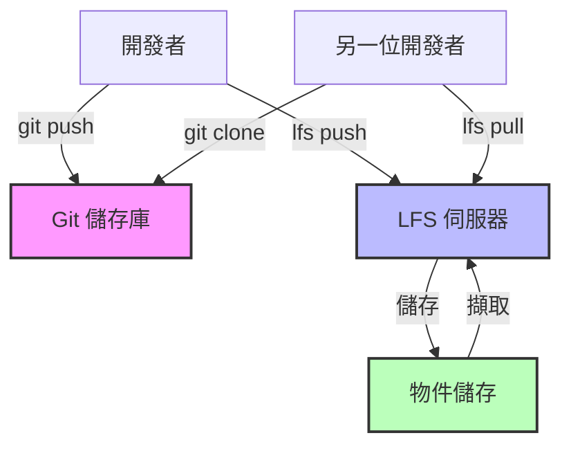

版本控制系統擅長追蹤文字檔案。開發者提交程式碼、審查差異、無縫合併變更。但當引入大型二進位檔案——機器學習模型權重、影片素材、編譯後的二進位檔——Git 就會陷入停滯。儲存庫膨脹到數 GB。複製需要數小時。簡單的操作就會逾時。

傳統的 Git 會在儲存庫歷史中儲存每個檔案的每個版本。一個 100MB 的檔案修改十次會消耗 1GB 的儲存庫空間。每個複製儲存庫的開發者都會下載所有版本，即使他們只需要最新版本。讓 Git 在程式碼管理上如此強大的分散式特性，在處理大型檔案時反而成為負擔。

Git Large File Storage (LFS) 透過將大型檔案替換為儲存庫中的小型指標檔案來解決這個問題。實際的檔案內容存放在獨立的伺服器上。開發者只下載他們需要的版本。儲存庫保持小巧且快速。

這種方法聽起來很理想，但 Git LFS 引入了複雜性、基礎設施需求和新的故障模式。了解 LFS 何時能增加價值——以及何時更簡單的方法就足夠——決定了它是解決問題還是製造問題。

本文探討 Git 中大型檔案的技術挑戰，檢視 Git LFS 的運作方式，提供何時採用它的指引，並針對不同情境提供替代方案。

## 大型檔案問題

Git 的架構在處理大型二進位檔案時會產生根本性的問題。

### Git 如何儲存檔案

Git 的儲存模型針對文字進行最佳化：

!!!anote "📦 Git 儲存架構"
    **物件儲存**
    - 每個檔案版本都是一個 blob 物件
    - 儲存在 `.git/objects/` 目錄中
    - 壓縮但完整的副本
    - 對相似檔案進行差異壓縮
    
    **儲存庫成長**
    - 每次提交都會新增新的 blob
    - 歷史包含所有版本
    - 複製會下載整個歷史
    - 無法只擷取部分歷史
    
    **文字 vs 二進位**
    - 文字：差異壓縮效果良好
    - 二進位：壓縮通常無效
    - 小型文字變更：小型差異
    - 小型二進位變更：完整的新副本

當你提交一個 10KB 的原始檔時，Git 會有效率地儲存它。修改一行，Git 只儲存差異。但二進位檔案很少能有效壓縮。一個稍微修改的 500MB 機器學習模型仍然需要儲存另外 500MB。

### 實際影響

大型檔案會產生具體的問題：

!!!error "🚫 儲存庫膨脹"
    **情境：機器學習模型訓練**
    
    資料科學團隊在每次訓練執行後提交模型權重：
    - 初始模型：500MB
    - 20 次訓練迭代後：20 個版本
    - 儲存庫大小：10GB
    - 在快速連線上的複製時間：45 分鐘
    
    **影響：**
    - 新團隊成員需要等待數小時才能開始工作
    - CI/CD 管線逾時
    - Git 操作變慢
    - 開發者避免拉取更新
    
    **成本：**
    - 生產力損失：每位開發者每週 2 小時
    - 基礎設施：更大的儲存空間、更多頻寬
    - 挫折感：「Git 壞掉了」

!!!error "🚫 網路瓶頸"
    **情境：遊戲素材開發**
    
    遊戲工作室在 Git 中追蹤 3D 模型和材質：
    - 100 個高解析度材質：每個 50MB
    - 50 個 3D 模型：每個 20MB
    - 6 個月的歷史
    - 儲存庫大小：15GB
    
    **影響：**
    - 連線速度慢的遠端開發者無法工作
    - 推送/拉取操作需要 30 分鐘以上
    - 二進位檔案的合併衝突無法解決
    - 團隊考慮放棄 Git
    
    **成本：**
    - 遠端工作變得不可能
    - 協作中斷
    - 失去版本控制的好處

!!!error "🚫 儲存成本"
    **情境：影片製作**
    
    影片團隊提交原始素材以進行版本控制：
    - 4K 影片片段：每分鐘 1GB
    - 專案生命週期中有 100 個片段
    - 每個片段有多個版本
    - 儲存庫大小：500GB
    
    **影響：**
    - 超過 GitHub/GitLab 儲存限制
    - 自架伺服器需要昂貴的儲存空間
    - 備份變得昂貴且緩慢
    - 儲存庫變得無法維護
    
    **成本：**
    - 儲存：雲端託管每月 $500
    - 備份：每月 $200
    - 開發者時間：每月 10 小時管理問題
    - 總計：一個儲存庫每月 $1,200

## Git LFS 架構

Git LFS 用指標替換大型檔案，同時將實際內容分開儲存。

### LFS 如何運作

核心機制是指標替換：

!!!anote "🔍 LFS 指標系統"
    **指標檔案**
    
    version https://git-lfs.github.com/spec/v1
    oid sha256:4d7a214614ab2935c943f9e0ff69d22eadbb8f32b1258daaa5e2ca24d17e2393
    size 133742
    
    **發生的事情**
    1. 開發者提交大型檔案
    2. LFS 將檔案上傳到 LFS 伺服器
    3. Git 儲存小型指標檔案（130 位元組）
    4. 儲存庫保持小巧
    
    **檢出時**
    1. Git 檢出指標檔案
    2. LFS 偵測到指標
    3. LFS 從伺服器下載實際檔案
    4. 用真實檔案替換指標
    
    **好處**
    - 儲存庫只包含指標
    - 複製只下載目前版本
    - 歷史保持輕量
    - 大型檔案有效率地儲存

指標檔案非常小——無論實際檔案大小如何，大約 130 位元組。一個 5GB 的模型權重在 Git 歷史中變成 130 位元組的指標。儲存庫保持快速。

### LFS 伺服器架構

LFS 需要額外的基礎設施：

!!!anote "🏗️ LFS 基礎設施"
    **元件**
    - Git 儲存庫：儲存指標
    - LFS 伺服器：管理大型檔案
    - 物件儲存：儲存實際內容
    - 身份驗證：控制存取
    
    **託管選項**
    - GitHub：免費 1GB，提供付費方案
    - GitLab：每個儲存庫免費 10GB
    - Bitbucket：免費 1GB，提供付費方案
    - 自架：完全控制，更複雜
    
    **需求**
    - 與 Git 分開的儲存空間
    - 上傳/下載的網路頻寬
    - 身份驗證整合
    - 備份策略

與完全分散式的一般 Git 不同，LFS 引入了集中式元件。LFS 伺服器成為關鍵依賴項。如果它停機，開發者就無法存取大型檔案。

## 何時使用 Git LFS

LFS 解決特定問題，但並非總是正確的選擇。

### 適合 LFS 的候選檔案

LFS 適用於某些檔案類型：

!!!success "✅ 積極開發中的二進位素材"
    遊戲工作室和設計團隊處理在開發過程中頻繁變更的二進位素材。一個 3D 角色模型可能會經歷數十次迭代，因為藝術家會調整比例、材質和動畫。行銷材料的設計檔案會隨著利害關係人提供回饋而演變。音訊片段會針對時間和混音進行調整。
    
    這些檔案對於一般 Git 來說太大了——高解析度材質可能是 50MB，角色模型 30MB，Photoshop 合成檔 100MB。沒有 LFS，儲存庫在幾週的開發後就會膨脹到數 GB。但這些素材需要版本控制。藝術家需要回復變更、比較版本，並在不覆蓋彼此工作的情況下協作。
    
    LFS 完美地解決了這個問題。儲存庫保持小巧——即使有數百個素材也低於 100MB。藝術家可以直接提交而不用擔心儲存庫大小。版本歷史得以保留。當發生衝突時，它們在 Git 工作流程中是可見的。團隊獲得版本控制的所有好處，而沒有效能損失。
    
**範例：遊戲開發**
- 角色模型：每個 50MB
- 材質檔案：每個 20MB
- 音訊片段：每個 10MB
- 總計：500 個檔案，15GB 的素材
- 使用 LFS 的儲存庫大小：80MB

!!!success "✅ 機器學習模型檢查點"
    資料科學家訓練模型需要追蹤實驗。使用不同超參數訓練的模型會產生不同的權重。比較這些版本需要保留多個檢查點。沒有版本控制，團隊會採用手動命名方案——model_v1.bin、model_v2_final.bin、model_v2_final_actually_final.bin——這很快就會變得無法維護。
    
    模型權重通常範圍從 100MB 到 4GB。這些檔案對於一般 Git 來說太大，但對 LFS 來說很完美。關鍵好處是將程式碼連結到模型。當你檢出特定提交時，你會同時獲得訓練程式碼和它產生的模型權重。這實現了真正的可重現性——你可以驗證特定模型來自特定的程式碼和超參數。
    
    LFS 適用於最大約 4GB 的模型——選擇這個大小限制是為了適應大多數檔案系統。超過這個大小，像 DVC 或 Weights & Biases 這樣的專門工具提供更好的工作流程。但對於小型到中型模型，LFS 提供了最簡單的版本控制路徑。
    
**範例：深度學習專案**
- 模型檢查點：每個 200MB - 4GB
- 10 個實驗，每個 5 個檢查點
- 總計：50 個檔案，10GB
- 使用 LFS 的儲存庫大小：120MB
- 好處：程式碼和模型保持同步

!!!success "✅ 文件素材"
    技術文件通常包含二進位素材——影片教學、專有格式的架構圖、PDF 匯出。這些素材應該與它們記錄的程式碼一起版本化。當程式碼變更時，文件會更新。保持它們同步可以防止文件過時的常見問題。
    
    文件素材的變更頻率低於程式碼，使它們成為 LFS 的理想選擇。影片教學可能錄製一次，每季更新一次。架構圖隨著主要版本演變。適中的檔案大小——通常 10MB 到 200MB——和不頻繁的更新意味著 LFS 儲存成本保持低廉。
    
    替代方案是分開儲存文件，但這會破壞程式碼和文件之間的連結。使用 LFS，檢出發布標籤會同時給你程式碼和描述它的文件。撰寫者可以直接提交到儲存庫。團隊維護單一真實來源。
    
**範例：產品文件**
- 影片教學：每個 100MB
- 圖表來源（Visio、Sketch）：每個 10MB
- PDF 匯出：每個 5MB
- 總計：50 個檔案，2GB
- 使用 LFS 的儲存庫大小：90MB

### LFS 不適用的情況

許多情境不適合使用 LFS：

!!!warning "⚠️ 真正的大型檔案（> 4GB）"
    LFS 不支援部分檔案下載。當你檢出檔案時，你會下載整個檔案。這使得 LFS 對於大於約 4GB 的檔案不切實際——選擇這個大小限制是為了適應包括 FAT32 在內的大多數檔案系統。
    
    一個 50GB 的原始影片檔案在典型連線上需要數小時才能下載。一個 100GB 的資料集對於 LFS 工作流程來說太大了。即使你的網路可以處理，LFS 伺服器儲存成本也會變得過高。一個 50GB 檔案的十個版本會消耗 500GB 的 LFS 儲存空間。
    
    對於這些檔案，帶有參考的外部儲存效果更好。將檔案儲存在 S3 或類似的物件儲存中。將帶有儲存位置和校驗和的小型中繼資料檔案提交到 Git。只在需要時下載大型檔案。這種方法支援任何檔案大小，啟用部分下載，並且在規模上成本更低。
    
**範例：影片製作**
- 4K 原始素材：每個檔案 50GB
- 專案生命週期中有 20 個片段
- 總計：1TB
- LFS 成本：過高
- 更好的方案：S3 搭配 Git 中的清單

!!!warning "⚠️ 建置產物"
    編譯後的二進位檔、打包的應用程式和其他建置輸出根本不應該在版本控制中。這些是生成的檔案——建置過程的輸出，而不是來源輸入。版本控制是用於來源的。
    
    提交建置產物會產生問題。儲存庫隨著每次建置而成長。開發者下載他們不需要的產物。歷史充滿雜訊。當你需要特定建置時，你無法分辨是哪個原始碼產生的。
    
    像 Artifactory 或 Nexus 這樣的產物儲存庫可以正確地解決這個問題。它們儲存建置輸出，並帶有連結到來源提交的中繼資料。你可以擷取任何建置並追溯到確切的原始碼。儲存針對二進位檔進行最佳化。舊產物可以自動清理。這是適合這項工作的正確工具。
    
**範例：應用程式發布**
- 編譯後的二進位檔：200MB
- 每日建置：每年 365 次
- 總計：每年 73GB
- 錯誤：LFS 或 Git
- 正確：Artifactory 搭配 Git 標籤

!!!warning "⚠️ 頻繁變更的大型檔案"
    LFS 儲存隨著每個版本而成長。每天修改的 1GB 檔案每年會產生 365GB 的 LFS 儲存空間。資料庫傾印、日誌檔案和頻繁變更的快取檔案儲存成本高昂，且提供的價值很少。
    
    這些檔案不受益於版本控制。你很少需要比較昨天的資料庫傾印和今天的。日誌檔案用日誌管理工具分析更好。快取檔案本質上是暫時的。追蹤它們的歷史浪費儲存空間且沒有好處。
    
    解決方案很簡單：不要版本化這些檔案。將它們加入 `.gitignore`。在本地或適當的系統中儲存它們——資料庫用於資料，日誌聚合器用於日誌，暫存儲存用於快取。版本控制是用於歷史重要的檔案。
    
    **範例：開發資料庫**
    - 資料庫傾印：2GB
    - 開發期間每天更新
    - 30 天：60GB 的 LFS 儲存空間
    - 價值：最小（只需要最新的）
    - 更好的方案：本地檔案，根據需要重新生成

!!!warning "⚠️ 沒有可用的 LFS 伺服器"
    LFS 需要 Git 之外的基礎設施。某些企業網路會封鎖 LFS 端點。某些 Git 託管提供者不支援 LFS。自架需要維護 LFS 伺服器和物件儲存。
    
    沒有 LFS 基礎設施，你無法推送或拉取大型檔案。對於需要這些檔案的團隊成員來說，儲存庫變得無法使用。這種基礎設施依賴性是一個真正的限制——與完全分散式的一般 Git 不同，LFS 引入了必須可用的集中式元件。
    
    如果 LFS 基礎設施不可用或不可靠，請使用替代方法。帶有參考的外部儲存不需要特殊基礎設施。像 DVC 這樣的專門工具可以使用任何 S3 相容的儲存。有時最簡單的解決方案是完全不將大型檔案納入版本控制。

## 實際實作

有效使用 LFS 需要了解其工作流程和限制。

### 設定 Git LFS

基本設定很簡單：

!!!anote "🔧 LFS 設定步驟"
    **安裝**
    
    安裝 LFS：
    git lfs install
    
    追蹤檔案類型：
    git lfs track "*.psd"
    git lfs track "*.bin"
    git lfs track "models/*.h5"
    
    提交追蹤設定：
    git add .gitattributes
    git commit -m "Configure LFS tracking"
    
    **建立的內容**
    
    .gitattributes 檔案：
    
    *.psd filter=lfs diff=lfs merge=lfs -text
    *.bin filter=lfs diff=lfs merge=lfs -text
    models/*.h5 filter=lfs diff=lfs merge=lfs -text
    
    **使用 LFS**
    
    正常新增和提交：
    git add model.bin
    git commit -m "Add trained model"
    
    推送會同時傳送到 Git 和 LFS：
    git push origin main
    
    複製會自動擷取 LFS 檔案：
    git clone https://github.com/user/repo.git

`.gitattributes` 檔案告訴 Git 哪些檔案要用 LFS 處理。一旦設定完成，LFS 對大多數操作來說都是透明的。

### 常見工作流程

不同的情境需要不同的方法：

!!!anote "📋 LFS 工作流程"
    **選擇性檢出**
    
    複製時不下載 LFS 檔案：
    GIT_LFS_SKIP_SMUDGE=1 git clone repo.git
    
    稍後下載特定檔案：
    git lfs pull --include="models/production/*"
    
    **清理舊版本**
    
    從本地快取移除舊的 LFS 檔案：
    git lfs prune
    
    只保留最近的版本：
    git lfs prune --verify-remote --recent
    
    **遷移現有檔案**
    
    將現有檔案轉換為 LFS：
    git lfs migrate import --include="*.psd"
    
    重寫歷史（小心！）：
    git lfs migrate import --include="*.bin" --everything
    
    **檢查 LFS 狀態**
    
    查看哪些檔案被追蹤：
    git lfs ls-files
    
    檢查 LFS 儲存使用量：
    git lfs env

### 疑難排解常見問題

LFS 引入了新的故障模式：

!!!warning "⚠️ 常見 LFS 問題"
    **「This exceeds GitHub's file size limit」**
    - 原因：檔案在沒有 LFS 追蹤的情況下提交
    - 解決方案：在提交前設定 `.gitattributes`
    - 預防：及早設定 LFS 追蹤
    
    **「Error downloading object」**
    - 原因：LFS 伺服器無法連線或檔案遺失
    - 解決方案：檢查網路，驗證 LFS 伺服器狀態
    - 因應措施：暫時跳過 LFS 檔案
    
    **「Encountered X file(s) that should have been pointers」**
    - 原因：檔案在設定 LFS 之前提交
    - 解決方案：使用 `git lfs migrate` 修復歷史
    - 預防：在第一次提交前設定 LFS
    
    **複製/拉取緩慢**
    - 原因：下載許多大型 LFS 檔案
    - 解決方案：使用 `GIT_LFS_SKIP_SMUDGE=1` 進行選擇性下載
    - 替代方案：只擷取需要的檔案

## Git LFS 的替代方案

許多情境有比 LFS 更好的解決方案。

### 帶有參考的外部儲存

對於真正的大型檔案，改為儲存參考：

!!!tip "💡 基於參考的方法"
    **架構**
    - 將檔案儲存在 S3、GCS 或類似服務中
    - 在 Git 中提交中繼資料和參考
    - 根據需要下載檔案
    - 透過物件儲存進行版本控制
    
**範例結構**

repo/
├── models/
│   ├── config.yaml          # 在 Git 中
│   └── download.sh          # 在 Git 中
└── data/
    ├── manifest.json        # 在 Git 中
    └── fetch_data.py        # 在 Git 中

**好處**
- 不需要 LFS 基礎設施
- 支援任何檔案大小
- 靈活的儲存選項
- 規模化時成本更低
- 可能進行部分下載

這種方法適用於資料集、大型模型和影片檔案。儲存庫保持小巧且快速。儲存成本更低。團隊有更多靈活性。

### 專門工具

不同領域有專門建置的解決方案：

!!!anote "🛠️ 領域特定工具"
    **機器學習**
    - DVC (Data Version Control)：類似 Git 的資料/模型版本控制
    - Weights & Biases：實驗追蹤
    - MLflow：模型註冊表
    - Hugging Face：模型託管
    
    **遊戲開發**
    - Perforce：專為大型二進位檔案設計
    - Plastic SCM：處理大型素材效果良好
    - Unity Collaborate：為 Unity 專案建置
    
    **媒體製作**
    - Frame.io：影片協作
    - Dropbox：簡單的檔案同步
    - Resilio Sync：P2P 檔案同步
    
    **建置產物**
    - Artifactory：通用產物儲存庫
    - Nexus：Maven/npm/Docker 註冊表
    - Docker Hub：容器映像

這些工具比通用版本控制更好地解決特定問題。它們了解領域需求並相應地進行最佳化。

## 結論

Git LFS 為需要版本控制的二進位素材團隊解決了實際問題。它保持儲存庫快速，同時為否則會使 Git 膨脹的檔案保留歷史。

但 LFS 不是通用解決方案。它需要基礎設施、增加複雜性，並有大小限制。對於大於 4GB 的檔案，帶有中繼資料參考的專門儲存效果更好。對於建置產物，專用的產物儲存庫更合適。對於大量資料集，像 DVC 這樣的工具提供更好的工作流程。

關鍵是將工具與問題匹配。對積極開發中的二進位素材使用 LFS——3D 模型、設計檔案、小型機器學習模型。對大型靜態檔案使用外部儲存。對領域特定需求使用專門工具。對不需要版本控制的檔案什麼都不用。

Git LFS 在正確應用時很強大。了解其優勢和限制可確保它解決問題而不是製造問題。

!!!tip "💡 決策框架"
    **使用 Git LFS 當：**
    - 二進位檔案需要版本歷史
    - 檔案大小為 10MB - 2GB
    - 團隊在素材上協作
    - LFS 基礎設施可用
    
    **使用外部儲存當：**
    - 檔案超過 4GB
    - 不需要詳細歷史
    - 需要部分下載
    - 非常頻繁的更新
    
    **使用專門工具當：**
    - 領域特定需求
    - 需要進階功能
    - 團隊已經在使用它們
    - 更適合的工作流程
    
    **什麼都不用當：**
    - 檔案是生成的產物
    - 暫時或快取檔案
    - 可以輕鬆重新建立
    - 不需要協作
