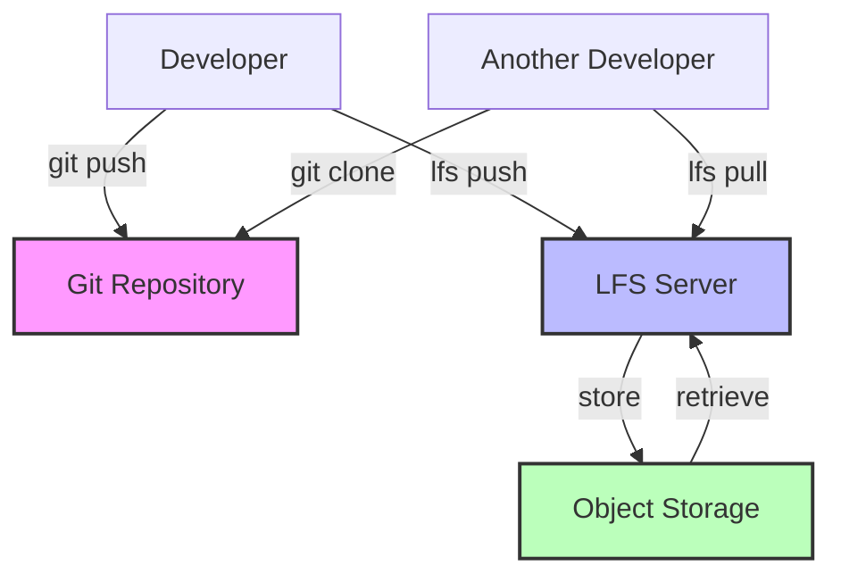

Version control systems excel at tracking text files. Developers commit code, review diffs, and merge changes seamlessly. But introduce large binary files—machine learning model weights, video assets, compiled binaries—and Git grinds to a halt. Repositories balloon to gigabytes. Clones take hours. Simple operations timeout.

Traditional Git stores every version of every file in the repository history. A 100MB file modified ten times consumes 1GB of repository space. Every developer cloning the repository downloads all versions, even if they only need the latest. The distributed nature that makes Git powerful for code becomes a liability for large files.

Git Large File Storage (LFS) addresses this problem by replacing large files with small pointer files in the repository. The actual file content lives on a separate server. Developers download only the versions they need. The repository stays small and fast.

This approach sounds ideal, but Git LFS introduces complexity, infrastructure requirements, and new failure modes. Understanding when LFS adds value—and when simpler approaches suffice—determines whether it solves problems or creates them.

This article explores the technical challenges of large files in Git, examines how Git LFS works, provides guidance on when to adopt it, and offers alternatives for different scenarios.

## The Large File Problem

Git's architecture creates fundamental issues with large binary files.

### How Git Stores Files

Git's storage model optimizes for text:

!!!anote "📦 Git Storage Architecture"
    **Object Storage**
    - Every file version is a blob object
    - Stored in `.git/objects/` directory
    - Compressed but complete copies
    - Delta compression for similar files
    
    **Repository Growth**
    - Each commit adds new blobs
    - History contains all versions
    - Clone downloads entire history
    - No way to fetch partial history
    
    **Text vs Binary**
    - Text: Delta compression works well
    - Binary: Compression often ineffective
    - Small text changes: Small deltas
    - Small binary changes: Full new copy

When you commit a 10KB source file, Git stores it efficiently. Modify one line, and Git stores only the difference. But binary files rarely compress well. A 500MB machine learning model modified slightly still requires storing another 500MB.

### Real-World Impact

Large files create concrete problems:

!!!error "🚫 Repository Bloat"
    **Scenario: ML Model Training**
    
    Data science team commits model weights after each training run:
    - Initial model: 500MB
    - After 20 training iterations: 20 versions
    - Repository size: 10GB
    - Clone time: 45 minutes on fast connection
    
    **Impact:**
    - New team members wait hours to start
    - CI/CD pipelines timeout
    - Git operations become slow
    - Developers avoid pulling updates
    
    **Cost:**
    - Lost productivity: 2 hours per developer per week
    - Infrastructure: Larger storage, more bandwidth
    - Frustration: "Git is broken"

!!!error "🚫 Network Bottlenecks"
    **Scenario: Game Asset Development**
    
    Game studio tracks 3D models and textures in Git:
    - 100 high-resolution textures: 50MB each
    - 50 3D models: 20MB each
    - 6 months of history
    - Repository size: 15GB
    
    **Impact:**
    - Remote developers on slow connections can't work
    - Push/pull operations take 30+ minutes
    - Merge conflicts in binary files unresolvable
    - Team considers abandoning Git
    
    **Cost:**
    - Remote work becomes impossible
    - Collaboration breaks down
    - Version control benefits lost

!!!error "🚫 Storage Costs"
    **Scenario: Video Production**
    
    Video team commits raw footage for version control:
    - 4K video clips: 1GB per minute
    - 100 clips over project lifetime
    - Multiple versions per clip
    - Repository size: 500GB
    
    **Impact:**
    - GitHub/GitLab storage limits exceeded
    - Self-hosted servers need expensive storage
    - Backups become expensive and slow
    - Repository becomes unmaintainable
    
    **Cost:**
    - Storage: $500/month for cloud hosting
    - Backup: $200/month
    - Developer time: 10 hours/month managing issues
    - Total: $1,200/month for one repository

## Git LFS Architecture

Git LFS replaces large files with pointers while storing actual content separately.

### How LFS Works

The core mechanism is pointer substitution:

!!!anote "🔍 LFS Pointer System"
    **Pointer File**
    
    version https://git-lfs.github.com/spec/v1
    oid sha256:4d7a214614ab2935c943f9e0ff69d22eadbb8f32b1258daaa5e2ca24d17e2393
    size 133742
    
    **What Happens**
    1. Developer commits large file
    2. LFS uploads file to LFS server
    3. Git stores small pointer file (130 bytes)
    4. Repository stays small
    
    **On Checkout**
    1. Git checks out pointer file
    2. LFS detects pointer
    3. LFS downloads actual file from server
    4. Replaces pointer with real file
    
    **Benefits**
    - Repository contains only pointers
    - Clone downloads only current version
    - History stays lightweight
    - Large files stored efficiently

The pointer file is tiny—around 130 bytes regardless of actual file size. A 5GB model weight becomes a 130-byte pointer in Git history. The repository stays fast.

### LFS Server Architecture

LFS requires additional infrastructure:

!!!anote "🏗️ LFS Infrastructure"
    **Components**
    - Git repository: Stores pointers
    - LFS server: Manages large files
    - Object storage: Stores actual content
    - Authentication: Controls access
    
    **Hosting Options**
    - GitHub: 1GB free, paid plans available
    - GitLab: 10GB free per repository
    - Bitbucket: 1GB free, paid plans
    - Self-hosted: Full control, more complexity
    
    **Requirements**
    - Separate storage from Git
    - Network bandwidth for uploads/downloads
    - Authentication integration
    - Backup strategy

Unlike regular Git, which is fully distributed, LFS introduces a centralized component. The LFS server becomes a critical dependency. If it's down, developers can't access large files.

## When to Use Git LFS

LFS solves specific problems but isn't always the right choice.

### Good LFS Candidates

LFS works well for certain file types:

!!!success "✅ Binary Assets in Active Development"
    Game studios and design teams work with binary assets that change frequently during development. A 3D character model might go through dozens of iterations as artists refine proportions, textures, and animations. Design files for marketing materials evolve as stakeholders provide feedback. Audio clips get adjusted for timing and mixing.
    
    These files are too large for regular Git—a high-resolution texture might be 50MB, a character model 30MB, a Photoshop composition 100MB. Without LFS, the repository would balloon to gigabytes after a few weeks of development. But these assets need version control. Artists need to roll back changes, compare versions, and collaborate without overwriting each other's work.
    
    LFS solves this perfectly. The repository stays small—under 100MB even with hundreds of assets. Artists commit directly without worrying about repository size. Version history is preserved. When conflicts occur, they're visible in the Git workflow. The team gets all the benefits of version control without the performance penalty.
    
**Example: Game Development**
- Character models: 50MB each
- Texture files: 20MB each
- Audio clips: 10MB each
- Total: 500 files, 15GB of assets
- Repository size with LFS: 80MB

!!!success "✅ Machine Learning Model Checkpoints"
    Data scientists training models need to track experiments. A model trained with different hyperparameters produces different weights. Comparing these versions requires keeping multiple checkpoints. Without version control, teams resort to manual naming schemes—model_v1.bin, model_v2_final.bin, model_v2_final_actually_final.bin—that quickly become unmaintainable.
    
    Model weights typically range from 100MB to 4GB. These files are too large for regular Git but perfect for LFS. The key benefit is linking code to models. When you check out a specific commit, you get both the training code and the model weights it produced. This enables true reproducibility—you can verify that a particular model came from specific code and hyperparameters.
    
    LFS works well for models up to about 4GB—the size limit chosen to fit most file systems. Beyond that, specialized tools like DVC or Weights & Biases provide better workflows. But for small to medium models, LFS offers the simplest path to version control.
    
**Example: Deep Learning Project**
- Model checkpoints: 200MB - 4GB each
- 10 experiments, 5 checkpoints each
- Total: 50 files, 10GB
- Repository size with LFS: 120MB
- Benefit: Code and models stay synchronized

!!!success "✅ Documentation Assets"
    Technical documentation often includes binary assets—video tutorials, architecture diagrams in proprietary formats, PDF exports. These assets should version alongside the code they document. When code changes, documentation updates. Keeping them in sync prevents the common problem of outdated documentation.
    
    Documentation assets change less frequently than code, making them ideal for LFS. A video tutorial might be recorded once and updated quarterly. Architecture diagrams evolve with major releases. The moderate file sizes—typically 10MB to 200MB—and infrequent updates mean LFS storage costs stay low.
    
    The alternative is storing documentation separately, but this breaks the connection between code and docs. With LFS, checking out a release tag gives you both the code and the documentation that describes it. Writers can commit directly to the repository. The team maintains a single source of truth.
    
**Example: Product Documentation**
- Video tutorials: 100MB each
- Diagram sources (Visio, Sketch): 10MB each
- PDF exports: 5MB each
- Total: 50 files, 2GB
- Repository size with LFS: 90MB

### When LFS Is Wrong

Many scenarios don't benefit from LFS:

!!!warning "⚠️ Truly Large Files (> 4GB)"
    LFS doesn't support partial file downloads. When you check out a file, you download the entire thing. This makes LFS impractical for files larger than about 4GB—the size limit chosen to fit most file systems including FAT32.
    
    A 50GB raw video file takes hours to download on typical connections. A 100GB dataset is simply too large for the LFS workflow. Even if your network can handle it, the LFS server storage costs become prohibitive. Ten versions of a 50GB file consume 500GB of LFS storage.
    
    For these files, external storage with references works better. Store the file in S3 or similar object storage. Commit a small metadata file to Git with the storage location and checksum. Download the large file only when needed. This approach supports any file size, enables partial downloads, and costs less at scale.
    
**Example: Video Production**
- 4K raw footage: 50GB per file
- 20 clips over project lifetime
- Total: 1TB
- LFS cost: Prohibitive
- Better: S3 with manifest in Git

!!!warning "⚠️ Build Artifacts"
    Compiled binaries, packaged applications, and other build outputs shouldn't be in version control at all. These are generated files—outputs of the build process, not source inputs. Version control is for sources.
    
    Committing build artifacts creates problems. The repository grows with every build. Developers download artifacts they don't need. The history fills with noise. When you need a specific build, you can't tell which source code produced it.
    
    Artifact repositories like Artifactory or Nexus solve this properly. They store build outputs with metadata linking them to source commits. You can retrieve any build and trace it back to exact source code. Storage is optimized for binaries. Old artifacts can be automatically cleaned up. This is the right tool for the job.
    
**Example: Application Releases**
- Compiled binary: 200MB
- Daily builds: 365 per year
- Total: 73GB per year
- Wrong: LFS or Git
- Right: Artifactory with Git tags

!!!warning "⚠️ Frequently Changing Large Files"
    LFS storage grows with every version. A 1GB file modified daily creates 365GB of LFS storage per year. Database dumps, log files, and cache files that change frequently become expensive to store and provide little value.
    
    These files don't benefit from version control. You rarely need to compare yesterday's database dump to today's. Log files are better analyzed with log management tools. Cache files are temporary by nature. Tracking their history wastes storage and provides no benefit.
    
    The solution is simple: don't version these files. Add them to `.gitignore`. Store them locally or in appropriate systems—databases for data, log aggregators for logs, temporary storage for caches. Version control is for files where history matters.
    
    **Example: Development Database**
    - Database dump: 2GB
    - Updated daily during development
    - 30 days: 60GB of LFS storage
    - Value: Minimal (only need latest)
    - Better: Local file, regenerate as needed

!!!warning "⚠️ No LFS Server Available"
    LFS requires infrastructure beyond Git. Some corporate networks block LFS endpoints. Some Git hosting providers don't support LFS. Self-hosting requires maintaining an LFS server and object storage.
    
    Without LFS infrastructure, you can't push or pull large files. The repository becomes unusable for team members who need those files. This infrastructure dependency is a real limitation—unlike regular Git, which is fully distributed, LFS introduces a centralized component that must be available.
    
    If LFS infrastructure isn't available or reliable, use alternative approaches. External storage with references works without special infrastructure. Specialized tools like DVC can use any S3-compatible storage. Sometimes the simplest solution is keeping large files out of version control entirely.

## Practical Implementation

Using LFS effectively requires understanding its workflow and limitations.

### Setting Up Git LFS

Basic setup is straightforward:

!!!anote "🔧 LFS Setup Steps"
    **Installation**
    
    Install LFS:
    git lfs install
    
    Track file types:
    git lfs track "*.psd"
    git lfs track "*.bin"
    git lfs track "models/*.h5"
    
    Commit tracking configuration:
    git add .gitattributes
    git commit -m "Configure LFS tracking"
    
    **What Gets Created**
    
    .gitattributes file:
    
    *.psd filter=lfs diff=lfs merge=lfs -text
    *.bin filter=lfs diff=lfs merge=lfs -text
    models/*.h5 filter=lfs diff=lfs merge=lfs -text
    
    **Using LFS**
    
    Add and commit as normal:
    git add model.bin
    git commit -m "Add trained model"
    
    Push sends to both Git and LFS:
    git push origin main
    
    Clone automatically fetches LFS files:
    git clone https://github.com/user/repo.git

The `.gitattributes` file tells Git which files to handle with LFS. Once configured, LFS works transparently for most operations.

### Common Workflows

Different scenarios require different approaches:

!!!anote "📋 LFS Workflows"
    **Selective Checkout**
    
    Clone without downloading LFS files:
    GIT_LFS_SKIP_SMUDGE=1 git clone repo.git
    
    Download specific files later:
    git lfs pull --include="models/production/*"
    
    **Pruning Old Versions**
    
    Remove old LFS files from local cache:
    git lfs prune
    
    Keep only recent versions:
    git lfs prune --verify-remote --recent
    
    **Migrating Existing Files**
    
    Convert existing files to LFS:
    git lfs migrate import --include="*.psd"
    
    Rewrite history (careful!):
    git lfs migrate import --include="*.bin" --everything
    
    **Checking LFS Status**
    
    See which files are tracked:
    git lfs ls-files
    
    Check LFS storage usage:
    git lfs env

### Troubleshooting Common Issues

LFS introduces new failure modes:

!!!warning "⚠️ Common LFS Problems"
    **"This exceeds GitHub's file size limit"**
    - Cause: File committed without LFS tracking
    - Solution: Configure `.gitattributes` before committing
    - Prevention: Set up LFS tracking early
    
    **"Error downloading object"**
    - Cause: LFS server unreachable or file missing
    - Solution: Check network, verify LFS server status
    - Workaround: Skip LFS files temporarily
    
    **"Encountered X file(s) that should have been pointers"**
    - Cause: Files committed before LFS was configured
    - Solution: Use `git lfs migrate` to fix history
    - Prevention: Configure LFS before first commit
    
    **Slow Clone/Pull**
    - Cause: Downloading many large LFS files
    - Solution: Use `GIT_LFS_SKIP_SMUDGE=1` for selective download
    - Alternative: Fetch only needed files

## Alternatives to Git LFS

Many scenarios have better solutions than LFS.

### External Storage with References

For truly large files, store references instead:

!!!tip "💡 Reference-Based Approach"
    **Architecture**
    - Store files in S3, GCS, or similar
    - Commit metadata and references in Git
    - Download files as needed
    - Version through object storage
    
**Example Structure**

repo/
├── models/
│   ├── config.yaml          # In Git
│   └── download.sh          # In Git
└── data/
    ├── manifest.json        # In Git
    └── fetch_data.py        # In Git

**Benefits**
- No LFS infrastructure needed
- Supports any file size
- Flexible storage options
- Lower costs at scale
- Partial downloads possible

This approach works well for datasets, large models, and video files. The repository stays small and fast. Storage costs are lower. Teams have more flexibility.

### Specialized Tools

Different domains have purpose-built solutions:

!!!anote "🛠️ Domain-Specific Tools"
    **Machine Learning**
    - DVC (Data Version Control): Git-like for data/models
    - Weights & Biases: Experiment tracking
    - MLflow: Model registry
    - Hugging Face: Model hosting
    
    **Game Development**
    - Perforce: Designed for large binary files
    - Plastic SCM: Handles large assets well
    - Unity Collaborate: Built for Unity projects
    
    **Media Production**
    - Frame.io: Video collaboration
    - Dropbox: Simple file sync
    - Resilio Sync: P2P file sync
    
    **Build Artifacts**
    - Artifactory: Universal artifact repository
    - Nexus: Maven/npm/Docker registry
    - Docker Hub: Container images

These tools solve specific problems better than general-purpose version control. They understand domain requirements and optimize accordingly.

## Conclusion

Git LFS solves real problems for teams working with binary assets that need version control. It keeps repositories fast while preserving history for files that would otherwise bloat Git.

But LFS isn't a universal solution. It requires infrastructure, adds complexity, and has size limitations. For files larger than 4GB, specialized storage with metadata references works better. For build artifacts, dedicated artifact repositories are more appropriate. For massive datasets, tools like DVC provide better workflows.

The key is matching the tool to the problem. Use LFS for binary assets in active development—3D models, design files, small ML models. Use external storage for large static files. Use specialized tools for domain-specific needs. Use nothing for files that don't need version control.

Git LFS is powerful when applied correctly. Understanding its strengths and limitations ensures it solves problems rather than creating them.

!!!tip "💡 Decision Framework"
    **Use Git LFS when:**
    - Binary files need version history
    - Files are 10MB - 2GB
    - Team collaborates on assets
    - LFS infrastructure available
    
    **Use external storage when:**
    - Files exceed 4GB
    - Don't need detailed history
    - Partial downloads needed
    - Very frequent updates
    
    **Use specialized tools when:**
    - Domain-specific requirements
    - Advanced features needed
    - Team already uses them
    - Better workflow fit
    
    **Use nothing when:**
    - Files are generated artifacts
    - Temporary or cache files
    - Can be recreated easily
    - No collaboration needed
