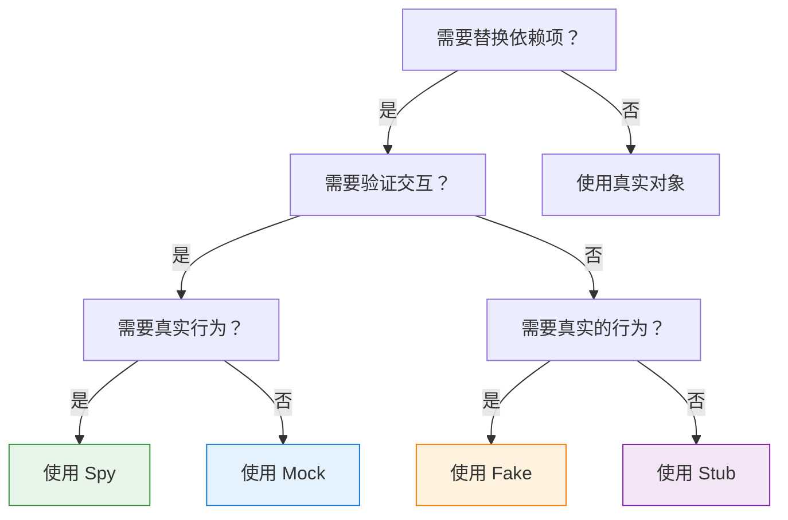
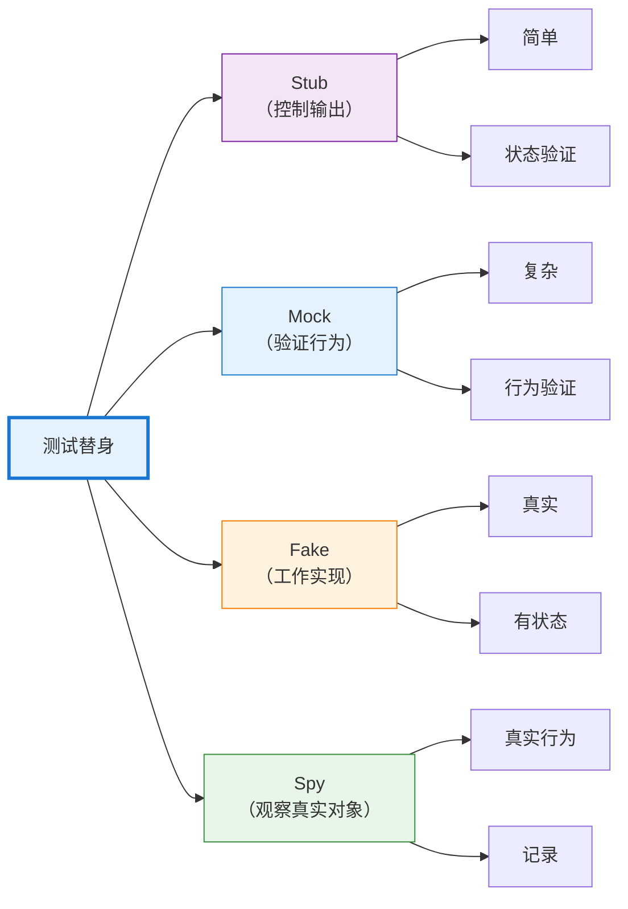

## 引言

编写可测试的代码需要将被测单元与其依赖项隔离。一个调用数据库、发送电子邮件或发起 HTTP 请求的函数很难测试——测试会变得缓慢、不稳定，并且依赖于外部系统。如何在不真正扣款的情况下测试支付处理？如何在不让生产服务崩溃的情况下验证错误处理？

测试替身通过用受控的替代品替换真实依赖项来解决这个问题。就像特技替身在危险场景中替代演员一样，测试替身在测试中替代真实对象。但并非所有测试替身都是相同的——mock、stub、fake 和 spy 服务于不同的目的，遵循不同的模式。

理解这些区别会改变你编写测试的方式。使用错误的类型，测试会变得脆弱、不清晰或无效。使用正确的类型，测试会变得精确、可维护且有价值。本指南阐明了每种测试替身的作用、何时使用它以及如何有效地实现它。

## 测试替身分类

Gerard Meszaros 在他的书《xUnit 测试模式》中引入了"测试替身"这个术语，作为测试中替换真实依赖项的任何对象的总称。Martin Fowler 推广了这些概念，特别是 mock 和 stub 之间的区别。

### 五种类型

测试替身分为五类，每类都有不同的特征：

1. **Dummy（哑对象）**：被传递但从不使用（填充参数列表）
2. **Stub（桩）**：为调用提供预定义的响应
3. **Spy（间谍）**：记录关于如何被调用的信息
4. **Mock（模拟对象）**：通过期望验证行为
5. **Fake（伪对象）**：带有快捷方式的工作实现

本指南重点介绍四种最常用的类型：Mock、Stub、Fake 和 Spy。

## Stub：控制输出

Stub 为测试期间的调用提供预定义的答案。它们不关心如何被调用——只是返回配置的响应。Stub 支持状态验证："给定这个输入，系统是否产生正确的输出？"

### 特征

- 返回硬编码的响应
- 不验证如何被调用
- 专注于状态验证
- 最简单的测试替身形式

### 何时使用 Stub

当你需要控制依赖项返回的内容时使用 stub：

- 测试不同的响应场景
- 模拟错误条件
- 提供测试数据
- 替换慢速操作（数据库查询、API 调用）

### 实现示例

**JavaScript (Jest):**
```javascript
// 总是返回成功的 Stub
const paymentStub = {
  processPayment: jest.fn().mockReturnValue({
    status: 'success',
    transactionId: 'txn_12345'
  })
};

test('successful checkout creates order', () => {
  const order = checkout(cart, paymentStub);
  
  expect(order.status).toBe('completed');
  expect(order.transactionId).toBe('txn_12345');
});
```

**Python:**
```python
class PaymentServiceStub:
    def process_payment(self, amount, currency):
        return {
            'status': 'success',
            'transaction_id': 'txn_12345'
        }

def test_successful_checkout():
    service = PaymentServiceStub()
    order = checkout(cart, service)
    
    assert order.status == 'completed'
    assert order.transaction_id == 'txn_12345'
```

**Java (Mockito):**
```java
@Test
public void testSuccessfulCheckout() {
    PaymentService stub = mock(PaymentService.class);
    when(stub.processPayment(any(), any()))
        .thenReturn(new PaymentResult("success", "txn_12345"));
    
    Order order = checkout(cart, stub);
    
    assertEquals("completed", order.getStatus());
    assertEquals("txn_12345", order.getTransactionId());
}
```

### Stub 变体

**错误 Stub：**
```javascript
const failingStub = {
  processPayment: jest.fn().mockRejectedValue(
    new Error('Insufficient funds')
  )
};

test('failed payment shows error message', async () => {
  await expect(checkout(cart, failingStub))
    .rejects.toThrow('Insufficient funds');
});
```

**条件 Stub：**
```python
class ConditionalPaymentStub:
    def process_payment(self, amount, currency):
        if amount > 1000:
            raise PaymentError('Amount exceeds limit')
        return {'status': 'success'}

def test_large_payment_rejected():
    service = ConditionalPaymentStub()
    with pytest.raises(PaymentError):
        checkout(large_cart, service)
```

**序列 Stub：**
```javascript
// 在连续调用时返回不同的值
const sequenceStub = {
  getNextId: jest.fn()
    .mockReturnValueOnce(1)
    .mockReturnValueOnce(2)
    .mockReturnValueOnce(3)
};

test('generates sequential IDs', () => {
  expect(sequenceStub.getNextId()).toBe(1);
  expect(sequenceStub.getNextId()).toBe(2);
  expect(sequenceStub.getNextId()).toBe(3);
});
```

!!!tip "💡 Stub 最佳实践"
    - 保持 stub 简单——只返回数据
    - 不要向 stub 添加逻辑（改用 fake）
    - 清晰命名 stub：`successfulPaymentStub`、`failingPaymentStub`
    - 在测试中重用常见的 stub

## Mock：验证行为

Mock 是带有关于如何被调用的期望的测试替身。与专注于返回内容的 stub 不同，mock 专注于如何被使用。Mock 支持行为验证："这个方法是否使用正确的参数被调用？"

### 特征

- 验证方法调用和参数
- 如果期望未满足则测试失败
- 专注于行为验证
- 比 stub 更复杂

### 何时使用 Mock

当交互本身是你要测试的内容时使用 mock：

- 验证方法是否被调用
- 检查调用顺序
- 验证传递的参数
- 确保正确的调用次数

### 实现示例

**JavaScript (Jest):**
```javascript
test('checkout calls payment service with correct amount', () => {
  const paymentMock = {
    processPayment: jest.fn().mockResolvedValue({ status: 'success' })
  };
  
  checkout(cart, paymentMock);
  
  // 验证交互
  expect(paymentMock.processPayment).toHaveBeenCalledWith({
    amount: 99.99,
    currency: 'USD'
  });
  expect(paymentMock.processPayment).toHaveBeenCalledTimes(1);
});
```

**Python (unittest.mock):**
```python
from unittest.mock import Mock

def test_checkout_calls_payment_service():
    payment_mock = Mock()
    payment_mock.process_payment.return_value = {'status': 'success'}
    
    checkout(cart, payment_mock)
    
    # 验证交互
    payment_mock.process_payment.assert_called_once_with(
        amount=99.99,
        currency='USD'
    )
```

**Java (Mockito):**
```java
@Test
public void testCheckoutCallsPaymentService() {
    PaymentService mock = mock(PaymentService.class);
    when(mock.processPayment(any(), any()))
        .thenReturn(new PaymentResult("success"));
    
    checkout(cart, mock);
    
    // 验证交互
    verify(mock).processPayment(
        argThat(amount -> amount.equals(99.99)),
        eq("USD")
    );
    verify(mock, times(1)).processPayment(any(), any());
}
```

### 高级 Mock 模式

**调用顺序验证：**
```javascript
test('operations happen in correct order', () => {
  const logger = { log: jest.fn() };
  const db = { save: jest.fn() };
  
  processOrder(order, logger, db);
  
  const logCall = logger.log.mock.invocationCallOrder[0];
  const saveCall = db.save.mock.invocationCallOrder[0];
  
  expect(logCall).toBeLessThan(saveCall);
});
```

**参数匹配器：**
```python
from unittest.mock import Mock, ANY

def test_sends_email_with_user_data():
    email_mock = Mock()
    
    register_user('alice@example.com', email_mock)
    
    email_mock.send.assert_called_with(
        to='alice@example.com',
        subject=ANY,  # 不关心主题
        body=ANY
    )
```

!!!warning "⚠️ Mock 过度使用"
    **过度使用 mock 的症状：**
    - 测试镜像实现细节
    - 在没有行为变化的重构时测试中断
    - mock 设置比实际测试逻辑更多
    - 不清楚正在测试什么
    
    **解决方案：** 谨慎使用 mock。尽可能优先使用状态验证（stub）。仅在架构边界处使用 mock。

## Fake：工作实现

Fake 是采用不适合生产的快捷方式的工作实现。它们的行为类似于真实对象，但使用更简单、更快的方法。Fake 比 stub 更复杂，但提供更真实的行为。

### 特征

- 实际的工作实现
- 使用快捷方式（内存 vs. 数据库）
- 在操作之间维护状态
- 比 stub 更真实

### 何时使用 Fake

当你需要真实行为而不需要生产复杂性时使用 fake：

- 用于测试的内存数据库
- 本地文件系统而不是云存储
- 简化的身份验证
- 慢速操作的快速替代方案

### 实现示例

**内存仓库：**
```javascript
class FakeUserRepository {
  constructor() {
    this.users = new Map();
    this.nextId = 1;
  }
  
  save(user) {
    const id = this.nextId++;
    const savedUser = { ...user, id };
    this.users.set(id, savedUser);
    return savedUser;
  }
  
  findById(id) {
    return this.users.get(id) || null;
  }
  
  findByEmail(email) {
    return Array.from(this.users.values())
      .find(u => u.email === email) || null;
  }
  
  delete(id) {
    return this.users.delete(id);
  }
}

test('user registration and retrieval', () => {
  const repo = new FakeUserRepository();
  
  const user = repo.save({ email: 'alice@example.com', name: 'Alice' });
  expect(user.id).toBe(1);
  
  const found = repo.findById(1);
  expect(found.email).toBe('alice@example.com');
  
  const foundByEmail = repo.findByEmail('alice@example.com');
  expect(foundByEmail.id).toBe(1);
});
```

**内存缓存：**
```python
class FakeCache:
    def __init__(self):
        self.store = {}
    
    def get(self, key):
        return self.store.get(key)
    
    def set(self, key, value, ttl=None):
        self.store[key] = value
    
    def delete(self, key):
        self.store.pop(key, None)
    
    def clear(self):
        self.store.clear()

def test_caching_behavior():
    cache = FakeCache()
    service = DataService(cache)
    
    # 第一次调用从源获取
    data1 = service.get_user(123)
    
    # 第二次调用使用缓存
    data2 = service.get_user(123)
    
    assert data1 == data2
    assert cache.get('user:123') is not None
```

**伪文件系统：**
```java
public class FakeFileSystem implements FileSystem {
    private Map<String, byte[]> files = new HashMap<>();
    
    @Override
    public void write(String path, byte[] content) {
        files.put(path, content);
    }
    
    @Override
    public byte[] read(String path) throws FileNotFoundException {
        if (!files.containsKey(path)) {
            throw new FileNotFoundException(path);
        }
        return files.get(path);
    }
    
    @Override
    public boolean exists(String path) {
        return files.containsKey(path);
    }
    
    @Override
    public void delete(String path) {
        files.remove(path);
    }
}

@Test
public void testFileOperations() {
    FileSystem fs = new FakeFileSystem();
    
    fs.write("/test.txt", "Hello".getBytes());
    assertTrue(fs.exists("/test.txt"));
    
    byte[] content = fs.read("/test.txt");
    assertEquals("Hello", new String(content));
    
    fs.delete("/test.txt");
    assertFalse(fs.exists("/test.txt"));
}
```

!!!tip "💡 Fake 最佳实践"
    - 保持 fake 简单但真实
    - 测试 fake 本身以确保正确性
    - 在测试套件中共享 fake
    - 记录与真实实现的差异
    - 考虑为真实和伪实现提取接口

## Spy：记录交互

Spy 包装真实对象，记录它们如何被调用，同时委托给实际实现。它们将真实行为与验证能力结合起来，实现无需替换的观察。

### 特征

- 包装真实对象
- 委托给实际实现
- 记录所有交互
- 支持验证真实行为

### 何时使用 Spy

当你需要验证与真实对象的交互时使用 spy：

- 验证缓存行为
- 检查优化（方法调用次数更少）
- 监控真实对象使用
- 部分模拟（spy 某些方法，其他方法真实）

### 实现示例

**JavaScript (Sinon):**
```javascript
const sinon = require('sinon');

test('caching reduces database calls', () => {
  const realDb = new Database();
  const dbSpy = sinon.spy(realDb);
  
  const service = new UserService(dbSpy);
  
  // 第一次调用访问数据库
  service.getUser(123);
  expect(dbSpy.query.calledOnce).toBe(true);
  
  // 第二次调用使用缓存
  service.getUser(123);
  expect(dbSpy.query.calledOnce).toBe(true); // 仍然只有一次调用
});
```

**Python (unittest.mock):**
```python
from unittest.mock import spy

def test_cache_reduces_api_calls():
    real_api = ExternalAPI()
    api_spy = spy(real_api)
    
    service = DataService(api_spy)
    
    # 第一次调用访问 API
    service.get_data('key1')
    assert api_spy.fetch.call_count == 1
    
    # 第二次调用使用缓存
    service.get_data('key1')
    assert api_spy.fetch.call_count == 1  # 没有额外调用
```

**Java (Mockito):**
```java
@Test
public void testCachingReducesDatabaseCalls() {
    Database realDb = new Database();
    Database dbSpy = spy(realDb);
    
    UserService service = new UserService(dbSpy);
    
    // 第一次调用访问数据库
    service.getUser(123);
    verify(dbSpy, times(1)).query(any());
    
    // 第二次调用使用缓存
    service.getUser(123);
    verify(dbSpy, times(1)).query(any()); // 仍然只有一次调用
}
```

### 部分 Spy

Spy 可以选择性地覆盖方法，同时保持其他方法真实：

```javascript
test('spy with partial override', () => {
  const realService = new PaymentService();
  const spy = sinon.spy(realService);
  
  // 覆盖一个方法
  spy.validateCard = sinon.stub().returns(true);
  
  // 其他方法使用真实实现
  const result = spy.processPayment(card, amount);
  
  expect(spy.validateCard.called).toBe(true);
  expect(result).toBeDefined(); // 真实的 processPayment 被执行
});
```

!!!warning "⚠️ Spy 的局限性"
    **Spy 不适用的情况：**
    - 真实对象有副作用（发送电子邮件、扣款）
    - 真实对象很慢（数据库查询、API 调用）
    - 真实对象需要复杂的设置
    - 测试错误条件（真实对象不会按需失败）
    
    **解决方案：** 当真实行为有问题时，改用 mock 或 stub。

## 选择正确的测试替身

选择适当的测试替身取决于你要测试什么以及需要验证什么。

### 决策框架



### 对比矩阵

| 方面 | Stub | Mock | Fake | Spy |
|--------|------|------|------|-----|
| **复杂度** | 低 | 中 | 高 | 低 |
| **验证调用** | 否 | 是 | 否 | 是 |
| **真实实现** | 否 | 否 | 简化 | 是 |
| **维护状态** | 否 | 否 | 是 | 是（真实） |
| **设置工作量** | 最小 | 中等 | 高 | 最小 |
| **测试清晰度** | 高 | 中 | 高 | 中 |
| **脆弱性** | 低 | 高 | 低 | 中 |

### 实用指南

!!!anote "📋 何时使用每种类型"
    **使用 Stub 当：**
    - 需要控制返回值
    - 测试不同场景（成功、失败）
    - 替换慢速操作
    - 状态验证就足够了
    
    **使用 Mock 当：**
    - 验证方法是否被调用
    - 检查传递的参数
    - 验证调用顺序
    - 交互本身很重要
    
    **使用 Fake 当：**
    - 需要真实行为
    - 测试复杂交互
    - 状态在操作之间持久化
    - 真实实现太慢/太复杂
    
    **使用 Spy 当：**
    - 需要真实行为
    - 想要验证优化
    - 需要部分模拟
    - 监控真实对象使用

## 常见陷阱和反模式

理解测试替身还不够——你必须避免破坏测试质量的常见错误。

### 过度模拟

**问题：** 模拟所有内容，包括简单对象。

```javascript
// 不好：过度模拟
test('calculates total', () => {
  const item1 = { getPrice: jest.fn().mockReturnValue(10) };
  const item2 = { getPrice: jest.fn().mockReturnValue(20) };
  
  const total = calculateTotal([item1, item2]);
  expect(total).toBe(30);
});

// 好：简单时使用真实对象
test('calculates total', () => {
  const items = [
    { price: 10 },
    { price: 20 }
  ];
  
  const total = calculateTotal(items);
  expect(total).toBe(30);
});
```

### 测试实现细节

**问题：** Mock 验证内部实现而不是行为。

```javascript
// 不好：测试实现
test('processes order', () => {
  const validator = { validate: jest.fn().mockReturnValue(true) };
  const calculator = { calculate: jest.fn().mockReturnValue(100) };
  const logger = { log: jest.fn() };
  
  processOrder(order, validator, calculator, logger);
  
  expect(validator.validate).toHaveBeenCalled();
  expect(calculator.calculate).toHaveBeenCalled();
  expect(logger.log).toHaveBeenCalledTimes(3);
});

// 好：测试行为
test('processes valid order', () => {
  const result = processOrder(validOrder);
  
  expect(result.status).toBe('completed');
  expect(result.total).toBe(100);
});
```

### 脆弱的测试

**问题：** 在没有行为变化的重构时测试中断。

```python
# 不好：脆弱的测试
def test_user_registration():
    db_mock = Mock()
    email_mock = Mock()
    logger_mock = Mock()
    
    register_user('alice@example.com', db_mock, email_mock, logger_mock)
    
    # 如果内部实现改变就会中断
    logger_mock.info.assert_called_with('Starting registration')
    db_mock.save.assert_called_once()
    logger_mock.info.assert_called_with('User saved')
    email_mock.send.assert_called_once()
    logger_mock.info.assert_called_with('Email sent')

# 好：有弹性的测试
def test_user_registration():
    result = register_user('alice@example.com')
    
    assert result.success is True
    assert result.user_id is not None
    assert email_was_sent_to('alice@example.com')
```

### 不清楚的测试意图

**问题：** 测试没有清楚地传达它们正在验证什么。

```java
// 不好：意图不清楚
@Test
public void testCheckout() {
    PaymentService mock = mock(PaymentService.class);
    when(mock.processPayment(any(), any())).thenReturn(result);
    
    checkout(cart, mock);
    
    verify(mock).processPayment(any(), any());
}

// 好：意图清楚
@Test
public void checkoutProcessesPaymentWithCartTotal() {
    PaymentService mock = mock(PaymentService.class);
    when(mock.processPayment(99.99, "USD")).thenReturn(successResult);
    
    Order order = checkout(cart, mock);
    
    verify(mock).processPayment(99.99, "USD");
    assertEquals("completed", order.getStatus());
}
```

## 最佳实践

遵循这些实践来编写有效的测试替身测试。

### 优先使用状态验证而不是行为验证

状态验证（使用 stub）比行为验证（使用 mock）更不脆弱。测试系统产生什么，而不是它如何产生。

```javascript
// 优先这样（状态验证）
test('checkout creates completed order', () => {
  const paymentStub = { processPayment: () => ({ status: 'success' }) };
  
  const order = checkout(cart, paymentStub);
  
  expect(order.status).toBe('completed');
});

// 而不是这样（行为验证）
test('checkout calls payment service', () => {
  const paymentMock = { processPayment: jest.fn() };
  
  checkout(cart, paymentMock);
  
  expect(paymentMock.processPayment).toHaveBeenCalled();
});
```

### 在架构边界处模拟

模拟外部依赖项（数据库、API、文件系统），而不是内部对象。

```python
# 好：在边界处模拟
def test_user_service():
    db_stub = FakeDatabase()
    service = UserService(db_stub)
    
    user = service.create_user('alice@example.com')
    
    assert user.id is not None

# 不好：模拟内部对象
def test_user_service():
    validator_mock = Mock()
    formatter_mock = Mock()
    service = UserService(validator_mock, formatter_mock)
    
    # 测试与内部实现耦合
```

### 保持测试替身简单

复杂的测试替身表明设计问题。如果测试替身难以创建，真实对象可能太复杂了。

```javascript
// 如果这个难以模拟...
class ComplexService {
  constructor(db, cache, logger, metrics, config, validator) {
    // 太多依赖项
  }
}

// ...简化设计
class SimpleService {
  constructor(repository) {
    // 架构边界处的单一依赖项
  }
}
```

### 清晰命名测试替身

使用描述性名称来指示替身的目的。

```python
# 好的名称
successful_payment_stub = PaymentStub(status='success')
failing_payment_stub = PaymentStub(status='failed')
empty_repository_fake = FakeRepository()
payment_service_spy = spy(PaymentService())

# 不好的名称
stub1 = PaymentStub()
mock = Mock()
fake = FakeRepository()
```

## 结论

测试替身是编写有效单元测试的必备工具。理解 mock、stub、fake 和 spy 之间的区别使你能够为每个测试场景选择正确的工具。

**关键要点：**

- **Stub** 控制输出——用于状态验证
- **Mock** 验证行为——在架构边界处谨慎使用
- **Fake** 提供工作实现——用于复杂依赖项
- **Spy** 观察真实对象——当真实行为很重要时使用



最好的测试使用满足其需求的最简单的测试替身。优先使用 stub 而不是 mock，真实对象而不是测试替身，状态验证而不是行为验证。在架构边界处模拟，而不是内部实现细节。保持测试替身简单——复杂的替身表明设计问题。

掌握这些模式，你的测试将变得更清晰、更可维护、更有价值。它们会捕获错误而不会在重构期间中断，传达意图而不会模糊逻辑，运行快速而不会牺牲信心。

测试替身不仅仅是测试工具——它们是设计反馈机制。创建测试替身的困难揭示了设计问题：太多依赖项、不清楚的边界或过度耦合。倾听这些反馈，你的代码将变得更模块化、更可测试、更可维护。

今天就开始应用这些模式。用 stub 替换你的下一个 mock。为你的数据库测试提取一个 fake。使用 spy 来验证优化。体验使用得当的测试替身和使用不当的测试替身之间的区别。你的测试——以及你的代码——会感谢你。

## 参考资源

- **Martin Fowler - Mocks Aren't Stubs**: [https://martinfowler.com/articles/mocksArentStubs.html](https://martinfowler.com/articles/mocksArentStubs.html)
- **xUnit Test Patterns** by Gerard Meszaros
- **Growing Object-Oriented Software, Guided by Tests** by Steve Freeman and Nat Pryce
- **Jest Documentation**: [https://jestjs.io/docs/mock-functions](https://jestjs.io/docs/mock-functions)
- **Mockito Documentation**: [https://site.mockito.org/](https://site.mockito.org/)
- **Python unittest.mock**: [https://docs.python.org/3/library/unittest.mock.html](https://docs.python.org/3/library/unittest.mock.html)
- **Sinon.JS**: [https://sinonjs.org/](https://sinonjs.org/)
