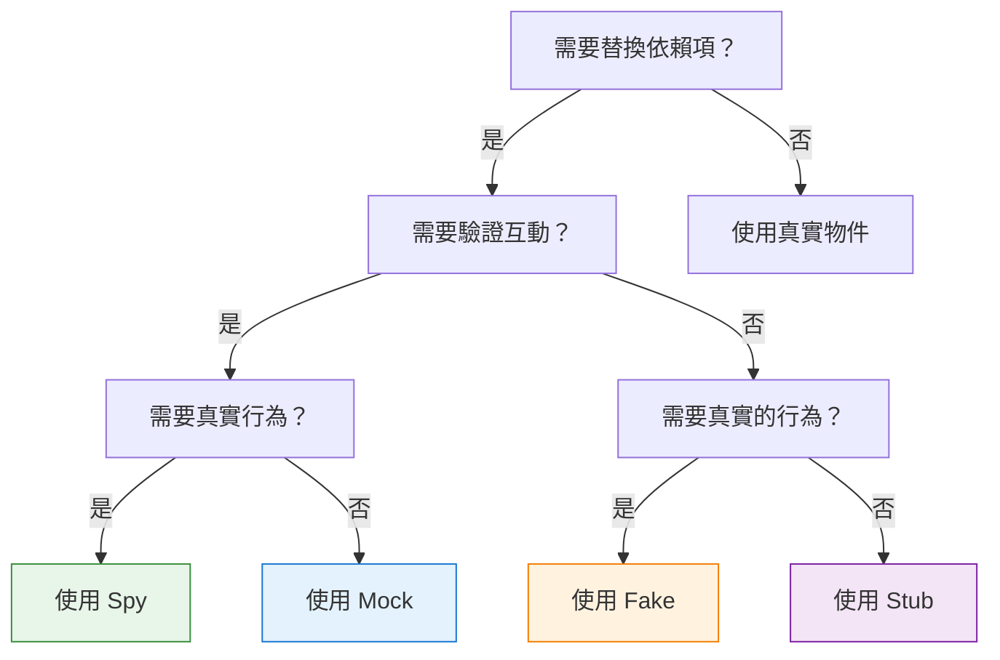
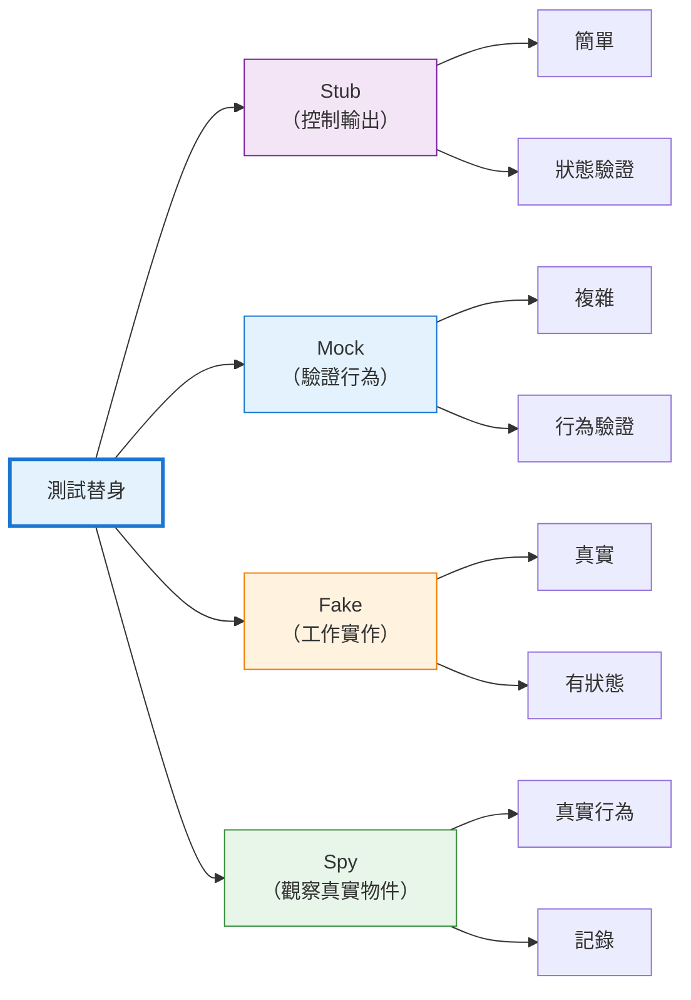

## 引言

編寫可測試的程式碼需要將被測單元與其依賴項隔離。一個呼叫資料庫、發送電子郵件或發起 HTTP 請求的函式很難測試——測試會變得緩慢、不穩定，並且依賴於外部系統。如何在不真正扣款的情況下測試支付處理？如何在不讓生產服務崩潰的情況下驗證錯誤處理？

測試替身透過用受控的替代品替換真實依賴項來解決這個問題。就像特技替身在危險場景中替代演員一樣，測試替身在測試中替代真實物件。但並非所有測試替身都是相同的——mock、stub、fake 和 spy 服務於不同的目的，遵循不同的模式。

理解這些差異會改變你編寫測試的方式。使用錯誤的類型，測試會變得脆弱、不清晰或無效。使用正確的類型，測試會變得精確、可維護且有價值。本指南闡明了每種測試替身的作用、何時使用它以及如何有效地實現它。

## 測試替身分類

Gerard Meszaros 在他的書《xUnit 測試模式》中引入了「測試替身」這個術語，作為測試中替換真實依賴項的任何物件的總稱。Martin Fowler 推廣了這些概念，特別是 mock 和 stub 之間的區別。

### 五種類型

測試替身分為五類，每類都有不同的特徵：

1. **Dummy（啞物件）**：被傳遞但從不使用（填充參數列表）
2. **Stub（樁）**：為呼叫提供預定義的回應
3. **Spy（間諜）**：記錄關於如何被呼叫的資訊
4. **Mock（模擬物件）**：透過期望驗證行為
5. **Fake（偽物件）**：帶有捷徑的工作實作

本指南重點介紹四種最常用的類型：Mock、Stub、Fake 和 Spy。

## Stub：控制輸出

Stub 為測試期間的呼叫提供預定義的答案。它們不關心如何被呼叫——只是回傳設定的回應。Stub 支援狀態驗證：「給定這個輸入，系統是否產生正確的輸出？」

### 特徵

- 回傳硬編碼的回應
- 不驗證如何被呼叫
- 專注於狀態驗證
- 最簡單的測試替身形式

### 何時使用 Stub

當你需要控制依賴項回傳的內容時使用 stub：

- 測試不同的回應場景
- 模擬錯誤條件
- 提供測試資料
- 替換慢速操作（資料庫查詢、API 呼叫）

### 實作範例

**JavaScript (Jest):**
```javascript
// 總是回傳成功的 Stub
const paymentStub = {
  processPayment: jest.fn().mockReturnValue({
    status: 'success',
    transactionId: 'txn_12345'
  })
};

test('successful checkout creates order', () => {
  const order = checkout(cart, paymentStub);
  
  expect(order.status).toBe('completed');
  expect(order.transactionId).toBe('txn_12345');
});
```

**Python:**
```python
class PaymentServiceStub:
    def process_payment(self, amount, currency):
        return {
            'status': 'success',
            'transaction_id': 'txn_12345'
        }

def test_successful_checkout():
    service = PaymentServiceStub()
    order = checkout(cart, service)
    
    assert order.status == 'completed'
    assert order.transaction_id == 'txn_12345'
```

**Java (Mockito):**
```java
@Test
public void testSuccessfulCheckout() {
    PaymentService stub = mock(PaymentService.class);
    when(stub.processPayment(any(), any()))
        .thenReturn(new PaymentResult("success", "txn_12345"));
    
    Order order = checkout(cart, stub);
    
    assertEquals("completed", order.getStatus());
    assertEquals("txn_12345", order.getTransactionId());
}
```

### Stub 變體

**錯誤 Stub：**
```javascript
const failingStub = {
  processPayment: jest.fn().mockRejectedValue(
    new Error('Insufficient funds')
  )
};

test('failed payment shows error message', async () => {
  await expect(checkout(cart, failingStub))
    .rejects.toThrow('Insufficient funds');
});
```

**條件 Stub：**
```python
class ConditionalPaymentStub:
    def process_payment(self, amount, currency):
        if amount > 1000:
            raise PaymentError('Amount exceeds limit')
        return {'status': 'success'}

def test_large_payment_rejected():
    service = ConditionalPaymentStub()
    with pytest.raises(PaymentError):
        checkout(large_cart, service)
```

**序列 Stub：**
```javascript
// 在連續呼叫時回傳不同的值
const sequenceStub = {
  getNextId: jest.fn()
    .mockReturnValueOnce(1)
    .mockReturnValueOnce(2)
    .mockReturnValueOnce(3)
};

test('generates sequential IDs', () => {
  expect(sequenceStub.getNextId()).toBe(1);
  expect(sequenceStub.getNextId()).toBe(2);
  expect(sequenceStub.getNextId()).toBe(3);
});
```

!!!tip "💡 Stub 最佳實踐"
    - 保持 stub 簡單——只回傳資料
    - 不要向 stub 新增邏輯（改用 fake）
    - 清晰命名 stub：`successfulPaymentStub`、`failingPaymentStub`
    - 在測試中重用常見的 stub

## Mock：驗證行為

Mock 是帶有關於如何被呼叫的期望的測試替身。與專注於回傳內容的 stub 不同，mock 專注於如何被使用。Mock 支援行為驗證：「這個方法是否使用正確的參數被呼叫？」

### 特徵

- 驗證方法呼叫和參數
- 如果期望未滿足則測試失敗
- 專注於行為驗證
- 比 stub 更複雜

### 何時使用 Mock

當互動本身是你要測試的內容時使用 mock：

- 驗證方法是否被呼叫
- 檢查呼叫順序
- 驗證傳遞的參數
- 確保正確的呼叫次數

### 實作範例

**JavaScript (Jest):**
```javascript
test('checkout calls payment service with correct amount', () => {
  const paymentMock = {
    processPayment: jest.fn().mockResolvedValue({ status: 'success' })
  };
  
  checkout(cart, paymentMock);
  
  // 驗證互動
  expect(paymentMock.processPayment).toHaveBeenCalledWith({
    amount: 99.99,
    currency: 'USD'
  });
  expect(paymentMock.processPayment).toHaveBeenCalledTimes(1);
});
```

**Python (unittest.mock):**
```python
from unittest.mock import Mock

def test_checkout_calls_payment_service():
    payment_mock = Mock()
    payment_mock.process_payment.return_value = {'status': 'success'}
    
    checkout(cart, payment_mock)
    
    # 驗證互動
    payment_mock.process_payment.assert_called_once_with(
        amount=99.99,
        currency='USD'
    )
```

**Java (Mockito):**
```java
@Test
public void testCheckoutCallsPaymentService() {
    PaymentService mock = mock(PaymentService.class);
    when(mock.processPayment(any(), any()))
        .thenReturn(new PaymentResult("success"));
    
    checkout(cart, mock);
    
    // 驗證互動
    verify(mock).processPayment(
        argThat(amount -> amount.equals(99.99)),
        eq("USD")
    );
    verify(mock, times(1)).processPayment(any(), any());
}
```

### 進階 Mock 模式

**呼叫順序驗證：**
```javascript
test('operations happen in correct order', () => {
  const logger = { log: jest.fn() };
  const db = { save: jest.fn() };
  
  processOrder(order, logger, db);
  
  const logCall = logger.log.mock.invocationCallOrder[0];
  const saveCall = db.save.mock.invocationCallOrder[0];
  
  expect(logCall).toBeLessThan(saveCall);
});
```

**參數匹配器：**
```python
from unittest.mock import Mock, ANY

def test_sends_email_with_user_data():
    email_mock = Mock()
    
    register_user('alice@example.com', email_mock)
    
    email_mock.send.assert_called_with(
        to='alice@example.com',
        subject=ANY,  # 不關心主題
        body=ANY
    )
```

!!!warning "⚠️ Mock 過度使用"
    **過度使用 mock 的症狀：**
    - 測試鏡像實作細節
    - 在沒有行為變化的重構時測試中斷
    - mock 設定比實際測試邏輯更多
    - 不清楚正在測試什麼
    
    **解決方案：** 謹慎使用 mock。儘可能優先使用狀態驗證（stub）。僅在架構邊界處使用 mock。

## Fake：工作實作

Fake 是採用不適合生產的捷徑的工作實作。它們的行為類似於真實物件，但使用更簡單、更快的方法。Fake 比 stub 更複雜，但提供更真實的行為。

### 特徵

- 實際的工作實作
- 使用捷徑（記憶體 vs. 資料庫）
- 在操作之間維護狀態
- 比 stub 更真實

### 何時使用 Fake

當你需要真實行為而不需要生產複雜性時使用 fake：

- 用於測試的記憶體資料庫
- 本地檔案系統而不是雲端儲存
- 簡化的身份驗證
- 慢速操作的快速替代方案

### 實作範例

**記憶體儲存庫：**
```javascript
class FakeUserRepository {
  constructor() {
    this.users = new Map();
    this.nextId = 1;
  }
  
  save(user) {
    const id = this.nextId++;
    const savedUser = { ...user, id };
    this.users.set(id, savedUser);
    return savedUser;
  }
  
  findById(id) {
    return this.users.get(id) || null;
  }
  
  findByEmail(email) {
    return Array.from(this.users.values())
      .find(u => u.email === email) || null;
  }
  
  delete(id) {
    return this.users.delete(id);
  }
}

test('user registration and retrieval', () => {
  const repo = new FakeUserRepository();
  
  const user = repo.save({ email: 'alice@example.com', name: 'Alice' });
  expect(user.id).toBe(1);
  
  const found = repo.findById(1);
  expect(found.email).toBe('alice@example.com');
  
  const foundByEmail = repo.findByEmail('alice@example.com');
  expect(foundByEmail.id).toBe(1);
});
```

**記憶體快取：**
```python
class FakeCache:
    def __init__(self):
        self.store = {}
    
    def get(self, key):
        return self.store.get(key)
    
    def set(self, key, value, ttl=None):
        self.store[key] = value
    
    def delete(self, key):
        self.store.pop(key, None)
    
    def clear(self):
        self.store.clear()

def test_caching_behavior():
    cache = FakeCache()
    service = DataService(cache)
    
    # 第一次呼叫從來源取得
    data1 = service.get_user(123)
    
    # 第二次呼叫使用快取
    data2 = service.get_user(123)
    
    assert data1 == data2
    assert cache.get('user:123') is not None
```

**偽檔案系統：**
```java
public class FakeFileSystem implements FileSystem {
    private Map<String, byte[]> files = new HashMap<>();
    
    @Override
    public void write(String path, byte[] content) {
        files.put(path, content);
    }
    
    @Override
    public byte[] read(String path) throws FileNotFoundException {
        if (!files.containsKey(path)) {
            throw new FileNotFoundException(path);
        }
        return files.get(path);
    }
    
    @Override
    public boolean exists(String path) {
        return files.containsKey(path);
    }
    
    @Override
    public void delete(String path) {
        files.remove(path);
    }
}

@Test
public void testFileOperations() {
    FileSystem fs = new FakeFileSystem();
    
    fs.write("/test.txt", "Hello".getBytes());
    assertTrue(fs.exists("/test.txt"));
    
    byte[] content = fs.read("/test.txt");
    assertEquals("Hello", new String(content));
    
    fs.delete("/test.txt");
    assertFalse(fs.exists("/test.txt"));
}
```

!!!tip "💡 Fake 最佳實踐"
    - 保持 fake 簡單但真實
    - 測試 fake 本身以確保正確性
    - 在測試套件中共享 fake
    - 記錄與真實實作的差異
    - 考慮為真實和偽實作提取介面

## Spy：記錄互動

Spy 包裝真實物件，記錄它們如何被呼叫，同時委託給實際實作。它們將真實行為與驗證能力結合起來，實現無需替換的觀察。

### 特徵

- 包裝真實物件
- 委託給實際實作
- 記錄所有互動
- 支援驗證真實行為

### 何時使用 Spy

當你需要驗證與真實物件的互動時使用 spy：

- 驗證快取行為
- 檢查最佳化（方法呼叫次數更少）
- 監控真實物件使用
- 部分模擬（spy 某些方法，其他方法真實）

### 實作範例

**JavaScript (Sinon):**
```javascript
const sinon = require('sinon');

test('caching reduces database calls', () => {
  const realDb = new Database();
  const dbSpy = sinon.spy(realDb);
  
  const service = new UserService(dbSpy);
  
  // 第一次呼叫存取資料庫
  service.getUser(123);
  expect(dbSpy.query.calledOnce).toBe(true);
  
  // 第二次呼叫使用快取
  service.getUser(123);
  expect(dbSpy.query.calledOnce).toBe(true); // 仍然只有一次呼叫
});
```

**Python (unittest.mock):**
```python
from unittest.mock import spy

def test_cache_reduces_api_calls():
    real_api = ExternalAPI()
    api_spy = spy(real_api)
    
    service = DataService(api_spy)
    
    # 第一次呼叫存取 API
    service.get_data('key1')
    assert api_spy.fetch.call_count == 1
    
    # 第二次呼叫使用快取
    service.get_data('key1')
    assert api_spy.fetch.call_count == 1  # 沒有額外呼叫
```

**Java (Mockito):**
```java
@Test
public void testCachingReducesDatabaseCalls() {
    Database realDb = new Database();
    Database dbSpy = spy(realDb);
    
    UserService service = new UserService(dbSpy);
    
    // 第一次呼叫存取資料庫
    service.getUser(123);
    verify(dbSpy, times(1)).query(any());
    
    // 第二次呼叫使用快取
    service.getUser(123);
    verify(dbSpy, times(1)).query(any()); // 仍然只有一次呼叫
}
```

### 部分 Spy

Spy 可以選擇性地覆寫方法，同時保持其他方法真實：

```javascript
test('spy with partial override', () => {
  const realService = new PaymentService();
  const spy = sinon.spy(realService);
  
  // 覆寫一個方法
  spy.validateCard = sinon.stub().returns(true);
  
  // 其他方法使用真實實作
  const result = spy.processPayment(card, amount);
  
  expect(spy.validateCard.called).toBe(true);
  expect(result).toBeDefined(); // 真實的 processPayment 被執行
});
```

!!!warning "⚠️ Spy 的局限性"
    **Spy 不適用的情況：**
    - 真實物件有副作用（發送電子郵件、扣款）
    - 真實物件很慢（資料庫查詢、API 呼叫）
    - 真實物件需要複雜的設定
    - 測試錯誤條件（真實物件不會按需失敗）
    
    **解決方案：** 當真實行為有問題時，改用 mock 或 stub。

## 選擇正確的測試替身

選擇適當的測試替身取決於你要測試什麼以及需要驗證什麼。

### 決策框架



### 對比矩陣

| 方面 | Stub | Mock | Fake | Spy |
|--------|------|------|------|-----|
| **複雜度** | 低 | 中 | 高 | 低 |
| **驗證呼叫** | 否 | 是 | 否 | 是 |
| **真實實作** | 否 | 否 | 簡化 | 是 |
| **維護狀態** | 否 | 否 | 是 | 是（真實） |
| **設定工作量** | 最小 | 中等 | 高 | 最小 |
| **測試清晰度** | 高 | 中 | 高 | 中 |
| **脆弱性** | 低 | 高 | 低 | 中 |

### 實用指南

!!!anote "📋 何時使用每種類型"
    **使用 Stub 當：**
    - 需要控制回傳值
    - 測試不同場景（成功、失敗）
    - 替換慢速操作
    - 狀態驗證就足夠了
    
    **使用 Mock 當：**
    - 驗證方法是否被呼叫
    - 檢查傳遞的參數
    - 驗證呼叫順序
    - 互動本身很重要
    
    **使用 Fake 當：**
    - 需要真實行為
    - 測試複雜互動
    - 狀態在操作之間持久化
    - 真實實作太慢/太複雜
    
    **使用 Spy 當：**
    - 需要真實行為
    - 想要驗證最佳化
    - 需要部分模擬
    - 監控真實物件使用

## 常見陷阱和反模式

理解測試替身還不夠——你必須避免破壞測試品質的常見錯誤。

### 過度模擬

**問題：** 模擬所有內容，包括簡單物件。

```javascript
// 不好：過度模擬
test('calculates total', () => {
  const item1 = { getPrice: jest.fn().mockReturnValue(10) };
  const item2 = { getPrice: jest.fn().mockReturnValue(20) };
  
  const total = calculateTotal([item1, item2]);
  expect(total).toBe(30);
});

// 好：簡單時使用真實物件
test('calculates total', () => {
  const items = [
    { price: 10 },
    { price: 20 }
  ];
  
  const total = calculateTotal(items);
  expect(total).toBe(30);
});
```

### 測試實作細節

**問題：** Mock 驗證內部實作而不是行為。

```javascript
// 不好：測試實作
test('processes order', () => {
  const validator = { validate: jest.fn().mockReturnValue(true) };
  const calculator = { calculate: jest.fn().mockReturnValue(100) };
  const logger = { log: jest.fn() };
  
  processOrder(order, validator, calculator, logger);
  
  expect(validator.validate).toHaveBeenCalled();
  expect(calculator.calculate).toHaveBeenCalled();
  expect(logger.log).toHaveBeenCalledTimes(3);
});

// 好：測試行為
test('processes valid order', () => {
  const result = processOrder(validOrder);
  
  expect(result.status).toBe('completed');
  expect(result.total).toBe(100);
});
```

### 脆弱的測試

**問題：** 在沒有行為變化的重構時測試中斷。

```python
# 不好：脆弱的測試
def test_user_registration():
    db_mock = Mock()
    email_mock = Mock()
    logger_mock = Mock()
    
    register_user('alice@example.com', db_mock, email_mock, logger_mock)
    
    # 如果內部實作改變就會中斷
    logger_mock.info.assert_called_with('Starting registration')
    db_mock.save.assert_called_once()
    logger_mock.info.assert_called_with('User saved')
    email_mock.send.assert_called_once()
    logger_mock.info.assert_called_with('Email sent')

# 好：有彈性的測試
def test_user_registration():
    result = register_user('alice@example.com')
    
    assert result.success is True
    assert result.user_id is not None
    assert email_was_sent_to('alice@example.com')
```

### 不清楚的測試意圖

**問題：** 測試沒有清楚地傳達它們正在驗證什麼。

```java
// 不好：意圖不清楚
@Test
public void testCheckout() {
    PaymentService mock = mock(PaymentService.class);
    when(mock.processPayment(any(), any())).thenReturn(result);
    
    checkout(cart, mock);
    
    verify(mock).processPayment(any(), any());
}

// 好：意圖清楚
@Test
public void checkoutProcessesPaymentWithCartTotal() {
    PaymentService mock = mock(PaymentService.class);
    when(mock.processPayment(99.99, "USD")).thenReturn(successResult);
    
    Order order = checkout(cart, mock);
    
    verify(mock).processPayment(99.99, "USD");
    assertEquals("completed", order.getStatus());
}
```

## 最佳實踐

遵循這些實踐來編寫有效的測試替身測試。

### 優先使用狀態驗證而不是行為驗證

狀態驗證（使用 stub）比行為驗證（使用 mock）更不脆弱。測試系統產生什麼，而不是它如何產生。

```javascript
// 優先這樣（狀態驗證）
test('checkout creates completed order', () => {
  const paymentStub = { processPayment: () => ({ status: 'success' }) };
  
  const order = checkout(cart, paymentStub);
  
  expect(order.status).toBe('completed');
});

// 而不是這樣（行為驗證）
test('checkout calls payment service', () => {
  const paymentMock = { processPayment: jest.fn() };
  
  checkout(cart, paymentMock);
  
  expect(paymentMock.processPayment).toHaveBeenCalled();
});
```

### 在架構邊界處模擬

模擬外部依賴項（資料庫、API、檔案系統），而不是內部物件。

```python
# 好：在邊界處模擬
def test_user_service():
    db_stub = FakeDatabase()
    service = UserService(db_stub)
    
    user = service.create_user('alice@example.com')
    
    assert user.id is not None

# 不好：模擬內部物件
def test_user_service():
    validator_mock = Mock()
    formatter_mock = Mock()
    service = UserService(validator_mock, formatter_mock)
    
    # 測試與內部實作耦合
```

### 保持測試替身簡單

複雜的測試替身表明設計問題。如果測試替身難以建立，真實物件可能太複雜了。

```javascript
// 如果這個難以模擬...
class ComplexService {
  constructor(db, cache, logger, metrics, config, validator) {
    // 太多依賴項
  }
}

// ...簡化設計
class SimpleService {
  constructor(repository) {
    // 架構邊界處的單一依賴項
  }
}
```

### 清晰命名測試替身

使用描述性名稱來指示替身的目的。

```python
# 好的名稱
successful_payment_stub = PaymentStub(status='success')
failing_payment_stub = PaymentStub(status='failed')
empty_repository_fake = FakeRepository()
payment_service_spy = spy(PaymentService())

# 不好的名稱
stub1 = PaymentStub()
mock = Mock()
fake = FakeRepository()
```

## 結論

測試替身是編寫有效單元測試的必備工具。理解 mock、stub、fake 和 spy 之間的差異使你能夠為每個測試場景選擇正確的工具。

**關鍵要點：**

- **Stub** 控制輸出——用於狀態驗證
- **Mock** 驗證行為——在架構邊界處謹慎使用
- **Fake** 提供工作實作——用於複雜依賴項
- **Spy** 觀察真實物件——當真實行為很重要時使用



最好的測試使用滿足其需求的最簡單的測試替身。優先使用 stub 而不是 mock，真實物件而不是測試替身，狀態驗證而不是行為驗證。在架構邊界處模擬，而不是內部實作細節。保持測試替身簡單——複雜的替身表明設計問題。

掌握這些模式，你的測試將變得更清晰、更可維護、更有價值。它們會捕獲錯誤而不會在重構期間中斷，傳達意圖而不會模糊邏輯，執行快速而不會犧牲信心。

測試替身不僅僅是測試工具——它們是設計回饋機制。建立測試替身的困難揭示了設計問題：太多依賴項、不清楚的邊界或過度耦合。傾聽這些回饋，你的程式碼將變得更模組化、更可測試、更可維護。

今天就開始應用這些模式。用 stub 替換你的下一個 mock。為你的資料庫測試提取一個 fake。使用 spy 來驗證最佳化。體驗使用得當的測試替身和使用不當的測試替身之間的差異。你的測試——以及你的程式碼——會感謝你。

## 參考資源

- **Martin Fowler - Mocks Aren't Stubs**: [https://martinfowler.com/articles/mocksArentStubs.html](https://martinfowler.com/articles/mocksArentStubs.html)
- **xUnit Test Patterns** by Gerard Meszaros
- **Growing Object-Oriented Software, Guided by Tests** by Steve Freeman and Nat Pryce
- **Jest Documentation**: [https://jestjs.io/docs/mock-functions](https://jestjs.io/docs/mock-functions)
- **Mockito Documentation**: [https://site.mockito.org/](https://site.mockito.org/)
- **Python unittest.mock**: [https://docs.python.org/3/library/unittest.mock.html](https://docs.python.org/3/library/unittest.mock.html)
- **Sinon.JS**: [https://sinonjs.org/](https://sinonjs.org/)
