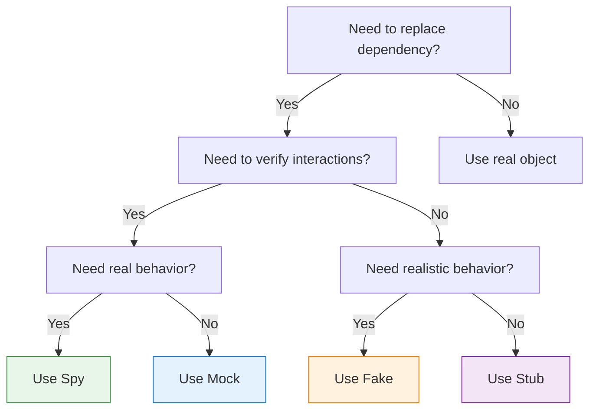
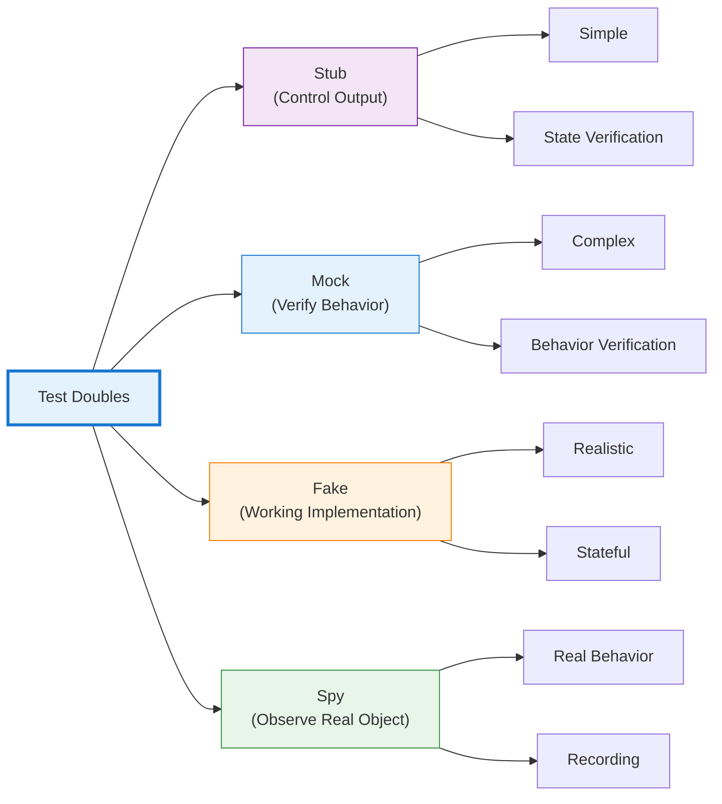

## Introduction

Writing testable code requires isolating the unit under test from its dependencies. A function that calls a database, sends emails, or makes HTTP requests is difficult to test—tests become slow, flaky, and dependent on external systems. How do you test payment processing without charging real credit cards? How do you verify error handling without crashing production services?

Test doubles solve this problem by replacing real dependencies with controlled substitutes. Just as stunt doubles replace actors in dangerous scenes, test doubles replace real objects in tests. But not all test doubles are created equal—mocks, stubs, fakes, and spies serve different purposes and follow different patterns.

Understanding these distinctions transforms how you write tests. Use the wrong type, and tests become brittle, unclear, or ineffective. Use the right type, and tests become precise, maintainable, and valuable. This guide clarifies what each test double does, when to use it, and how to implement it effectively.

## The Test Double Taxonomy

Gerard Meszaros introduced the term "test double" in his book "xUnit Test Patterns" as an umbrella term for any object that replaces a real dependency in tests. Martin Fowler popularized these concepts, particularly the distinction between mocks and stubs.

### The Five Types

Test doubles fall into five categories, each with distinct characteristics:

1. **Dummy**: Passed around but never used (fills parameter lists)
2. **Stub**: Provides predefined responses to calls
3. **Spy**: Records information about how it was called
4. **Mock**: Verifies behavior with expectations
5. **Fake**: Working implementation with shortcuts

This guide focuses on the four most commonly used types: Mock, Stub, Fake, and Spy.

## Stub: Controlling Outputs

Stubs provide predefined answers to calls made during tests. They don't care how they're called—they simply return configured responses. Stubs enable state verification: "Given this input, does the system produce the correct output?"

### Characteristics

- Returns hardcoded responses
- No verification of how it's called
- Focuses on state verification
- Simplest form of test double

### When to Use Stubs

Use stubs when you need to control what a dependency returns:

- Testing different response scenarios
- Simulating error conditions
- Providing test data
- Replacing slow operations (database queries, API calls)

### Implementation Examples

**JavaScript (Jest):**
```javascript
// Stub that always returns success
const paymentStub = {
  processPayment: jest.fn().mockReturnValue({
    status: 'success',
    transactionId: 'txn_12345'
  })
};

test('successful checkout creates order', () => {
  const order = checkout(cart, paymentStub);
  
  expect(order.status).toBe('completed');
  expect(order.transactionId).toBe('txn_12345');
});
```

**Python:**
```python
class PaymentServiceStub:
    def process_payment(self, amount, currency):
        return {
            'status': 'success',
            'transaction_id': 'txn_12345'
        }

def test_successful_checkout():
    service = PaymentServiceStub()
    order = checkout(cart, service)
    
    assert order.status == 'completed'
    assert order.transaction_id == 'txn_12345'
```

**Java (Mockito):**
```java
@Test
public void testSuccessfulCheckout() {
    PaymentService stub = mock(PaymentService.class);
    when(stub.processPayment(any(), any()))
        .thenReturn(new PaymentResult("success", "txn_12345"));
    
    Order order = checkout(cart, stub);
    
    assertEquals("completed", order.getStatus());
    assertEquals("txn_12345", order.getTransactionId());
}
```

### Stub Variations

**Error Stub:**
```javascript
const failingStub = {
  processPayment: jest.fn().mockRejectedValue(
    new Error('Insufficient funds')
  )
};

test('failed payment shows error message', async () => {
  await expect(checkout(cart, failingStub))
    .rejects.toThrow('Insufficient funds');
});
```

**Conditional Stub:**
```python
class ConditionalPaymentStub:
    def process_payment(self, amount, currency):
        if amount > 1000:
            raise PaymentError('Amount exceeds limit')
        return {'status': 'success'}

def test_large_payment_rejected():
    service = ConditionalPaymentStub()
    with pytest.raises(PaymentError):
        checkout(large_cart, service)
```

**Sequence Stub:**
```javascript
// Returns different values on successive calls
const sequenceStub = {
  getNextId: jest.fn()
    .mockReturnValueOnce(1)
    .mockReturnValueOnce(2)
    .mockReturnValueOnce(3)
};

test('generates sequential IDs', () => {
  expect(sequenceStub.getNextId()).toBe(1);
  expect(sequenceStub.getNextId()).toBe(2);
  expect(sequenceStub.getNextId()).toBe(3);
});
```

!!!tip "💡 Stub Best Practices"
    - Keep stubs simple—just return data
    - Don't add logic to stubs (use fakes instead)
    - Name stubs clearly: `successfulPaymentStub`, `failingPaymentStub`
    - Reuse common stubs across tests

## Mock: Verifying Behavior

Mocks are test doubles with expectations about how they should be called. Unlike stubs, which focus on what they return, mocks focus on how they're used. Mocks enable behavior verification: "Was this method called with the correct parameters?"

### Characteristics

- Verifies method calls and parameters
- Fails test if expectations not met
- Focuses on behavior verification
- More complex than stubs

### When to Use Mocks

Use mocks when the interaction itself is what you're testing:

- Verifying a method was called
- Checking call order
- Validating parameters passed
- Ensuring correct number of calls

### Implementation Examples

**JavaScript (Jest):**
```javascript
test('checkout calls payment service with correct amount', () => {
  const paymentMock = {
    processPayment: jest.fn().mockResolvedValue({ status: 'success' })
  };
  
  checkout(cart, paymentMock);
  
  // Verify the interaction
  expect(paymentMock.processPayment).toHaveBeenCalledWith({
    amount: 99.99,
    currency: 'USD'
  });
  expect(paymentMock.processPayment).toHaveBeenCalledTimes(1);
});
```

**Python (unittest.mock):**
```python
from unittest.mock import Mock

def test_checkout_calls_payment_service():
    payment_mock = Mock()
    payment_mock.process_payment.return_value = {'status': 'success'}
    
    checkout(cart, payment_mock)
    
    # Verify the interaction
    payment_mock.process_payment.assert_called_once_with(
        amount=99.99,
        currency='USD'
    )
```

**Java (Mockito):**
```java
@Test
public void testCheckoutCallsPaymentService() {
    PaymentService mock = mock(PaymentService.class);
    when(mock.processPayment(any(), any()))
        .thenReturn(new PaymentResult("success"));
    
    checkout(cart, mock);
    
    // Verify the interaction
    verify(mock).processPayment(
        argThat(amount -> amount.equals(99.99)),
        eq("USD")
    );
    verify(mock, times(1)).processPayment(any(), any());
}
```

### Advanced Mock Patterns

**Call Order Verification:**
```javascript
test('operations happen in correct order', () => {
  const logger = { log: jest.fn() };
  const db = { save: jest.fn() };
  
  processOrder(order, logger, db);
  
  const logCall = logger.log.mock.invocationCallOrder[0];
  const saveCall = db.save.mock.invocationCallOrder[0];
  
  expect(logCall).toBeLessThan(saveCall);
});
```

**Argument Matchers:**
```python
from unittest.mock import Mock, ANY

def test_sends_email_with_user_data():
    email_mock = Mock()
    
    register_user('alice@example.com', email_mock)
    
    email_mock.send.assert_called_with(
        to='alice@example.com',
        subject=ANY,  # Don't care about subject
        body=ANY
    )
```

!!!warning "⚠️ Mock Overuse"
    **Symptoms of mock overuse:**
    - Tests that mirror implementation details
    - Tests break when refactoring without behavior changes
    - More mock setup than actual test logic
    - Unclear what's being tested
    
    **Solution:** Use mocks sparingly. Prefer state verification (stubs) when possible. Mock only at architectural boundaries.

## Fake: Working Implementations

Fakes are working implementations that take shortcuts unsuitable for production. They behave like real objects but use simpler, faster approaches. Fakes are more complex than stubs but provide more realistic behavior.

### Characteristics

- Actual working implementation
- Uses shortcuts (in-memory vs. database)
- Maintains state across operations
- More realistic than stubs

### When to Use Fakes

Use fakes when you need realistic behavior without production complexity:

- In-memory database for testing
- Local file system instead of cloud storage
- Simplified authentication
- Fast alternatives to slow operations

### Implementation Examples

**In-Memory Repository:**
```javascript
class FakeUserRepository {
  constructor() {
    this.users = new Map();
    this.nextId = 1;
  }
  
  save(user) {
    const id = this.nextId++;
    const savedUser = { ...user, id };
    this.users.set(id, savedUser);
    return savedUser;
  }
  
  findById(id) {
    return this.users.get(id) || null;
  }
  
  findByEmail(email) {
    return Array.from(this.users.values())
      .find(u => u.email === email) || null;
  }
  
  delete(id) {
    return this.users.delete(id);
  }
}

test('user registration and retrieval', () => {
  const repo = new FakeUserRepository();
  
  const user = repo.save({ email: 'alice@example.com', name: 'Alice' });
  expect(user.id).toBe(1);
  
  const found = repo.findById(1);
  expect(found.email).toBe('alice@example.com');
  
  const foundByEmail = repo.findByEmail('alice@example.com');
  expect(foundByEmail.id).toBe(1);
});
```

**In-Memory Cache:**
```python
class FakeCache:
    def __init__(self):
        self.store = {}
    
    def get(self, key):
        return self.store.get(key)
    
    def set(self, key, value, ttl=None):
        self.store[key] = value
    
    def delete(self, key):
        self.store.pop(key, None)
    
    def clear(self):
        self.store.clear()

def test_caching_behavior():
    cache = FakeCache()
    service = DataService(cache)
    
    # First call fetches from source
    data1 = service.get_user(123)
    
    # Second call uses cache
    data2 = service.get_user(123)
    
    assert data1 == data2
    assert cache.get('user:123') is not None
```

**Fake File System:**
```java
public class FakeFileSystem implements FileSystem {
    private Map<String, byte[]> files = new HashMap<>();
    
    @Override
    public void write(String path, byte[] content) {
        files.put(path, content);
    }
    
    @Override
    public byte[] read(String path) throws FileNotFoundException {
        if (!files.containsKey(path)) {
            throw new FileNotFoundException(path);
        }
        return files.get(path);
    }
    
    @Override
    public boolean exists(String path) {
        return files.containsKey(path);
    }
    
    @Override
    public void delete(String path) {
        files.remove(path);
    }
}

@Test
public void testFileOperations() {
    FileSystem fs = new FakeFileSystem();
    
    fs.write("/test.txt", "Hello".getBytes());
    assertTrue(fs.exists("/test.txt"));
    
    byte[] content = fs.read("/test.txt");
    assertEquals("Hello", new String(content));
    
    fs.delete("/test.txt");
    assertFalse(fs.exists("/test.txt"));
}
```

!!!tip "💡 Fake Best Practices"
    - Keep fakes simple but realistic
    - Test the fake itself to ensure correctness
    - Share fakes across test suites
    - Document differences from real implementation
    - Consider extracting interface for real and fake implementations

## Spy: Recording Interactions

Spies wrap real objects, recording how they're called while delegating to the actual implementation. They combine real behavior with verification capabilities, enabling observation without replacement.

### Characteristics

- Wraps real object
- Delegates to actual implementation
- Records all interactions
- Enables verification of real behavior

### When to Use Spies

Use spies when you need to verify interactions with real objects:

- Verifying caching behavior
- Checking optimization (method called fewer times)
- Monitoring real object usage
- Partial mocking (spy some methods, real others)

### Implementation Examples

**JavaScript (Sinon):**
```javascript
const sinon = require('sinon');

test('caching reduces database calls', () => {
  const realDb = new Database();
  const dbSpy = sinon.spy(realDb);
  
  const service = new UserService(dbSpy);
  
  // First call hits database
  service.getUser(123);
  expect(dbSpy.query.calledOnce).toBe(true);
  
  // Second call uses cache
  service.getUser(123);
  expect(dbSpy.query.calledOnce).toBe(true); // Still only one call
});
```

**Python (unittest.mock):**
```python
from unittest.mock import spy

def test_cache_reduces_api_calls():
    real_api = ExternalAPI()
    api_spy = spy(real_api)
    
    service = DataService(api_spy)
    
    # First call hits API
    service.get_data('key1')
    assert api_spy.fetch.call_count == 1
    
    # Second call uses cache
    service.get_data('key1')
    assert api_spy.fetch.call_count == 1  # No additional call
```

**Java (Mockito):**
```java
@Test
public void testCachingReducesDatabaseCalls() {
    Database realDb = new Database();
    Database dbSpy = spy(realDb);
    
    UserService service = new UserService(dbSpy);
    
    // First call hits database
    service.getUser(123);
    verify(dbSpy, times(1)).query(any());
    
    // Second call uses cache
    service.getUser(123);
    verify(dbSpy, times(1)).query(any()); // Still only one call
}
```

### Partial Spies

Spies can selectively override methods while keeping others real:

```javascript
test('spy with partial override', () => {
  const realService = new PaymentService();
  const spy = sinon.spy(realService);
  
  // Override one method
  spy.validateCard = sinon.stub().returns(true);
  
  // Other methods use real implementation
  const result = spy.processPayment(card, amount);
  
  expect(spy.validateCard.called).toBe(true);
  expect(result).toBeDefined(); // Real processPayment executed
});
```

!!!warning "⚠️ Spy Limitations"
    **When spies don't work well:**
    - Real object has side effects (sends emails, charges cards)
    - Real object is slow (database queries, API calls)
    - Real object requires complex setup
    - Testing error conditions (real object doesn't fail on demand)
    
    **Solution:** Use mocks or stubs instead when real behavior is problematic.

## Choosing the Right Test Double

Selecting the appropriate test double depends on what you're testing and what you need to verify.

### Decision Framework



### Comparison Matrix

| Aspect | Stub | Mock | Fake | Spy |
|--------|------|------|------|-----|
| **Complexity** | Low | Medium | High | Low |
| **Verifies calls** | No | Yes | No | Yes |
| **Real implementation** | No | No | Simplified | Yes |
| **Maintains state** | No | No | Yes | Yes (real) |
| **Setup effort** | Minimal | Medium | High | Minimal |
| **Test clarity** | High | Medium | High | Medium |
| **Brittleness** | Low | High | Low | Medium |

### Practical Guidelines

!!!anote "📋 When to Use Each Type"
    **Use Stub when:**
    - You need to control return values
    - Testing different scenarios (success, failure)
    - Replacing slow operations
    - State verification is sufficient
    
    **Use Mock when:**
    - Verifying method was called
    - Checking parameters passed
    - Validating call order
    - Interaction is what matters
    
    **Use Fake when:**
    - Need realistic behavior
    - Testing complex interactions
    - State persists across operations
    - Real implementation too slow/complex
    
    **Use Spy when:**
    - Need real behavior
    - Want to verify optimization
    - Partial mocking needed
    - Monitoring real object usage

## Common Pitfalls and Anti-Patterns

Understanding test doubles isn't enough—you must avoid common mistakes that undermine test quality.

### Over-Mocking

**Problem:** Mocking everything, including simple objects.

```javascript
// Bad: Over-mocking
test('calculates total', () => {
  const item1 = { getPrice: jest.fn().mockReturnValue(10) };
  const item2 = { getPrice: jest.fn().mockReturnValue(20) };
  
  const total = calculateTotal([item1, item2]);
  expect(total).toBe(30);
});

// Good: Use real objects when simple
test('calculates total', () => {
  const items = [
    { price: 10 },
    { price: 20 }
  ];
  
  const total = calculateTotal(items);
  expect(total).toBe(30);
});
```

### Testing Implementation Details

**Problem:** Mocks that verify internal implementation rather than behavior.

```javascript
// Bad: Tests implementation
test('processes order', () => {
  const validator = { validate: jest.fn().mockReturnValue(true) };
  const calculator = { calculate: jest.fn().mockReturnValue(100) };
  const logger = { log: jest.fn() };
  
  processOrder(order, validator, calculator, logger);
  
  expect(validator.validate).toHaveBeenCalled();
  expect(calculator.calculate).toHaveBeenCalled();
  expect(logger.log).toHaveBeenCalledTimes(3);
});

// Good: Tests behavior
test('processes valid order', () => {
  const result = processOrder(validOrder);
  
  expect(result.status).toBe('completed');
  expect(result.total).toBe(100);
});
```

### Fragile Tests

**Problem:** Tests break when refactoring without behavior changes.

```python
# Bad: Fragile test
def test_user_registration():
    db_mock = Mock()
    email_mock = Mock()
    logger_mock = Mock()
    
    register_user('alice@example.com', db_mock, email_mock, logger_mock)
    
    # Breaks if internal implementation changes
    logger_mock.info.assert_called_with('Starting registration')
    db_mock.save.assert_called_once()
    logger_mock.info.assert_called_with('User saved')
    email_mock.send.assert_called_once()
    logger_mock.info.assert_called_with('Email sent')

# Good: Resilient test
def test_user_registration():
    result = register_user('alice@example.com')
    
    assert result.success is True
    assert result.user_id is not None
    assert email_was_sent_to('alice@example.com')
```

### Unclear Test Intent

**Problem:** Tests that don't clearly communicate what they're verifying.

```java
// Bad: Unclear intent
@Test
public void testCheckout() {
    PaymentService mock = mock(PaymentService.class);
    when(mock.processPayment(any(), any())).thenReturn(result);
    
    checkout(cart, mock);
    
    verify(mock).processPayment(any(), any());
}

// Good: Clear intent
@Test
public void checkoutProcessesPaymentWithCartTotal() {
    PaymentService mock = mock(PaymentService.class);
    when(mock.processPayment(99.99, "USD")).thenReturn(successResult);
    
    Order order = checkout(cart, mock);
    
    verify(mock).processPayment(99.99, "USD");
    assertEquals("completed", order.getStatus());
}
```

## Best Practices

Follow these practices to write effective tests with test doubles.

### Prefer State Verification Over Behavior Verification

State verification (using stubs) is less brittle than behavior verification (using mocks). Test what the system produces, not how it produces it.

```javascript
// Prefer this (state verification)
test('checkout creates completed order', () => {
  const paymentStub = { processPayment: () => ({ status: 'success' }) };
  
  const order = checkout(cart, paymentStub);
  
  expect(order.status).toBe('completed');
});

// Over this (behavior verification)
test('checkout calls payment service', () => {
  const paymentMock = { processPayment: jest.fn() };
  
  checkout(cart, paymentMock);
  
  expect(paymentMock.processPayment).toHaveBeenCalled();
});
```

### Mock at Architectural Boundaries

Mock external dependencies (databases, APIs, file systems), not internal objects.

```python
# Good: Mock at boundary
def test_user_service():
    db_stub = FakeDatabase()
    service = UserService(db_stub)
    
    user = service.create_user('alice@example.com')
    
    assert user.id is not None

# Bad: Mock internal objects
def test_user_service():
    validator_mock = Mock()
    formatter_mock = Mock()
    service = UserService(validator_mock, formatter_mock)
    
    # Test becomes coupled to internal implementation
```

### Keep Test Doubles Simple

Complex test doubles indicate design problems. If a test double is hard to create, the real object is probably too complex.

```javascript
// If this is hard to mock...
class ComplexService {
  constructor(db, cache, logger, metrics, config, validator) {
    // Too many dependencies
  }
}

// ...simplify the design
class SimpleService {
  constructor(repository) {
    // Single dependency at architectural boundary
  }
}
```

### Name Test Doubles Clearly

Use descriptive names that indicate the double's purpose.

```python
# Good names
successful_payment_stub = PaymentStub(status='success')
failing_payment_stub = PaymentStub(status='failed')
empty_repository_fake = FakeRepository()
payment_service_spy = spy(PaymentService())

# Bad names
stub1 = PaymentStub()
mock = Mock()
fake = FakeRepository()
```

## Conclusion

Test doubles are essential tools for writing effective unit tests. Understanding the distinctions between mocks, stubs, fakes, and spies enables you to choose the right tool for each testing scenario.

**Key takeaways:**

- **Stubs** control outputs—use for state verification
- **Mocks** verify behavior—use sparingly at architectural boundaries
- **Fakes** provide working implementations—use for complex dependencies
- **Spies** observe real objects—use when real behavior matters



The best tests use the simplest test double that meets their needs. Prefer stubs over mocks, real objects over test doubles, and state verification over behavior verification. Mock at architectural boundaries, not internal implementation details. Keep test doubles simple—complex doubles indicate design problems.

Master these patterns, and your tests become clearer, more maintainable, and more valuable. They'll catch bugs without breaking during refactoring, communicate intent without obscuring logic, and run fast without sacrificing confidence.

Test doubles aren't just testing tools—they're design feedback mechanisms. Difficulty creating test doubles reveals design problems: too many dependencies, unclear boundaries, or excessive coupling. Listen to this feedback, and your code will become more modular, testable, and maintainable.

Start applying these patterns today. Replace your next mock with a stub. Extract a fake for your database tests. Use a spy to verify optimization. Experience the difference between test doubles used well and test doubles used poorly. Your tests—and your code—will thank you.

## References and Resources

- **Martin Fowler - Mocks Aren't Stubs**: [https://martinfowler.com/articles/mocksArentStubs.html](https://martinfowler.com/articles/mocksArentStubs.html)
- **xUnit Test Patterns** by Gerard Meszaros
- **Growing Object-Oriented Software, Guided by Tests** by Steve Freeman and Nat Pryce
- **Jest Documentation**: [https://jestjs.io/docs/mock-functions](https://jestjs.io/docs/mock-functions)
- **Mockito Documentation**: [https://site.mockito.org/](https://site.mockito.org/)
- **Python unittest.mock**: [https://docs.python.org/3/library/unittest.mock.html](https://docs.python.org/3/library/unittest.mock.html)
- **Sinon.JS**: [https://sinonjs.org/](https://sinonjs.org/)
