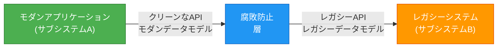
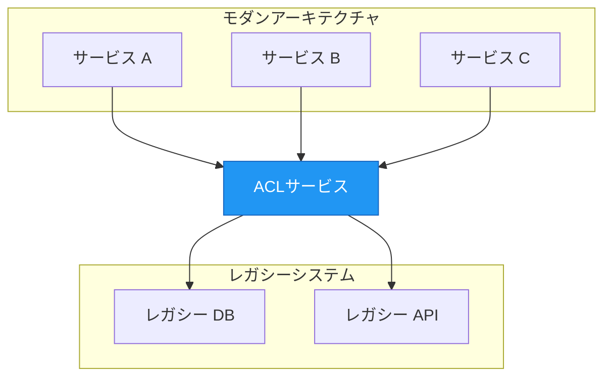

モダンアプリケーションを構築する際、同じ設計原則を共有しないレガシーシステムや外部サービスと統合する必要があることがよくあります。腐敗防止層パターンは、この課題に対するエレガントなソリューションを提供し、クリーンなアーキテクチャが時代遅れまたは設計が不十分な外部システムによって「腐敗」するのを防ぐ保護バリアとして機能します。

## 🎯 腐敗防止層パターンとは？

腐敗防止層（ACL）パターンは、Eric Evansの画期的な著書*ドメイン駆動設計*で最初に説明されたもので、同じセマンティクスを共有しない異なるサブシステム間にファサードまたはアダプター層を実装します。この層は、あるサブシステムが他のサブシステムに対して行うリクエストを変換し、アプリケーションの設計が外部システムへの依存関係によって制限されないようにします。

これは、異なる言語を話し、異なる習慣に従う2つの国の間の外交翻訳者のようなものです。翻訳者は、各国が独自の文化と慣習を維持しながら、スムーズなコミュニケーションを保証します。

## 📖 問題：レガシーシステムの統合

ほとんどのアプリケーションは、データや機能のために他のシステムに依存しています。これらの一般的なシナリオを考えてみましょう：

- **レガシー移行**：レガシーアプリケーションがモダンシステムに移行されていますが、移行中は既存のレガシーリソースにアクセスする必要があります
- **段階的なモダナイゼーション**：より大きなアプリケーションのさまざまな機能が時間をかけてモダンシステムに移行されます
- **サードパーティ統合**：制御できない外部システムとアプリケーションが通信する必要があります

レガシーシステムは、品質の問題に悩まされることがよくあります：

- 複雑なデータスキーマ
- 時代遅れのAPI
- 古いプロトコル
- 不十分なドキュメント
- 一貫性のない命名規則

これらのシステムと相互運用するために、新しいアプリケーションは、時代遅れのインフラストラクチャ、プロトコル、データモデル、またはAPI（モダンアプリケーションには含めない機能）をサポートすることを余儀なくされる可能性があります。これは、クリーンに設計されたシステムを「腐敗」させます。

!!!warning "⚠️ 腐敗のリスク"
    新しいシステムとレガシーシステム間の直接アクセスを維持すると、新しいシステムがレガシーシステムのAPIとセマンティクスに従うことを余儀なくされる可能性があります。これらのレガシー機能に品質の問題がある場合、モダンアプリケーションの設計の整合性が損なわれます。
!!!

## 💡 ソリューション：翻訳による分離

腐敗防止層パターンは、異なるサブシステムを分離し、それらの間に翻訳層を配置することでこれを解決します。この層は、2つのシステム間のすべての通信を処理し、一方のシステムを変更せずに維持しながら、もう一方のシステムが設計を損なうことを回避できるようにします。



### 仕組み

1. **サブシステムA**（モダンアプリケーション）は、独自のクリーンなデータモデルとアーキテクチャを使用して腐敗防止層を呼び出します
2. **ACL**は、サブシステムBが期待する形式にリクエストを変換します
3. **サブシステムB**（レガシーシステム）は、ネイティブ形式でリクエストを受信します
4. **ACL**は、レスポンスをサブシステムAの形式に変換します
5. **サブシステムA**は、期待される形式でデータを受信し、レガシーシステムの癖を完全に認識しません

腐敗防止層には、2つのシステム間の変換に必要なすべてのロジックが含まれています：

- **データ変換**：異なるデータモデル間の変換
- **プロトコルアダプテーション**：異なる通信プロトコルのブリッジング
- **APIマッピング**：異なるAPIコントラクト間の変換
- **エラー処理**：エラー形式とコードの変換

## 🏗️ 実装アプローチ

腐敗防止層は、いくつかの方法で実装できます：

### 1. アプリケーション内のコンポーネント

ACLをアプリケーション内のモジュールまたはコンポーネントとして実装します：

```javascript
// 例：サービスクラスとしてのACL
class LegacySystemAdapter {
  constructor(legacyClient) {
    this.legacyClient = legacyClient;
  }
  
  async getCustomer(customerId) {
    // レガシーシステムを呼び出す
    const legacyData = await this.legacyClient.fetchCustomerRecord(customerId);
    
    // モダン形式に変換
    return {
      id: legacyData.CUST_ID,
      name: `${legacyData.FIRST_NM} ${legacyData.LAST_NM}`,
      email: legacyData.EMAIL_ADDR,
      createdAt: new Date(legacyData.CREATE_DT)
    };
  }
}
```

### 2. 独立したサービス

ACLを別のマイクロサービスとしてデプロイします：



### 3. APIゲートウェイパターン

APIゲートウェイを使用してACL機能を実装します：

- 集中化された変換ロジック
- レート制限とキャッシング
- 認証と認可
- リクエスト/レスポンス変換

## ⚖️ 主要な考慮事項

腐敗防止層を実装する前に、これらの重要な要素を考慮してください：

### パフォーマンスへの影響

!!!warning "🐌 レイテンシの考慮事項"
    腐敗防止層は、通信パスに追加のホップを追加し、レイテンシを導入します。特に高頻度の操作では、この影響を測定および監視してください。
!!!

**軽減戦略：**
- 頻繁にアクセスされるデータのキャッシングを実装する
- 可能な場合は非同期通信を使用する
- 変換ロジックを最適化する
- バッチ操作を検討する

### 運用オーバーヘッド

ACLは、次のことが必要な追加コンポーネントです：

- **デプロイとホスティング**：インフラストラクチャとリソース
- **監視**：ヘルスチェック、メトリクス、ログ
- **メンテナンス**：更新、バグ修正、改善
- **ドキュメント**：APIコントラクトと変換ルール

### スケーラビリティ

腐敗防止層がどのようにスケールするかを検討してください：

- アプリケーションが成長するにつれて、増加する負荷を処理できますか？
- 水平方向にスケーラブルである必要がありますか？
- ボトルネックは何ですか？
- ピークトラフィックをどのように処理しますか？

### 複数のACLインスタンス

複数の腐敗防止層が必要になる場合があります：

- 異なるサブシステムに対する異なる技術または言語
- 関心の分離（レガシーシステムごとに1つのACL）
- チームの所有権の境界
- パフォーマンスの最適化（地域デプロイ）

### トランザクションとデータの一貫性

!!!danger "🔄 一貫性の課題"
    ACL境界を越えてトランザクションとデータの一貫性が維持されることを確認してください。これは、両方のシステムにまたがる操作では特に重要です。
!!!

検討事項：
- 分散トランザクションをどのように処理しますか？
- どのような一貫性保証が必要ですか？
- データの整合性をどのように監視しますか？
- ロールバック戦略は何ですか？

### 責任範囲

ACLが処理すべきことを決定します：

- **すべての通信**：すべてのインタラクションがACLを経由します
- **機能のサブセット**：特定の操作のみがACLを使用します
- **読み取り vs 書き込み**：クエリと更新に対する異なる戦略

### 移行戦略

ACLが移行戦略の一部である場合：

- **一時的**：移行完了後に廃止されますか？
- **永続的**：統合層として残りますか？
- **段階的な廃止**：どのように段階的に削除しますか？

## ✅ このパターンを使用する場合

腐敗防止層パターンは、次の場合に理想的です：

1. **段階的な移行**：移行が複数の段階で計画されていますが、新しいシステムとレガシーシステム間の統合を維持する必要があります
2. **セマンティックの違い**：2つ以上のサブシステムが異なるセマンティクスを持っていますが、通信する必要があります
3. **外部依存関係**：制御できないサードパーティシステムと統合する必要があります
4. **品質保護**：設計が不十分な外部システムからクリーンなアーキテクチャを保護したい
5. **チームの自律性**：異なるチームが異なるサブシステムを所有し、明確な境界が必要です

## ❌ このパターンを使用しない場合

このパターンは、次の場合には適していない可能性があります：

- **セマンティックの違いがない**：新しいシステムとレガシーシステムがすでに類似した設計とデータモデルを共有しています
- **シンプルな統合**：統合が簡単で、追加の複雑さを正当化しません
- **パフォーマンスクリティカル**：追加されたレイテンシがユースケースに受け入れられません
- **リソースの制約**：追加のサービスを維持するリソースがありません

## 🎯 実世界の例

eコマースプラットフォームをモダナイズしているとしましょう。レガシーシステムは、次のように顧客データを保存します：

```json
{
  "CUST_ID": "12345",
  "FIRST_NM": "John",
  "LAST_NM": "Doe",
  "EMAIL_ADDR": "john@neo01.com",
  "CREATE_DT": "20190215",
  "STATUS_CD": "A"
}
```

モダンアプリケーションは、このモデルを使用します：

```json
{
  "customerId": "12345",
  "fullName": "John Doe",
  "email": "john@neo01.com",
  "registeredAt": "2019-02-15T00:00:00Z",
  "isActive": true
}
```

ACLは変換を処理します：

```javascript
class CustomerAdapter {
  toLegacyFormat(modernCustomer) {
    return {
      CUST_ID: modernCustomer.customerId,
      FIRST_NM: modernCustomer.fullName.split(' ')[0],
      LAST_NM: modernCustomer.fullName.split(' ').slice(1).join(' '),
      EMAIL_ADDR: modernCustomer.email,
      CREATE_DT: modernCustomer.registeredAt.replace(/-/g, '').substring(0, 8),
      STATUS_CD: modernCustomer.isActive ? 'A' : 'I'
    };
  }
  
  toModernFormat(legacyCustomer) {
    return {
      customerId: legacyCustomer.CUST_ID,
      fullName: `${legacyCustomer.FIRST_NM} ${legacyCustomer.LAST_NM}`,
      email: legacyCustomer.EMAIL_ADDR,
      registeredAt: this.parseDate(legacyCustomer.CREATE_DT),
      isActive: legacyCustomer.STATUS_CD === 'A'
    };
  }
  
  parseDate(dateStr) {
    // YYYYMMDDをISO形式に変換
    return `${dateStr.substring(0,4)}-${dateStr.substring(4,6)}-${dateStr.substring(6,8)}T00:00:00Z`;
  }
}
```

## 🏆 メリット

腐敗防止層パターンを実装すると、いくつかの利点があります：

1. **設計の独立性**：モダンアプリケーションがクリーンなアーキテクチャを維持します
2. **柔軟性**：レガシーシステムを簡単に交換またはアップグレードできます
3. **チームの自律性**：チームが異なるサブシステムで独立して作業できます
4. **段階的な移行**：段階的なモダナイゼーションアプローチをサポートします
5. **テスト可能性**：モックされたACLレスポンスでテストが容易になります
6. **保守性**：レガシーシステムへの変更がACLに分離されます

## 📚 参考文献

- Evans, Eric. *Domain-Driven Design: Tackling Complexity in the Heart of Software*. Addison-Wesley, 2003.
- [Cloud Design Patterns - Anti-Corruption Layer](https://learn.microsoft.com/en-us/azure/architecture/patterns/anti-corruption-layer)

---

腐敗防止層パターンは、レガシーまたは外部システムと統合しながらアーキテクチャの整合性を維持するための強力なツールです。専用の層に変換ロジックを分離することで、直接統合が必要とする妥協からモダンアプリケーションを保護します。複雑さと運用オーバーヘッドが追加されますが、クリーンなアーキテクチャと保守性のメリットは、特に大規模なモダナイゼーションの取り組みでは、これらのコストを上回ることがよくあります。
