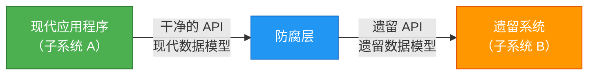
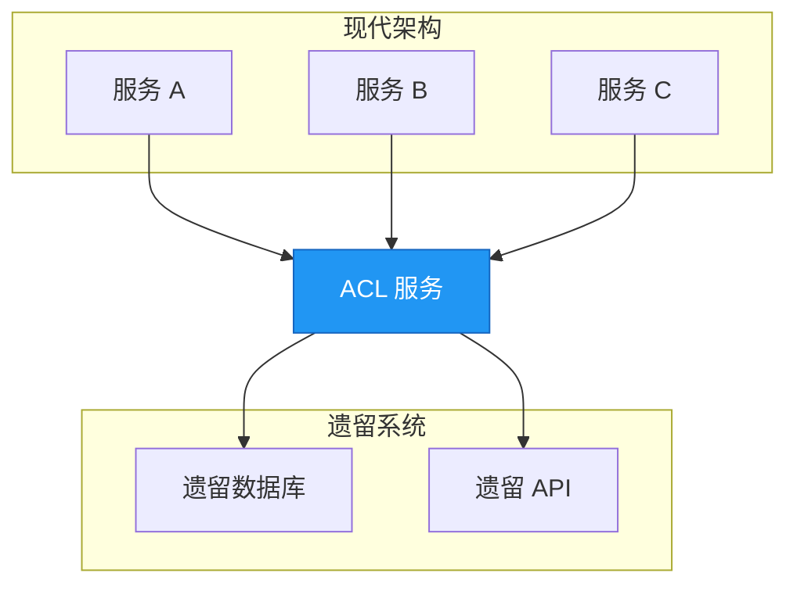

在构建现代应用程序时，你经常需要集成不共享相同设计原则的遗留系统或外部服务。防腐层模式为这个挑战提供了优雅的解决方案，作为一个保护屏障，防止你的干净架构被过时或设计不良的外部系统"污染"。

## 🎯 什么是防腐层模式？

防腐层（ACL）模式最早由 Eric Evans 在其开创性著作《领域驱动设计》中描述，它在不共享相同语义的不同子系统之间实现了一个外观层或适配器层。这一层转译一个子系统向另一个子系统发出的请求，确保你的应用程序设计不受外部系统依赖的限制。

可以把它想象成两个说不同语言、遵循不同习俗的国家之间的外交翻译。翻译确保顺畅沟通，同时每个国家都保持自己的文化和实践。

## 📖 问题：遗留系统集成

大多数应用程序依赖其他系统来获取数据或功能。考虑这些常见场景：

- **遗留系统迁移**：遗留应用程序正在迁移到现代系统，但在过渡期间仍需要访问现有的遗留资源
- **渐进式现代化**：大型应用程序的不同功能随时间逐步迁移到现代系统
- **第三方集成**：你的应用程序需要与你无法控制的外部系统通信

遗留系统通常存在质量问题：

- 复杂的数据结构
- 过时的 API
- 过时的协议
- 文档不足
- 不一致的命名惯例

为了与这些系统互通，你的新应用程序可能被迫支持过时的基础设施、协议、数据模型或 API——这些都是你原本不会在现代应用程序中包含的功能。这会"污染"原本可以是干净设计的系统。

!!!warning "⚠️ 污染风险"
    维护新旧系统之间的直接访问可能迫使新系统遵守遗留系统的 API 和语义。当这些遗留功能存在质量问题时，它们会损害你现代应用程序的设计完整性。
!!!

## 💡 解决方案：通过转译进行隔离

防腐层模式通过隔离不同的子系统并在它们之间放置一个转译层来解决这个问题。这一层处理两个系统之间的所有通信，允许一个系统保持不变，而另一个系统避免损害其设计。



### 运作方式

1. **子系统 A**（你的现代应用程序）使用自己的干净数据模型和架构调用防腐层
2. **ACL** 将请求转译为子系统 B 预期的格式
3. **子系统 B**（遗留系统）以其原生格式接收请求
4. **ACL** 将响应转译回子系统 A 的格式
5. **子系统 A** 以其预期的格式接收数据，完全不知道遗留系统的怪癖

防腐层包含在两个系统之间进行转译所需的所有逻辑，包括：

- **数据转换**：在不同数据模型之间转换
- **协议适配**：桥接不同的通信协议
- **API 映射**：在不同的 API 契约之间转译
- **错误处理**：转换错误格式和代码

## 🏗️ 实现方法

防腐层可以通过多种方式实现：

### 1. 应用程序内的组件

将 ACL 实现为应用程序内的模块或组件：

```javascript
// 示例：ACL 作为服务类
class LegacySystemAdapter {
  constructor(legacyClient) {
    this.legacyClient = legacyClient;
  }
  
  async getCustomer(customerId) {
    // 调用遗留系统
    const legacyData = await this.legacyClient.fetchCustomerRecord(customerId);
    
    // 转换为现代格式
    return {
      id: legacyData.CUST_ID,
      name: `${legacyData.FIRST_NM} ${legacyData.LAST_NM}`,
      email: legacyData.EMAIL_ADDR,
      createdAt: new Date(legacyData.CREATE_DT)
    };
  }
}
```

### 2. 独立服务

将 ACL 部署为独立的微服务：



### 3. API 网关模式

使用 API 网关来实现 ACL 功能：

- 集中式转译逻辑
- 速率限制和缓存
- 身份验证和授权
- 请求/响应转换

## ⚖️ 关键考量

在实现防腐层之前，请考虑这些重要因素：

### 性能影响

!!!warning "🐌 延迟考量"
    防腐层在通信路径中增加了额外的跳跃，这会引入延迟。测量和监控这种影响，特别是对于高频率操作。
!!!

**缓解策略：**
- 为经常访问的数据实现缓存
- 尽可能使用异步通信
- 优化转换逻辑
- 考虑批处理操作

### 运营开销

ACL 是一个需要以下资源的额外组件：

- **部署和托管**：基础设施和资源
- **监控**：健康检查、指标和日志记录
- **维护**：更新、错误修复和改进
- **文档**：API 契约和转换规则

### 可扩展性

考虑你的防腐层将如何扩展：

- 随着应用程序增长，它能处理增加的负载吗？
- 它应该是水平可扩展的吗？
- 瓶颈在哪里？
- 你将如何处理峰值流量？

### 多个 ACL 实例

你可能需要多个防腐层：

- 不同子系统使用不同的技术或语言
- 关注点分离（每个遗留系统一个 ACL）
- 团队所有权边界
- 性能优化（区域部署）

### 事务和数据一致性

!!!danger "🔄 一致性挑战"
    确保在 ACL 边界上维护事务和数据一致性。这对于跨越两个系统的操作尤其重要。
!!!

考虑：
- 你将如何处理分布式事务？
- 你需要什么一致性保证？
- 你将如何监控数据完整性？
- 你的回滚策略是什么？

### 责任范围

确定 ACL 应该处理什么：

- **所有通信**：每个交互都通过 ACL
- **功能子集**：只有特定操作使用 ACL
- **读取与写入**：查询和更新的不同策略

### 迁移策略

如果 ACL 是迁移策略的一部分：

- **临时性**：迁移完成后会被淘汰吗？
- **永久性**：它会作为集成层保留吗？
- **阶段性淘汰**：你将如何逐步移除它？

## ✅ 何时使用此模式

防腐层模式在以下情况下是理想的：

1. **渐进式迁移**：计划分多个阶段进行迁移，但必须维护新旧系统之间的集成
2. **语义差异**：两个或多个子系统具有不同的语义但仍需要通信
3. **外部依赖**：你需要与你无法控制的第三方系统集成
4. **质量保护**：你想保护你的干净架构免受设计不良的外部系统影响
5. **团队自主性**：不同团队拥有不同的子系统并需要明确的边界

## ❌ 何时不使用此模式

此模式在以下情况下可能不适合：

- **无语义差异**：新旧系统已经共享相似的设计和数据模型
- **简单集成**：集成很简单，不值得增加额外的复杂性
- **性能关键**：增加的延迟对你的用例来说是不可接受的
- **资源限制**：你缺乏维护额外服务的资源

## 🎯 实际示例

假设你正在现代化一个电子商务平台。遗留系统这样存储客户数据：

```json
{
  "CUST_ID": "12345",
  "FIRST_NM": "John",
  "LAST_NM": "Doe",
  "EMAIL_ADDR": "john@neo01.com",
  "CREATE_DT": "20190215",
  "STATUS_CD": "A"
}
```

你的现代应用程序使用这个模型：

```json
{
  "customerId": "12345",
  "fullName": "John Doe",
  "email": "john@neo01.com",
  "registeredAt": "2019-02-15T00:00:00Z",
  "isActive": true
}
```

ACL 处理转译：

```javascript
class CustomerAdapter {
  toLegacyFormat(modernCustomer) {
    return {
      CUST_ID: modernCustomer.customerId,
      FIRST_NM: modernCustomer.fullName.split(' ')[0],
      LAST_NM: modernCustomer.fullName.split(' ').slice(1).join(' '),
      EMAIL_ADDR: modernCustomer.email,
      CREATE_DT: modernCustomer.registeredAt.replace(/-/g, '').substring(0, 8),
      STATUS_CD: modernCustomer.isActive ? 'A' : 'I'
    };
  }
  
  toModernFormat(legacyCustomer) {
    return {
      customerId: legacyCustomer.CUST_ID,
      fullName: `${legacyCustomer.FIRST_NM} ${legacyCustomer.LAST_NM}`,
      email: legacyCustomer.EMAIL_ADDR,
      registeredAt: this.parseDate(legacyCustomer.CREATE_DT),
      isActive: legacyCustomer.STATUS_CD === 'A'
    };
  }
  
  parseDate(dateStr) {
    // 将 YYYYMMDD 转换为 ISO 格式
    return `${dateStr.substring(0,4)}-${dateStr.substring(4,6)}-${dateStr.substring(6,8)}T00:00:00Z`;
  }
}
```

## 🏆 优点

实现防腐层模式提供了几个优势：

1. **设计独立性**：你的现代应用程序维护其干净的架构
2. **灵活性**：易于替换或升级遗留系统
3. **团队自主性**：团队可以独立地在不同的子系统上工作
4. **渐进式迁移**：支持阶段性现代化方法
5. **可测试性**：使用模拟的 ACL 响应更容易测试
6. **可维护性**：对遗留系统的变更被隔离在 ACL 中

## 📚 参考资料

- Evans, Eric. *领域驱动设计：软件核心复杂性的解决方法*. Addison-Wesley, 2003.
- [云设计模式 - 防腐层](https://learn.microsoft.com/en-us/azure/architecture/patterns/anti-corruption-layer)

---

防腐层模式是在集成遗留系统或外部系统时维护架构完整性的强大工具。通过将转译逻辑隔离在专用层中，你可以保护现代应用程序免受直接集成所需的妥协。虽然它增加了复杂性和运营开销，但干净架构和可维护性的好处通常超过这些成本，特别是在大规模现代化工作中。
