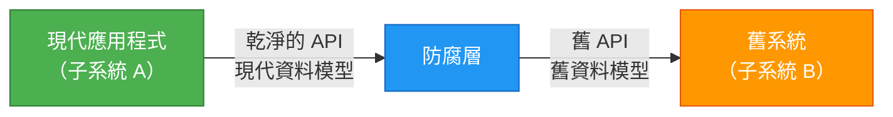
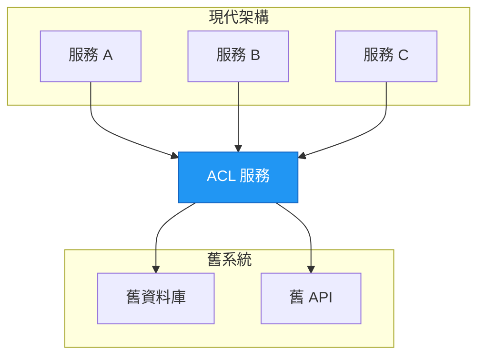

在建構現代應用程式時，你經常需要整合不共享相同設計原則的舊系統或外部服務。防腐層模式為這個挑戰提供了優雅的解決方案，作為一個保護屏障，防止你的乾淨架構被過時或設計不良的外部系統「污染」。

## 🎯 什麼是防腐層模式？

防腐層（ACL）模式最早由 Eric Evans 在其開創性著作《領域驅動設計》中描述，它在不共享相同語義的不同子系統之間實作了一個外觀層或適配器層。這一層轉譯一個子系統向另一個子系統發出的請求，確保你的應用程式設計不受外部系統依賴的限制。

可以把它想像成兩個說不同語言、遵循不同習俗的國家之間的外交翻譯。翻譯確保順暢溝通，同時每個國家都保持自己的文化和實踐。

## 📖 問題：舊系統整合

大多數應用程式依賴其他系統來獲取資料或功能。考慮這些常見場景：

- **舊系統遷移**：舊應用程式正在遷移到現代系統，但在過渡期間仍需要存取現有的舊資源
- **漸進式現代化**：大型應用程式的不同功能隨時間逐步遷移到現代系統
- **第三方整合**：你的應用程式需要與你無法控制的外部系統通訊

舊系統通常存在品質問題：

- 複雜的資料結構
- 過時的 API
- 過時的協定
- 文件不足
- 不一致的命名慣例

為了與這些系統互通，你的新應用程式可能被迫支援過時的基礎設施、協定、資料模型或 API——這些都是你原本不會在現代應用程式中包含的功能。這會「污染」原本可以是乾淨設計的系統。

!!!warning "⚠️ 污染風險"
    維護新舊系統之間的直接存取可能迫使新系統遵守舊系統的 API 和語義。當這些舊功能存在品質問題時，它們會損害你現代應用程式的設計完整性。
!!!

## 💡 解決方案：透過轉譯進行隔離

防腐層模式透過隔離不同的子系統並在它們之間放置一個轉譯層來解決這個問題。這一層處理兩個系統之間的所有通訊，允許一個系統保持不變，而另一個系統避免損害其設計。



### 運作方式

1. **子系統 A**（你的現代應用程式）使用自己的乾淨資料模型和架構呼叫防腐層
2. **ACL** 將請求轉譯為子系統 B 預期的格式
3. **子系統 B**（舊系統）以其原生格式接收請求
4. **ACL** 將回應轉譯回子系統 A 的格式
5. **子系統 A** 以其預期的格式接收資料，完全不知道舊系統的怪癖

防腐層包含在兩個系統之間進行轉譯所需的所有邏輯，包括：

- **資料轉換**：在不同資料模型之間轉換
- **協定適配**：橋接不同的通訊協定
- **API 映射**：在不同的 API 契約之間轉譯
- **錯誤處理**：轉換錯誤格式和代碼

## 🏗️ 實作方法

防腐層可以透過多種方式實作：

### 1. 應用程式內的元件

將 ACL 實作為應用程式內的模組或元件：

```javascript
// 範例：ACL 作為服務類別
class LegacySystemAdapter {
  constructor(legacyClient) {
    this.legacyClient = legacyClient;
  }
  
  async getCustomer(customerId) {
    // 呼叫舊系統
    const legacyData = await this.legacyClient.fetchCustomerRecord(customerId);
    
    // 轉換為現代格式
    return {
      id: legacyData.CUST_ID,
      name: `${legacyData.FIRST_NM} ${legacyData.LAST_NM}`,
      email: legacyData.EMAIL_ADDR,
      createdAt: new Date(legacyData.CREATE_DT)
    };
  }
}
```

### 2. 獨立服務

將 ACL 部署為獨立的微服務：



### 3. API 閘道模式

使用 API 閘道來實作 ACL 功能：

- 集中式轉譯邏輯
- 速率限制和快取
- 身份驗證和授權
- 請求/回應轉換

## ⚖️ 關鍵考量

在實作防腐層之前，請考慮這些重要因素：

### 效能影響

!!!warning "🐌 延遲考量"
    防腐層在通訊路徑中增加了額外的跳躍，這會引入延遲。測量和監控這種影響，特別是對於高頻率操作。
!!!

**緩解策略：**
- 為經常存取的資料實作快取
- 盡可能使用非同步通訊
- 最佳化轉換邏輯
- 考慮批次操作

### 營運開銷

ACL 是一個需要以下資源的額外元件：

- **部署和託管**：基礎設施和資源
- **監控**：健康檢查、指標和日誌記錄
- **維護**：更新、錯誤修復和改進
- **文件**：API 契約和轉換規則

### 可擴展性

考慮你的防腐層將如何擴展：

- 隨著應用程式成長，它能處理增加的負載嗎？
- 它應該是水平可擴展的嗎？
- 瓶頸在哪裡？
- 你將如何處理尖峰流量？

### 多個 ACL 實例

你可能需要多個防腐層：

- 不同子系統使用不同的技術或語言
- 關注點分離（每個舊系統一個 ACL）
- 團隊所有權邊界
- 效能最佳化（區域部署）

### 交易和資料一致性

!!!danger "🔄 一致性挑戰"
    確保在 ACL 邊界上維護交易和資料一致性。這對於跨越兩個系統的操作尤其重要。
!!!

考慮：
- 你將如何處理分散式交易？
- 你需要什麼一致性保證？
- 你將如何監控資料完整性？
- 你的回滾策略是什麼？

### 責任範圍

確定 ACL 應該處理什麼：

- **所有通訊**：每個互動都通過 ACL
- **功能子集**：只有特定操作使用 ACL
- **讀取與寫入**：查詢和更新的不同策略

### 遷移策略

如果 ACL 是遷移策略的一部分：

- **臨時性**：遷移完成後會被淘汰嗎？
- **永久性**：它會作為整合層保留嗎？
- **階段性淘汰**：你將如何逐步移除它？

## ✅ 何時使用此模式

防腐層模式在以下情況下是理想的：

1. **漸進式遷移**：計劃分多個階段進行遷移，但必須維護新舊系統之間的整合
2. **語義差異**：兩個或多個子系統具有不同的語義但仍需要通訊
3. **外部依賴**：你需要與你無法控制的第三方系統整合
4. **品質保護**：你想保護你的乾淨架構免受設計不良的外部系統影響
5. **團隊自主性**：不同團隊擁有不同的子系統並需要明確的邊界

## ❌ 何時不使用此模式

此模式在以下情況下可能不適合：

- **無語義差異**：新舊系統已經共享相似的設計和資料模型
- **簡單整合**：整合很簡單，不值得增加額外的複雜性
- **效能關鍵**：增加的延遲對你的使用案例來說是不可接受的
- **資源限制**：你缺乏維護額外服務的資源

## 🎯 實際範例

假設你正在現代化一個電子商務平台。舊系統這樣儲存客戶資料：

```json
{
  "CUST_ID": "12345",
  "FIRST_NM": "John",
  "LAST_NM": "Doe",
  "EMAIL_ADDR": "john@neo01.com",
  "CREATE_DT": "20190215",
  "STATUS_CD": "A"
}
```

你的現代應用程式使用這個模型：

```json
{
  "customerId": "12345",
  "fullName": "John Doe",
  "email": "john@neo01.com",
  "registeredAt": "2019-02-15T00:00:00Z",
  "isActive": true
}
```

ACL 處理轉譯：

```javascript
class CustomerAdapter {
  toLegacyFormat(modernCustomer) {
    return {
      CUST_ID: modernCustomer.customerId,
      FIRST_NM: modernCustomer.fullName.split(' ')[0],
      LAST_NM: modernCustomer.fullName.split(' ').slice(1).join(' '),
      EMAIL_ADDR: modernCustomer.email,
      CREATE_DT: modernCustomer.registeredAt.replace(/-/g, '').substring(0, 8),
      STATUS_CD: modernCustomer.isActive ? 'A' : 'I'
    };
  }
  
  toModernFormat(legacyCustomer) {
    return {
      customerId: legacyCustomer.CUST_ID,
      fullName: `${legacyCustomer.FIRST_NM} ${legacyCustomer.LAST_NM}`,
      email: legacyCustomer.EMAIL_ADDR,
      registeredAt: this.parseDate(legacyCustomer.CREATE_DT),
      isActive: legacyCustomer.STATUS_CD === 'A'
    };
  }
  
  parseDate(dateStr) {
    // 將 YYYYMMDD 轉換為 ISO 格式
    return `${dateStr.substring(0,4)}-${dateStr.substring(4,6)}-${dateStr.substring(6,8)}T00:00:00Z`;
  }
}
```

## 🏆 優點

實作防腐層模式提供了幾個優勢：

1. **設計獨立性**：你的現代應用程式維護其乾淨的架構
2. **靈活性**：易於替換或升級舊系統
3. **團隊自主性**：團隊可以獨立地在不同的子系統上工作
4. **漸進式遷移**：支援階段性現代化方法
5. **可測試性**：使用模擬的 ACL 回應更容易測試
6. **可維護性**：對舊系統的變更被隔離在 ACL 中

## 📚 參考資料

- Evans, Eric. *領域驅動設計：軟體核心複雜性的解決方法*. Addison-Wesley, 2003.
- [雲端設計模式 - 防腐層](https://learn.microsoft.com/en-us/azure/architecture/patterns/anti-corruption-layer)

---

防腐層模式是在整合舊系統或外部系統時維護架構完整性的強大工具。透過將轉譯邏輯隔離在專用層中，你可以保護現代應用程式免受直接整合所需的妥協。雖然它增加了複雜性和營運開銷，但乾淨架構和可維護性的好處通常超過這些成本，特別是在大規模現代化工作中。
