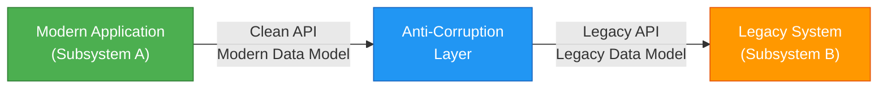
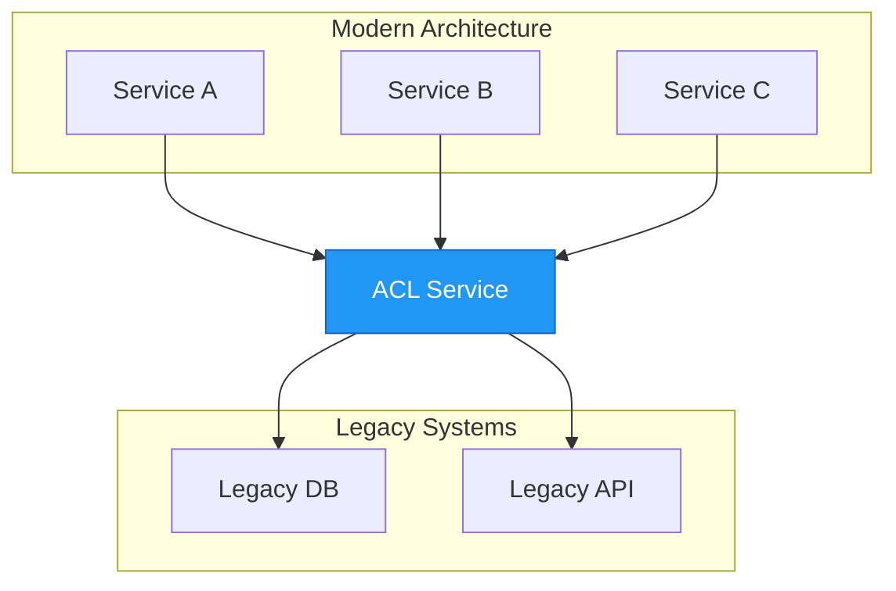

When building modern applications, you often need to integrate with legacy systems or external services that don't share the same design principles. The Anti-Corruption Layer pattern provides an elegant solution to this challenge, acting as a protective barrier that keeps your clean architecture from being "corrupted" by outdated or poorly designed external systems.

## 🎯 What is the Anti-Corruption Layer Pattern?

The Anti-Corruption Layer (ACL) pattern, first described by Eric Evans in his seminal book *Domain-Driven Design*, implements a façade or adapter layer between different subsystems that don't share the same semantics. This layer translates requests that one subsystem makes to the other subsystem, ensuring that your application's design isn't limited by dependencies on outside systems.

Think of it as a diplomatic translator between two countries that speak different languages and follow different customs. The translator ensures smooth communication while each country maintains its own culture and practices.

## 📖 The Problem: Legacy System Integration

Most applications rely on other systems for data or functionality. Consider these common scenarios:

- **Legacy Migration**: A legacy application is being migrated to a modern system, but still needs to access existing legacy resources during the transition
- **Gradual Modernization**: Different features of a larger application are moved to a modern system over time
- **Third-Party Integration**: Your application needs to communicate with external systems you don't control

Legacy systems often suffer from quality issues:

- Convoluted data schemas
- Obsolete APIs
- Outdated protocols
- Poor documentation
- Inconsistent naming conventions

To interoperate with these systems, your new application might be forced to support outdated infrastructure, protocols, data models, or APIs—features you wouldn't otherwise include in a modern application. This "corrupts" what could be a cleanly designed system.

!!!warning "⚠️ The Corruption Risk"
    Maintaining direct access between new and legacy systems can force the new system to adhere to the legacy system's APIs and semantics. When these legacy features have quality issues, they compromise your modern application's design integrity.
!!!

## 💡 The Solution: Isolation Through Translation

The Anti-Corruption Layer pattern solves this by isolating different subsystems and placing a translation layer between them. This layer handles all communication between the two systems, allowing one system to remain unchanged while the other avoids compromising its design.



### How It Works

1. **Subsystem A** (your modern application) calls the anti-corruption layer using its own clean data model and architecture
2. **The ACL** translates the request into the format expected by Subsystem B
3. **Subsystem B** (the legacy system) receives the request in its native format
4. **The ACL** translates the response back into Subsystem A's format
5. **Subsystem A** receives the data in its expected format, completely unaware of the legacy system's quirks

The anti-corruption layer contains all the logic necessary to translate between the two systems, including:

- **Data transformation**: Converting between different data models
- **Protocol adaptation**: Bridging different communication protocols
- **API mapping**: Translating between different API contracts
- **Error handling**: Converting error formats and codes

## 🏗️ Implementation Approaches

The anti-corruption layer can be implemented in several ways:

### 1. Component Within Application

Implement the ACL as a module or component within your application:

```javascript
// Example: ACL as a service class
class LegacySystemAdapter {
  constructor(legacyClient) {
    this.legacyClient = legacyClient;
  }
  
  async getCustomer(customerId) {
    // Call legacy system
    const legacyData = await this.legacyClient.fetchCustomerRecord(customerId);
    
    // Transform to modern format
    return {
      id: legacyData.CUST_ID,
      name: `${legacyData.FIRST_NM} ${legacyData.LAST_NM}`,
      email: legacyData.EMAIL_ADDR,
      createdAt: new Date(legacyData.CREATE_DT)
    };
  }
}
```

### 2. Independent Service

Deploy the ACL as a separate microservice:



### 3. API Gateway Pattern

Use an API gateway to implement the ACL functionality:

- Centralized translation logic
- Rate limiting and caching
- Authentication and authorization
- Request/response transformation

## ⚖️ Key Considerations

Before implementing an anti-corruption layer, consider these important factors:

### Performance Impact

!!!warning "🐌 Latency Considerations"
    The anti-corruption layer adds an additional hop in the communication path, which introduces latency. Measure and monitor this impact, especially for high-frequency operations.
!!!

**Mitigation strategies:**
- Implement caching for frequently accessed data
- Use asynchronous communication where possible
- Optimize transformation logic
- Consider batch operations

### Operational Overhead

The ACL is an additional component that requires:

- **Deployment and hosting**: Infrastructure and resources
- **Monitoring**: Health checks, metrics, and logging
- **Maintenance**: Updates, bug fixes, and improvements
- **Documentation**: API contracts and transformation rules

### Scalability

Consider how your anti-corruption layer will scale:

- Will it handle increased load as your application grows?
- Should it be horizontally scalable?
- What are the bottlenecks?
- How will you handle peak traffic?

### Multiple ACL Instances

You might need more than one anti-corruption layer:

- Different technologies or languages for different subsystems
- Separation of concerns (one ACL per legacy system)
- Team ownership boundaries
- Performance optimization (regional deployments)

### Transaction and Data Consistency

!!!danger "🔄 Consistency Challenges"
    Ensure transaction and data consistency are maintained across the ACL boundary. This is especially critical for operations that span both systems.
!!!

Consider:
- How will you handle distributed transactions?
- What consistency guarantees do you need?
- How will you monitor data integrity?
- What's your rollback strategy?

### Scope of Responsibility

Determine what the ACL should handle:

- **All communication**: Every interaction goes through the ACL
- **Subset of features**: Only specific operations use the ACL
- **Read vs. Write**: Different strategies for queries and updates

### Migration Strategy

If the ACL is part of a migration strategy:

- **Temporary**: Will it be retired after migration completes?
- **Permanent**: Will it remain as an integration layer?
- **Phased retirement**: How will you gradually remove it?

## ✅ When to Use This Pattern

The Anti-Corruption Layer pattern is ideal when:

1. **Gradual Migration**: A migration is planned over multiple stages, but integration between new and legacy systems must be maintained
2. **Semantic Differences**: Two or more subsystems have different semantics but still need to communicate
3. **External Dependencies**: You need to integrate with third-party systems you don't control
4. **Quality Protection**: You want to protect your clean architecture from poorly designed external systems
5. **Team Autonomy**: Different teams own different subsystems and need clear boundaries

## ❌ When Not to Use This Pattern

This pattern might not be suitable when:

- **No Semantic Differences**: New and legacy systems already share similar designs and data models
- **Simple Integration**: The integration is straightforward and doesn't justify the additional complexity
- **Performance Critical**: The added latency is unacceptable for your use case
- **Resource Constraints**: You lack the resources to maintain an additional service

## 🎯 Real-World Example

Let's say you're modernizing an e-commerce platform. The legacy system stores customer data like this:

```json
{
  "CUST_ID": "12345",
  "FIRST_NM": "John",
  "LAST_NM": "Doe",
  "EMAIL_ADDR": "john@neo01.com",
  "CREATE_DT": "20190215",
  "STATUS_CD": "A"
}
```

Your modern application uses this model:

```json
{
  "customerId": "12345",
  "fullName": "John Doe",
  "email": "john@neo01.com",
  "registeredAt": "2019-02-15T00:00:00Z",
  "isActive": true
}
```

The ACL handles the translation:

```javascript
class CustomerAdapter {
  toLegacyFormat(modernCustomer) {
    return {
      CUST_ID: modernCustomer.customerId,
      FIRST_NM: modernCustomer.fullName.split(' ')[0],
      LAST_NM: modernCustomer.fullName.split(' ').slice(1).join(' '),
      EMAIL_ADDR: modernCustomer.email,
      CREATE_DT: modernCustomer.registeredAt.replace(/-/g, '').substring(0, 8),
      STATUS_CD: modernCustomer.isActive ? 'A' : 'I'
    };
  }
  
  toModernFormat(legacyCustomer) {
    return {
      customerId: legacyCustomer.CUST_ID,
      fullName: `${legacyCustomer.FIRST_NM} ${legacyCustomer.LAST_NM}`,
      email: legacyCustomer.EMAIL_ADDR,
      registeredAt: this.parseDate(legacyCustomer.CREATE_DT),
      isActive: legacyCustomer.STATUS_CD === 'A'
    };
  }
  
  parseDate(dateStr) {
    // Convert YYYYMMDD to ISO format
    return `${dateStr.substring(0,4)}-${dateStr.substring(4,6)}-${dateStr.substring(6,8)}T00:00:00Z`;
  }
}
```

## 🏆 Benefits

Implementing the Anti-Corruption Layer pattern provides several advantages:

1. **Design Independence**: Your modern application maintains its clean architecture
2. **Flexibility**: Easy to swap out or upgrade legacy systems
3. **Team Autonomy**: Teams can work independently on different subsystems
4. **Gradual Migration**: Supports phased modernization approaches
5. **Testability**: Easier to test with mocked ACL responses
6. **Maintainability**: Changes to legacy systems are isolated to the ACL

## 📚 References

- Evans, Eric. *Domain-Driven Design: Tackling Complexity in the Heart of Software*. Addison-Wesley, 2003.
- [Cloud Design Patterns - Anti-Corruption Layer](https://learn.microsoft.com/en-us/azure/architecture/patterns/anti-corruption-layer)

---

The Anti-Corruption Layer pattern is a powerful tool for maintaining architectural integrity while integrating with legacy or external systems. By isolating the translation logic in a dedicated layer, you protect your modern application from the compromises that direct integration would require. While it adds complexity and operational overhead, the benefits of clean architecture and maintainability often outweigh these costs, especially in large-scale modernization efforts.
