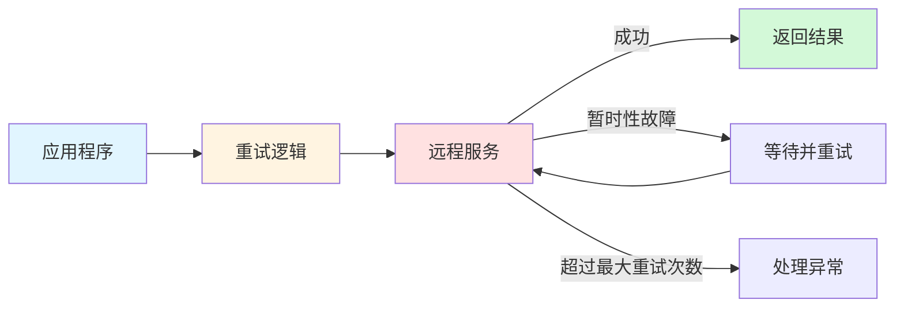
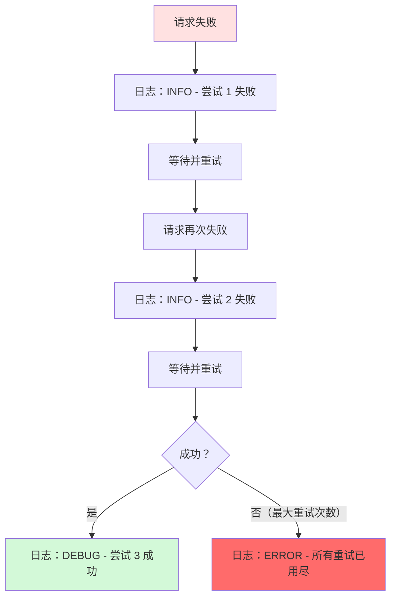
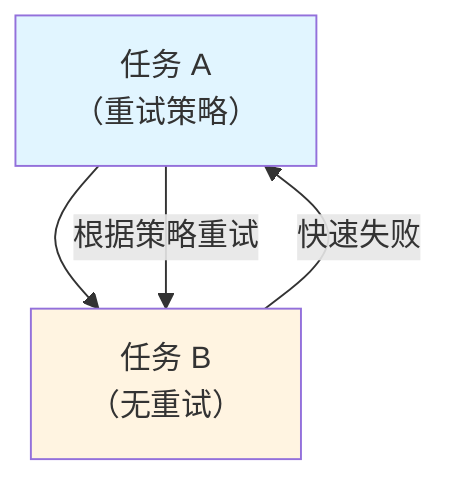
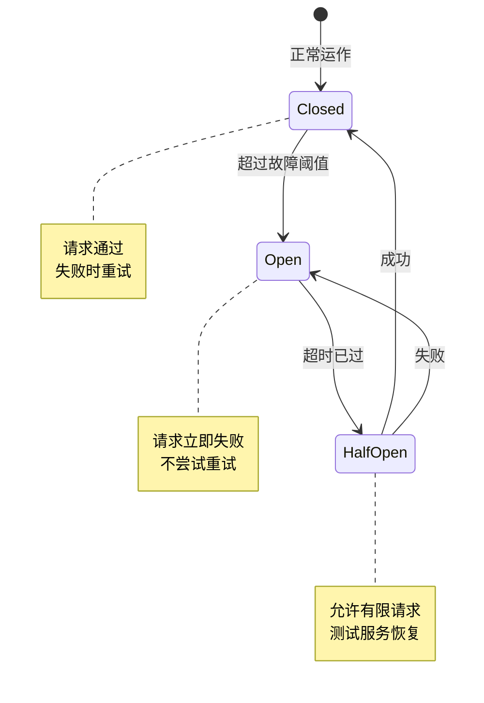

当你的应用程序与远程服务通信时——数据库、API、消息队列——可能会出错。网络中断、服务器忙碌或暂时性超时都可能导致请求失败。重试模式帮助你的应用程序优雅地处理这些暂时性故障，将潜在的失败转化为成功。

## 情境与问题

分布式系统经常面临暂时性故障：

- **网络连接中断**：组件之间的短暂断线
- **服务不可用**：部署或重启期间的暂时性服务中断
- **超时**：服务在高负载下响应时间过长
- **节流**：服务在过载时拒绝请求

这些故障通常会自我修正。暂时过载的数据库可能现在拒绝你的连接，但在清除积压工作后一秒钟就会接受。如果没有重试机制，你的应用程序会将这些暂时性问题视为永久性故障，不必要地降低用户体验。

## 解决方案

设计你的应用程序以预期暂时性故障并透明地处理它们。重试模式引入一种机制，自动重试失败的操作，将对业务功能的影响降到最低。



!!!tip "💡 内置重试机制"
    许多现代客户端库和框架都包含可配置的重试逻辑。在实现自定义重试代码之前，请先查看你的库文档。
!!!

## 重试策略

根据故障类型和应用程序需求选择重试策略：

### 1. 取消

**何时使用**：故障表示永久性问题或即使重试也不会成功的操作。

**示例**：
- 身份验证失败
- 无效的请求参数
- 找不到资源错误

**操作**：立即取消操作并报告异常。

### 2. 立即重试

**何时使用**：故障不寻常或罕见，例如网络数据包损坏。

**示例**：
- 随机网络传输错误
- 暂时性连接重置

**操作**：立即重试请求，不延迟。

### 3. 延迟后重试

**何时使用**：故障常见且与连接或服务负载相关。

**示例**：
- 连接超时
- 服务忙碌响应
- 节流错误

**操作**：等待后再重试，使用以下延迟策略之一：

**固定延迟**：每次重试之间等待相同的时间。

```
尝试 1 → 等待 2 秒 → 尝试 2 → 等待 2 秒 → 尝试 3
```

**递增延迟**：线性增加等待时间。

```
尝试 1 → 等待 2 秒 → 尝试 2 → 等待 4 秒 → 尝试 3 → 等待 6 秒 → 尝试 4
```

**指数退避**：每次失败后将等待时间加倍。

```
尝试 1 → 等待 1 秒 → 尝试 2 → 等待 2 秒 → 尝试 3 → 等待 4 秒 → 尝试 4 → 等待 8 秒 → 尝试 5
```


{
  "title": {
    "text": "重试延迟策略比较"
  },
  "tooltip": {
    "trigger": "axis"
  },
  "legend": {
    "data": ["固定 (2秒)", "递增 (2秒)", "指数 (1秒基数)"]
  },
  "xAxis": {
    "type": "category",
    "name": "重试尝试",
    "data": ["第1次", "第2次", "第3次", "第4次", "第5次"]
  },
  "yAxis": {
    "type": "value",
    "name": "延迟（秒）"
  },
  "series": [
    {
      "name": "固定 (2秒)",
      "type": "line",
      "data": [2, 2, 2, 2, 2],
      "itemStyle": {
        "color": "#1976d2"
      }
    },
    {
      "name": "递增 (2秒)",
      "type": "line",
      "data": [2, 4, 6, 8, 10],
      "itemStyle": {
        "color": "#f57c00"
      }
    },
    {
      "name": "指数 (1秒基数)",
      "type": "line",
      "data": [1, 2, 4, 8, 16],
      "itemStyle": {
        "color": "#388e3c"
      }
    }
  ]
}


**带抖动的指数退避**：在指数延迟中加入随机性，以防止多个客户端同时重试（"惊群"问题）。

## 实现考量

### 日志策略

适当记录故障以避免警报疲劳：

- **早期故障**：记录为信息条目
- **成功重试**：记录在调试级别
- **最终故障**：仅在所有重试都用尽后记录为错误

这种方法为操作人员提供可见性，而不会用自我修正问题的警报淹没他们。



### 性能影响

调整重试策略以符合业务需求：

**交互式应用程序**（Web 应用程序、移动应用程序）：
- 快速失败，较少重试次数
- 尝试之间使用短延迟
- 显示用户友好消息（"请稍后再试"）

**批处理应用程序**（数据处理、ETL 作业）：
- 使用更多重试尝试
- 采用指数退避与较长延迟
- 优先考虑完成而非速度

!!!warning "⚠️ 避免激进重试"
    激进的重试策略（许多重试且延迟最小）可能会使情况恶化：
    - 进一步降低已经过载的服务
    - 降低应用程序的响应性
    - 在系统中造成级联故障
    
    考虑在重试之外实现断路器模式，以防止压垮失败的服务。
!!!

### 幂等性

在应用重试之前，确保操作是幂等的（多次执行是安全的）。非幂等操作可能导致意外的副作用：

**问题情境**：
1. 服务接收请求并成功处理
2. 服务因网络问题无法发送响应
3. 客户端重试，导致重复处理

**解决方案**：
- 设计操作为自然幂等
- 使用唯一请求标识符来检测重复
- 实现服务器端去重逻辑

### 异常类型

不同的异常需要不同的重试策略：

| 异常类型 | 重试策略 | 示例 |
|---------|---------|------|
| 暂时性网络错误 | 延迟后重试 | 连接超时、DNS 解析失败 |
| 服务忙碌/节流 | 指数退避重试 | HTTP 429、HTTP 503 |
| 身份验证失败 | 立即取消 | 无效凭据、过期令牌 |
| 无效请求 | 立即取消 | HTTP 400、格式错误的数据 |
| 找不到资源 | 立即取消 | HTTP 404 |

### 事务一致性

在事务中重试操作时：

- 微调重试策略以最大化成功概率
- 最小化回滚事务步骤的需求
- 考虑分布式场景的补偿事务
- 确保重试逻辑不违反事务隔离级别

## 测试与验证

!!!anote "🧪 测试检查清单"
    - 针对各种故障条件进行测试（超时、连接错误、服务不可用）
    - 验证正常和故障场景下的性能影响
    - 确认下游服务没有过度负载
    - 检查并发重试的竞争条件
    - 验证不同故障阶段的日志输出
    - 测试事务回滚场景
!!!

### 嵌套重试策略

避免分层多个重试策略：

**问题**：任务 A（有重试策略）调用任务 B（也有重试策略）。这会造成指数级的重试尝试和不可预测的延迟。

**解决方案**：配置低级别任务快速失败并报告故障。让高级别任务根据自己的策略处理重试。



## 何时使用此模式

**使用重试模式当**：

- 你的应用程序与远程服务或资源交互
- 故障预期是暂时性且短暂的
- 重复失败的请求有很大机会成功
- 操作是幂等的或可以变成幂等的

**不要使用重试模式当**：

- 故障可能是长期的（改用断路器）
- 处理非暂时性故障（业务逻辑错误、验证失败）
- 解决可扩展性问题（改为扩展服务）
- 操作有重大副作用且不是幂等的

## 与断路器结合

重试和断路器模式相辅相成：

- **重试**：通过再次尝试操作来处理暂时性故障
- **断路器**：当已知服务停机时防止重试



这些模式一起提供全面的故障处理：

1. 重试处理暂时性故障
2. 断路器防止压垮失败的服务
3. 即使在长时间中断期间，系统仍保持响应

## 相关模式

**断路器**：防止应用程序重复尝试执行可能失败的操作，使其能够继续运作而无需等待故障修复。

**节流**：控制应用程序实例、服务或租户的资源消耗。

**速率限制**：管理发送到服务的请求速率，以避免压垮它。

## 参考资料

- [Retry Pattern - Microsoft Learn](https://learn.microsoft.com/en-us/azure/architecture/patterns/retry)
