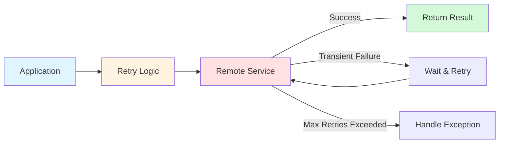
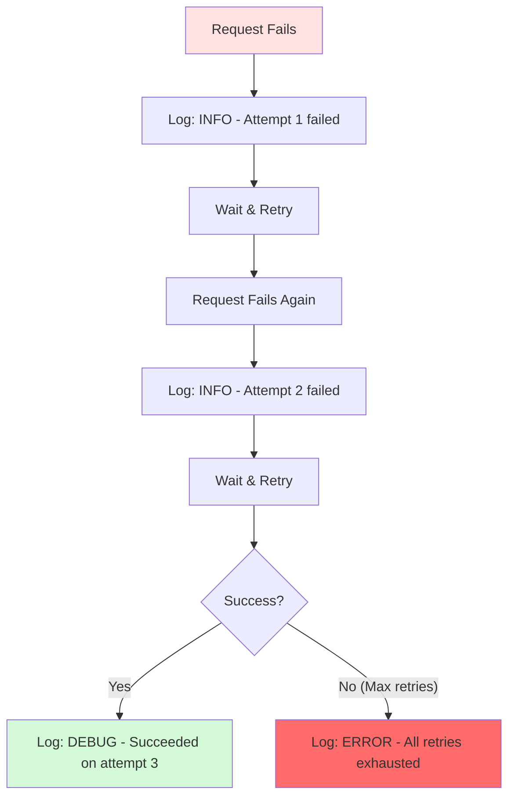
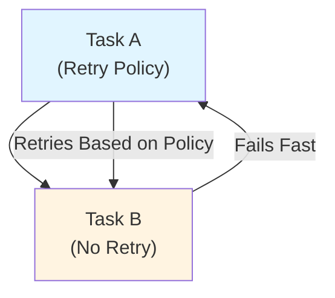
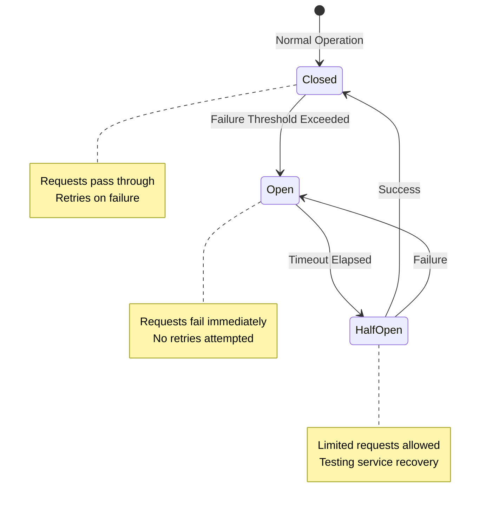

When your application talks to remote services—databases, APIs, message queues—things can go wrong. A network hiccup, a busy server, or a momentary timeout can cause a request to fail. The Retry pattern helps your application handle these temporary glitches gracefully, turning potential failures into successes.

## Context and Problem

Distributed systems face transient failures regularly:

- **Network connectivity loss**: Brief disconnections between components
- **Service unavailability**: Temporary service outages during deployments or restarts
- **Timeouts**: Services taking too long to respond under heavy load
- **Throttling**: Services rejecting requests when overwhelmed

These failures are typically self-correcting. A database that's momentarily overloaded might reject your connection now but accept it a second later after clearing its backlog. Without a retry mechanism, your application treats these temporary issues as permanent failures, degrading user experience unnecessarily.

## Solution

Design your application to expect transient failures and handle them transparently. The Retry pattern introduces a mechanism that automatically retries failed operations, minimizing the impact on business functionality.



!!!tip "💡 Built-in Retry Mechanisms"
    Many modern client libraries and frameworks include configurable retry logic. Check your library's documentation before implementing custom retry code.
!!!

## Retry Strategies

Choose a retry strategy based on the failure type and your application's requirements:

### 1. Cancel

**When to use**: The failure indicates a permanent problem or an operation that won't succeed even with retries.

**Examples**:
- Authentication failures
- Invalid request parameters
- Resource not found errors

**Action**: Cancel the operation immediately and report the exception.

### 2. Retry Immediately

**When to use**: The failure is unusual or rare, like a corrupted network packet.

**Examples**:
- Random network transmission errors
- Transient connection resets

**Action**: Retry the request immediately without delay.

### 3. Retry After Delay

**When to use**: The failure is common and related to connectivity or service load.

**Examples**:
- Connection timeouts
- Service busy responses
- Throttling errors

**Action**: Wait before retrying, using one of these delay strategies:

**Fixed Delay**: Wait the same amount of time between each retry.

```
Attempt 1 → Wait 2s → Attempt 2 → Wait 2s → Attempt 3
```

**Incremental Delay**: Increase the wait time linearly.

```
Attempt 1 → Wait 2s → Attempt 2 → Wait 4s → Attempt 3 → Wait 6s → Attempt 4
```

**Exponential Backoff**: Double the wait time after each failure.

```
Attempt 1 → Wait 1s → Attempt 2 → Wait 2s → Attempt 3 → Wait 4s → Attempt 4 → Wait 8s → Attempt 5
```


{
  "title": {
    "text": "Retry Delay Strategies Comparison"
  },
  "tooltip": {
    "trigger": "axis"
  },
  "legend": {
    "data": ["Fixed (2s)", "Incremental (2s)", "Exponential (1s base)"]
  },
  "xAxis": {
    "type": "category",
    "name": "Retry Attempt",
    "data": ["1st", "2nd", "3rd", "4th", "5th"]
  },
  "yAxis": {
    "type": "value",
    "name": "Delay (seconds)"
  },
  "series": [
    {
      "name": "Fixed (2s)",
      "type": "line",
      "data": [2, 2, 2, 2, 2],
      "itemStyle": {
        "color": "#1976d2"
      }
    },
    {
      "name": "Incremental (2s)",
      "type": "line",
      "data": [2, 4, 6, 8, 10],
      "itemStyle": {
        "color": "#f57c00"
      }
    },
    {
      "name": "Exponential (1s base)",
      "type": "line",
      "data": [1, 2, 4, 8, 16],
      "itemStyle": {
        "color": "#388e3c"
      }
    }
  ]
}


**Exponential backoff with jitter**: Add randomness to exponential delays to prevent multiple clients from retrying simultaneously (the "thundering herd" problem).

## Implementation Considerations

### Logging Strategy

Log failures appropriately to avoid alert fatigue:

- **Early failures**: Log as informational entries
- **Successful retries**: Log at debug level
- **Final failure**: Log as an error only after all retries are exhausted

This approach gives operators visibility without flooding them with alerts for self-correcting issues.



### Performance Impact

Tune your retry policy to match business requirements:

**Interactive applications** (web apps, mobile apps):
- Fail fast with fewer retries
- Use short delays between attempts
- Display user-friendly messages ("Please try again later")

**Batch applications** (data processing, ETL jobs):
- Use more retry attempts
- Employ exponential backoff with longer delays
- Prioritize completion over speed

!!!warning "⚠️ Avoid Aggressive Retries"
    An aggressive retry policy (many retries with minimal delays) can worsen the situation by:
    - Further degrading an already overloaded service
    - Reducing your application's responsiveness
    - Creating cascading failures across the system
    
    Consider implementing the Circuit Breaker pattern alongside retries to prevent overwhelming failing services.
!!!

### Idempotency

Ensure operations are idempotent (safe to execute multiple times) before applying retries. Non-idempotent operations can cause unintended side effects:

**Problem scenario**:
1. Service receives request and processes it successfully
2. Service fails to send response due to network issue
3. Client retries, causing duplicate processing

**Solutions**:
- Design operations to be naturally idempotent
- Use unique request identifiers to detect duplicates
- Implement server-side deduplication logic

### Exception Types

Different exceptions require different retry strategies:

| Exception Type | Retry Strategy | Example |
|---------------|----------------|---------|
| Transient network errors | Retry with delay | Connection timeout, DNS resolution failure |
| Service busy/throttling | Retry with exponential backoff | HTTP 429, HTTP 503 |
| Authentication failures | Cancel immediately | Invalid credentials, expired tokens |
| Invalid requests | Cancel immediately | HTTP 400, malformed data |
| Resource not found | Cancel immediately | HTTP 404 |

### Transaction Consistency

When retrying operations within transactions:

- Fine-tune retry policies to maximize success probability
- Minimize the need to roll back transaction steps
- Consider compensating transactions for distributed scenarios
- Ensure retry logic doesn't violate transaction isolation levels

## Testing and Validation

!!!anote "🧪 Testing Checklist"
    - Test against various failure conditions (timeouts, connection errors, service unavailability)
    - Verify performance impact under normal and failure scenarios
    - Confirm no excessive load on downstream services
    - Check for race conditions with concurrent retries
    - Validate logging output at different failure stages
    - Test transaction rollback scenarios
!!!

### Nested Retry Policies

Avoid layering multiple retry policies:

**Problem**: Task A (with retry policy) calls Task B (also with retry policy). This creates exponential retry attempts and unpredictable delays.

**Solution**: Configure lower-level tasks to fail fast and report failures. Let higher-level tasks handle retries based on their own policies.



## When to Use This Pattern

**Use the Retry pattern when**:

- Your application interacts with remote services or resources
- Failures are expected to be transient and short-lived
- Repeating a failed request has a good chance of succeeding
- The operation is idempotent or can be made idempotent

**Don't use the Retry pattern when**:

- Failures are likely to be long-lasting (use Circuit Breaker instead)
- Handling non-transient failures (business logic errors, validation failures)
- Addressing scalability issues (scale the service instead)
- The operation has significant side effects and isn't idempotent

## Combining with Circuit Breaker

The Retry and Circuit Breaker patterns complement each other:

- **Retry**: Handles transient failures by attempting the operation again
- **Circuit Breaker**: Prevents retries when a service is known to be down



Together, these patterns provide comprehensive fault handling:

1. Retry handles temporary glitches
2. Circuit Breaker prevents overwhelming failing services
3. System remains responsive even during prolonged outages

## Related Patterns

**Circuit Breaker**: Prevents an application from repeatedly trying to execute an operation that's likely to fail, allowing it to continue without waiting for the fault to be fixed.

**Throttling**: Controls the consumption of resources by an application instance, service, or tenant.

**Rate Limiting**: Manages the rate at which requests are sent to a service to avoid overwhelming it.

## References

- [Retry Pattern - Microsoft Learn](https://learn.microsoft.com/en-us/azure/architecture/patterns/retry)
