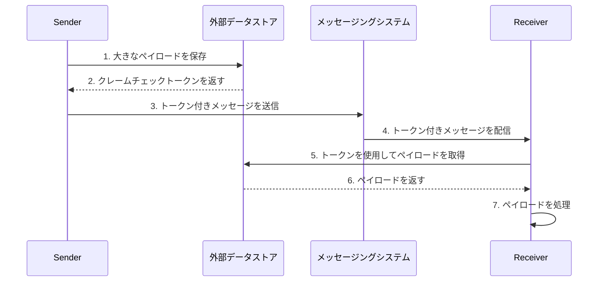
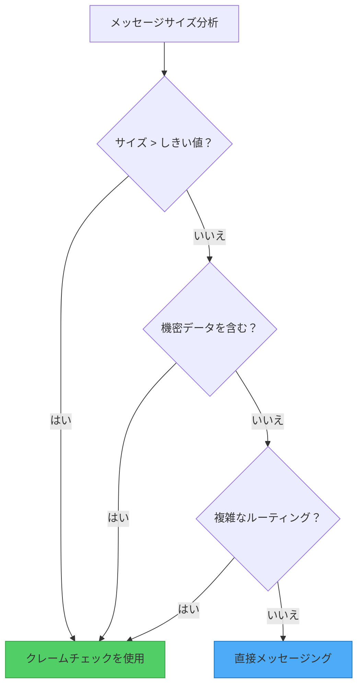

空港で荷物を預けることを想像してください。重い荷物をセキュリティチェックや飛行機に持ち込む代わりに、チェックインで荷物を預け、小さなクレームチケットを受け取ります。目的地では、そのチケットを提示して荷物を受け取ります。この現実世界のプロセスは、分散システムの一般的な問題に対する最もエレガントなソリューションの1つであるクレームチェックパターンにインスピレーションを与えました。

## 問題：メッセージが重すぎる場合

従来のメッセージングシステムは、大量の小さなメッセージの処理に優れています。軽量データを扱う際の速度、スループット、信頼性のために最適化されています。しかし、いくつかの理由で大きなペイロードに苦労することがよくあります：

- **サイズ制限**：ほとんどのメッセージングシステムは、メッセージサイズに厳しい制限を課しています（多くの場合256KBから1MB）
- **パフォーマンスの低下**：大きなメッセージはより多くのメモリと帯域幅を消費し、システム全体を遅くします
- **タイムアウトの問題**：大きなメッセージの処理がタイムアウトしきい値を超える可能性があります
- **リソースの枯渇**：複数の大きなメッセージがメッセージングインフラストラクチャを圧倒する可能性があります

!!!warning "⚠️ 実世界への影響"
    64KBメッセージ用に設計されたキューの単一の10MBメッセージは、カスケード障害を引き起こし、すべてのコンシューマーに影響を与え、メッセージングシステム全体をダウンさせる可能性があります。

## ソリューション：ストレージとメッセージングの分離

クレームチェックパターンは、データストレージとメッセージ配信の関心事を分離することで、この問題をエレガントに解決します：

1. **ペイロードを保存**：大きなオブジェクト用に最適化された外部データストアに
2. **クレームチェックトークンを生成**：一意の識別子またはキー
3. **トークンのみを送信**：メッセージングシステムを通じて
4. **ペイロードを取得**：必要に応じてトークンを使用して



## 仕組み：実際のパターン

大きな添付ファイルを含む顧客注文を処理する具体的な例を見てみましょう：

### ステップ1：ペイロードを保存

送信者が大きなペイロード（高解像度画像、ビデオファイル、大きなドキュメントなど）を送信する必要がある場合：

```javascript
// 送信者アプリケーション
async function sendLargeMessage(payload) {
  // 外部データストアにペイロードを保存
  const claimCheckToken = await dataStore.save({
    data: payload,
    expiresAt: Date.now() + (24 * 60 * 60 * 1000) // 24時間
  });
  
  return claimCheckToken;
}
```

### ステップ2：トークンを送信

メッセージングシステムは軽量なトークンのみを処理します：

```javascript
// クレームチェックトークン付きメッセージを送信
await messagingSystem.send({
  orderId: "ORD-12345",
  claimCheck: claimCheckToken,
  metadata: {
    size: payload.length,
    contentType: "application/pdf"
  }
});
```

### ステップ3：取得して処理

受信者はトークンを使用して実際のペイロードを取得します：

```javascript
// 受信者アプリケーション
async function processMessage(message) {
  // クレームチェックトークンを使用してペイロードを取得
  const payload = await dataStore.retrieve(message.claimCheck);
  
  // ペイロードを処理
  await processOrder(message.orderId, payload);
  
  // クリーンアップ
  await dataStore.delete(message.claimCheck);
}
```

## 実装の考慮事項

クレームチェックパターンを実装する際は、これらの重要な側面を考慮してください：

### 1. ペイロードライフサイクル管理

!!!tip "🗑️ クリーンアップ戦略"
    **同期削除**：消費アプリケーションが処理後すぐにペイロードを削除します。これにより、削除がメッセージワークフローに結び付けられ、タイムリーなクリーンアップが保証されます。
    
    **非同期削除**：別のバックグラウンドプロセスが、有効期限（TTL）または他の基準に基づいてクリーンアップを処理します。これにより、削除がメッセージ処理から切り離されますが、追加のインフラストラクチャが必要になります。

### 2. 条件付き適用

すべてのメッセージがクレームチェックパターンを必要とするわけではありません。選択的に適用するロジックを実装します：

```javascript
async function sendMessage(payload) {
  const MESSAGE_SIZE_THRESHOLD = 256 * 1024; // 256KB
  
  if (payload.length > MESSAGE_SIZE_THRESHOLD) {
    // クレームチェックパターンを使用
    const token = await dataStore.save(payload);
    await messagingSystem.send({ claimCheck: token });
  } else {
    // 直接送信
    await messagingSystem.send({ data: payload });
  }
}
```

この条件付きアプローチ：
- 小さなメッセージのレイテンシを削減
- リソース使用率を最適化
- 全体的なスループットを向上

### 3. セキュリティの考慮事項

クレームチェックトークンは次のようにする必要があります：
- **一意**：衝突と不正アクセスを防ぐ
- **不明瞭**：連続IDではなく、UUIDまたは暗号化ハッシュを使用
- **時間制限**：無期限のストレージを防ぐために有効期限を実装
- **アクセス制御**：承認されたアプリケーションのみがペイロードを取得できることを確認

```javascript
// 安全なクレームチェックトークンを生成
function generateClaimCheck() {
  return {
    id: crypto.randomUUID(),
    signature: crypto.createHmac('sha256', secretKey)
                    .update(id)
                    .digest('hex'),
    expiresAt: Date.now() + TTL
  };
}
```

## クレームチェックパターンを使用する場合

### 主な使用例

!!!success "✅ 理想的なシナリオ"
    **メッセージングシステムの制限**：メッセージサイズがシステム制限を超える場合、ペイロードを外部ストレージにオフロードします。
    
    **パフォーマンスの最適化**：大きなメッセージがメッセージングシステムのパフォーマンスを低下させる場合、ストレージと配信を分離します。

### 二次的な使用例

!!!info "📋 追加のメリット"
    **機密データの保護**：より厳格なアクセス制御を持つ安全なデータストアに機密情報を保存し、メッセージングシステムから除外します。
    
    **複雑なルーティング**：メッセージが複数のコンポーネントを通過する場合、中間者を通じてトークンのみを渡すことで、繰り返しのシリアル化/デシリアル化のオーバーヘッドを回避します。



## アーキテクチャ品質属性

クレームチェックパターンは、いくつかのアーキテクチャ品質属性に影響を与えます：

### 信頼性

データをメッセージから分離することで、次のことが可能になります：
- **データの冗長性**：外部データストアは、より優れたレプリケーションとバックアップを提供することがよくあります
- **災害復旧**：ペイロードはメッセージングシステムとは独立して回復できます
- **障害の分離**：メッセージングシステムの障害は保存されたペイロードに影響しません

### セキュリティ

パターンは次のことでセキュリティを強化します：
- **データの分離**：機密データは、より厳格なアクセス制御を持つ安全なストレージに留まります
- **アクセス制御**：有効なトークンを持つサービスのみがペイロードを取得できます
- **監査証跡**：別のストレージにより、詳細なアクセスログが可能になります

### パフォーマンス

パフォーマンスの改善には次のものが含まれます：
- **メッセージサイズの削減**：メッセージングシステムは軽量なトークンのみを処理します
- **最適化されたストレージ**：各システム（メッセージング vs データストア）が最も得意なことを処理します
- **選択的な取得**：受信者は必要な場合にのみペイロードを取得します

### コストの最適化

コストのメリットは次のことから生じます：
- **より安価なメッセージング**：大きなメッセージサポートのためのプレミアム機能を回避します
- **ストレージの階層化**：大きなペイロードにコスト効率の高いストレージを使用します
- **リソース効率**：メッセージングインフラストラクチャのより良い利用

## トレードオフと考慮事項

他のパターンと同様に、クレームチェックはトレードオフを導入します：

!!!warning "⚠️ 潜在的な欠点"
    **複雑さの増加**：追加のインフラストラクチャと調整が必要
    
    **レイテンシ**：ペイロードを取得するための追加のネットワークラウンドトリップ
    
    **一貫性の課題**：メッセージとペイロードが同期されたままであることを確認
    
    **運用オーバーヘッド**：保存されたペイロードのライフサイクルの管理

特定の要件に対してこれらのトレードオフを評価してください。パターンは、メッセージサイズまたはパフォーマンスの問題が追加の複雑さを上回る場合に最適に機能します。

## 実世界の実装パターン

### パターン1：自動トークン生成

ファイルがアップロードされたときに自動的にトークンを生成するイベント駆動メカニズムを使用します：

```javascript
// ファイルアップロードが自動クレームチェック生成をトリガー
dataStore.on('upload', async (file) => {
  const token = generateClaimCheck(file.id);
  await messagingSystem.send({
    event: 'file-uploaded',
    claimCheck: token,
    metadata: file.metadata
  });
});
```

### パターン2：手動トークン生成

アプリケーションがトークン作成とペイロードストレージを明示的に管理します：

```javascript
// アプリケーションがプロセス全体を制御
async function processLargeOrder(order) {
  const token = await storeOrderDocuments(order.documents);
  await sendOrderMessage({
    orderId: order.id,
    claimCheck: token
  });
}
```

## 結論

クレームチェックパターンは、メッセージングシステムで大きなペイロードを処理する課題に対するエレガントなソリューションを提供します。ストレージをメッセージ配信から分離することで、システムは次のことができます：

- メッセージサイズの制限を克服
- 高いパフォーマンスを維持
- セキュリティと信頼性を強化
- コストを最適化

追加の複雑さを導入しますが、大きなデータ転送を扱うシステムでは、メリットがコストを大幅に上回ることがよくあります。メッセージングインフラストラクチャがペイロードサイズに苦労している場合、または効率的なメッセージ配信を維持しながら機密データを保護する必要がある場合は、このパターンの実装を検討してください。

## 関連パターン

- **非同期リクエスト-リプライ**：長時間実行される操作のためにクレームチェックを補完します
- **競合コンシューマー**：並列処理のためにクレームチェックとうまく機能します
- **分割と集約**：大きなメッセージを処理するための代替アプローチ

## 参考文献

- [Enterprise Integration Patterns: Claim Check](https://www.enterpriseintegrationpatterns.com/patterns/messaging/StoreInLibrary.html)
- [Microsoft Azure Architecture Patterns: Claim-Check](https://learn.microsoft.com/en-us/azure/architecture/patterns/claim-check)
