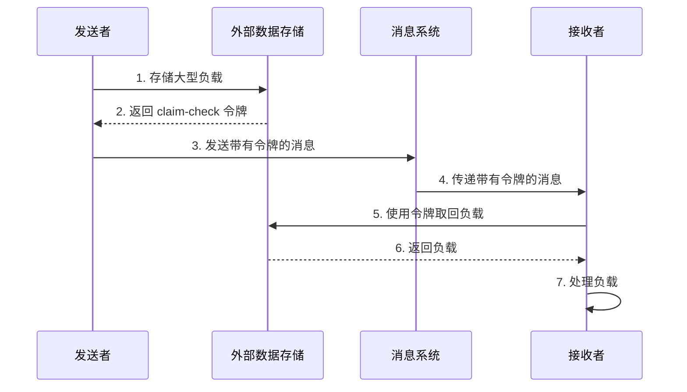
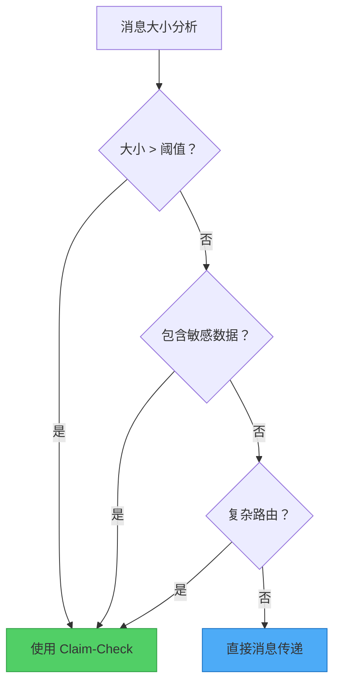

想象一下在机场托运行李的情景。你不需要带着沉重的行李通过安检和登机，而是在报到柜台交出行李，并收到一张小小的提领单。到达目的地后，你出示提领单就能取回行李。这个真实世界的流程启发了分布式系统中一个最优雅的解决方案：Claim-Check 模式。

## 问题：当消息变得太重

传统消息系统擅长处理大量的小型消息。它们针对速度、吞吐量和可靠性进行了优化，特别是在处理轻量级数据时。然而，它们在处理大型负载时常常遇到困难，原因如下：

- **大小限制**：大多数消息系统对消息大小有严格限制（通常为 256KB 到 1MB）
- **性能下降**：大型消息消耗更多内存和带宽，拖慢整个系统
- **超时问题**：处理大型消息可能超过超时阈值
- **资源耗尽**：多个大型消息可能压垮消息基础设施

!!!warning "⚠️ 实际影响"
    在设计用于处理 64KB 消息的队列中，单一 10MB 消息可能导致连锁故障，影响所有消费者，甚至可能导致整个消息系统崩溃。

## 解决方案：将存储与消息传递分离

Claim-Check 模式通过分离数据存储和消息传递的关注点，优雅地解决了这个问题：

1. **存储负载**到针对大型对象优化的外部数据存储
2. **生成 claim-check 令牌**（唯一标识符或密钥）
3. **仅通过消息系统传送令牌**
4. **在需要时使用令牌取回负载**



## 运作方式：模式实践

让我们通过一个处理带有大型附件的客户订单的具体范例来说明：

### 步骤 1：存储负载

当发送者需要传输大型负载（例如高分辨率图片、视频文件或大型文档）时：

```javascript
// 发送者应用程序
async function sendLargeMessage(payload) {
  // 将负载存储在外部数据存储
  const claimCheckToken = await dataStore.save({
    data: payload,
    expiresAt: Date.now() + (24 * 60 * 60 * 1000) // 24 小时
  });
  
  return claimCheckToken;
}
```

### 步骤 2：发送令牌

消息系统只处理轻量级令牌：

```javascript
// 发送带有 claim-check 令牌的消息
await messagingSystem.send({
  orderId: "ORD-12345",
  claimCheck: claimCheckToken,
  metadata: {
    size: payload.length,
    contentType: "application/pdf"
  }
});
```

### 步骤 3：取回并处理

接收者使用令牌获取实际负载：

```javascript
// 接收者应用程序
async function processMessage(message) {
  // 使用 claim-check 令牌取回负载
  const payload = await dataStore.retrieve(message.claimCheck);
  
  // 处理负载
  await processOrder(message.orderId, payload);
  
  // 清理
  await dataStore.delete(message.claimCheck);
}
```

## 实现考量

实现 Claim-Check 模式时，请考虑以下重要方面：

### 1. 负载生命周期管理

!!!tip "🗑️ 清理策略"
    **同步删除**：消费应用程序在处理后立即删除负载。这将删除与消息工作流程绑定，确保及时清理。
    
    **异步删除**：消息处理工作流程之外的独立后台进程根据存活时间（TTL）或其他条件处理清理。这将删除进程与消息处理解耦，但需要额外的基础设施。

### 2. 条件式应用

并非每个消息都需要 Claim-Check 模式。实现逻辑以选择性地应用它：

```javascript
async function sendMessage(payload) {
  const MESSAGE_SIZE_THRESHOLD = 256 * 1024; // 256KB
  
  if (payload.length > MESSAGE_SIZE_THRESHOLD) {
    // 使用 Claim-Check 模式
    const token = await dataStore.save(payload);
    await messagingSystem.send({ claimCheck: token });
  } else {
    // 直接发送
    await messagingSystem.send({ data: payload });
  }
}
```

这种条件式方法：
- 减少小型消息的延迟
- 优化资源利用
- 提升整体吞吐量

### 3. 安全性考量

claim-check 令牌应该：
- **唯一**：防止冲突和未授权访问
- **隐晦**：使用 UUID 或加密哈希，而非顺序 ID
- **有时限**：实现过期机制以防止无限期存储
- **访问控制**：确保只有授权的应用程序可以取回负载

```javascript
// 生成安全的 claim-check 令牌
function generateClaimCheck() {
  return {
    id: crypto.randomUUID(),
    signature: crypto.createHmac('sha256', secretKey)
                    .update(id)
                    .digest('hex'),
    expiresAt: Date.now() + TTL
  };
}
```

## 何时使用 Claim-Check 模式

### 主要使用案例

!!!success "✅ 理想情境"
    **消息系统限制**：当消息大小超过系统限制时，将负载卸载到外部存储。
    
    **性能优化**：当大型消息降低消息系统性能时，将存储与传递分离。

### 次要使用案例

!!!info "📋 额外优势"
    **敏感数据保护**：将敏感信息存储在具有更严格访问控制的安全数据存储中，使其远离消息系统。
    
    **复杂路由**：当消息穿越多个组件时，通过仅在中介层传递令牌来避免重复的序列化/反序列化开销。



## 架构质量属性

Claim-Check 模式影响多个架构质量属性：

### 可靠性

将数据与消息分离可实现：
- **数据冗余**：外部数据存储通常提供更好的复制和备份
- **灾难恢复**：负载可以独立于消息系统进行恢复
- **故障隔离**：消息系统故障不会影响已存储的负载

### 安全性

此模式通过以下方式增强安全性：
- **数据隔离**：敏感数据保留在具有更严格访问控制的安全存储中
- **访问控制**：只有具有有效令牌的服务才能取回负载
- **审计轨迹**：独立存储可实现详细的访问记录

### 性能

性能改进包括：
- **减少消息大小**：消息系统仅处理轻量级令牌
- **优化存储**：每个系统（消息 vs. 数据存储）处理其最擅长的事情
- **选择性取回**：接收者仅在需要时获取负载

### 成本优化

成本优势来自：
- **更便宜的消息传递**：避免为大型消息支持付费的高级功能
- **存储分层**：为大型负载使用具成本效益的存储
- **资源效率**：更好地利用消息基础设施

## 权衡与考量

与任何模式一样，Claim-Check 引入了权衡：

!!!warning "⚠️ 潜在缺点"
    **增加复杂性**：需要额外的基础设施和协调
    
    **延迟**：取回负载需要额外的网络往返
    
    **一致性挑战**：确保消息和负载保持同步
    
    **运营开销**：管理已存储负载的生命周期

根据您的特定需求评估这些权衡。当消息大小或性能问题超过增加的复杂性时，此模式效果最佳。

## 实际实现模式

### 模式 1：自动令牌生成

使用事件驱动机制在文件上传时自动生成令牌：

```javascript
// 文件上传触发自动 claim-check 生成
dataStore.on('upload', async (file) => {
  const token = generateClaimCheck(file.id);
  await messagingSystem.send({
    event: 'file-uploaded',
    claimCheck: token,
    metadata: file.metadata
  });
});
```

### 模式 2：手动令牌生成

应用程序明确管理令牌创建和负载存储：

```javascript
// 应用程序控制整个过程
async function processLargeOrder(order) {
  const token = await storeOrderDocuments(order.documents);
  await sendOrderMessage({
    orderId: order.id,
    claimCheck: token
  });
}
```

## 结论

Claim-Check 模式为消息系统中处理大型负载的挑战提供了优雅的解决方案。通过将存储与消息传递分离，它使系统能够：

- 克服消息大小限制
- 维持高性能
- 增强安全性和可靠性
- 优化成本

虽然它引入了额外的复杂性，但在处理大型数据传输的系统中，其优势通常远超过成本。当您的消息基础设施在负载大小上遇到困难，或当您需要在维持高效消息传递的同时保护敏感数据时，请考虑实现此模式。

## 相关模式

- **异步请求-回复**：补充 Claim-Check 用于长时间运行的操作
- **竞争消费者**：与 Claim-Check 配合良好用于并行处理
- **分割与聚合**：处理大型消息的替代方法

## 参考资料

- [Enterprise Integration Patterns: Claim Check](https://www.enterpriseintegrationpatterns.com/patterns/messaging/StoreInLibrary.html)
- [Microsoft Azure Architecture Patterns: Claim-Check](https://learn.microsoft.com/en-us/azure/architecture/patterns/claim-check)
