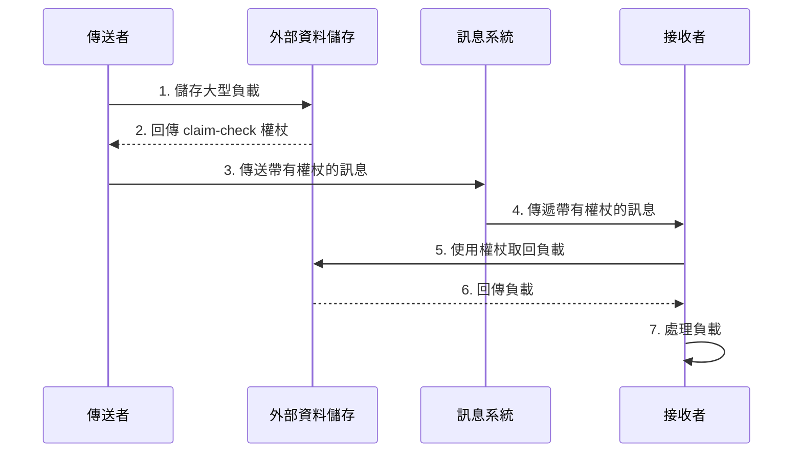
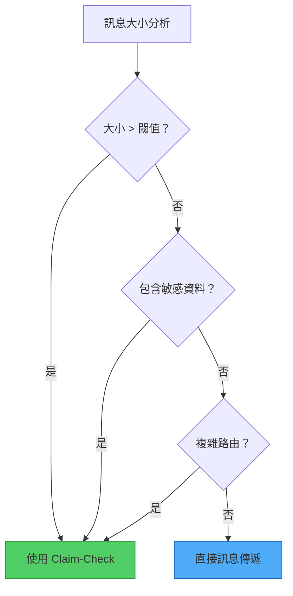

想像一下在機場託運行李的情景。你不需要帶著沉重的行李通過安檢和登機，而是在報到櫃檯交出行李，並收到一張小小的提領單。到達目的地後，你出示提領單就能取回行李。這個真實世界的流程啟發了分散式系統中一個最優雅的解決方案：Claim-Check 模式。

## 問題：當訊息變得太重

傳統訊息系統擅長處理大量的小型訊息。它們針對速度、吞吐量和可靠性進行了優化，特別是在處理輕量級資料時。然而，它們在處理大型負載時常常遇到困難，原因如下：

- **大小限制**：大多數訊息系統對訊息大小有嚴格限制（通常為 256KB 到 1MB）
- **效能下降**：大型訊息消耗更多記憶體和頻寬，拖慢整個系統
- **逾時問題**：處理大型訊息可能超過逾時閾值
- **資源耗盡**：多個大型訊息可能壓垮訊息基礎設施

!!!warning "⚠️ 實際影響"
    在設計用於處理 64KB 訊息的佇列中，單一 10MB 訊息可能導致連鎖故障，影響所有消費者，甚至可能導致整個訊息系統崩潰。

## 解決方案：將儲存與訊息傳遞分離

Claim-Check 模式透過分離資料儲存和訊息傳遞的關注點，優雅地解決了這個問題：

1. **儲存負載**到針對大型物件優化的外部資料儲存
2. **產生 claim-check 權杖**（唯一識別碼或金鑰）
3. **僅透過訊息系統傳送權杖**
4. **在需要時使用權杖取回負載**



## 運作方式：模式實作

讓我們透過一個處理帶有大型附件的客戶訂單的具體範例來說明：

### 步驟 1：儲存負載

當傳送者需要傳輸大型負載（例如高解析度圖片、影片檔案或大型文件）時：

```javascript
// 傳送者應用程式
async function sendLargeMessage(payload) {
  // 將負載儲存在外部資料儲存
  const claimCheckToken = await dataStore.save({
    data: payload,
    expiresAt: Date.now() + (24 * 60 * 60 * 1000) // 24 小時
  });
  
  return claimCheckToken;
}
```

### 步驟 2：傳送權杖

訊息系統只處理輕量級權杖：

```javascript
// 傳送帶有 claim-check 權杖的訊息
await messagingSystem.send({
  orderId: "ORD-12345",
  claimCheck: claimCheckToken,
  metadata: {
    size: payload.length,
    contentType: "application/pdf"
  }
});
```

### 步驟 3：取回並處理

接收者使用權杖取得實際負載：

```javascript
// 接收者應用程式
async function processMessage(message) {
  // 使用 claim-check 權杖取回負載
  const payload = await dataStore.retrieve(message.claimCheck);
  
  // 處理負載
  await processOrder(message.orderId, payload);
  
  // 清理
  await dataStore.delete(message.claimCheck);
}
```

## 實作考量

實作 Claim-Check 模式時，請考慮以下重要面向：

### 1. 負載生命週期管理

!!!tip "🗑️ 清理策略"
    **同步刪除**：消費應用程式在處理後立即刪除負載。這將刪除與訊息工作流程綁定，確保及時清理。
    
    **非同步刪除**：訊息處理工作流程之外的獨立背景程序根據存活時間（TTL）或其他條件處理清理。這將刪除程序與訊息處理解耦，但需要額外的基礎設施。

### 2. 條件式應用

並非每個訊息都需要 Claim-Check 模式。實作邏輯以選擇性地應用它：

```javascript
async function sendMessage(payload) {
  const MESSAGE_SIZE_THRESHOLD = 256 * 1024; // 256KB
  
  if (payload.length > MESSAGE_SIZE_THRESHOLD) {
    // 使用 Claim-Check 模式
    const token = await dataStore.save(payload);
    await messagingSystem.send({ claimCheck: token });
  } else {
    // 直接傳送
    await messagingSystem.send({ data: payload });
  }
}
```

這種條件式方法：
- 減少小型訊息的延遲
- 優化資源利用
- 提升整體吞吐量

### 3. 安全性考量

claim-check 權杖應該：
- **唯一**：防止衝突和未授權存取
- **隱晦**：使用 UUID 或加密雜湊，而非循序 ID
- **有時限**：實作過期機制以防止無限期儲存
- **存取控制**：確保只有授權的應用程式可以取回負載

```javascript
// 產生安全的 claim-check 權杖
function generateClaimCheck() {
  return {
    id: crypto.randomUUID(),
    signature: crypto.createHmac('sha256', secretKey)
                    .update(id)
                    .digest('hex'),
    expiresAt: Date.now() + TTL
  };
}
```

## 何時使用 Claim-Check 模式

### 主要使用案例

!!!success "✅ 理想情境"
    **訊息系統限制**：當訊息大小超過系統限制時，將負載卸載到外部儲存。
    
    **效能優化**：當大型訊息降低訊息系統效能時，將儲存與傳遞分離。

### 次要使用案例

!!!info "📋 額外優勢"
    **敏感資料保護**：將敏感資訊儲存在具有更嚴格存取控制的安全資料儲存中，使其遠離訊息系統。
    
    **複雜路由**：當訊息穿越多個元件時，透過僅在中介層傳遞權杖來避免重複的序列化/反序列化開銷。



## 架構品質屬性

Claim-Check 模式影響多個架構品質屬性：

### 可靠性

將資料與訊息分離可實現：
- **資料冗餘**：外部資料儲存通常提供更好的複製和備份
- **災難復原**：負載可以獨立於訊息系統進行復原
- **故障隔離**：訊息系統故障不會影響已儲存的負載

### 安全性

此模式透過以下方式增強安全性：
- **資料隔離**：敏感資料保留在具有更嚴格存取控制的安全儲存中
- **存取控制**：只有具有有效權杖的服務才能取回負載
- **稽核軌跡**：獨立儲存可實現詳細的存取記錄

### 效能

效能改進包括：
- **減少訊息大小**：訊息系統僅處理輕量級權杖
- **優化儲存**：每個系統（訊息 vs. 資料儲存）處理其最擅長的事情
- **選擇性取回**：接收者僅在需要時取得負載

### 成本優化

成本優勢來自：
- **更便宜的訊息傳遞**：避免為大型訊息支援付費的進階功能
- **儲存分層**：為大型負載使用具成本效益的儲存
- **資源效率**：更好地利用訊息基礎設施

## 權衡與考量

與任何模式一樣，Claim-Check 引入了權衡：

!!!warning "⚠️ 潛在缺點"
    **增加複雜性**：需要額外的基礎設施和協調
    
    **延遲**：取回負載需要額外的網路往返
    
    **一致性挑戰**：確保訊息和負載保持同步
    
    **營運開銷**：管理已儲存負載的生命週期

根據您的特定需求評估這些權衡。當訊息大小或效能問題超過增加的複雜性時，此模式效果最佳。

## 實際實作模式

### 模式 1：自動權杖產生

使用事件驅動機制在檔案上傳時自動產生權杖：

```javascript
// 檔案上傳觸發自動 claim-check 產生
dataStore.on('upload', async (file) => {
  const token = generateClaimCheck(file.id);
  await messagingSystem.send({
    event: 'file-uploaded',
    claimCheck: token,
    metadata: file.metadata
  });
});
```

### 模式 2：手動權杖產生

應用程式明確管理權杖建立和負載儲存：

```javascript
// 應用程式控制整個程序
async function processLargeOrder(order) {
  const token = await storeOrderDocuments(order.documents);
  await sendOrderMessage({
    orderId: order.id,
    claimCheck: token
  });
}
```

## 結論

Claim-Check 模式為訊息系統中處理大型負載的挑戰提供了優雅的解決方案。透過將儲存與訊息傳遞分離，它使系統能夠：

- 克服訊息大小限制
- 維持高效能
- 增強安全性和可靠性
- 優化成本

雖然它引入了額外的複雜性，但在處理大型資料傳輸的系統中，其優勢通常遠超過成本。當您的訊息基礎設施在負載大小上遇到困難，或當您需要在維持高效訊息傳遞的同時保護敏感資料時，請考慮實作此模式。

## 相關模式

- **非同步請求-回覆**：補充 Claim-Check 用於長時間執行的操作
- **競爭消費者**：與 Claim-Check 配合良好用於平行處理
- **分割與聚合**：處理大型訊息的替代方法

## 參考資料

- [Enterprise Integration Patterns: Claim Check](https://www.enterpriseintegrationpatterns.com/patterns/messaging/StoreInLibrary.html)
- [Microsoft Azure Architecture Patterns: Claim-Check](https://learn.microsoft.com/en-us/azure/architecture/patterns/claim-check)
