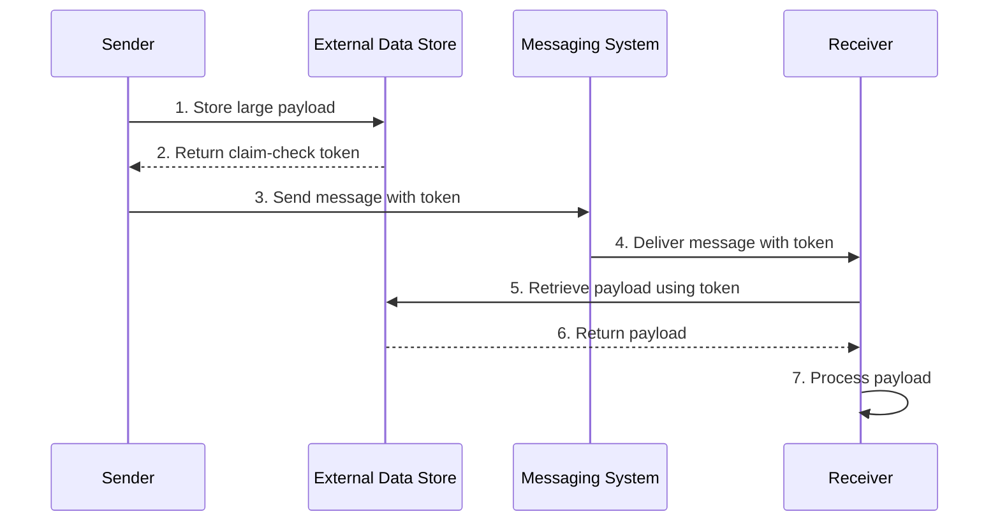
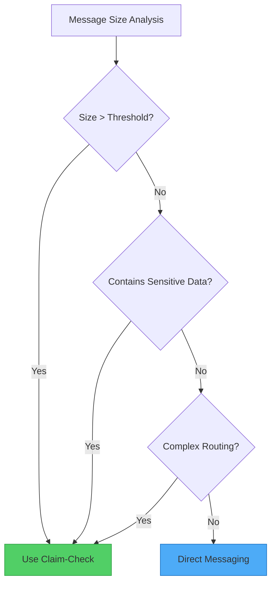

Imagine checking your luggage at an airport. Instead of carrying heavy bags through security and onto the plane, you hand them over at check-in and receive a small claim ticket. At your destination, you present that ticket to retrieve your bags. This real-world process inspired one of the most elegant solutions to a common problem in distributed systems: the Claim-Check pattern.

## The Problem: When Messages Become Too Heavy

Traditional messaging systems excel at handling high volumes of small messages. They're optimized for speed, throughput, and reliability when dealing with lightweight data. However, they often struggle with large payloads for several reasons:

- **Size Restrictions**: Most messaging systems impose strict limits on message size (often 256KB to 1MB)
- **Performance Degradation**: Large messages consume more memory and bandwidth, slowing down the entire system
- **Timeout Issues**: Processing large messages can exceed timeout thresholds
- **Resource Exhaustion**: Multiple large messages can overwhelm the messaging infrastructure

!!!warning "⚠️ Real-World Impact"
    A single 10MB message in a queue designed for 64KB messages can cause cascading failures, affecting all consumers and potentially bringing down the entire messaging system.

## The Solution: Separate Storage from Messaging

The Claim-Check pattern elegantly solves this problem by separating the concerns of data storage and message delivery:

1. **Store the payload** in an external data store optimized for large objects
2. **Generate a claim-check token** (a unique identifier or key)
3. **Send only the token** through the messaging system
4. **Retrieve the payload** using the token when needed



## How It Works: The Pattern in Action

Let's walk through a concrete example of processing customer orders with large attachments:

### Step 1: Store the Payload

When a sender needs to transmit a large payload (such as a high-resolution image, video file, or large document):

```javascript
// Sender application
async function sendLargeMessage(payload) {
  // Store payload in external data store
  const claimCheckToken = await dataStore.save({
    data: payload,
    expiresAt: Date.now() + (24 * 60 * 60 * 1000) // 24 hours
  });
  
  return claimCheckToken;
}
```

### Step 2: Send the Token

The messaging system only handles the lightweight token:

```javascript
// Send message with claim-check token
await messagingSystem.send({
  orderId: "ORD-12345",
  claimCheck: claimCheckToken,
  metadata: {
    size: payload.length,
    contentType: "application/pdf"
  }
});
```

### Step 3: Retrieve and Process

The receiver uses the token to fetch the actual payload:

```javascript
// Receiver application
async function processMessage(message) {
  // Retrieve payload using claim-check token
  const payload = await dataStore.retrieve(message.claimCheck);
  
  // Process the payload
  await processOrder(message.orderId, payload);
  
  // Clean up
  await dataStore.delete(message.claimCheck);
}
```

## Implementation Considerations

When implementing the Claim-Check pattern, consider these important aspects:

### 1. Payload Lifecycle Management

!!!tip "🗑️ Cleanup Strategies"
    **Synchronous Deletion**: The consuming application deletes the payload immediately after processing. This ties deletion to the message workflow and ensures timely cleanup.
    
    **Asynchronous Deletion**: A separate background process handles cleanup based on time-to-live (TTL) or other criteria. This decouples deletion from message processing but requires additional infrastructure.

### 2. Conditional Application

Not every message needs the Claim-Check pattern. Implement logic to apply it selectively:

```javascript
async function sendMessage(payload) {
  const MESSAGE_SIZE_THRESHOLD = 256 * 1024; // 256KB
  
  if (payload.length > MESSAGE_SIZE_THRESHOLD) {
    // Use Claim-Check pattern
    const token = await dataStore.save(payload);
    await messagingSystem.send({ claimCheck: token });
  } else {
    // Send directly
    await messagingSystem.send({ data: payload });
  }
}
```

This conditional approach:
- Reduces latency for small messages
- Optimizes resource utilization
- Improves overall throughput

### 3. Security Considerations

The claim-check token should be:
- **Unique**: Prevent collisions and unauthorized access
- **Obscure**: Use UUIDs or cryptographic hashes, not sequential IDs
- **Time-limited**: Implement expiration to prevent indefinite storage
- **Access-controlled**: Ensure only authorized applications can retrieve payloads

```javascript
// Generate secure claim-check token
function generateClaimCheck() {
  return {
    id: crypto.randomUUID(),
    signature: crypto.createHmac('sha256', secretKey)
                    .update(id)
                    .digest('hex'),
    expiresAt: Date.now() + TTL
  };
}
```

## When to Use the Claim-Check Pattern

### Primary Use Cases

!!!success "✅ Ideal Scenarios"
    **Messaging System Limitations**: When message sizes exceed system limits, offload payloads to external storage.
    
    **Performance Optimization**: When large messages degrade messaging system performance, separate storage from delivery.

### Secondary Use Cases

!!!info "📋 Additional Benefits"
    **Sensitive Data Protection**: Store sensitive information in secure data stores with stricter access controls, keeping it out of the messaging system.
    
    **Complex Routing**: When messages traverse multiple components, avoid repeated serialization/deserialization overhead by passing only tokens through intermediaries.



## Architecture Quality Attributes

The Claim-Check pattern impacts several architectural quality attributes:

### Reliability

Separating data from messages enables:
- **Data Redundancy**: External data stores often provide better replication and backup
- **Disaster Recovery**: Payloads can be recovered independently of the messaging system
- **Failure Isolation**: Messaging system failures don't affect stored payloads

### Security

The pattern enhances security by:
- **Data Segregation**: Sensitive data stays in secure storage with tighter access controls
- **Access Control**: Only services with valid tokens can retrieve payloads
- **Audit Trail**: Separate storage enables detailed access logging

### Performance

Performance improvements include:
- **Reduced Message Size**: Messaging system handles only lightweight tokens
- **Optimized Storage**: Each system (messaging vs. data store) handles what it does best
- **Selective Retrieval**: Receivers fetch payloads only when needed

### Cost Optimization

Cost benefits arise from:
- **Cheaper Messaging**: Avoid premium features for large message support
- **Storage Tiering**: Use cost-effective storage for large payloads
- **Resource Efficiency**: Better utilization of messaging infrastructure

## Trade-offs and Considerations

Like any pattern, Claim-Check introduces trade-offs:

!!!warning "⚠️ Potential Drawbacks"
    **Increased Complexity**: Additional infrastructure and coordination required
    
    **Latency**: Extra network round-trip to retrieve payloads
    
    **Consistency Challenges**: Ensuring message and payload remain synchronized
    
    **Operational Overhead**: Managing lifecycle of stored payloads

Evaluate these trade-offs against your specific requirements. The pattern works best when message size or performance issues outweigh the added complexity.

## Real-World Implementation Patterns

### Pattern 1: Automatic Token Generation

Use event-driven mechanisms to automatically generate tokens when files are uploaded:

```javascript
// File upload triggers automatic claim-check generation
dataStore.on('upload', async (file) => {
  const token = generateClaimCheck(file.id);
  await messagingSystem.send({
    event: 'file-uploaded',
    claimCheck: token,
    metadata: file.metadata
  });
});
```

### Pattern 2: Manual Token Generation

Application explicitly manages token creation and payload storage:

```javascript
// Application controls the entire process
async function processLargeOrder(order) {
  const token = await storeOrderDocuments(order.documents);
  await sendOrderMessage({
    orderId: order.id,
    claimCheck: token
  });
}
```

## Conclusion

The Claim-Check pattern provides an elegant solution to the challenge of handling large payloads in messaging systems. By separating storage from message delivery, it enables systems to:

- Overcome message size limitations
- Maintain high performance
- Enhance security and reliability
- Optimize costs

While it introduces additional complexity, the benefits often far outweigh the costs in systems dealing with large data transfers. Consider implementing this pattern when your messaging infrastructure struggles with payload sizes or when you need to protect sensitive data while maintaining efficient message delivery.

## Related Patterns

- **Asynchronous Request-Reply**: Complements Claim-Check for long-running operations
- **Competing Consumers**: Works well with Claim-Check for parallel processing
- **Split and Aggregate**: Alternative approach for handling large messages

## References

- [Enterprise Integration Patterns: Claim Check](https://www.enterpriseintegrationpatterns.com/patterns/messaging/StoreInLibrary.html)
- [Microsoft Azure Architecture Patterns: Claim-Check](https://learn.microsoft.com/en-us/azure/architecture/patterns/claim-check)
