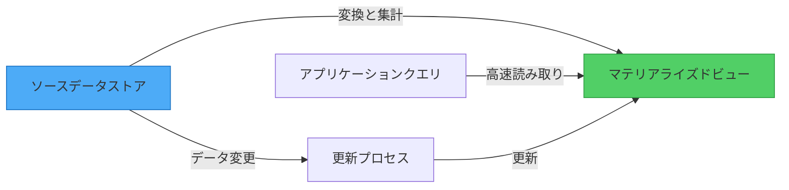
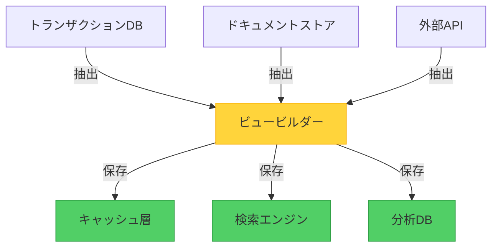

図書館に入ったとき、特定のジャンルを尋ねるたびに司書がすべての本を再編成することを期待しないでしょう。代わりに、図書館は本を素早く効率的に見つけるための事前計算されたインデックスであるカタログを維持しています。マテリアライズドビューパターンは、この同じ原則をデータシステムに適用します：質問される前に答えを準備します。

## 問題：ストレージ形式とクエリニーズ

開発者とデータ管理者がデータストレージを設計する際、通常、データの読み取り方法ではなく、データの書き込みと維持方法に焦点を当てます。これは完全に理にかなっています。ストレージ形式は次のように最適化されています：

- **データの整合性**：一貫性を確保し、重複を回避
- **書き込み効率**：高速な挿入と更新
- **ストレージの最適化**：スペース使用量の最小化
- **関係管理**：エンティティ間の接続の維持

しかし、このストレージ優先のアプローチは、クエリ要件との不一致を生み出すことがよくあります。正規化されたリレーショナルデータベースまたはNoSQLストアのドキュメント集約として注文を保存するeコマースシステムを考えてみましょう。この構造はトランザクションの記録にはうまく機能しますが、次のような質問に答える必要がある場合に問題になります：

- 「今月の製品カテゴリ別の総売上高は？」
- 「生涯価値が最も高い顧客は？」
- 「地域別の平均注文処理時間は？」

!!!warning "⚠️ クエリパフォーマンスの問題"
    これらの質問に答えるために、システムは数千のレコードをスキャンし、複雑な結合または集計を実行し、その場で値を計算する必要があります。このプロセスは、特にデータ量が増えるにつれて、大量のリソースと時間を消費します。

## ソリューション：クエリ結果を事前計算して保存

マテリアライズドビューパターンは、特定のクエリ用に最適化された形式でデータを生成して保存することで、この課題に対処します。クエリが実行されるたびに結果を計算する代わりに、システムは：

1. **一般的なクエリパターンを特定**：複雑な計算を必要とする
2. **結果を事前計算**：ソースデータを変換する
3. **結果を保存**：高速検索用に最適化された形式で
4. **ビューを更新**：ソースデータが変更されたとき



重要な洞察：マテリアライズドビューは完全に使い捨てです。ソースデータから完全に再構築できるため、生データではなく計算結果を保存する特殊な形式のキャッシュです。

## データベースのマテリアライズドビュー vs パターン

深く掘り下げる前に、重要な区別を明確にしましょう：データベースのマテリアライズドビューとマテリアライズドビューパターンは関連していますが、異なる概念です。

### データベースのマテリアライズドビュー

多くのリレーショナルデータベース（PostgreSQL、Oracle、SQL Server）は、組み込みのマテリアライズドビュー機能を提供します：

```sql
-- データベースのマテリアライズドビューの例
CREATE MATERIALIZED VIEW sales_summary AS
SELECT 
    product_category,
    SUM(order_total) as total_sales,
    COUNT(DISTINCT customer_id) as customer_count
FROM orders
JOIN order_items ON orders.id = order_items.order_id
JOIN products ON order_items.product_id = products.id
GROUP BY product_category;

-- ビューを更新
REFRESH MATERIALIZED VIEW sales_summary;
```

**特徴：**
- データベースエンジンによって管理
- 同じデータベース内に保存
- データベース固有の更新メカニズムを使用
- 通常、増分更新をサポート
- 単一データベーススコープに制限

### マテリアライズドビューパターン

アーキテクチャパターンは、この概念をデータベースの境界を超えて拡張します：

```javascript
// パターン実装の例
class MaterializedViewService {
  async updateSalesSummary() {
    // 複数のソースから読み取り
    const orders = await orderDatabase.query('SELECT * FROM orders');
    const customers = await customerDatabase.query('SELECT * FROM customers');
    const products = await productCatalog.getAll();
    
    // 変換と集計
    const summary = this.computeSummary(orders, customers, products);
    
    // 最適化された形式で保存
    await viewStore.save('sales_summary', summary);
  }
  
  async getSalesSummary() {
    return await viewStore.get('sales_summary');
  }
}
```

**特徴：**
- アプリケーション管理ロジック
- 複数のソースからデータを集計可能
- 任意のデータストアに保存（ソースとは異なる）
- 柔軟な更新戦略
- 分散システム全体で機能

### 主な違い

| 側面 | データベースのマテリアライズドビュー | マテリアライズドビューパターン |
|------|-----------------------------------|------------------------------|
| **スコープ** | 単一データベース | 複数のデータソース |
| **管理** | データベースエンジン | アプリケーションコード |
| **ストレージ** | 同じデータベース | 任意のデータストア |
| **技術** | データベース固有 | 技術非依存 |
| **使用例** | DB内のクエリ最適化 | クロスシステムデータ集計 |

!!!info "📊 どちらを使用するか"
    **データベースのマテリアライズドビューを使用**：単一データベースシステム内でクエリを最適化する場合。
    
    **マテリアライズドビューパターンを使用**：複数のシステム、マイクロサービス、または異種データストア全体でデータを集計する場合。

## 仕組み：実際のパターン

具体的な例を見てみましょう：製品販売サマリーを表示する必要があるeコマースプラットフォーム。

### ソースデータ構造

システムは、異なる目的に最適化された別々の場所にデータを保存します：

```javascript
// トランザクションデータベースに保存された注文
{
  orderId: "ORD-12345",
  customerId: "CUST-789",
  orderDate: "2019-05-15",
  items: [
    { productId: "PROD-001", quantity: 2, price: 29.99 },
    { productId: "PROD-002", quantity: 1, price: 49.99 }
  ]
}

// カタログサービスに保存された製品
{
  productId: "PROD-001",
  name: "Wireless Mouse",
  category: "Electronics"
}

// CRMシステムに保存された顧客
{
  customerId: "CUST-789",
  name: "John Doe",
  segment: "Premium"
}
```

### マテリアライズドビュー構造

ビューは、このデータをクエリ最適化形式に結合して変換します：

```javascript
// 販売サマリーのマテリアライズドビュー
{
  category: "Electronics",
  totalSales: 109.97,
  orderCount: 1,
  customerCount: 1,
  topProducts: [
    { productId: "PROD-002", name: "Keyboard", sales: 49.99 },
    { productId: "PROD-001", name: "Wireless Mouse", sales: 59.98 }
  ],
  lastUpdated: "2019-05-15T14:30:00Z"
}
```

### 更新戦略

パターンは複数の更新アプローチをサポートします：

#### 1. イベント駆動更新

```javascript
// ソースデータが変更されたときにビューを更新
orderService.on('orderCreated', async (order) => {
  await materializedViewService.updateSalesSummary(order);
});

productService.on('productUpdated', async (product) => {
  await materializedViewService.refreshProductViews(product);
});
```

#### 2. スケジュールされた更新

```javascript
// 定期的な更新
cron.schedule('0 * * * *', async () => {
  await materializedViewService.rebuildAllViews();
});
```

#### 3. オンデマンド更新

```javascript
// 必要に応じて手動更新
app.post('/admin/refresh-views', async (req, res) => {
  await materializedViewService.rebuildAllViews();
  res.json({ status: 'Views refreshed' });
});
```

## 実装の考慮事項

### 1. 更新のタイミングと頻度

要件に基づいて更新戦略を選択します：

!!!tip "🔄 更新戦略の選択"
    **リアルタイム（イベント駆動）**：鮮度が最も重要な重要なデータに最適。ソースデータが急速に変化する場合、過度のオーバーヘッドに注意してください。
    
    **スケジュール（バッチ）**：わずかな古さが許容されるレポートと分析に理想的。システム負荷を削減し、実装を簡素化します。
    
    **オンデマンド（手動）**：アクセス頻度の低いビューまたは更新タイミングの明示的な制御が必要な場合に適しています。

### 2. データ一貫性のトレードオフ

マテリアライズドビューは結果整合性を導入します：

```javascript
// 例：一貫性ウィンドウの処理
class MaterializedViewReader {
  async getSalesSummary(options = {}) {
    const view = await viewStore.get('sales_summary');
    
    if (options.requireFresh) {
      const age = Date.now() - view.lastUpdated;
      if (age > options.maxAge) {
        // 更新をトリガーして待機
        await this.refreshView();
        return await viewStore.get('sales_summary');
      }
    }
    
    return view;
  }
}
```

!!!warning "⚠️ 一貫性の考慮事項"
    ビューの更新中、データはソースシステムと一時的に一貫性がない可能性があります。アプリケーションがこれを適切に処理するように設計します：
    - 最終更新タイムスタンプを表示
    - 重要な操作に手動更新オプションを提供
    - バージョニングを使用して古いデータを検出

### 3. ストレージロケーション戦略

ビューはソースデータと同じストアに存在する必要はありません：



**ストレージオプション：**
- **インメモリキャッシュ**（Redis、Memcached）：超高速アクセス、揮発性
- **検索エンジン**（Elasticsearch）：全文検索機能
- **分析データベース**（ClickHouse、TimescaleDB）：集計用に最適化
- **オブジェクトストレージ**：大きく、アクセス頻度の低いビューにコスト効率的

## このパターンを使用する場合

### 理想的なシナリオ

!!!success "✅ 完璧な使用例"
    **複雑なクエリ要件**：クエリがリアルタイムで計算するのに高価な複数の結合、集計、または変換を必要とする場合。
    
    **クロスシステム集計**：複数のデータベース、マイクロサービス、または外部システムからデータを結合する場合。
    
    **レポートと分析**：リアルタイムの精度を必要としないダッシュボード、レポート、または分析を生成する場合。
    
    **イベントソーシングシステム**：現在の状態をクエリする唯一の方法がすべてのイベントを再生することである場合。

### 二次的なメリット

!!!info "📋 追加の利点"
    **簡素化されたクエリ**：ソースシステムの深い知識を必要としない形式で複雑なデータを公開します。
    
    **セキュリティとプライバシー**：クエリ機能を維持しながら機密データを除外するフィルタリングされたビューを提供します。
    
    **切断されたシナリオ**：オフラインアクセスまたは時々接続されるシステムのためにビューをローカルにキャッシュします。
    
    **パフォーマンスの分離**：重い分析クエリがトランザクションシステムに影響を与えるのを防ぎます。

### 避けるべき場合

!!!danger "❌ 適していない場合"
    **シンプルなデータ構造**：ソースデータがすでに簡単にクエリ可能な形式である。
    
    **高い一貫性要件**：アプリケーションがデータの古さを許容できない。
    
    **急速に変化するデータ**：ソースデータが頻繁に変化するため、ビューが常に古くなっている。
    
    **限定的なクエリパターン**：いくつかの単純なクエリのみが必要で、オーバーヘッドが正当化されない。

## アーキテクチャ品質属性

### パフォーマンス効率

パターンはクエリパフォーマンスを劇的に向上させます：


{
  "title": {
    "text": "クエリ応答時間の比較"
  },
  "tooltip": {
    "trigger": "axis"
  },
  "legend": {
    "data": ["直接クエリ", "マテリアライズドビュー"]
  },
  "xAxis": {
    "type": "category",
    "data": ["シンプル", "中程度", "複雑", "非常に複雑"]
  },
  "yAxis": {
    "type": "value",
    "name": "応答時間 (ms)"
  },
  "series": [
    {
      "name": "直接クエリ",
      "type": "bar",
      "data": [50, 250, 1500, 5000],
      "itemStyle": {
        "color": "#fa5252"
      }
    },
    {
      "name": "マテリアライズドビュー",
      "type": "bar",
      "data": [10, 15, 20, 25],
      "itemStyle": {
        "color": "#51cf66"
      }
    }
  ]
}


**メリット：**
- クエリ時の高価な結合と集計を排除
- 事前計算された結果を提供することでデータベース負荷を削減
- データ量に関係なく予測可能なクエリパフォーマンス

### スケーラビリティ

マテリアライズドビューは水平スケーリングをサポートします：

- **読み取りスケーリング**：複数のノードにビューを複製
- **書き込み分離**：読み取り重視の分析を書き込み重視のトランザクションから分離
- **リソースの最適化**：異なるアクセスパターンに特化したストレージを使用

### コストの最適化

追加のストレージが必要ですが、パターンは全体的なコストを削減できます：

- **計算の削減**：クエリ処理のCPUサイクルが少ない
- **データベース負荷の低下**：高価なデータベースインスタンスの必要性が減少
- **階層化されたストレージ**：アクセス頻度の低いビューにコスト効率の高いストレージを使用

## トレードオフと考慮事項

他のアーキテクチャパターンと同様に、マテリアライズドビューにはトレードオフがあります：

!!!warning "⚠️ 対処すべき課題"
    **ストレージオーバーヘッド**：ビューは追加のストレージスペースを消費し、データを重複させる可能性があります。
    
    **更新の複雑さ**：ビューの更新を管理すると、運用の複雑さと潜在的な障害ポイントが追加されます。
    
    **一貫性ウィンドウ**：アプリケーションは、ビューが最新のソースデータを反映していない期間を処理する必要があります。
    
    **メンテナンスの負担**：ビューには監視、バージョニング、時折の再構築が必要です。

**軽減戦略：**
- スキーマ変更を処理するためにビューのバージョニングを実装
- ビューの鮮度を監視し、古いデータについてアラート
- ビューの再構築と検証を自動化
- 各ビューの一貫性保証を文書化

## 関連パターン

マテリアライズドビューパターンは、他のアーキテクチャパターンとうまく機能します：

- **CQRS（コマンドクエリ責任分離）**：マテリアライズドビューをクエリ側として使用し、書き込み用に別のコマンドモデルを使用
- **イベントソーシング**：イベントストリームを処理してマテリアライズドビューを構築し、現在の状態を導出
- **インデックステーブルパターン**：追加のクエリパターンのためにマテリアライズドビュー上にセカンダリインデックスを作成
- **キャッシュアサイド**：明示的な更新ロジックを持つ特殊なキャッシュとしてマテリアライズドビューを扱う

## 結論

マテリアライズドビューパターンは、データ集約型システムの基本的な課題を解決します：データの保存方法とクエリ方法の不一致。クエリ結果を事前計算して保存することで、次のことを実現します：

- 複雑なクエリの**劇的なパフォーマンス向上**
- ソースシステムの**負荷削減**
- 複数のソースにわたってデータを集計する**柔軟性**
- アプリケーション開発者のための**簡素化されたクエリ**

一貫性とストレージオーバーヘッドに関するトレードオフを導入しますが、これらのコストは、提供するパフォーマンスの向上とアーキテクチャの柔軟性によって正当化されることがよくあります。システムが複雑なクエリに苦労している場合、複数のソースにわたってデータを集計する必要がある場合、またはトランザクションワークロードに影響を与えずに高性能な分析が必要な場合は、このパターンを検討してください。

成功の鍵：マテリアライズドビューを、いつでもソースデータから再構築できる使い捨ての自動化されたアーティファクトとして扱います。この考え方により、特定の要件に最適なバランスが見つかるまで、さまざまなビュー構造と更新戦略を自由に実験できます。

## 参考文献

- [Enterprise Integration Patterns: Materialized View](https://www.enterpriseintegrationpatterns.com/)
- [Microsoft Learn: Materialized View Pattern](https://learn.microsoft.com/en-us/azure/architecture/patterns/materialized-view)
- [Martin Fowler: CQRS](https://martinfowler.com/bliki/CQRS.html)
