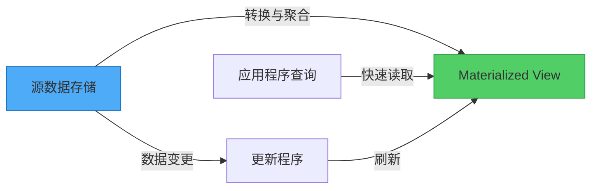
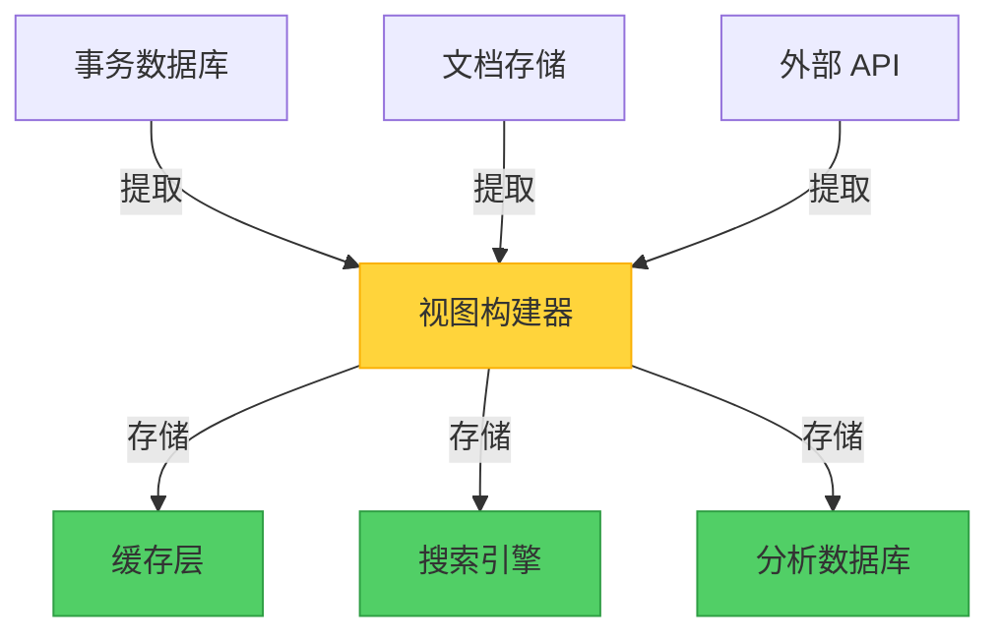

当你走进图书馆时，你不会期望图书管理员在每次你询问特定类型的书籍时，都重新整理所有的书。相反，图书馆维护着一个目录——一个预先计算的索引，让找书变得快速且高效。Materialized View 模式将同样的原则应用于数据系统：在问题被提出之前就准备好答案。

## 问题：存储格式 vs. 查询需求

当开发人员和数据管理员设计数据存储时，他们通常专注于数据如何被写入和维护，而非如何被读取。这完全合理——存储格式针对以下方面进行优化：

- **数据完整性**：确保一致性并避免重复
- **写入效率**：快速插入和更新
- **存储优化**：最小化空间使用
- **关联管理**：维护实体之间的连接

然而，这种存储优先的方法经常与查询需求产生不匹配。考虑一个电子商务系统，将订单存储在规范化的关系型数据库中，或作为文档聚合存储在 NoSQL 存储中。虽然这种结构对于记录交易运作良好，但当你需要回答以下问题时就会出现问题：

- "本月各产品类别的总销售额是多少？"
- "哪些客户的终身价值最高？"
- "各地区的平均订单处理时间是多少？"

!!!warning "⚠️ 查询性能问题"
    要回答这些问题，系统必须扫描数千条记录，执行复杂的联结或聚合，并实时计算数值。这个过程消耗大量资源和时间，特别是随着数据量增长。

## 解决方案：预先计算并存储查询结果

Materialized View 模式通过生成并存储针对特定查询优化格式的数据来解决这个挑战。系统不再每次查询执行时都计算结果，而是：

1. **识别常见的查询模式**，这些模式需要复杂的计算
2. **预先计算结果**，通过转换源数据
3. **存储结果**，以优化快速检索的格式
4. **更新视图**，当源数据变更时



关键洞察：materialized view 是完全可抛弃的。它可以完全从源数据重建，使其成为一种特殊形式的缓存，存储计算结果而非原始数据。

## 数据库 Materialized View vs. 此模式

在深入探讨之前，让我们厘清一个重要的区别：数据库 materialized view 和 Materialized View 模式是相关但不同的概念。

### 数据库 Materialized View

许多关系型数据库（PostgreSQL、Oracle、SQL Server）提供内置的 materialized view 功能：

```sql
-- 数据库 materialized view 示例
CREATE MATERIALIZED VIEW sales_summary AS
SELECT 
    product_category,
    SUM(order_total) as total_sales,
    COUNT(DISTINCT customer_id) as customer_count
FROM orders
JOIN order_items ON orders.id = order_items.order_id
JOIN products ON order_items.product_id = products.id
GROUP BY product_category;

-- 刷新视图
REFRESH MATERIALIZED VIEW sales_summary;
```

**特性：**
- 由数据库引擎管理
- 存储在同一个数据库内
- 使用数据库特定的刷新机制
- 通常支持增量更新
- 限于单一数据库范围

### Materialized View 模式

架构模式将这个概念扩展到数据库边界之外：

```javascript
// 模式实现示例
class MaterializedViewService {
  async updateSalesSummary() {
    // 从多个源读取
    const orders = await orderDatabase.query('SELECT * FROM orders');
    const customers = await customerDatabase.query('SELECT * FROM customers');
    const products = await productCatalog.getAll();
    
    // 转换和聚合
    const summary = this.computeSummary(orders, customers, products);
    
    // 以优化格式存储
    await viewStore.save('sales_summary', summary);
  }
  
  async getSalesSummary() {
    return await viewStore.get('sales_summary');
  }
}
```

**特性：**
- 应用程序管理的逻辑
- 可以聚合来自多个源的数据
- 存储在任何数据存储中（与源不同）
- 灵活的更新策略
- 跨分布式系统运作

### 主要差异

| 方面 | 数据库 Materialized View | Materialized View 模式 |
|------|-------------------------|----------------------|
| **范围** | 单一数据库 | 多个数据源 |
| **管理** | 数据库引擎 | 应用程序代码 |
| **存储** | 同一个数据库 | 任何数据存储 |
| **技术** | 数据库特定 | 技术无关 |
| **使用案例** | 数据库内查询优化 | 跨系统数据聚合 |

!!!info "📊 何时使用哪一种"
    **使用数据库 materialized view**，当在单一数据库系统内优化查询时。
    
    **使用 Materialized View 模式**，当跨多个系统、微服务或异构数据存储聚合数据时。

## 运作方式：模式实践

让我们探索一个具体示例：一个需要显示产品销售摘要的电子商务平台。

### 源数据结构

系统将数据存储在针对不同目的优化的独立位置：

```javascript
// 订单存储在事务数据库
{
  orderId: "ORD-12345",
  customerId: "CUST-789",
  orderDate: "2019-05-15",
  items: [
    { productId: "PROD-001", quantity: 2, price: 29.99 },
    { productId: "PROD-002", quantity: 1, price: 49.99 }
  ]
}

// 产品存储在目录服务
{
  productId: "PROD-001",
  name: "无线鼠标",
  category: "电子产品"
}

// 客户存储在 CRM 系统
{
  customerId: "CUST-789",
  name: "张三",
  segment: "高级会员"
}
```

### Materialized View 结构

视图将这些数据组合并转换为查询优化格式：

```javascript
// 销售摘要的 materialized view
{
  category: "电子产品",
  totalSales: 109.97,
  orderCount: 1,
  customerCount: 1,
  topProducts: [
    { productId: "PROD-002", name: "键盘", sales: 49.99 },
    { productId: "PROD-001", name: "无线鼠标", sales: 59.98 }
  ],
  lastUpdated: "2019-05-15T14:30:00Z"
}
```

### 更新策略

此模式支持多种更新方法：

#### 1. 事件驱动更新

```javascript
// 当源数据变更时更新视图
orderService.on('orderCreated', async (order) => {
  await materializedViewService.updateSalesSummary(order);
});

productService.on('productUpdated', async (product) => {
  await materializedViewService.refreshProductViews(product);
});
```

#### 2. 定时更新

```javascript
// 定期刷新
cron.schedule('0 * * * *', async () => {
  await materializedViewService.rebuildAllViews();
});
```

#### 3. 按需更新

```javascript
// 需要时手动刷新
app.post('/admin/refresh-views', async (req, res) => {
  await materializedViewService.rebuildAllViews();
  res.json({ status: 'Views refreshed' });
});
```

## 实现考量

### 1. 更新时机与频率

根据你的需求选择更新策略：

!!!tip "🔄 更新策略选择"
    **实时（事件驱动）**：最适合新鲜度至关重要的关键数据。注意如果源数据快速变更可能产生过多开销。
    
    **定时（批处理）**：适合报表和分析，可接受轻微的过时性。减少系统负载并简化实现。
    
    **按需（手动）**：适合不常访问的视图，或当你需要明确控制刷新时机时。

### 2. 数据一致性权衡

Materialized view 引入最终一致性：

```javascript
// 示例：处理一致性窗口
class MaterializedViewReader {
  async getSalesSummary(options = {}) {
    const view = await viewStore.get('sales_summary');
    
    if (options.requireFresh) {
      const age = Date.now() - view.lastUpdated;
      if (age > options.maxAge) {
        // 触发刷新并等待
        await this.refreshView();
        return await viewStore.get('sales_summary');
      }
    }
    
    return view;
  }
}
```

!!!warning "⚠️ 一致性考量"
    在视图更新期间，数据可能暂时与源系统不一致。设计你的应用程序以优雅地处理这种情况：
    - 显示最后更新时间戳
    - 为关键操作提供手动刷新选项
    - 使用版本控制来检测过时数据

### 3. 存储位置策略

视图不需要与源数据位于同一个存储中：



**存储选项：**
- **内存缓存**（Redis、Memcached）：超快速访问，易失性
- **搜索引擎**（Elasticsearch）：全文搜索能力
- **分析数据库**（ClickHouse、TimescaleDB）：针对聚合优化
- **对象存储**：大型、不常访问视图的成本效益选择

### 4. 视图优化技术

通过策略性设计最大化视图价值：

```javascript
// 包含计算值
{
  category: "电子产品",
  totalSales: 109.97,
  averageOrderValue: 54.99,  // 预先计算
  growthRate: 0.15,           // 预先计算 vs. 前期
  topProducts: [...],
  // 包含经常联结的数据
  categoryMetadata: {
    name: "电子产品",
    description: "电子设备和配件"
  }
}
```

**优化策略：**
- 为 materialized view 添加索引以加快查询
- 包含计算列以避免运行时计算
- 反规范化经常联结的数据
- 以查询友好的格式存储数据（例如，文档查询使用 JSON）

## 何时使用此模式

### 理想场景

!!!success "✅ 完美使用案例"
    **复杂查询需求**：当查询需要多个联结、聚合或转换，且实时计算成本高昂时。
    
    **跨系统聚合**：当组合来自多个数据库、微服务或外部系统的数据时。
    
    **报表和分析**：当生成仪表板、报表或分析，且不需要实时准确性时。
    
    **Event Sourcing 系统**：当查询当前状态的唯一方法是重放所有事件时。

### 次要优势

!!!info "📋 额外优势"
    **简化查询**：以不需要深入了解源系统的格式公开复杂数据。
    
    **安全性与隐私**：提供过滤视图，排除敏感数据同时维持查询能力。
    
    **离线场景**：为离线访问或偶尔连接的系统在本地缓存视图。
    
    **性能隔离**：防止繁重的分析查询影响事务系统。

### 何时避免

!!!danger "❌ 不适合的情况"
    **简单数据结构**：源数据已经是容易查询的格式。
    
    **高一致性需求**：应用程序无法容忍任何数据过时性。
    
    **快速变更的数据**：源数据变更如此频繁，以至于视图总是过时的。
    
    **有限的查询模式**：只需要少数简单查询，使开销不合理。

## 架构质量属性

### 性能效率

此模式大幅改善查询性能：


{
  "title": {
    "text": "查询响应时间比较"
  },
  "tooltip": {
    "trigger": "axis"
  },
  "legend": {
    "data": ["直接查询", "Materialized View"]
  },
  "xAxis": {
    "type": "category",
    "data": ["简单", "中等", "复杂", "非常复杂"]
  },
  "yAxis": {
    "type": "value",
    "name": "响应时间 (ms)"
  },
  "series": [
    {
      "name": "直接查询",
      "type": "bar",
      "data": [50, 250, 1500, 5000],
      "itemStyle": {
        "color": "#fa5252"
      }
    },
    {
      "name": "Materialized View",
      "type": "bar",
      "data": [10, 15, 20, 25],
      "itemStyle": {
        "color": "#51cf66"
      }
    }
  ]
}


**优势：**
- 在查询时消除昂贵的联结和聚合
- 通过提供预先计算的结果减少数据库负载
- 无论数据量如何都能实现可预测的查询性能

### 可扩展性

Materialized view 支持水平扩展：

- **读取扩展**：跨多个节点复制视图
- **写入隔离**：将读取密集的分析与写入密集的事务分离
- **资源优化**：为不同的访问模式使用专门的存储

### 成本优化

虽然需要额外的存储，但此模式可以降低整体成本：

- **减少计算**：查询处理所需的 CPU 周期更少
- **降低数据库负载**：减少对昂贵数据库实例的需求
- **分层存储**：为不常访问的视图使用具成本效益的存储

## 实际实现示例

这是一个销售分析系统的完整实现：

```javascript
class SalesAnalyticsView {
  constructor(orderDb, productDb, customerDb, viewStore) {
    this.orderDb = orderDb;
    this.productDb = productDb;
    this.customerDb = customerDb;
    this.viewStore = viewStore;
  }
  
  async rebuildView() {
    // 从多个源提取数据
    const orders = await this.orderDb.getOrders();
    const products = await this.productDb.getProducts();
    const customers = await this.customerDb.getCustomers();
    
    // 转换和聚合
    const summary = this.computeSummary(orders, products, customers);
    
    // 以元数据存储
    await this.viewStore.save('sales_analytics', {
      data: summary,
      lastUpdated: new Date(),
      version: this.generateVersion()
    });
  }
  
  computeSummary(orders, products, customers) {
    const productMap = new Map(products.map(p => [p.id, p]));
    const customerMap = new Map(customers.map(c => [c.id, c]));
    
    const summary = {};
    
    for (const order of orders) {
      for (const item of order.items) {
        const product = productMap.get(item.productId);
        const category = product.category;
        
        if (!summary[category]) {
          summary[category] = {
            totalSales: 0,
            orderCount: 0,
            customers: new Set()
          };
        }
        
        summary[category].totalSales += item.quantity * item.price;
        summary[category].orderCount++;
        summary[category].customers.add(order.customerId);
      }
    }
    
    // 转换为最终格式
    return Object.entries(summary).map(([category, data]) => ({
      category,
      totalSales: data.totalSales,
      orderCount: data.orderCount,
      customerCount: data.customers.size
    }));
  }
  
  async getView() {
    return await this.viewStore.get('sales_analytics');
  }
}
```

## 权衡与考量

像任何架构模式一样，materialized view 涉及权衡：

!!!warning "⚠️ 需要解决的挑战"
    **存储开销**：视图消耗额外的存储空间，可能重复数据。
    
    **更新复杂性**：管理视图更新增加操作复杂性和潜在的失败点。
    
    **一致性窗口**：应用程序必须处理视图不反映最新源数据的期间。
    
    **维护负担**：视图需要监控、版本控制和偶尔的重建。

**缓解策略：**
- 实现视图版本控制以处理架构变更
- 监控视图新鲜度并在数据过时时发出警报
- 自动化视图重建和验证
- 记录每个视图的一致性保证

## 相关模式

Materialized View 模式与其他架构模式配合良好：

- **CQRS（命令查询责任分离）**：使用 materialized view 作为查询端，并为写入使用独立的命令模型
- **Event Sourcing**：通过处理事件流来构建 materialized view 以衍生当前状态
- **Index Table 模式**：在 materialized view 上创建次要索引以支持额外的查询模式
- **Cache-Aside**：将 materialized view 视为具有明确刷新逻辑的特殊缓存

## 结论

Materialized View 模式解决了数据密集系统中的一个基本挑战：数据存储方式与查询需求之间的不匹配。通过预先计算并存储查询结果，它提供：

- 复杂查询的**显著性能改善**
- **减少源系统的负载**
- 跨多个源聚合数据的**灵活性**
- 为应用程序开发人员**简化查询**

虽然它在一致性和存储开销方面引入了权衡，但这些成本通常被它提供的性能提升和架构灵活性所证明是合理的。当你的系统在复杂查询上遇到困难、需要跨多个源聚合数据，或需要高性能分析而不影响事务工作负载时，请考虑此模式。

成功的关键：将 materialized view 视为可抛弃的、自动化的产物，可以随时从源数据重建。这种心态让你可以自由地实验不同的视图结构和更新策略，直到找到最适合你特定需求的平衡。

## 参考资料

- [Enterprise Integration Patterns: Materialized View](https://www.enterpriseintegrationpatterns.com/)
- [Microsoft Learn: Materialized View Pattern](https://learn.microsoft.com/en-us/azure/architecture/patterns/materialized-view)
- [Martin Fowler: CQRS](https://martinfowler.com/bliki/CQRS.html)
