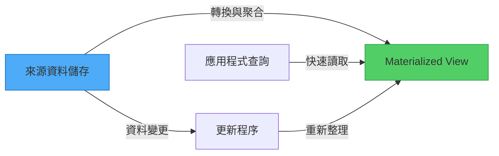
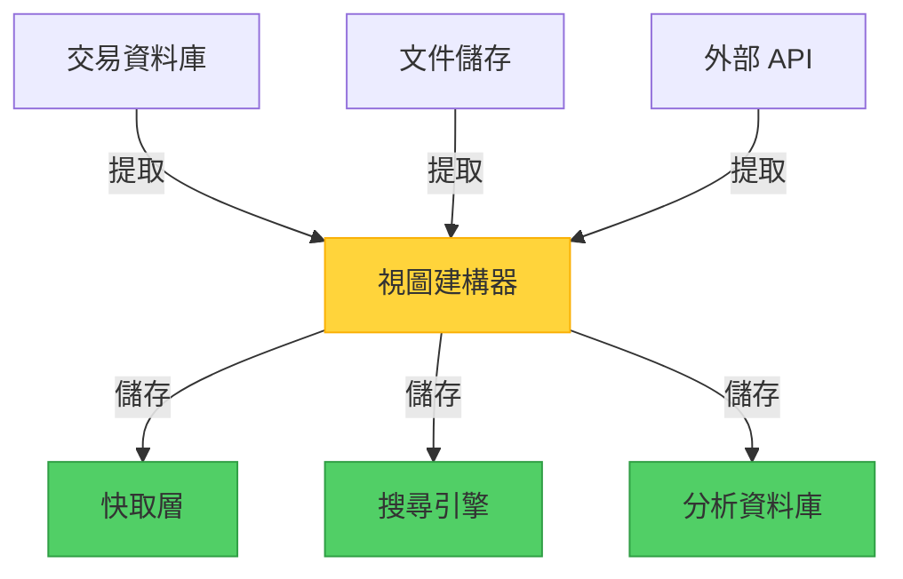

當你走進圖書館時，你不會期望圖書館員在每次你詢問特定類型的書籍時，都重新整理所有的書。相反地，圖書館維護著一個目錄——一個預先計算的索引，讓找書變得快速且有效率。Materialized View 模式將同樣的原則應用於資料系統：在問題被提出之前就準備好答案。

## 問題：儲存格式 vs. 查詢需求

當開發人員和資料管理員設計資料儲存時，他們通常專注於資料如何被寫入和維護，而非如何被讀取。這完全合理——儲存格式針對以下方面進行優化：

- **資料完整性**：確保一致性並避免重複
- **寫入效率**：快速插入和更新
- **儲存優化**：最小化空間使用
- **關聯管理**：維護實體之間的連接

然而，這種儲存優先的方法經常與查詢需求產生不匹配。考慮一個電子商務系統，將訂單儲存在正規化的關聯式資料庫中，或作為文件聚合儲存在 NoSQL 儲存中。雖然這種結構對於記錄交易運作良好，但當你需要回答以下問題時就會出現問題：

- 「本月各產品類別的總銷售額是多少？」
- 「哪些客戶的終身價值最高？」
- 「各地區的平均訂單處理時間是多少？」

!!!warning "⚠️ 查詢效能問題"
    要回答這些問題，系統必須掃描數千筆記錄，執行複雜的聯結或聚合，並即時計算數值。這個過程消耗大量資源和時間，特別是隨著資料量增長。

## 解決方案：預先計算並儲存查詢結果

Materialized View 模式透過產生並儲存針對特定查詢優化格式的資料來解決這個挑戰。系統不再每次查詢執行時都計算結果，而是：

1. **識別常見的查詢模式**，這些模式需要複雜的計算
2. **預先計算結果**，透過轉換來源資料
3. **儲存結果**，以優化快速檢索的格式
4. **更新視圖**，當來源資料變更時



關鍵洞察：materialized view 是完全可拋棄的。它可以完全從來源資料重建，使其成為一種特殊形式的快取，儲存計算結果而非原始資料。

## 資料庫 Materialized View vs. 此模式

在深入探討之前，讓我們釐清一個重要的區別：資料庫 materialized view 和 Materialized View 模式是相關但不同的概念。

### 資料庫 Materialized View

許多關聯式資料庫（PostgreSQL、Oracle、SQL Server）提供內建的 materialized view 功能：

```sql
-- 資料庫 materialized view 範例
CREATE MATERIALIZED VIEW sales_summary AS
SELECT 
    product_category,
    SUM(order_total) as total_sales,
    COUNT(DISTINCT customer_id) as customer_count
FROM orders
JOIN order_items ON orders.id = order_items.order_id
JOIN products ON order_items.product_id = products.id
GROUP BY product_category;

-- 重新整理視圖
REFRESH MATERIALIZED VIEW sales_summary;
```

**特性：**
- 由資料庫引擎管理
- 儲存在同一個資料庫內
- 使用資料庫特定的重新整理機制
- 通常支援增量更新
- 限於單一資料庫範圍

### Materialized View 模式

架構模式將這個概念擴展到資料庫邊界之外：

```javascript
// 模式實作範例
class MaterializedViewService {
  async updateSalesSummary() {
    // 從多個來源讀取
    const orders = await orderDatabase.query('SELECT * FROM orders');
    const customers = await customerDatabase.query('SELECT * FROM customers');
    const products = await productCatalog.getAll();
    
    // 轉換和聚合
    const summary = this.computeSummary(orders, customers, products);
    
    // 以優化格式儲存
    await viewStore.save('sales_summary', summary);
  }
  
  async getSalesSummary() {
    return await viewStore.get('sales_summary');
  }
}
```

**特性：**
- 應用程式管理的邏輯
- 可以聚合來自多個來源的資料
- 儲存在任何資料儲存中（與來源不同）
- 靈活的更新策略
- 跨分散式系統運作

### 主要差異

| 面向 | 資料庫 Materialized View | Materialized View 模式 |
|------|-------------------------|----------------------|
| **範圍** | 單一資料庫 | 多個資料來源 |
| **管理** | 資料庫引擎 | 應用程式程式碼 |
| **儲存** | 同一個資料庫 | 任何資料儲存 |
| **技術** | 資料庫特定 | 技術無關 |
| **使用案例** | 資料庫內查詢優化 | 跨系統資料聚合 |

!!!info "📊 何時使用哪一種"
    **使用資料庫 materialized view**，當在單一資料庫系統內優化查詢時。
    
    **使用 Materialized View 模式**，當跨多個系統、微服務或異質資料儲存聚合資料時。

## 運作方式：模式實踐

讓我們探索一個具體範例：一個需要顯示產品銷售摘要的電子商務平台。

### 來源資料結構

系統將資料儲存在針對不同目的優化的獨立位置：

```javascript
// 訂單儲存在交易資料庫
{
  orderId: "ORD-12345",
  customerId: "CUST-789",
  orderDate: "2019-05-15",
  items: [
    { productId: "PROD-001", quantity: 2, price: 29.99 },
    { productId: "PROD-002", quantity: 1, price: 49.99 }
  ]
}

// 產品儲存在目錄服務
{
  productId: "PROD-001",
  name: "無線滑鼠",
  category: "電子產品"
}

// 客戶儲存在 CRM 系統
{
  customerId: "CUST-789",
  name: "王小明",
  segment: "高級會員"
}
```

### Materialized View 結構

視圖將這些資料組合並轉換為查詢優化格式：

```javascript
// 銷售摘要的 materialized view
{
  category: "電子產品",
  totalSales: 109.97,
  orderCount: 1,
  customerCount: 1,
  topProducts: [
    { productId: "PROD-002", name: "鍵盤", sales: 49.99 },
    { productId: "PROD-001", name: "無線滑鼠", sales: 59.98 }
  ],
  lastUpdated: "2019-05-15T14:30:00Z"
}
```

### 更新策略

此模式支援多種更新方法：

#### 1. 事件驅動更新

```javascript
// 當來源資料變更時更新視圖
orderService.on('orderCreated', async (order) => {
  await materializedViewService.updateSalesSummary(order);
});

productService.on('productUpdated', async (product) => {
  await materializedViewService.refreshProductViews(product);
});
```

#### 2. 排程更新

```javascript
// 定期重新整理
cron.schedule('0 * * * *', async () => {
  await materializedViewService.rebuildAllViews();
});
```

#### 3. 按需更新

```javascript
// 需要時手動重新整理
app.post('/admin/refresh-views', async (req, res) => {
  await materializedViewService.rebuildAllViews();
  res.json({ status: 'Views refreshed' });
});
```

## 實作考量

### 1. 更新時機與頻率

根據你的需求選擇更新策略：

!!!tip "🔄 更新策略選擇"
    **即時（事件驅動）**：最適合新鮮度至關重要的關鍵資料。注意如果來源資料快速變更可能產生過多開銷。
    
    **排程（批次）**：適合報表和分析，可接受輕微的過時性。減少系統負載並簡化實作。
    
    **按需（手動）**：適合不常存取的視圖，或當你需要明確控制重新整理時機時。

### 2. 資料一致性權衡

Materialized view 引入最終一致性：

```javascript
// 範例：處理一致性視窗
class MaterializedViewReader {
  async getSalesSummary(options = {}) {
    const view = await viewStore.get('sales_summary');
    
    if (options.requireFresh) {
      const age = Date.now() - view.lastUpdated;
      if (age > options.maxAge) {
        // 觸發重新整理並等待
        await this.refreshView();
        return await viewStore.get('sales_summary');
      }
    }
    
    return view;
  }
}
```

!!!warning "⚠️ 一致性考量"
    在視圖更新期間，資料可能暫時與來源系統不一致。設計你的應用程式以優雅地處理這種情況：
    - 顯示最後更新時間戳記
    - 為關鍵操作提供手動重新整理選項
    - 使用版本控制來偵測過時資料

### 3. 儲存位置策略

視圖不需要與來源資料位於同一個儲存中：



**儲存選項：**
- **記憶體快取**（Redis、Memcached）：超快速存取，易失性
- **搜尋引擎**（Elasticsearch）：全文搜尋能力
- **分析資料庫**（ClickHouse、TimescaleDB）：針對聚合優化
- **物件儲存**：大型、不常存取視圖的成本效益選擇

### 4. 視圖優化技術

透過策略性設計最大化視圖價值：

```javascript
// 包含計算值
{
  category: "電子產品",
  totalSales: 109.97,
  averageOrderValue: 54.99,  // 預先計算
  growthRate: 0.15,           // 預先計算 vs. 前期
  topProducts: [...],
  // 包含經常聯結的資料
  categoryMetadata: {
    name: "電子產品",
    description: "電子裝置和配件"
  }
}
```

**優化策略：**
- 為 materialized view 新增索引以加快查詢
- 包含計算欄位以避免執行時期計算
- 反正規化經常聯結的資料
- 以查詢友善的格式儲存資料（例如，文件查詢使用 JSON）

## 何時使用此模式

### 理想情境

!!!success "✅ 完美使用案例"
    **複雜查詢需求**：當查詢需要多個聯結、聚合或轉換，且即時計算成本高昂時。
    
    **跨系統聚合**：當組合來自多個資料庫、微服務或外部系統的資料時。
    
    **報表和分析**：當產生儀表板、報表或分析，且不需要即時準確性時。
    
    **Event Sourcing 系統**：當查詢目前狀態的唯一方法是重播所有事件時。

### 次要優勢

!!!info "📋 額外優勢"
    **簡化查詢**：以不需要深入了解來源系統的格式公開複雜資料。
    
    **安全性與隱私**：提供過濾視圖，排除敏感資料同時維持查詢能力。
    
    **離線情境**：為離線存取或偶爾連線的系統在本地快取視圖。
    
    **效能隔離**：防止繁重的分析查詢影響交易系統。

### 何時避免

!!!danger "❌ 不適合的情況"
    **簡單資料結構**：來源資料已經是容易查詢的格式。
    
    **高一致性需求**：應用程式無法容忍任何資料過時性。
    
    **快速變更的資料**：來源資料變更如此頻繁，以至於視圖總是過時的。
    
    **有限的查詢模式**：只需要少數簡單查詢，使開銷不合理。

## 架構品質屬性

### 效能效率

此模式大幅改善查詢效能：


{
  "title": {
    "text": "查詢回應時間比較"
  },
  "tooltip": {
    "trigger": "axis"
  },
  "legend": {
    "data": ["直接查詢", "Materialized View"]
  },
  "xAxis": {
    "type": "category",
    "data": ["簡單", "中等", "複雜", "非常複雜"]
  },
  "yAxis": {
    "type": "value",
    "name": "回應時間 (ms)"
  },
  "series": [
    {
      "name": "直接查詢",
      "type": "bar",
      "data": [50, 250, 1500, 5000],
      "itemStyle": {
        "color": "#fa5252"
      }
    },
    {
      "name": "Materialized View",
      "type": "bar",
      "data": [10, 15, 20, 25],
      "itemStyle": {
        "color": "#51cf66"
      }
    }
  ]
}


**優勢：**
- 在查詢時消除昂貴的聯結和聚合
- 透過提供預先計算的結果減少資料庫負載
- 無論資料量如何都能實現可預測的查詢效能

### 可擴展性

Materialized view 支援水平擴展：

- **讀取擴展**：跨多個節點複製視圖
- **寫入隔離**：將讀取密集的分析與寫入密集的交易分離
- **資源優化**：為不同的存取模式使用專門的儲存

### 成本優化

雖然需要額外的儲存，但此模式可以降低整體成本：

- **減少運算**：查詢處理所需的 CPU 週期更少
- **降低資料庫負載**：減少對昂貴資料庫實例的需求
- **分層儲存**：為不常存取的視圖使用具成本效益的儲存

## 實際實作範例

這是一個銷售分析系統的完整實作：

```javascript
class SalesAnalyticsView {
  constructor(orderDb, productDb, customerDb, viewStore) {
    this.orderDb = orderDb;
    this.productDb = productDb;
    this.customerDb = customerDb;
    this.viewStore = viewStore;
  }
  
  async rebuildView() {
    // 從多個來源提取資料
    const orders = await this.orderDb.getOrders();
    const products = await this.productDb.getProducts();
    const customers = await this.customerDb.getCustomers();
    
    // 轉換和聚合
    const summary = this.computeSummary(orders, products, customers);
    
    // 以中繼資料儲存
    await this.viewStore.save('sales_analytics', {
      data: summary,
      lastUpdated: new Date(),
      version: this.generateVersion()
    });
  }
  
  computeSummary(orders, products, customers) {
    const productMap = new Map(products.map(p => [p.id, p]));
    const customerMap = new Map(customers.map(c => [c.id, c]));
    
    const summary = {};
    
    for (const order of orders) {
      for (const item of order.items) {
        const product = productMap.get(item.productId);
        const category = product.category;
        
        if (!summary[category]) {
          summary[category] = {
            totalSales: 0,
            orderCount: 0,
            customers: new Set()
          };
        }
        
        summary[category].totalSales += item.quantity * item.price;
        summary[category].orderCount++;
        summary[category].customers.add(order.customerId);
      }
    }
    
    // 轉換為最終格式
    return Object.entries(summary).map(([category, data]) => ({
      category,
      totalSales: data.totalSales,
      orderCount: data.orderCount,
      customerCount: data.customers.size
    }));
  }
  
  async getView() {
    return await this.viewStore.get('sales_analytics');
  }
}
```

## 權衡與考量

像任何架構模式一樣，materialized view 涉及權衡：

!!!warning "⚠️ 需要解決的挑戰"
    **儲存開銷**：視圖消耗額外的儲存空間，可能重複資料。
    
    **更新複雜性**：管理視圖更新增加操作複雜性和潛在的失敗點。
    
    **一致性視窗**：應用程式必須處理視圖不反映最新來源資料的期間。
    
    **維護負擔**：視圖需要監控、版本控制和偶爾的重建。

**緩解策略：**
- 實作視圖版本控制以處理架構變更
- 監控視圖新鮮度並在資料過時時發出警報
- 自動化視圖重建和驗證
- 記錄每個視圖的一致性保證

## 相關模式

Materialized View 模式與其他架構模式配合良好：

- **CQRS（命令查詢責任分離）**：使用 materialized view 作為查詢端，並為寫入使用獨立的命令模型
- **Event Sourcing**：透過處理事件串流來建構 materialized view 以衍生目前狀態
- **Index Table 模式**：在 materialized view 上建立次要索引以支援額外的查詢模式
- **Cache-Aside**：將 materialized view 視為具有明確重新整理邏輯的特殊快取

## 結論

Materialized View 模式解決了資料密集系統中的一個基本挑戰：資料儲存方式與查詢需求之間的不匹配。透過預先計算並儲存查詢結果，它提供：

- 複雜查詢的**顯著效能改善**
- **減少來源系統的負載**
- 跨多個來源聚合資料的**靈活性**
- 為應用程式開發人員**簡化查詢**

雖然它在一致性和儲存開銷方面引入了權衡，但這些成本通常被它提供的效能提升和架構靈活性所證明是合理的。當你的系統在複雜查詢上遇到困難、需要跨多個來源聚合資料，或需要高效能分析而不影響交易工作負載時，請考慮此模式。

成功的關鍵：將 materialized view 視為可拋棄的、自動化的產物，可以隨時從來源資料重建。這種心態讓你可以自由地實驗不同的視圖結構和更新策略，直到找到最適合你特定需求的平衡。

## 參考資料

- [Enterprise Integration Patterns: Materialized View](https://www.enterpriseintegrationpatterns.com/)
- [Microsoft Learn: Materialized View Pattern](https://learn.microsoft.com/en-us/azure/architecture/patterns/materialized-view)
- [Martin Fowler: CQRS](https://martinfowler.com/bliki/CQRS.html)
