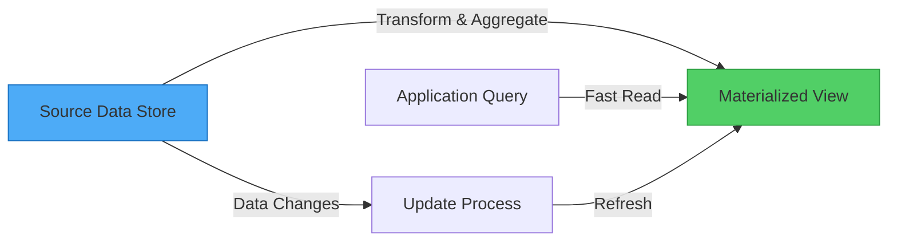
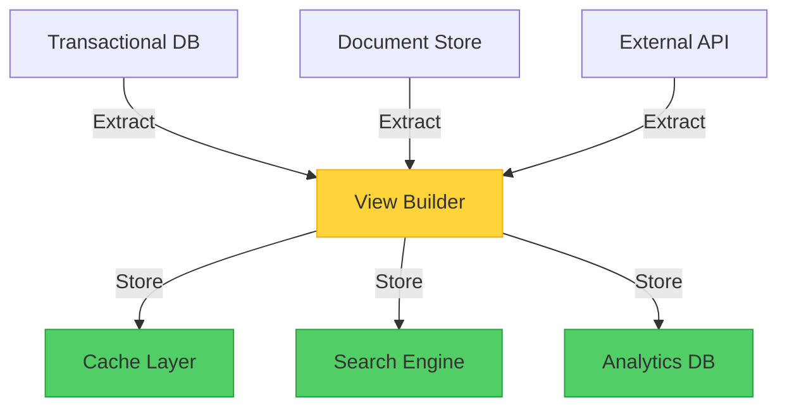

When you walk into a library, you don't expect the librarian to reorganize all the books every time you ask for a specific genre. Instead, the library maintains a catalog—a precomputed index that makes finding books fast and efficient. The Materialized View pattern applies this same principle to data systems: prepare the answers before the questions are asked.

## The Problem: Storage Format vs. Query Needs

When developers and data administrators design data storage, they typically focus on how data is written and maintained rather than how it will be read. This makes perfect sense—storage formats are optimized for:

- **Data integrity**: Ensuring consistency and avoiding duplication
- **Write efficiency**: Fast inserts and updates
- **Storage optimization**: Minimizing space usage
- **Relationship management**: Maintaining connections between entities

However, this storage-first approach often creates a mismatch with query requirements. Consider an e-commerce system storing orders in a normalized relational database or as document aggregates in a NoSQL store. While this structure works well for recording transactions, it becomes problematic when you need to answer questions like:

- "What's the total sales value by product category this month?"
- "Which customers have the highest lifetime value?"
- "What's the average order processing time by region?"

!!!warning "⚠️ The Query Performance Problem"
    To answer these questions, the system must scan thousands of records, perform complex joins or aggregations, and compute values on the fly. This process consumes significant resources and time, especially as data volume grows.

## The Solution: Precompute and Store Query Results

The Materialized View pattern addresses this challenge by generating and storing data in formats optimized for specific queries. Instead of computing results every time a query runs, the system:

1. **Identifies common query patterns** that require complex computations
2. **Precomputes the results** by transforming source data
3. **Stores the results** in a format optimized for fast retrieval
4. **Updates the view** when source data changes



The key insight: a materialized view is completely disposable. It can be rebuilt entirely from source data, making it a specialized form of cache that stores computed results rather than raw data.

## Database Materialized Views vs. The Pattern

Before diving deeper, let's clarify an important distinction: database materialized views and the Materialized View pattern are related but different concepts.

### Database Materialized Views

Many relational databases (PostgreSQL, Oracle, SQL Server) provide built-in materialized view features:

```sql
-- Database materialized view example
CREATE MATERIALIZED VIEW sales_summary AS
SELECT 
    product_category,
    SUM(order_total) as total_sales,
    COUNT(DISTINCT customer_id) as customer_count
FROM orders
JOIN order_items ON orders.id = order_items.order_id
JOIN products ON order_items.product_id = products.id
GROUP BY product_category;

-- Refresh the view
REFRESH MATERIALIZED VIEW sales_summary;
```

**Characteristics:**
- Managed by the database engine
- Stored within the same database
- Uses database-specific refresh mechanisms
- Typically supports incremental updates
- Limited to single database scope

### The Materialized View Pattern

The architectural pattern extends this concept beyond database boundaries:

```javascript
// Pattern implementation example
class MaterializedViewService {
  async updateSalesSummary() {
    // Read from multiple sources
    const orders = await orderDatabase.query('SELECT * FROM orders');
    const customers = await customerDatabase.query('SELECT * FROM customers');
    const products = await productCatalog.getAll();
    
    // Transform and aggregate
    const summary = this.computeSummary(orders, customers, products);
    
    // Store in optimized format
    await viewStore.save('sales_summary', summary);
  }
  
  async getSalesSummary() {
    return await viewStore.get('sales_summary');
  }
}
```

**Characteristics:**
- Application-managed logic
- Can aggregate data from multiple sources
- Stored in any data store (different from source)
- Flexible update strategies
- Works across distributed systems

### Key Differences

| Aspect | Database Materialized View | Materialized View Pattern |
|--------|---------------------------|---------------------------|
| **Scope** | Single database | Multiple data sources |
| **Management** | Database engine | Application code |
| **Storage** | Same database | Any data store |
| **Technology** | Database-specific | Technology-agnostic |
| **Use Case** | Query optimization within DB | Cross-system data aggregation |

!!!info "📊 When to Use Which"
    **Use database materialized views** when optimizing queries within a single database system.
    
    **Use the Materialized View pattern** when aggregating data across multiple systems, microservices, or heterogeneous data stores.

## How It Works: Pattern in Practice

Let's explore a concrete example: an e-commerce platform that needs to display product sales summaries.

### Source Data Structure

The system stores data in separate locations optimized for different purposes:

```javascript
// Orders stored in transactional database
{
  orderId: "ORD-12345",
  customerId: "CUST-789",
  orderDate: "2019-05-15",
  items: [
    { productId: "PROD-001", quantity: 2, price: 29.99 },
    { productId: "PROD-002", quantity: 1, price: 49.99 }
  ]
}

// Products stored in catalog service
{
  productId: "PROD-001",
  name: "Wireless Mouse",
  category: "Electronics"
}

// Customers stored in CRM system
{
  customerId: "CUST-789",
  name: "John Doe",
  segment: "Premium"
}
```

### Materialized View Structure

The view combines and transforms this data into a query-optimized format:

```javascript
// Materialized view for sales summary
{
  category: "Electronics",
  totalSales: 109.97,
  orderCount: 1,
  customerCount: 1,
  topProducts: [
    { productId: "PROD-002", name: "Keyboard", sales: 49.99 },
    { productId: "PROD-001", name: "Wireless Mouse", sales: 59.98 }
  ],
  lastUpdated: "2019-05-15T14:30:00Z"
}
```

### Update Strategies

The pattern supports multiple update approaches:

#### 1. Event-Driven Updates

```javascript
// Update view when source data changes
orderService.on('orderCreated', async (order) => {
  await materializedViewService.updateSalesSummary(order);
});

productService.on('productUpdated', async (product) => {
  await materializedViewService.refreshProductViews(product);
});
```

#### 2. Scheduled Updates

```javascript
// Periodic refresh
cron.schedule('0 * * * *', async () => {
  await materializedViewService.rebuildAllViews();
});
```

#### 3. On-Demand Updates

```javascript
// Manual refresh when needed
app.post('/admin/refresh-views', async (req, res) => {
  await materializedViewService.rebuildAllViews();
  res.json({ status: 'Views refreshed' });
});
```

## Implementation Considerations

### 1. Update Timing and Frequency

Choose an update strategy based on your requirements:

!!!tip "🔄 Update Strategy Selection"
    **Real-time (Event-Driven)**: Best for critical data where freshness is paramount. Watch for excessive overhead if source data changes rapidly.
    
    **Scheduled (Batch)**: Ideal for reporting and analytics where slight staleness is acceptable. Reduces system load and simplifies implementation.
    
    **On-Demand (Manual)**: Suitable for infrequently accessed views or when you need explicit control over refresh timing.

### 2. Data Consistency Trade-offs

Materialized views introduce eventual consistency:

```javascript
// Example: Handling consistency window
class MaterializedViewReader {
  async getSalesSummary(options = {}) {
    const view = await viewStore.get('sales_summary');
    
    if (options.requireFresh) {
      const age = Date.now() - view.lastUpdated;
      if (age > options.maxAge) {
        // Trigger refresh and wait
        await this.refreshView();
        return await viewStore.get('sales_summary');
      }
    }
    
    return view;
  }
}
```

!!!warning "⚠️ Consistency Considerations"
    During view updates, data may be temporarily inconsistent with source systems. Design your application to handle this gracefully:
    - Display last update timestamps
    - Provide manual refresh options for critical operations
    - Use versioning to detect stale data

### 3. Storage Location Strategy

Views don't need to reside in the same store as source data:



**Storage Options:**
- **In-memory cache** (Redis, Memcached): Ultra-fast access, volatile
- **Search engine** (Elasticsearch): Full-text search capabilities
- **Analytics database** (ClickHouse, TimescaleDB): Optimized for aggregations
- **Object storage**: Cost-effective for large, infrequently accessed views

### 4. View Optimization Techniques

Maximize view value through strategic design:

```javascript
// Include computed values
{
  category: "Electronics",
  totalSales: 109.97,
  averageOrderValue: 54.99,  // Precomputed
  growthRate: 0.15,           // Precomputed vs. previous period
  topProducts: [...],
  // Include frequently joined data
  categoryMetadata: {
    name: "Electronics",
    description: "Electronic devices and accessories"
  }
}
```

**Optimization strategies:**
- Add indexes to materialized views for faster queries
- Include computed columns to avoid runtime calculations
- Denormalize frequently joined data
- Store data in query-friendly formats (e.g., JSON for document queries)

## When to Use This Pattern

### Ideal Scenarios

!!!success "✅ Perfect Use Cases"
    **Complex Query Requirements**: When queries require multiple joins, aggregations, or transformations that are expensive to compute in real-time.
    
    **Cross-System Aggregation**: When combining data from multiple databases, microservices, or external systems.
    
    **Reporting and Analytics**: When generating dashboards, reports, or analytics that don't require real-time accuracy.
    
    **Event Sourcing Systems**: When the only way to query current state is by replaying all events.

### Secondary Benefits

!!!info "📋 Additional Advantages"
    **Simplified Queries**: Expose complex data in formats that don't require deep knowledge of source systems.
    
    **Security and Privacy**: Provide filtered views that exclude sensitive data while maintaining query capabilities.
    
    **Disconnected Scenarios**: Cache views locally for offline access or occasionally connected systems.
    
    **Performance Isolation**: Prevent heavy analytical queries from impacting transactional systems.

### When to Avoid

!!!danger "❌ Not Suitable When"
    **Simple Data Structures**: Source data is already in an easily queryable format.
    
    **High Consistency Requirements**: Applications cannot tolerate any data staleness.
    
    **Rapidly Changing Data**: Source data changes so frequently that views are always outdated.
    
    **Limited Query Patterns**: Only a few simple queries are needed, making the overhead unjustified.

## Architecture Quality Attributes

### Performance Efficiency

The pattern dramatically improves query performance:


{
  "title": {
    "text": "Query Response Time Comparison"
  },
  "tooltip": {
    "trigger": "axis"
  },
  "legend": {
    "data": ["Direct Query", "Materialized View"]
  },
  "xAxis": {
    "type": "category",
    "data": ["Simple", "Medium", "Complex", "Very Complex"]
  },
  "yAxis": {
    "type": "value",
    "name": "Response Time (ms)"
  },
  "series": [
    {
      "name": "Direct Query",
      "type": "bar",
      "data": [50, 250, 1500, 5000],
      "itemStyle": {
        "color": "#fa5252"
      }
    },
    {
      "name": "Materialized View",
      "type": "bar",
      "data": [10, 15, 20, 25],
      "itemStyle": {
        "color": "#51cf66"
      }
    }
  ]
}


**Benefits:**
- Eliminates expensive joins and aggregations at query time
- Reduces database load by serving precomputed results
- Enables predictable query performance regardless of data volume

### Scalability

Materialized views support horizontal scaling:

- **Read scaling**: Replicate views across multiple nodes
- **Write isolation**: Separate read-heavy analytics from write-heavy transactions
- **Resource optimization**: Use specialized storage for different access patterns

### Cost Optimization

While requiring additional storage, the pattern can reduce overall costs:

- **Reduced compute**: Fewer CPU cycles for query processing
- **Lower database load**: Decreased need for expensive database instances
- **Tiered storage**: Use cost-effective storage for infrequently accessed views

## Real-World Implementation Example

Here's a complete implementation for a sales analytics system:

```javascript
class SalesAnalyticsView {
  constructor(orderDb, productDb, customerDb, viewStore) {
    this.orderDb = orderDb;
    this.productDb = productDb;
    this.customerDb = customerDb;
    this.viewStore = viewStore;
  }
  
  async rebuildView() {
    // Extract data from multiple sources
    const orders = await this.orderDb.getOrders();
    const products = await this.productDb.getProducts();
    const customers = await this.customerDb.getCustomers();
    
    // Transform and aggregate
    const summary = this.computeSummary(orders, products, customers);
    
    // Store with metadata
    await this.viewStore.save('sales_analytics', {
      data: summary,
      lastUpdated: new Date(),
      version: this.generateVersion()
    });
  }
  
  computeSummary(orders, products, customers) {
    const productMap = new Map(products.map(p => [p.id, p]));
    const customerMap = new Map(customers.map(c => [c.id, c]));
    
    const summary = {};
    
    for (const order of orders) {
      for (const item of order.items) {
        const product = productMap.get(item.productId);
        const category = product.category;
        
        if (!summary[category]) {
          summary[category] = {
            totalSales: 0,
            orderCount: 0,
            customers: new Set()
          };
        }
        
        summary[category].totalSales += item.quantity * item.price;
        summary[category].orderCount++;
        summary[category].customers.add(order.customerId);
      }
    }
    
    // Convert to final format
    return Object.entries(summary).map(([category, data]) => ({
      category,
      totalSales: data.totalSales,
      orderCount: data.orderCount,
      customerCount: data.customers.size
    }));
  }
  
  async getView() {
    return await this.viewStore.get('sales_analytics');
  }
}
```

## Trade-offs and Considerations

Like any architectural pattern, materialized views involve trade-offs:

!!!warning "⚠️ Challenges to Address"
    **Storage Overhead**: Views consume additional storage space, potentially duplicating data.
    
    **Update Complexity**: Managing view updates adds operational complexity and potential failure points.
    
    **Consistency Windows**: Applications must handle periods where views don't reflect latest source data.
    
    **Maintenance Burden**: Views require monitoring, versioning, and occasional rebuilding.

**Mitigation strategies:**
- Implement view versioning to handle schema changes
- Monitor view freshness and alert on stale data
- Automate view rebuilding and validation
- Document consistency guarantees for each view

## Related Patterns

The Materialized View pattern works well with other architectural patterns:

- **CQRS (Command Query Responsibility Segregation)**: Use materialized views as the query side, with separate command models for writes
- **Event Sourcing**: Build materialized views by processing event streams to derive current state
- **Index Table Pattern**: Create secondary indexes over materialized views for additional query patterns
- **Cache-Aside**: Treat materialized views as a specialized cache with explicit refresh logic

## Conclusion

The Materialized View pattern solves a fundamental challenge in data-intensive systems: the mismatch between how data is stored and how it needs to be queried. By precomputing and storing query results, it delivers:

- **Dramatic performance improvements** for complex queries
- **Reduced load** on source systems
- **Flexibility** to aggregate data across multiple sources
- **Simplified queries** for application developers

While it introduces trade-offs around consistency and storage overhead, these costs are often justified by the performance gains and architectural flexibility it provides. Consider this pattern when your system struggles with complex queries, needs to aggregate data across multiple sources, or requires high-performance analytics without impacting transactional workloads.

The key to success: treat materialized views as disposable, automated artifacts that can be rebuilt from source data at any time. This mindset frees you to experiment with different view structures and update strategies until you find the optimal balance for your specific requirements.

## References

- [Enterprise Integration Patterns: Materialized View](https://www.enterpriseintegrationpatterns.com/)
- [Microsoft Learn: Materialized View Pattern](https://learn.microsoft.com/en-us/azure/architecture/patterns/materialized-view)
- [Martin Fowler: CQRS](https://martinfowler.com/bliki/CQRS.html)
