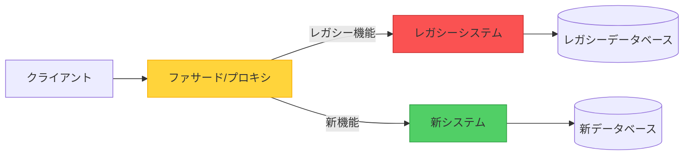
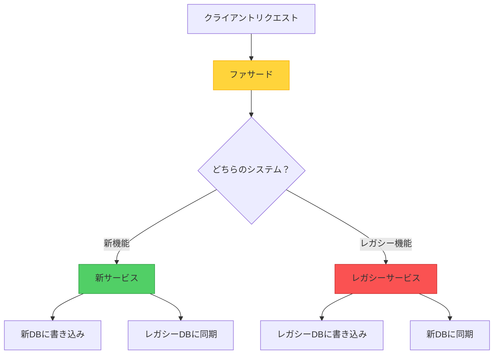

保守が困難になったレガシーシステムに直面したとき、すべてをゼロから書き直したいという誘惑は強いものです。しかし、歴史は「ビッグバン」方式の書き直しがしばしば壮大に失敗することを教えてくれました。Strangler Figパターンは、より実用的なアプローチを提供します：古いシステムを少しずつ段階的に置き換え、何も残らなくなるまで続けるのです。

しかし、ここで興味深い質問があります：Strangler Figは本当に伝統的な意味での「パターン」なのか、それともより正確には移行「戦略」と表現すべきなのか？実装と、この哲学的な区別の両方を探ってみましょう。

## 起源の物語

この名前は、熱帯雨林に生息する絞め殺しイチジクの木に由来します。これらの木は、宿主の木に堆積した種子として生命を始めます。成長するにつれて、地面に向かって根を伸ばし、徐々に宿主の木を包み込みます。最終的に、宿主の木は死んで分解し、イチジクの木だけがその場所に立ち残ります——システム移行の完璧な比喩です。

## 核心概念

Strangler Figは、モダナイゼーションへの段階的なアプローチを提供します。システム全体を一度に置き換えるのではなく、次のようにします：

1. **ファサード（プロキシ）を導入**し、クライアントとレガシーシステムの間に配置
2. **新しい機能を段階的に実装**し、モダンなシステムで構築
3. **リクエストをインテリジェントにルーティング**し、新旧のシステム間で振り分け
4. **レガシーシステムを廃止**し、すべての機能が移行されたら
5. **ファサードを削除**し、移行が完了したら



## 動作の仕組み：実践的な旅

具体的な例を見てみましょう：eコマースプラットフォームをモノリシックアーキテクチャからマイクロサービスに移行します。

### フェーズ1：ファサードの確立

最初のステップは、トラフィックを誘導できるルーティング層を導入することです：

```javascript
class StranglerFacade {
  constructor(legacySystem, newSystem) {
    this.legacy = legacySystem;
    this.modern = newSystem;
    this.featureFlags = new FeatureToggleService();
  }
  
  async handleRequest(request) {
    const route = this.determineRoute(request);
    
    if (route === 'modern') {
      return await this.modern.handle(request);
    }
    
    return await this.legacy.handle(request);
  }
  
  determineRoute(request) {
    // フィーチャーフラグ、ユーザーセグメント、またはエンドポイントに基づいてルーティング
    if (this.featureFlags.isEnabled('new-checkout', request.user)) {
      return 'modern';
    }
    
    if (request.path.startsWith('/api/v2/')) {
      return 'modern';
    }
    
    return 'legacy';
  }
}
```

### フェーズ2：段階的な移行

低リスク、高価値の機能から始めます：

```javascript
// 第1週：商品検索を移行
app.get('/search', async (req, res) => {
  // より良いパフォーマンスを持つ新しい検索サービス
  const results = await newSearchService.search(req.query);
  res.json(results);
});

// 第4週：ユーザー認証を移行
app.post('/login', async (req, res) => {
  // モダンなセキュリティを持つ新しい認証サービス
  const token = await newAuthService.authenticate(req.body);
  res.json({ token });
});

// 第8週：チェックアウトプロセスを移行
app.post('/checkout', async (req, res) => {
  // 改善されたUXを持つ新しいチェックアウト
  const order = await newCheckoutService.process(req.body);
  res.json(order);
});
```

### フェーズ3：データ移行の処理

最も厄介な側面の1つは、両方のシステム間でデータを管理することです：



```javascript
class DataSyncService {
  async syncOrder(order) {
    // 新システムに書き込み
    await newDatabase.orders.create(order);
    
    // まだ使用している機能のためにレガシーに同期
    await legacyDatabase.orders.create(this.transformToLegacy(order));
  }
  
  async migrateHistoricalData() {
    // 既存データのバッチ移行
    const legacyOrders = await legacyDatabase.orders.findAll();
    
    for (const order of legacyOrders) {
      const modernOrder = this.transformToModern(order);
      await newDatabase.orders.create(modernOrder);
    }
  }
}
```

### フェーズ4：移行の完了

すべての機能が移行されたら：

```javascript
// 前：ファサードルーティング
app.use(stranglerFacade.middleware());

// 後：新システムへの直接ルーティング
app.use(newSystem.middleware());

// レガシーシステムを廃止
await legacySystem.shutdown();
await legacyDatabase.archive();
```

## パターン vs. 戦略：哲学的議論

ここで興味深くなります。Strangler Figは「パターン」なのか、それとも「戦略」なのか？

### 「パターン」の主張

!!!info "📐 パターンの特徴"
    **構造的ソリューション**：Strangler Figは、繰り返し発生する問題を解決する特定の構造（ファサード + デュアルシステム）を定義します。
    
    **再利用可能なテンプレート**：このアプローチは、異なる技術やドメインに適用できます。
    
    **名前付きソリューション**：段階的な移行について議論するための共通の語彙を提供します。

伝統的なデザインパターン（Gang of Fourの本にあるようなもの）は、繰り返し発生する問題に対する構造的ソリューションを記述します。Strangler Figはこの定義に適合します——特定のアーキテクチャ構造（ファサード）と明確なプロセスを規定します。

### 「戦略」の主張

!!!tip "🎯 戦略の特徴"
    **高レベルのアプローチ**：具体的な実装の詳細よりも、全体的な移行の哲学に関するものです。
    
    **柔軟な実装**：実際の構造は、コンテキストに応じて大きく異なります。
    
    **プロセス指向**：静的な構造だけでなく、時間の経過に伴う一連のアクションを記述します。

戦略は、目標を達成するためのより広範なアプローチです。Strangler Figは基本的に移行への*アプローチ方法*に関するもの——リスク管理と変更管理に関する戦略的決定です。

### 評決：両方である

!!!success "✅ ハイブリッド分類"
    Strangler Figは**戦略的パターン**です——パターンの構造的特異性と戦略の高レベルガイダンスを組み合わせています。
    
    特定のアーキテクチャコンポーネント（ファサード）を規定するため、パターンです。
    
    時間の経過に伴うシステム進化への全体的なアプローチを導くため、戦略です。

おそらく、この区別は、それが提供する価値ほど重要ではありません。パターンと呼ぼうが戦略と呼ぼうが、Strangler Figはソフトウェアエンジニアリングの最も困難な問題の1つに対する実証済みのアプローチを提供します：レガシーシステムを安全に進化させることです。

## 実装の考慮事項

### 1. ファサード設計

ファサードはコントロールセンターです。慎重に設計してください：

```javascript
class IntelligentFacade {
  constructor() {
    this.router = new SmartRouter();
    this.monitor = new MigrationMonitor();
    this.fallback = new FallbackHandler();
  }
  
  async route(request) {
    try {
      const target = this.router.determineTarget(request);
      const response = await target.handle(request);
      
      // 成功率を監視
      this.monitor.recordSuccess(target.name);
      
      return response;
    } catch (error) {
      // エラー時にレガシーにフォールバック
      this.monitor.recordFailure(target.name);
      return await this.fallback.handleWithLegacy(request);
    }
  }
}
```

!!!warning "⚠️ ファサードのリスク"
    **単一障害点**：ファサードは重要なインフラストラクチャになります。高可用性を確保してください。
    
    **パフォーマンスボトルネック**：すべてのリクエストがファサードを通過します。慎重に最適化してください。
    
    **複雑性の増大**：移行が進むにつれて、ルーティングロジックが複雑になる可能性があります。保守可能性を保ってください。

### 2. フィーチャートグル戦略

フィーチャーフラグを使用して移行を制御します：

```javascript
class FeatureToggleService {
  isEnabled(feature, context) {
    // 段階的なロールアウト
    if (feature === 'new-checkout') {
      // ユーザーの10%
      if (this.isInPercentage(context.userId, 10)) {
        return true;
      }
      
      // ベータテスター
      if (context.user.isBetaTester) {
        return true;
      }
      
      // 特定のユーザーセグメント
      if (context.user.segment === 'premium') {
        return true;
      }
    }
    
    return false;
  }
  
  isInPercentage(userId, percentage) {
    const hash = this.hashUserId(userId);
    return (hash % 100) < percentage;
  }
}
```

### 3. データ整合性管理

デュアルライト問題を処理します：

```javascript
class ConsistencyManager {
  async writeWithConsistency(data) {
    // 最初に新システムに書き込み
    const newResult = await newSystem.write(data);
    
    try {
      // レガシーに同期
      await legacySystem.write(this.transform(data));
    } catch (error) {
      // リトライのためにキューに追加
      await this.retryQueue.add({
        data,
        target: 'legacy',
        timestamp: Date.now()
      });
    }
    
    return newResult;
  }
  
  async reconcile() {
    // 定期的な整合性チェック
    const discrepancies = await this.findDiscrepancies();
    
    for (const item of discrepancies) {
      await this.resolveConflict(item);
    }
  }
}
```

## このアプローチを使用するタイミング

### 理想的なシナリオ

!!!success "✅ 完璧なユースケース"
    **大規模なレガシーシステム**：システムが大きすぎるか複雑すぎて完全な書き直しができない場合。
    
    **ビジネス継続性が必要**：ダウンタイムやサービス中断を許容できない場合。
    
    **不確実な要件**：新しいシステムがどのようなものであるべきか完全に確信が持てない場合。
    
    **リスク軽減**：移行失敗のリスクを最小限に抑える必要がある場合。

### 実世界の例

**eコマースプラットフォームの移行**
- 商品カタログから開始
- 検索機能に移行
- チェックアウトプロセスを移行
- 最後に注文管理を置き換え

**銀行システムのモダナイゼーション**
- 顧客ポータルから開始
- アカウントサービスを移行
- トランザクション処理を更新
- 最後にコアバンキングを置き換え

**コンテンツ管理システム**
- コンテンツ配信をモダナイズ
- オーサリングツールをアップグレード
- アセット管理を移行
- ワークフローエンジンを置き換え

### 避けるべき場合

!!!danger "❌ 適さない場合"
    **小規模システム**：完全な書き直しの方が簡単で速い場合。
    
    **インターセプションポイントがない**：ファサードやプロキシ層を導入できない場合。
    
    **緊急の置き換え**：コンプライアンスやセキュリティ上の理由でレガシーシステムを直ちに廃止する必要がある場合。
    
    **シンプルなアーキテクチャ**：システムが十分にシンプルで、段階的な移行が不必要な複雑さを追加する場合。

## アーキテクチャ品質属性

### 信頼性

Strangler Figは移行中の信頼性を向上させます：

- **段階的なリスク導入**：各変更は小さく、元に戻すことができます
- **フォールバック機能**：新機能が失敗した場合、レガシーに戻すことができます
- **継続的な運用**：システムは移行全体を通じて機能し続けます

```javascript
class ReliabilityHandler {
  async handleWithFallback(request) {
    try {
      return await newSystem.handle(request);
    } catch (error) {
      logger.warn('新システムが失敗しました、フォールバック中', error);
      return await legacySystem.handle(request);
    }
  }
}
```

### コスト最適化

デュアルシステムの実行にはコストがかかりますが、このアプローチは長期的な投資を最適化します：


{
  "title": {
    "text": "コスト比較：ビッグバン vs. Strangler Fig"
  },
  "tooltip": {
    "trigger": "axis"
  },
  "legend": {
    "data": ["ビッグバン書き直し", "Strangler Fig"]
  },
  "xAxis": {
    "type": "category",
    "data": ["1ヶ月目", "3ヶ月目", "6ヶ月目", "9ヶ月目", "12ヶ月目"]
  },
  "yAxis": {
    "type": "value",
    "name": "コスト"
  },
  "series": [
    {
      "name": "ビッグバン書き直し",
      "type": "line",
      "data": [100, 100, 100, 100, 150],
      "itemStyle": {
        "color": "#fa5252"
      },
      "lineStyle": {
        "type": "dashed"
      }
    },
    {
      "name": "Strangler Fig",
      "type": "line",
      "data": [20, 40, 60, 80, 100],
      "itemStyle": {
        "color": "#51cf66"
      }
    }
  ]
}


**コストメリット：**
- 時間をかけて投資を分散
- 段階的に価値を提供
- 「全か無か」のリスクを回避
- 既存システムの使用を最大化

### 運用の卓越性

段階的なアプローチは継続的な改善をサポートします：

- **小さく安全な変更**：各移行ステップは管理可能です
- **学習の機会**：初期の移行から得た教訓が後の移行に活かされます
- **チームの適応**：チームは新しい技術の専門知識を徐々に構築します
- **継続的デリバリー**：移行中に新機能をリリースできます

## 完全な実装例

APIゲートウェイファサードの包括的な実装は次のとおりです：

```javascript
class StranglerFigGateway {
  constructor(config) {
    this.legacy = new LegacySystemClient(config.legacy);
    this.modern = new ModernSystemClient(config.modern);
    this.features = new FeatureToggleService(config.features);
    this.monitor = new MonitoringService(config.monitoring);
    this.cache = new CacheService(config.cache);
  }
  
  async handleRequest(req, res) {
    const startTime = Date.now();
    const route = this.determineRoute(req);
    
    try {
      let response;
      
      // 最初にキャッシュをチェック
      const cacheKey = this.getCacheKey(req);
      const cached = await this.cache.get(cacheKey);
      
      if (cached) {
        response = cached;
      } else {
        // 適切なシステムにルーティング
        if (route.target === 'modern') {
          response = await this.modern.handle(req);
        } else {
          response = await this.legacy.handle(req);
        }
        
        // 適切な場合はキャッシュ
        if (route.cacheable) {
          await this.cache.set(cacheKey, response, route.ttl);
        }
      }
      
      // メトリクスを記録
      this.monitor.recordRequest({
        target: route.target,
        duration: Date.now() - startTime,
        status: 'success'
      });
      
      return res.json(response);
      
    } catch (error) {
      // フォールバックロジック
      if (route.target === 'modern' && route.fallbackEnabled) {
        try {
          const fallbackResponse = await this.legacy.handle(req);
          
          this.monitor.recordRequest({
            target: 'legacy-fallback',
            duration: Date.now() - startTime,
            status: 'fallback'
          });
          
          return res.json(fallbackResponse);
        } catch (fallbackError) {
          this.monitor.recordError(fallbackError);
          return res.status(500).json({ error: 'サービス利用不可' });
        }
      }
      
      this.monitor.recordError(error);
      return res.status(500).json({ error: error.message });
    }
  }
  
  determineRoute(req) {
    // APIバージョンベースのルーティング
    if (req.path.startsWith('/api/v2/')) {
      return {
        target: 'modern',
        fallbackEnabled: true,
        cacheable: true,
        ttl: 300
      };
    }
    
    // フィーチャーフラグベースのルーティング
    const feature = this.extractFeature(req.path);
    if (this.features.isEnabled(feature, req.user)) {
      return {
        target: 'modern',
        fallbackEnabled: true,
        cacheable: false
      };
    }
    
    // デフォルトはレガシー
    return {
      target: 'legacy',
      fallbackEnabled: false,
      cacheable: true,
      ttl: 600
    };
  }
  
  extractFeature(path) {
    const pathMap = {
      '/products': 'new-catalog',
      '/search': 'new-search',
      '/checkout': 'new-checkout',
      '/orders': 'new-orders'
    };
    
    for (const [prefix, feature] of Object.entries(pathMap)) {
      if (path.startsWith(prefix)) {
        return feature;
      }
    }
    
    return null;
  }
  
  getCacheKey(req) {
    return `${req.method}:${req.path}:${JSON.stringify(req.query)}`;
  }
}
```

## 移行の監視

進捗と健全性を追跡します：

```javascript
class MigrationDashboard {
  async getMetrics() {
    return {
      trafficDistribution: await this.getTrafficSplit(),
      featureMigrationStatus: await this.getFeatureStatus(),
      errorRates: await this.getErrorRates(),
      performanceComparison: await this.getPerformanceMetrics()
    };
  }
  
  async getTrafficSplit() {
    const total = await this.monitor.getTotalRequests();
    const modern = await this.monitor.getModernRequests();
    
    return {
      legacy: ((total - modern) / total * 100).toFixed(1),
      modern: (modern / total * 100).toFixed(1)
    };
  }
  
  async getFeatureStatus() {
    return {
      completed: ['product-catalog', 'search', 'user-auth'],
      inProgress: ['checkout', 'order-management'],
      pending: ['inventory', 'reporting', 'admin-panel']
    };
  }
}
```

## トレードオフと課題

他のアーキテクチャアプローチと同様に、Strangler Figにはトレードオフがあります：

!!!warning "⚠️ 対処すべき課題"
    **デュアルシステムのオーバーヘッド**：両方のシステムを同時に実行すると、インフラストラクチャコストと運用の複雑さが増加します。
    
    **データ同期**：システム間でデータの整合性を保つことは困難でエラーが発生しやすいです。
    
    **延長されたタイムライン**：移行は書き直しよりも時間がかかり、ステークホルダーにとってフラストレーションになる可能性があります。
    
    **ファサードの複雑性**：移行が進むにつれて、ルーティング層が複雑になり、保守が困難になる可能性があります。

**軽減戦略：**
- 明確な移行マイルストーンを設定し、進捗を祝う
- データ同期と検証を自動化
- 明確なルーティングルールでファサードロジックをシンプルに保つ
- コストを監視し、インフラストラクチャの使用を最適化
- 最初からファサードの削除を計画

## 関連パターンと戦略

Strangler Figは他のアーキテクチャアプローチとうまく機能します：

- **Branch by Abstraction**：類似の段階的アプローチですが、システムレベルではなくコードレベルで
- **Parallel Run**：新システムの動作を検証するために両方のシステムを同時に実行
- **Blue-Green Deployment**：移行が完了したときの最終的な切り替えに使用
- **Feature Toggles**：どの機能を新システムにルーティングするかを制御するために不可欠
- **Anti-Corruption Layer**：レガシーシステムの設計決定から新システムを保護

## 結論

パターンと呼ぼうが戦略と呼ぼうが、Strangler Figはソフトウェアエンジニアリングの最も困難な問題の1つに対する実用的なアプローチを提供します：ビジネス運用を中断することなくレガシーシステムを進化させることです。

重要な洞察：

- **段階的は革命的に勝る**：小さく安全な変更がリスクを減らします
- **ファサードが柔軟性を可能にする**：プロキシ層が移行を制御できるようにします
- **ビジネス継続性が最優先**：システムは全体を通じて運用可能なままです
- **進みながら学ぶ**：初期の移行が後の決定に情報を提供します

Strangler Figでの成功には、忍耐、規律、明確なコミュニケーションが必要です。これは最速のアプローチではありませんが、複雑なシステムをモダナイズする最も安全で信頼性の高い方法であることが多いです。

パターン vs. 戦略の議論は最終的には学術的なものです。重要なのは、Strangler Figがチームにレガシーシステム移行に自信を持って取り組むための実証済みのフレームワークを提供することです。それは圧倒的な課題を一連の管理可能なステップに変換し、それぞれが最終的なモダンで保守可能なシステムという目標に向かって進みながら価値を提供します。

## 参考文献

- [Martin Fowler: StranglerFigApplication](https://martinfowler.com/bliki/StranglerFigApplication.html)
- [Strangler Fig Pattern](https://learn.microsoft.com/en-us/azure/architecture/patterns/strangler-fig)
- [Sam Newman: Monolith to Microservices](https://samnewman.io/books/monolith-to-microservices/)
