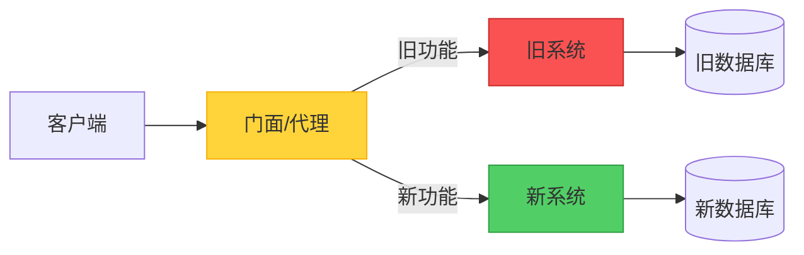
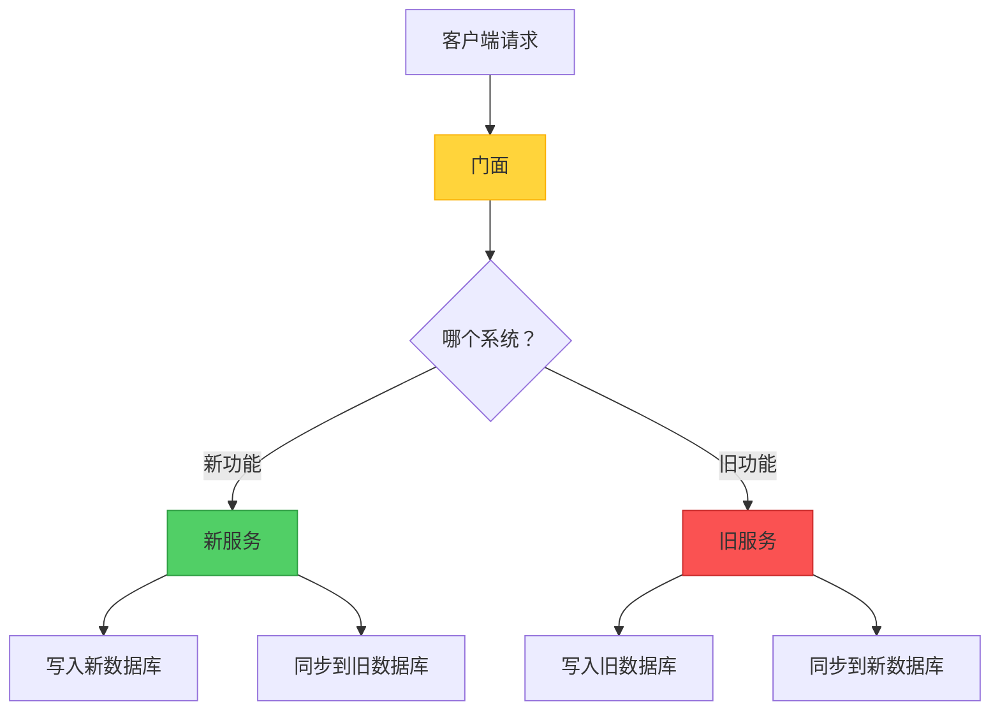

当面对一个难以维护的旧系统时，从头重写一切的诱惑很强烈。然而，历史告诉我们，"大爆炸"式的重写往往会惨败。Strangler Fig 模式提供了一个更务实的方法：逐步替换旧系统的每一部分，直到什么都不剩。

但这里有一个有趣的问题：Strangler Fig 真的是传统意义上的"模式"，还是更准确地说是一种迁移"策略"？让我们探索实际实现和这个哲学区别。

## 起源故事

这个名字来自热带雨林中的绞杀榕树。这些树以种子的形式沉积在宿主树上开始生命。随着它们生长，它们将根向下延伸到地面，并逐渐包围宿主树。最终，宿主树死亡并分解，留下无花果树独立站立——这是系统迁移的完美隐喻。

## 核心概念

Strangler Fig 提供了一种增量的现代化方法。与其一次性替换整个系统，你可以：

1. **引入门面（代理）**，位于客户端和旧系统之间
2. **逐步在现代系统中实现新功能**
3. **智能路由请求**在新旧系统之间
4. **停用旧系统**，一旦所有功能都已迁移
5. **移除门面**，当迁移完成时



## 运作方式：实际旅程

让我们走过一个具体的例子：将电子商务平台从单体架构迁移到微服务。

### 阶段 1：建立门面

第一步是引入一个可以引导流量的路由层：

```javascript
class StranglerFacade {
  constructor(legacySystem, newSystem) {
    this.legacy = legacySystem;
    this.modern = newSystem;
    this.featureFlags = new FeatureToggleService();
  }
  
  async handleRequest(request) {
    const route = this.determineRoute(request);
    
    if (route === 'modern') {
      return await this.modern.handle(request);
    }
    
    return await this.legacy.handle(request);
  }
  
  determineRoute(request) {
    // 基于功能标志、用户区段或端点进行路由
    if (this.featureFlags.isEnabled('new-checkout', request.user)) {
      return 'modern';
    }
    
    if (request.path.startsWith('/api/v2/')) {
      return 'modern';
    }
    
    return 'legacy';
  }
}
```

### 阶段 2：增量迁移

从低风险、高价值的功能开始：

```javascript
// 第 1 周：迁移产品搜索
app.get('/search', async (req, res) => {
  // 具有更好性能的新搜索服务
  const results = await newSearchService.search(req.query);
  res.json(results);
});

// 第 4 周：迁移用户认证
app.post('/login', async (req, res) => {
  // 具有现代安全性的新认证服务
  const token = await newAuthService.authenticate(req.body);
  res.json({ token });
});

// 第 8 周：迁移结账流程
app.post('/checkout', async (req, res) => {
  // 具有改进 UX 的新结账
  const order = await newCheckoutService.process(req.body);
  res.json(order);
});
```

### 阶段 3：处理数据迁移

最棘手的方面之一是管理两个系统之间的数据：



```javascript
class DataSyncService {
  async syncOrder(order) {
    // 写入新系统
    await newDatabase.orders.create(order);
    
    // 同步到仍在使用它的旧功能
    await legacyDatabase.orders.create(this.transformToLegacy(order));
  }
  
  async migrateHistoricalData() {
    // 批次迁移现有数据
    const legacyOrders = await legacyDatabase.orders.findAll();
    
    for (const order of legacyOrders) {
      const modernOrder = this.transformToModern(order);
      await newDatabase.orders.create(modernOrder);
    }
  }
}
```

### 阶段 4：完成迁移

一旦所有功能都已迁移：

```javascript
// 之前：门面路由
app.use(stranglerFacade.middleware());

// 之后：直接路由到新系统
app.use(newSystem.middleware());

// 停用旧系统
await legacySystem.shutdown();
await legacyDatabase.archive();
```

## 模式 vs. 策略：哲学辩论

这里事情变得有趣了。Strangler Fig 是"模式"还是"策略"？

### "模式"的论点

!!!info "📐 模式特征"
    **结构化解决方案**：Strangler Fig 定义了一个特定的结构（门面 + 双系统），解决了一个反复出现的问题。
    
    **可重用模板**：这种方法可以应用于不同的技术和领域。
    
    **命名解决方案**：它为讨论增量迁移提供了共同的词汇。

传统的设计模式（如四人帮书中的那些）描述了反复出现问题的结构化解决方案。Strangler Fig 符合这个定义——它规定了一个特定的架构结构（门面）和一个清晰的流程。

### "策略"的论点

!!!tip "🎯 策略特征"
    **高层次方法**：它更多的是关于整体迁移哲学，而不是具体的实现细节。
    
    **灵活实现**：实际结构根据上下文有很大差异。
    
    **流程导向**：它描述了一系列随时间推移的行动，而不仅仅是静态结构。

策略是实现目标的更广泛方法。Strangler Fig 从根本上是关于*如何*进行迁移——关于风险管理和变更管理的策略决策。

### 结论：两者兼具

!!!success "✅ 混合分类"
    Strangler Fig 是一个**策略模式**——它结合了模式的结构特异性和策略的高层次指导。
    
    它是一个模式，因为它规定了特定的架构组件（门面）。
    
    它是一个策略，因为它指导了系统随时间演化的整体方法。

也许这种区别不如它提供的价值重要。无论你称它为模式还是策略，Strangler Fig 都为软件工程最困难的问题之一提供了经过验证的方法：安全地演化旧系统。

## 实现考量

### 1. 门面设计

门面是你的控制中心。仔细设计它：

```javascript
class IntelligentFacade {
  constructor() {
    this.router = new SmartRouter();
    this.monitor = new MigrationMonitor();
    this.fallback = new FallbackHandler();
  }
  
  async route(request) {
    try {
      const target = this.router.determineTarget(request);
      const response = await target.handle(request);
      
      // 监控成功率
      this.monitor.recordSuccess(target.name);
      
      return response;
    } catch (error) {
      // 错误时回退到旧系统
      this.monitor.recordFailure(target.name);
      return await this.fallback.handleWithLegacy(request);
    }
  }
}
```

!!!warning "⚠️ 门面风险"
    **单点故障**：门面成为关键基础设施。确保高可用性。
    
    **性能瓶颈**：每个请求都通过门面。仔细优化。
    
    **复杂性增长**：随着迁移进展，路由逻辑可能变得复杂。保持可维护性。

### 2. 功能切换策略

使用功能标志来控制迁移：

```javascript
class FeatureToggleService {
  isEnabled(feature, context) {
    // 逐步推出
    if (feature === 'new-checkout') {
      // 10% 的用户
      if (this.isInPercentage(context.userId, 10)) {
        return true;
      }
      
      // Beta 测试者
      if (context.user.isBetaTester) {
        return true;
      }
      
      // 特定用户区段
      if (context.user.segment === 'premium') {
        return true;
      }
    }
    
    return false;
  }
  
  isInPercentage(userId, percentage) {
    const hash = this.hashUserId(userId);
    return (hash % 100) < percentage;
  }
}
```

### 3. 数据一致性管理

处理双写问题：

```javascript
class ConsistencyManager {
  async writeWithConsistency(data) {
    // 首先写入新系统
    const newResult = await newSystem.write(data);
    
    try {
      // 同步到旧系统
      await legacySystem.write(this.transform(data));
    } catch (error) {
      // 排队重试
      await this.retryQueue.add({
        data,
        target: 'legacy',
        timestamp: Date.now()
      });
    }
    
    return newResult;
  }
  
  async reconcile() {
    // 定期一致性检查
    const discrepancies = await this.findDiscrepancies();
    
    for (const item of discrepancies) {
      await this.resolveConflict(item);
    }
  }
}
```

## 何时使用此方法

### 理想场景

!!!success "✅ 完美使用案例"
    **大型旧系统**：当系统太大或太复杂而无法完全重写时。
    
    **需要业务连续性**：当你无法承受停机或服务中断时。
    
    **需求不确定**：当你不完全确定新系统应该是什么样子时。
    
    **风险缓解**：当你需要最小化迁移失败的风险时。

### 真实世界范例

**电子商务平台迁移**
- 从产品目录开始
- 移至搜索功能
- 迁移结账流程
- 最后替换订单管理

**银行系统现代化**
- 从客户门户开始
- 迁移账户服务
- 更新交易处理
- 最后替换核心银行系统

**内容管理系统**
- 现代化内容交付
- 升级编辑工具
- 迁移资产管理
- 替换工作流程引擎

### 何时避免

!!!danger "❌ 不适合的情况"
    **小型系统**：当完全重写更简单、更快时。
    
    **无拦截点**：当你无法引入门面或代理层时。
    
    **紧急替换**：当旧系统必须因合规或安全原因立即停用时。
    
    **简单架构**：当系统足够简单，增量迁移会增加不必要的复杂性时。

## 架构质量属性

### 可靠性

Strangler Fig 在迁移期间提高可靠性：

- **逐步引入风险**：每个变更都很小且可逆
- **回退能力**：如果新功能失败，可以恢复到旧系统
- **持续运作**：系统在整个迁移过程中保持功能

```javascript
class ReliabilityHandler {
  async handleWithFallback(request) {
    try {
      return await newSystem.handle(request);
    } catch (error) {
      logger.warn('新系统失败，回退中', error);
      return await legacySystem.handle(request);
    }
  }
}
```

### 成本优化

虽然运行双系统有成本，但这种方法优化了长期投资：


{
  "title": {
    "text": "成本比较：大爆炸 vs. Strangler Fig"
  },
  "tooltip": {
    "trigger": "axis"
  },
  "legend": {
    "data": ["大爆炸重写", "Strangler Fig"]
  },
  "xAxis": {
    "type": "category",
    "data": ["第 1 个月", "第 3 个月", "第 6 个月", "第 9 个月", "第 12 个月"]
  },
  "yAxis": {
    "type": "value",
    "name": "成本"
  },
  "series": [
    {
      "name": "大爆炸重写",
      "type": "line",
      "data": [100, 100, 100, 100, 150],
      "itemStyle": {
        "color": "#fa5252"
      },
      "lineStyle": {
        "type": "dashed"
      }
    },
    {
      "name": "Strangler Fig",
      "type": "line",
      "data": [20, 40, 60, 80, 100],
      "itemStyle": {
        "color": "#51cf66"
      }
    }
  ]
}


**成本优势：**
- 随时间分散投资
- 增量交付价值
- 避免"全有或全无"风险
- 最大化现有系统的使用

### 卓越运营

增量方法支持持续改进：

- **小型、安全的变更**：每个迁移步骤都是可管理的
- **学习机会**：早期迁移为后期提供信息
- **团队适应**：团队逐步建立新技术的专业知识
- **持续交付**：在迁移期间可以发布新功能

## 完整实现范例

这是一个 API 网关门面的全面实现：

```javascript
class StranglerFigGateway {
  constructor(config) {
    this.legacy = new LegacySystemClient(config.legacy);
    this.modern = new ModernSystemClient(config.modern);
    this.features = new FeatureToggleService(config.features);
    this.monitor = new MonitoringService(config.monitoring);
    this.cache = new CacheService(config.cache);
  }
  
  async handleRequest(req, res) {
    const startTime = Date.now();
    const route = this.determineRoute(req);
    
    try {
      let response;
      
      // 首先检查缓存
      const cacheKey = this.getCacheKey(req);
      const cached = await this.cache.get(cacheKey);
      
      if (cached) {
        response = cached;
      } else {
        // 路由到适当的系统
        if (route.target === 'modern') {
          response = await this.modern.handle(req);
        } else {
          response = await this.legacy.handle(req);
        }
        
        // 如果适当则缓存
        if (route.cacheable) {
          await this.cache.set(cacheKey, response, route.ttl);
        }
      }
      
      // 记录指标
      this.monitor.recordRequest({
        target: route.target,
        duration: Date.now() - startTime,
        status: 'success'
      });
      
      return res.json(response);
      
    } catch (error) {
      // 回退逻辑
      if (route.target === 'modern' && route.fallbackEnabled) {
        try {
          const fallbackResponse = await this.legacy.handle(req);
          
          this.monitor.recordRequest({
            target: 'legacy-fallback',
            duration: Date.now() - startTime,
            status: 'fallback'
          });
          
          return res.json(fallbackResponse);
        } catch (fallbackError) {
          this.monitor.recordError(fallbackError);
          return res.status(500).json({ error: '服务不可用' });
        }
      }
      
      this.monitor.recordError(error);
      return res.status(500).json({ error: error.message });
    }
  }
  
  determineRoute(req) {
    // 基于 API 版本的路由
    if (req.path.startsWith('/api/v2/')) {
      return {
        target: 'modern',
        fallbackEnabled: true,
        cacheable: true,
        ttl: 300
      };
    }
    
    // 基于功能标志的路由
    const feature = this.extractFeature(req.path);
    if (this.features.isEnabled(feature, req.user)) {
      return {
        target: 'modern',
        fallbackEnabled: true,
        cacheable: false
      };
    }
    
    // 默认为旧系统
    return {
      target: 'legacy',
      fallbackEnabled: false,
      cacheable: true,
      ttl: 600
    };
  }
  
  extractFeature(path) {
    const pathMap = {
      '/products': 'new-catalog',
      '/search': 'new-search',
      '/checkout': 'new-checkout',
      '/orders': 'new-orders'
    };
    
    for (const [prefix, feature] of Object.entries(pathMap)) {
      if (path.startsWith(prefix)) {
        return feature;
      }
    }
    
    return null;
  }
  
  getCacheKey(req) {
    return `${req.method}:${req.path}:${JSON.stringify(req.query)}`;
  }
}
```

## 迁移监控

追踪进度和健康状况：

```javascript
class MigrationDashboard {
  async getMetrics() {
    return {
      trafficDistribution: await this.getTrafficSplit(),
      featureMigrationStatus: await this.getFeatureStatus(),
      errorRates: await this.getErrorRates(),
      performanceComparison: await this.getPerformanceMetrics()
    };
  }
  
  async getTrafficSplit() {
    const total = await this.monitor.getTotalRequests();
    const modern = await this.monitor.getModernRequests();
    
    return {
      legacy: ((total - modern) / total * 100).toFixed(1),
      modern: (modern / total * 100).toFixed(1)
    };
  }
  
  async getFeatureStatus() {
    return {
      completed: ['product-catalog', 'search', 'user-auth'],
      inProgress: ['checkout', 'order-management'],
      pending: ['inventory', 'reporting', 'admin-panel']
    };
  }
}
```

## 权衡与挑战

像任何架构方法一样，Strangler Fig 涉及权衡：

!!!warning "⚠️ 需要解决的挑战"
    **双系统开销**：同时运行两个系统会增加基础设施成本和运营复杂性。
    
    **数据同步**：在系统之间保持数据一致性具有挑战性且容易出错。
    
    **延长时间线**：迁移比重写需要更长时间，这可能让利益相关者感到沮丧。
    
    **门面复杂性**：随着迁移进展，路由层可能变得复杂且难以维护。

**缓解策略：**
- 设定明确的迁移里程碑并庆祝进展
- 自动化数据同步和验证
- 使用清晰的路由规则保持门面逻辑简单
- 监控成本并优化基础设施使用
- 从一开始就计划移除门面

## 相关模式和策略

Strangler Fig 与其他架构方法配合良好：

- **Branch by Abstraction**：类似的增量方法，但在代码层级而非系统层级
- **Parallel Run**：同时运行两个系统以验证新系统行为
- **Blue-Green Deployment**：在迁移完成时用于最终切换
- **Feature Toggles**：对于控制哪些功能路由到新系统至关重要
- **Anti-Corruption Layer**：保护新系统免受旧系统设计决策的影响

## 结论

无论你称它为模式还是策略，Strangler Fig 都为软件工程最具挑战性的问题之一提供了务实的方法：在不中断业务运作的情况下演化旧系统。

关键见解：

- **增量胜过革命**：小型、安全的变更降低风险
- **门面实现灵活性**：代理层让你控制迁移
- **业务连续性至关重要**：系统在整个过程中保持运作
- **边做边学**：早期迁移为后期决策提供信息

使用 Strangler Fig 取得成功需要耐心、纪律和清晰的沟通。这不是最快的方法，但通常是现代化复杂系统最安全、最可靠的方式。

模式 vs. 策略的辩论最终是学术性的。重要的是 Strangler Fig 为团队提供了一个经过验证的框架，让他们有信心地处理旧系统迁移。它将一个压倒性的挑战转化为一系列可管理的步骤，每个步骤都在朝着现代化、可维护系统的最终目标前进的同时交付价值。

## 参考资料

- [Martin Fowler: StranglerFigApplication](https://martinfowler.com/bliki/StranglerFigApplication.html)
- [Strangler Fig Pattern](https://learn.microsoft.com/en-us/azure/architecture/patterns/strangler-fig)
- [Sam Newman: Monolith to Microservices](https://samnewman.io/books/monolith-to-microservices/)
