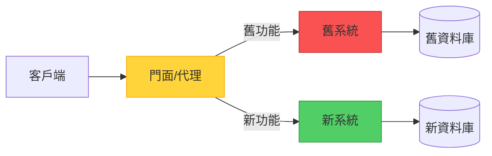
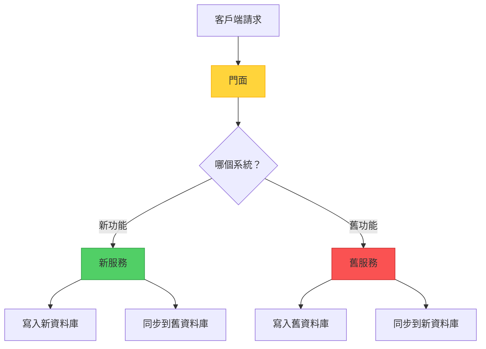

當面對一個難以維護的舊系統時，從頭重寫一切的誘惑很強烈。然而，歷史告訴我們，「大爆炸」式的重寫往往會慘敗。Strangler Fig 模式提供了一個更務實的方法：逐步替換舊系統的每一部分，直到什麼都不剩。

但這裡有一個有趣的問題：Strangler Fig 真的是傳統意義上的「模式」，還是更準確地說是一種遷移「策略」？讓我們探索實際實現和這個哲學區別。

## 起源故事

這個名字來自熱帶雨林中的絞殺榕樹。這些樹以種子的形式沉積在宿主樹上開始生命。隨著它們生長，它們將根向下延伸到地面，並逐漸包圍宿主樹。最終，宿主樹死亡並分解，留下無花果樹獨立站立——這是系統遷移的完美隱喻。

## 核心概念

Strangler Fig 提供了一種增量的現代化方法。與其一次性替換整個系統，你可以：

1. **引入門面（代理）**，位於客戶端和舊系統之間
2. **逐步在現代系統中實現新功能**
3. **智能路由請求**在新舊系統之間
4. **停用舊系統**，一旦所有功能都已遷移
5. **移除門面**，當遷移完成時



## 運作方式：實際旅程

讓我們走過一個具體的例子：將電子商務平台從單體架構遷移到微服務。

### 階段 1：建立門面

第一步是引入一個可以引導流量的路由層：

```javascript
class StranglerFacade {
  constructor(legacySystem, newSystem) {
    this.legacy = legacySystem;
    this.modern = newSystem;
    this.featureFlags = new FeatureToggleService();
  }
  
  async handleRequest(request) {
    const route = this.determineRoute(request);
    
    if (route === 'modern') {
      return await this.modern.handle(request);
    }
    
    return await this.legacy.handle(request);
  }
  
  determineRoute(request) {
    // 基於功能標誌、使用者區段或端點進行路由
    if (this.featureFlags.isEnabled('new-checkout', request.user)) {
      return 'modern';
    }
    
    if (request.path.startsWith('/api/v2/')) {
      return 'modern';
    }
    
    return 'legacy';
  }
}
```

### 階段 2：增量遷移

從低風險、高價值的功能開始：

```javascript
// 第 1 週：遷移產品搜尋
app.get('/search', async (req, res) => {
  // 具有更好性能的新搜尋服務
  const results = await newSearchService.search(req.query);
  res.json(results);
});

// 第 4 週：遷移使用者認證
app.post('/login', async (req, res) => {
  // 具有現代安全性的新認證服務
  const token = await newAuthService.authenticate(req.body);
  res.json({ token });
});

// 第 8 週：遷移結帳流程
app.post('/checkout', async (req, res) => {
  // 具有改進 UX 的新結帳
  const order = await newCheckoutService.process(req.body);
  res.json(order);
});
```

### 階段 3：處理資料遷移

最棘手的方面之一是管理兩個系統之間的資料：



```javascript
class DataSyncService {
  async syncOrder(order) {
    // 寫入新系統
    await newDatabase.orders.create(order);
    
    // 同步到仍在使用它的舊功能
    await legacyDatabase.orders.create(this.transformToLegacy(order));
  }
  
  async migrateHistoricalData() {
    // 批次遷移現有資料
    const legacyOrders = await legacyDatabase.orders.findAll();
    
    for (const order of legacyOrders) {
      const modernOrder = this.transformToModern(order);
      await newDatabase.orders.create(modernOrder);
    }
  }
}
```

### 階段 4：完成遷移

一旦所有功能都已遷移：

```javascript
// 之前：門面路由
app.use(stranglerFacade.middleware());

// 之後：直接路由到新系統
app.use(newSystem.middleware());

// 停用舊系統
await legacySystem.shutdown();
await legacyDatabase.archive();
```

## 模式 vs. 策略：哲學辯論

這裡事情變得有趣了。Strangler Fig 是「模式」還是「策略」？

### 「模式」的論點

!!!info "📐 模式特徵"
    **結構化解決方案**：Strangler Fig 定義了一個特定的結構（門面 + 雙系統），解決了一個反覆出現的問題。
    
    **可重用範本**：這種方法可以應用於不同的技術和領域。
    
    **命名解決方案**：它為討論增量遷移提供了共同的詞彙。

傳統的設計模式（如四人幫書中的那些）描述了反覆出現問題的結構化解決方案。Strangler Fig 符合這個定義——它規定了一個特定的架構結構（門面）和一個清晰的流程。

### 「策略」的論點

!!!tip "🎯 策略特徵"
    **高層次方法**：它更多的是關於整體遷移哲學，而不是具體的實現細節。
    
    **靈活實現**：實際結構根據上下文有很大差異。
    
    **流程導向**：它描述了一系列隨時間推移的行動，而不僅僅是靜態結構。

策略是實現目標的更廣泛方法。Strangler Fig 從根本上是關於*如何*進行遷移——關於風險管理和變更管理的策略決策。

### 結論：兩者兼具

!!!success "✅ 混合分類"
    Strangler Fig 是一個**策略模式**——它結合了模式的結構特異性和策略的高層次指導。
    
    它是一個模式，因為它規定了特定的架構組件（門面）。
    
    它是一個策略，因為它指導了系統隨時間演化的整體方法。

也許這種區別不如它提供的價值重要。無論你稱它為模式還是策略，Strangler Fig 都為軟體工程最困難的問題之一提供了經過驗證的方法：安全地演化舊系統。

## 實現考量

### 1. 門面設計

門面是你的控制中心。仔細設計它：

```javascript
class IntelligentFacade {
  constructor() {
    this.router = new SmartRouter();
    this.monitor = new MigrationMonitor();
    this.fallback = new FallbackHandler();
  }
  
  async route(request) {
    try {
      const target = this.router.determineTarget(request);
      const response = await target.handle(request);
      
      // 監控成功率
      this.monitor.recordSuccess(target.name);
      
      return response;
    } catch (error) {
      // 錯誤時回退到舊系統
      this.monitor.recordFailure(target.name);
      return await this.fallback.handleWithLegacy(request);
    }
  }
}
```

!!!warning "⚠️ 門面風險"
    **單點故障**：門面成為關鍵基礎設施。確保高可用性。
    
    **性能瓶頸**：每個請求都通過門面。仔細優化。
    
    **複雜性增長**：隨著遷移進展，路由邏輯可能變得複雜。保持可維護性。

### 2. 功能切換策略

使用功能標誌來控制遷移：

```javascript
class FeatureToggleService {
  isEnabled(feature, context) {
    // 逐步推出
    if (feature === 'new-checkout') {
      // 10% 的使用者
      if (this.isInPercentage(context.userId, 10)) {
        return true;
      }
      
      // Beta 測試者
      if (context.user.isBetaTester) {
        return true;
      }
      
      // 特定使用者區段
      if (context.user.segment === 'premium') {
        return true;
      }
    }
    
    return false;
  }
  
  isInPercentage(userId, percentage) {
    const hash = this.hashUserId(userId);
    return (hash % 100) < percentage;
  }
}
```

### 3. 資料一致性管理

處理雙寫問題：

```javascript
class ConsistencyManager {
  async writeWithConsistency(data) {
    // 首先寫入新系統
    const newResult = await newSystem.write(data);
    
    try {
      // 同步到舊系統
      await legacySystem.write(this.transform(data));
    } catch (error) {
      // 排隊重試
      await this.retryQueue.add({
        data,
        target: 'legacy',
        timestamp: Date.now()
      });
    }
    
    return newResult;
  }
  
  async reconcile() {
    // 定期一致性檢查
    const discrepancies = await this.findDiscrepancies();
    
    for (const item of discrepancies) {
      await this.resolveConflict(item);
    }
  }
}
```

## 何時使用此方法

### 理想場景

!!!success "✅ 完美使用案例"
    **大型舊系統**：當系統太大或太複雜而無法完全重寫時。
    
    **需要業務連續性**：當你無法承受停機或服務中斷時。
    
    **需求不確定**：當你不完全確定新系統應該是什麼樣子時。
    
    **風險緩解**：當你需要最小化遷移失敗的風險時。

### 真實世界範例

**電子商務平台遷移**
- 從產品目錄開始
- 移至搜尋功能
- 遷移結帳流程
- 最後替換訂單管理

**銀行系統現代化**
- 從客戶入口網站開始
- 遷移帳戶服務
- 更新交易處理
- 最後替換核心銀行系統

**內容管理系統**
- 現代化內容交付
- 升級編輯工具
- 遷移資產管理
- 替換工作流程引擎

### 何時避免

!!!danger "❌ 不適合的情況"
    **小型系統**：當完全重寫更簡單、更快時。
    
    **無攔截點**：當你無法引入門面或代理層時。
    
    **緊急替換**：當舊系統必須因合規或安全原因立即停用時。
    
    **簡單架構**：當系統足夠簡單，增量遷移會增加不必要的複雜性時。

## 架構品質屬性

### 可靠性

Strangler Fig 在遷移期間提高可靠性：

- **逐步引入風險**：每個變更都很小且可逆
- **回退能力**：如果新功能失敗，可以恢復到舊系統
- **持續運作**：系統在整個遷移過程中保持功能

```javascript
class ReliabilityHandler {
  async handleWithFallback(request) {
    try {
      return await newSystem.handle(request);
    } catch (error) {
      logger.warn('新系統失敗，回退中', error);
      return await legacySystem.handle(request);
    }
  }
}
```

### 成本優化

雖然運行雙系統有成本，但這種方法優化了長期投資：


{
  "title": {
    "text": "成本比較：大爆炸 vs. Strangler Fig"
  },
  "tooltip": {
    "trigger": "axis"
  },
  "legend": {
    "data": ["大爆炸重寫", "Strangler Fig"]
  },
  "xAxis": {
    "type": "category",
    "data": ["第 1 個月", "第 3 個月", "第 6 個月", "第 9 個月", "第 12 個月"]
  },
  "yAxis": {
    "type": "value",
    "name": "成本"
  },
  "series": [
    {
      "name": "大爆炸重寫",
      "type": "line",
      "data": [100, 100, 100, 100, 150],
      "itemStyle": {
        "color": "#fa5252"
      },
      "lineStyle": {
        "type": "dashed"
      }
    },
    {
      "name": "Strangler Fig",
      "type": "line",
      "data": [20, 40, 60, 80, 100],
      "itemStyle": {
        "color": "#51cf66"
      }
    }
  ]
}


**成本優勢：**
- 隨時間分散投資
- 增量交付價值
- 避免「全有或全無」風險
- 最大化現有系統的使用

### 卓越營運

增量方法支持持續改進：

- **小型、安全的變更**：每個遷移步驟都是可管理的
- **學習機會**：早期遷移為後期提供資訊
- **團隊適應**：團隊逐步建立新技術的專業知識
- **持續交付**：在遷移期間可以發布新功能

## 完整實現範例

這是一個 API 閘道門面的全面實現：

```javascript
class StranglerFigGateway {
  constructor(config) {
    this.legacy = new LegacySystemClient(config.legacy);
    this.modern = new ModernSystemClient(config.modern);
    this.features = new FeatureToggleService(config.features);
    this.monitor = new MonitoringService(config.monitoring);
    this.cache = new CacheService(config.cache);
  }
  
  async handleRequest(req, res) {
    const startTime = Date.now();
    const route = this.determineRoute(req);
    
    try {
      let response;
      
      // 首先檢查快取
      const cacheKey = this.getCacheKey(req);
      const cached = await this.cache.get(cacheKey);
      
      if (cached) {
        response = cached;
      } else {
        // 路由到適當的系統
        if (route.target === 'modern') {
          response = await this.modern.handle(req);
        } else {
          response = await this.legacy.handle(req);
        }
        
        // 如果適當則快取
        if (route.cacheable) {
          await this.cache.set(cacheKey, response, route.ttl);
        }
      }
      
      // 記錄指標
      this.monitor.recordRequest({
        target: route.target,
        duration: Date.now() - startTime,
        status: 'success'
      });
      
      return res.json(response);
      
    } catch (error) {
      // 回退邏輯
      if (route.target === 'modern' && route.fallbackEnabled) {
        try {
          const fallbackResponse = await this.legacy.handle(req);
          
          this.monitor.recordRequest({
            target: 'legacy-fallback',
            duration: Date.now() - startTime,
            status: 'fallback'
          });
          
          return res.json(fallbackResponse);
        } catch (fallbackError) {
          this.monitor.recordError(fallbackError);
          return res.status(500).json({ error: '服務不可用' });
        }
      }
      
      this.monitor.recordError(error);
      return res.status(500).json({ error: error.message });
    }
  }
  
  determineRoute(req) {
    // 基於 API 版本的路由
    if (req.path.startsWith('/api/v2/')) {
      return {
        target: 'modern',
        fallbackEnabled: true,
        cacheable: true,
        ttl: 300
      };
    }
    
    // 基於功能標誌的路由
    const feature = this.extractFeature(req.path);
    if (this.features.isEnabled(feature, req.user)) {
      return {
        target: 'modern',
        fallbackEnabled: true,
        cacheable: false
      };
    }
    
    // 預設為舊系統
    return {
      target: 'legacy',
      fallbackEnabled: false,
      cacheable: true,
      ttl: 600
    };
  }
  
  extractFeature(path) {
    const pathMap = {
      '/products': 'new-catalog',
      '/search': 'new-search',
      '/checkout': 'new-checkout',
      '/orders': 'new-orders'
    };
    
    for (const [prefix, feature] of Object.entries(pathMap)) {
      if (path.startsWith(prefix)) {
        return feature;
      }
    }
    
    return null;
  }
  
  getCacheKey(req) {
    return `${req.method}:${req.path}:${JSON.stringify(req.query)}`;
  }
}
```

## 遷移監控

追蹤進度和健康狀況：

```javascript
class MigrationDashboard {
  async getMetrics() {
    return {
      trafficDistribution: await this.getTrafficSplit(),
      featureMigrationStatus: await this.getFeatureStatus(),
      errorRates: await this.getErrorRates(),
      performanceComparison: await this.getPerformanceMetrics()
    };
  }
  
  async getTrafficSplit() {
    const total = await this.monitor.getTotalRequests();
    const modern = await this.monitor.getModernRequests();
    
    return {
      legacy: ((total - modern) / total * 100).toFixed(1),
      modern: (modern / total * 100).toFixed(1)
    };
  }
  
  async getFeatureStatus() {
    return {
      completed: ['product-catalog', 'search', 'user-auth'],
      inProgress: ['checkout', 'order-management'],
      pending: ['inventory', 'reporting', 'admin-panel']
    };
  }
}
```

## 權衡與挑戰

像任何架構方法一樣，Strangler Fig 涉及權衡：

!!!warning "⚠️ 需要解決的挑戰"
    **雙系統開銷**：同時運行兩個系統會增加基礎設施成本和營運複雜性。
    
    **資料同步**：在系統之間保持資料一致性具有挑戰性且容易出錯。
    
    **延長時間線**：遷移比重寫需要更長時間，這可能讓利害關係人感到沮喪。
    
    **門面複雜性**：隨著遷移進展，路由層可能變得複雜且難以維護。

**緩解策略：**
- 設定明確的遷移里程碑並慶祝進展
- 自動化資料同步和驗證
- 使用清晰的路由規則保持門面邏輯簡單
- 監控成本並優化基礎設施使用
- 從一開始就計劃移除門面

## 相關模式和策略

Strangler Fig 與其他架構方法配合良好：

- **Branch by Abstraction**：類似的增量方法，但在程式碼層級而非系統層級
- **Parallel Run**：同時運行兩個系統以驗證新系統行為
- **Blue-Green Deployment**：在遷移完成時用於最終切換
- **Feature Toggles**：對於控制哪些功能路由到新系統至關重要
- **Anti-Corruption Layer**：保護新系統免受舊系統設計決策的影響

## 結論

無論你稱它為模式還是策略，Strangler Fig 都為軟體工程最具挑戰性的問題之一提供了務實的方法：在不中斷業務運作的情況下演化舊系統。

關鍵見解：

- **增量勝過革命**：小型、安全的變更降低風險
- **門面實現靈活性**：代理層讓你控制遷移
- **業務連續性至關重要**：系統在整個過程中保持運作
- **邊做邊學**：早期遷移為後期決策提供資訊

使用 Strangler Fig 取得成功需要耐心、紀律和清晰的溝通。這不是最快的方法，但通常是現代化複雜系統最安全、最可靠的方式。

模式 vs. 策略的辯論最終是學術性的。重要的是 Strangler Fig 為團隊提供了一個經過驗證的框架，讓他們有信心地處理舊系統遷移。它將一個壓倒性的挑戰轉化為一系列可管理的步驟，每個步驟都在朝著現代化、可維護系統的最終目標前進的同時交付價值。

## 參考資料

- [Martin Fowler: StranglerFigApplication](https://martinfowler.com/bliki/StranglerFigApplication.html)
- [Strangler Fig Pattern](https://learn.microsoft.com/en-us/azure/architecture/patterns/strangler-fig)
- [Sam Newman: Monolith to Microservices](https://samnewman.io/books/monolith-to-microservices/)
