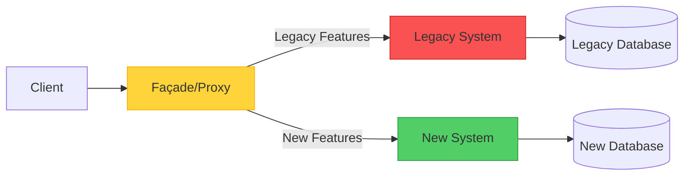
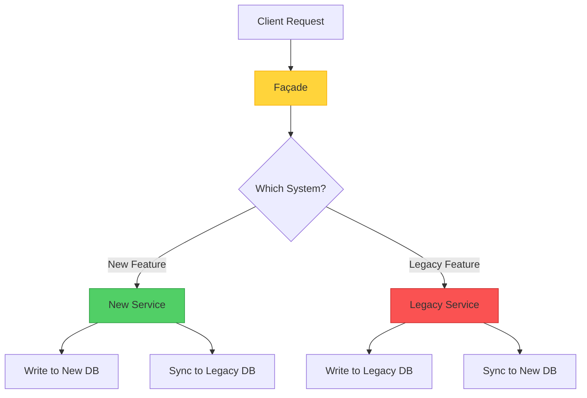

When faced with a legacy system that's become difficult to maintain, the temptation to rewrite everything from scratch is strong. However, history has taught us that "big bang" rewrites often fail spectacularly. The Strangler Fig pattern offers a more pragmatic approach: gradually replace the old system piece by piece until nothing remains.

But here's an interesting question: Is Strangler Fig really a "pattern" in the traditional sense, or is it more accurately described as a migration "strategy"? Let's explore both the practical implementation and this philosophical distinction.

## The Origin Story

The name comes from strangler fig trees found in tropical rainforests. These trees start life as seeds deposited on host trees. As they grow, they send roots down to the ground and gradually envelope the host tree. Eventually, the host tree dies and decomposes, leaving the fig tree standing in its place—a perfect metaphor for system migration.

## The Core Concept

Strangler Fig provides an incremental approach to modernization. Instead of replacing an entire system at once, you:

1. **Introduce a façade (proxy)** that sits between clients and the legacy system
2. **Gradually implement new functionality** in a modern system
3. **Route requests intelligently** between old and new systems
4. **Decommission the legacy system** once all functionality is migrated
5. **Remove the façade** when migration is complete



## How It Works: A Practical Journey

Let's walk through a concrete example: migrating an e-commerce platform from a monolithic architecture to microservices.

### Phase 1: Establish the Façade

The first step is introducing a routing layer that can direct traffic:

```javascript
class StranglerFacade {
  constructor(legacySystem, newSystem) {
    this.legacy = legacySystem;
    this.modern = newSystem;
    this.featureFlags = new FeatureToggleService();
  }
  
  async handleRequest(request) {
    const route = this.determineRoute(request);
    
    if (route === 'modern') {
      return await this.modern.handle(request);
    }
    
    return await this.legacy.handle(request);
  }
  
  determineRoute(request) {
    // Route based on feature flags, user segments, or endpoints
    if (this.featureFlags.isEnabled('new-checkout', request.user)) {
      return 'modern';
    }
    
    if (request.path.startsWith('/api/v2/')) {
      return 'modern';
    }
    
    return 'legacy';
  }
}
```

### Phase 2: Migrate Incrementally

Start with low-risk, high-value features:

```javascript
// Week 1: Migrate product search
app.get('/search', async (req, res) => {
  // New search service with better performance
  const results = await newSearchService.search(req.query);
  res.json(results);
});

// Week 4: Migrate user authentication
app.post('/login', async (req, res) => {
  // New auth service with modern security
  const token = await newAuthService.authenticate(req.body);
  res.json({ token });
});

// Week 8: Migrate checkout process
app.post('/checkout', async (req, res) => {
  // New checkout with improved UX
  const order = await newCheckoutService.process(req.body);
  res.json(order);
});
```

### Phase 3: Handle Data Migration

One of the trickiest aspects is managing data across both systems:



```javascript
class DataSyncService {
  async syncOrder(order) {
    // Write to new system
    await newDatabase.orders.create(order);
    
    // Sync to legacy for features still using it
    await legacyDatabase.orders.create(this.transformToLegacy(order));
  }
  
  async migrateHistoricalData() {
    // Batch migration of existing data
    const legacyOrders = await legacyDatabase.orders.findAll();
    
    for (const order of legacyOrders) {
      const modernOrder = this.transformToModern(order);
      await newDatabase.orders.create(modernOrder);
    }
  }
}
```

### Phase 4: Complete Migration

Once all functionality is migrated:

```javascript
// Before: Façade routing
app.use(stranglerFacade.middleware());

// After: Direct routing to new system
app.use(newSystem.middleware());

// Decommission legacy system
await legacySystem.shutdown();
await legacyDatabase.archive();
```

## Pattern vs. Strategy: A Philosophical Debate

Here's where things get interesting. Is Strangler Fig a "pattern" or a "strategy"?

### The Case for "Pattern"

!!!info "📐 Pattern Characteristics"
    **Structural Solution**: Strangler Fig defines a specific structure (façade + dual systems) that solves a recurring problem.
    
    **Reusable Template**: The approach can be applied across different technologies and domains.
    
    **Named Solution**: It provides a common vocabulary for discussing incremental migration.

Traditional design patterns (like those in the Gang of Four book) describe structural solutions to recurring problems. Strangler Fig fits this definition—it prescribes a specific architectural structure (the façade) and a clear process.

### The Case for "Strategy"

!!!tip "🎯 Strategy Characteristics"
    **High-Level Approach**: It's more about the overall migration philosophy than specific implementation details.
    
    **Flexible Implementation**: The actual structure varies significantly based on context.
    
    **Process-Oriented**: It describes a sequence of actions over time, not just a static structure.

Strategies are broader approaches to achieving goals. Strangler Fig is fundamentally about *how* to approach migration—a strategic decision about risk management and change management.

### The Verdict: It's Both

!!!success "✅ A Hybrid Classification"
    Strangler Fig is a **strategic pattern**—it combines the structural specificity of a pattern with the high-level guidance of a strategy.
    
    It's a pattern because it prescribes specific architectural components (the façade).
    
    It's a strategy because it guides the overall approach to system evolution over time.

Perhaps the distinction matters less than the value it provides. Whether you call it a pattern or strategy, Strangler Fig offers a proven approach to one of software engineering's hardest problems: safely evolving legacy systems.

## Implementation Considerations

### 1. Façade Design

The façade is your control center. Design it carefully:

```javascript
class IntelligentFacade {
  constructor() {
    this.router = new SmartRouter();
    this.monitor = new MigrationMonitor();
    this.fallback = new FallbackHandler();
  }
  
  async route(request) {
    try {
      const target = this.router.determineTarget(request);
      const response = await target.handle(request);
      
      // Monitor success rates
      this.monitor.recordSuccess(target.name);
      
      return response;
    } catch (error) {
      // Fallback to legacy on errors
      this.monitor.recordFailure(target.name);
      return await this.fallback.handleWithLegacy(request);
    }
  }
}
```

!!!warning "⚠️ Façade Risks"
    **Single Point of Failure**: The façade becomes critical infrastructure. Ensure high availability.
    
    **Performance Bottleneck**: Every request passes through the façade. Optimize carefully.
    
    **Complexity Growth**: As migration progresses, routing logic can become complex. Keep it maintainable.

### 2. Feature Toggle Strategy

Use feature flags to control migration:

```javascript
class FeatureToggleService {
  isEnabled(feature, context) {
    // Gradual rollout
    if (feature === 'new-checkout') {
      // 10% of users
      if (this.isInPercentage(context.userId, 10)) {
        return true;
      }
      
      // Beta testers
      if (context.user.isBetaTester) {
        return true;
      }
      
      // Specific user segments
      if (context.user.segment === 'premium') {
        return true;
      }
    }
    
    return false;
  }
  
  isInPercentage(userId, percentage) {
    const hash = this.hashUserId(userId);
    return (hash % 100) < percentage;
  }
}
```

### 3. Data Consistency Management

Handle the dual-write problem:

```javascript
class ConsistencyManager {
  async writeWithConsistency(data) {
    // Write to new system first
    const newResult = await newSystem.write(data);
    
    try {
      // Sync to legacy
      await legacySystem.write(this.transform(data));
    } catch (error) {
      // Queue for retry
      await this.retryQueue.add({
        data,
        target: 'legacy',
        timestamp: Date.now()
      });
    }
    
    return newResult;
  }
  
  async reconcile() {
    // Periodic consistency checks
    const discrepancies = await this.findDiscrepancies();
    
    for (const item of discrepancies) {
      await this.resolveConflict(item);
    }
  }
}
```

## When to Use This Approach

### Ideal Scenarios

!!!success "✅ Perfect Use Cases"
    **Large Legacy Systems**: When the system is too large or complex for a complete rewrite.
    
    **Business Continuity Required**: When you can't afford downtime or service interruption.
    
    **Uncertain Requirements**: When you're not entirely sure what the new system should look like.
    
    **Risk Mitigation**: When you need to minimize the risk of migration failure.

### Real-World Examples

**E-commerce Platform Migration**
- Start with product catalog
- Move to search functionality
- Migrate checkout process
- Finally replace order management

**Banking System Modernization**
- Begin with customer portal
- Migrate account services
- Update transaction processing
- Replace core banking last

**Content Management System**
- Modernize content delivery
- Upgrade authoring tools
- Migrate asset management
- Replace workflow engine

### When to Avoid

!!!danger "❌ Not Suitable When"
    **Small Systems**: When a complete rewrite is simpler and faster.
    
    **No Interception Point**: When you can't introduce a façade or proxy layer.
    
    **Urgent Replacement**: When the legacy system must be decommissioned immediately for compliance or security reasons.
    
    **Simple Architecture**: When the system is straightforward enough that incremental migration adds unnecessary complexity.

## Architectural Quality Attributes

### Reliability

Strangler Fig improves reliability during migration:

- **Gradual Risk Introduction**: Each change is small and reversible
- **Fallback Capability**: Can revert to legacy if new features fail
- **Continuous Operation**: System remains functional throughout migration

```javascript
class ReliabilityHandler {
  async handleWithFallback(request) {
    try {
      return await newSystem.handle(request);
    } catch (error) {
      logger.warn('New system failed, falling back', error);
      return await legacySystem.handle(request);
    }
  }
}
```

### Cost Optimization

While running dual systems has costs, the approach optimizes long-term investment:


{
  "title": {
    "text": "Cost Comparison: Big Bang vs. Strangler Fig"
  },
  "tooltip": {
    "trigger": "axis"
  },
  "legend": {
    "data": ["Big Bang Rewrite", "Strangler Fig"]
  },
  "xAxis": {
    "type": "category",
    "data": ["Month 1", "Month 3", "Month 6", "Month 9", "Month 12"]
  },
  "yAxis": {
    "type": "value",
    "name": "Cost"
  },
  "series": [
    {
      "name": "Big Bang Rewrite",
      "type": "line",
      "data": [100, 100, 100, 100, 150],
      "itemStyle": {
        "color": "#fa5252"
      },
      "lineStyle": {
        "type": "dashed"
      }
    },
    {
      "name": "Strangler Fig",
      "type": "line",
      "data": [20, 40, 60, 80, 100],
      "itemStyle": {
        "color": "#51cf66"
      }
    }
  ]
}


**Cost Benefits:**
- Spread investment over time
- Deliver value incrementally
- Avoid "all or nothing" risk
- Maximize use of existing system

### Operational Excellence

The incremental approach supports continuous improvement:

- **Small, Safe Changes**: Each migration step is manageable
- **Learning Opportunities**: Lessons from early migrations inform later ones
- **Team Adaptation**: Teams gradually build expertise with new technology
- **Continuous Delivery**: New features can be released during migration

## Complete Implementation Example

Here's a comprehensive implementation for an API gateway façade:

```javascript
class StranglerFigGateway {
  constructor(config) {
    this.legacy = new LegacySystemClient(config.legacy);
    this.modern = new ModernSystemClient(config.modern);
    this.features = new FeatureToggleService(config.features);
    this.monitor = new MonitoringService(config.monitoring);
    this.cache = new CacheService(config.cache);
  }
  
  async handleRequest(req, res) {
    const startTime = Date.now();
    const route = this.determineRoute(req);
    
    try {
      let response;
      
      // Check cache first
      const cacheKey = this.getCacheKey(req);
      const cached = await this.cache.get(cacheKey);
      
      if (cached) {
        response = cached;
      } else {
        // Route to appropriate system
        if (route.target === 'modern') {
          response = await this.modern.handle(req);
        } else {
          response = await this.legacy.handle(req);
        }
        
        // Cache if appropriate
        if (route.cacheable) {
          await this.cache.set(cacheKey, response, route.ttl);
        }
      }
      
      // Record metrics
      this.monitor.recordRequest({
        target: route.target,
        duration: Date.now() - startTime,
        status: 'success'
      });
      
      return res.json(response);
      
    } catch (error) {
      // Fallback logic
      if (route.target === 'modern' && route.fallbackEnabled) {
        try {
          const fallbackResponse = await this.legacy.handle(req);
          
          this.monitor.recordRequest({
            target: 'legacy-fallback',
            duration: Date.now() - startTime,
            status: 'fallback'
          });
          
          return res.json(fallbackResponse);
        } catch (fallbackError) {
          this.monitor.recordError(fallbackError);
          return res.status(500).json({ error: 'Service unavailable' });
        }
      }
      
      this.monitor.recordError(error);
      return res.status(500).json({ error: error.message });
    }
  }
  
  determineRoute(req) {
    // API version-based routing
    if (req.path.startsWith('/api/v2/')) {
      return {
        target: 'modern',
        fallbackEnabled: true,
        cacheable: true,
        ttl: 300
      };
    }
    
    // Feature flag-based routing
    const feature = this.extractFeature(req.path);
    if (this.features.isEnabled(feature, req.user)) {
      return {
        target: 'modern',
        fallbackEnabled: true,
        cacheable: false
      };
    }
    
    // Default to legacy
    return {
      target: 'legacy',
      fallbackEnabled: false,
      cacheable: true,
      ttl: 600
    };
  }
  
  extractFeature(path) {
    const pathMap = {
      '/products': 'new-catalog',
      '/search': 'new-search',
      '/checkout': 'new-checkout',
      '/orders': 'new-orders'
    };
    
    for (const [prefix, feature] of Object.entries(pathMap)) {
      if (path.startsWith(prefix)) {
        return feature;
      }
    }
    
    return null;
  }
  
  getCacheKey(req) {
    return `${req.method}:${req.path}:${JSON.stringify(req.query)}`;
  }
}
```

## Migration Monitoring

Track progress and health:

```javascript
class MigrationDashboard {
  async getMetrics() {
    return {
      trafficDistribution: await this.getTrafficSplit(),
      featureMigrationStatus: await this.getFeatureStatus(),
      errorRates: await this.getErrorRates(),
      performanceComparison: await this.getPerformanceMetrics()
    };
  }
  
  async getTrafficSplit() {
    const total = await this.monitor.getTotalRequests();
    const modern = await this.monitor.getModernRequests();
    
    return {
      legacy: ((total - modern) / total * 100).toFixed(1),
      modern: (modern / total * 100).toFixed(1)
    };
  }
  
  async getFeatureStatus() {
    return {
      completed: ['product-catalog', 'search', 'user-auth'],
      inProgress: ['checkout', 'order-management'],
      pending: ['inventory', 'reporting', 'admin-panel']
    };
  }
}
```

## Trade-offs and Challenges

Like any architectural approach, Strangler Fig involves trade-offs:

!!!warning "⚠️ Challenges to Address"
    **Dual System Overhead**: Running both systems simultaneously increases infrastructure costs and operational complexity.
    
    **Data Synchronization**: Keeping data consistent across systems is challenging and error-prone.
    
    **Extended Timeline**: Migration takes longer than a rewrite, which can be frustrating for stakeholders.
    
    **Façade Complexity**: The routing layer can become complex and difficult to maintain as migration progresses.

**Mitigation Strategies:**
- Set clear migration milestones and celebrate progress
- Automate data synchronization and validation
- Keep façade logic simple with clear routing rules
- Monitor costs and optimize infrastructure usage
- Plan for façade removal from the beginning

## Related Patterns and Strategies

Strangler Fig works well with other architectural approaches:

- **Branch by Abstraction**: Similar incremental approach but at the code level rather than system level
- **Parallel Run**: Run both systems simultaneously to validate new system behavior
- **Blue-Green Deployment**: Use for final cutover when migration is complete
- **Feature Toggles**: Essential for controlling which features route to new system
- **Anti-Corruption Layer**: Protect new system from legacy system's design decisions

## Conclusion

Whether you call it a pattern or a strategy, Strangler Fig provides a pragmatic approach to one of software engineering's most challenging problems: evolving legacy systems without disrupting business operations.

The key insights:

- **Incremental beats revolutionary**: Small, safe changes reduce risk
- **Façade enables flexibility**: The proxy layer gives you control over the migration
- **Business continuity is paramount**: The system remains operational throughout
- **Learn as you go**: Early migrations inform later decisions

Success with Strangler Fig requires patience, discipline, and clear communication. It's not the fastest approach, but it's often the safest and most reliable way to modernize complex systems.

The pattern vs. strategy debate is ultimately academic. What matters is that Strangler Fig gives teams a proven framework for tackling legacy system migration with confidence. It transforms an overwhelming challenge into a series of manageable steps, each delivering value while moving toward the ultimate goal of a modern, maintainable system.

## References

- [Martin Fowler: StranglerFigApplication](https://martinfowler.com/bliki/StranglerFigApplication.html)
- [Strangler Fig Pattern](https://learn.microsoft.com/en-us/azure/architecture/patterns/strangler-fig)
- [Sam Newman: Monolith to Microservices](https://samnewman.io/books/monolith-to-microservices/)
