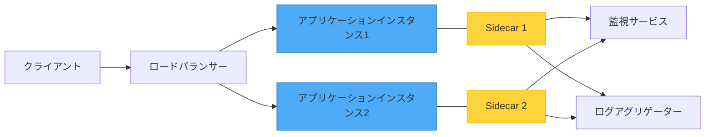
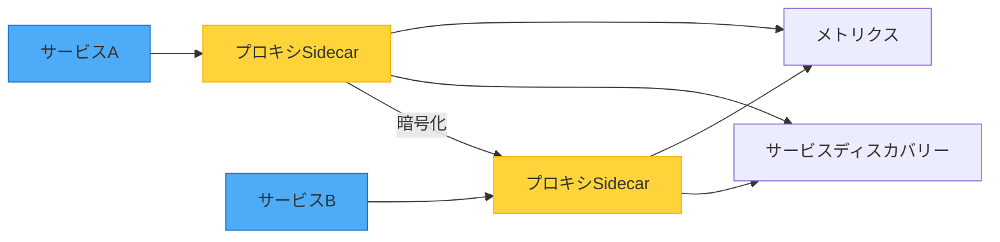

オートバイにサイドカーを取り付けることを想像してください。サイドカーはオートバイと旅を共にし、追加の機能を提供しますが、独立した別個のユニットのままです。これがソフトウェアアーキテクチャにおけるSidecarパターンの動作方法です——コアアプリケーションコードを変更せずにアプリケーション機能を拡張する強力なアプローチです。

## オートバイの比喩

このパターンは、オートバイのサイドカーからその名前を得ています。サイドカーが：
- オートバイに取り付けられる
- 同じ旅を共有する
- 追加の容量を提供する
- 独立して追加または削除できる

ソフトウェアのサイドカーコンポーネントは：
- メインアプリケーションと並行してデプロイされる
- 同じライフサイクルを共有する
- サポート機能を提供する
- 独立して動作する



## 問題：横断的関心事

モダンなアプリケーションには、さまざまなサポート機能が必要です：
- ロギングと監視
- 設定管理
- サービスディスカバリー
- ネットワークプロキシ
- セキュリティと認証

### 従来のアプローチとその制限

**アプローチ1：すべてをアプリケーションに埋め込む**

```javascript
class Application {
  constructor() {
    this.logger = new Logger();
    this.metrics = new MetricsCollector();
    this.config = new ConfigManager();
    this.healthCheck = new HealthChecker();
  }
  
  async processRequest(request) {
    // ビジネスロジックとインフラストラクチャの関心事が混在
    this.logger.log('Processing request');
    this.metrics.increment('requests');
    
    const config = await this.config.get('settings');
    const result = await this.businessLogic(request, config);
    
    this.metrics.recordLatency(Date.now() - request.startTime);
    return result;
  }
}
```

!!!warning "⚠️ 埋め込みアプローチの問題"
    **密結合**：インフラストラクチャコードがビジネスロジックと混在
    
    **言語のロックイン**：すべてのコンポーネントが同じ言語を使用する必要がある
    
    **更新が困難**：ロギングの更新にはアプリケーションコードの変更が必要
    
    **リソース共有**：ロギングのバグがアプリケーション全体をクラッシュさせる可能性

**アプローチ2：別個のサービス**

```javascript
// アプリケーションは別個のサービスへのネットワーク呼び出しを行う
class Application {
  async processRequest(request) {
    await fetch('http://logging-service/log', {
      method: 'POST',
      body: JSON.stringify({ message: 'Processing request' })
    });
    
    const result = await this.businessLogic(request);
    
    await fetch('http://metrics-service/record', {
      method: 'POST',
      body: JSON.stringify({ metric: 'request_processed' })
    });
    
    return result;
  }
}
```

!!!warning "⚠️ 別個のサービスの問題"
    **ネットワークレイテンシ**：すべてのログやメトリクスにネットワーク呼び出しが必要
    
    **複雑性**：複数のサービスエンドポイントの管理
    
    **障害処理**：ロギングサービスがダウンしている場合はどうなるか？

## 解決策：Sidecarパターン

サポートコンポーネントを、メインアプリケーションと並行して実行される別個のプロセスまたはコンテナとしてデプロイします：

```yaml
# コンテナオーケストレーション設定
services:
  main-app:
    image: my-application:latest
    ports:
      - "8080:8080"
    
  logging-sidecar:
    image: log-collector:latest
    volumes:
      - /var/log/app:/logs
    
  monitoring-sidecar:
    image: metrics-exporter:latest
    environment:
      - METRICS_PORT=9090
```

アプリケーションはシンプルなままです：

```javascript
// アプリケーションは純粋にビジネスロジックに集中
class Application {
  async processRequest(request) {
    // stdoutに書き込むだけ - sidecarが収集を処理
    console.log('Processing request');
    
    // ビジネスロジックのみ
    const result = await this.businessLogic(request);
    
    return result;
  }
}
```

サイドカーがインフラストラクチャの関心事を処理します：

```javascript
// ロギングsidecar（別プロセス）
class LoggingSidecar {
  constructor() {
    this.logAggregator = new LogAggregator();
  }
  
  async start() {
    // アプリケーションログを監視
    const logStream = fs.createReadStream('/var/log/app/stdout');
    
    logStream.on('data', (chunk) => {
      const logs = this.parseLogEntries(chunk);
      
      // メタデータで強化
      logs.forEach(log => {
        log.hostname = os.hostname();
        log.timestamp = new Date().toISOString();
        log.environment = process.env.ENVIRONMENT;
      });
      
      // 集中ロギングに送信
      this.logAggregator.send(logs);
    });
  }
}
```

## 主な利点

### 1. 言語の独立性

異なるコンポーネントが異なる言語を使用できます：

```yaml
services:
  # Node.jsのメインアプリケーション
  app:
    image: node:18
    command: node server.js
    
  # Go言語の監視sidecar（パフォーマンスのため）
  metrics:
    image: golang:1.20
    command: ./metrics-collector
    
  # Pythonのログプロセッサー（ML分析のため）
  logs:
    image: python:3.11
    command: python log_analyzer.py
```

### 2. 分離とフォールトトレランス

サイドカーのクラッシュがメインアプリケーションを停止させません：

```javascript
// メインアプリケーションは実行を継続
class Application {
  async processRequest(request) {
    try {
      // ログを試みる（sidecarがダウンしている可能性）
      await this.notifySidecar('request_received');
    } catch (error) {
      // Sidecarが利用不可だが、継続
      console.error('Sidecar unavailable:', error.message);
    }
    
    // ビジネスロジックは関係なく進行
    return await this.businessLogic(request);
  }
}
```

### 3. リソース管理

リソースを独立して制御：

```yaml
services:
  app:
    image: my-app:latest
    resources:
      limits:
        memory: 2G
        cpu: "2.0"
      
  sidecar:
    image: log-collector:latest
    resources:
      limits:
        memory: 512M
        cpu: "0.5"
```

### 4. 独立した更新

アプリケーションに触れずにサイドカーを更新：

```bash
# 監視sidecarを新バージョンに更新
kubectl set image deployment/my-app \
  monitoring-sidecar=metrics-collector:v2.0

# アプリケーションは変更なしで実行を継続
```

## 一般的なユースケース

### ユースケース1：サービスメッシュプロキシ

サイドカープロキシがすべてのネットワーク通信を処理：



```javascript
// アプリケーションはシンプルなHTTP呼び出しを行う
class ServiceA {
  async callServiceB(data) {
    // プロキシsidecarが処理：
    // - サービスディスカバリー
    // - ロードバランシング
    // - リトライロジック
    // - サーキットブレーキング
    // - TLS暗号化
    // - メトリクス収集
    return await fetch('http://localhost:15001/service-b', {
      method: 'POST',
      body: JSON.stringify(data)
    });
  }
}
```

### ユースケース2：設定管理

サイドカーが設定変更を監視：

```javascript
// 設定sidecar
class ConfigSidecar {
  constructor() {
    this.configStore = new ConfigStore();
    this.sharedVolume = '/config';
  }
  
  async start() {
    // 設定変更を監視
    this.configStore.watch('app-config', async (newConfig) => {
      // 共有ボリュームに書き込み
      await fs.writeFile(
        `${this.sharedVolume}/config.json`,
        JSON.stringify(newConfig)
      );
      
      // アプリケーションに通知（シグナルまたはAPI経由）
      await this.notifyApplication('config_updated');
    });
  }
}

// アプリケーションは共有ボリュームから読み取り
class Application {
  loadConfig() {
    return JSON.parse(
      fs.readFileSync('/config/config.json', 'utf8')
    );
  }
}
```

### ユースケース3：ログアグリゲーション

アプリケーションの変更なしでログを収集して転送：

```javascript
// アプリケーションはstdout/stderrに書き込むだけ
console.log('User logged in:', userId);
console.error('Payment failed:', error);

// Sidecarが収集して処理
class LogAggregationSidecar {
  async collectLogs() {
    const logs = await this.readApplicationLogs();
    
    // 解析して強化
    const enrichedLogs = logs.map(log => ({
      ...log,
      service: 'payment-service',
      version: process.env.APP_VERSION,
      region: process.env.REGION,
      timestamp: new Date().toISOString()
    }));
    
    // ログアグリゲーションサービスに転送
    await this.forwardToLogService(enrichedLogs);
  }
}
```

### ユースケース4：セキュリティと認証

サイドカーレベルで認証を処理：

```javascript
// 認証sidecarがリクエストをインターセプト
class AuthSidecar {
  async handleRequest(req) {
    // JWTトークンを検証
    const token = req.headers.authorization;
    const user = await this.validateToken(token);
    
    if (!user) {
      return { status: 401, body: 'Unauthorized' };
    }
    
    // リクエストにユーザーコンテキストを追加
    req.headers['X-User-Id'] = user.id;
    req.headers['X-User-Roles'] = user.roles.join(',');
    
    // アプリケーションに転送
    return await this.forwardToApp(req);
  }
}

// アプリケーションは認証済みリクエストを受信
class Application {
  async handleRequest(req) {
    // ユーザーはすでにsidecarによって認証済み
    const userId = req.headers['X-User-Id'];
    const roles = req.headers['X-User-Roles'].split(',');
    
    // ビジネスロジックに集中
    return await this.processBusinessLogic(userId, roles);
  }
}
```

## 実装パターン

### パターン1：共有ボリューム

サイドカーは共有ファイルシステム経由で通信：

```yaml
services:
  app:
    volumes:
      - shared-data:/data
      
  sidecar:
    volumes:
      - shared-data:/data

volumes:
  shared-data:
```

### パターン2：ローカルホストネットワーク

サイドカーはlocalhost経由で通信：

```javascript
// アプリケーションはメトリクスエンドポイントを公開
app.get('/metrics', (req, res) => {
  res.json({
    requests: requestCount,
    errors: errorCount
  });
});

// Sidecarがメトリクスをスクレイプ
class MetricsSidecar {
  async collectMetrics() {
    const response = await fetch('http://localhost:8080/metrics');
    const metrics = await response.json();
    
    await this.exportToMonitoring(metrics);
  }
}
```

### パターン3：プロセス間通信

通信にシグナルまたはソケットを使用：

```javascript
// アプリケーションはシグナルをリッスン
process.on('SIGUSR1', () => {
  console.log('Reloading configuration...');
  this.reloadConfig();
});

// Sidecarがシグナルを送信
class ConfigSidecar {
  async notifyConfigChange() {
    const appPid = await this.getApplicationPid();
    process.kill(appPid, 'SIGUSR1');
  }
}
```

## Sidecarパターンを使用するタイミング

### 理想的なシナリオ

!!!success "✅ 完璧なユースケース"
    **異種アプリケーション**：異なる言語の複数のサービスが同じ機能を必要とする
    
    **横断的関心事**：すべてのサービスに適用されるロギング、監視、設定
    
    **サードパーティ統合**：制御できないアプリケーションに機能を追加
    
    **独立したスケーリング**：Sidecarとアプリケーションが異なるリソースニーズを持つ

### 実世界の例

**マイクロサービスプラットフォーム**
- サービスメッシュプロキシ（Envoy、Linkerd）
- ログコレクター（Fluentd、Filebeat）
- メトリクスエクスポーター（Prometheusエクスポーター）
- シークレットマネージャー

**レガシーアプリケーションのモダナイゼーション**
- レガシーアプリに監視を追加
- モダンな認証を実装
- サービスディスカバリーを有効化
- サーキットブレーキングを追加

### 避けるべき場合

!!!danger "❌ 適さない場合"
    **厳しいパフォーマンス要件**：プロセス間通信のオーバーヘッドが許容できない
    
    **シンプルなアプリケーション**：Sidecarを管理するオーバーヘッドが利点を上回る
    
    **深い統合が必要**：Sidecarがアプリケーション内部へのアクセスを必要とする
    
    **独立したスケーリングが必要**：Sidecarとアプリケーションが異なるスケーリング戦略を必要とする

## 考慮事項とトレードオフ

### デプロイの複雑性

アプリケーションインスタンスごとに複数のコンテナを管理：

```yaml
# 前：シンプルなデプロイ
docker run my-app:latest

# 後：協調デプロイ
docker-compose up
# または
kubectl apply -f deployment.yaml
```

!!!anote "📝 複雑性管理"
    コンテナオーケストレーションプラットフォーム（Kubernetes、Docker Swarm）を使用して、sidecarのライフサイクルを自動的に管理します。

### リソースオーバーヘッド

各アプリケーションインスタンスが複数のプロセスを実行：


{
  "title": {
    "text": "リソース使用量：スタンドアロン vs Sidecar"
  },
  "tooltip": {
    "trigger": "axis"
  },
  "legend": {
    "data": ["スタンドアロンアプリ", "アプリ + Sidecar"]
  },
  "xAxis": {
    "type": "category",
    "data": ["CPU", "メモリ", "ネットワーク"]
  },
  "yAxis": {
    "type": "value",
    "name": "リソースユニット"
  },
  "series": [
    {
      "name": "スタンドアロンアプリ",
      "type": "bar",
      "data": [100, 100, 100],
      "itemStyle": {
        "color": "#4dabf7"
      }
    },
    {
      "name": "アプリ + Sidecar",
      "type": "bar",
      "data": [120, 130, 110],
      "itemStyle": {
        "color": "#ffd43b"
      }
    }
  ]
}


### 通信レイテンシ

プロセス間通信がオーバーヘッドを追加：

```javascript
// 直接関数呼び出し：約1マイクロ秒
this.logger.log('message');

// SidecarへのHTTP：約1ミリ秒
await fetch('http://localhost:9090/log', {
  method: 'POST',
  body: JSON.stringify({ message: 'message' })
});

// 共有ボリューム：約100マイクロ秒
await fs.appendFile('/logs/app.log', 'message\n');
```

!!!tip "💡 最適化戦略"
    **Localhostを使用**：ネットワークオーバーヘッドを最小化
    
    **バッチ操作**：複数の呼び出しを集約
    
    **非同期通信**：Sidecarの応答を待たない
    
    **共有メモリ**：高頻度データにメモリマップファイルを使用

## 完全な実装例

アプリケーションと監視sidecarの包括的な例：

```javascript
// main-app.js - アプリケーション
const express = require('express');
const app = express();

class Application {
  constructor() {
    this.requestCount = 0;
    this.errorCount = 0;
  }
  
  // ビジネスロジックエンドポイント
  setupRoutes() {
    app.post('/api/orders', async (req, res) => {
      this.requestCount++;
      
      try {
        const order = await this.processOrder(req.body);
        console.log('Order processed:', order.id);
        res.json(order);
      } catch (error) {
        this.errorCount++;
        console.error('Order failed:', error.message);
        res.status(500).json({ error: error.message });
      }
    });
    
    // Sidecar用のメトリクスエンドポイント
    app.get('/internal/metrics', (req, res) => {
      res.json({
        requests: this.requestCount,
        errors: this.errorCount,
        uptime: process.uptime()
      });
    });
  }
  
  async processOrder(orderData) {
    // ビジネスロジックをここに
    return { id: Date.now(), ...orderData };
  }
  
  start() {
    this.setupRoutes();
    app.listen(8080, () => {
      console.log('Application running on port 8080');
    });
  }
}

new Application().start();
```

```javascript
// monitoring-sidecar.js - 監視Sidecar
const fetch = require('node-fetch');

class MonitoringSidecar {
  constructor() {
    this.metricsEndpoint = 'http://localhost:8080/internal/metrics';
    this.exportEndpoint = process.env.METRICS_EXPORT_URL;
  }
  
  async collectMetrics() {
    try {
      const response = await fetch(this.metricsEndpoint);
      const metrics = await response.json();
      
      // 環境データで強化
      const enrichedMetrics = {
        ...metrics,
        hostname: require('os').hostname(),
        timestamp: new Date().toISOString(),
        environment: process.env.ENVIRONMENT,
        version: process.env.APP_VERSION
      };
      
      // 監視システムにエクスポート
      await this.exportMetrics(enrichedMetrics);
      
      console.log('Metrics collected:', enrichedMetrics);
    } catch (error) {
      console.error('Failed to collect metrics:', error.message);
    }
  }
  
  async exportMetrics(metrics) {
    if (!this.exportEndpoint) return;
    
    await fetch(this.exportEndpoint, {
      method: 'POST',
      headers: { 'Content-Type': 'application/json' },
      body: JSON.stringify(metrics)
    });
  }
  
  start() {
    console.log('Monitoring sidecar started');
    
    // 10秒ごとにメトリクスを収集
    setInterval(() => this.collectMetrics(), 10000);
  }
}

new MonitoringSidecar().start();
```

```yaml
# docker-compose.yml - デプロイ設定
version: '3.8'

services:
  app:
    build: ./app
    ports:
      - "8080:8080"
    environment:
      - ENVIRONMENT=production
      - APP_VERSION=1.0.0
    networks:
      - app-network
    
  monitoring-sidecar:
    build: ./monitoring-sidecar
    environment:
      - METRICS_EXPORT_URL=http://metrics-server:9090/api/metrics
      - ENVIRONMENT=production
      - APP_VERSION=1.0.0
    depends_on:
      - app
    networks:
      - app-network

networks:
  app-network:
    driver: bridge
```

## 他のパターンとの関係

### Ambassadorパターン

Ambassadorパターンは、ネットワーク通信に特化したsidecarです：

```javascript
// Ambassador sidecarがすべてのアウトバウンドリクエストを処理
class AmbassadorSidecar {
  async proxyRequest(target, request) {
    // サービスディスカバリー
    const endpoint = await this.discover(target);
    
    // サーキットブレーキング
    if (this.isCircuitOpen(target)) {
      throw new Error('Circuit breaker open');
    }
    
    // リトライロジック
    return await this.retryWithBackoff(() =>
      fetch(endpoint, request)
    );
  }
}
```

### Adapterパターン

Adapterパターンは、インターフェースを変換するsidecarです：

```javascript
// Adapter sidecarがレガシープロトコルをモダンAPIに変換
class AdapterSidecar {
  async translateRequest(legacyRequest) {
    // レガシー形式をモダン形式に変換
    const modernRequest = {
      method: legacyRequest.action,
      data: this.transformData(legacyRequest.payload)
    };
    
    // モダンサービスに転送
    return await this.forwardToModernService(modernRequest);
  }
}
```

## 結論

Sidecarパターンは、アプリケーションコードを変更せずにアプリケーション機能を拡張する強力な方法を提供します。サポートコンポーネントを別個のプロセスまたはコンテナとしてデプロイすることで、次のことが得られます：

- **言語の独立性** - 各ジョブに最適なツールを使用
- **分離** - 障害がカスケードしない
- **柔軟性** - コンポーネントを独立して更新
- **再利用性** - 複数のアプリケーションで同じsidecarを使用

デプロイの複雑性とリソースオーバーヘッドを導入しますが、特にマイクロサービスアーキテクチャとコンテナ化環境では、利点がコストを上回ることが多いです。

このパターンは、複数のアプリケーションに横断的関心事を追加する必要がある場合、レガシーシステムをモダナイズする場合、または異種技術スタックをサポートするプラットフォームを構築する場合に輝きます。

## 参考文献

- [Microsoft Azure Architecture - Sidecar Pattern](https://learn.microsoft.com/en-us/azure/architecture/patterns/sidecar)
