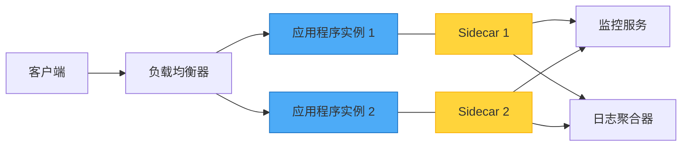
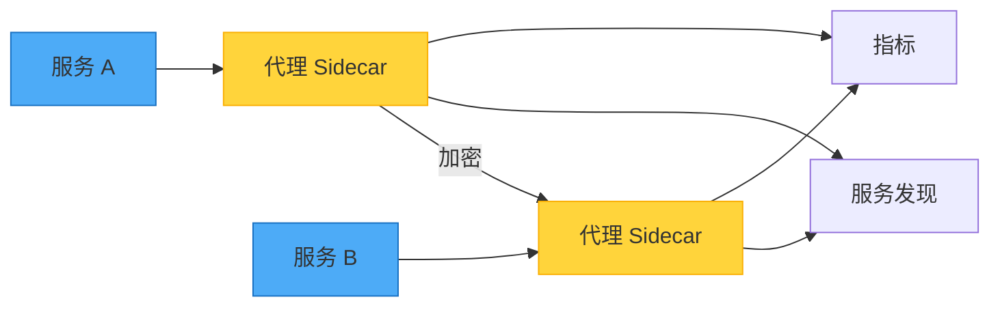

想象一下在摩托车上安装边车。边车与摩托车共享旅程，提供额外功能，但仍然是一个独立的单元。这正是 Sidecar 模式在软件架构中的运作方式——一种强大的方法，可以在不修改核心应用程序代码的情况下扩展应用程序功能。

## 摩托车类比

这个模式的名称来自摩托车边车。就像边车：
- 附加在摩托车上
- 共享相同的旅程
- 提供额外容量
- 可以独立添加或移除

软件中的 sidecar 组件：
- 部署在主应用程序旁边
- 共享相同的生命周期
- 提供支持功能
- 独立运作



## 问题：横切关注点

现代应用程序需要各种支持功能：
- 日志记录和监控
- 配置管理
- 服务发现
- 网络代理
- 安全性和身份验证

### 传统方法及其限制

**方法 1：将所有内容嵌入应用程序**

```javascript
class Application {
  constructor() {
    this.logger = new Logger();
    this.metrics = new MetricsCollector();
    this.config = new ConfigManager();
    this.healthCheck = new HealthChecker();
  }
  
  async processRequest(request) {
    // 业务逻辑与基础设施关注点混合
    this.logger.log('Processing request');
    this.metrics.increment('requests');
    
    const config = await this.config.get('settings');
    const result = await this.businessLogic(request, config);
    
    this.metrics.recordLatency(Date.now() - request.startTime);
    return result;
  }
}
```

!!!warning "⚠️ 嵌入式方法的问题"
    **紧密耦合**：基础设施代码与业务逻辑混合
    
    **语言锁定**：所有组件必须使用相同语言
    
    **更新困难**：更新日志记录需要更改应用程序代码
    
    **资源共享**：日志记录中的错误可能导致整个应用程序崩溃

**方法 2：独立服务**

```javascript
// 应用程序对独立服务进行网络调用
class Application {
  async processRequest(request) {
    await fetch('http://logging-service/log', {
      method: 'POST',
      body: JSON.stringify({ message: 'Processing request' })
    });
    
    const result = await this.businessLogic(request);
    
    await fetch('http://metrics-service/record', {
      method: 'POST',
      body: JSON.stringify({ metric: 'request_processed' })
    });
    
    return result;
  }
}
```

!!!warning "⚠️ 独立服务的问题"
    **网络延迟**：每个日志或指标都需要网络调用
    
    **复杂性**：管理多个服务端点
    
    **故障处理**：如果日志服务停机怎么办？

## 解决方案：Sidecar 模式

将支持组件部署为与主应用程序一起运行的独立进程或容器：

```yaml
# 容器编排配置
services:
  main-app:
    image: my-application:latest
    ports:
      - "8080:8080"
    
  logging-sidecar:
    image: log-collector:latest
    volumes:
      - /var/log/app:/logs
    
  monitoring-sidecar:
    image: metrics-exporter:latest
    environment:
      - METRICS_PORT=9090
```

应用程序保持简单：

```javascript
// 应用程序纯粹专注于业务逻辑
class Application {
  async processRequest(request) {
    // 只写入 stdout - sidecar 处理收集
    console.log('Processing request');
    
    // 仅业务逻辑
    const result = await this.businessLogic(request);
    
    return result;
  }
}
```

Sidecar 处理基础设施关注点：

```javascript
// 日志 sidecar（独立进程）
class LoggingSidecar {
  constructor() {
    this.logAggregator = new LogAggregator();
  }
  
  async start() {
    // 监视应用程序日志
    const logStream = fs.createReadStream('/var/log/app/stdout');
    
    logStream.on('data', (chunk) => {
      const logs = this.parseLogEntries(chunk);
      
      // 使用元数据丰富
      logs.forEach(log => {
        log.hostname = os.hostname();
        log.timestamp = new Date().toISOString();
        log.environment = process.env.ENVIRONMENT;
      });
      
      // 发送到集中式日志记录
      this.logAggregator.send(logs);
    });
  }
}
```

## 主要优势

### 1. 语言独立性

不同组件可以使用不同语言：

```yaml
services:
  # Node.js 中的主应用程序
  app:
    image: node:18
    command: node server.js
    
  # Go 中的监控 sidecar（为了性能）
  metrics:
    image: golang:1.20
    command: ./metrics-collector
    
  # Python 中的日志处理器（用于 ML 分析）
  logs:
    image: python:3.11
    command: python log_analyzer.py
```

### 2. 隔离和容错

Sidecar 中的崩溃不会终止主应用程序：

```javascript
// 主应用程序继续运行
class Application {
  async processRequest(request) {
    try {
      // 尝试记录（sidecar 可能停机）
      await this.notifySidecar('request_received');
    } catch (error) {
      // Sidecar 不可用，但我们继续
      console.error('Sidecar unavailable:', error.message);
    }
    
    // 无论如何业务逻辑都会继续
    return await this.businessLogic(request);
  }
}
```

### 3. 资源管理

独立控制资源：

```yaml
services:
  app:
    image: my-app:latest
    resources:
      limits:
        memory: 2G
        cpu: "2.0"
      
  sidecar:
    image: log-collector:latest
    resources:
      limits:
        memory: 512M
        cpu: "0.5"
```

### 4. 独立更新

在不触碰应用程序的情况下更新 sidecar：

```bash
# 将监控 sidecar 更新到新版本
kubectl set image deployment/my-app \
  monitoring-sidecar=metrics-collector:v2.0

# 应用程序继续运行不变
```

## 常见使用案例

### 使用案例 1：服务网格代理

Sidecar 代理处理所有网络通信：



```javascript
// 应用程序进行简单的 HTTP 调用
class ServiceA {
  async callServiceB(data) {
    // 代理 sidecar 处理：
    // - 服务发现
    // - 负载均衡
    // - 重试逻辑
    // - 断路器
    // - TLS 加密
    // - 指标收集
    return await fetch('http://localhost:15001/service-b', {
      method: 'POST',
      body: JSON.stringify(data)
    });
  }
}
```

### 使用案例 2：配置管理

Sidecar 监视配置变更：

```javascript
// 配置 sidecar
class ConfigSidecar {
  constructor() {
    this.configStore = new ConfigStore();
    this.sharedVolume = '/config';
  }
  
  async start() {
    // 监视配置变更
    this.configStore.watch('app-config', async (newConfig) => {
      // 写入共享卷
      await fs.writeFile(
        `${this.sharedVolume}/config.json`,
        JSON.stringify(newConfig)
      );
      
      // 通知应用程序（通过信号或 API）
      await this.notifyApplication('config_updated');
    });
  }
}

// 应用程序从共享卷读取
class Application {
  loadConfig() {
    return JSON.parse(
      fs.readFileSync('/config/config.json', 'utf8')
    );
  }
}
```

### 使用案例 3：日志聚合

在不更改应用程序的情况下收集和转发日志：

```javascript
// 应用程序只写入 stdout/stderr
console.log('User logged in:', userId);
console.error('Payment failed:', error);

// Sidecar 收集和处理
class LogAggregationSidecar {
  async collectLogs() {
    const logs = await this.readApplicationLogs();
    
    // 解析和丰富
    const enrichedLogs = logs.map(log => ({
      ...log,
      service: 'payment-service',
      version: process.env.APP_VERSION,
      region: process.env.REGION,
      timestamp: new Date().toISOString()
    }));
    
    // 转发到日志聚合服务
    await this.forwardToLogService(enrichedLogs);
  }
}
```

### 使用案例 4：安全性和身份验证

在 sidecar 级别处理身份验证：

```javascript
// 身份验证 sidecar 拦截请求
class AuthSidecar {
  async handleRequest(req) {
    // 验证 JWT 令牌
    const token = req.headers.authorization;
    const user = await this.validateToken(token);
    
    if (!user) {
      return { status: 401, body: 'Unauthorized' };
    }
    
    // 将用户上下文添加到请求
    req.headers['X-User-Id'] = user.id;
    req.headers['X-User-Roles'] = user.roles.join(',');
    
    // 转发到应用程序
    return await this.forwardToApp(req);
  }
}

// 应用程序接收已验证的请求
class Application {
  async handleRequest(req) {
    // 用户已由 sidecar 验证
    const userId = req.headers['X-User-Id'];
    const roles = req.headers['X-User-Roles'].split(',');
    
    // 专注于业务逻辑
    return await this.processBusinessLogic(userId, roles);
  }
}
```

## 实现模式

### 模式 1：共享卷

Sidecar 通过共享文件系统通信：

```yaml
services:
  app:
    volumes:
      - shared-data:/data
      
  sidecar:
    volumes:
      - shared-data:/data

volumes:
  shared-data:
```

### 模式 2：本地主机网络

Sidecar 通过 localhost 通信：

```javascript
// 应用程序公开指标端点
app.get('/metrics', (req, res) => {
  res.json({
    requests: requestCount,
    errors: errorCount
  });
});

// Sidecar 抓取指标
class MetricsSidecar {
  async collectMetrics() {
    const response = await fetch('http://localhost:8080/metrics');
    const metrics = await response.json();
    
    await this.exportToMonitoring(metrics);
  }
}
```

### 模式 3：进程间通信

使用信号或套接字进行通信：

```javascript
// 应用程序监听信号
process.on('SIGUSR1', () => {
  console.log('Reloading configuration...');
  this.reloadConfig();
});

// Sidecar 发送信号
class ConfigSidecar {
  async notifyConfigChange() {
    const appPid = await this.getApplicationPid();
    process.kill(appPid, 'SIGUSR1');
  }
}
```

## 何时使用 Sidecar 模式

### 理想场景

!!!success "✅ 完美使用案例"
    **异构应用程序**：多个不同语言的服务需要相同功能
    
    **横切关注点**：适用于所有服务的日志记录、监控、配置
    
    **第三方集成**：为您无法控制的应用程序添加功能
    
    **独立扩展**：Sidecar 和应用程序有不同的资源需求

### 真实世界范例

**微服务平台**
- 服务网格代理（Envoy、Linkerd）
- 日志收集器（Fluentd、Filebeat）
- 指标导出器（Prometheus 导出器）
- 秘密管理器

**遗留应用程序现代化**
- 为遗留应用程序添加监控
- 实现现代身份验证
- 启用服务发现
- 添加断路器

### 何时避免

!!!danger "❌ 不适合的情况"
    **严格的性能要求**：进程间通信开销不可接受
    
    **简单应用程序**：管理 sidecar 的开销超过好处
    
    **需要深度集成**：Sidecar 需要访问应用程序内部
    
    **需要独立扩展**：Sidecar 和应用程序需要不同的扩展策略

## 考量和权衡

### 部署复杂性

管理每个应用程序实例的多个容器：

```yaml
# 之前：简单部署
docker run my-app:latest

# 之后：协调部署
docker-compose up
# 或
kubectl apply -f deployment.yaml
```

!!!anote "📝 复杂性管理"
    使用容器编排平台（Kubernetes、Docker Swarm）自动管理 sidecar 生命周期。

### 资源开销

每个应用程序实例现在运行多个进程：


{
  "title": {
    "text": "资源使用：独立 vs Sidecar"
  },
  "tooltip": {
    "trigger": "axis"
  },
  "legend": {
    "data": ["独立应用程序", "应用程序 + Sidecar"]
  },
  "xAxis": {
    "type": "category",
    "data": ["CPU", "内存", "网络"]
  },
  "yAxis": {
    "type": "value",
    "name": "资源单位"
  },
  "series": [
    {
      "name": "独立应用程序",
      "type": "bar",
      "data": [100, 100, 100],
      "itemStyle": {
        "color": "#4dabf7"
      }
    },
    {
      "name": "应用程序 + Sidecar",
      "type": "bar",
      "data": [120, 130, 110],
      "itemStyle": {
        "color": "#ffd43b"
      }
    }
  ]
}


### 通信延迟

进程间通信增加开销：

```javascript
// 直接函数调用：约 1 微秒
this.logger.log('message');

// HTTP 到 sidecar：约 1 毫秒
await fetch('http://localhost:9090/log', {
  method: 'POST',
  body: JSON.stringify({ message: 'message' })
});

// 共享卷：约 100 微秒
await fs.appendFile('/logs/app.log', 'message\n');
```

!!!tip "💡 优化策略"
    **使用 Localhost**：最小化网络开销
    
    **批处理操作**：聚合多个调用
    
    **异步通信**：不等待 sidecar 响应
    
    **共享内存**：对高频率数据使用内存映射文件

## 完整实现范例

这是一个包含应用程序和监控 sidecar 的全面范例：

```javascript
// main-app.js - 应用程序
const express = require('express');
const app = express();

class Application {
  constructor() {
    this.requestCount = 0;
    this.errorCount = 0;
  }
  
  // 业务逻辑端点
  setupRoutes() {
    app.post('/api/orders', async (req, res) => {
      this.requestCount++;
      
      try {
        const order = await this.processOrder(req.body);
        console.log('Order processed:', order.id);
        res.json(order);
      } catch (error) {
        this.errorCount++;
        console.error('Order failed:', error.message);
        res.status(500).json({ error: error.message });
      }
    });
    
    // 供 sidecar 使用的指标端点
    app.get('/internal/metrics', (req, res) => {
      res.json({
        requests: this.requestCount,
        errors: this.errorCount,
        uptime: process.uptime()
      });
    });
  }
  
  async processOrder(orderData) {
    // 业务逻辑在这里
    return { id: Date.now(), ...orderData };
  }
  
  start() {
    this.setupRoutes();
    app.listen(8080, () => {
      console.log('Application running on port 8080');
    });
  }
}

new Application().start();
```

```javascript
// monitoring-sidecar.js - 监控 Sidecar
const fetch = require('node-fetch');

class MonitoringSidecar {
  constructor() {
    this.metricsEndpoint = 'http://localhost:8080/internal/metrics';
    this.exportEndpoint = process.env.METRICS_EXPORT_URL;
  }
  
  async collectMetrics() {
    try {
      const response = await fetch(this.metricsEndpoint);
      const metrics = await response.json();
      
      // 使用环境数据丰富
      const enrichedMetrics = {
        ...metrics,
        hostname: require('os').hostname(),
        timestamp: new Date().toISOString(),
        environment: process.env.ENVIRONMENT,
        version: process.env.APP_VERSION
      };
      
      // 导出到监控系统
      await this.exportMetrics(enrichedMetrics);
      
      console.log('Metrics collected:', enrichedMetrics);
    } catch (error) {
      console.error('Failed to collect metrics:', error.message);
    }
  }
  
  async exportMetrics(metrics) {
    if (!this.exportEndpoint) return;
    
    await fetch(this.exportEndpoint, {
      method: 'POST',
      headers: { 'Content-Type': 'application/json' },
      body: JSON.stringify(metrics)
    });
  }
  
  start() {
    console.log('Monitoring sidecar started');
    
    // 每 10 秒收集指标
    setInterval(() => this.collectMetrics(), 10000);
  }
}

new MonitoringSidecar().start();
```

```yaml
# docker-compose.yml - 部署配置
version: '3.8'

services:
  app:
    build: ./app
    ports:
      - "8080:8080"
    environment:
      - ENVIRONMENT=production
      - APP_VERSION=1.0.0
    networks:
      - app-network
    
  monitoring-sidecar:
    build: ./monitoring-sidecar
    environment:
      - METRICS_EXPORT_URL=http://metrics-server:9090/api/metrics
      - ENVIRONMENT=production
      - APP_VERSION=1.0.0
    depends_on:
      - app
    networks:
      - app-network

networks:
  app-network:
    driver: bridge
```

## 与其他模式的关系

### Ambassador 模式

Ambassador 模式是用于网络通信的专门 sidecar：

```javascript
// Ambassador sidecar 处理所有出站请求
class AmbassadorSidecar {
  async proxyRequest(target, request) {
    // 服务发现
    const endpoint = await this.discover(target);
    
    // 断路器
    if (this.isCircuitOpen(target)) {
      throw new Error('Circuit breaker open');
    }
    
    // 重试逻辑
    return await this.retryWithBackoff(() =>
      fetch(endpoint, request)
    );
  }
}
```

### Adapter 模式

Adapter 模式是转换接口的 sidecar：

```javascript
// Adapter sidecar 将遗留协议转换为现代 API
class AdapterSidecar {
  async translateRequest(legacyRequest) {
    // 将遗留格式转换为现代格式
    const modernRequest = {
      method: legacyRequest.action,
      data: this.transformData(legacyRequest.payload)
    };
    
    // 转发到现代服务
    return await this.forwardToModernService(modernRequest);
  }
}
```

## 结论

Sidecar 模式提供了一种强大的方式来扩展应用程序功能，而无需修改应用程序代码。通过将支持组件部署为独立的进程或容器，您可以获得：

- **语言独立性** - 为每项工作使用最佳工具
- **隔离** - 故障不会级联
- **灵活性** - 独立更新组件
- **可重用性** - 在多个应用程序中使用相同的 sidecar

虽然它引入了部署复杂性和资源开销，但好处通常超过成本，特别是在微服务架构和容器化环境中。

当您需要为多个应用程序添加横切关注点、现代化遗留系统或构建支持异构技术堆栈的平台时，这种模式表现出色。

## 参考资料

- [Microsoft Azure Architecture - Sidecar Pattern](https://learn.microsoft.com/en-us/azure/architecture/patterns/sidecar)
