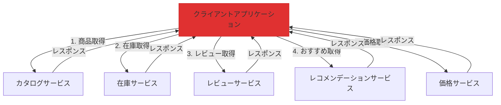
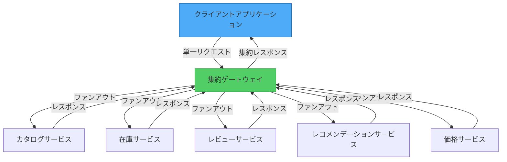

レストランで食事を注文することを想像してください。前菜、メインコース、サイドディッシュ、デザートのために別々にキッチンに行くのではなく、ウェイターが注文全体を集約し、調整されたコースですべてを一緒に持ってきます。これがGateway Aggregationパターンの本質です——複数のリクエストを収集し、統一されたレスポンスを提供する単一のポイントです。

## 問題：呼び出しが多すぎる

モダンなアプリケーションは、単一のユーザーアクションを完了するために、複数のバックエンドサービスからデータを必要とすることがよくあります。次のものを表示する商品ページを考えてみましょう：

- カタログサービスからの商品詳細
- 倉庫サービスからの在庫状況
- レビューサービスからの顧客レビュー
- レコメンデーションエンジンからのおすすめ商品
- 価格サービスからの価格情報

### おしゃべりなアプローチ

集約がない場合、クライアントは複数の個別の呼び出しを行います：

```javascript
// クライアントは5つの別々のネットワーク呼び出しを行う
class ProductPageClient {
  async loadProductPage(productId) {
    // 各呼び出しにネットワークオーバーヘッドがある
    const product = await fetch(`https://api.neo01.com/catalog/${productId}`);
    const inventory = await fetch(`https://api.neo01.com/inventory/${productId}`);
    const reviews = await fetch(`https://api.neo01.com/reviews/${productId}`);
    const recommendations = await fetch(`https://api.neo01.com/recommendations/${productId}`);
    const pricing = await fetch(`https://api.neo01.com/pricing/${productId}`);
    
    return {
      product: await product.json(),
      inventory: await inventory.json(),
      reviews: await reviews.json(),
      recommendations: await recommendations.json(),
      pricing: await pricing.json()
    };
  }
}
```



!!!warning "⚠️ 複数呼び出しの問題"
    **高レイテンシ**：各リクエストがネットワークラウンドトリップ時間を追加
    
    **リソース集約的**：複数の接続がクライアントリソースを消費
    
    **障害が発生しやすい**：呼び出しが多いほど障害の機会が増える
    
    **モバイル非対応**：セルラーネットワークがレイテンシの問題を増幅
    
    **複雑なエラー処理**：複数の呼び出しにわたる障害の管理

### 実際のコスト

高レイテンシネットワーク（例：100msラウンドトリップ）では：

```
順次呼び出し：5リクエスト × 100ms = 最低500ms
並列呼び出し：100ms + 接続オーバーヘッド + 処理時間
```

並列リクエストでも、複数の接続を管理し、複数の障害シナリオを処理し、モバイルデバイスでより多くのバッテリーを消費しています。

## 解決策：Gateway Aggregation

クライアントとバックエンドサービスの間にゲートウェイを配置します。ゲートウェイは単一のリクエストを受信し、複数のサービスにファンアウトし、レスポンスを集約し、統一された結果を返します。



### シンプルな実装

```javascript
// クライアントは1回の呼び出しを行う
class ProductPageClient {
  async loadProductPage(productId) {
    const response = await fetch(
      `https://gateway.neo01.com/product-page/${productId}`
    );
    return await response.json();
  }
}

// ゲートウェイが集約を処理
class AggregationGateway {
  async getProductPage(req, res) {
    const { productId } = req.params;
    
    // すべてのサービスに並列でファンアウト
    const [product, inventory, reviews, recommendations, pricing] = 
      await Promise.all([
        this.catalogService.getProduct(productId),
        this.inventoryService.getStock(productId),
        this.reviewService.getReviews(productId),
        this.recommendationService.getRecommendations(productId),
        this.pricingService.getPrice(productId)
      ]);
    
    // 集約して返す
    res.json({
      product,
      inventory,
      reviews,
      recommendations,
      pricing
    });
  }
}
```

## 主な利点

### 1. ネットワークオーバーヘッドの削減

**前**：クライアントからクラウドへの5リクエスト
```
クライアント → [100ms] → サービス1
クライアント → [100ms] → サービス2
クライアント → [100ms] → サービス3
クライアント → [100ms] → サービス4
クライアント → [100ms] → サービス5
合計：500ms（順次）または100ms + オーバーヘッド（並列）
```

**後**：クライアントから1リクエスト、データセンター内で5リクエスト
```
クライアント → [100ms] → ゲートウェイ
ゲートウェイ → [1ms] → サービス1
ゲートウェイ → [1ms] → サービス2
ゲートウェイ → [1ms] → サービス3
ゲートウェイ → [1ms] → サービス4
ゲートウェイ → [1ms] → サービス5
ゲートウェイ → [100ms] → クライアント
合計：約200ms
```

### 2. クライアントコードの簡素化

```javascript
// 前：複雑なクライアントロジック
class ComplexClient {
  async loadData() {
    try {
      const results = await Promise.allSettled([
        this.fetchService1(),
        this.fetchService2(),
        this.fetchService3()
      ]);
      
      // 部分的な障害を処理
      const data = {};
      results.forEach((result, index) => {
        if (result.status === 'fulfilled') {
          data[`service${index + 1}`] = result.value;
        } else {
          data[`service${index + 1}`] = null;
          this.logError(result.reason);
        }
      });
      
      return data;
    } catch (error) {
      // エラー処理
    }
  }
}

// 後：シンプルなクライアントロジック
class SimpleClient {
  async loadData() {
    return await fetch('https://gateway.neo01.com/aggregated-data')
      .then(res => res.json());
  }
}
```

### 3. 集中化されたエラー処理

```javascript
class ResilientGateway {
  async aggregateData(req, res) {
    const results = await Promise.allSettled([
      this.fetchCriticalData(),
      this.fetchOptionalData1(),
      this.fetchOptionalData2()
    ]);
    
    // 重要なデータは成功する必要がある
    if (results[0].status === 'rejected') {
      return res.status(503).json({
        error: 'Critical service unavailable'
      });
    }
    
    // オプションのデータは優雅に失敗できる
    res.json({
      critical: results[0].value,
      optional1: results[1].status === 'fulfilled' ? results[1].value : null,
      optional2: results[2].status === 'fulfilled' ? results[2].value : null
    });
  }
}
```

## 実装パターン

### パターン1：シンプルな集約

レスポンスをそのまま結合：

```javascript
class SimpleAggregator {
  async aggregate(userId) {
    const [profile, orders, preferences] = await Promise.all([
      this.userService.getProfile(userId),
      this.orderService.getOrders(userId),
      this.preferenceService.getPreferences(userId)
    ]);
    
    return { profile, orders, preferences };
  }
}
```

### パターン2：データ変換

データを変換して結合：

```javascript
class TransformingAggregator {
  async aggregate(userId) {
    const [user, orders, reviews] = await Promise.all([
      this.userService.getUser(userId),
      this.orderService.getOrders(userId),
      this.reviewService.getReviews(userId)
    ]);
    
    // 変換して強化
    return {
      user: {
        id: user.id,
        name: user.fullName,
        memberSince: user.createdAt
      },
      stats: {
        totalOrders: orders.length,
        totalSpent: orders.reduce((sum, o) => sum + o.amount, 0),
        reviewCount: reviews.length,
        averageRating: this.calculateAverage(reviews)
      },
      recentActivity: this.combineActivity(orders, reviews)
    };
  }
}
```

### パターン3：条件付き集約

条件に基づいてデータを取得：

```javascript
class ConditionalAggregator {
  async aggregate(productId, options) {
    // 常に商品を取得
    const product = await this.catalogService.getProduct(productId);
    
    // 条件付きで追加データを取得
    const requests = [Promise.resolve(product)];
    
    if (options.includeReviews) {
      requests.push(this.reviewService.getReviews(productId));
    }
    
    if (options.includeRelated) {
      requests.push(this.recommendationService.getRelated(productId));
    }
    
    if (product.type === 'physical') {
      requests.push(this.inventoryService.getStock(productId));
    }
    
    const results = await Promise.all(requests);
    
    return this.buildResponse(results, options);
  }
}
```

## 高度な考慮事項

### タイムアウトと部分的なレスポンス

遅いサービスを優雅に処理：

```javascript
class TimeoutAwareGateway {
  async aggregateWithTimeout(productId) {
    const timeout = (ms, defaultValue) => 
      new Promise(resolve => setTimeout(() => resolve(defaultValue), ms));
    
    const [product, inventory, reviews] = await Promise.all([
      // 重要：タイムアウトなし
      this.catalogService.getProduct(productId),
      
      // オプション：500msタイムアウト
      Promise.race([
        this.inventoryService.getStock(productId),
        timeout(500, { available: false, message: 'Check back later' })
      ]),
      
      // オプション：1000msタイムアウト
      Promise.race([
        this.reviewService.getReviews(productId),
        timeout(1000, { reviews: [], message: 'Reviews temporarily unavailable' })
      ])
    ]);
    
    return { product, inventory, reviews };
  }
}
```

### キャッシング戦略

キャッシングでバックエンドの負荷を削減：

```javascript
class CachingGateway {
  constructor() {
    this.cache = new Cache();
  }
  
  async aggregate(productId) {
    // 最初にキャッシュをチェック
    const cached = await this.cache.get(`product:${productId}`);
    if (cached) {
      return cached;
    }
    
    // 取得して キャッシュ
    const data = await this.fetchAndAggregate(productId);
    
    // 異なるTTLでキャッシュ
    await this.cache.set(`product:${productId}`, data, {
      ttl: 300 // 5分
    });
    
    return data;
  }
}
```

### サーキットブレーキング

カスケード障害から保護：

```javascript
class ResilientGateway {
  constructor() {
    this.circuitBreakers = {
      inventory: new CircuitBreaker({ threshold: 5, timeout: 60000 }),
      reviews: new CircuitBreaker({ threshold: 5, timeout: 60000 })
    };
  }
  
  async aggregate(productId) {
    const product = await this.catalogService.getProduct(productId);
    
    // オプションのサービスにサーキットブレーカーを使用
    const inventory = await this.circuitBreakers.inventory.execute(
      () => this.inventoryService.getStock(productId),
      { fallback: { available: false } }
    );
    
    const reviews = await this.circuitBreakers.reviews.execute(
      () => this.reviewService.getReviews(productId),
      { fallback: { reviews: [] } }
    );
    
    return { product, inventory, reviews };
  }
}
```

## このパターンを使用するタイミング

!!!success "✅ Gateway Aggregationを使用する場合"
    **複数のバックエンド呼び出し**：クライアントが1つの操作のために複数のサービスからデータを必要とする
    
    **高レイテンシネットワーク**：接続が遅いモバイルまたはリモートクライアント
    
    **マイクロサービスアーキテクチャ**：多くの小さなサービスが調整を必要とする
    
    **一貫したAPI**：バックエンドの変更にもかかわらず安定したインターフェースを提供したい
    
    **横断的関心事**：集中化されたロギング、監視、またはセキュリティが必要

!!!warning "⚠️ Gateway Aggregationを避ける場合"
    **単一サービス**：1つのバックエンドサービスのみを呼び出す（直接接続を使用）
    
    **低レイテンシネットワーク**：クライアントとサービスが同じデータセンターにある
    
    **リアルタイムストリーミング**：リクエスト-レスポンスではなく、継続的なデータストリームが必要
    
    **シンプルなバッチ操作**：バックエンドサービスがすでにバッチエンドポイントを提供している

## Gateway Aggregation vs. 他のパターン

### vs. Backend for Frontend (BFF)

```
Gateway Aggregation：任意のクライアント向けの汎用集約
BFF：クライアントタイプ（Web、モバイルなど）ごとの専用集約
```

### vs. API Composition

```
Gateway Aggregation：ゲートウェイレベルの集約
API Composition：アプリケーションレベルの集約
```

### vs. GraphQL

```
Gateway Aggregation：固定集約エンドポイント
GraphQL：クライアント指定の集約クエリ
```

## 監視と可観測性

ゲートウェイのパフォーマンスを追跡：

```javascript
class ObservableGateway {
  async aggregate(req, res) {
    const startTime = Date.now();
    const requestId = req.headers['x-request-id'];
    
    try {
      // 個々のサービス呼び出しを追跡
      const results = await Promise.all([
        this.timedCall('catalog', () => this.catalogService.get(req.params.id)),
        this.timedCall('inventory', () => this.inventoryService.get(req.params.id)),
        this.timedCall('reviews', () => this.reviewService.get(req.params.id))
      ]);
      
      // メトリクスを記録
      this.metrics.recordLatency('gateway.aggregate', Date.now() - startTime);
      this.metrics.increment('gateway.success');
      
      res.json(this.combineResults(results));
    } catch (error) {
      this.metrics.increment('gateway.error');
      this.logger.error('Aggregation failed', { requestId, error });
      throw error;
    }
  }
  
  async timedCall(serviceName, fn) {
    const start = Date.now();
    try {
      const result = await fn();
      this.metrics.recordLatency(`service.${serviceName}`, Date.now() - start);
      return result;
    } catch (error) {
      this.metrics.increment(`service.${serviceName}.error`);
      throw error;
    }
  }
}
```

## 結論

Gateway Aggregationパターンは、おしゃべりなクライアント-サーバー通信を効率的な単一リクエストのインタラクションに変換します。集約ロジックを集中化することで、ネットワークオーバーヘッドを削減し、クライアントコードを簡素化し、キャッシング、監視、レジリエンスパターンなどの横断的関心事を実装するための強力なポイントを獲得します。

このパターンは、ネットワークレイテンシが重要な要素であるマイクロサービスアーキテクチャとモバイルアプリケーションで輝きます。ただし、ゲートウェイ自体がボトルネックや単一障害点になる可能性があることを忘れないでください——スケーラビリティとレジリエンスを念頭に置いて設計してください。

## 参考文献

- [Gateway Aggregation Pattern - Microsoft Architecture Center](https://learn.microsoft.com/en-us/azure/architecture/patterns/gateway-aggregation)
