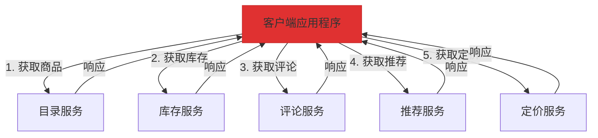
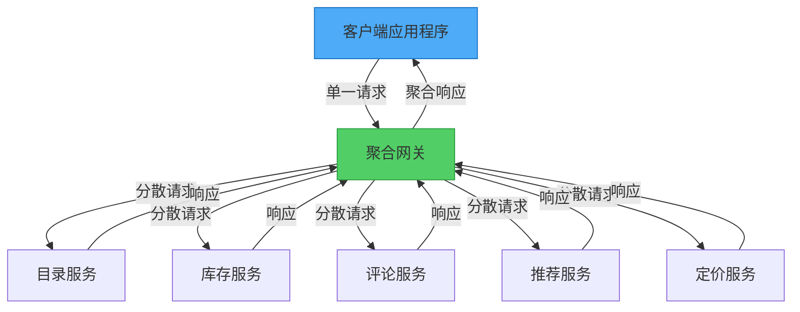

想象在餐厅点餐。服务员不会为了前菜、主菜、配菜和甜点分别跑厨房多趟，而是将整份订单汇整后，以协调的顺序一起送上。这就是网关聚合模式的精髓——通过单一节点收集多个请求，并提供统一的响应。

## 问题：过多的调用

现代应用程序通常需要从多个后端服务获取数据，才能完成单一用户操作。以商品页面为例，需要显示：

- 目录服务的商品详情
- 仓储服务的库存状态
- 评论服务的顾客评价
- 推荐引擎的相关商品
- 定价服务的价格信息

### 频繁通信的做法

没有聚合机制时，客户端需要进行多次个别调用：

```javascript
// 客户端进行 5 次独立的网络调用
class ProductPageClient {
  async loadProductPage(productId) {
    // 每次调用都有网络开销
    const product = await fetch(`https://api.neo01.com/catalog/${productId}`);
    const inventory = await fetch(`https://api.neo01.com/inventory/${productId}`);
    const reviews = await fetch(`https://api.neo01.com/reviews/${productId}`);
    const recommendations = await fetch(`https://api.neo01.com/recommendations/${productId}`);
    const pricing = await fetch(`https://api.neo01.com/pricing/${productId}`);
    
    return {
      product: await product.json(),
      inventory: await inventory.json(),
      reviews: await reviews.json(),
      recommendations: await recommendations.json(),
      pricing: await pricing.json()
    };
  }
}
```



!!!warning "⚠️ 多次调用的问题"
    **高延迟**：每个请求都增加网络往返时间
    
    **资源密集**：多个连接消耗客户端资源
    
    **容易失败**：调用次数越多，失败机会越大
    
    **移动设备不友好**：移动网络会放大延迟问题
    
    **复杂的错误处理**：需要管理多个调用的失败情况

### 实际成本

在高延迟网络（例如 100ms 往返时间）上：

```
顺序调用：5 个请求 × 100ms = 至少 500ms
并行调用：100ms + 连接开销 + 处理时间
```

即使使用并行请求，仍需管理多个连接、处理多种失败情境，并在移动设备上消耗更多电力。

## 解决方案：网关聚合

在客户端与后端服务之间放置网关。网关接收单一请求，向多个服务发出请求，聚合响应后返回统一结果。



### 简单实现

```javascript
// 客户端只进行一次调用
class ProductPageClient {
  async loadProductPage(productId) {
    const response = await fetch(
      `https://gateway.neo01.com/product-page/${productId}`
    );
    return await response.json();
  }
}

// 网关处理聚合
class AggregationGateway {
  async getProductPage(req, res) {
    const { productId } = req.params;
    
    // 并行向所有服务发出请求
    const [product, inventory, reviews, recommendations, pricing] = 
      await Promise.all([
        this.catalogService.getProduct(productId),
        this.inventoryService.getStock(productId),
        this.reviewService.getReviews(productId),
        this.recommendationService.getRecommendations(productId),
        this.pricingService.getPrice(productId)
      ]);
    
    // 聚合并返回
    res.json({
      product,
      inventory,
      reviews,
      recommendations,
      pricing
    });
  }
}
```

## 主要优势

### 1. 减少网络开销

**之前**：从客户端到云端的 5 次请求
```
客户端 → [100ms] → 服务 1
客户端 → [100ms] → 服务 2
客户端 → [100ms] → 服务 3
客户端 → [100ms] → 服务 4
客户端 → [100ms] → 服务 5
总计：500ms（顺序）或 100ms + 开销（并行）
```

**之后**：从客户端 1 次请求，数据中心内 5 次请求
```
客户端 → [100ms] → 网关
网关 → [1ms] → 服务 1
网关 → [1ms] → 服务 2
网关 → [1ms] → 服务 3
网关 → [1ms] → 服务 4
网关 → [1ms] → 服务 5
网关 → [100ms] → 客户端
总计：约 200ms
```

### 2. 简化客户端代码

```javascript
// 之前：复杂的客户端逻辑
class ComplexClient {
  async loadData() {
    try {
      const results = await Promise.allSettled([
        this.fetchService1(),
        this.fetchService2(),
        this.fetchService3()
      ]);
      
      // 处理部分失败
      const data = {};
      results.forEach((result, index) => {
        if (result.status === 'fulfilled') {
          data[`service${index + 1}`] = result.value;
        } else {
          data[`service${index + 1}`] = null;
          this.logError(result.reason);
        }
      });
      
      return data;
    } catch (error) {
      // 错误处理
    }
  }
}

// 之后：简单的客户端逻辑
class SimpleClient {
  async loadData() {
    return await fetch('https://gateway.neo01.com/aggregated-data')
      .then(res => res.json());
  }
}
```

### 3. 集中式错误处理

```javascript
class ResilientGateway {
  async aggregateData(req, res) {
    const results = await Promise.allSettled([
      this.fetchCriticalData(),
      this.fetchOptionalData1(),
      this.fetchOptionalData2()
    ]);
    
    // 关键数据必须成功
    if (results[0].status === 'rejected') {
      return res.status(503).json({
        error: '关键服务无法使用'
      });
    }
    
    // 可选数据可以优雅地失败
    res.json({
      critical: results[0].value,
      optional1: results[1].status === 'fulfilled' ? results[1].value : null,
      optional2: results[2].status === 'fulfilled' ? results[2].value : null
    });
  }
}
```

## 实现模式

### 模式 1：简单聚合

直接组合响应：

```javascript
class SimpleAggregator {
  async aggregate(userId) {
    const [profile, orders, preferences] = await Promise.all([
      this.userService.getProfile(userId),
      this.orderService.getOrders(userId),
      this.preferenceService.getPreferences(userId)
    ]);
    
    return { profile, orders, preferences };
  }
}
```

### 模式 2：数据转换

转换并组合数据：

```javascript
class TransformingAggregator {
  async aggregate(userId) {
    const [user, orders, reviews] = await Promise.all([
      this.userService.getUser(userId),
      this.orderService.getOrders(userId),
      this.reviewService.getReviews(userId)
    ]);
    
    // 转换并丰富数据
    return {
      user: {
        id: user.id,
        name: user.fullName,
        memberSince: user.createdAt
      },
      stats: {
        totalOrders: orders.length,
        totalSpent: orders.reduce((sum, o) => sum + o.amount, 0),
        reviewCount: reviews.length,
        averageRating: this.calculateAverage(reviews)
      },
      recentActivity: this.combineActivity(orders, reviews)
    };
  }
}
```

### 模式 3：条件式聚合

根据条件获取数据：

```javascript
class ConditionalAggregator {
  async aggregate(productId, options) {
    // 总是获取商品数据
    const product = await this.catalogService.getProduct(productId);
    
    // 条件式获取额外数据
    const requests = [Promise.resolve(product)];
    
    if (options.includeReviews) {
      requests.push(this.reviewService.getReviews(productId));
    }
    
    if (options.includeRelated) {
      requests.push(this.recommendationService.getRelated(productId));
    }
    
    if (product.type === 'physical') {
      requests.push(this.inventoryService.getStock(productId));
    }
    
    const results = await Promise.all(requests);
    
    return this.buildResponse(results, options);
  }
}
```

## 进阶考量

### 超时与部分响应

优雅地处理缓慢的服务：

```javascript
class TimeoutAwareGateway {
  async aggregateWithTimeout(productId) {
    const timeout = (ms, defaultValue) => 
      new Promise(resolve => setTimeout(() => resolve(defaultValue), ms));
    
    const [product, inventory, reviews] = await Promise.all([
      // 关键：无超时
      this.catalogService.getProduct(productId),
      
      // 可选：500ms 超时
      Promise.race([
        this.inventoryService.getStock(productId),
        timeout(500, { available: false, message: '请稍后再查' })
      ]),
      
      // 可选：1000ms 超时
      Promise.race([
        this.reviewService.getReviews(productId),
        timeout(1000, { reviews: [], message: '评论暂时无法使用' })
      ])
    ]);
    
    return { product, inventory, reviews };
  }
}
```

### 缓存策略

通过缓存减少后端负载：

```javascript
class CachingGateway {
  constructor() {
    this.cache = new Cache();
  }
  
  async aggregate(productId) {
    // 先检查缓存
    const cached = await this.cache.get(`product:${productId}`);
    if (cached) {
      return cached;
    }
    
    // 获取并缓存
    const data = await this.fetchAndAggregate(productId);
    
    // 使用不同的 TTL 缓存
    await this.cache.set(`product:${productId}`, data, {
      ttl: 300 // 5 分钟
    });
    
    return data;
  }
}
```

### 断路器

防止连锁故障：

```javascript
class ResilientGateway {
  constructor() {
    this.circuitBreakers = {
      inventory: new CircuitBreaker({ threshold: 5, timeout: 60000 }),
      reviews: new CircuitBreaker({ threshold: 5, timeout: 60000 })
    };
  }
  
  async aggregate(productId) {
    const product = await this.catalogService.getProduct(productId);
    
    // 对可选服务使用断路器
    const inventory = await this.circuitBreakers.inventory.execute(
      () => this.inventoryService.getStock(productId),
      { fallback: { available: false } }
    );
    
    const reviews = await this.circuitBreakers.reviews.execute(
      () => this.reviewService.getReviews(productId),
      { fallback: { reviews: [] } }
    );
    
    return { product, inventory, reviews };
  }
}
```

## 何时使用此模式

!!!success "✅ 适合使用网关聚合的情况"
    **多个后端调用**：客户端需要从多个服务获取数据以完成一项操作
    
    **高延迟网络**：移动或远程客户端连接速度较慢
    
    **微服务架构**：许多小型服务需要协调
    
    **一致的 API**：希望提供稳定的接口，不受后端变更影响
    
    **横切关注点**：需要集中式的日志记录、监控或安全性

!!!warning "⚠️ 避免使用网关聚合的情况"
    **单一服务**：只调用一个后端服务（使用直接连接）
    
    **低延迟网络**：客户端与服务在同一数据中心
    
    **实时流式传输**：需要持续的数据流，而非请求-响应
    
    **简单批处理操作**：后端服务已提供批处理端点

## 网关聚合与其他模式的比较

### vs. 前端后端（BFF）

```
网关聚合：适用于任何客户端的通用聚合
BFF：针对每种客户端类型（网页、移动等）的专门聚合
```

### vs. API 组合

```
网关聚合：网关层级的聚合
API 组合：应用程序层级的聚合
```

### vs. GraphQL

```
网关聚合：固定的聚合端点
GraphQL：客户端指定的聚合查询
```

## 监控与可观测性

跟踪网关性能：

```javascript
class ObservableGateway {
  async aggregate(req, res) {
    const startTime = Date.now();
    const requestId = req.headers['x-request-id'];
    
    try {
      // 跟踪个别服务调用
      const results = await Promise.all([
        this.timedCall('catalog', () => this.catalogService.get(req.params.id)),
        this.timedCall('inventory', () => this.inventoryService.get(req.params.id)),
        this.timedCall('reviews', () => this.reviewService.get(req.params.id))
      ]);
      
      // 记录指标
      this.metrics.recordLatency('gateway.aggregate', Date.now() - startTime);
      this.metrics.increment('gateway.success');
      
      res.json(this.combineResults(results));
    } catch (error) {
      this.metrics.increment('gateway.error');
      this.logger.error('聚合失败', { requestId, error });
      throw error;
    }
  }
  
  async timedCall(serviceName, fn) {
    const start = Date.now();
    try {
      const result = await fn();
      this.metrics.recordLatency(`service.${serviceName}`, Date.now() - start);
      return result;
    } catch (error) {
      this.metrics.increment(`service.${serviceName}.error`);
      throw error;
    }
  }
}
```

## 结论

网关聚合模式将频繁的客户端-服务器通信转变为高效的单一请求交互。通过集中聚合逻辑，可以减少网络开销、简化客户端代码，并获得实现横切关注点（如缓存、监控和韧性模式）的强大节点。

此模式在微服务架构和移动应用程序中表现出色，特别是在网络延迟是关键因素的情况下。然而，请记住网关本身可能成为瓶颈或单点故障——设计时要考虑可扩展性和韧性。

## 参考资料

- [网关聚合模式 - Microsoft 架构中心](https://learn.microsoft.com/en-us/azure/architecture/patterns/gateway-aggregation)
