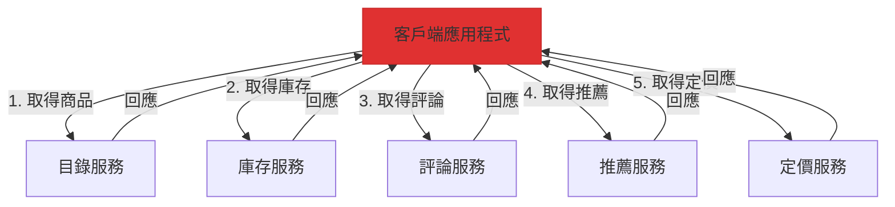
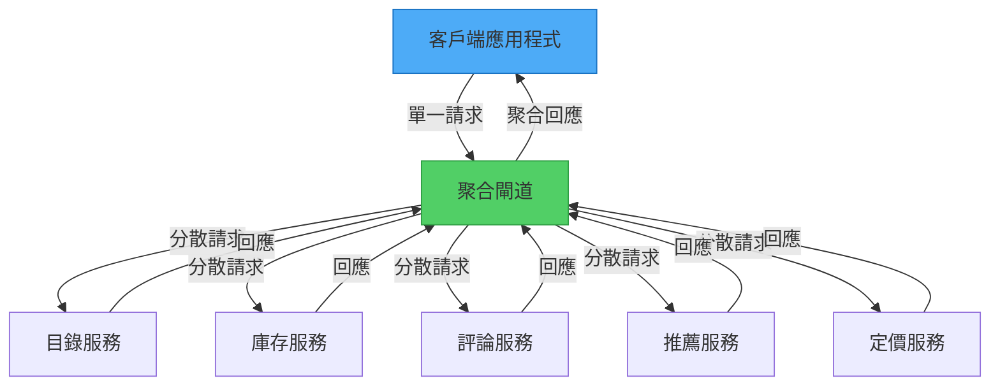

想像在餐廳點餐。服務生不會為了前菜、主餐、配菜和甜點分別跑廚房多趟，而是將整份訂單彙整後，以協調的順序一起送上。這就是閘道聚合模式的精髓——透過單一節點收集多個請求，並提供統一的回應。

## 問題：過多的呼叫

現代應用程式通常需要從多個後端服務取得資料，才能完成單一使用者操作。以商品頁面為例，需要顯示：

- 目錄服務的商品詳情
- 倉儲服務的庫存狀態
- 評論服務的顧客評價
- 推薦引擎的相關商品
- 定價服務的價格資訊

### 頻繁通訊的做法

沒有聚合機制時，客戶端需要進行多次個別呼叫：

```javascript
// 客戶端進行 5 次獨立的網路呼叫
class ProductPageClient {
  async loadProductPage(productId) {
    // 每次呼叫都有網路開銷
    const product = await fetch(`https://api.neo01.com/catalog/${productId}`);
    const inventory = await fetch(`https://api.neo01.com/inventory/${productId}`);
    const reviews = await fetch(`https://api.neo01.com/reviews/${productId}`);
    const recommendations = await fetch(`https://api.neo01.com/recommendations/${productId}`);
    const pricing = await fetch(`https://api.neo01.com/pricing/${productId}`);
    
    return {
      product: await product.json(),
      inventory: await inventory.json(),
      reviews: await reviews.json(),
      recommendations: await recommendations.json(),
      pricing: await pricing.json()
    };
  }
}
```



!!!warning "⚠️ 多次呼叫的問題"
    **高延遲**：每個請求都增加網路往返時間
    
    **資源密集**：多個連線消耗客戶端資源
    
    **容易失敗**：呼叫次數越多，失敗機會越大
    
    **行動裝置不友善**：行動網路會放大延遲問題
    
    **複雜的錯誤處理**：需要管理多個呼叫的失敗情況

### 實際成本

在高延遲網路（例如 100ms 往返時間）上：

```
循序呼叫：5 個請求 × 100ms = 至少 500ms
平行呼叫：100ms + 連線開銷 + 處理時間
```

即使使用平行請求，仍需管理多個連線、處理多種失敗情境，並在行動裝置上消耗更多電力。

## 解決方案：閘道聚合

在客戶端與後端服務之間放置閘道。閘道接收單一請求，向多個服務發出請求，聚合回應後回傳統一結果。



### 簡單實作

```javascript
// 客戶端只進行一次呼叫
class ProductPageClient {
  async loadProductPage(productId) {
    const response = await fetch(
      `https://gateway.neo01.com/product-page/${productId}`
    );
    return await response.json();
  }
}

// 閘道處理聚合
class AggregationGateway {
  async getProductPage(req, res) {
    const { productId } = req.params;
    
    // 平行向所有服務發出請求
    const [product, inventory, reviews, recommendations, pricing] = 
      await Promise.all([
        this.catalogService.getProduct(productId),
        this.inventoryService.getStock(productId),
        this.reviewService.getReviews(productId),
        this.recommendationService.getRecommendations(productId),
        this.pricingService.getPrice(productId)
      ]);
    
    // 聚合並回傳
    res.json({
      product,
      inventory,
      reviews,
      recommendations,
      pricing
    });
  }
}
```

## 主要優勢

### 1. 減少網路開銷

**之前**：從客戶端到雲端的 5 次請求
```
客戶端 → [100ms] → 服務 1
客戶端 → [100ms] → 服務 2
客戶端 → [100ms] → 服務 3
客戶端 → [100ms] → 服務 4
客戶端 → [100ms] → 服務 5
總計：500ms（循序）或 100ms + 開銷（平行）
```

**之後**：從客戶端 1 次請求，資料中心內 5 次請求
```
客戶端 → [100ms] → 閘道
閘道 → [1ms] → 服務 1
閘道 → [1ms] → 服務 2
閘道 → [1ms] → 服務 3
閘道 → [1ms] → 服務 4
閘道 → [1ms] → 服務 5
閘道 → [100ms] → 客戶端
總計：約 200ms
```

### 2. 簡化客戶端程式碼

```javascript
// 之前：複雜的客戶端邏輯
class ComplexClient {
  async loadData() {
    try {
      const results = await Promise.allSettled([
        this.fetchService1(),
        this.fetchService2(),
        this.fetchService3()
      ]);
      
      // 處理部分失敗
      const data = {};
      results.forEach((result, index) => {
        if (result.status === 'fulfilled') {
          data[`service${index + 1}`] = result.value;
        } else {
          data[`service${index + 1}`] = null;
          this.logError(result.reason);
        }
      });
      
      return data;
    } catch (error) {
      // 錯誤處理
    }
  }
}

// 之後：簡單的客戶端邏輯
class SimpleClient {
  async loadData() {
    return await fetch('https://gateway.neo01.com/aggregated-data')
      .then(res => res.json());
  }
}
```

### 3. 集中式錯誤處理

```javascript
class ResilientGateway {
  async aggregateData(req, res) {
    const results = await Promise.allSettled([
      this.fetchCriticalData(),
      this.fetchOptionalData1(),
      this.fetchOptionalData2()
    ]);
    
    // 關鍵資料必須成功
    if (results[0].status === 'rejected') {
      return res.status(503).json({
        error: '關鍵服務無法使用'
      });
    }
    
    // 選用資料可以優雅地失敗
    res.json({
      critical: results[0].value,
      optional1: results[1].status === 'fulfilled' ? results[1].value : null,
      optional2: results[2].status === 'fulfilled' ? results[2].value : null
    });
  }
}
```

## 實作模式

### 模式 1：簡單聚合

直接組合回應：

```javascript
class SimpleAggregator {
  async aggregate(userId) {
    const [profile, orders, preferences] = await Promise.all([
      this.userService.getProfile(userId),
      this.orderService.getOrders(userId),
      this.preferenceService.getPreferences(userId)
    ]);
    
    return { profile, orders, preferences };
  }
}
```

### 模式 2：資料轉換

轉換並組合資料：

```javascript
class TransformingAggregator {
  async aggregate(userId) {
    const [user, orders, reviews] = await Promise.all([
      this.userService.getUser(userId),
      this.orderService.getOrders(userId),
      this.reviewService.getReviews(userId)
    ]);
    
    // 轉換並豐富資料
    return {
      user: {
        id: user.id,
        name: user.fullName,
        memberSince: user.createdAt
      },
      stats: {
        totalOrders: orders.length,
        totalSpent: orders.reduce((sum, o) => sum + o.amount, 0),
        reviewCount: reviews.length,
        averageRating: this.calculateAverage(reviews)
      },
      recentActivity: this.combineActivity(orders, reviews)
    };
  }
}
```

### 模式 3：條件式聚合

根據條件取得資料：

```javascript
class ConditionalAggregator {
  async aggregate(productId, options) {
    // 總是取得商品資料
    const product = await this.catalogService.getProduct(productId);
    
    // 條件式取得額外資料
    const requests = [Promise.resolve(product)];
    
    if (options.includeReviews) {
      requests.push(this.reviewService.getReviews(productId));
    }
    
    if (options.includeRelated) {
      requests.push(this.recommendationService.getRelated(productId));
    }
    
    if (product.type === 'physical') {
      requests.push(this.inventoryService.getStock(productId));
    }
    
    const results = await Promise.all(requests);
    
    return this.buildResponse(results, options);
  }
}
```

## 進階考量

### 逾時與部分回應

優雅地處理緩慢的服務：

```javascript
class TimeoutAwareGateway {
  async aggregateWithTimeout(productId) {
    const timeout = (ms, defaultValue) => 
      new Promise(resolve => setTimeout(() => resolve(defaultValue), ms));
    
    const [product, inventory, reviews] = await Promise.all([
      // 關鍵：無逾時
      this.catalogService.getProduct(productId),
      
      // 選用：500ms 逾時
      Promise.race([
        this.inventoryService.getStock(productId),
        timeout(500, { available: false, message: '請稍後再查' })
      ]),
      
      // 選用：1000ms 逾時
      Promise.race([
        this.reviewService.getReviews(productId),
        timeout(1000, { reviews: [], message: '評論暫時無法使用' })
      ])
    ]);
    
    return { product, inventory, reviews };
  }
}
```

### 快取策略

透過快取減少後端負載：

```javascript
class CachingGateway {
  constructor() {
    this.cache = new Cache();
  }
  
  async aggregate(productId) {
    // 先檢查快取
    const cached = await this.cache.get(`product:${productId}`);
    if (cached) {
      return cached;
    }
    
    // 取得並快取
    const data = await this.fetchAndAggregate(productId);
    
    // 使用不同的 TTL 快取
    await this.cache.set(`product:${productId}`, data, {
      ttl: 300 // 5 分鐘
    });
    
    return data;
  }
}
```

### 斷路器

防止連鎖故障：

```javascript
class ResilientGateway {
  constructor() {
    this.circuitBreakers = {
      inventory: new CircuitBreaker({ threshold: 5, timeout: 60000 }),
      reviews: new CircuitBreaker({ threshold: 5, timeout: 60000 })
    };
  }
  
  async aggregate(productId) {
    const product = await this.catalogService.getProduct(productId);
    
    // 對選用服務使用斷路器
    const inventory = await this.circuitBreakers.inventory.execute(
      () => this.inventoryService.getStock(productId),
      { fallback: { available: false } }
    );
    
    const reviews = await this.circuitBreakers.reviews.execute(
      () => this.reviewService.getReviews(productId),
      { fallback: { reviews: [] } }
    );
    
    return { product, inventory, reviews };
  }
}
```

## 何時使用此模式

!!!success "✅ 適合使用閘道聚合的情況"
    **多個後端呼叫**：客戶端需要從多個服務取得資料以完成一項操作
    
    **高延遲網路**：行動或遠端客戶端連線速度較慢
    
    **微服務架構**：許多小型服務需要協調
    
    **一致的 API**：希望提供穩定的介面，不受後端變更影響
    
    **橫切關注點**：需要集中式的日誌記錄、監控或安全性

!!!warning "⚠️ 避免使用閘道聚合的情況"
    **單一服務**：只呼叫一個後端服務（使用直接連線）
    
    **低延遲網路**：客戶端與服務在同一資料中心
    
    **即時串流**：需要持續的資料串流，而非請求-回應
    
    **簡單批次操作**：後端服務已提供批次端點

## 閘道聚合與其他模式的比較

### vs. 前端後端（BFF）

```
閘道聚合：適用於任何客戶端的通用聚合
BFF：針對每種客戶端類型（網頁、行動等）的專門聚合
```

### vs. API 組合

```
閘道聚合：閘道層級的聚合
API 組合：應用程式層級的聚合
```

### vs. GraphQL

```
閘道聚合：固定的聚合端點
GraphQL：客戶端指定的聚合查詢
```

## 監控與可觀測性

追蹤閘道效能：

```javascript
class ObservableGateway {
  async aggregate(req, res) {
    const startTime = Date.now();
    const requestId = req.headers['x-request-id'];
    
    try {
      // 追蹤個別服務呼叫
      const results = await Promise.all([
        this.timedCall('catalog', () => this.catalogService.get(req.params.id)),
        this.timedCall('inventory', () => this.inventoryService.get(req.params.id)),
        this.timedCall('reviews', () => this.reviewService.get(req.params.id))
      ]);
      
      // 記錄指標
      this.metrics.recordLatency('gateway.aggregate', Date.now() - startTime);
      this.metrics.increment('gateway.success');
      
      res.json(this.combineResults(results));
    } catch (error) {
      this.metrics.increment('gateway.error');
      this.logger.error('聚合失敗', { requestId, error });
      throw error;
    }
  }
  
  async timedCall(serviceName, fn) {
    const start = Date.now();
    try {
      const result = await fn();
      this.metrics.recordLatency(`service.${serviceName}`, Date.now() - start);
      return result;
    } catch (error) {
      this.metrics.increment(`service.${serviceName}.error`);
      throw error;
    }
  }
}
```

## 結論

閘道聚合模式將頻繁的客戶端-伺服器通訊轉變為高效的單一請求互動。透過集中聚合邏輯，可以減少網路開銷、簡化客戶端程式碼，並獲得實作橫切關注點（如快取、監控和韌性模式）的強大節點。

此模式在微服務架構和行動應用程式中表現出色，特別是在網路延遲是關鍵因素的情況下。然而，請記住閘道本身可能成為瓶頸或單點故障——設計時要考慮可擴展性和韌性。

## 參考資料

- [閘道聚合模式 - Microsoft 架構中心](https://learn.microsoft.com/en-us/azure/architecture/patterns/gateway-aggregation)
