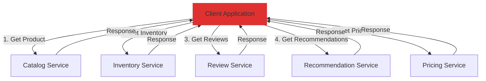
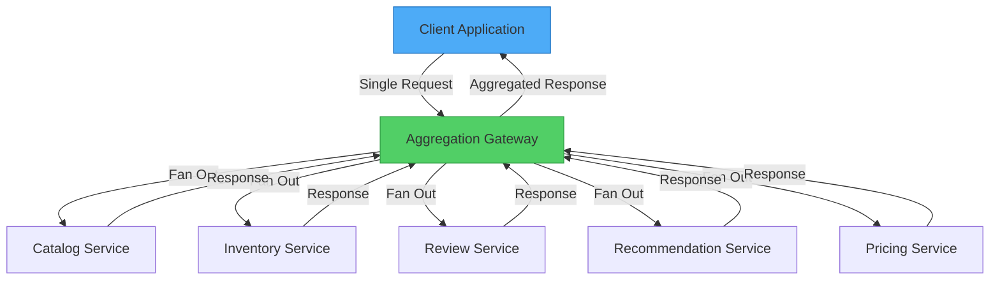

Imagine ordering a meal at a restaurant. Instead of making separate trips to the kitchen for your appetizer, main course, side dishes, and dessert, the waiter aggregates your entire order and brings everything together in coordinated courses. This is the essence of the Gateway Aggregation pattern—a single point that collects multiple requests and delivers a unified response.

## The Problem: Too Many Calls

Modern applications often need data from multiple backend services to complete a single user action. Consider a product page that displays:

- Product details from the catalog service
- Inventory status from the warehouse service
- Customer reviews from the review service
- Recommended products from the recommendation engine
- Pricing information from the pricing service

### The Chatty Approach

Without aggregation, the client makes multiple individual calls:

```javascript
// Client makes 5 separate network calls
class ProductPageClient {
  async loadProductPage(productId) {
    // Each call has network overhead
    const product = await fetch(`https://api.neo01.com/catalog/${productId}`);
    const inventory = await fetch(`https://api.neo01.com/inventory/${productId}`);
    const reviews = await fetch(`https://api.neo01.com/reviews/${productId}`);
    const recommendations = await fetch(`https://api.neo01.com/recommendations/${productId}`);
    const pricing = await fetch(`https://api.neo01.com/pricing/${productId}`);
    
    return {
      product: await product.json(),
      inventory: await inventory.json(),
      reviews: await reviews.json(),
      recommendations: await recommendations.json(),
      pricing: await pricing.json()
    };
  }
}
```



!!!warning "⚠️ Problems with Multiple Calls"
    **High Latency**: Each request adds network round-trip time
    
    **Resource Intensive**: Multiple connections consume client resources
    
    **Failure Prone**: More calls mean more opportunities for failure
    
    **Mobile Unfriendly**: Cellular networks amplify latency issues
    
    **Complex Error Handling**: Managing failures across multiple calls

### The Real Cost

On a high-latency network (e.g., 100ms round-trip):

```
Sequential calls: 5 requests × 100ms = 500ms minimum
Parallel calls: 100ms + connection overhead + processing time
```

Even with parallel requests, you're managing multiple connections, handling multiple failure scenarios, and consuming more battery on mobile devices.

## The Solution: Gateway Aggregation

Place a gateway between the client and backend services. The gateway receives a single request, fans out to multiple services, aggregates the responses, and returns a unified result.



### Simple Implementation

```javascript
// Client makes ONE call
class ProductPageClient {
  async loadProductPage(productId) {
    const response = await fetch(
      `https://gateway.neo01.com/product-page/${productId}`
    );
    return await response.json();
  }
}

// Gateway handles aggregation
class AggregationGateway {
  async getProductPage(req, res) {
    const { productId } = req.params;
    
    // Fan out to all services in parallel
    const [product, inventory, reviews, recommendations, pricing] = 
      await Promise.all([
        this.catalogService.getProduct(productId),
        this.inventoryService.getStock(productId),
        this.reviewService.getReviews(productId),
        this.recommendationService.getRecommendations(productId),
        this.pricingService.getPrice(productId)
      ]);
    
    // Aggregate and return
    res.json({
      product,
      inventory,
      reviews,
      recommendations,
      pricing
    });
  }
}
```

## Key Benefits

### 1. Reduced Network Overhead

**Before**: 5 requests from client to cloud
```
Client → [100ms] → Service 1
Client → [100ms] → Service 2
Client → [100ms] → Service 3
Client → [100ms] → Service 4
Client → [100ms] → Service 5
Total: 500ms (sequential) or 100ms + overhead (parallel)
```

**After**: 1 request from client, 5 requests within data center
```
Client → [100ms] → Gateway
Gateway → [1ms] → Service 1
Gateway → [1ms] → Service 2
Gateway → [1ms] → Service 3
Gateway → [1ms] → Service 4
Gateway → [1ms] → Service 5
Gateway → [100ms] → Client
Total: ~200ms
```

### 2. Simplified Client Code

```javascript
// Before: Complex client logic
class ComplexClient {
  async loadData() {
    try {
      const results = await Promise.allSettled([
        this.fetchService1(),
        this.fetchService2(),
        this.fetchService3()
      ]);
      
      // Handle partial failures
      const data = {};
      results.forEach((result, index) => {
        if (result.status === 'fulfilled') {
          data[`service${index + 1}`] = result.value;
        } else {
          data[`service${index + 1}`] = null;
          this.logError(result.reason);
        }
      });
      
      return data;
    } catch (error) {
      // Error handling
    }
  }
}

// After: Simple client logic
class SimpleClient {
  async loadData() {
    return await fetch('https://gateway.neo01.com/aggregated-data')
      .then(res => res.json());
  }
}
```

### 3. Centralized Error Handling

```javascript
class ResilientGateway {
  async aggregateData(req, res) {
    const results = await Promise.allSettled([
      this.fetchCriticalData(),
      this.fetchOptionalData1(),
      this.fetchOptionalData2()
    ]);
    
    // Critical data must succeed
    if (results[0].status === 'rejected') {
      return res.status(503).json({
        error: 'Critical service unavailable'
      });
    }
    
    // Optional data can fail gracefully
    res.json({
      critical: results[0].value,
      optional1: results[1].status === 'fulfilled' ? results[1].value : null,
      optional2: results[2].status === 'fulfilled' ? results[2].value : null
    });
  }
}
```

## Implementation Patterns

### Pattern 1: Simple Aggregation

Combine responses as-is:

```javascript
class SimpleAggregator {
  async aggregate(userId) {
    const [profile, orders, preferences] = await Promise.all([
      this.userService.getProfile(userId),
      this.orderService.getOrders(userId),
      this.preferenceService.getPreferences(userId)
    ]);
    
    return { profile, orders, preferences };
  }
}
```

### Pattern 2: Data Transformation

Transform and combine data:

```javascript
class TransformingAggregator {
  async aggregate(userId) {
    const [user, orders, reviews] = await Promise.all([
      this.userService.getUser(userId),
      this.orderService.getOrders(userId),
      this.reviewService.getReviews(userId)
    ]);
    
    // Transform and enrich
    return {
      user: {
        id: user.id,
        name: user.fullName,
        memberSince: user.createdAt
      },
      stats: {
        totalOrders: orders.length,
        totalSpent: orders.reduce((sum, o) => sum + o.amount, 0),
        reviewCount: reviews.length,
        averageRating: this.calculateAverage(reviews)
      },
      recentActivity: this.combineActivity(orders, reviews)
    };
  }
}
```

### Pattern 3: Conditional Aggregation

Fetch data based on conditions:

```javascript
class ConditionalAggregator {
  async aggregate(productId, options) {
    // Always fetch product
    const product = await this.catalogService.getProduct(productId);
    
    // Conditionally fetch additional data
    const requests = [Promise.resolve(product)];
    
    if (options.includeReviews) {
      requests.push(this.reviewService.getReviews(productId));
    }
    
    if (options.includeRelated) {
      requests.push(this.recommendationService.getRelated(productId));
    }
    
    if (product.type === 'physical') {
      requests.push(this.inventoryService.getStock(productId));
    }
    
    const results = await Promise.all(requests);
    
    return this.buildResponse(results, options);
  }
}
```

## Advanced Considerations

### Timeout and Partial Responses

Handle slow services gracefully:

```javascript
class TimeoutAwareGateway {
  async aggregateWithTimeout(productId) {
    const timeout = (ms, defaultValue) => 
      new Promise(resolve => setTimeout(() => resolve(defaultValue), ms));
    
    const [product, inventory, reviews] = await Promise.all([
      // Critical: no timeout
      this.catalogService.getProduct(productId),
      
      // Optional: 500ms timeout
      Promise.race([
        this.inventoryService.getStock(productId),
        timeout(500, { available: false, message: 'Check back later' })
      ]),
      
      // Optional: 1000ms timeout
      Promise.race([
        this.reviewService.getReviews(productId),
        timeout(1000, { reviews: [], message: 'Reviews temporarily unavailable' })
      ])
    ]);
    
    return { product, inventory, reviews };
  }
}
```

### Caching Strategy

Reduce backend load with caching:

```javascript
class CachingGateway {
  constructor() {
    this.cache = new Cache();
  }
  
  async aggregate(productId) {
    // Check cache first
    const cached = await this.cache.get(`product:${productId}`);
    if (cached) {
      return cached;
    }
    
    // Fetch and cache
    const data = await this.fetchAndAggregate(productId);
    
    // Cache with different TTLs
    await this.cache.set(`product:${productId}`, data, {
      ttl: 300 // 5 minutes
    });
    
    return data;
  }
}
```

### Circuit Breaking

Protect against cascading failures:

```javascript
class ResilientGateway {
  constructor() {
    this.circuitBreakers = {
      inventory: new CircuitBreaker({ threshold: 5, timeout: 60000 }),
      reviews: new CircuitBreaker({ threshold: 5, timeout: 60000 })
    };
  }
  
  async aggregate(productId) {
    const product = await this.catalogService.getProduct(productId);
    
    // Use circuit breakers for optional services
    const inventory = await this.circuitBreakers.inventory.execute(
      () => this.inventoryService.getStock(productId),
      { fallback: { available: false } }
    );
    
    const reviews = await this.circuitBreakers.reviews.execute(
      () => this.reviewService.getReviews(productId),
      { fallback: { reviews: [] } }
    );
    
    return { product, inventory, reviews };
  }
}
```

## When to Use This Pattern

!!!success "✅ Use Gateway Aggregation When"
    **Multiple Backend Calls**: Client needs data from several services for one operation
    
    **High-Latency Networks**: Mobile or remote clients with slow connections
    
    **Microservices Architecture**: Many small services require coordination
    
    **Consistent API**: Want to provide a stable interface despite backend changes
    
    **Cross-Cutting Concerns**: Need centralized logging, monitoring, or security

!!!warning "⚠️ Avoid Gateway Aggregation When"
    **Single Service**: Only calling one backend service (use direct connection)
    
    **Low Latency Network**: Client and services are in the same data center
    
    **Real-Time Streaming**: Need continuous data streams, not request-response
    
    **Simple Batch Operations**: Backend service already provides batch endpoints

## Gateway Aggregation vs. Other Patterns

### vs. Backend for Frontend (BFF)

```
Gateway Aggregation: Generic aggregation for any client
BFF: Specialized aggregation per client type (web, mobile, etc.)
```

### vs. API Composition

```
Gateway Aggregation: Gateway-level aggregation
API Composition: Application-level aggregation
```

### vs. GraphQL

```
Gateway Aggregation: Fixed aggregation endpoints
GraphQL: Client-specified aggregation queries
```

## Monitoring and Observability

Track gateway performance:

```javascript
class ObservableGateway {
  async aggregate(req, res) {
    const startTime = Date.now();
    const requestId = req.headers['x-request-id'];
    
    try {
      // Track individual service calls
      const results = await Promise.all([
        this.timedCall('catalog', () => this.catalogService.get(req.params.id)),
        this.timedCall('inventory', () => this.inventoryService.get(req.params.id)),
        this.timedCall('reviews', () => this.reviewService.get(req.params.id))
      ]);
      
      // Record metrics
      this.metrics.recordLatency('gateway.aggregate', Date.now() - startTime);
      this.metrics.increment('gateway.success');
      
      res.json(this.combineResults(results));
    } catch (error) {
      this.metrics.increment('gateway.error');
      this.logger.error('Aggregation failed', { requestId, error });
      throw error;
    }
  }
  
  async timedCall(serviceName, fn) {
    const start = Date.now();
    try {
      const result = await fn();
      this.metrics.recordLatency(`service.${serviceName}`, Date.now() - start);
      return result;
    } catch (error) {
      this.metrics.increment(`service.${serviceName}.error`);
      throw error;
    }
  }
}
```

## Conclusion

The Gateway Aggregation pattern transforms chatty client-server communication into efficient, single-request interactions. By centralizing the aggregation logic, you reduce network overhead, simplify client code, and gain a powerful point for implementing cross-cutting concerns like caching, monitoring, and resilience patterns.

The pattern shines in microservices architectures and mobile applications where network latency is a critical factor. However, remember that the gateway itself can become a bottleneck or single point of failure—design it with scalability and resilience in mind.

## References

- [Gateway Aggregation Pattern - Microsoft Architecture Center](https://learn.microsoft.com/en-us/azure/architecture/patterns/gateway-aggregation)
